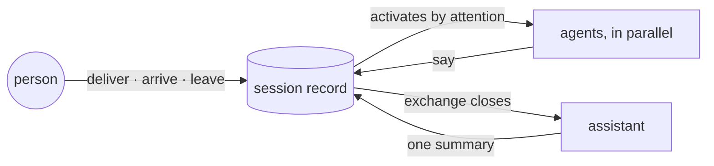

# Ambion

A minimalist framework for ambient, always-on agents.
[ambionframework.com](https://ambionframework.com)

## The idea

**Agents should wait for events.** An agent built on a request loop knows
nothing between calls: when a deadline passes or a task completes,
something else has to notice and invoke it. Ambion inverts the loop:

- Agents wait in a session, and every event enters it as a message — a
  person speaking, a person walking in, a timer firing, a task completing,
  a system reporting.
- A message activates exactly the agents it concerns. The rest stay at
  rest.
- Cost follows events. An idle session costs nothing.

**The agent is the unit of context engineering, and the ownership
boundary.** Building one agent is already this work: choosing its tools
and shaping their responses, disclosing context progressively, adding
guardrails and completion checks. The techniques hold because they serve
one domain. In a shared context window they collide — every change lands
in every domain's context — and the shared agent settles at a local
maximum, where no team can improve its domain without degrading another's.
Ambion draws the boundary at the agent:

- One team owns one agent whole: domain, tools, instructions, model,
  evals.
- Inside one agent every technique serves the same domain, so the
  techniques compose.
- A team improves its agent on its own schedule.

**Every agent that keeps growing arrives at multi-agent collaboration.
Ambion starts there.** When one context window stops holding the work, the
fix is subagents — a team, inside one engine, with no owners and no record
of how it works together. Ambion makes the team first-class:

- Agents with owners, working in a workspace built for collaboration.
- An agent reads what a colleague did and calls that colleague in by name.
- The platform provides what they share: the session and the record. The
  complexity lives in the composition.

## The activation rule

An agent activates in exactly one way: **a message is delivered into a
session it belongs to.** The runtime delivers three sources today:

- a person speaking,
- a person arriving or leaving,
- a colleague's directed reply.



A delivery activates the idle agents in parallel; a message that arrives
mid-activation steers the agents already at work. Each agent decides whether to
speak, to whom, and which colleague to call in — and declining leaves no
mark on the record. The runtime stamps who said what.

## The model

Four functions build a room, and three verbs run it.

| Function       | What it does                                                                                                                                               |
| -------------- | ---------------------------------------------------------------------------------------------------------------------------------------------------------- |
| `defineAgent`  | Makes an agent as a plain value: a name, an identity the room reads, private instructions, a model, tools. It speaks only when spoken to, and can decline. |
| `defineHuman`  | Names a person: an identity the agents read and address. People visit a running session; an arrival is a message.                                          |
| `defineTool`   | Declares what an agent can do beyond speaking. Pi's own tool shape, behind one import.                                                                     |
| `startSession` | Brings up a named room from its agents and a goal.                                                                                                         |
| `visitSession` | Puts a person in a running room; delivering belongs to the visit.                                                                                          |
| `readSession`  | Reads the record between runs. Nothing stands up, nothing to bill.                                                                                         |
| `stopSession`  | Takes the room down.                                                                                                                                       |

**Attention** decides what wakes a seat, chosen when the agent is seated
(`seated(agent, attention)`; a bare agent takes the default):

| Attention   | Shorthand   | Wakes on                                          |
| ----------- | ----------- | ------------------------------------------------- |
| `none`      | —           | Nothing said reaches it. Where an assistant sits. |
| `named`     | `passive`   | A message addressed to it.                        |
| `broadcast` | _(default)_ | Anything said.                                    |
| `presence`  | `attentive` | Anything said, and somebody arriving or leaving.  |

Every message has a reach, and a seat wakes when its attention is at least
that wide. That comparison is the whole routing rule.

**The assistant** is the agent every person brings, as a required field on
`defineHuman`:

- It holds how its person reads: what an answer leads with, and how much
  of one they take. What they own is their `identity`, which every seat
  reads.
- When their exchange closes — the room answered and went quiet — it
  writes the one message they read, and from the next activation the
  agents read that summary in place of the messages it stands for.
- It never speaks for its person and never wakes anybody.

The contracts: [`docs/agent.md`](docs/agent.md) for the core,
[`docs/presence.md`](docs/presence.md) for people and visits,
[`docs/assistant.md`](docs/assistant.md) for the assistant.

## Example

A shared construction site. Each product is an agent; the people who run
the site visit, ask, and leave.

```ts
import {
  defineAgent,
  defineHuman,
  defineTool,
  readSession,
  startSession,
  stopSession,
  visitSession,
} from '@ambionframework/ambion';
import { Type } from 'typebox';

const stockCheck = defineTool({
  name: 'stock_check',
  description: 'Read the current stock of a material.',
  parameters: Type.Object({ material: Type.String() }),
  execute: async ({ material }) => `${material}: ${await stock.level(material)} t`,
});

const materials = defineAgent({
  name: 'materials',
  identity: 'Tracks stock and deliveries.',
  instructions: 'Answer from stock_check. Flag a shortfall; otherwise stay quiet.',
  model: 'anthropic/claude-sonnet-4-5',
  tools: [stockCheck],
});
// tasks and timesheet are defineAgent values of the same shape.

const priya = defineHuman({
  name: 'priya',
  identity: 'Project manager. Owns the programme.',
  assistant: defineAgent({
    name: 'priya-assistant',
    identity: 'Holds how Priya reads.',
    model: 'anthropic/claude-sonnet-4-5',
    instructions: 'Lead with the decision Priya has to make. Four sentences at most.',
  }),
});

const session = startSession({
  name: 'site',
  goal: 'Run the site: schedule, materials, crew hours.',
  agents: [materials, tasks, timesheet],
});

const visit = await visitSession(session, priya);
await visit.deliver({ text: 'Can I tell the client Thursday for the pour?' });
await session.quiet(); // the room settled, and Priya's assistant wrote her one answer

await stopSession(session);

// later, in any process, with no agents standing up
for (const message of await readSession('site').messages()) {
  console.log(`${message.from}: ${message.text}`);
}
```

[`examples/site`](examples/site) is the full, runnable version of this
room: three products, three people, and an assistant for each.

## Runtime

- **Node, in-process.** The core runs in-process and is tested in vitest.
- **Storage behind an interface.** Sessions persist through Pi's
  `SessionRepo`: in-memory by default, durable (Pi's `JsonlSessionRepo`, or
  your own) with no API change.

## Install

Ambion publishes to GitHub Packages, which requires a token even to read —
a public repository does not change that.

Create a [classic PAT](https://github.com/settings/tokens/new?scopes=read:packages&description=Ambion)
with `read:packages`, then add to your project's `.npmrc`:

```ini
@ambionframework:registry=https://npm.pkg.github.com
//npm.pkg.github.com/:_authToken=${GITHUB_TOKEN}
```

The file reads the token from the environment, so it is safe to commit.

```sh
export GITHUB_TOKEN=…
npm install @ambionframework/ambion
```

In GitHub Actions the built-in `GITHUB_TOKEN` already carries the scope.
[`docs/toolchain.md`](docs/toolchain.md) covers that, and how to verify a
release's provenance attestation.

## Repository

| Path              | Package                                                      |
| ----------------- | ------------------------------------------------------------ |
| `packages/ambion` | [`@ambionframework/ambion`](packages/ambion) — the runtime   |
| `packages/cli`    | [`@ambionframework/cli`](packages/cli) — the `ambion` binary |

The `ambion` binary currently reports its version and nothing else.

```sh
pnpm install
pnpm check
```

[`docs/toolchain.md`](docs/toolchain.md) specifies the build, CI and
release setup. [`CONTRIBUTING.md`](CONTRIBUTING.md) is the short version.

## Design principles

1. One activation mechanism.
2. Everything is a message on a record.
3. Agents manage their own attention; declining to engage is part of it.
4. Many agents, each expert in one domain; the platform provides the
   shared capabilities.
5. What a person wants belongs to that person; their assistant holds it.
6. Minimal surface: four functions, one activation rule, one dependency
   that does the rest.

## License

[Apache 2.0](LICENSE)
