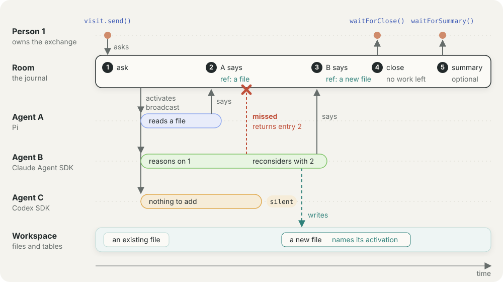

# Ambion

**Build applications as independently owned agents collaborating behind one
human-facing assistant.**

[ambionframework.com](https://ambionframework.com) · [worked demos](demos) ·
[design contracts](docs)

Ambion is for applications made from domain agents: one for scheduling, one for
inventory, one for compliance, or whatever the application owns. Each keeps
its own context, model, tools, workspace, and team. One assistant owns the
human-facing conversation, selects relevant specialists from a host-defined
reserve, and consolidates their work when needed.

Once an application takes this shape, routing a prompt is not the hard problem.
Collaboration is: agents and people must stay ordered, informed, and
accountable without collapsing every domain back into one context or making a
person read a swarm transcript. Ambion provides that collaboration layer
through a shared record, durable seats, attention-based routing, optimistic
concurrency, exchanges, and summaries.



## The architectural bet

**The agent is the modularity boundary.** A context window stops being a useful
module as unrelated domains accumulate inside it: every new instruction, tool,
and piece of state can change the behaviour of everything already there. A
prompt, skill, or tool still shares that failure domain. A separately owned
agent does not.

Ambion therefore keeps domains separate and makes collaboration explicit:

- A scheduling agent can change without retesting a materials agent's entire
  prompt.
- Each agent sees the shared discussion but retains its own model session,
  tools, and workspace authority.
- Specialists can be held in reserve and seated when a question needs them.
- The assistant remains the stable conversational interface as the collection
  of agents behind it changes.
- The human reads one coherent result rather than a swarm transcript.

The trajectory is an application architecture that grows by adding coherent,
independently owned agents rather than by making one agent progressively less
coherent. In that architecture, collaboration across agents and humans is the
key infrastructure problem. The rest of Ambion follows from taking it
seriously.

## Key technical decisions

### 1. The record is the source of truth

Speech, arrivals, departures, dynamic seating, and summaries are all ordered
messages. [`RoomLog`](packages/ambion/src/log/log.ts) serializes writes, assigns
monotonic sequence numbers, persists a message before exposing it, and makes
retries safe with idempotency keys. Presence is therefore data, not side
metadata: it participates in ordering, replay, routing, and later context.

### 2. Conversation uses optimistic concurrency

Every agent write carries `readThrough`, the last sequence the activation has
seen. If the record advanced, `RoomLog.commit()` refuses the draft and returns
the missed messages. The activation can rebuild from a fresh room view and
decide again.

This is compare-and-swap for conversation. “Do not speak over context you have
not read” is enforced at the commit boundary instead of left as a prompt
instruction.

### 3. Silence is a result

A normal activation receives the `say` hand. Calling it appends a message;
finishing without calling it appends nothing. The runtime does not manufacture
an empty acknowledgement just because a model was activated. This makes it
cheap, semantically, to wake all plausibly relevant agents and let each decide
whether it has something new to contribute.

### 4. Attention is not activity

A seat is `active` or `idle` according to whether it is currently running.
Separately, it occupies one point on an ordered attention scale:

```text
none < named < broadcast < presence
```

The scale describes the widest event that wakes the seat. A named message still
reaches its addressee; broader seats additionally hear room speech and then
presence changes. This keeps lifecycle state out of routing policy. See
[`seat.ts`](packages/ambion/src/seat/seat.ts) for the routing rule.

### 5. An activation can be steered without breaking a provider turn

Messages arriving during a provider request are queued as steers. They are
injected after the current request boundary, not used to restart work in the
middle of a coherent model turn. When the log has moved beyond what the
activation read, it rebuilds against a fresh room view. The implementation is
in [`activation.ts`](packages/ambion/src/seat/activation.ts).

### 6. Quiescence defines an exchange

A human question opens an exchange. When the participating seats stop and no
work remains owed, the room closes it. The exchange stores only its owner and
sequence range; its contents remain derivable from the log.

Quiescence is the semantic boundary. No coordinator has to predict which agent
will have the final word, and no agent needs special authority to declare the
work complete. Pending wakes and claimed leases jointly determine liveness, so
there is no separate activation counter to drift from reality. See
[`exchange.ts`](packages/ambion/src/room/exchange.ts) and
[`lease.ts`](packages/ambion/src/room/lease.ts).

### 7. The assistant owns synthesis, not the application

The assistant is the conversational interface, not a UI framework or a
privileged coordinator. It is an ordinary seat with its own model session and
activation history, but no general `say` hand, workspace, or general-purpose
authority. It receives two narrow capabilities:

- `seat` while composing a roster from agents the host placed in reserve;
- `summarise` after an exchange closes.

Seating a specialist is itself an auditable message. When two or more agent
messages need consolidation, the summary names the exact sequence range it
covers. Agent contexts fold that range to the same summary intended for the
person, and clients can present the same compacted account. The durable record
remains intact; only its rendered views are compacted. See
[`assistant.ts`](packages/ambion/src/room/assistant.ts) and
[`view.ts`](packages/ambion/src/room/view.ts).

### 8. Boundaries are small and serializable

The core depends on narrow host interfaces: `Clock`, `SessionOpener`,
`ModelResolver`, `Transport`, and `WorkspaceBackend`. They isolate time,
persistence, model resolution, seat execution, and workspace storage from room
semantics.

Likewise, [`wire.ts`](packages/ambion/src/wire.ts) restricts room/seat traffic
to plain JSON values and four operations: `wake`, `view`, `commit`, and `lease`.
Seats run in-process today by default, but the protocol does not depend on
shared object identity. It is intentionally shaped for process-separated
agents later.

Workspace access follows the same capability-oriented design. An agent gets
workspace tools only when its definition names a workspace, and access is
resolved for each tool call through a backend. The core names the backend as a
port and holds no filesystem. `@ambionframework/workspace` provides two
backends behind that port, one in memory and one over a real directory;
stronger isolation can be added behind the same interface. See
[`docs/workspace.md`](docs/workspace.md).

## A minimal sketch

```ts
import { defineAgent, defineHuman, startSession, visitSession } from '@ambionframework/ambion';

const materials = defineAgent({
  name: 'materials',
  identity: 'Owns stock levels and deliveries.',
  instructions: 'State a material constraint if one changes the answer; otherwise stay quiet.',
  model: 'anthropic/claude-sonnet-4-5',
  tools: [stockCheck],
});

const assistant = defineAgent({
  name: 'assistant',
  identity: 'Writes the one answer the person reads.',
  instructions: 'Lead with the decision, then only the facts it turns on.',
  model: 'anthropic/claude-sonnet-4-5',
});

const priya = defineHuman({
  name: 'priya',
  identity: 'Project manager responsible for the programme.',
  preferences: 'Four sentences at most.',
});

const session = startSession({
  name: 'site',
  goal: 'Keep the construction programme, materials, and labour plan consistent.',
  assistant,
  agents: [materials],
  available: [buildingControl, plantHire],
});

const visit = await visitSession(session, priya);
await visit.deliver({ text: 'Can I promise the client a Thursday pour?' });
await session.quiet();
```

The assistant may seat relevant reserve agents, the domain seats work in
parallel, and conflicting drafts are reconsidered against the newer record.
`quiet()` waits until the room has no work left, including any assistant summary
the exchange requires. A single agent answer remains in that agent's voice; an
exchange with no agent answer does not manufacture one.

[`examples/site`](examples/site) is the runnable version: independently owned
products, dynamically selected specialists, multiple people, workspace-backed
tools, and a complete observable record. [`demos/`](demos) contains captured
runs with every activation shown in full.

## What is novel here

Ambion combines familiar distributed-systems mechanisms in a conversational
runtime, with several consequences worth preserving as the library evolves:

- **Optimistic record concurrency for conversation.** Freshness is a runtime
  invariant, not model etiquette.
- **Human-facing synthesis as a separate agent responsibility.** Domain
  reasoning stays independent while one constrained seat consolidates the
  result when needed.
- **Symmetric compaction.** Agent context and the human-facing view can use the
  same summary for the same covered discussion without deleting the record.
- **Dynamic expertise as recorded state.** Selecting a specialist changes the
  replayable roster rather than an invisible coordinator plan.
- **Quiescence as completion.** The actual liveness of seats closes work; an
  orchestrator does not guess the last contributor.
- **Presence in the event model.** Joining and leaving obey the same ordering
  and routing rules as speech.
- **Leases as the room/seat lifecycle bridge.** Pending wakes plus claimed
  leases define whether the room still has work.

## Trajectory

The current implementation is deliberately an executable kernel for this
application architecture rather than a catalogue of orchestration patterns.
Its direction follows from the boundaries already in the code:

1. **More durable hosts without changing room semantics.** Storage, transport,
   clocks, models, and workspaces remain replaceable behind their interfaces.
2. **Process-separated seats.** The JSON-only wire protocol is the seam for
   moving an agent out of the room process while preserving activation and
   commit rules.
3. **Stronger workspace isolation.** Capability assignment stays on the agent
   definition while backends grow from convenient local storage toward harder
   execution boundaries.
4. **Long-lived rooms with bounded model context.** Append-only audit history
   and summary-based views remain separate so retention does not dictate prompt
   size.

The invariant is more important than any particular deployment: domain agents
remain independently owned modules, and everything they do together remains
legible in the room's record.

## Install

Ambion is published to GitHub Packages, which requires a token even for read
access. Create a [classic PAT](https://github.com/settings/tokens/new?scopes=read:packages&description=Ambion)
with `read:packages`, then add this to your project's `.npmrc`:

```ini
@ambionframework:registry=https://npm.pkg.github.com
//npm.pkg.github.com/:_authToken=${GITHUB_TOKEN}
```

```sh
export GITHUB_TOKEN=…
npm install @ambionframework/ambion
```

Agents that reach a workspace also need a backend:

```sh
npm install @ambionframework/workspace
```

## Read the contracts

The design is specified in [`docs/agent.md`](docs/agent.md),
[`docs/exchange.md`](docs/exchange.md), [`docs/presence.md`](docs/presence.md),
[`docs/assistant.md`](docs/assistant.md), [`docs/roster.md`](docs/roster.md),
[`docs/workspace.md`](docs/workspace.md), and [`docs/durability.md`](docs/durability.md),
which says what the record promises when something fails. Build and
contribution instructions are in [`CONTRIBUTING.md`](CONTRIBUTING.md).

## License

[Apache 2.0](LICENSE)
