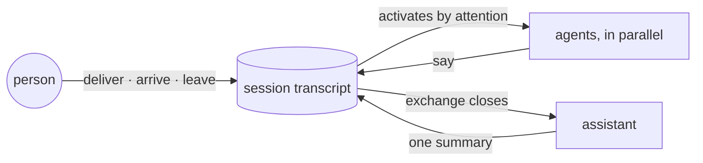

# Ambion

A minimalist framework for ambient, always-on agents.
[ambionframework.com](https://ambionframework.com)

## The bet

A single agent scales until its context window holds one domain too
many. You have felt the first step: a skill or a tool added for one task
made another task worse. The model reads the window whole, so every
domain in it changes how every other domain behaves. A context window
cannot integrate an unbounded number of domains.

That limit sets the module boundary. A module is a unit one team can
change without impacting other teams doing similar work, and nothing
inside a shared window passes that test. The smallest unit that does is
a whole agent: one context window, one domain, one team that owns it.
The agent is the atomic module of intelligence. Subagents split the
window and keep the boundary inside the parent.

Once the agent is the unit, an application that keeps expanding becomes
many agents, and the problem that matters changes. Routing sends a task
to one agent. A complex task needs several agents to read what the
others did and add their part. Every agentic application that expands
in scope discovers this: the problem to solve is agent-to-agent
collaboration.

Agents share one transcript, people work in the session beside them, and
the session's assistant writes each person the one message they read.

## What ships today

- **A runtime.** It runs in Node, in process, and vitest tests it. Pi
  owns the model loop, tools and transcript; just-bash owns the
  filesystem and shell.
- **Three event sources.** A person speaking, a person arriving or
  leaving, and a colleague speaking activate agents. A timer, a task or
  a system reporting is an event of the same kind, and none is delivered
  yet.
- **A transcript that outlives a run.** Pi's `SessionRepo` holds it: in
  memory by default, durable behind the same interface.
- **A workspace per agent.** It is a shared filesystem and shell, in
  memory or over a real directory.
- **A binary.** It reports its version.

## The mechanisms

Every event is a message on the transcript, and a message activates the
agents it reaches. The rules below say who activates, who speaks, and
what a person reads. [`demos/`](demos) holds live runs with every
activation in full.

**Attention decides who activates.** Every message has a reach, every
participant has an attention, and a participant activates when its
attention is at least as wide as the reach. A directed message activates
the one participant it names. An idle session costs nothing.

| Attention   | Shorthand   | Activates on                                     |
| ----------- | ----------- | ------------------------------------------------ |
| `none`      |             | Nothing. The assistant's attention.              |
| `named`     | `passive`   | A message addressed to it.                       |
| `broadcast` | _(default)_ | Anything said.                                   |
| `presence`  | `attentive` | Anything said, and somebody arriving or leaving. |

**Speaking is a tool, and silence is the default.** An activated agent
holds one built-in tool, `say`. An activation that ends without calling
it writes nothing to the transcript. The runtime sets one bar: a reply
must add something the transcript does not already hold. The judgment
lives in the agent's instructions.

**A message commits against a transcript its author has read in full.**
The tool boundary refuses a `say` that raced past unread messages, and
the refusal carries what it missed. The agent decides again: add
something, or end the activation without speaking. The author of every
message on the transcript had read everything before it.

**A question opens an exchange, and idle closes it.** Agents activate
and work it out between them. A message that lands in between steers the
agents already working. It opens no new exchange. The person who asked
owns the exchange until it closes, even after they leave. `deliver`
returns when the question is on the transcript, and `settled()` resolves
at the close. The runtime measures cost per exchange.

**The assistant writes the one message a person reads.** Every session
holds one assistant: an agent that writes for whoever asked. A person's
definition carries how they read, and the assistant reads it at the one
activation where it writes for them. When their exchange closes with
more than one agent message, it writes the summary they read. When the
exchange closes with one agent message, the person reads that message
unchanged. From the next activation the agents read the summary in place
of the messages it stands for.

**Arriving and leaving are messages.** A participant at `presence`
activates on them, and an agent that knows the session's goal tells the
person what they missed. The roster every agent reads says who is
reading right now, so an agent writes a reply to somebody absent as a
note.

**The runtime stamps provenance.** It writes `from` at the moment a
message lands. Tool calls stay in an agent's own working context, and
other participants read its `say`s only. The transcript is canonical,
and any process can read it by name, running or idle.



## The surface

Five functions build a session, and four verbs run it.

| Function           | What it does                                                                                                      |
| ------------------ | ----------------------------------------------------------------------------------------------------------------- |
| `defineAgent`      | Makes an agent as a plain value: name, identity the session reads, private instructions, model, tools, workspace. |
| `defineHuman`      | Names a person: an identity the agents read and address, and how they read, which the assistant reads.            |
| `defineTool`       | Declares what an agent can do beyond speaking. Pi's own tool shape, behind one import.                            |
| `defineWorkspace`  | Names a shared filesystem and shell that an agent's tools reach into. Durable by its name; in memory by default.  |
| `startSession`     | Starts a named session from its agents, its assistant and a goal.                                                 |
| `visitSession`     | Puts a person in a running session. Delivering belongs to the visit.                                              |
| `readSession`      | Reads the transcript between runs. No agent activates, and nothing is billed.                                     |
| `stopSession`      | Stops the session.                                                                                                |
| `destroyWorkspace` | Deletes a workspace and its files.                                                                                |

`seated(agent, attention)` sets the attention of a participant; `passive`
and `attentive` name the two points a session asks for most. `settled()`
resolves when the agents stop and `quiet()` when the assistant has
finished too. `subscribe` streams every session-level fact to the host:
every message, activation, refused race and error, and both edges of
every exchange.

The contracts: [`docs/agent.md`](docs/agent.md) for the core,
[`docs/exchange.md`](docs/exchange.md) for the exchange,
[`docs/presence.md`](docs/presence.md) for people and visits,
[`docs/assistant.md`](docs/assistant.md) for the assistant,
[`docs/workspace.md`](docs/workspace.md) for the workspace.

## Example

A shared construction site. Each product is an agent. The people who run
the site visit, ask, and leave.

```ts
import {
  defineAgent,
  defineHuman,
  defineTool,
  readSession,
  startSession,
  stopSession,
  visitSession,
} from '@ambionframework/ambion';
import { Type } from 'typebox';

const stockCheck = defineTool({
  name: 'stock_check',
  description: 'Read the current stock of a material.',
  parameters: Type.Object({ material: Type.String() }),
  execute: async ({ material }) => `${material}: ${await stock.level(material)} t`,
});

const materials = defineAgent({
  name: 'materials',
  identity: 'Tracks stock and deliveries.',
  instructions: 'Answer from stock_check. Flag a shortfall; otherwise stay silent.',
  model: 'anthropic/claude-sonnet-4-5',
  tools: [stockCheck],
});
// tasks and timesheet are defineAgent values of the same shape

const priya = defineHuman({
  name: 'priya',
  identity: 'Project manager. Owns the programme.',
  preferences: 'Lead with the decision Priya has to make. Four sentences at most.',
});

const assistant = defineAgent({
  name: 'assistant',
  identity: 'Writes the one message a person reads.',
  model: 'anthropic/claude-sonnet-4-5',
  instructions: 'Answer what was asked, once, with the facts the answer turns on.',
});

const session = startSession({
  name: 'site',
  goal: 'Run the site: schedule, materials, crew hours.',
  assistant,
  agents: [materials, tasks, timesheet],
});

const visit = await visitSession(session, priya);
await visit.deliver({ text: 'Can I tell the client Thursday for the pour?' });
await session.quiet(); // resolves when the assistant has written the summary

await stopSession(session);

// reads the transcript from any process; no agent activates
for (const message of await readSession('site').messages()) {
  console.log(`${message.from}: ${message.text}`);
}
```

[`examples/site`](examples/site) is the runnable version: three products,
three people, one assistant. [`demos/`](demos) holds one dated report
per merged change, each a real run of that session.

## Install

Ambion publishes to GitHub Packages, which requires a token even to read.
Create a [classic PAT](https://github.com/settings/tokens/new?scopes=read:packages&description=Ambion)
with `read:packages`, then add these lines to your project's `.npmrc`:

```ini
@ambionframework:registry=https://npm.pkg.github.com
//npm.pkg.github.com/:_authToken=${GITHUB_TOKEN}
```

The file reads the token from the environment, so it is safe to commit.

```sh
export GITHUB_TOKEN=…
npm install @ambionframework/ambion
```

In GitHub Actions the built-in `GITHUB_TOKEN` already carries the scope.
[`docs/toolchain.md`](docs/toolchain.md) covers that, and how to verify a
release's provenance attestation.

## Repository

| Path              | Package                                      | What                |
| ----------------- | -------------------------------------------- | ------------------- |
| `packages/ambion` | [`@ambionframework/ambion`](packages/ambion) | The runtime         |
| `packages/cli`    | [`@ambionframework/cli`](packages/cli)       | The `ambion` binary |

```sh
pnpm install
pnpm check
```

[`docs/toolchain.md`](docs/toolchain.md) specifies the build, CI and
release setup. [`CONTRIBUTING.md`](CONTRIBUTING.md) is the short version.

## License

[Apache 2.0](LICENSE)
