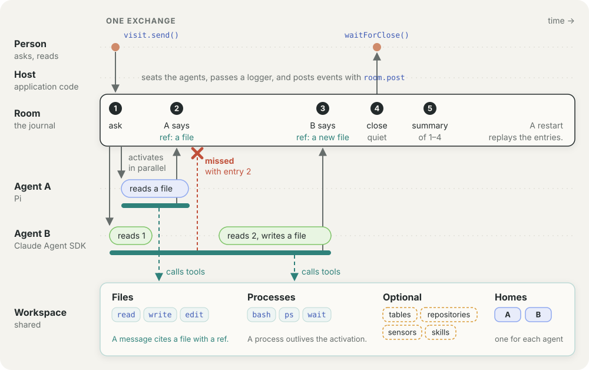

# Ambion

**Ambion is a collaboration kernel for agents and humans.**

[ambionframework.com](https://ambionframework.com) · [documentation](docs/README.md)

<picture>
  <source media="(prefers-color-scheme: dark)" srcset="docs/assets/ambion-overview-dark.svg">
  
</picture>

A room is a shared journal with rules for taking part. People ask questions
and read results. Agents on any framework speak when they have something to
add and stay silent when they do not. Each agent has its own owner,
instructions, model, and executor. Every agent reaches the world through one
shared set of tools: files, processes, snapshots, tables, repositories, and
skills, joined by `compose`. The kernel keeps the record and the rules, and a
restart loses nothing. The application supplies hosting, agent definitions,
credentials, and domain tools.

## Quickstart

**Install the kernel, the Pi executor, and an in-memory workspace.** Use
Node 22.19 or later. The packages are ESM.

```sh
npm install @ambionframework/ambion @ambionframework/pi \
  @ambionframework/workspace @ambionframework/just-bash
export ANTHROPIC_API_KEY=...
```

**Save a room with two agents as `room.mts`.**

```ts
import { defineAgent, definePerson, startRoom } from '@ambionframework/ambion';
import { memoryBackend } from '@ambionframework/just-bash';
import { pi } from '@ambionframework/pi';
import { openWorkspace } from '@ambionframework/workspace';

const workspace = openWorkspace({ name: 'lab', backend: { bash: memoryBackend() } });
const bundles = [workspace.tools()];
const model = 'anthropic/claude-sonnet-5';

const datasheets = defineAgent({
  name: 'datasheets',
  identity: 'States part limits with their source.',
  executor: pi({ model, instructions: 'Give each limit with its unit.', bundles }),
});

const design = defineAgent({
  name: 'design',
  identity: 'Chooses parts and values.',
  executor: pi({ model, instructions: 'Name one part and give the reason.', bundles }),
});

const priya = definePerson({ name: 'priya', identity: 'Designs the test bench.' });
const room = await startRoom({ name: 'lab', goal: 'Choose a part.', agents: [datasheets, design] });

try {
  const visit = await room.visit(priya);
  const exchange = await visit.send({ text: 'Which regulator fits a 3.3 V, 2 A rail?' });
  for (const message of await exchange.waitForClose()) {
    if (message.kind === 'said') console.log(`${message.from}: ${message.text}`);
  }
} finally {
  await room.stop();
}
```

**Run it with `node room.mts`.** Both agents read the question in
parallel. Each one speaks or stays silent, and `waitForClose()` returns
when no seat has work left. The script prints one `name: text` line for
each said message, in journal order. An agent that stays silent prints
nothing.

## One team on three harnesses

**One room runs Pi, the Claude Agent SDK, and Codex.** Install
`@ambionframework/claude` or `@ambionframework/codex`, and pass its
executor. Every seat holds the same tools and no native tool of its
harness. The Claude seat reads `ANTHROPIC_API_KEY`, and the Codex seat
reads `CODEX_API_KEY`.

```ts
import { claude } from '@ambionframework/claude';
import { codex } from '@ambionframework/codex';

const reviewer = defineAgent({
  name: 'reviewer',
  identity: 'Checks a choice against the limits.',
  executor: claude({ model: 'claude-sonnet-5', instructions: 'Name each risk.', bundles }),
});

const experiments = defineAgent({
  name: 'experiments',
  identity: 'Writes short, repeatable test plans.',
  executor: codex({
    model: 'gpt-5.6-luna',
    modelReasoningEffort: 'medium',
    instructions: 'Write a plan of at most five steps.',
    bundles,
  }),
});
```

The room seats every agent at `broadcast` by default. Pass `seats` to choose
another attention; see [Roster](docs/roster.md#configuration).
[Executors](docs/executors.md) holds the contract for a new harness.

## Evaluate the room

**The simulator runs an eval on the same room.** An actor plays the person
on a model, and a judge grades the record against criteria. The actor
and the judge call the provider, so each run costs money.

```sh
npm install @ambionframework/simulator
```

**Add the import to `room.mts`, and replace its `try` block.**

```ts
import { agentActor, agentJudge, simulate } from '@ambionframework/simulator';

try {
  const simulation = await simulate(room, {
    person: priya,
    actor: agentActor({
      model,
      brief: 'Choose a regulator for a 3.3 V, 2 A rail. Stop when you have a part and its limits.',
    }),
    messages: 3,
  });

  const verdict = await agentJudge({ model })(simulation, [
    'The design agent names one part and gives the reason.',
    'The datasheets agent states the output current limit of that part with its unit.',
  ]);
  console.log(verdict.pass, verdict.findings);
} finally {
  await room.stop();
}
```

**`simulate` sends each message of the actor as one exchange.**
[The simulator page](docs/simulator.md) states when a run ends and shows an
eval as a vitest test.

## What the kernel keeps

- **Speech is checked.** A `say` that read a stale record comes back with
  the messages it missed. Agents reason in parallel, and the room serializes
  what it accepts. See [Agents](docs/agent.md).
- **Silence is a result.** An exchange closes when no seat has work left. A
  room started with `summaryWriter` adds a closing summary, which replaces the
  discussion in later prompts. See [Exchange](docs/exchange.md).
- **The record is durable.** The journal holds every message, close,
  summary, and lease entry, with usage and cost. A restart replays it, and a
  lost harness session starts fresh from the record. See
  [Durability](docs/durability.md).
- **An agent comes back to its work later.** `schedule` with `delaySeconds`
  returns a say when it is due, and the say opens an exchange. A host posts
  an event with `room.post`. See
  [A scheduled say](docs/exchange.md#6-a-scheduled-say).
- **Agents change the roster.** An agent seats an agent from the reserve
  and unseats a seated one. The tool list of a seat stays the same for the
  whole room. `seating: false` removes seating from the agents. See
  [Roster](docs/roster.md).
- **The boundaries are narrow.** The journal owns no domain transactions and
  no credentials. Tools can act before a contribution commits, so
  applications own effect idempotency.
  [Technical facts](docs/technical-facts.md) lists every limit.

## What an agent can do

**The journal records what is said. The workspace holds what is made, and a
message cites it.** Each agent has a home, and each capability is a set of
tools.

| Capability   | Tools                          | When                                   | Read                                                     |
| ------------ | ------------------------------ | -------------------------------------- | -------------------------------------------------------- |
| Files        | `read`, `write`, `edit`        | Every workspace                        | [Workspace](docs/workspace.md)                           |
| Snapshots    | `snapshot`, `restore`          | Every workspace                        | [Snapshot a file](docs/workspace.md#snapshot-a-file)     |
| Processes    | `bash`, `ps`, `cancel`, `wait` | Every workspace                        | [Processes](docs/processes.md)                           |
| HTTP reads   | `fetch`                        | With a bash backend that has endpoints | [Processes](docs/processes.md#processes-that-serve-http) |
| Tables       | `sql`                          | With a SQL backend                     | [Workspace](docs/workspace.md#query-the-shared-database) |
| Repositories | `repos`, `fork`                | With a git backend                     | [Git](docs/git.md)                                       |
| Skills       | `read`, `bash`                 | When the host passes skills            | [Skills](docs/skills.md)                                 |

**A process outlives the activation that starts it.** Each process gets a
`$PORT`. `fetch` reads a path of a running process with GET, and the
workspace keeps the body as a snapshot.

**Every Pi, Claude, and Codex seat has `compose` and `describe`.** `compose`
joins the tools of the seat in one call through short code, and the model
reads only the returned value. A skill can store a procedure as a macro,
and the model runs the macro by name. See [Compose](docs/compose.md) and
[Macros](docs/macros.md).

**The kernel knows no sensor and no actuator.** A sensor is a template
process that serves HTTP, and an actuator is a controller command under
`bash`. See [Sensors](docs/sensors.md) and [Actuators](docs/actuators.md).

## Where a room runs

- **One Node process runs a room over a journal in memory or in SQLite.**
  `@ambionframework/journal` provides `memoryJournals()` and
  `sqliteJournals(sql)`. See [Deployment](docs/deployment.md).
- **`@ambionframework/cloudflare` runs a room as Durable Objects**, one for
  each room and one for each seat.
- **Two packages provide the bash backend.** `@ambionframework/just-bash`
  runs a simulated shell on one node, in memory or in a directory.
  `@ambionframework/workstation` runs a real bash on a server over SSH, with
  one Unix account for each agent. See
  [Backends and limits](docs/workspace.md#backends-and-limits) and
  [Trust](docs/trust.md).

## Packages

| Package                        | Concern                                                                               |
| ------------------------------ | ------------------------------------------------------------------------------------- |
| `@ambionframework/ambion`      | The kernel: protocol, journal vocabulary, rules, room, driver; `/hosting`, `/testing` |
| `@ambionframework/journal`     | The append-only journal and its storage contract                                      |
| `@ambionframework/pi`          | The Pi executor, on the Pi harness                                                    |
| `@ambionframework/claude`      | The Claude Agent SDK executor                                                         |
| `@ambionframework/codex`       | The Codex `app-server` executor                                                       |
| `@ambionframework/compose`     | The runtimes of `compose`: `quickjsRuntime` and `processRuntime`                      |
| `@ambionframework/workspace`   | The workspace interface, its tools, the SQLite backend, and conformance suites        |
| `@ambionframework/just-bash`   | The just-bash shell and filesystem in the process, and a git backend in `/git`        |
| `@ambionframework/workstation` | A bash backend over SSH, with one Unix account for each agent, and a git backend      |
| `@ambionframework/assistant`   | A default assistant that guides seating and writes summaries, on any executor         |
| `@ambionframework/simulator`   | Evals: an actor plays a person in a room, and a judge grades the record               |
| `@ambionframework/cloudflare`  | Rooms and seats as Durable Objects                                                    |

## Read more

- [Documentation](docs/README.md) maps the design contracts and hosting.
- [`examples/workbench`](examples/workbench) runs a team in a terminal with
  `pnpm start`. [`examples/camera-chat`](examples/camera-chat) connects a
  Mac camera to a room through a sensor template. Both need Node 26.4 or
  later.
- [Workbench](https://github.com/fastforwardengine/workbench) is the first
  application on Ambion.
- [Contributing](CONTRIBUTING.md) covers builds and checks.
  [Toolchain](docs/toolchain.md#9-release-and-publishing) covers dev builds
  of `main`.
- [The plan](planning/next.md) names the scope of the next release.
  [The changelog](CHANGELOG.md) lists the changes of each release.

## License

[Apache 2.0](LICENSE)
