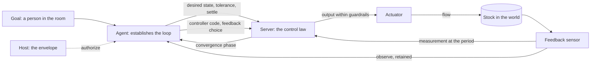

# Actuators

> **Actuators are a design. No package implements them.** The `actuate`
> tool, the actuator part of `connect`, the actuator API, and the host's
> `actuation` option do not exist yet. [Sensors](sensors.md) is the
> implemented counterpart. This design reuses its lifecycle, its
> connections, and its retained evidence. The backlog holds the work as
> [D24](../planning/backlog.md#for-actuators).

**An actuator is the output of a control loop.** To change the world, an
agent establishes a loop. The loop has a desired state, a source of
feedback that measures it, and a controller that runs at the speed that
the plant needs. Guardrails bound every output. A command is one input to
that loop.

**The primary job of the agent is to establish the loop.** It chooses the
feedback. It places the loop at a tier whose latency fits the plant. It
sets the desired state and the criteria for convergence. It then verifies
convergence from retained evidence. Sending a target is the smallest part
of that work.

**The design goal is convergence within guardrails.** The loop drives a
measured stock toward the desired state, inside the safe set, within the
time that the task allows. The server reports whether the loop converges.
The agent cites that report and the feedback behind it.

**A forked Git repository defines an actuator server.** The agent
customizes its control code, validates it against a simulated plant, and
saves working versions on a branch. A running workspace process activates
one version. One server can expose sensors and actuators together.

**The lifecycle is the deployment contract.** Git owns saved versions. The
existing process tools own execution. `connect` attaches a running version
to the workspace. `actuate` sets one desired state, and the workspace
retains the intent and the outcome as snapshots. Ambion adds no separate
actuator definition or deployment service.

**The server owns the inner loop.** Its implementation owns the device
drivers, the control law, the controller state, and the return to a safe
target. The API prescribes no controller, no tuning method, and no state
format.

## Establish a control loop

**A loop has five parts, and the agent answers one question for each.**

| Part          | The question that the agent answers                                  | Where the answer lives                                  |
| ------------- | -------------------------------------------------------------------- | ------------------------------------------------------- |
| Desired state | Which value, within which tolerance, by which time?                  | The command: `target`, `tolerance`, and `settle`        |
| Feedback      | Which measurement shows the stock that the goal names?               | The `feedback` sensor that the actuator index declares  |
| Controller    | Which law turns the error into an output, and at which period?       | The controller code in the fork, and the index `period` |
| Placement     | Which tier closes the loop within its latency budget?                | The device, the server, or the agent                    |
| Guardrails    | Which outputs and states does the loop never reach, and who says so? | The device, the host envelope, the server, and the hold |



**The loop is a balancing loop.** The world holds a stock: a temperature,
a charge, a position, or a volume. The feedback sensor reports the stock.
The actuator changes a flow into or out of it. The error is the difference
between the desired state and the report. The control law turns the error
into the next output.

### Choose the feedback

**The feedback decides what the loop can converge on.** A loop converges
on the value that its feedback measures. A heater loop on the heater's own
power converges on a power. A heater loop on the bath thermometer
converges on the bath temperature. Only the second one serves a goal that
names the bath.

**An appropriate source of feedback meets six conditions.**

1. It measures the stock that the goal names. The actuator's own output
   is not that stock.
2. It samples several times in each time constant of the plant.
3. Its latency is short against the control period.
4. Its resolution and its noise are small against the tolerance.
5. It carries measurement timestamps. [Sensors](sensors.md) makes them
   the source of truth.
6. For a safety limit, it is independent of the feedback of the control
   law. A second sensor on the same stock guards the first.

**Each actuator declares its feedback.** The actuator index names the
sensor of the same server that closes the inner loop. An actuator with no
`feedback` is open loop. The `connect` result and the reminder mark it
open loop. For an open-loop actuator, the agent closes the loop itself
with `observe`, and the placement rules below limit what it can control.

**The agent verifies the feedback before it trusts it.** It observes the
feedback sensor and an independent reference on the same stock, and it
compares them. A template that ships a plant model also ships the
expected response. The agent checks the real response against it.

### Place the loop by its latency

**Each tier closes loops of one speed.**

| Tier            | Loop latency                 | What the tier closes                                             | Real-time class                        |
| --------------- | ---------------------------- | ---------------------------------------------------------------- | -------------------------------------- |
| Device          | Microseconds to milliseconds | Interlocks, current limits, pulse-width modulation, the watchdog | Hard real time                         |
| Server          | Milliseconds to seconds      | The control law on the feedback sensor                           | Soft real time, on the workstation     |
| Agent           | Tens of seconds to hours     | The desired state, the tuning, the controller code, the feedback | None: an activation or a scheduled say |
| Person and host | Hours and longer             | The goals and the envelope                                       | None                                   |

**Close each loop at a tier whose latency is small against the plant.** A
common engineering rule sets the control period at one tenth of the
plant's time constant or less. A water bath with a time constant of ten
minutes tolerates a period of one minute. A motor current with a time
constant of one millisecond needs the device.

**The workspace path has no real-time guarantee.** An activation takes
seconds to minutes. `actuate` and `observe` cross SSH forwarding and the
object store. An agent that closes a fast loop through these tools makes
the stock oscillate. The agent writes that loop into the server code, and
it sets the desired state of that loop.

**The index declares the control period.** Each actuator states `period`,
in milliseconds. The agent compares it with the time constant that it
measured on the plant. A period that is too long for the plant is a
finding. The agent changes the controller or asks for a device loop.

**A long horizon belongs in code.** A behavior that must continue while no
agent is active goes into the controller in the repository. A hold on a
desired state has a maximum. A loop that needs more time than that maximum
is a policy, and a policy is versioned code. An agent does not keep a
stock in place with a chain of renewed commands.

### Converge to the desired state

**A command states the desired state and its criteria.** `target` is the
value. `tolerance` is the band around a level target, in its unit.
`settle` is the number of seconds in which the stock must enter that band
and stay in it. A state target, such as `open`, has no tolerance. Its
feedback confirms the state, for example through a limit switch.

**The server reports a convergence phase.** It computes the phase from the
feedback on its own clock, for the command in force.

| Phase        | Meaning                                                                     |
| ------------ | --------------------------------------------------------------------------- |
| `converging` | The settle time has not ended, and the stock is outside the tolerance       |
| `converged`  | The stock entered the tolerance within the settle time and stays in it      |
| `diverged`   | The settle time ended, and the stock is outside the tolerance               |
| `limited`    | A guardrail holds the output, so the loop cannot reach the desired state    |
| `open`       | The actuator has no feedback, so the server cannot compute convergence      |
| `ended`      | A new command superseded the command, its hold ended, or the server stopped |

**`converged` is the evidence that the agent cites.** `accepted` states
only that the loop took the desired state. The agent schedules its next
activation at the settle time. It observes the state sensor for the phase
and the feedback sensor for the stock, and it cites both refs.

**`diverged` and `limited` are findings.** The agent revises the desired
state, the controller, or the choice of feedback, or it asks a person. It
does not widen a guardrail to reach convergence. A desired state outside
the safe set is a question for the person who owns the goal.

**A converged loop can leave its band.** A disturbance, such as a lid
that opens, moves the stock. The phase goes back to `converging` while the
settle time allows, and to `diverged` after it. The state sensor records
each change of phase with its server time.

### Guardrails at every tier

**A guardrail protects only against the parties that cannot change it.**
Each tier holds its own guardrails. [Authority](#authority) states the
envelope, and [The safe target](#the-safe-target) states the hold.

| Guardrail                                       | Tier   | Who can change it            | What it guards against                          |
| ----------------------------------------------- | ------ | ---------------------------- | ----------------------------------------------- |
| Interlock, watchdog, hardware default           | Device | The lab                      | Every software failure, the host's included     |
| The envelope: `authorize`                       | Host   | The host application         | An agent and the server code that it writes     |
| Range, maximum rate, and `maxHold` in the index | Server | The agent that owns the fork | The mistakes of that agent and of other callers |
| The hold and the safe target                    | Server | The agent that owns the fork | The absence of the agent                        |

**The server clips an output at a guardrail and reports it.** It does not
move the desired state. The phase becomes `limited`, and the state sensor
records the guardrail that holds the output.

### Where an agent intervenes

**Each place to intervene has one owner.** Donella Meadows ranks the
places to intervene in a system. The table maps the places this design
reaches to their mechanisms. The rows go from the least effect to the
most.

| Place to intervene                 | Mechanism                                                               | Owner                                 |
| ---------------------------------- | ----------------------------------------------------------------------- | ------------------------------------- |
| Constants and parameters           | The desired state, the tolerance, and the settle time through `actuate` | The agent that owns the connection    |
| The lengths of delays              | The placement of the loop, its period, and `schedule` with `after`      | The agent, through code and the room  |
| Balancing feedback loops           | The control law in the fork                                             | The agent, through Git                |
| The structure of information flows | The feedback that closes the loop, and the evidence that an agent cites | The agent, through code and `observe` |
| The rules of the system            | The envelope: the commands that the host allows                         | The host, through `authorize`         |
| The power to change structure      | Fork, customize, validate, save, and start a version while rooms run    | The agent, through Git and processes  |
| The goals of the system            | A person's question and the room's goal                                 | A person and the host                 |

**The primary job of the agent sits in the middle rows.** It chooses the
feedback, places the loop, and writes the control law. These places have
more effect than a desired state. The rules and the goals stay above the
agent.

### The traps

**Five system traps shape the rules.** Each rule on this page answers one
trap.

| Trap                   | How it shows in a lab                                            | The rule that answers it                                            |
| ---------------------- | ---------------------------------------------------------------- | ------------------------------------------------------------------- |
| The wrong feedback     | A loop on heater power reports success while the bath stays cold | Each actuator declares its feedback, and the agent verifies it      |
| Oscillation from delay | An agent switches a pump at each activation                      | The loop runs at the tier that its latency needs                    |
| Policy resistance      | Two agents set one heater to 40 °C and 60 °C in turn             | One agent commands each actuator ([Authority](#authority))          |
| Eroding goals          | An agent widens a limit to reach a desired state that it misses  | `limited` is a finding, and the host owns the envelope              |
| An unconfirmed effect  | An agent reports "the bath is at 37 °C" from an accepted command | The agent cites `converged` and the feedback, after the settle time |

## Compose the six capabilities

**The workspace gives six capabilities, and the establishment of a loop
uses all of them.** Each capability has one role. The room holds the
goals, the requests, and the decisions, and `schedule` sets the clock of
the outer loop.

| Capability   | Tools                                    | Role in a loop                                                         |
| ------------ | ---------------------------------------- | ---------------------------------------------------------------------- |
| Files        | `read`, `write`, `edit`                  | The common medium: exports, manifests, working copies, and plans       |
| Processes    | `bash`, `ps`, `status`, `wait`, `cancel` | The clock and the life of the inner loop                               |
| Repositories | `repos`, `fork`                          | The rules of the loop, versioned: controller code, limits, plant model |
| Tables       | `sql`                                    | Shared stocks of information: plans, schedules, and results            |
| Sensors      | `connect`, `observe`                     | The flow of information from the world, retained as evidence           |
| Actuators    | `connect`, `actuate`                     | The desired state of the loop, inside guardrails, retained as evidence |

**Composition happens while the application runs.** A new loop needs no
restart of the host and no new host code. An agent can build each of
these compositions in one exchange:

1. **A tuned loop.** Fork the controller template. Run a step response on
   the simulated plant, and record the time constant, the overshoot, and
   the settling time in a table. Change the gains on a branch, validate,
   save, and start. Cite the `converged` phase of the real step.
2. **A plan that becomes code.** A planning agent writes a schedule of
   targets into a table. The commanding agent exports it as CSV, commits
   it to the controller repository, and starts that version. The server
   runs the schedule with no activation. The table keeps the plan for
   people and agents to query.
3. **A second measurement.** A second agent runs an independent sensor
   server on the same stock, such as a reference thermometer. It observes
   both sensors and says to the commanding agent when they disagree. Two
   sensors expose a drifting feedback sensor. One commander keeps one
   goal.
4. **A rollback on evidence.** The agent observes a regression. It sends
   the safe target, stops the process, checks out the previous commit, and
   starts it. The evidence of both versions stays citable.

**The kernel adds no workflow for these compositions.** Each one is a
sequence of existing tool calls that the agent chooses. The host sets the
envelope. The room keeps the record of the decisions. A new composition
is a new policy, and the mechanisms stay fixed.

## The functional core

| Stage          | Agent action                                                          | Result                                           |
| -------------- | --------------------------------------------------------------------- | ------------------------------------------------ |
| Fork           | Use `repos` and `fork` on an actuator template                        | An agent-owned repository and checkout           |
| Measure        | Run a step on the simulated plant; read the plant's time constant     | The latency budget of the loop                   |
| Design         | Choose the feedback and the tier; edit the control law and the limits | A loop for the task                              |
| Validate       | Run template tests on the simulated plant and the conformance         | Evidence of convergence and of the protocol      |
| Save           | Commit and push the branch to the owned fork                          | A saved version that can run again               |
| Start          | Run its launch command through `bash`; read `status`                  | The inner loop runs under a process handle       |
| Connect        | Call `connect` with that handle and port; check feedback and period   | Qualified sensor and actuator names              |
| Actuate        | Call `actuate` with a target, a tolerance, a settle time, and a hold  | A retained intent and a retained outcome         |
| Verify         | At the settle time, `observe` the state sensor and the feedback       | Retained evidence of convergence                 |
| Revise or stop | Send the safe target; cancel; edit, validate, save, and start         | A replacement or an idle actuator                |
| Roll back      | Send the safe target; cancel; check out a previous commit; start      | A previous controller, with a new process handle |

**Stop at the safe target.** `cancel` sends `SIGKILL` to the process
group today, and [D6](../planning/backlog.md#for-rooms-that-run-unattended)
holds a graceful cancel. A killed server cannot drive its actuator. Before
it cancels, the agent sends the safe target and confirms it with `observe`.
The device holds the last defense ([The safe target](#the-safe-target)).

**Every other lifecycle rule of Sensors applies.** A branch holds ongoing
work, and a commit identifies a saved version. The server captures its
launch source. A dirty run stays marked dirty. Stop before editing a
running checkout. Rollback selects code and leaves acquisition and
controller data in place. [Sensors](sensors.md#run-a-server-from-git)
states these rules.

## Words

| Word          | Meaning                                                                          |
| ------------- | -------------------------------------------------------------------------------- |
| actuator      | One output of a server that changes the world, named `<connection>/<actuator>`   |
| plant         | The part of the world that an actuator changes; in validation, a model of it     |
| loop          | A desired state, a feedback sensor, a control law, a tier, and guardrails        |
| desired state | The target of a command, with its tolerance and its settle time                  |
| feedback      | The sensor that measures the stock and closes the inner loop                     |
| period        | The milliseconds between two outputs of the control law                          |
| tolerance     | The band around a level target that counts as reached, in the target's unit      |
| settle time   | The seconds in which the stock must enter the tolerance and stay in it           |
| phase         | The server's report of convergence for the command in force                      |
| guardrail     | A limit on an output or a state, held by the device, the host, or the server     |
| command       | One desired state, sent once under one id, with a hold                           |
| hold          | The seconds that a command stays in force before the server applies the safe one |
| safe target   | The target that the server applies when its commander is absent                  |
| state sensor  | The sensor of the same server that reports commands, phases, and outputs         |
| envelope      | The commands that the host allows, decided by `authorize`                        |
| intent        | The retained record of a command before the workspace sends it                   |
| outcome       | The retained record of the server's answer, or of its absence                    |

## Ownership

| Concern                                                           | Owner                                               |
| ----------------------------------------------------------------- | --------------------------------------------------- |
| Choice of feedback, tier, desired state, and convergence criteria | The agent that owns the connection                  |
| Repository, launch command, controller code, server limits, plant | Server implementation and the agent that manages it |
| Inner loop, convergence phase, drivers, return to the safe target | Server implementation                               |
| Defense on process loss: watchdog, interlock, hardware default    | The device and the lab                              |
| Process handle, status, timeout, cancellation, adoption           | Existing workspace process table                    |
| Workstation hostname, SSH credentials, port transport             | Workstation backend                                 |
| Connection names, discovery, command authority, rendering         | Workspace                                           |
| The envelope                                                      | Host, through `authorize`                           |
| Retained intents, outcomes, and observations                      | Existing workspace object store                     |
| Goals, requests, and decisions                                    | Room                                                |

## Command a desired state

**A target names the state to reach.** A command says "keep the bath at
37.0 °C" or "valve open". It does not say "heat for 30 seconds" or "move
5 mm". A target that arrives twice has the effect of one. A repeated
command changes nothing, so safety needs no deduplication.

**A relative action becomes an absolute target.** A dispensing pump
exposes its total dispensed volume as its level. A stage exposes its
position. "Dispense 5 mL more" becomes "total 105 mL", from the last
observed total. A repeat of that command dispenses nothing more. A server
refuses a total below the volume that it already dispensed.

**A target has one of two kinds.**

- **`level`** is a number in a unit. The actuator declares the unit, the
  minimum, the maximum, and an optional maximum rate of change.
- **`state`** is one of the named states that the actuator declares, such
  as `open` and `closed`.

**A command carries its unit.** The server refuses a level in another
unit. The workspace converts no unit.

## Authority

**The owner of the connection commands its actuators.** Only the agent
whose process serves the actuator can call `actuate` on it. Every agent of
the workspace can observe its state sensor. Another agent that wants a
change asks the owner with `say({ to })`. The record holds the request,
the answer, and the refs of the command.

**One commander for each actuator prevents policy resistance.** Two agents
with two goals on one stock make a loop that works against itself. The
room shows the disagreement as messages. A person or the agents resolve
it there. The actuator receives one goal at a time.

**The host decides the envelope.** The host passes an `authorize`
function to `openWorkspace`. The workspace calls it before each command.
It returns an allowance or a refusal with a reason. A refusal sends
nothing, and the tool result gives the reason.

```ts
interface ActuationOptions {
  authorize(request: CommandProposal): ActuationDecision | Promise<ActuationDecision>;
}

interface CommandProposal {
  readonly agent: string; // the calling agent, from the activation
  readonly room: string;
  readonly activation: string;
  readonly actuator: string; // <connection>/<actuator>
  readonly target: Target;
  readonly tolerance?: number;
  readonly settle: number;
  readonly hold: number;
  readonly feedback?: string; // declared by the server; absent: open loop
  readonly process: string;
  readonly source: SensorSource; // reported by the server
}

type ActuationDecision =
  { readonly allow: true } | { readonly allow: false; readonly reason: string };

// openWorkspace({ name, backend, actuation: { authorize } })
```

**A workspace with no `authorize` has no `actuate` tool.** Actuation is an
explicit choice of the host. A backend with ports and no `actuation`
option gives `connect` and `observe`. `connect` then lists each actuator
and its state sensor, and it marks the actuator as not commandable.

**The envelope is the host's guardrail.** The device holds the guardrails
below it, and the server holds the guardrails that the agent can edit.
[Guardrails at every tier](#guardrails-at-every-tier) states who can
change each one.

**The server reports most fields of a proposal.** The agent, the room, and
the activation come from the workspace. The actuator name, the launch
source, and the declared limits come from server code that the agent can
edit. An agent can also choose the connection name. A host that protects a
device keys its envelope on the agent and on target values. A physical
limit that must hold against every party belongs in the device.

**A person approves through the room.** `authorize` can refuse a target
outside a range that a person approved, with a reason that says so. The
agent then asks the person with `say({ to })`, and the exchange reads
`awaiting` ([Patterns](patterns.md#approve-before-an-agent-acts)). The
host reads the reply and widens what `authorize` allows. The kernel adds
no gate beyond `authorize`.

## The safe target

**Every actuator declares a safe target.** The server applies it when it
starts, when a hold ends, and when it stops on a signal that it can
handle. A heater declares its minimum level. A valve declares `closed`.

**A hold makes absence safe.** Each command carries `hold`, in seconds,
from its settle time through the actuator's `maxHold`. The server
measures the hold on its own clock from receipt. When the hold ends and no later command
arrived, the server applies the safe target and records `expired`. An
agent that stops acting leaves the actuator at its safe target within
`maxHold`. This mechanism is a dead-man switch for an agent whose
activations end.

**A hold is a duration.** The host and the workstation can disagree on
the time. A duration needs no comparison of two clocks.

**Process loss is the device's concern.** A killed server runs no timer.
When the device has a watchdog, the server feeds it, and the device
applies its own default when the feed stops. The template documents this
behavior. The workspace cannot command an actuator after its process ends.

## Run a server from Git

**Templates are ordinary repositories in the existing Git backend.** The
host supplies `templates/actuator-server` as it supplies other templates.
The template serves a `heater` actuator, its feedback sensor
`temperature`, and the state sensor `heater-state`. They run over a
simulated first-order thermal plant. A device mode starts from a
documented driver stub.

**Each template documents one complete lifecycle.** Its README states the
items of the [sensor template](sensors.md#run-a-server-from-git) and also:

- The feedback sensor of each actuator, its sample rate, and its latency.
- The control period, and the time constant of the plant model.
- The safe target of each actuator, and how the server applies it at
  start, at the end of a hold, and at a stop.
- The plant model, its parameters, and the command that validates the
  controller against it.
- The device watchdog when the device has one, and the behavior when the
  process ends with no stop.
- The server limits and the file in the repository that holds them.

**Validate convergence against a plant before the device.** `PLANT=sim`
runs the controller against the model. The template tests send desired
states and advance the simulated clock. They check `converged` within the
settle time, the overshoot, `limited` at a guardrail, and the return to
the safe target. The agent changes the controller, and the tests show the
effect. No device moves.

**The example uses tools that do not exist yet.** `fork`, `bash`, and
`observe` exist. `actuate` and the actuator part of `connect` are this
design. The example uses `thermal` as the agent name:

```ts
fork({ source: 'templates/actuator-server', name: 'bath-control', clone: '~/bath-control' });
bash({ command: 'cd ~/bath-control && git switch -c pid' });
// Edit controller.mjs: replace the on-off loop with a PID loop.
bash({
  command:
    'cd ~/bath-control && PLANT=sim npm test && ' +
    'git add -A && git commit -m "Use a PID loop" && git push -u origin pid',
});

bash({
  command:
    'cd ~/bath-control && PLANT=device AMBION_SENSOR_REPOSITORY=thermal/bath-control ' +
    'AMBION_SENSOR_DATA_DIR="$HOME/sensor-data/bath" PORT=0 node server.mjs',
  name: 'bath-control',
  wait: 0,
  timeout: 86400,
});
// Result: process bash-7c1e9a0b3d42. status says READY http://127.0.0.1:41503.
connect({ name: 'bath', process: 'bash-7c1e9a0b3d42', port: 41503 });
// Result: bath/heater, feedback bath/temperature, period 1000 ms.
actuate({
  actuator: 'bath/heater',
  target: { kind: 'level', value: 37, unit: '°C' },
  tolerance: 0.2,
  settle: 900,
  hold: 3600,
});
// Result: accepted, the command id, the intent ref, and the outcome ref.
schedule({ after: 900, text: 'Observe bath/heater-state for the phase, and bath/temperature.' });
```

## Connect

**`connect` adds actuator discovery and keeps its input.** After it reads
the sensor index, it reads `GET /actuators/`. A 404 means that the server
has no actuators. The workspace validates API version 1 and unique names.
It checks that the launch source equals the source of the sensor index,
and that each state sensor and each feedback sensor is in the sensor
index. A failure adds no connection.

**A successful result lists the actuators.** Each line gives the
qualified name, the description, the feedback sensor or `open loop`, the
period, the target kind, the unit and range or the states, the safe
target, `maxHold`, and the state sensor. It states
whether the caller can command the actuator. The activation reminder lists
the same facts, and it marks the actuators that the seat commands.

**Every connection rule of Sensors applies.** A connection lives for one
run of the host. A process end makes it unavailable. A repeated `connect`
is idempotent, and only the owner replaces a registration.
[Connect](sensors.md#connect) states these rules.

## The actuator API

**Version 1 has two operations under `/actuators/`.** The sensor API stays
unchanged at the root of the same server. The actuator API carries its
own `api` number. All JSON request and response bodies carry `api: 1`.

| Method | Path                            | Result                                                                 |
| ------ | ------------------------------- | ---------------------------------------------------------------------- |
| `GET`  | `/actuators/`                   | Actuator names, descriptions, targets, limits, safe targets, and state |
| `POST` | `/actuators/<actuator>/command` | The record of one command: accepted or refused                         |

```ts
interface ActuatorIndex {
  readonly api: 1;
  readonly source: SensorSource; // equal to the source of the sensor index
  readonly actuators: readonly {
    readonly name: string;
    readonly description: string;
    readonly target: TargetSpec;
    readonly feedback?: string; // a sensor name of this server; absent: open loop
    readonly period: number; // milliseconds between two outputs of the control law
    readonly safe: Target;
    readonly maxHold: number; // seconds
    readonly state: string; // a sensor name of this server
  }[];
}

type TargetSpec =
  | {
      readonly kind: 'level';
      readonly unit: string;
      readonly min: number;
      readonly max: number;
      readonly maxRate?: number; // unit per second
    }
  | { readonly kind: 'state'; readonly states: readonly string[] };

type Target =
  | { readonly kind: 'level'; readonly value: number; readonly unit: string }
  | { readonly kind: 'state'; readonly value: string };

interface CommandRequest {
  readonly api: 1;
  readonly id: string; // cmd-<12 hex digits>, generated by the workspace
  readonly target: Target;
  readonly tolerance?: number; // required for a level target, in its unit
  readonly settle: number; // seconds
  readonly hold: number; // seconds, settle through maxHold
}

interface CommandRecord {
  readonly api: 1;
  readonly id: string;
  readonly actuator: string;
  readonly target: Target;
  readonly tolerance?: number;
  readonly settle: number;
  readonly hold: number;
  readonly outcome: 'accepted' | 'refused';
  readonly reason?: string; // present when refused
  readonly received: string; // server time
  readonly supersedes?: string; // the id of the command that this one replaces
}

type Phase = 'converging' | 'converged' | 'diverged' | 'limited' | 'open' | 'ended';
```

**The server answers when it takes the command.** `accepted` means that
the desired state is in force. It does not mean that the world reached
it. The phase and the feedback report the effect.

**`refused` is an answer with a record.** The server refuses a target
outside its limits, a unit that differs, and a total below the dispensed
total. It refuses a level target with no tolerance, a settle time shorter
than the period, and a hold outside `settle` through `maxHold`. The
response has status 200. The record gives the reason.

**A new command supersedes the previous one.** One target is in force for
each actuator. The record names the id that it replaces.

**A repeated id returns the first record.** The server keeps the records
of its commands. A request with a known id changes nothing and returns
the record of the first request with that id.

**The state sensor reports the commands and the phases.** A text part
gives each command's id, desired state, outcome, time in force, and end:
`superseded`, `expired`, or `stopped`. It gives each change of phase with
its server time, and the guardrail behind a `limited` phase. Series parts
give the error and the applied output. An `observe` of the state sensor
retains these records as it retains any observation.

**Server times are the source of truth for effects.** `received` and the
state sensor's times come from the server clock. Times are UTC ISO 8601
strings with three digits of milliseconds. Host time governs request
deadlines and the input of `authorize`. The workspace corrects no time.

**Errors use the envelope of the sensor API:** `{ api: 1, code, message }`.

| HTTP status | Code          | Meaning                                         |
| ----------- | ------------- | ----------------------------------------------- |
| 400         | `invalid`     | The request does not match the schema           |
| 404         | `unknown`     | The actuator or the path does not exist         |
| 503         | `unavailable` | The server cannot take a command at this moment |

**The wire version is independent of package versions.** A breaking wire
change raises `api`. The client refuses another version. Controller state
is never a field of the protocol.

**The workspace package owns the planned exports.**
`@ambionframework/workspace/actuators` exports the wire schemas, the types,
and `createActuatorClient`. `@ambionframework/workspace/conformance`
exports `actuatorConformance`. The package count stays at eleven.

**The conformance cases state the API.** They check the index shape, its
source, and its feedback sensors. They check a refusal outside the limits,
a refusal of another unit, a repeated id, and a supersession. On the
simulated plant, they check `converged`, `diverged`, and `limited`. They
check the end of a hold with the safe target, and the state sensor's
record of each command and phase. The fixture declares short settle times
and a `maxHold` of 2 seconds, so each case runs in real time.

## Actuate and retain

**`actuate` sets the desired state of one loop.** Its input is:

```ts
interface ActuateInput {
  readonly actuator: string; // <connection>/<actuator>
  readonly target: Target;
  readonly tolerance?: number; // required for a level target
  readonly settle: number; // seconds
  readonly hold: number; // seconds
}
```

**`settle` and `hold` have no default.** The agent states when the loop
must converge and how long the desired state stays in force. The hold
covers at least the settle time and the next observation.

**The workspace retains the intent before it sends the command.**

1. Check that the caller owns the connection and that its process runs.
2. Check the command against the index: the kind, the unit, the range or
   the states, the tolerance, the settle time against the period, and the
   hold. A mismatch sends nothing.
3. Call `authorize`. A refusal sends nothing.
4. Generate the command id. Retain the intent manifest: the request, the
   qualified actuator, the process, the connection facts, the launch
   source, the activation, and the decision of `authorize`. A failed write
   sends nothing, and the tool call fails.
5. Send the command once. The workspace never retries it.
6. Retain the outcome manifest: the command record or the failure, and
   the intent ref.
7. Export both manifests into a directory for the command in the caller's
   home. Return the outcome, the id, both refs, the feedback sensor, and
   the state sensor.

**Intent first is a write-ahead rule.** The object store holds each
command before the command can have an effect. A crash between step 5 and
step 6 leaves an intent with no outcome. That intent marks a command with
an unknown outcome.

**An unknown outcome is a result.** A transport failure after the send
returns `unknown` with the command id. The workspace does not send again,
because the first request can have taken effect. The agent observes the
state sensor and looks for the id. It decides from that evidence.

**A failed outcome retention does not hide the effect.** The command
reached the server, so the result gives the server's answer. It also
states that the outcome is not retained. The intent ref stays valid. This
rule differs from `observe`, where a failed retention fails the call. A
failed `actuate` would invite a second command.

**A cancelled activation does not undo a command.** Cancellation removes
the authority to publish in the room ([Trust](trust.md)). A target that the
server accepted stays in force until its hold ends or a new command
replaces it. An abort before step 5 sends nothing.

**The journal holds no command.** The retained manifests, the state
sensor, the audit log, and the host's view hold the commands. An agent
cites the refs in its `say`. The room checks no ref.

**The result states what is known and what is not.**

```text
bath/heater accepted cmd-4e1f09a2c7d3 at 14:02:11.482 UTC (server time).
Desired state: level 37 °C ± 0.2 °C within 900 s, in force for 3600 s.
It replaces cmd-9b20c4f1d9e7. Safe target after the hold: level 20 °C.
Feedback: bath/temperature, control period 1000 ms.
Intent: ambion://workspace/lab/snapshot/<sha256>/<path of intent.json>
Outcome: ambion://workspace/lab/snapshot/<sha256>/<path of outcome.json>
Accepted means in force. After 900 s, observe bath/heater-state for the phase.
```

## The guidance

**The guidance of `actuate` states the job of the agent.** The bundle
adds it when the tool is present. It tells the agent six things.

1. Establish a loop before the first command: a feedback sensor, a tier,
   and a desired state with a tolerance and a settle time.
2. Check that the feedback measures the stock that the goal names.
3. Compare the control period with the plant's time constant. Put a fast
   loop into the server code.
4. Schedule an observation at the settle time. Cite `converged` with the
   ref of the feedback.
5. Report `diverged` and `limited` as findings. Do not widen a guardrail
   to converge.
6. Send the safe target and confirm it before a cancel.

## The host's view

**`workspace.actuation` gives the host each command and one stop.** The
property exists when the host passes the `actuation` option. It adds no
tool.

```ts
interface WorkspaceActuation {
  subscribe(listener: (event: ActuationEvent) => void): () => void;
  halt(reason: string): Promise<readonly CommandRecord[]>;
}

type ActuationEvent =
  | { readonly type: 'intent'; readonly proposal: CommandProposal; readonly ref: string }
  | {
      readonly type: 'outcome';
      readonly id: string;
      readonly record?: CommandRecord; // absent when the outcome is unknown
      readonly ref?: string; // absent when the retention failed
    };
```

**A host can post each outcome to the room.** It calls `room.post` under
a key that names the command id, as it does for the end of a process
([Processes](processes.md#a-host-can-wake-the-owner-seat)). A person then
reads each effect in the record, in order with the messages.

**`halt` applies every safe target.** It sends the safe target of each
actuator of each available connection, with its `maxHold`. It retains the
intents and the outcomes as the host identity. After `halt`, `actuate`
refuses every command for the rest of the host run. A restart clears the
halt, so a stop that must last belongs in `authorize`.

## Filesystem access

**The server has its owning process's filesystem access.** Its checkout,
its controller data, and its acquisition data live in the owner's account
on the workstation. [Sensors](sensors.md#filesystem-access) states the
layout and the lifetimes.

**Command manifests go to the caller's home.** The workspace writes the
intent and the outcome into a directory for each command. The object store
keeps the bytes. An edit of the export changes no retained record.

## Trust

**The kernel does not defend physical effects.** A command changes the
world before any `say` commits. The room does not run an effect once
([Durability](durability.md#5-what-the-room-does-not-promise)). The
application owns the envelope, and the lab owns the device limits.

**The agent that owns the fork controls the server.** It can change the
controller, the server limits, the safe target, and the reported source.
Only `authorize` and the device bind that agent.

**A process handle is a lifecycle link.** It does not prove that a TCP
listener belongs to that process. The initial deployment trusts the
workstation and the server code of its owner, as
[Sensors](sensors.md#workstation-ports) states.

**All agents read an actuator's state.** The state sensor is a sensor, so
every agent of the workspace can observe it. A command's target is visible
to every agent.

## Failure and lifecycle

| Event                                      | Result                                                                           |
| ------------------------------------------ | -------------------------------------------------------------------------------- |
| Server is not ready                        | `connect` fails; use `status`, then retry                                        |
| Target is outside the index                | `actuate` sends nothing and gives the reason                                     |
| `authorize` refuses                        | `actuate` sends nothing and gives the reason                                     |
| Intent retention fails                     | `actuate` sends nothing and fails                                                |
| Transport fails after the send             | The outcome is `unknown`; observe the state sensor for the id                    |
| Outcome retention fails                    | The result gives the server's answer and states that the outcome is not retained |
| The settle time ends outside the tolerance | The phase becomes `diverged`; the agent reports it                               |
| A guardrail holds the output               | The phase becomes `limited`; the agent reports it                                |
| A hold ends with no new command            | The server applies the safe target and records `expired`                         |
| Process ends or is cancelled               | The connection becomes unavailable; the device applies its own default           |
| Workspace host restarts                    | Connections and a halt end; use `ps` and `connect` again                         |
| Workspace disposes                         | Connections close and normal process cleanup runs                                |

## The evidence the implementation needs

**One template proves the loop on a workstation.** An agent forks the
template and changes the controller. It validates the change on the
simulated plant, commits, pushes, and starts the saved version. It
connects, and checks the declared feedback and period. It sets a desired
state, observes `converged` at the settle time, and cites the intent, the
outcome, the phase, and the feedback. A second agent restores the refs in
its own home.

**The tests cover the boundaries of this design.**

- A caller that does not own the connection cannot command.
- A workspace with no `actuation` option exposes no `actuate` tool.
- A refusal of `authorize` or of the index sends no request.
- A failed intent write sends no request.
- A transport failure after the send gives `unknown` and sends once.
- A repeated id returns the first record and changes nothing.
- A hold ends with the safe target in the state sensor's record.
- An actuator with no feedback reads `open loop` and reports `open`.
- A missing feedback sensor fails `connect`.
- A settle time shorter than the period sends no request.
- A guardrail gives `limited`, and the desired state stays unchanged.
- `halt` applies every safe target and refuses later commands.
- A cancelled activation leaves an accepted target in force.
- Server times stay unchanged in the manifests and the rendering.
- The conformance cases pass against the template in `PLANT=sim` mode.

**A scripted seat proves transport and retention.** One optional live
case checks that a model establishes the loop: it checks the feedback,
sets a tolerance and a settle time, observes at the settle time, and cites
`converged`. Neither case claims to validate a controller or a device.

## Out of scope

- Relative, impulse, and trajectory commands, and file inputs such as
  waveforms or programs.
- Shared command authority, leases between agents, and command queues.
- A wait in the workspace for convergence; the agent schedules its check.
- A choice of feedback or a tuning that the workspace makes for the agent.
- A safe target that the workspace applies after a process ends.
- A kernel approval gate, new journal bodies, and actuator refs.
- A controller library, tuning tools, and device drivers.
- A halt that lasts across a restart of the host.
- Hard real-time guarantees on any path through the workspace.
- A graceful cancel, which [D6](../planning/backlog.md#for-rooms-that-run-unattended)
  holds.
