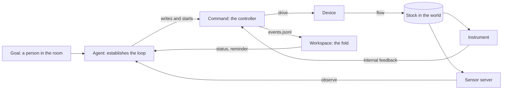

# Actuators

> **Actuators are a design. No package implements them.** The `actuate`
> tool, the `act` kind of process, the event log, and the fold do not
> exist yet. The design builds on [Processes](processes.md) and needs a
> graceful stop first: `SIGTERM`, a grace, then `SIGKILL`. The backlog
> holds the graceful stop in
> [D6](../planning/backlog.md#for-rooms-that-run-unattended) and this
> design in [D24](../planning/backlog.md#for-actuators).

**An actuation is a command that changes the world.** `actuate` runs it as
a process of a second kind, `act`. The command runs to completion, as a
`bash` command does. `actuate` adds three things to that contract: a
stop that lets the command reach a safe state, a rule for what its exit
code means, and a structured log that the workspace folds into a status.

**The primary job of the agent is to establish a control loop.** The
command is the controller. The agent writes the command with the feedback
that closes the loop, and places the loop where its latency fits. It then
verifies convergence through a sensor of its own.

**The command owns its inputs.** Its instruments, its feedback, its
target, and its configuration live inside the command: its code, its
arguments, and its files. `actuate` passes no input to the actuator.
[Sensors](sensors.md) serve agents, and no command reads one.

**The design goal is convergence within guardrails.** The command drives
the world toward a desired state. The stop contract, the `finally`
backstop, the account permissions, and the device keep every end safe.
The workspace reports what the command claims, and the agent checks it.

## The tool

```ts
actuate({
  command: string, // drives the world; carries its own deadline; traps TERM and cleans up
  grace: number, // seconds the command needs to reach a safe state after SIGTERM
  finally?: string, // backstop; runs only after an unclean end; idempotent
  name?: string, // as bash
  timeout?: number, // as bash; a backstop above the command's own deadline
  wait?: number, // as bash
});
// Result: process act-3f9a2c1d0b7e. status, wait, cancel, and ps take it.
```

| Parameter | Default   | Bounds                     | Meaning                                                    |
| --------- | --------- | -------------------------- | ---------------------------------------------------------- |
| `command` | None      | As `bash`                  | The controller, with every input that it reads             |
| `grace`   | None      | 1 to 300 s                 | The time from `SIGTERM` to `SIGKILL`                       |
| `finally` | None      | As `bash`; runs up to 60 s | The command that makes the world safe after an unclean end |
| `name`    | None      | As `bash`                  | A label for the process                                    |
| `timeout` | 600 s     | As `bash`                  | The table's deadline; it starts the stop                   |
| `wait`    | As `bash` | As `bash`                  | Seconds the call waits for the end                         |

**`grace` has no default.** Only the author of the command knows how long
the device needs. A heater cuts its power in milliseconds. A valve can
need 20 seconds to close.

**Every other parameter controls the process.** `grace`, `finally`,
`timeout`, and `wait` govern the life of the command. None carries a
target, a reading, or a device address. The workspace passes `command` to
the shell and reads nothing in it. A new target is a new command, or a
file that the command reads.

**`actuate` adds no new process tool.** `status`, `wait`, `cancel`, and
`ps` take an `act-` handle as they take a `bash-` handle. The reminder,
the host's view, and the audit log show it as its own kind.

**What `actuate` adds over `bash`:**

1. A `grace` for each call.
2. The rule that exit 0 means safe.
3. The optional `finally` backstop.
4. The event log and its fold into a status.
5. The `act` kind, which the reminder, `ps`, and the audit log show apart.

## The loop



**The command closes the fast loop.** It reads its instrument, drives the
device, and repeats at the period that the plant needs. The agent closes
the slow loop. It writes the command, reads the fold, observes its
sensors, and revises the command.

### Two paths of feedback

**The loop has two paths of feedback, and they do not meet.**

| Path              | Reader      | Carrier                                   | Purpose                                    |
| ----------------- | ----------- | ----------------------------------------- | ------------------------------------------ |
| Internal feedback | The command | Its own driver or instrument, in process  | The control law, at the period of the loop |
| Sensor            | The agent   | A sensor server, `connect`, and `observe` | Confirmation, evidence, and revision       |

**A sensor is not an input of a command.** A command that read a sensor
through the workspace would put the host inside its loop. The loop would
then take the latency of SSH forwarding. It would also stop when a host
run ends, because a connection lasts for one host run. The command reads
its instrument directly, and it keeps running while no host runs.

**One instrument can serve both paths.** A command and a sensor server
that need the same instrument share it through the lab's own means, such
as a driver that serves several readers. The workspace adds no path
between them. For a safety limit, the lab gives the sensor its own
instrument.

### Choose the internal feedback

**A loop converges on the value that its feedback measures.** A heater
loop on the heater's own power converges on a power. A heater loop on the
bath thermometer converges on the bath temperature. Only the second one
serves a goal that names the bath.

**Appropriate internal feedback meets five conditions.**

1. It measures the stock that the goal names.
2. It samples several times in each time constant of the plant.
3. Its latency is short against the period of the loop.
4. Its resolution and its noise are small against the tolerance.
5. For a safety limit, a second instrument checks it.

**The event log is the command's claim.** The agent confirms a claim of
`reached` through a sensor that it observes, or through a command of its
own that reads an instrument.

### Place the loop by its latency

| Tier            | Loop latency                 | What the tier closes                                       | Real-time class                        |
| --------------- | ---------------------------- | ---------------------------------------------------------- | -------------------------------------- |
| Device          | Microseconds to milliseconds | Interlocks, current limits, the watchdog                   | Hard real time                         |
| Command         | Milliseconds to seconds      | The control law on its internal feedback                   | Soft real time, on the workstation     |
| Agent           | Tens of seconds to hours     | The command, its revisions, and the checks through sensors | None: an activation or a scheduled say |
| Person and host | Hours and longer             | The goals and the account permissions                      | None                                   |

**Close each loop at a tier whose latency is small against the plant.** A
common engineering rule sets the period of the loop at one tenth of the
plant's time constant or less. An agent that closes a fast loop across
activations makes the stock oscillate. It writes that loop into the
command.

**A long horizon belongs in the command.** A command that holds a stock
for an hour runs for an hour, with `timeout 3600` or a deadline in its own
code. It then exits 0. The table's `timeout` is a backstop set above it,
so a hold that ends and a hold that hangs read differently.

### The traps

| Trap                   | How it shows in a lab                                            | The rule that answers it                                        |
| ---------------------- | ---------------------------------------------------------------- | --------------------------------------------------------------- |
| The wrong feedback     | A loop on heater power reports success while the bath stays cold | The command reads the bath; the agent confirms through a sensor |
| Oscillation from delay | An agent switches a pump at each activation                      | The command closes the fast loop                                |
| Policy resistance      | Two commands drive one heater to 40 °C and 60 °C in turn         | `flock` in the command; one owner for each device               |
| An unconfirmed effect  | An agent reports "the bath is at 37 °C" from the log alone       | The fold labels `reached` as a claim                            |
| A silent hang          | A controller stops logging while its process lives               | `interval` and the `stale` flag                                 |

## Compose the six capabilities

**The workspace gives six capabilities, and a loop uses all of them.**

| Capability   | Tools                                    | Role in a loop                                               |
| ------------ | ---------------------------------------- | ------------------------------------------------------------ |
| Files        | `read`, `write`, `edit`                  | The common medium: logs, exports, working copies, and plans  |
| Processes    | `bash`, `ps`, `status`, `wait`, `cancel` | The life of every command, and the checks of the agent       |
| Repositories | `repos`, `fork`                          | The versions of the controller                               |
| Tables       | `sql`                                    | Shared plans, schedules, and results                         |
| Sensors      | `connect`, `observe`                     | The agent's own view of the stock, retained as evidence      |
| Actuators    | `actuate`                                | The controller: a command that stops safe and logs its state |

**Composition happens while the application runs.** A new loop needs no
restart of the host and no new host code. An agent can build each of
these compositions in one exchange:

1. **A tuned loop.** Fork a controller repository. Run a step on a
   simulated plant, and record the overshoot and the settling time in a
   table. Change the gains on a branch, commit, and start it with
   `actuate`. Cite the log and the independent observation.
2. **A plan that becomes a command.** A planning agent writes a schedule
   of targets into a table. The commanding agent exports it as CSV and
   starts a command that follows the schedule with no activation.
3. **A second measurement.** A second agent observes an independent
   sensor on the same stock and says to the commanding agent when it
   disagrees with the log.
4. **A rollback on evidence.** The agent cancels the command, checks out
   the previous commit, and starts it with `actuate`.

## The stop

**A stop sends `SIGTERM`, waits for the grace, then sends `SIGKILL`.** A
cancel, a timeout, a cancel by the host, and `dispose()` all take this
path. The signals go to the process group of the command. D6 gives the
same sequence to `bash`, with a fixed grace.

**`cancel` returns when it sends `SIGTERM`.** It does not wait for the
grace. The process reads `running` with the note `stopping`, and a later
read gives the end.

**The command traps `TERM` and cleans up.** It installs the trap before it
drives the device. The trap makes the device safe and exits 0.

**The wrapper handles `TERM` and waits.** It installs a handler with
`trap : TERM`, so it outlives the signal and writes `exit`. A handler
resets to the default in every program that the command runs. An ignored
signal stays ignored in them, so the wrapper never ignores `TERM`. A probe
with bash 5 confirmed the handler: the command's own trap ran, and the
wrapper wrote `exit`.

```sh
trap : TERM
echo "$$" > '<dir>/pid'
(
export AMBION_EVENTS='<dir>/events.jsonl'
<command>
) < /dev/null > '<dir>/out' 2>&1
code=$?
echo "$code $(date -u +%Y-%m-%dT%H:%M:%SZ)" > '<dir>/exit.tmp' && mv '<dir>/exit.tmp' '<dir>/exit'
[ "$code" -ne 0 ] && <claim and run finally>
```

**A host crash sends no signal.** On the workstation, the command keeps
running and ends on its own deadline. Its trap and its exit code work as
usual. The table's timeout does not run while no host runs, so the
command carries its own deadline.

## Exit 0 means safe

**The exit code answers one question: is the world safe?** Exit 0 means
that the command left the world in a state that is safe to leave. That
holds for a natural end and for an end inside the grace. Any other end is
unclean.

**The exit code does not say that the goal was reached.** The event log
states the command's claim, and the agent confirms it. A command that
gives up after a clean shutdown exits 0 and logs `gave_up`.

## The finally backstop

**`finally` runs after an unclean end.** An unclean end is a non-zero
exit, a kill after the grace, or a lost process. `finally` runs in a new
process, so it works after the command crashed. It must be idempotent and
must need no state from the command. "Heater off" qualifies.

**One atomic claim decides who runs `finally`.** The claimant creates the
directory `<dir>/finally` with `mkdir`, which succeeds for one caller only.
It then writes `pid`, `out`, and `exit` in that directory.

- **The wrapper** claims after a non-zero exit. It starts `finally` in a
  new process group with `setsid`, so a stop of the command's group does
  not reach it. The wrapper does not wait. `finally` runs under
  `timeout -s KILL 60` and writes its own `exit`.
- **The table** claims when a read finds a kill or a lost process with no
  claim. A read of any host run can claim, so a crash of the host delays
  `finally` until the next read.

**`finally` has 60 seconds, then `SIGKILL`.** `cancel` does not stop it.
A second host run over the same account finds the claim and runs nothing.

## End states

**The files of an `act` process give a state and a safety.** The state is
the state of [Processes](processes.md#the-files). The safety is new.

| How the command ended                    | `exit`      | Safety     | World                                              |
| ---------------------------------------- | ----------- | ---------- | -------------------------------------------------- |
| It still runs, or a stop waits           | Absent      | `pending`  | The command acts on it                             |
| It exited 0, with or without a stop      | 0           | `safe`     | Safe; the log says whether the goal was reached    |
| Unclean, and `finally` runs              | Any or none | `settling` | Unknown until `finally` ends                       |
| Unclean, and `finally` exited 0          | Any or none | `settled`  | Safe now; unknown from the end until `finally` ran |
| Unclean, and no `finally`                | Any or none | `unknown`  | Unknown                                            |
| `finally` failed, timed out, or was lost | Any or none | `unknown`  | Unknown                                            |

**Every safety but `safe` fails the call that reports it.** This follows
the rule of `bash` for a process that ended badly. The result of
`unknown` ends with one line: `Check the world before you act again.`

**A lost `finally` reads `unknown`.** A lost `finally` has a claim, no
`exit`, and no live shell. The table does not run it a second time.

## The event log

**The command writes JSON lines to `$AMBION_EVENTS`.** The file is
`events.jsonl` in the process directory. stdout and stderr stay free text
in `out`, so a stack trace never corrupts the log. Any language can append
a line to a file.

```jsonl
{"v":1,"at":"2026-09-30T14:02:10.001Z","kind":"target","name":"bath","value":37,"unit":"C","tolerance":0.2,"interval":1}
{"v":1,"at":"2026-09-30T14:02:11.482Z","kind":"observe","name":"bath","value":36.4,"unit":"C"}
{"v":1,"at":"2026-09-30T14:02:11.482Z","kind":"drive","name":"power","value":62,"unit":"%"}
{"v":1,"at":"2026-09-30T14:09:40.310Z","kind":"state","value":"reached","note":"within 0.2 C for 60 s"}
{"v":1,"at":"2026-09-30T15:02:10.050Z","kind":"state","value":"safe","note":"SIGTERM: heater off"}
```

**Every line has `v`, `at`, and `kind`.** `v` is 1. `at` is a UTC ISO 8601
time with three digits of milliseconds, from the command's clock. Any
line can carry `interval`, the seconds between two lines of a healthy
command.

| `kind`    | Meaning in the loop                         | Fields                                                                   |
| --------- | ------------------------------------------- | ------------------------------------------------------------------------ |
| `target`  | The desired state that the command pursues  | `name`, `value` (a number or a state), `unit` for a number, `tolerance?` |
| `observe` | Internal feedback: a value that it measured | `name`, `value`, `unit` for a number                                     |
| `drive`   | The output of the actuator                  | `name`, `value`, `unit` for a number                                     |
| `state`   | The command's claim about itself            | `value`, `note?`                                                         |

**A `state` value is one of six words.**

| Value      | The command claims that it              |
| ---------- | --------------------------------------- |
| `acting`   | drives the world toward the target      |
| `reached`  | measured the stock inside the tolerance |
| `holding`  | keeps the stock at the target           |
| `stopping` | received `TERM` and cleans up           |
| `safe`     | left the device in its safe state       |
| `gave_up`  | stopped trying, and says why in `note`  |

**A name follows the agent-name grammar, `^[a-z][a-z0-9-]*$`.** A line has
at most 4 KiB. A name belongs to the command. It names no sensor of the
workspace.

**The format carries its own version.** A command that someone supplies
does not upgrade with the host. A breaking change raises `v`, and the fold
counts a line of another version as rejected.

## The fold

**The table folds the log into one status for each `act` process.** The
fold is a pure function of the bytes of the log and the host times of the
reads. The same bytes give the same status.

- **Latest wins.** The fold keeps the latest `target`, `observe`, and
  `drive` for each name, and the latest `state` and `interval`.
- **Error.** When a `target` and an `observe` share a name and a unit,
  the fold gives the observed value minus the target.
- **Stale.** A command that declares `interval` reads `stale` after three
  intervals with no new line. The fold measures that time with host time,
  from the first read that saw the log grow. It never compares the
  command's clock with the host's clock.
- **Rejected lines.** The fold counts and skips a line that is not valid
  JSON, has another `v`, has an unknown `kind`, or breaks a field rule.
  The log never fails the process.
- **Contradictions.** The fold flags a claim of `reached` or `holding` on
  an unclean end, and a claim of `safe` before a kill.

**The fold reads only new bytes.** The table keeps the byte offset and the
folded status in `fold.json` beside the log, as it keeps `cursor` for
`out`. A read takes at most 1 MiB of new log. Past that, it moves to the
last 64 KiB and counts the skipped bytes. The command repeats its `target`
when it changes, so a skip loses no desired state for long.

**Two host runs can both write `fold.json`.** Each one writes the fold of
the same bytes through a rename, so the last write is correct.

## Where the status shows

**`status` and `wait` give the status above the new output.**

```text
Process bath-hold, act-3f9a2c1d0b7e, is running for 7m 30s, safety pending.
bath 36.9 C, target 37 C ±0.2 (error -0.1) · power 58 % · holding, 1 s ago
The command reports "holding". Confirm it with an independent sensor.
```

**The reminder and `ps` give one line for each `act` process.** The line
holds the name, the handle, the safety, the latest claim, the error of
each target, and `stale` when it applies.

**The host's view gains the status.** `ProcessStatus` gains an optional
`actuation` field for an `act` process:

```ts
interface ActuationStatus {
  readonly grace: number;
  readonly safety: 'pending' | 'safe' | 'settling' | 'settled' | 'unknown';
  readonly stopping: boolean;
  readonly finally?: { readonly state: ProcessState; readonly exitCode?: number };
  readonly fold: ActuationFold;
}

interface ActuationFold {
  readonly targets: Readonly<Record<string, Reading & { readonly tolerance?: number }>>;
  readonly observed: Readonly<Record<string, Reading>>;
  readonly drives: Readonly<Record<string, Reading>>;
  readonly errors: Readonly<Record<string, number>>;
  readonly claim?: { readonly value: Claim; readonly note?: string; readonly at: string };
  readonly interval?: number;
  readonly stale: boolean;
  readonly contradiction?: string;
  readonly rejected: number;
  readonly skippedBytes: number;
}

interface Reading {
  readonly value: number | string;
  readonly unit?: string;
  readonly at: string; // the command's clock, unchanged
}

type Claim = 'acting' | 'reached' | 'holding' | 'stopping' | 'safe' | 'gave_up';
```

**`subscribe` gains one event.** `{ type: 'claimed', process }` fires when
a read finds a new `state` line. A host that bridges claims to the room
calls `room.post`, as it does for the end of a process
([Processes](processes.md#a-host-can-wake-the-owner-seat)). The event
comes from a read, so a host that wants it on time lists the processes on
an interval.

## A command

**This command holds a bath at 37 °C for one hour.** It locks the device,
traps `TERM`, logs its state, and carries its own deadline. `bath-ctl`
stands for the device driver.

```sh
#!/usr/bin/env bash
set -u
log() { printf '%s\n' "$1" >> "$AMBION_EVENTS"; }
now() { date -u +%Y-%m-%dT%H:%M:%S.%3NZ; }
exec 9> /run/lock/bath.lock
flock -n 9 || { echo 'bath is busy' >&2; exit 0; }
off() { bath-ctl power 0; log "{\"v\":1,\"at\":\"$(now)\",\"kind\":\"state\",\"value\":\"safe\"}"; exit 0; }
trap off TERM
log "{\"v\":1,\"at\":\"$(now)\",\"kind\":\"target\",\"name\":\"bath\",\"value\":37,\"unit\":\"C\",\"tolerance\":0.2,\"interval\":1}"
end=$((SECONDS + 3600))
while [ "$SECONDS" -lt "$end" ]; do
  t=$(bath-ctl read)
  p=$(bath-ctl step 37 "$t")
  log "{\"v\":1,\"at\":\"$(now)\",\"kind\":\"observe\",\"name\":\"bath\",\"value\":$t,\"unit\":\"C\"}"
  log "{\"v\":1,\"at\":\"$(now)\",\"kind\":\"drive\",\"name\":\"power\",\"value\":$p,\"unit\":\"%\"}"
  sleep 1 & wait $!
done
off
```

**`sleep 1 & wait $!` lets the trap run at once.** Bash runs a trap only
after the foreground command ends. `wait` returns when a signal arrives.

**The agent starts it and returns later.** The example uses a tool that
does not exist yet: `actuate`.

```ts
actuate({
  command: '~/bath/hold.sh',
  grace: 5,
  finally: 'bath-ctl power 0',
  name: 'bath-hold',
  timeout: 3900,
  wait: 0,
});
// Result: process act-3f9a2c1d0b7e is running.
schedule({ after: 900, text: 'Check bath-hold, and observe bath/temperature.' });
```

## The guidance

**The guidance of `actuate` tells the agent eight things.**

1. Build the internal feedback into the command. Check that it measures
   the stock that the goal names.
2. Put a fast loop into the command. Revise the command from the agent.
3. Trap `TERM` before the command drives the device. Make the device safe
   in the trap, and exit 0.
4. Put the deadline in the command. Set `timeout` above it.
5. Log to `$AMBION_EVENTS` at the agent's timescale. Put fast data in a
   file of its own.
6. Give a `finally` that is idempotent and needs no state.
7. Lock a device with `flock` when one command at a time may drive it.
8. Confirm a claim of `reached` through a sensor, and cite its snapshot.

## Backends

| Backend              | While the command runs                           | A stop                                            | `finally`                                 |
| -------------------- | ------------------------------------------------ | ------------------------------------------------- | ----------------------------------------- |
| `memoryBackend`      | The log grows as the command writes; `out` waits | The simulated shell ends at once; no trap runs    | Runs after every stop, in the same shell  |
| `directoryBackend`   | As `memoryBackend`                               | As `memoryBackend`                                | As `memoryBackend`                        |
| `workstationBackend` | The log and `out` grow as the command writes     | `SIGTERM` to the group, the grace, then `SIGKILL` | Runs in a new process group with `setsid` |

**On just-bash, every stop is unclean.** The simulated shell has no
signals, so a stop ends the command with no `exit`. `finally` then runs.
A test of a controller on just-bash therefore runs `finally` on each stop.

**The just-bash log grows while the command runs.** A probe against the
in-memory filesystem of `just-bash` read each new line of a log while the
command that wrote it still ran. `out` still waits for the end.

## Trust

**`actuate` adds no authority.** An agent can run the same command
through `bash`. The account permissions on the workstation decide which
devices an agent can reach: device groups, `sudoers`, and file modes.
`openWorkspace` gives the `actuate` tool only when the host passes
`actuation: true`.

**The device holds the last guardrail.** Between a kill and `finally`, and
while no host runs, only a watchdog or an interlock protects the world.
Hard real-time limits belong in the device.

**The log is a claim.** The command writes it, and the agent can edit the
command. The fold labels each claim as the command's report. An
independent sensor confirms it.

**The kernel does not defend physical effects.** A command changes the
world before any `say` commits. The room does not run an effect once
([Durability](durability.md#5-what-the-room-does-not-promise)).

## Records and evidence

**The process directory is the record.** It holds `spec`, `out`,
`events.jsonl`, `fold.json`, `exit`, `stop`, and `finally/`. The agent
calls `snapshot` on the log or on `out` to cite them in a `say`.

**The table prunes `act` processes apart from `bash` processes.** Each
agent keeps its 64 newest finished `act` processes, so a burst of `bash`
calls does not remove the record of an actuation.

## Where the code goes

| File                                | Change                                                                    |
| ----------------------------------- | ------------------------------------------------------------------------- |
| `workspace/src/process-files.ts`    | The `act` kind, the wrapper with the trap, the `finally` claim, the files |
| `workspace/src/actuation-events.ts` | New: the event schema and the pure fold                                   |
| `workspace/src/actuate-tool.ts`     | New: the tool and its guidance                                            |
| `workspace/src/processes.ts`        | The stop with a grace, `finally` on a read, the prune for each kind       |
| `workspace/src/process-text.ts`     | The status block and the reminder line                                    |
| `workspace/src/backend.ts`          | The exec context carries a grace for an abort                             |
| `workstation/src/exec.ts`           | An abort sends `SIGTERM`, waits for the grace, then sends `SIGKILL`       |
| `just-bash`                         | No change                                                                 |

**The export snapshot changes.** `ProcessKind` gains `act`,
`ProcessStatus` gains `actuation`, and `ProcessEvent` gains `claimed`. The
event schema and the fold export from `@ambionframework/workspace`. The
changelog names each change.

## Tests

- A command that traps `TERM` and exits 0 inside the grace reads `safe`.
- A command that ignores `TERM` gets `SIGKILL` after the grace, and
  `finally` runs.
- A non-zero exit runs `finally` from the wrapper, once.
- A lost process runs `finally` on the next read, once, across two host
  runs over one account.
- A `finally` that fails or times out reads `unknown`, and the call fails.
- `cancel` returns before the grace ends, and the process reads
  `stopping`.
- A stop of the command's group does not reach a running `finally`.
- The fold gives the same status for the same bytes, and counts rejected
  lines and skipped bytes.
- `stale` follows host time, with a command clock that runs 10 minutes
  ahead.
- A contradiction shows for `reached` on a kill.
- A burst of 100 `bash` processes keeps every `act` record.
- The log grows while the command runs, on both just-bash backends.
- The OpenSSH tier runs the example with a simulated `bath-ctl`, cancels
  it, and reads `safe`. It then kills a run after the grace and reads
  `settled`.

## Decisions taken

| Decision                                            | Reason                                                                          |
| --------------------------------------------------- | ------------------------------------------------------------------------------- |
| `actuate` is a kind of process                      | Processes already give handles, files, timeouts, adoption, and reminders        |
| Exit 0 means safe                                   | Safety is the one fact that the tool acts on; the agent judges the goal         |
| `grace` is required                                 | Only the author of the command knows how long the device needs                  |
| `finally` is optional and runs after an unclean end | The trap covers a clean stop; `finally` covers a crash and a kill               |
| One `mkdir` claim runs `finally`                    | It runs once across the wrapper, the table, and two host runs                   |
| The command owns its inputs                         | A loop through the host would take SSH latency and stop with the host run       |
| The log is a file of its own                        | Free text in `out` cannot corrupt it                                            |
| Four kinds and six claims                           | The fold needs no more; richer data goes to `out` or to a sensor                |
| `stale` uses host time                              | The workspace never compares two clocks                                         |
| No lock, no `authorize` hook, no automatic snapshot | `bash` reaches the same device; the account is the guardrail; `snapshot` exists |

## Out of scope

- An actuator API, a server, or a `connect` step for actuators.
- A sensor as an input of a command, and any input parameter on `actuate`.
- A lock in the workspace; `flock` in the command does it.
- A check of the goal by the workspace; the agent confirms convergence.
- An interactive command; D6 holds the `pty` kind.
- A `finally` that the agent can cancel.
- Hard real-time guarantees on any path through the workspace.
