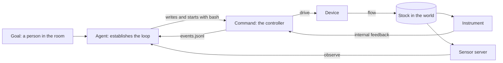

# Actuators

> **Actuators are a pattern over processes.** The workbench ships the
> [actuator controller template](../examples/workbench/templates/actuator-controller),
> and its tests pass. A cancel sends `SIGTERM`, waits the `grace` of the
> `bash` call, then sends `SIGKILL` ([Processes](processes.md#the-stop)).

**An actuator is a controller command that runs as a process.** The
command drives a device toward a desired state, runs to completion, and
exits. An agent starts it with `bash`, reads it with `status`, and cancels
it with `cancel`. Ambion adds no actuator tool, API, or server.

**The primary job of the agent is to establish a control loop.** The agent
writes the command with the feedback that closes the loop, and places the
loop where its latency fits. It then verifies convergence through a sensor
of its own.

**The design goal is convergence within guardrails.** The command drives
the world toward a desired state. The stop handler, the `finally.mjs`
script, the account permissions, and the device keep every end safe. The
log states what the command claims, and the agent checks it.

**The command owns its inputs.** Its instruments, its feedback, its
target, and its configuration live inside the command: its code, its
arguments, and its files. [Sensors](sensors.md) serve agents, and no
command reads one.

## Why a pattern

**Every mechanism that an actuator needs serves other processes too.**

| Need                                 | Mechanism                                 | Also serves                                   |
| ------------------------------------ | ----------------------------------------- | --------------------------------------------- |
| Time to reach a safe state at a stop | `grace` on `bash`                         | A server or a database that flushes           |
| A cleanup after a crash or a kill    | A cleanup script that the agent runs      | A lock to release, a machine to stop          |
| A status that the agent can read     | A JSON-lines file that the command writes | A training run, a long build, a sensor server |

**A separate tool would add a label and no authority.** An agent can run
any command through `bash`, so a separate actuation tool or a new kind of
process gates nothing. The account permissions on the workstation decide
which devices an agent reaches.

**A Git template carries the practice.** The host registers
`templates/actuator-controller` as it registers the sensor template. The
agent forks it, writes the driver, tunes the law on a simulated plant,
and saves each version on a branch. [Git](git.md) owns that lifecycle.

## The loop



**The command closes the fast loop.** It reads its instrument, drives the
device, and repeats at the period that the plant needs. The agent closes
the slow loop. It writes the command, reads its log, observes its sensors,
and revises the command.

### Two paths of feedback

**The loop has two paths of feedback, and they do not meet.**

| Path              | Reader      | Carrier                                   | Purpose                                    |
| ----------------- | ----------- | ----------------------------------------- | ------------------------------------------ |
| Internal feedback | The command | Its own driver or instrument, in process  | The control law, at the period of the loop |
| Sensor            | The agent   | A sensor server, `connect`, and `observe` | Confirmation, evidence, and revision       |

**A sensor is not an input of a command.** A command that read a sensor
through the workspace would put the host inside its loop. The loop would
then take the latency of SSH forwarding. It would also stop when a host
run ends, because a connection lasts for one host run. The command reads
its instrument directly, and it keeps running while no host runs.

**One instrument can serve both paths.** A command and a sensor server
that need the same instrument share it through the lab's own means, such
as a driver that serves several readers. The workspace adds no path
between them. For a safety limit, the lab gives the sensor its own
instrument.

### Choose the internal feedback

**A loop converges on the value that its feedback measures.** A heater
loop on the heater's own power converges on a power. A heater loop on the
bath thermometer converges on the bath temperature. Only the second one
serves a goal that names the bath.

**Appropriate internal feedback meets five conditions.**

1. It measures the stock that the goal names.
2. It samples several times in each time constant of the plant.
3. Its latency is short against the period of the loop.
4. Its resolution and its noise are small against the tolerance.
5. For a safety limit, a second instrument checks it.

### Place the loop by its latency

| Tier            | Loop latency                 | What the tier closes                                       | Real-time class                        |
| --------------- | ---------------------------- | ---------------------------------------------------------- | -------------------------------------- |
| Device          | Microseconds to milliseconds | Interlocks, current limits, the watchdog                   | Hard real time                         |
| Command         | Milliseconds to seconds      | The control law on its internal feedback                   | Soft real time, on the workstation     |
| Agent           | Tens of seconds to hours     | The command, its revisions, and the checks through sensors | None: an activation or a scheduled say |
| Person and host | Hours and longer             | The goals and the account permissions                      | None                                   |

**Close each loop at a tier whose latency is small against the plant.** A
common engineering rule sets the period of the loop at one tenth of the
plant's time constant or less. An agent that closes a fast loop across
activations makes the stock oscillate. It writes that loop into the
command.

**A long horizon belongs in the command.** A command that holds a stock
for an hour runs for an hour, with `timeout 3600` or a deadline in its own
code. It then exits 0. The `timeout` of `bash` is a backstop set above it,
so a hold that ends and a hold that hangs read differently.

### The traps

| Trap                   | How it shows in a lab                                            | The rule that answers it                                        |
| ---------------------- | ---------------------------------------------------------------- | --------------------------------------------------------------- |
| The wrong feedback     | A loop on heater power reports success while the bath stays cold | The command reads the bath; the agent confirms through a sensor |
| Oscillation from delay | An agent switches a pump at each activation                      | The command closes the fast loop                                |
| Policy resistance      | Two commands drive one heater to 40 °C and 60 °C in turn         | `flock` in the command; one owner for each device               |
| An unconfirmed effect  | An agent reports "the bath is at 37 °C" from the log alone       | The log is a claim; the agent cites a sensor                    |
| A silent hang          | A controller stops logging while its process lives               | The log declares its interval; the agent checks the last line   |

## The controller contract

**A controller command follows seven rules.** The workspace checks none
of them. The template follows them, and its tests check them.

1. **Handle `TERM` before it drives the device.** The handler makes the
   device safe and exits 0. No parent process stands between the signal
   and the controller.
2. **Exit 0 means safe.** An exit code of 0 means that the command left
   the world in a state that is safe to leave. A command that gives up
   after a clean shutdown exits 0 and logs `gave_up`.
3. **Carry the deadline in the command.** Set the `timeout` of `bash`
   above it.
4. **Set `grace` to the time that the device needs.** A heater cuts its
   power in milliseconds. A valve can need 20 seconds to close.
5. **Ship a cleanup script that is idempotent and needs no state.**
   "Heater off" qualifies. The agent runs it after an unclean end.
6. **Lock the device with `flock`** when one command at a time may drive
   it.
7. **Log JSON lines at the agent's timescale.** Put fast data in a file
   of its own.

**A controller logs one of six `state` words.** The agent reads one
vocabulary across every controller.

| Value      | The command claims that it              |
| ---------- | --------------------------------------- |
| `acting`   | drives the world toward the target      |
| `reached`  | measured the stock inside the tolerance |
| `holding`  | keeps the stock at the target           |
| `stopping` | received `TERM` and cleans up           |
| `safe`     | left the device in its safe state       |
| `gave_up`  | stopped trying, and says why in `note`  |

## Read the end of a controller

**The state of the process gives the safety of the world.** The agent
reads it with `status`.

| The process ended                                 | The world                                       | The agent                          |
| ------------------------------------------------- | ----------------------------------------------- | ---------------------------------- |
| `exited` with code 0, with or without a stop      | Safe; the log says whether the goal was reached | Confirms the goal through a sensor |
| `exited` with another code                        | Unknown                                         | Runs the cleanup script            |
| Killed after the grace, or lost with no exit code | Unknown                                         | Runs the cleanup script            |

**An unknown world comes first.** When the world is unknown, the agent
runs the cleanup script and checks the world through a sensor before it
starts another command. It reports a claim of `reached` or `holding` on
an unclean end as a contradiction.

## The actuator template

**`templates/actuator-controller` is a Node controller for one actuator.**
It holds a bath at a target on a simulated first-order plant by default.
It needs Node 22.19 or newer and has no dependencies. `start` also needs
`flock` from util-linux.

| File             | Role                                                            | The agent customizes it |
| ---------------- | --------------------------------------------------------------- | ----------------------- |
| `controller.mjs` | The harness: stop handlers, deadline, claims, and the log       | No                      |
| `device.mjs`     | The driver: `read()`, `drive(output)`, and `safe()`             | Yes                     |
| `law.mjs`        | The control law: a PI law with output limits                    | Yes                     |
| `config.json`    | Target, tolerance, times, lock, limits, gains, and plant model  | Yes                     |
| `plant.mjs`      | A simulated plant with the interface of a device                | To match the real plant |
| `finally.mjs`    | The cleanup script: it calls `safe()` alone                     | Rarely                  |
| `start`          | Takes the lock, then replaces itself with `node controller.mjs` | No                      |

**The harness holds the contract.** It installs the stop handlers before
it opens the device. One queue serializes every call to the device, so
`safe()` comes after an output that was already on its way. An error makes
the device safe when it can, and the process exits 1.

**The log is a file in the checkout.** The controller appends JSON lines
to `events.jsonl`, or to the file that `ACTUATOR_EVENTS` names. Each line
has `v`, `at`, and `kind`: `target`, `observe`, `drive`, or `state`. The
agent reads the log with `read` or `bash`.

**`start` keeps `node` as the only process.** It takes the lock on a file
descriptor and replaces itself with `node`. A probe showed why: a forking
`flock` reported 143 on `SIGTERM` while its child cleaned up and exited 0.
`flock -F` and `exec` both passed the 0 through. A busy lock makes `start`
log `gave_up` and exit 0, so no cleanup acts on the device of the
controller that holds the lock.

**The template tests check the contract with real signals.** They run
the controller as a process against the simulated plant.

| Case                           | Result                                                      |
| ------------------------------ | ----------------------------------------------------------- |
| The deadline                   | `reached`, `holding`, then `safe`; exit 0; the output is 0  |
| `SIGTERM` while it holds       | `stopping` and `safe` in under 1 s; exit 0; the output is 0 |
| `SIGKILL` while it holds       | The output stays on; `finally.mjs` sets 0, twice over       |
| A failed read                  | `safe` with the error; exit 1; the output is 0              |
| A second `start` on one device | `gave_up` and exit 0; the first controller runs on          |

**The workbench test guards the template.** It checks that the lab
registers the template and that a fork holds every file. It runs the
template tests, then removes the stop handlers and checks that the
`SIGTERM` case fails.

**The agent starts it and returns later.**

```ts
bash({ command: 'bash ~/bath-control/start', grace: 5, name: 'bath-hold', timeout: 3900, wait: 0 });
// Result: process bash-3f9a2c1d0b7e is running.
schedule({
  delaySeconds: 900,
  text: 'Check bath-hold, read its log, and observe bath/temperature.',
});
```

## Combine the capabilities

**A loop uses five workspace capabilities and the actuator pattern.**

| Part         | Tools                                    | Role in a loop                                               |
| ------------ | ---------------------------------------- | ------------------------------------------------------------ |
| Files        | `read`, `write`, `edit`                  | The common medium: logs, exports, working copies, and plans  |
| Processes    | `bash`, `ps`, `status`, `wait`, `cancel` | The life of every command, and the checks of the agent       |
| Repositories | `repos`, `fork`                          | The versions of the controller                               |
| Tables       | `sql`                                    | Shared plans, schedules, and results                         |
| Sensors      | `connect`, `observe`                     | The agent's own view of the stock, retained as evidence      |
| Actuators    | `bash` and the actuator template         | The controller: a command that stops safe and logs its state |

**An agent builds a new loop while the application runs.** A new loop
needs no restart of the host and no new host code. An agent can build
each of these loops in one exchange:

1. **A tuned loop.** Fork the actuator template. Run a step on a
   simulated plant, and record the overshoot and the settling time in a
   table. Change the gains on a branch, commit, and start it. Cite the log
   and the observation of a sensor.
2. **A plan that becomes a command.** A planning agent writes a schedule
   of targets into a table. The commanding agent exports it as CSV and
   starts a command that follows the schedule with no activation.
3. **A second measurement.** A second agent observes a sensor on the same
   stock and says to the commanding agent when it disagrees with the log.
4. **A rollback on evidence.** The agent cancels the command, checks out
   the previous commit, and starts it.

## Trust

**The pattern adds no authority.** The account permissions on the
workstation decide which devices an agent reaches: device groups,
`sudoers`, and file modes.

**The device holds the last guardrail.** Between a kill and the cleanup
script, and while no host runs, only a watchdog or an interlock protects
the world. Hard real-time limits belong in the device.

**The log is a claim.** The command writes it, and the agent can edit the
command. A sensor confirms it.

**The kernel does not defend physical effects.** A command changes the
world before any `say` commits. The room does not run an effect once
([Durability](durability.md#5-what-the-room-does-not-promise)).

## Decisions taken

| Decision                            | Reason                                                                     |
| ----------------------------------- | -------------------------------------------------------------------------- |
| Actuators are a pattern over `bash` | Every mechanism serves other processes; a separate tool gates nothing      |
| A Git template carries the practice | The agent owns, versions, and tests its controller like a sensor server    |
| `start` replaces itself with `node` | A parent that dies on `SIGTERM` reports 143 while the controller cleans up |
| Exit 0 means safe                   | The agent judges the goal; the exit code states the safety of the world    |
| The command owns its inputs         | A loop through the host would take SSH latency and stop with the host run  |
| Sensors serve agents                | The agent confirms and revises through its own view of the stock           |
| Six `state` words                   | The agent reads one vocabulary across every controller                     |

## Out of scope

- An actuator tool, an actuator API, a server, or a `connect` step for
  actuators.
- A sensor as an input of a command.
- A lock in the workspace; `flock` in the command does it.
- A check of the goal by the workspace; the agent confirms convergence.
- Hard real-time guarantees on any path through the workspace.
- A cleanup that the workspace runs, and a status that the workspace reads
  from the log. [D24](../planning/backlog.md#for-actuators) holds them.
