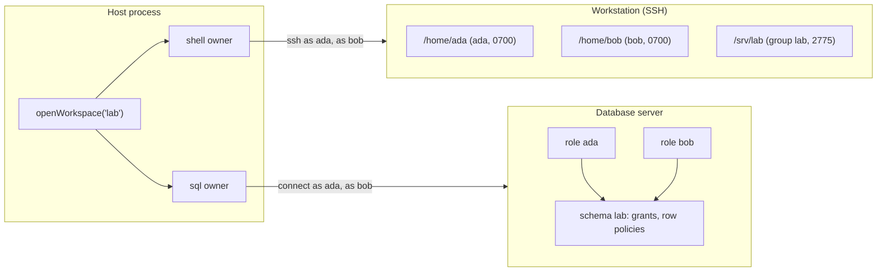

# Workspace backends: a shell and a database

**This page is a design. No package implements it yet.** It builds on the
workspace interface of 0.2.0 item M7
([next.md](../planning/next.md#m-one-owner-per-mechanism)) and on the
workstation design in PR #268. The
[backlog](../planning/backlog.md#designs-with-a-shape) names the condition
that schedules it. Every name below is a proposal.

**A workspace gets two backend kinds: a shell backend and a SQL backend.**
A shell backend is a command executor over a persistent filesystem, with a
private home for each agent and shared folders. A SQL backend is a shared
database. It does not share a filesystem with the shell backend. A
workspace opens one of each, or either one alone.

## The lab

**The target deployment is one workstation and one database server, with
one identity for each agent on both.** An agent logs in to the workstation
over SSH with its own Unix account. The same agent connects to the database
with its own role. The host provisions both credentials for each agent
name. The server of each backend enforces what that agent can reach.



**The same name opens both credentials.** `WorkspaceAgent` holds `name`
alone after M7. Each backend takes a resolver from that name to its own
credential. The host writes one lookup and gives each backend its part.

## What couples the database to the shell today

**The `sql` tool is a shell command.** It writes the statements to a
temporary file and runs `sqlite3` through `env.exec`
(`packages/workspace/src/sql.ts`). A backend that has no `sqlite3` command
has no `sql` tool.

**The shared database is a path in the shell's filesystem.**
`WorkspaceLayout.database` names a file, and a `sql` call can name any
other file as `database`. A database that is not a file has no place in
this contract.

**One owner queue serializes both.** The shell and the database share one
`WorkspaceResource`. A 30-second command from one agent delays every
`query` of every other agent.

**The database has one identity.** Every agent reaches the same file with
the same authority. The workstation design defers Postgres for this reason:
it "needs another command, another dialect, and a database credential apart
from the SSH login" (PR #268).

**A second SQL binding already exists beside the workspace.**
`openSqlResource` opens a `node:sqlite` file with a read-only `query` tool
and an append-only `record` tool
([Resources](resources.md#query-a-sql-resource)). It shares no code and no
contract with the `sql` tool.

## The shape

**`openWorkspace` takes a `shell` backend, a `sql` backend, or both.** It
opens one resource owner for each backend. Each owner keeps its own queue
and its own lifecycle. `dispose()` disposes both.

```ts
import { openWorkspace } from '@ambionframework/workspace';
import { workstationBackend } from '@ambionframework/workstation';
import { postgresBackend } from '@ambionframework/workspace/postgres';

const lab = openWorkspace({
  name: 'lab',
  shell: workstationBackend({
    host: 'lab.internal',
    hostKey: secrets.labHostKey,
    layout: {
      home: (agent) => `/home/${agent.name}`,
      shared: [{ path: '/srv/lab', access: 'read-write' }],
      audit: '/srv/lab/audit.jsonl',
      rooms: '/srv/lab/rooms',
    },
    credentialFor: (agent) => secrets.sshLogin(agent.name),
  }),
  sql: postgresBackend({
    host: 'db.lab.internal',
    database: 'lab',
    tls: { ca: secrets.labCa },
    credentialFor: (agent) => secrets.dbLogin(agent.name),
  }),
  audit: {},
});
```

**The tools follow the backends.** A shell backend brings `read`, `write`,
`edit`, and `bash`. A SQL backend brings `sql`. A workspace with both
backends also brings `export`, which writes a query result into the shell's
filesystem. `tools()` returns one bundle, and the guidance names only the
tools the bundle holds.

| Part                                  | Owner                                 |
| ------------------------------------- | ------------------------------------- |
| `read`, `write`, `edit`, `bash`       | The shell owner                       |
| `sql`                                 | The SQL owner                         |
| `export`                              | The SQL owner, then the shell owner   |
| Home, shared folders, audit, rooms    | `ShellLayout`, from the shell backend |
| Authorization inside the database     | The database: roles and grants        |
| The path rule, deadline, output view  | The neutral layer (M7)                |
| The credential of each agent and host | The host, through each resolver       |

## The shell backend

**`ShellBackend` is the M7 `WorkspaceBackend` without the database.** It
keeps `connect()`, `dispose()`, its own tools, and its guidance. Its layout
loses `database` and gains the home rule and the shared folders.

```ts
interface ShellLayout {
  /** The agent's home: its working directory and the target of `~`. */
  home(agent: WorkspaceAgent): string;
  /** Folders every agent reaches, beside its home. */
  readonly shared: readonly { path: string; access: 'read-only' | 'read-write' }[];
  readonly audit: string;
  readonly rooms: string;
}

interface ShellBackend extends ResourceBackend<WorkspaceEnv> {
  readonly layout: ShellLayout;
  readonly profile: { readonly homes: 'private' | 'nominal' };
  tools?: readonly AgentHarnessTool<ExecutionToolContext>[];
  guidance?: string;
}
```

**The layout states the homes and the shared folders, and the backend
enforces them.** The workstation enforces them with Unix accounts, mode
`0700` on each home, and a group on each shared folder (PR #268). The
profile field states which enforcement holds, so the guidance and
[Trust](trust.md) state one true fact.

**The just-bash backends can make each home private.** just-bash 3.4.2
exports `MountableFs`. `connect()` builds one view for each agent: its own
home at `/home/<name>`, and each shared folder at its path. Nothing else is
mounted. A spike for this design showed these results:

| Command from `ada`             | Result                       |
| ------------------------------ | ---------------------------- |
| `ls /home`                     | `ada` only                   |
| `cat /home/bob/secret.txt`     | No such file                 |
| `cat ../bob/secret.txt`        | No such file                 |
| Write, then read `/shared/lab` | `bob` reads what `ada` wrote |
| `sqlite3 ~/p.db` in the home   | Runs                         |
| Write `/etc-escape`            | Lands in `ada`'s view only   |

**A write outside every mount stays in that agent's view.** The spike's
base is a fresh `InMemoryFs` for each `connect()`, so the file is gone after
the operation. A file that disappears after one call misleads the agent, so
the design gives the view a base that fails each write with `EROFS`. The
directory backend roots one `ReadWriteFs` at each home and each shared
folder.

## The SQL backend

**A SQL backend opens one connection for each agent, as that agent.**
`connect(agent)` resolves the agent's credential and returns an environment
over that agent's connection. The database then decides what the agent can
read and change. The kernel holds no rule about tables.

```ts
interface SqlEnv extends ResourceEnv {
  readonly dialect: 'postgres' | 'sqlite';
  /** Run one or more statements, and return the rows of the last one. */
  run(sql: string, options: SqlRunOptions, context: Context): Promise<Result<SqlRows, SqlError>>;
  /** Run one parameterized statement. `record` and the provenance stamp use it. */
  execute(
    sql: string,
    params: readonly SqlValue[],
    context: Context,
  ): Promise<Result<SqlRows, SqlError>>;
}

interface SqlRunOptions {
  readonly readOnly?: boolean;
  readonly timeout?: number;
  readonly maxRows?: number;
}

interface SqlBackend extends ResourceBackend<SqlEnv> {
  readonly dialect: 'postgres' | 'sqlite';
  readonly profile: {
    /** `enforced`: the server checks each agent's credential. */
    readonly identity: 'enforced' | 'nominal';
    /** Whether `readOnly` holds on the server, or the backend refuses the flag. */
    readonly readOnly: boolean;
  };
  guidance?: string;
}
```

**Three implementations cover the lab, one host, and workerd.**

| Backend                | Where                 | Identity                  | `readOnly`                   |
| ---------------------- | --------------------- | ------------------------- | ---------------------------- |
| `postgresBackend`      | A database server     | Enforced: a role per name | `SET TRANSACTION READ ONLY`  |
| `sqliteBackend`        | One file on the host  | Nominal: one file handle  | A read-only handle (today's) |
| Durable Object storage | `packages/cloudflare` | Nominal                   | None: the backend refuses it |

**The Postgres backend follows the connection plan of the workstation.** It
keeps one client for each agent and builds it on the first `connect()`.
`cleanup()` returns the client to the cache, and `dispose()` closes every
client. A deadline sets `statement_timeout`. An abort runs
`pg_cancel_backend(<pid>)` on a second connection, the same way the
workstation kills a process group over a second channel.

**The `sql` tool keeps its parameters, except `database` and `export`.**
`database` named a file, and the backend now names the database. `export`
moves to its own tool, because it needs the shell. The preview, `maxRows`,
and `timeout` stay. The tool guidance names the dialect.

**`openSqlResource` becomes a tool policy over any SQL backend.** The
policy `record` gives `query` (always `readOnly`) and `record` (one
parameterized INSERT into a listed table), in place of `sql`. It needs a
backend whose profile has `readOnly`. The `node:sqlite` code of
`sql-resource.ts` becomes `sqliteBackend`, and the two SQL bindings become
one.

```ts
openWorkspace({ name: 'lab', sql: sqliteBackend('./lab.db'), sqlTools: 'record' });
```

## Provenance in the database

**The server stamps the role.** A column with `DEFAULT current_user` holds
the agent that wrote the row. The agent cannot set another value, because
its connection authenticates as its own role. This holds only when the
profile's `identity` is `enforced`.

**The tool stamps the room, the activation, and the exchange.** Before the
agent's statements, the Postgres backend runs `SET LOCAL` on three custom
settings in the same transaction: `ambion.room`, `ambion.activation`, and
`ambion.exchange`. A column default or a trigger reads them with
`current_setting('ambion.activation', true)`.

**The room stamps are advisory.** The agent's own statements run after the
`SET LOCAL` in the same transaction, so an agent can change them. The role
stamp is the one the server enforces. The `record` policy fills the
`PROVENANCE_COLUMNS` as it does today.

## The two owners together

**No operation holds both owners.** `export` runs the query on the SQL
owner, keeps the rows in memory, releases the SQL owner, and then writes the
CSV file on the shell owner. A future `import` runs in the other order.
Neither nests one `use` inside the other, so no two operations wait on each
other.

**Two owners give no total order across the backends.** A `bash` call and a
`sql` call from two agents can finish in either order. Each owner still
orders its own operations. The audit log records the order in which calls
finish.

**The audit write moves out of the call's operation.** Today the audit
entry shares the `use` of the call it records. A `sql` call has no shell
environment to write it with. The audit log gets its own queue on the shell
owner, and it writes after the call ends. It still records a cut call.

**An agent on the workstation can reach the database without the kernel.**
The host can provision `~/.pgpass` or a client certificate in each account.
Then `psql` from `bash` connects as the same role, and the same grants
hold. The workspace audit log does not see such a query. The database's own
log (`log_statement`, or the `pgaudit` extension) records every statement
with its role.

## Concurrency

**One queue for each owner is the v1 rule.** The shell owner keeps the M7
queue. The SQL owner also serializes, so v1 changes no ordering rule inside
one backend.

**The lab SQL backend is the case for one queue for each agent.** Each
agent has its own connection, and the server orders the transactions. The
backlog item "a backend profile and concurrent operations" proposes that
the owner keeps one queue for each agent when the profile allows it. The
Postgres backend is the first backend that can declare it.

## Tests

**A SQL conformance entry checks every SQL backend.** It checks the last
result of a multi-statement run, `readOnly` against the profile, a timeout
apart from an abort, the row cap, the error text of a failed statement, and
`execute` with parameters. `@ambionframework/workspace/conformance` gains
it beside the `ExecutionEnv` cases.

**The scripted tier runs the SQLite backend in process.** A Postgres
backend in the scripted tier needs a server in the test process. PGlite is
a candidate. This page has not checked its support for roles and grants.

**The integration tier runs a real Postgres with two agent roles and a host
role.** It proves what only a server can:

- that role `ada` cannot read a table granted to `bob` alone
- that `DEFAULT current_user` stamps the role that ran the `sql` call
- that `readOnly` refuses a write, and a cancel stops a long query
- that one client per agent stays under `max_connections`

## What changes in the surface

There is no compatibility path before 1.0.0 (see
[next.md](../planning/next.md)). The changelog names each change below.

- `WorkspaceBackend` becomes `ShellBackend`, and `openWorkspace` takes
  `shell` and `sql` in place of `backend`.
- `WorkspaceLayout` becomes `ShellLayout`: `database` goes, and `home` and
  `shared` come.
- The `sql` tool loses `database` and `export`. `export` becomes a tool.
- `openSqlResource`, `SqlResource`, and `SqlResourceEnv` go. The `record`
  tool policy and `sqliteBackend` replace them. `PROVENANCE_COLUMNS` stays.
- `SHARED_DATABASE` goes. The just-bash backends no longer hold a database.

## The order of the work

1. **Split the owner.** `openWorkspace` takes `shell` and `sql`. The
   just-bash backends become shell backends. The `sql` tool runs over
   `SqlEnv`. `sqliteBackend` holds the `node:sqlite` code.
2. **Fold `openSqlResource` into the `record` policy.** The workbench moves
   to it.
3. **Add the SQL conformance entry.** The SQLite backend passes it.
4. **Make the just-bash homes private** with `MountableFs`, behind
   `profile.homes`.
5. **Add `postgresBackend`** with the integration tier.
6. **The workstation** (PR #268) implements `ShellBackend`. Its section on
   SQL goes: the SQL backend replaces it.

Steps 1 to 4 need no network and no server. Step 5 needs a Postgres in CI.

## Open questions

- **A workspace with no shell.** The audit log and the room mirror live on
  the shell backend. A workspace with a SQL backend alone could keep both
  in tables, or refuse `audit` and `mirror()`.
- **The mirror as a table.** A `messages` table would let an agent join the
  room record with lab data in one query. The shell file stays the default.
- **A `sql` command inside `bash`.** just-bash accepts custom commands
  (`defineCommand`), so a script could query the shared database. That
  command would hold the SQL owner inside a shell operation. It is safe
  only when no SQL operation ever waits on the shell owner.
- **The host identity on the database.** The mirror and the audit log need
  a role if they move to tables. The resolver then answers for
  `<name>-host`, the same as the workstation.
- **The Postgres client.** `pg` (node-postgres) and `postgres` are the two
  candidates. The choice waits for step 5.
