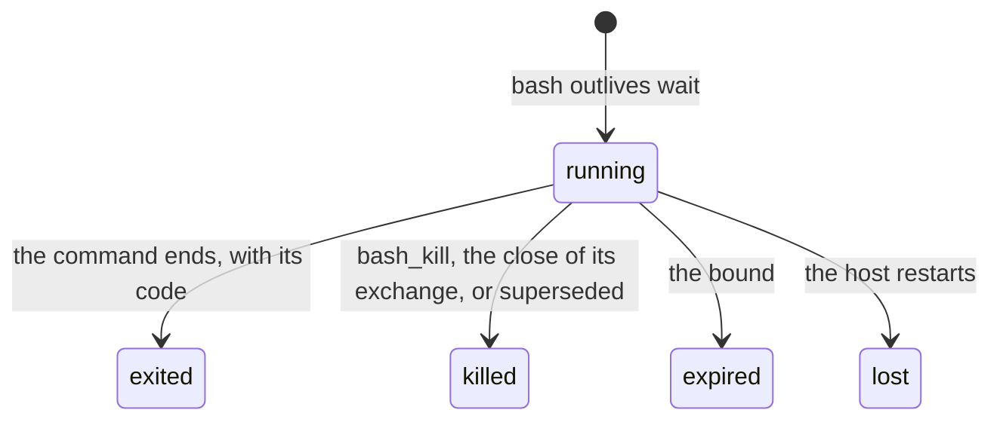

# Background commands

**This page is a design contract for pending work. No part of it is
implemented.** It states how a `bash` command outlives its tool call, how
an agent follows the command, and how the command's exit reaches the room.
Read [workspace.md](workspace.md) and [exchange.md](exchange.md) first. The
job design of
[ambionframework/ambion#292](https://github.com/ambionframework/ambion/pull/292)
is the starting point, and §9 states what this page keeps from it.

**A background command is a `bash` command that runs past the wait of its
tool call.** The tool returns an id. The agent reads the output by the id,
kills the command by the id, and can ask the room to wake it when the
command exits.

## 1. The problem

**Every command dies at 30 seconds today.** Pi's `bash` tool names no
timeout, and both backends then apply `DEFAULT_TIMEOUT_SECONDS`
(`packages/workspace/src/execution-env.ts`). A build, a test suite, a
download, or a server that runs longer loses its work.

**One long command blocks every agent of the workspace.** The resource
owner runs each operation of each agent in one queue
(`packages/workspace/src/resource.ts`). A 60-second `make` holds every
other agent's `read` for 60 seconds.

**An activation is bounded.** `limits.lease.deadline` ends it after
600,000 ms by default ([envelope.md](envelope.md)). Work of an hour must
run with no activation, and the seat must learn when it ends.

## 2. Prior art

| Question                     | Claude Code                                  | Codex `unified_exec`                             | This design                                |
| ---------------------------- | -------------------------------------------- | ------------------------------------------------ | ------------------------------------------ |
| Who decides to go background | The model, before the start                  | The clock: the command outlives `yield_time_ms`  | The clock: the command outlives `wait`     |
| Start                        | `Bash` with `run_in_background: true`        | `exec_command`                                   | `bash` with `wait`                         |
| Read                         | `BashOutput`: new output since the last read | `write_stdin` with no characters: new output     | `bash_output` from a byte offset           |
| Stop                         | `KillShell`                                  | End of the conversation, or the oldest is pruned | `bash_kill`, the scope's end, or the bound |
| Where the output lives       | A file                                       | A buffer in the harness                          | A file in the starter's home               |
| Exit reaches the model       | The harness wakes the model                  | No, the model polls                              | With `wake`, the room wakes the seat       |
| Input                        | No                                           | `write_stdin`, and a TTY                         | Later (§8)                                 |

**Two ideas carry over.** From Codex: one path for every command, and
the clock decides when a command becomes a background command. The model
never has to predict a duration. From Claude Code: the output goes to a
file, and the exit wakes the model.

**One idea does not carry over.** Codex prunes the oldest session when a
cap is reached. Here, a start over the cap fails, and the agent decides
what to kill.

## 3. The facts that shape the design

1. **A background command cannot run inside `use`.** The owner holds its
   queue until the operation returns. The table of §5 connects its own
   env for each command through `backend.connect`.
2. **Neither backend streams output.** Both hand one view to `onUpdate`
   when the command ends. So the output goes to a file. On the
   workstation the file grows while the command runs. On just-bash a
   redirect writes the file only when the redirected command ends.
3. **A just-bash env holds nothing.** `connect` builds a new `Bash` over
   the shared filesystem, and `cleanup` does nothing.
4. **A workstation env closes its channels at `cleanup`.** `release()`
   then starts the idle timer of the agent's SSH session. The timer does
   not count envs. A second env that still holds a channel does not keep
   the session open, so the backend must count envs.
5. **On the workstation the deadline is a timer on the host.** The command
   runs under `setsid`, and a child whose output goes to a file lives on
   after the channel closes. The bound must be in the script, as
   `timeout`, so it holds when the host stops. just-bash has `timeout` as
   well.
6. **`ctx.exchange` is the exchange at the read.** A tool can run after
   that exchange closed.
7. **A retried activation runs the model again.** The new attempt has new
   call ids, and the model can start the same command a second time
   ([durability.md](durability.md)).

## 4. The model

**Two independent choices, each with one owner.**

| Choice  | Values             | What it decides                 | Owner         |
| ------- | ------------------ | ------------------------------- | ------------- |
| `scope` | `exchange`, `room` | What ends the command           | The workspace |
| `wake`  | `false`, `true`    | Whether the exit wakes the seat | The room      |

**The scope is lifetime only.**

- **`exchange`** (default). The close of the exchange kills the command.
  Use it for a build, a test run, or a server for the tests of this
  question.
- **`room`**. The command lives until it exits, `bash_kill` stops it, or
  its bound ends it. Use it for a long run, or a server that other
  questions use.

**The wake is attention only.** With `wake`, the room records a hold, and
the exit sends a notice that wakes the seat. The combination sets where
the notice lands.

| `scope`    | `wake: false`                   | `wake: true`                                                              |
| ---------- | ------------------------------- | ------------------------------------------------------------------------- |
| `exchange` | Dies at close. The agent polls. | The exchange stays open until the exit, and the exit wakes the seat in it |
| `room`     | Lives on. Any agent polls.      | The exit opens an exchange for the owner when the room is quiet           |

**A server never takes `wake`.** Nothing holds an exchange except a live
activation or a hold, and a hold ends at the command's bound. The
guidance tells the model to ask for a wake only for work that ends.

## 5. Layer A: the process table

**Layer A is workspace work. The kernel does not change.** The agent reads
a command by polling.

### 5.1 The tools

| Tool          | Arguments                            | What it gives                                                                                                                            |
| ------------- | ------------------------------------ | ---------------------------------------------------------------------------------------------------------------------------------------- |
| `bash`        | `command`, `wait?`, `scope?`, `key?` | The output and the exit code, as today, when the command ends within `wait`. Else the output so far, the id, the log path, and the bound |
| `bash_output` | `id?`, `since?`, `wait?`             | The state, the exit code, the output from byte `since`, and `next`. No `id`: the room's commands                                         |
| `bash_kill`   | `id`                                 | The final state                                                                                                                          |

**`wait` replaces `timeout`.** Its default is 30 seconds, the point where
a command dies today. `wait: 0` starts the command and returns at once. A
command that must stop earlier uses the shell's own `timeout`.

**`bash_output` is stateless.** The caller passes the offset, and the
answer names the next one. Two parallel calls do not share a cursor, and
the offset still reads the log after a restart. `wait` holds the call
until new output or the exit. The call's signal ends the wait. It does
not end the command.

**`key` makes a start idempotent.** The table keeps one running command
for each room, agent, and key, and a second start with the same key
returns the first id. A retried activation that passes the same key finds
its command. The guidance tells the model to list before it starts.

**The workspace owns the `bash` tool.** Pi's `createBashTool` has no
`wait`, so `packages/workspace` replaces it with its own tool over the
same `ExecutionEnv.exec`.

### 5.2 The mechanism

```mermaid
sequenceDiagram
    participant A as Agent seat
    participant O as Resource owner
    participant T as Process table
    participant B as Backend
    A->>O: bash(command, wait: 30)
    O->>T: start, as the agent
    T->>B: connect(agent), a separate env
    T->>B: exec(timeout -k 5 bound bash -c command > log 2>&1; echo $? > exit)
    T-->>O: the id, when wait passes
    O-->>A: the output so far, the id, the log path
    A->>T: bash_output(id, since, wait)
    B-->>T: the command exits
    T->>B: cleanup
```

**The start goes through the queue, and the command does not.** The owner
orders the start and the audit entries. The command's effects then
interleave with later operations of every agent.

**The log and the exit code are files.** They live at
`~/.ambion/processes/<id>.log` and `<id>.exit` in the starter's home. Any
agent reads them with the ordinary tools. On the workstation, the account
permissions decide who reads them. Each `bash_output` answer is bounded
by `boundedView`. The table never deletes a log.

**The bound lives in the script.** `timeout -k 5` ends the command at its
bound on both backends, also when the host has stopped.

**The id is unique across runs.** It holds the workspace name, a nonce of
the host's run, and a sequence. A table of a new run reads an id of an
old run as `lost`, unless its `.exit` file exists.

### 5.3 The states



### 5.4 The scope's end

**The table learns of closes through `workspace.attach(room)`.** Attach
subscribes as `mirror` does. It reads the room once to seed the last
closed exchange, then follows each close.

- **A close kills the commands of its exchange.** A `room.abort()` closes
  the exchange with `cancelled` and takes the same path. It is the
  person's way to stop exchange-scoped work.
- **A start for a closed exchange fails.** The table compares
  `ctx.exchange.from` with the last close it saw.
- **`superseded` kills every command of the room.** The run that lost the
  fence stops its work.
- **A close between the check and the start leaks one command.** The bound
  ends it. The subscription has no replay, so the design accepts this
  race and states it.

### 5.5 Limits

| Limit               | Default (to measure) | Why                                                      |
| ------------------- | -------------------- | -------------------------------------------------------- |
| Commands per agent  | 4                    | One SSH channel each, under `sshd`'s `MaxSessions` of 10 |
| Commands per room   | 16                   | The host's processes and memory                          |
| Bound, `exchange`   | 1 hour               | A forgotten server ends                                  |
| Bound, `room`       | 24 hours             | A forgotten run ends                                     |
| One read of the log | Pi's bash limits     | The context of the model                                 |

**A start over a cap fails.** The error lists the running commands.

### 5.6 Authority

| Action | Who                                                                |
| ------ | ------------------------------------------------------------------ |
| Start  | A seat, in an activation                                           |
| Read   | Every agent that can read the log file                             |
| Kill   | The starter, the close of the exchange, `superseded`, and the host |

**The host API is `workspace.processes()` and `workspace.kill(id)`.** An
application exposes them to a person. [trust.md](trust.md) gains one row:
a command outlives its activation, and a retry can start it again.

## 6. Layer B: the wake

**Layer B is kernel work, and it is small.** It takes the attention layer
of the job design without `on`, `cap`, or the placement queue.

1. **`ctx.hold(handle, { deadline })`.** A tool writes a `hold opened`
   entry. The entry names the handle, the seat of the activation, the
   owner and the start of the open exchange, and the deadline.
2. **`exchangeLive` counts an open hold.** The rule in
   `room/rules.verified.ts` gains a list of holds. An open hold of the
   exchange is live work, so the exchange stays open.
3. **`room.notify(handle, key, text)`.** The workspace calls it at the
   exit. The room writes a `notice` message directed to the seat, and the
   message ends the hold. The key `(handle, 'exit')` drops a repeated
   notify. Routing wakes the seat inside the open exchange.
4. **The deadline is a notice from the room.** The reconcile pass writes
   it when the hold outlives its deadline.
5. **A notice in a quiet room opens an exchange.** This case is for
   `scope: 'room'`. The owner of the hold owns the new exchange.

**The journal is the store of open holds.** On attach, the workspace reads
the open holds on its handles. It sends `lost` for each one it does not
run and that has no `.exit` file. Attach runs after `resumeRoom`.

**A process handle is a ref.** The grammar in `refs.ts` gains
`ambion://workspace/<name>/process/<id>`, so a message can cite the
command and its log.

**The changes raise the journal format to 2.** Two entry kinds, one
message kind, and a second way to open an exchange. The changelog names
each one.

## 7. What it takes

| Step | Package                    | Work                                                                                 | Kernel |
| ---- | -------------------------- | ------------------------------------------------------------------------------------ | ------ |
| A1   | `workspace`                | The workspace's own `bash` tool with `wait`, `scope`, and `key`                      | No     |
| A2   | `workspace`                | The process table, the script wrapper, `bash_output`, `bash_kill`, the audit entries | No     |
| A3   | `workstation`              | Count the envs of an agent before the idle timer starts                              | No     |
| A4   | `workspace`                | `workspace.attach(room)`: closes, `superseded`, the seed                             | No     |
| A5   | `workspace`                | `workspace.processes()` and `workspace.kill(id)`                                     | No     |
| A6   | `workspace`, both backends | Conformance cases on `memoryBackend`, `directoryBackend`, and OpenSSH                | No     |
| B1   | `ambion`                   | `hold opened`, `ctx.hold`, `exchangeLive` with holds, and its proof                  | Yes    |
| B2   | `ambion`, `workspace`      | `room.notify`, the `notice` message, the deadline notice, `lost` on attach           | Yes    |
| B3   | `ambion`                   | The opening rule for a notice in a quiet room, and the ref grammar                   | Yes    |

**A1 to A6 ship on their own.** Their meaning does not change in Layer B,
because `scope` never means a hold.

**A Durable Object holds no process table.** The Cloudflare package runs
no background command. Its host needs a Node workspace.

## 8. Later

- **Reattach on the workstation.** The id holds the process group. A new
  run reattaches to a command that still runs.
- **Input.** `bash_write`, as Codex's `write_stdin`, and a TTY.
- **Milestones.** A notice for each output line that matches a pattern.
- **More sources.** A timer and another room send notices through
  `room.notify`.

## 9. Relation to jobs

**A background command replaces the job runtime for work that a shell can
do.** The Deno sandbox, the program snapshot, and the job store are not
needed for a build, a test run, a server, or a sweep script.

| Part of the job design              | Here                                                      |
| ----------------------------------- | --------------------------------------------------------- |
| Monitoring: `job_status`, `job_log` | `bash_output`                                             |
| `cancel(handle)`                    | `bash_kill`, and the host API                             |
| Attention: watch, notice, `hold`    | Kept, reduced to a hold and one notice at the exit        |
| The outbox of notices               | The `.exit` file and a keyed `room.notify`                |
| The handle grammar                  | Kept                                                      |
| Snapshot and hash of the program    | Dropped. The audit entry records the command              |
| Effects only through host bindings  | Dropped. A just-bash custom command can hold an interlock |
| Replay of binding results           | Dropped                                                   |

**A job returns when a case needs a recorded effect or replay.** It is
then one more source of notices, and Layer B does not change.

## 10. Decisions

| Decision                                    | Declined option                         | Reason                                                                |
| ------------------------------------------- | --------------------------------------- | --------------------------------------------------------------------- |
| The clock sends a command to the background | A flag before the start                 | The model does not predict a duration, and no work dies at 30 seconds |
| `scope` sets the lifetime only              | `exchange` means a hold                 | A server in the exchange scope then holds the exchange for an hour    |
| `wake` is a separate choice                 | Every background command wakes the seat | A server has no exit to report                                        |
| The output is a file                        | A buffer in the table                   | Every agent reads it, and it lives on after a restart                 |
| An offset for each read                     | A cursor for each agent                 | Parallel calls and restarts                                           |
| The bound is in the script                  | A timer on the host                     | The bound holds when the host stops                                   |
| A separate env for each command             | A new backend method                    | No backend changes, except the count on the workstation               |
| A start over a cap fails                    | Prune the oldest                        | The agent decides what to kill                                        |

## 11. Open questions

1. **Defaults.** Measure the bounds and the caps against the workbench.
2. **The scope for a start with no exchange.** A tool call outside an
   exchange has no exchange to end it. Decide whether it takes `room` or
   fails.
3. **Read access on just-bash.** Every agent reads every home. Decide
   whether the guidance says so, or the table refuses a read by another
   agent.
