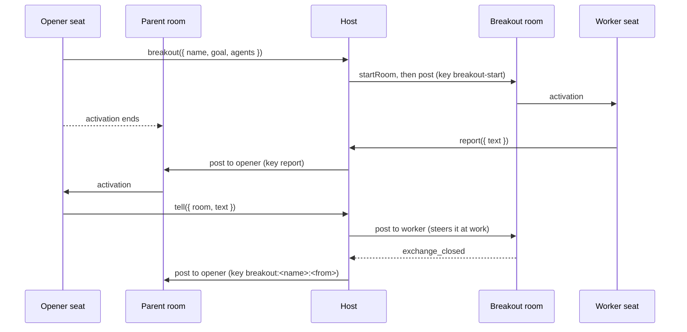

# Breakout rooms

> **Status: design. Nothing on this page exists yet.** The page states the
> design of B1, the theme of 0.7.0 in the plan. It names each kernel part
> that the design uses, and each of those parts exists today. The tools, the catalog,
> and the bridge that this page describes do not exist yet.

**A breakout room is a room that an agent opens for background work.** The
agent gives a goal and names the workers. The host makes the room, seats
the workers, and starts the work. The opener sends notes into the room and
reads its exchanges. A person can visit the room at any time. The room
reports each finished exchange back to the opener.

**A breakout room is to a room what a `bash` process is to a command.** A
process runs a command in the background and gives a handle
([Processes](processes.md)). A breakout room runs work between agents in
the background and gives a room name. The opener does not wait in an
activation. The opener ends its activation, and a report from the
breakout room activates it again.

## Why a room

**An agent that delegates work has three options in Ambion today.** Each
option fails on one property that a breakout room keeps.

| Option                            | Where the work lives                     | What fails                                                                                                      |
| --------------------------------- | ---------------------------------------- | --------------------------------------------------------------------------------------------------------------- |
| A native subagent of the executor | The vendor session of one activation     | A crash loses the work. No entry records it. The host cannot see or bound its spend. Each executor turns it off |
| A worker seat in the parent room  | The journal of the parent room           | Each note of the work is an entry of the parent room. It fills the window of every seat in that room            |
| A `bash` process                  | A child process of the workspace backend | It runs a command. It cannot hold a conversation between agents                                                 |
| **A breakout room**               | **A journal of its own**                 | **None of the above.** The work is durable, it replays, a person can visit it, and its spend is per exchange    |

**The executors turn their native subagents off.** The Claude executor
passes `tools: []`, so the executable has no `Task` tool
([Claude](claude.md)). The Codex executor turns `multi_agent` and
`multi_agent_v2` off, and a test proves that `spawn_agent` is absent
([Codex](codex.md)). The Pi executor gives a seat only the tools that the
room binds ([Pi](pi.md)). This page keeps that rule.

**A worker seat in the parent room costs every other seat.** Its directed
says are entries of the parent room. They enter the record that every seat
of that room reads. Its undirected says activate each `broadcast` seat
([Roster](roster.md#attention)). A breakout room keeps these entries in its
own journal. The parent room receives one post for each finished exchange.

## The parts

**The design adds no entry kind and no kernel operation.** The host composes
it from parts that exist today:

| Need                          | Part                                                                                                            |
| ----------------------------- | --------------------------------------------------------------------------------------------------------------- |
| Make the room                 | `startRoom({ name, goal, agents, seats, runtime })`, and `resumeRoom` after a restart                           |
| State the work                | The `goal` of the room. The prompt of each activation starts with `This room exists to: <goal>`                 |
| Start the work and send notes | `room.post({ to?, text, refs?, key })`. A post to a seat activates it, and a post to a seat at work steers it   |
| Read the exchanges            | [The room mirror](workspace.md#mirror-a-rooms-messages) on the shared workspace: `/rooms/<name>/messages.jsonl` |
| Learn that work finished      | The `exchange_closed` event, and the `Exchange` values of `readRoom`, with `outcome` and `usage`                |
| Report back                   | `room.post` in the parent room with `to` set to the opener                                                      |
| Know the caller               | `ctx.agent.name` and `ctx.room` of the [`ToolContext`](agent.md#tools)                                          |
| Cite a message across rooms   | `messageUri(room, seq)`. The seq in the URI is the seq of the mirror line                                       |

**A post key lands once.** A repeated `key` returns the same handle and
writes nothing ([Exchange](exchange.md#7-the-edges-a-host-sees)). Keys never
expire while the record is retained ([Durability](durability.md)). The
bridge below depends on this fact.

## The tools

**The host gives two bundles.** The opener bundle goes to the agents that
may open breakout rooms. The worker bundle goes to the seats of each
breakout room.

| Tool       | Bundle | Parameters                      | Effect                                                                                  |
| ---------- | ------ | ------------------------------- | --------------------------------------------------------------------------------------- |
| `breakout` | Opener | `name`, `goal`, `agents`, `to?` | Opens the room `<parent>-<name>`, seats `agents`, and posts the start to `to` or to all |
| `tell`     | Opener | `room`, `text`, `to?`, `refs?`  | Posts into a breakout room that the caller opened                                       |
| `report`   | Worker | `text`, `refs?`                 | Posts into the parent room, to the opener, with the label `breakout <name>:`            |

**`breakout` is idempotent by name.** A retried activation that calls
`breakout` with the same `name` gets the same room. A call with a `name`
that another opener holds is a refusal. The result gives the room name, the
room URI, and the mirror path.

**Reads use the mirror.** The opener reads `/rooms/<room>/messages.jsonl`
with `jq`, the same way it reads its own room. `recall` reads the room of
the activation alone, and this design keeps that rule
([Trust](trust.md)).

**A reminder lists the open breakout rooms of the seat.** It follows the
process reminder ([Processes](processes.md#reminders)): one line for each
room, with its state, its open exchange, and the seq of its last line.

## The bridge

**The bridge carries each finished exchange back to the opener.** It reads
the closed exchanges of each breakout room. For each one, it posts one line
to the opener in the parent room:

```ts
for (const exchange of closed) {
  await parent.post({
    to: opener,
    text: `breakout ${name}: exchange #${exchange.from} is ${exchange.outcome}, messages #${exchange.from} to #${exchange.through}.`,
    refs: [messageUri(name, exchange.through)],
    key: `breakout:${name}:${exchange.from}`,
  });
}
```

**The bridge runs at two times.** It runs on each `exchange_closed` event
of a breakout room. It also runs over every closed exchange when the host
starts or resumes the room. The key of each post makes the second run
write nothing for an exchange that the first run reported. A host restart
loses no report, and no report lands twice.

**A summary is not the report.** A post opens an exchange with no person,
and an exchange where no person spoke owes no summary
([Exchange](exchange.md#4-who-directs-one-and-who-receives-its-result)).
The report cites the range. The opener reads the range from the mirror.



## Durability

**Each journal holds its own entries.** No entry refers to a host object.
The posts carry the refs between the two rooms.

**The host keeps a catalog of breakout rooms.** One row holds the room
name, the parent room, the opener, and the depth. The host writes the row
before `startRoom`. At a start, the host reads the catalog, resumes each
room, posts the start again with its key, and runs the bridge. A crash at
any step leaves a row that the next start completes.

| Write           | Key                            | A repeat after a crash      |
| --------------- | ------------------------------ | --------------------------- |
| The catalog row | The room name                  | Finds the row and continues |
| The start post  | `breakout-start:<name>`        | Returns the same handle     |
| A `tell` post   | `tell:<activation>:<callId>`   | Returns the same handle     |
| A `report` post | `report:<activation>:<callId>` | Returns the same handle     |
| A bridge post   | `breakout:<name>:<from>`       | Returns the same handle     |

**The catalog is the one store outside the journals.** The workbench keeps
the same kind of catalog for its rooms today (`workbench_rooms`).

## Visits

**A person visits a breakout room as any other room.** The person reads its
exchanges and can speak. The first person who speaks in an exchange becomes
its `person`, and a configured summary writer owes that person a summary
once a worker says a message in the exchange. A worker can ask a visiting
person a question with `say({ to })`, and the `awaiting` outcome holds the
wait.

## Bounds

**An open is spend, so the host bounds it.** An agent can only lower its
own attention, and the host owns every operation that adds activations.
The host checks these bounds before `breakout` writes the catalog row:

- **Count.** The most breakout rooms that one opener holds open.
- **Depth.** A worker bundle without `breakout` gives depth one. A deeper
  tree needs the opener bundle in a breakout room and a depth limit in the
  catalog.
- **Agents.** The definitions that a breakout room may seat. A name outside
  the list is a refusal.

**Spend is readable per exchange.** Each closed `Exchange` of a breakout
room carries `usage`. The host sums the usage of the rooms of one opener.
[D1](../planning/backlog.md#designs-with-a-shape) holds the accounting and
the enforcement.

**A breakout room stays until the host stops it.** A room is ambient: it
stays available between exchanges. The host stops a room when the opener
leaves the parent room or when a bound requires it. A stopped room keeps
its journal, and `readRoom` and the mirror still read it.

## Trust

**A post has no author.** A worker reads a `tell` post as a message of the
system, and the label in its text names the source. This design adds no
author across rooms, so it adds no new trust surface. An author across
rooms is a later decision.

**The opener and the workers share one workspace.** The mirror needs it,
and a shared workspace is one filesystem boundary
([Workspace](workspace.md#mirror-a-rooms-messages)). A worker can read
every room that the workspace mirrors. A room that needs isolation uses a
workspace of its own and gives up mirror reads.

## Open decisions

1. **The name of a breakout room.** `<parent>-<name>` fits the room name
   rule (`^[a-z][a-z0-9-]*$`). A deep tree makes long names.
2. **Whether the start post opens the first exchange.** The goal carries
   the direction. The post wording reads `A post reports an event and gives
no direction`. The first worker reads the goal in the same prompt.
3. **Whether `report` is a tool or a directed say.** A say to a name that
   is not in the room is a refusal today. A `report` tool needs no kernel
   change.
4. **The place of the host part.** The workbench can hold the first
   version. A later package can hold the bundles and the bridge.
