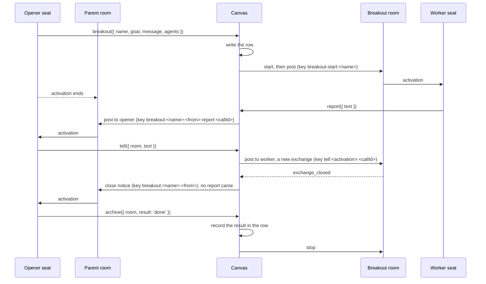

# The canvas

> **Status: the package `@ambionframework/canvas` implements this page.** It
> holds the store, the lifecycle, the tools, and the bridge. The runtime
> is a required parameter of each room operation.
> [The plan](../planning/next.md) owns delivery and evidence.

**A canvas is a named collection of rooms.** It holds the rooms of a
deployment and the relations between them. A room that a host opens is a
root room. A room that an agent opens for background work is a breakout
room, with a parent room and an opener. Each room belongs to one canvas.

**The canvas is the counterpart of the workspace.** The workspace holds
the substrate, and the canvas holds the rooms. Each one has a store, a
bundle of tools, a reminder, and a view for the host.

**Each concern keeps one owner.** The room owns its journal and every
rule of collaboration. The workspace owns the substrate. The canvas owns
which rooms exist, how they relate, and whether the host intends each one
to run. Each journal stays the source of its room
([Durability](durability.md)).

**The host owns presentation.** The canvas defines no view, layout, or
rendering contract. A host chooses how to show the rooms. A person
speaks through the visit of the room that the person enters.

## Why a collection of rooms

**A host that runs more than one room keeps a list of rooms.** The list
holds the name, the goal, and whether each room runs. The host reads it at
a start and resumes each room. Every such host writes the same table and
the same resume loop. The canvas gives that list one owner. The workbench
keeps its root rooms on a canvas.

**Delegated work needs a room of its own.** An agent that delegates work
has three options in Ambion today. Each option fails on one property.

| Option                            | Where the work lives                     | What fails                                                                                                      |
| --------------------------------- | ---------------------------------------- | --------------------------------------------------------------------------------------------------------------- |
| A native subagent of the executor | The vendor session of one activation     | A crash loses the work. No entry records it. The host cannot see or bound its spend. Each executor turns it off |
| A worker seat in the parent room  | The journal of the parent room           | Each note of the work is an entry of the parent room. It fills the window of every seat in that room            |
| A `bash` process                  | A child process of the workspace backend | It runs a command. It cannot hold a conversation between agents                                                 |
| **A breakout room**               | **A journal of its own**                 | **None of the above.** The work is durable, it replays, a person can visit it, and its spend is per exchange    |

## The model

**The store holds one row for each room.** The row is the one durable
record outside the journals. It holds hosting intent, the tree, and what
a start needs. It holds no message, no lease, and no exchange
([The store](#the-store)).

**The depth is one.** A breakout room has no breakout rooms. Its workers
get the worker bundle and no opener bundle, so they cannot open a room.

## Breakout rooms

### The tools

**An agent opens a breakout room with a goal and a first message.** The
message opens the first exchange and activates the workers. The workers
speak in the journal of the breakout room, and a person can visit it at
any time. The canvas gives two bundles. `canvas.tools()` is the opener
bundle: the authority to open a room. `canvas.workerTools()` is the
worker bundle. A host gives the opener bundle to agents of root rooms, and
the worker bundle to the worker team.

| Tool       | Bundle | Parameters                                 | Effect                                                                         |
| ---------- | ------ | ------------------------------------------ | ------------------------------------------------------------------------------ |
| `breakout` | Opener | `name`, `goal`, `message`, `agents`, `to?` | Opens `<parent>-<name>`, seats `agents`, and posts `message` to `to` or to all |
| `tell`     | Opener | `room`, `text`, `to?`, `refs?`             | Posts into a running breakout room that the caller opened                      |
| `archive`  | Opener | `room`, `result`, `note?`                  | Stops a breakout room that the caller opened, and records `done` or `failed`   |
| `report`   | Worker | `text`, `refs?`                            | Posts into the parent room, to the opener, with the label `breakout <name>:`   |

**`breakout` is idempotent by name.** A repeat call by the same opener in
the same parent returns the same room. The start post keys on
`breakout-start:<name>`, so a repeat lands it once. A call with a name
that another opener or a root room holds is a refusal. In every key and
label, `<name>` is the full room name `<parent>-<name>`.

**A `tell` after the exchange closes opens a new exchange.** An exchange
with no `report` gets a close notice, so each finished exchange activates
the opener once. The opener ends the work with `archive`: the canvas
records the result in the row and stops the room. An archived room does
not start again, and a new attempt is a new breakout room.

**The canvas runs the calls on one room name in order.** The tool calls
and the host operations on one room name run one at a time, as the
`serial` queue of the workbench runs them
(`examples/workbench/src/rooms.ts`). The kernel refuses a post to a
stopped room with `room_stopped`, and the canvas maps it to a refusal.
After `close`, every tool call is a refusal.

**Reads use the mirror.** The `RoomMirror` gives the path of the mirror
file, and `breakout` returns it. The opener reads it with `jq`, as it reads
its own room ([Workspace](workspace.md#mirror-a-rooms-messages)).
`recall` reads the own room alone ([Trust](trust.md)).

**The reminder lists the breakout rooms of the seat.** It lists the rows
whose opener is the seat agent and whose parent is the seat room, and
omits archived rows. It reads the rows of the canvas, and `room.read()` of
each live handle, within the reminder bound. A running row with no live
handle shows `running, not started`.

```text
Your breakout rooms:
- design-survey: running, exchange #58 open, last message #61
- design-tests: stopped
```

It gives at most ten lines, then `and 3 more`. A seat with no breakout
room gets no reminder text.

### The composition

**A breakout room holds its workers alone.** It has no assistant and no
summary writer. Each worker attends at `broadcast`. The reserve is empty,
and seating is off (`seating: false`), so no worker can seat another
agent. A visitor gets no summary.

**A breakout room seats only definitions that no root room seats.** The
workspace keys homes, processes, and the process reminder by the agent
name ([Workspace](workspace.md)). Two seats of one name in two rooms
share one home and one process list. A host therefore names a worker
team: definitions that it seats in no root room. The `agents` of a
`breakout` call come from that team.

### Bounds

**An open is spend, so the host bounds it.** The canvas checks the bounds
before it writes the row, in the order of
[the check order](#the-tool-schemas). An agent can only lower its own
attention, and the host owns every operation that adds activations.

**The first release bounds no chain of exchanges.** A scheduled say can
keep a breakout room active after its first exchange. Each closed exchange
carries `usage`, so the host can read the spend of each opener.
[D1](../planning/backlog.md#designs-with-a-shape) holds kernel bounds
and quotas.

### The bridge

**The bridge carries each finished exchange to the opener.** It runs on
each `exchange_closed` event of a breakout room. The event carries the
range alone, so the bridge reads the outcome with `readRoom`. `readRoom`
reads a live room and a stopped room alike.

**A report pass looks for each key first.** For each closed exchange of a
breakout room, the bridge reads the `key` of each `posted` message in the
record of the parent. A key `breakout:<name>:<from>`, or a key that starts
with `breakout:<name>:<from>:`, means that the exchange is done. For an
exchange with no such key, the bridge posts the close notice:

```ts
await parent.post({
  to: recipient, // the opener, or undefined; see below
  text: `breakout ${name}: exchange #${exchange.from} is ${exchange.outcome.kind}, messages #${exchange.from} to #${exchange.through}.`,
  refs: [messageUri(name, exchange.through)],
  key: `breakout:${name}:${exchange.from}`,
});
```

**The bridge posts for one parent in order, one at a time.** It keeps a
chain of its own for each parent, apart from the queue of a room name. It
picks the recipient inside that order. `report` posts in the same chain.
The recipient is the opener when the opener is on the roster of the parent
at an attention other than `none`.
Otherwise the post has no `to`, and the room stays open. A key conflict
counts as landed. `report` follows the same rule for its recipient.

**The chain never waits on a queue of a room name.** A stop of a root
waits for the queues of its breakout rooms from inside the queue of the
root. A bridge post that waited on a queue of a room name could close a
cycle. A bridge post waits on the kernel alone.

**A notice contains no excerpt.** It names the outcome and the range and
cites the last message. The text of a result travels in `report`.

**A report waits for a live parent.** A parent with no live handle in
this run gets no post. The pass of the next `resume` or `start` of the
parent posts it. A stopped parent does not start in order to receive a
report.

**The bridge replays retained journals.** Each `resume` and `start` runs
one pass over every breakout row of the live parents, `stopped` rows
included. A pass skips archived rows. A pass reads a stopped journal with
`readRoom`, and starts no worker. A post that fails with anything other
than a key conflict goes to `onError`. Its exchange stays without a key,
so the next pass posts it.

**A stop interrupts an exchange and closes none.** A stop leaves an open
exchange open in the journal, so no `exchange_closed` event and no closed
exchange exist for the pass to read. A resume closes it, and the pass posts
its notice then. A pass skips an archived room, so an archived room gets
no notice. A post to a parent that stops is no failure: the next pass
posts it.

**A post owes no summary.** A post opens an exchange with no person, so
the exchange owes no summary
([Exchange](exchange.md#4-who-directs-one-and-who-receives-its-result)).



### The life of a breakout room

**A breakout room stays until its opener archives it or the host stops
it.** A room is ambient: it stays available between exchanges. A host
shutdown stops the parent and its breakout rooms together, and both
resume at the next start.

| State      | Set by                                       | Starts again                                | `tell`    |
| ---------- | -------------------------------------------- | ------------------------------------------- | --------- |
| `running`  | `breakout`, or `canvas.start`                | At each `resume`, and with a started parent | Posts     |
| `stopped`  | `canvas.stop` of that room, by the host      | At `canvas.start` of that room              | A refusal |
| `archived` | `archive` by the opener, or `canvas.archive` | Never                                       | A refusal |

**A host stop of a root changes the root row alone.** The breakout rooms
stop with the parent, and their rows stay `running`. `canvas.start` of the
root and `resume` start them again.

**`archive` writes the row first, then stops the room.** A crash between
the two leaves an archived row, and the next `resume` starts no archived
room. `archive` of a stopped row records the close and stops nothing. A
repeat `archive` returns the recorded result, and stops the handle again
when one lives. `close` stops every handle, whatever its row says. An
exchange that an `archive` interrupts gets no close notice: the opener already
decided.

**An opener that leaves keeps its rooms.** The bridge posts with no `to`.
A stopped or archived room keeps its journal, and a person can still visit
it.

## Durability

**Each journal holds its own entries.** No entry refers to a host object.
The posts carry the refs between rooms, and their keys record what
landed. The canvas keeps no cursor.

| Write          | Key                                      | A repeat after a crash                   |
| -------------- | ---------------------------------------- | ---------------------------------------- |
| The row        | The room name                            | Finds the row and continues              |
| An archive     | The archived state of the row            | Finds the state and changes nothing      |
| The start post | `breakout-start:<name>`                  | Returns the same handle                  |
| A `tell` post  | `tell:<activation>:<callId>`             | Lands once for one call                  |
| A `report`     | `breakout:<name>:<from>:report:<callId>` | Lands once for one call                  |
| A close notice | `breakout:<name>:<from>`                 | The pass finds the key and posts nothing |

| Crash point                                  | What the next start does                           |
| -------------------------------------------- | -------------------------------------------------- |
| After the row, before the room starts        | Starts the room from the row                       |
| After the room starts, before the start post | Posts the start again under its key                |
| After an exchange closes, before its notice  | The pass posts the notice under its key            |
| During a host shutdown                       | `canvas.resume()` starts each `running` room again |

**A retried activation can pick a new name.** The reminder shows the
rooms that the opener holds, and `perOpener` caps the worst case. A tool
effect can repeat
([Durability](durability.md#5-what-the-room-does-not-promise)).

**The store has no fence.** One host owns a canvas, as one host owns a
workspace. The journal fences a second host of a room. Stop one host
before the next one opens the same store.

## Visits and trust

**A person visits a room of the canvas as any other room.** The person
reads its exchanges and can speak. A worker can ask a visiting person a
question with `say({ to })`, and the `awaiting` outcome holds the wait.

**A post has no author.** A worker reads a `tell` post as a message of
the system, and the label in its text names the source. The canvas adds
no author across rooms, so it adds no new trust surface.

**The rooms of a canvas share one workspace.** The mirror needs it, and a
shared workspace is one filesystem boundary
([Workspace](workspace.md#mirror-a-rooms-messages)). A worker can read
every room that the workspace mirrors. A room that needs isolation uses
another workspace and gives up mirror reads.

## The interface

**This section states the shape of the package.** The defaults are the
values of the first release.

### The host interface

```ts
function openCanvas(options: OpenCanvasOptions): Canvas;

interface OpenCanvasOptions {
  readonly name: string;
  /** The runtime gives every room its execution. The canvas adds no execution option. */
  readonly runtime: Runtime;
  readonly store: CanvasStore;
  /** With a workspace, the canvas attaches the mirror of each room. */
  readonly workspace?: Workspace;
  readonly breakout: BreakoutOptions;
  /** A failed start keeps its row `running`. The next `resume` tries again. */
  readonly onError?: (error: CanvasError) => void;
}

interface Canvas {
  readonly name: string;
  /** The opener bundle: breakout, tell, archive, and the reminder. Call it before defineAgent. */
  tools(): ToolBundle;
  /** The worker bundle: report. Call it before defineAgent. */
  workerTools(): ToolBundle;
  /**
   * Takes the definitions once, then starts or resumes each running root room,
   * then each running breakout room, then runs one report pass for each live parent.
   * A second call is a refusal.
   */
  resume(options: { readonly agents: readonly AgentDefinition[] }): Promise<void>;
  /**
   * Opens a root room. Needs resume first. A root row returns its live handle, or starts
   * from its row; the other options of the repeat are ignored. A breakout name is a refusal.
   */
  open(options: CanvasRoomOptions): Promise<Room>;
  /**
   * With a root name, sets the room to running, starts it, then starts its breakout
   * rooms whose rows are running. With a breakout name, sets that room to running and
   * starts it, under a live parent only. An archived room is a refusal.
   */
  start(name: string): Promise<void>;
  /**
   * Sets the row to stopped, and stops the room. A root stops with its breakout rooms;
   * their rows do not change.
   */
  stop(name: string): Promise<void>;
  /**
   * Archives a breakout room: records the close, then stops it. The `archive` tool calls it.
   * A stopped row records the close and stops nothing. A repeat returns the recorded close.
   */
  archive(name: string, close: CanvasClose): Promise<CanvasClose>;
  /** Stops every handle of this run. Each row keeps its state. Every tool call after it is a refusal. */
  close(): Promise<void>;
  /** The live handle of a room of this run, or undefined. */
  room(name: string): Room | undefined;
  rooms(): readonly CanvasRoom[];
  subscribe(listener: (event: CanvasEvent) => void): () => void;
}

type CanvasRoomOptions = Pick<StartRoomOptions, 'seats' | 'seating'> & {
  readonly name: string;
  readonly goal: string;
  /** The definitions of this room. Default: every definition outside the worker team. */
  readonly agents?: readonly string[];
  /**
   * The name of a definition given at resume. A name that no definition resolves is a
   * refusal. The row keeps the name, so a later start resolves it again.
   */
  readonly assistant?: string;
  /** The name of a definition given at resume. It resolves as `assistant` does. */
  readonly summaryWriter?: string;
};

type CanvasEvent =
  | { readonly type: 'opened'; readonly room: CanvasRoom }
  | { readonly type: 'started' | 'stopped'; readonly room: string }
  | { readonly type: 'archived'; readonly room: string; readonly close: CanvasClose };

interface CanvasError {
  readonly room: string;
  readonly operation:
    | 'resume'
    | 'open'
    | 'start'
    | 'stop'
    | 'close'
    | 'breakout'
    | 'tell'
    | 'archive'
    | 'report'
    | 'notice'
    | 'mirror';
  readonly error: unknown;
}
```

**The definitions arrive at `resume`.** `defineAgent` reads the bundles
of an agent when it defines the agent. So the host calls `tools()` and
`workerTools()`, defines its agents, and then calls `resume({ agents })`.
`open`, `start`, and every tool call before `resume` are refusals.

**Each room receives the definitions that it names.** A resume adds to the
reserve each definition that the composition does not hold
(`resumeRoom`). The canvas therefore passes each room its own
definitions:

| Room            | Definitions that the canvas passes                                |
| --------------- | ----------------------------------------------------------------- |
| A root room     | Its `agents`; by default every definition outside the worker team |
| A breakout room | The definitions that its row names in `start.agents`              |

**`canvas.open` refuses a team name.** A team name in `agents`, `seats`,
`assistant`, or `summaryWriter` is a refusal. At a start, the canvas
removes the assistant from the definitions that it passes, because
`startRoom` refuses an assistant that `agents` also holds. With no
`seats`, a root room seats every definition that it receives.

**The canvas hears each breakout room that it starts or resumes.** It
calls `room.subscribe` once for each breakout handle and reacts to
`exchange_closed`.
With a workspace, it calls `workspace.mirror(room)` after each start and
resume, and keeps the `RoomMirror`. A failed attach goes to `onError`,
and the room keeps running. A stop stops the room first, then its mirror,
so the mirror holds the last message.

### The store

```ts
interface CanvasStore {
  list(): Promise<readonly CanvasRoom[]>;
  /** Writes the row when the name is free. A row of that name stays as it is. */
  insert(room: CanvasRoom): Promise<'inserted' | 'exists'>;
  setState(name: string, state: 'running' | 'stopped'): Promise<void>;
  /** Sets the row to archived with its close. An archived row stays as it is. */
  archive(name: string, close: CanvasClose): Promise<CanvasClose>;
}

interface CanvasRoom {
  readonly name: string;
  readonly goal: string;
  readonly depth: 0 | 1;
  readonly state: 'running' | 'stopped' | 'archived';
  readonly start: RootStart | BreakoutStart;
  readonly close?: CanvasClose;
}

interface CanvasClose {
  readonly result: 'done' | 'failed';
  readonly note?: string;
}

interface RootStart {
  readonly kind: 'root';
  readonly agents?: readonly string[];
  readonly seats?: StartRoomOptions['seats'];
  readonly assistant?: string;
  readonly summaryWriter?: string;
  readonly seating?: boolean;
}

interface BreakoutStart {
  readonly kind: 'breakout';
  readonly parent: string;
  readonly opener: string;
  readonly agents: readonly string[];
  readonly message: string;
  readonly to?: string;
}

/** `Sql` is the type that `sqliteJournals` takes, from `@ambionframework/journal`. */
function sqliteCanvas(sql: Sql): CanvasStore;
function memoryCanvas(): CanvasStore;
```

**`insert` returns `exists` on a repeat, so a write is idempotent.**
`canvasStoreConformance` runs the same cases over both stores.
`sqliteCanvas` writes the table `canvas_rooms` through the `Sql` of the
host, and the host can share it with `sqliteJournals`.

### The breakout options

```ts
interface BreakoutOptions {
  /** The worker team. No root room seats these definitions. */
  readonly team: readonly string[];
  /** The most running breakout rooms for one opener in one parent. Default 3. */
  readonly perOpener?: number;
}
```

**`resume` refuses a team name that no definition resolves.** It also
refuses two definitions of one name. `openCanvas` refuses a canvas name
that is not a room name.

### The tool schemas

```ts
breakout({
  name: string,        // the room is <parent>-<name>: the shared name syntax, 48 characters at most
  goal: string,
  message: string,     // the initial message
  agents: string[],    // one or more names of the team
  to?: string,         // a worker; omit to post to every worker
}) -> { room: string, uri: string, mirror?: string, state: 'running' | 'stopped' | 'archived', created: boolean, close?: CanvasClose }

tell({
  room: string,        // a breakout room that the caller opened
  text: string,
  to?: string,
  refs?: string[],
}) -> { room: string, from: Seq }

archive({
  room: string,        // a breakout room that the caller opened
  result: 'done' | 'failed',
  note?: string,
}) -> { room: string, result: 'done' | 'failed', note?: string }

report({
  text: string,
  refs?: string[],
}) -> { room: string, from: Seq, to?: string }
```

**The tools read the caller from `ToolContext`.** The opener is
`ctx.agent.name`, and the parent is `ctx.room`. `report` reads the parent
and the opener from the row of `ctx.room`, and the exchange from
`ctx.exchange.from`. A refusal is a tool error that names the cause.

| Call                          | Refusal when                                                            |
| ----------------------------- | ----------------------------------------------------------------------- |
| Any tool                      | `ctx.room` is absent, or the room is not on the canvas                  |
| Any tool                      | `resume` has not run, or `close` has run                                |
| `breakout`, `tell`, `archive` | The caller is in a breakout room                                        |
| `archive`                     | The room is a root room, or another opener holds it                     |
| `tell`                        | The row is archived or stopped, or the room has no live handle          |
| `tell`, `breakout`            | `to` is outside `agents`, or a worker at `none` (kernel refusal)        |
| `report`                      | The caller is in a root room                                            |
| `report`                      | The parent has no live handle in this run                               |
| `report`                      | `ctx.exchange` is absent: report inside the exchange that activated you |
| `report`                      | The row is archived or stopped                                          |

The canvas passes the refusal of the kernel for `to` through. The close
notice of a refused `report` reaches the opener after the parent resumes.

**`breakout` checks in a fixed order.**

1. A row of the room name with the same parent and opener: the tool
   returns it with `created: false`, and checks no bound. The repeat
   ignores `goal`, `message`, `agents`, and `to`. With no journal, the
   canvas completes the start first. The `state` tells the opener whether
   the room still runs. A `stopped` row needs `canvas.start` by the host.
   An archived row carries its `close`, keeps its name, and the opener
   picks a new name.
2. A row of the room name with another opener, or a root row of that
   name: a refusal.
3. The name rule and its length, the team, and `perOpener`: a refusal
   names the bound that it broke. The full name `<parent>-<name>` follows
   the shared name syntax (`@ambionframework/ambion/names`) and holds at
   most 48 characters.
4. Otherwise the canvas inserts the row and starts the room. The result
   has `created: true`.

**A start posts its first message under its key.** Each start and each
resume of a breakout room posts `message` under `breakout-start:<name>`.
A journal that holds the key lands nothing. A start post that the room
refuses cannot pass on a retry, so the canvas archives the row as `failed`
with the refusal as the note, and the call fails with that refusal. Any
other failure stops the room and keeps the row `running`.

**`from` is the seq of the message that landed.** `tell` and `report`
return it. A `report` that finds its key counts as landed and returns the
seq of the message that holds the key.

**`perOpener` counts running rows.** It counts the breakout rows with
that parent and that opener whose state is `running`. `archive` frees a
place.

## Out of scope

[The plan](../planning/next.md#out-of-scope) lists the work that this
package leaves out.
