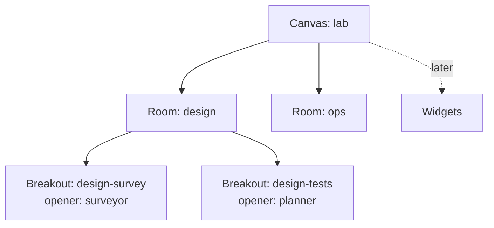
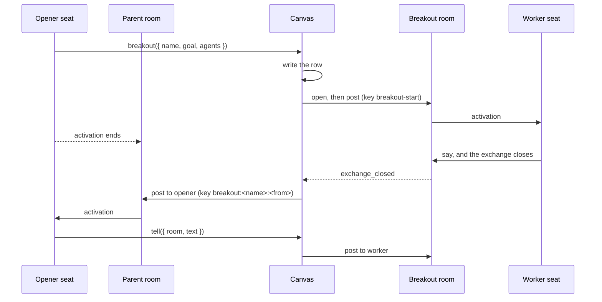

# The canvas

> **Status: design. Nothing on this page exists yet.** The page states the
> design of the canvas, with its decisions settled. The first step, rooms
> on a canvas and breakout rooms, is the scope of 0.7.0 in
> [the plan](../planning/next.md).
> Widgets are a later step. The package, the tools, the store, and the
> host view do not exist yet. Every kernel part that the page names exists
> today.

**The canvas is the surface where agents and people meet.** It holds the
rooms of a deployment. Later it also holds widgets: views of data that
agents place for people. A person opens the canvas, sees its rooms, and
visits one. An agent opens a room on the canvas for background work, and
the canvas reports the work back.

**The canvas is the counterpart of the workspace.** The workspace is the
substrate where agents do the work. The canvas is the front end where the
work meets people. Each one is a container with a store, a bundle of
tools, a reminder, and a host view.

| Property     | Workspace                                     | Canvas                                         |
| ------------ | --------------------------------------------- | ---------------------------------------------- |
| Serves       | Agents, which act on files, tables, processes | People and agents, which meet in rooms         |
| Holds        | Homes, files, tables, processes, snapshots    | Rooms, then widgets                            |
| Opened with  | `openWorkspace({ name, backend })`            | `openCanvas({ name, runtime, agents, store })` |
| Agent bundle | `workspace.tools()`                           | `canvas.tools()`                               |
| Agent read   | A reminder for processes, and the files       | A reminder for rooms, then for widgets         |
| Host view    | `processes.subscribe`, and the mirror file    | `canvas.subscribe`, and `canvas.rooms()`       |
| Identity     | The agent name                                | The room name                                  |

**Each concern keeps one owner.** The room owns its journal and every
rule of collaboration. The workspace owns the substrate. The canvas owns
which rooms exist, how they relate, and how people reach them. A canvas
holds no collaboration state: each journal stays the source of its room
([Durability](durability.md)).

## Why a container of rooms

**A host already keeps a list of rooms.** The workbench keeps one in
`workbench_rooms`: the name, the goal, and whether the room runs. The
host reads it at a start and resumes each room. Every host that runs more
than one room writes the same table and the same resume loop. The canvas
gives that list one owner.

**Delegated work needs a room of its own.** An agent that delegates work
has three options in Ambion today. Each option fails on one property.

| Option                            | Where the work lives                     | What fails                                                                                                        |
| --------------------------------- | ---------------------------------------- | ----------------------------------------------------------------------------------------------------------------- |
| A native subagent of the executor | The vendor session of one activation     | A crash loses the work. No entry records it. The host cannot see or bound its spend. Each executor turns it off   |
| A worker seat in the parent room  | The journal of the parent room           | Each note of the work is an entry of the parent room. It fills the window of every seat in that room              |
| A `bash` process                  | A child process of the workspace backend | It runs a command. It cannot hold a conversation between agents                                                   |
| **A breakout room on the canvas** | **A journal of its own**                 | **It keeps each property.** The work is durable, it replays, a person can visit it, and its spend is per exchange |

**The executors turn their native subagents off.** The Claude executor
passes `tools: []`, so the executable has no `Task` tool
([Claude](claude.md)). The Codex executor turns `multi_agent` and
`multi_agent_v2` off ([Codex](codex.md)). The Pi executor gives a seat
only the tools that the room binds ([Pi](pi.md)). The canvas keeps that
rule.

**A breakout room runs work between agents in the background.** A `bash`
process runs a command in the background and gives a handle
([Processes](processes.md)). A breakout room gives a room name in the
same way. The opener ends its activation, and
a report from the breakout room activates it again.

**Widgets need the same container.** A widget shows data to the people
of a room. A widget that shows a breakout room needs to know the rooms
and their relations. That knowledge lives in the canvas, so the widgets
come later on the same canvas.

## The model

**A canvas holds rooms in a tree.** A room that a host or a person opens
is a root. A room that an agent opens is a breakout room, with a parent
room and an opener.



**The store holds one row for each room.**

| Field    | Holds                                                   |
| -------- | ------------------------------------------------------- |
| `name`   | The room name, which follows the room name rule         |
| `goal`   | The goal of the room                                    |
| `parent` | The parent room, for a breakout room                    |
| `opener` | The agent that opened the breakout room                 |
| `depth`  | 0 for a root room, 1 for a breakout room                |
| `state`  | `running` or `stopped`, which is the intent of the host |

**The store is the one durable record outside the journals.** It holds
hosting intent and the tree. It holds no message, no lease, and no
exchange. A port defines it, and a SQLite store and a memory store
implement it, as the workspace backends do.

**The host opens one canvas and resumes it.** `openCanvas` takes the
runtime, the store, the execution, and an optional workspace. The agent
definitions arrive at `canvas.resume({ agents })`, because the opener
bundle comes from the canvas before the definitions exist. The resume
reads the store and starts each room with the state `running`. A room
that the host does not resume does no work: its pending work and its
scheduled says wait in its journal.

**`canvas.open` takes the composition options of `startRoom`.** It takes
the seats, the assistant, the summary writer, and seating. The canvas
supplies the name, the runtime, the agents, and the execution. A root
room of the workbench keeps its assistant and its scenario seats.

**The canvas attaches the mirror of each room.** With a workspace, the
canvas calls `workspace.mirror(room)` after each start and each resume.
It keeps the mirror and stops it when the room stops. A failed attach
goes to the `onError` of the canvas, and the room keeps running. The
mirror is the read path of an opener, so the host sees the failure.

**`canvas.close()` stops every room and keeps each row `running`.** A
host shutdown is no decision about a room. The next `canvas.resume()`
starts each room again, the breakout rooms included. `canvas.stop(name)`
is the decision: it sets the row to `stopped` and stops the room.

```ts
const canvas = openCanvas({
  name: 'lab',
  runtime,
  workspace,
  store: sqliteCanvas('./data/canvas.db'),
});
const lead = defineAgent({
  name: 'lead',
  identity: 'Splits the work and reads the reports.',
  executor: pi({ instructions, model, bundles: [workspace.tools(), canvas.tools()] }),
});
await canvas.resume({ agents: [lead, ...scenario, ...team] });
const design = await canvas.open({ name: 'design', goal: 'Design the drift test', seats });
```

## Breakout rooms

**An agent opens a breakout room with a goal and its workers.** The
canvas writes the row, starts the room, seats the workers, and posts the
start. The workers speak in the journal of the breakout room. A person
can visit it at any time. The canvas reports each closed exchange to the
opener.

### The tools

**`canvas.tools()` gives the opener bundle.** The bundle is the
authority to open: a seat without it cannot open a room.

| Tool       | Parameters                      | Effect                                                                                  |
| ---------- | ------------------------------- | --------------------------------------------------------------------------------------- |
| `breakout` | `name`, `goal`, `agents`, `to?` | Opens the room `<parent>-<name>`, seats `agents`, and posts the start to `to` or to all |
| `tell`     | `room`, `text`, `to?`, `refs?`  | Posts into a breakout room that the caller opened. A post to a seat at work steers it   |

**`breakout` is idempotent by name.** A call with a name that the
caller already opened returns the same room. A call with a name that
another opener holds is a refusal. The result gives the room name, the
room URI, and the mirror path.

**A worker ends its exchange with a `say`.** A worker has no report
tool. The canvas reports each closed exchange, so a worker tool that
posts to the opener would activate the opener twice for one exchange.

**The reminder lists the breakout rooms of the opener.** It gives one
line for each room: the name, the state, the open exchange, and the seq
of its last message. The reminder reads the store. It also guards a
retry (see [Durability](#durability)).

### The report

**The canvas reports each closed exchange once.** It reads the closed
exchanges of each breakout room with `room.read()`. For each one, it
posts one line to the opener in the parent room:

```ts
for (const exchange of closed) {
  await parent.post({
    to: opener,
    text: `breakout ${name}: exchange #${exchange.from} is ${exchange.outcome}. ${lastSay}`,
    refs: [messageUri(name, exchange.through)],
    key: `breakout:${name}:${exchange.from}`,
  });
}
```

**The report carries the last say of the exchange.** The text is cut to
`reportBytes`, 2,000 by default. The opener reads the result in the
report, and reads the full range only when it needs more. The range comes from the mirror
at `/rooms/<room>/messages.jsonl`, which is a best-effort copy
([Workspace](workspace.md#mirror-a-rooms-messages)).

**The report reads `room.read()`.** The `exchange_closed` event carries
the range alone, with no outcome and no usage. The canvas runs the report
on each `exchange_closed` event, and over every closed exchange at each
start. A resume seeds the closes that it heard from the state, so the run
at the start is required.

**A post opens an exchange with no person.** Such an exchange owes no
summary ([Exchange](exchange.md#4-who-directs-one-and-who-receives-its-result)).
The report cites the range in place of a summary.



### The composition

**A breakout room holds its workers alone.** It has no assistant, and
each worker attends at `broadcast`. The reserve is empty, and seating is
off (`seating: false`), so no worker can seat another agent. A visitor
gets no summary in the first step.

**A breakout room seats only definitions that its parent does not
seat.** The workspace keys homes, processes, and the process reminder by
the agent name ([Workspace](workspace.md)). Two seats of one name in two
rooms would share one home and one process list. A host therefore names
a worker team: definitions that it seats in no root room. The `agents`
bound of the canvas is that team.

### Bounds

**An open is spend, so the host bounds it.** An agent can only lower its
own attention, and the host owns every operation that adds activations.
The canvas checks these bounds before it writes the row:

- **Count.** The most running breakout rooms for one opener:
  `perOpener`, 3 by default.
- **Depth.** One. A worker has no opener bundle, so it cannot open a room.
- **Agents.** The worker team, `team`. A name outside the team is a
  refusal.

**The canvas bounds the exchanges of a breakout room.** A returned say
in a breakout room opens an exchange, and the canvas reports it. The
count bound does not bound such a chain. The canvas therefore stops a
breakout room after `exchanges` closed exchanges, 20 by default, and the
last report says so. A kernel bound on the chain is a later design.
[D1](../planning/backlog.md#designs-with-a-shape) holds the accounting
and the enforcement.

**Spend is readable per exchange.** Each closed `Exchange` of a breakout
room carries `usage`. An attempt that the room ends (`expired`,
`revoked`, `abandoned`) carries none ([Durability](durability.md#5-what-the-room-does-not-promise)),
so a sum reads less than the spend.

### The life of a breakout room

**A breakout room lives while its opener sits in its parent.** A room is
ambient: it stays available between exchanges. A host shutdown stops the
parent and the breakout room together, and both resume at the next
start (see [The model](#the-model)).

**The canvas learns of a departure from the roster of the parent.**
Each report pass reads the roster of the parent with `readRoom`. When the
opener is no longer seated, the canvas sets the row to `stopped`, stops
the breakout room, and posts each pending report to the parent with no
`to`, under the same keys. A pass runs at each closed exchange and at
each resume. So an idle breakout room finds a departure only at the next
resume.

**A report goes with no `to` when the opener cannot receive it.** A post
to a seat with the attention `none` is a refusal
([Exchange](exchange.md#7-the-edges-a-host-sees)). The canvas reads the
attention of the opener with the roster and posts with no `to` in that
case. The pass looks up the key in the parent record before it posts, so
a report that landed with another `to` is never posted again.

**A stopped room keeps its journal.** `readRoom` and the mirror still
read it.

**Nothing deletes a breakout room.** A journal and its keys stay while
the record is kept. A later design can retire a stopped room.

## Durability

**Each journal holds its own entries.** No entry refers to a host object.
The posts carry the refs between the two rooms, and their keys record
which reports landed. The canvas keeps no cursor.

| Write          | Key                          | A repeat after a crash                   |
| -------------- | ---------------------------- | ---------------------------------------- |
| The row        | The room name                | Finds the row and continues              |
| The start post | `breakout-start:<name>`      | Returns the same handle                  |
| A `tell` post  | `tell:<activation>:<callId>` | Lands once for one call                  |
| A report       | `breakout:<name>:<from>`     | The pass finds the key and posts nothing |

**A crash at any step leaves a state that the next start completes.**

| Crash point                                  | What the next start does                                     |
| -------------------------------------------- | ------------------------------------------------------------ |
| After the row, before the room starts        | `readRoom` finds no room, so the canvas starts it            |
| After the room starts, before the start post | The canvas posts the start again under its key               |
| After an exchange closes, before its report  | The run at the start posts the report under its key          |
| After the opener leaves, before the reports  | The roster check posts the pending reports with no `to`      |
| During a host shutdown                       | `canvas.resume({ agents })` starts each `running` room again |

**A retried opener reads the reminder first.** A `tell` key lands once
for one tool call. An activation that expires and runs again makes new
calls, and the model can pick a new name for `breakout`. The reminder
lists the rooms that the opener holds, so the retried activation sees
the room that it opened. The count bound caps the worst case. A tool
effect can repeat ([Durability](durability.md#5-what-the-room-does-not-promise)).

**The store has no fence.** One host owns a canvas, as one host owns a
workspace. The journal fences a second host of a room. Stop one host
before the next one opens the same store.

## Visits

**A person visits a room of the canvas as any other room.** The person
reads its exchanges and can speak. The first person who speaks in an
exchange becomes its `person`. A worker can ask a visiting person a
question with `say({ to })`, and the `awaiting` outcome holds the wait.

**`canvas.subscribe` gives the host the tree.** It emits an event when a
room opens, stops, or reports. A host draws the tree from
`canvas.rooms()` and the events, and a person picks a room to visit.

## Trust

**A post has no author.** A worker reads a `tell` post as a message of
the system, and the label in its text names the source. The canvas adds
no author across rooms, so it adds no new trust surface.

**The rooms of a canvas share one workspace.** The mirror needs it, and a
shared workspace is one filesystem boundary
([Workspace](workspace.md#mirror-a-rooms-messages)). A worker can read
every room that the workspace mirrors. A room that needs isolation uses
another workspace and gives up mirror reads.

## Widgets, a later step

**A widget is a view and a source.** The view is a kind from the catalog
of the host and a configuration. The source names data that the host
reads with no activation: a sensor, a query, a file, a snapshot, a
process, a room, a message, or inline text. The host closes the fast
loop, and the agent closes the slow loop
([Actuators](actuators.md#the-loop)).

**A widget belongs to a room of the canvas.** The store keeps one row
for each widget, with a revision. A `room` widget shows a breakout room
to the people of its parent. The opener places it in the activation that
calls `breakout`.

**The widget design carries over from the review of 2026-10-03.** The
bundle gains `place`, `update`, and `remove`. `place` creates and never
replaces. `update` and `remove` carry the revision that the agent read.
The host declares a catalog of kinds, and an agent writes no code for a
widget. A press or a submit by a person is a `visit.send` from that
person, with the label `canvas:`, a ref
`canvas://<room>/<id>/<rev>`, and a key for each press.

**The store of a widget moves to the canvas.** The review placed
widgets in a folder of the workspace. The canvas now has a store of its
own, so a widget row sits beside its room row. A widget shows data that
the host reads as `workspace.mirrorAgent`, and the host allows a list of
paths and tables.

## What does not change

- **The kernel.** The canvas adds no entry kind and no kernel operation.
  It composes `startRoom`, `resumeRoom`, `readRoom`, `room.post` with
  `to` and `key`, `room.read()`, the `exchange_closed` event, and the
  `remind` text of a bundle.
- **The executors.** Pi, Claude, and Codex receive the canvas as a
  bundle, the same as the workspace.
- **The prompt.** A seat sees the canvas only through the reminder.
  `execution/render.ts` stays pure and stateless.
- **Recall.** `recall` reads the room of the activation alone.

## The interface

**This section fixes the shape that the first step builds.** The names
are final for 0.7.0. The defaults are the values of the first release.

### The canvas

```ts
function openCanvas(options: OpenCanvasOptions): Canvas;

interface OpenCanvasOptions {
  readonly name: string;
  readonly runtime: Runtime;
  readonly store: CanvasStore;
  /** The execution of every room, as StartRoomOptions.execution states. */
  readonly execution?: Execution | readonly Execution[];
  /** With a workspace, the canvas attaches the mirror of each room. */
  readonly workspace?: Workspace;
  readonly breakout?: BreakoutOptions;
  readonly onError?: (error: CanvasError) => void;
}

interface Canvas {
  readonly name: string;
  /** The opener bundle: breakout, tell, and the reminder. Call it before defineAgent. */
  tools(): ToolBundle;
  /** Takes the definitions once, then starts or resumes each running room. */
  resume(options: { readonly agents: readonly AgentDefinition[] }): Promise<void>;
  /** Opens a root room. Needs resume first. */
  open(options: CanvasRoomOptions): Promise<Room>;
  /** Sets a root room and its breakout rooms to running, and starts them. */
  start(name: string): Promise<void>;
  /** Sets a root room and its breakout rooms to stopped, and stops them. */
  stop(name: string): Promise<void>;
  /** Stops every room of this run. Each row keeps its state. */
  close(): Promise<void>;
  /** The live handle of a room of this run, or undefined. */
  room(name: string): Room | undefined;
  rooms(): readonly CanvasRoom[];
  subscribe(listener: (event: CanvasEvent) => void): () => void;
}

type CanvasRoomOptions = Pick<
  StartRoomOptions,
  'goal' | 'seats' | 'assistant' | 'summaryWriter' | 'seating'
> & { readonly name: string; readonly goal: string };

interface CanvasRoom {
  readonly name: string;
  readonly goal: string;
  readonly depth: 0 | 1;
  readonly state: 'running' | 'stopped';
  /** What a start needs when the row has no journal yet. */
  readonly start: RootStart | BreakoutStart;
}

interface RootStart {
  readonly kind: 'root';
  readonly seats?: StartRoomOptions['seats'];
  readonly assistant?: string;
  readonly summaryWriter?: string;
  readonly seating?: boolean;
}

interface BreakoutStart {
  readonly kind: 'breakout';
  readonly parent: string;
  readonly opener: string;
  readonly agents: readonly string[];
  readonly to?: string;
}

type CanvasEvent =
  | { readonly type: 'opened'; readonly room: CanvasRoom }
  | { readonly type: 'started' | 'stopped'; readonly room: string }
  | { readonly type: 'reported'; readonly room: string; readonly from: Seq; readonly to?: string };

interface CanvasError {
  readonly room: string;
  readonly operation: 'start' | 'resume' | 'mirror' | 'report' | 'stop';
  readonly error: unknown;
}
```

**The definitions arrive at `resume`.** An opener holds the bundle of
`canvas.tools()`, and `defineAgent` reads its bundles when it defines the
agent. So the host calls `tools()`, defines its agents, and then calls
`resume({ agents })`. `open`, `start`, and every tool call before
`resume` are refusals.

**Each room gets only its own definitions.** A resume adds to the
reserve each definition that the composition does not hold. The canvas
therefore passes each room the definitions that belong to it:

| Room            | Definitions that the canvas passes                               |
| --------------- | ---------------------------------------------------------------- |
| A root room     | Every definition outside the worker team, the assistant included |
| A breakout room | The definitions that its row names in `start.agents`             |

**`canvas.open` refuses a team name.** A team name in `seats`,
`assistant`, or `summaryWriter` is a refusal. At a start, the canvas
removes the assistant from the definitions that it passes, because
`startRoom` refuses an assistant that `agents` also holds. With no
`seats`, a root room seats every definition that it receives.

**A row with no journal starts from its row.** `open` and `breakout`
write the row first. A crash before the start leaves a row with no
journal. The next `resume` reads the row, finds no journal with
`readRoom`, and starts the room from `start`. A repeat `open` of that
name does the same. A row with a journal resumes.

**A failed start or resume keeps its row.** The row stays `running`.
The error goes to `onError`, and the next `resume` tries again.

**The order of a resume is fixed.** The canvas starts or resumes each
running root room, then each running breakout room. Then it runs one
report pass over every breakout row, `stopped` rows included.

**The canvas hears each room that it starts or resumes.** It calls
`room.subscribe` once for each handle and reacts to `exchange_closed`.
With a workspace, it calls `workspace.mirror(room)` after each start and
resume, keeps the `RoomMirror`, and stops it when the room stops. The
mirror path of a room is the path that its `RoomMirror` reports.

### The store

```ts
interface CanvasStore {
  list(): Promise<readonly CanvasRoom[]>;
  /** Writes the row when the name is free. A row of that name stays as it is. */
  insert(room: CanvasRoom): Promise<'inserted' | 'exists'>;
  setState(name: string, state: CanvasRoom['state']): Promise<void>;
}

function sqliteCanvas(path: string): CanvasStore;
function memoryCanvas(): CanvasStore;
```

**`insert` is the idempotence of a write.** A repeat after a crash gets
`exists` and continues with the row that it finds.
`canvasStoreConformance` runs the same cases over both stores.

### The breakout options

```ts
interface BreakoutOptions {
  /** The worker team. No root room seats these definitions. */
  readonly team: readonly string[];
  /** The most running breakout rooms for one opener in one parent. Default 3. */
  readonly perOpener?: number;
  /** The closed exchanges after which the canvas stops a breakout room. Default 20. */
  readonly exchanges?: number;
  /** The most bytes of the last say in a report. Default 2,000. */
  readonly reportBytes?: number;
  /** The most characters of a breakout room name. Default 48. */
  readonly nameLength?: number;
}
```

**`resume` refuses a team name that no definition resolves.**

### The tools

```ts
breakout({
  name: string,        // ^[a-z][a-z0-9-]*$; the room is <parent>-<name>
  goal: string,
  agents: string[],    // one or more names of the team
  to?: string,         // a worker; omit to start every worker
}) -> { room: string, uri: string, mirror?: string, state: 'running' | 'stopped', created: boolean }

tell({
  room: string,        // a breakout room that the caller opened
  text: string,
  to?: string,
  refs?: string[],
}) -> { room: string, from: Seq }
```

**The tools read the caller from `ToolContext`.** The opener is
`ctx.agent.name`, and the parent is `ctx.room`. A call with no room, or
from a room that is not on the canvas, is a refusal. A call from a
breakout room is a refusal, so the depth stays one.

**`breakout` checks in a fixed order.**

1. A row of the room name with the same parent and opener: the tool
   returns it with `created: false`, and it checks no bound. The `state`
   tells the opener whether the room still runs.
2. A row of the room name with another opener: a refusal.
3. The name rule and `nameLength`, the team, and `perOpener`: a
   refusal names the bound that it broke.
4. Otherwise the canvas inserts the row and starts the room. The result
   has `created: true`.

**`perOpener` counts running rows.** It counts the breakout rows with
that parent and that opener whose state is `running`.

**`tell` refuses a room that is not running.** The refusal says that the
room stopped. `from` is the seq of the message that the post wrote.

**A refusal is a tool error that names the cause.**

### The report

**A report pass looks for each key first.** For each closed exchange of
a breakout room, the canvas looks in the record of the parent for a
message with the key `breakout:<name>:<from>`. A key that it finds is
done. For a key that it does not find, it picks the recipient: the
opener when the opener sits in the parent at an attention other than
`none`, else no `to`. A post with the key of a landed report and another
recipient would be a key conflict, so the canvas never posts a found key
again.

**A report waits for a live parent.** A parent with no live handle in
this run gets no post. The pass of the next `resume` or `start` of the
parent posts it.

**The cap stops the room.** When the count of closed exchanges reaches
`exchanges`, the canvas posts the last report, sets the row to
`stopped`, and stops the room.

**The departure check runs with each report pass.** A breakout room that
closes no exchange runs no pass, so it notices a departure only at the
next start of the canvas.

### The text

**A report is one line, then the last say.** The line names the outcome
kind: `complete`, `awaiting`, `cancelled`, or `exhausted`.

```text
breakout design-survey: exchange #41 is complete.
The drift stays under 0.3% on all four runs; the table is runs-0412.
```

An exchange with no say reads `breakout design-survey: exchange #41 is
exhausted, with no message.` An `awaiting` line names the person:
`exchange #41 is awaiting ana.` The report that reaches the cap adds
`The canvas stopped the room after 20 exchanges.`

**The reminder lists the breakout rooms of the seat.** It lists the rows
whose opener is `seat.agent` and whose parent is `seat.room`.

```text
Your breakout rooms:
- design-survey: running, exchange #58 open, last message #61
- design-tests: stopped, last message #12
```

It gives at most ten lines, then `and 3 more`. A seat with no breakout
room gets no reminder text.

## Decisions

**The owner set these on 2026-10-03 and 2026-10-04.** A later review can
reopen each one. The breakout decisions follow the recommendations of the
review of 2026-10-04.

| Decision                     | Choice                                                                                     |
| ---------------------------- | ------------------------------------------------------------------------------------------ |
| The scope of a canvas        | One canvas holds the rooms of a deployment. Widgets belong to a room of it                 |
| Delegated work               | A breakout room on the canvas. No `task()` or subagent tool                                |
| Who may open a breakout room | An agent that the host gives the opener bundle, within the bounds in [Bounds](#bounds)     |
| An author across rooms       | None. A report carries the label `breakout <name>:`                                        |
| The name of a breakout room  | `<parent>-<name>`, under the room name rule with one length bound (S1 in the plan)         |
| The composition              | As [The composition](#the-composition) states, from the worker team                        |
| A worker ends with no `say`  | The text stays lost, as on every executor today. The report names the exchange with no say |
| What a person can change     | A person visits and speaks. Opening a room stays with the host and the opener bundle       |
| The record of an act         | A `visit.send` with the `canvas:` label. No kind of entry for acts                         |
| The first host               | The workbench                                                                              |
| Code from an agent           | Out of scope. If it comes later, it starts as a Git template                               |

## Open decisions

**Only the widget questions stay open.** They wait for the widget step.

1. **What a person can place.** A person can arrange and act. The
   question is whether a person can also place a widget, such as a note.
2. **The widgets of an unseated author.** They can stay, go with the
   author, or pass to the host.
3. **Bounds on widgets.** A cap on the widgets of a room and on the bytes
   of an `inline` source.
