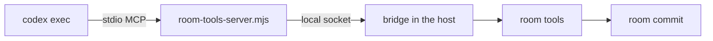

# Codex

`@ambionframework/codex` runs an Ambion seat on the Codex SDK. This page
holds what is specific to the Codex adapter. [Executors](executors.md)
holds the shared contract: the activation flow, the room tools, exchange
continuity, failure classification, the step vocabulary, and the trace. [The
Pi guide](pi.md) and [the Claude guide](claude.md) cover the other two
shipped families. [The
README](../README.md) holds the positioning.

## What the package is

**A seat that Codex runs.** `codex()` defines the executor of an agent.
`codexExecution()` gives a room or a runtime the services that run it.
Codex owns the model loop and its thread.

**A seat has no native tools by default.** It reaches the world only through
the room tools and the tools that you give it, as a Pi seat does. Set
`nativeTools: 'codex'` to give the seat the tools of Codex: file edits,
shell commands, and web search. Both kinds of seat join one room.
[Executors](executors.md#the-executor-contract) states how a room resolves
an execution. Pass `codexExecution({ codexPath, env })` for another binary
or environment.

**Three MCP helper tools remain.** Codex adds `list_mcp_resources`,
`list_mcp_resource_templates`, and `read_mcp_resource` whenever an MCP server
is on, and no setting turns them off on codex 0.155.1. They reach only the
MCP servers of the seat. The room tools server offers no resource, and it
answers each call with `Method not found`, so they read nothing. A unit
test of the server proves it with a `file:///etc/hosts` request.

**The kernel gains no dependency.** `@ambionframework/ambion` imports no model
library. `@openai/codex-sdk` and `@modelcontextprotocol/sdk` belong to this
package only, pinned to exact versions.

## Install and sign in

```sh
npm install @ambionframework/ambion @ambionframework/codex
```

**Node 22.19 or newer.** The package needs the same Node floor as every
Ambion library package. Codex spawns the room tools server with the Node
that runs your process.

**The `codex` binary comes with the SDK.** `@openai/codex-sdk` depends on
`@openai/codex`, which installs the binary for the platform. Set
`codexPath` on `codexExecution()` to run another executable.

**Sign in with one of two ways.**

- Set `CODEX_API_KEY` in the environment of the process. The binary reads it
  on each run.
- Run `codex login` once. The binary reads the sign-in from `~/.codex`.

## A complete example

```ts
import { defineAgent, defineHuman, isSpoken, startRoom } from '@ambionframework/ambion';
import { codex } from '@ambionframework/codex';

const planner = defineAgent({
  name: 'planner',
  identity: 'Reads the plan and names what is missing.',
  executor: codex({
    instructions: 'Speak when the plan lacks evidence.',
    model: 'gpt-5.6-luna',
    modelReasoningEffort: 'medium',
  }),
});

const priya = defineHuman({ name: 'priya', identity: 'Project manager.' });

const room = await startRoom({
  name: 'delivery',
  agents: [planner],
});
const visit = await room.visit(priya);
const exchange = await visit.send({ text: 'Is the plan ready?' });
const messages = await exchange.waitForClose();
console.log(messages.filter(isSpoken).map((message) => message.text));
await room.stop();
```

A test in the package typechecks this block against the source of the
package. The block in `packages/codex/README.md` gets the same check.

## Options

**`codex(options)` takes the fields of an agent and the policy of Codex.**
The executor passes each policy field to the Codex SDK unchanged.

| Option                  | Default            | What it does                                                 |
| ----------------------- | ------------------ | ------------------------------------------------------------ |
| `instructions`          | Required           | The private voice of the agent                               |
| `model`                 | Required           | A Codex model identifier                                     |
| `tools`                 | None               | Tools from `defineTool`. They reach Codex through the server |
| `bundles`               | None               | Tool bundles with guidance                                   |
| `speaking`              | `DEFAULT_GUIDANCE` | The speaking policy that replaces the default                |
| `activationTokenLimit`  | The whole record   | The token limit for the record one activation reads          |
| `estimateTokens`        | Length estimate    | How the agent counts tokens against its limit                |
| `nativeTools`           | `'none'`           | `'none'` turns off every native tool; `'codex'` keeps them   |
| `sandboxMode`           | No sandbox         | `read-only`, `workspace-write`, or `danger-full-access`      |
| `approvalPolicy`        | Codex default      | `never`, `on-request`, `on-failure`, or `untrusted`          |
| `modelReasoningEffort`  | Codex default      | `minimal` up to `ultra`, as the SDK lists them               |
| `networkAccessEnabled`  | Codex default      | The network of a command, under `workspace-write` only       |
| `workingDirectory`      | Process directory  | The directory where Codex works                              |
| `additionalDirectories` | None               | More writable directories, under `workspace-write` only      |

**`nativeTools: 'none'` fixes the policy.** The executor then sets
`sandboxMode` to `read-only`, `approvalPolicy` to `never`,
`networkAccessEnabled` to `false`, and `workingDirectory` to an empty
temporary directory. It ignores those four options and
`additionalDirectories`.
They apply only with `nativeTools: 'codex'`.

**`nativeTools: 'codex'` runs with no Codex sandbox by default.** An absent
`sandboxMode` is `danger-full-access`. Codex then runs each command
directly on the host of the `codex` process, as the user of that process,
with write access and the network. Run such a seat only on an isolated
host, such as a container or a dedicated account. The workstation backend
does not confine it: the workstation serves the workspace tools, and a
native command never reaches it.

**The Codex sandbox needs a user namespace on Linux.** It runs each command
through bubblewrap, which needs an unprivileged user namespace. A host that
refuses one runs no command. AppArmor on Ubuntu 24.04 restricts such
namespaces by default. Set `sandboxMode` to use the Codex sandbox on a host
that allows it.

**`networkAccessEnabled` needs `workspace-write`.** Codex reads it, and
`additionalDirectories`, only under that sandbox. `codex()` refuses
`networkAccessEnabled` with any other `sandboxMode` under
`nativeTools: 'codex'`, so a seat that turns the network off does not get
it back.

**`codexExecution(options)` takes the runtime of the executable.**

| Option      | Default            | What it does                      |
| ----------- | ------------------ | --------------------------------- |
| `codexPath` | The bundled binary | A `codex` executable to run       |
| `env`       | `process.env`      | The environment of the executable |

**`createCodexExecutor(options)` builds the executor of one seat.** It takes
`definition`, `codexPath`, and `env`. It also takes `client`, a function that
builds the SDK client. The tests use `client` to replay recorded events.

**The executor always sets `skipGitRepoCheck`.** A room seat runs where the
application puts it, and that place is often no git repository.

## How a room tool reaches Codex

[Executors](executors.md#the-room-tools) states the three tools, the commit
key, and the room answers.

**Codex runs tools as MCP servers that it spawns.** The three room tools
(`say`, `seat`, `unseat`) and the tools of the agent live in the host. A small
stdio server bridges them.



1. The activation opens a socket in the temporary directory.
2. The executor passes the server command and the socket path to Codex in
   the config key `mcp_servers.ambion`.
3. The server connects to the socket and asks for the manifest: each tool
   with its description and its JSON Schema.
4. The server lists those tools to Codex and sends each call over the
   socket. The bridge runs the call against the room and returns the result.
5. `close` stops the socket. The server exits when the socket closes.

**Codex spawns the built server.** The package ships
`dist/room-tools-server.mjs` and starts it with `node`. In the source tree
the same path resolves to `src/room-tools-server.ts`, which Node runs by
stripping types. `serverPath` picks the file from the extension of the module
that calls it, and a test covers both cases.

**The config key sets three limits and one mode.**
`startup_timeout_sec` is 30. `tool_timeout_sec` is 600.
`default_tools_approval_mode` is `approve`.

**Approval is set because a headless run cannot answer.** Under
`approvalPolicy: 'never'`, Codex denies an MCP call that needs approval. The
real binary answers every `say` with "MCP tool call requires approval, but
approval policy is never", and the seat answers in plain text that the room
never records. The room tools belong to the seat, so the config approves
them. With `nativeTools: 'codex'`, Codex applies its own policy to its
native tools.

## How an activation runs

[Executors](executors.md#the-executor-contract) states the pass flow.
[How an activation runs](executors.md#how-an-activation-runs) states the
read position. Codex sends no echo of the prompt.

**The first prompt of an activation carries the seat's part.** The Codex
SDK has no system prompt option, so the first prompt carries the mechanism,
the agent instructions, and the whole view. A later pass sends the delta,
the lines that landed since the pass read, as the next run of the same
thread. The `turn.*` events of Codex mark each run.

**A run ends on `turn.completed` or `turn.failed`.** Codex also sends `error`
events for trouble that it survives, such as a reconnect. An `error` event
ends the run only when nothing else does.

**`turn.started` moves `readThrough` to the position of the view or the
delta.** The model reads the prompt when a run starts. A missed say also
moves the position, to the last of the messages it carries; see
[Executors](executors.md#how-an-activation-runs).

**Codex takes no steer.** [The harness matrix](executors.md#the-harness-matrix)
states what a family without steering does. The Codex session has no
`steer` member, and the seat reads a line on the next delta pass.

**A cut signals the run.** `abort` signals the run in flight. `close` stops
the socket and the server. A late cut signals no dead process.

## Step mapping

[Executors](executors.md#the-step-vocabulary) holds the ten step kinds. The
table below gives the Codex source of each step.

**Each item that Codex reports becomes steps in the trace.** Codex reports an
item as it starts, as it changes, and as it completes. A text item carries the
whole text so far, so the steps hold the growth: one delta for each update,
then a closing step.

| Codex item or event  | Steps                                                                      |
| -------------------- | -------------------------------------------------------------------------- |
| `agent_message`      | `text` deltas, then a closing `text`                                       |
| `reasoning`          | `thinking` deltas, then a closing `thinking`                               |
| `mcp_tool_call`      | `tool_call` and `tool_result`; a room tool has its own name                |
| `command_execution`  | `tool_call` named `command`; the result holds the output and the exit code |
| `file_change`        | `tool_call` named `file_change`; the result holds the changes              |
| `web_search`         | `tool_call` named `web_search`, with the query                             |
| `turn.completed`     | `usage`                                                                    |
| `todo_list`, `error` | No step                                                                    |

**A failed item marks its result.** A failed command gives the error "The
command failed with exit code N". A failed patch gives "The patch failed".
A failed MCP call gives the message that Codex reported.

**A tool of another server shows with its server.** The step name is
`server__tool`. A room tool shows as `say`, `seat`, or `unseat`, and the
executor reports none of the three as a tool event; see
[Executors](executors.md#the-room-tools).

**A completed patch feeds `refs`.** The executor collects the paths of each
completed `file_change`. The next ordinary `say` cites them in `refs`, and
the bridge holds each path once. A ref is an absolute URI with a scheme, so
the executor writes each path as a `file:` URI. The room refuses a bare path.

**The package writes no `approval` step.** Codex answers its own approvals by
its policy and reports none through the SDK.

## Usage

**One `usage` step ends each run.** `turn.completed` reports input, cached,
and output tokens. [Executors](executors.md#the-step-vocabulary) states how
the driver sums the steps at release. The activation reports the sum on
`activation_end`.

**Codex reports no cost.** The `cost` field of `usage` stays absent. A room
that budgets on cost needs its own price table.

**Input tokens include the cache.** The recorded runs show it. A first run
reports 12387 input tokens and 12384 cache writes. The count is

```text
input      = input_tokens - cached_input_tokens - cache_write_input_tokens
cacheRead  = cached_input_tokens
cacheWrite = cache_write_input_tokens
output     = output_tokens
```

The three parts add up to `input_tokens`. A count that subtracts only the
cached tokens counts the cache writes twice.

**Known limits.** The count ignores `reasoning_output_tokens`. The recorded
runs do not show whether `output_tokens` includes them. A field that an older
`codex` omits counts as zero.

## Failures

[Executors](executors.md#failure-classification) states the shared rule.

**Codex reports a failed run as text, with no status field.** The
`turn.failed` and `error` events carry a message only. The classification
pulls a three-digit HTTP status out of the text when the text names one,
such as "status 401", and applies the shared status rule to it.

**The Codex text set names a quota, a usage limit, or an authentication
refusal.** The patterns are `insufficient_quota`, `exceeded your current
quota`, `usage limit`, `credit
balance`, `authentication_error`, `permission_error`,
`invalid_request_error`, an invalid API key, `unauthorized`, `permission
denied`, `not logged in`, and `missing bearer`.

**A text that names a full context window or a spent output limit reports
a length stop.** The pass reports `stop: 'length'`. This is no failure.

**A stream that ends with no terminal event is a transient failure.** A
failure reaches the host as an `error` event before the driver sees it.

**A missing `codex` binary or a socket error is transient.** A bad
`codexPath` (see [Options](#options)) or a lost connection to the room tools
server gives a transient failure.

## Exchange continuity

[Executors](executors.md#exchange-continuity) states the rule, the recorded
session, and the fresh start.

**An activation resumes the thread that `spec.resume` names.**

- The release records the thread id from the `thread.started` event.
- An activation whose `spec.resume` names a Codex thread calls
  `resumeThread(id)`. Every other activation starts a fresh thread.

**A resume that Codex cannot honor starts a fresh thread.** Such a resume fails
before `thread.started`. The executor then starts a fresh thread, runs the
same prompt, and records the new id. A failure after `thread.started` is an
ordinary failure.

**Threads live in the Codex store.** The SDK persists threads under
`~/.codex/sessions`. A host that loses that directory falls back to a fresh
thread.

## The trust boundary

**A seat has no native tools by default.** `nativeTools: 'none'` gives the
seat the room tools (`say`, `seat`, `unseat`) and the tools of `tools` and
`bundles`. Every seat of a room that uses the default has the same tools.
Files reach the seat only through the tools that the application gives it,
such as the workspace tools.

**Code Mode ignores the sandbox.** This is a fact about Codex 0.155.1.
Code Mode is a JavaScript runtime that the model calls through `exec` and
`wait`. On a read-only sandbox, with no network and a deny permission
profile, its JavaScript still read `/etc/hosts` and listed `/Users` through
`fs`. It could not start a process or reach the network. `sandboxMode` and
permission profiles do not confine it. A feature flag cannot turn it off,
because the model catalog turns it on: `gpt-5.6-luna` has
`tool_mode: 'code_mode_only'`. `gpt-5.5` has no tool mode.

**The default replaces the catalog entry.** A custom catalog overrides the
entry of a model. The executor runs `codex debug models` on the installed
binary once for each binary in the process and patches the entry of the seat
model. It writes the patched catalog to a temporary directory and passes the
path as `model_catalog_json`. The recipe has five parts:

1. **The catalog entry.** `tool_mode`, `apply_patch_tool_type`, and
   `multi_agent_version` are `null`. `input_modalities` is `['text']`.
   `supports_search_tool`, `supports_image_detail_original`, and the three
   `include_*_usage_instructions` flags are `false`. `node_repl_disabled` is
   `true`. `experimental_supported_tools` is empty. This removes Code Mode,
   the patch tool, image input, and the search tool.
2. **The features.** The config sets 31 features to `false`, among them
   `shell_tool`, `unified_exec`, `code_mode`, `code_mode_only`, `apps`,
   `plugins`, `computer_use`, `multi_agent`, and `hooks`. This removes the
   shell and the tools that a feature adds.
3. **The tool switches.** `web_search` is `'disabled'`. `tools.view_image`
   is `false`. `update_plan` and `experimental_request_user_input` are
   disabled.
4. **The bundled REPL.** Codex adds a `node_repl` MCP server. The config
   declares `mcp_servers.node_repl` as disabled, by name, beside the room
   server. Without it the tool list holds `mcp__node_repl.js`.
5. **Defense in depth.** The thread runs on a read-only sandbox, with no
   network, no approval, and an empty temporary directory as its working
   directory. No repository and no host file is the default context.

The temporary directory of each activation holds the patched catalog and the
empty working directory. The executor removes it when the activation closes,
and at process exit.

**A model with no catalog entry does not start.** The activation fails as
permanent. The message names the model and says that `nativeTools: 'none'`
needs a catalog entry. The executor never leaves native tools on by
accident. Use a model that `codex debug models` lists, or set
`nativeTools: 'codex'`.

**`nativeTools: 'codex'` opens the host.** The seat keeps the tools of the
model. A seat with Code Mode reads host files whatever `sandboxMode` says.
With no `sandboxMode`, a command runs with no sandbox, with write access
and the network. A `sandboxMode` and `approvalPolicy` set what a command
may do, and Code Mode is outside their reach. Use it only for a seat that
may use the host.

**The version pin guards the recipe.** The package pins `@openai/codex-sdk`
0.155.1, which brings `codex` 0.155.1. The feature names and the catalog
fields belong to that version. A newer `codex` can add a native tool that
the recipe does not turn off. Run the live exclusivity test
(`test/live/exclusive.test.ts`) against a new version, and trust the version
only when it passes.

**The environment includes the key by default.** With no `env` on
`codexExecution()`, the binary inherits `process.env`. A command that runs
under `nativeTools: 'codex'` can read `CODEX_API_KEY` from it. Pass an `env`
that leaves the key out to prevent that, and sign in with `codex login`
instead.

**The room tools are approved.** They only call the room, and the room
checks each call.

## Testing

**A real model cannot be scripted, so the executor suite runs live.** Pi and
Claude have a fake model or a fake executable that plays a plan from
`@ambionframework/ambion/conformance`. A fake `codex` proves only that the
adapter agrees with its own guess about the SDK, so the package has none.
The package has no `./testing` entry for that reason.

**The unit tests run on recorded events.** `test/fixtures/` holds event
streams that a real `codex` 0.155.1 produced through the SDK 0.155.1, on the
model `gpt-5.6-luna`. The tests map them to steps, count usage, and report
the changed paths. Pure parts have their own tests: the wire framing, the
room tools, the options, and the failure classification. A replay client
runs the executor on the recorded events to test exchange continuity.

**The live tier proves the claims that recorded events cannot.** Each file
holds the smallest room that proves one claim.

| File                          | Claim                                                                                                               |
| ----------------------------- | ------------------------------------------------------------------------------------------------------------------- |
| `test/live/loop.test.ts`      | A seat speaks through `say`; no approval error; usage above zero                                                    |
| `test/live/tools.test.ts`     | A command and a file change become steps; the next say cites the path                                               |
| `test/live/exclusive.test.ts` | The default seat has exactly the room tools and its own; it reads no host file; `'codex'` restores the native tools |
| `test/live/steer.test.ts`     | A line sent during a run is held, and the next pass reads it                                                        |
| `test/live/memory.test.ts`    | Each exchange starts a fresh thread and records it; a bogus id falls back                                           |
| `test/live/mixed.test.ts`     | A Pi seat and a Codex seat both speak                                                                               |

**Run the live tier with a key.** Every definition sets the model
`gpt-5.6-luna` and `modelReasoningEffort: 'medium'`. A file skips when
`CODEX_API_KEY` is unset.

```sh
CODEX_API_KEY=... pnpm --filter @ambionframework/codex run test:live
```

The script builds the package first, because Codex spawns the built server.
The mixed file also needs the key of the Pi model (`AMBION_MODEL`, default
`anthropic/claude-sonnet-5`). A live run costs money: run one file with
`pnpm --filter @ambionframework/codex exec vitest run --config
vitest.live.config.ts test/live/loop.test.ts`.

## Troubleshooting

**The seat answers in its final message and nobody hears it.** Codex has its
own final-answer channel. The room hears only `say`. The first prompt of a
thread says so. A seat that still ends with plain text and no `say` shows a
`text` step and no `tool_call` in its trace, and `activation_end` reports
`spoke: false`.

**Every say is denied.** The seat answers in plain text, and the record holds
nothing. The trace shows a `tool_result` with "MCP tool call requires
approval". The config key `default_tools_approval_mode` must be `approve`. A
custom `config` that replaces `mcp_servers` removes it.

**The server does not start.** Codex reports the startup as failed after 30
seconds. Check that `dist/room-tools-server.mjs` exists beside `dist/index.mjs`
and that `node` on the `PATH` of the process is Node 22.19 or newer. Run
`node dist/room-tools-server.mjs /tmp/none.sock` to see its error.

**The Node version is too old.** The package needs Node 22.19 or newer, and Node
strips types from `.ts` files only in the source tree. An older Node fails on
a built package with a syntax or an engine error.

**A thread cannot resume.** The executor starts a fresh thread and the seat
loses what the old thread held. The record still holds every line. Look for a
missing `~/.codex/sessions` directory, a `codex` of another version, or a
different account than the one that started the thread.

**A run fails with a sign-in message.** The failure is permanent, so the room
does not retry. Set `CODEX_API_KEY`, or run `codex login`.

**`Cannot run an executor of kind '...': this seat needs 'codex'.`** A Pi or
Claude seat ran under `codexExecution()`. Route with `composeExecutions`.

**A native tool shows up after a Codex upgrade.** The seat lists or calls a
tool that is not a room tool and not one of yours. A newer `codex` added a
feature or a catalog field that the recipe does not cover. Run
`test/live/exclusive.test.ts` to see the name. Compare `codex debug models`
and the feature list of the new version with `src/catalog.ts`. Add the
feature or the field, and keep the version pinned until the test passes.
