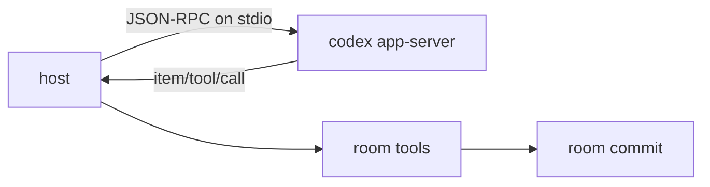

# Codex

`@ambionframework/codex` runs an Ambion seat on `codex app-server`. This page
holds what is specific to the Codex adapter. [Executors](executors.md)
holds the shared contract: the activation flow, the room tools, exchange
continuity, failure classification, the step vocabulary, and the trace. [The
Pi guide](pi.md) and [the Claude guide](claude.md) cover the other two
shipped executor kinds. [The
README](../README.md) holds the positioning.

## What the package is

**A seat that Codex runs.** `codex()` defines the executor of an agent.
`codexExecution()` gives a room or a runtime the services that run it.
Codex owns the model loop and its thread.

**A Codex seat has no native tools, ever.** Files and a shell come only from
the workspace tools, behind the workspace port, so it makes no difference
whether the workspace is in memory, a directory, or a remote workstation.
The seat reaches the world through the room tools and the tools that you
give it, as a Pi seat does. [Workspace](workspace.md#give-the-resource-to-an-agent)
states the workspace tools: `read`, `write`, `edit`, `bash`, and the
others. A seat of any executor kind joins one room.
[Executors](executors.md#the-executor-contract) states how a room resolves
an execution. Pass `codexExecution({ codexPath, env, home, login })` for
another binary, environment overlay, Codex home, or login.

**The kernel gains no dependency.** `@ambionframework/ambion` imports no model
library. `@openai/codex` belongs to this package only, pinned to the exact
version 0.159.2.

## Install and sign in

```sh
npm install @ambionframework/ambion @ambionframework/journal @ambionframework/codex
```

**Node 22.19 or newer.** The package needs the same Node floor as every
Ambion library package.

**The `codex` binary comes with the package.** The package depends on
`@openai/codex`, which installs the binary for the platform. The executor
finds it from `@openai/codex/package.json`. Set
`codexPath` on `codexExecution()` to run another executable.

**Sign in with one of two ways.**

- Set `CODEX_API_KEY` in the environment of the process. The app-server does
  not read the variable. The executor logs in with the key before it opens a
  thread, and Codex keeps the key in memory. Codex writes no `auth.json`.
- Run `codex login` once. The seats link the sign-in file that the command
  writes, `~/.codex/auth.json`. Sign in with ChatGPT to run on a ChatGPT
  Plus or Pro subscription. A host with no browser runs
  `codex login --device-auth`.

**A key wins over `auth.json`.** A seat with `CODEX_API_KEY` ignores the
linked file, as `codex exec` does. A login that Codex refuses is a permanent
failure. Its message names the cause and never holds the key. A login with no answer in 30 seconds is a transient failure.

**A subscription needs no key.** Leave `CODEX_API_KEY` out of the
environment, so that the binary runs on the ChatGPT sign-in. The execution
finds `~/.codex/auth.json` under the `HOME` of the process, or under the
`HOME` that `env` sets. A `login` option names another file. A subscription
has its own usage
limit, which is a permanent failure. Codex reports no cost, so the executor
records none. A provider may restrict the use of a consumer subscription
outside its own clients. Read its terms first.

**The seats of an execution share a Codex home of their own.** The default home is
`~/.ambion/codex`, under the `HOME` of the host. The execution sets
`CODEX_HOME` to it for each run of the binary, and the `CODEX_HOME` of the
host never reaches the binary. A seat reads no `config.toml` and no
`AGENTS.md` from `~/.codex`, and it starts none of the MCP servers that
file names. The home persists, so a thread survives a restart of the host.
The execution creates the home when the first activation starts, with the
mode `0700`, because it holds full transcripts, logs, and the linked login.

**The home links the login of the host.** The first activation creates the
symbolic link `auth.json` in the home. It points to the login file of the
host: `auth.json` in the `CODEX_HOME` of the host when that
variable is set, else `~/.codex/auth.json`. Codex writes that file in
place, and it reads the file again before it refreshes a token. The host and
all seats then share one login. A copy would hold a refresh token that
Codex rotates, and the copy and the original would diverge.

**The link has rules.**

- A home that already holds an `auth.json` keeps it. The execution never
  replaces or edits that file.
- A host with no login file gets no link. A seat on `CODEX_API_KEY` needs
  none. `login: false` links nothing in any case.
- Where the host refuses symbolic links, such as Windows with no privilege,
  the execution makes a hard link. If both fail, the activation fails as
  permanent. The message names both paths.
- Several activations can start at once. A link that another activation made
  counts as success.

**A keyring login cannot be shared.** With `cli_auth_credentials_store`
set to `keyring`, or to `auto` on a host with a keyring, Codex stores the
login in the keyring under a key that holds a hash of the `CODEX_HOME` path.
A seat home has another path, so it finds no login. Set the store to `file`
in `~/.codex/config.toml` and run `codex login` again. Or sign in to the
home: `CODEX_HOME=~/.ambion/codex codex login`.

## A complete example

```ts
import {
  createRuntime,
  defineAgent,
  definePerson,
  isSaid,
  startRoom,
} from '@ambionframework/ambion';
import { codex, codexExecution } from '@ambionframework/codex';
import { memoryJournals } from '@ambionframework/journal';

const planner = defineAgent({
  name: 'planner',
  identity: 'Reads the plan and names what is missing.',
  executor: codex({
    instructions: 'Speak when the plan lacks evidence.',
    model: 'gpt-5.6-luna',
    modelReasoningEffort: 'medium',
  }),
});

const priya = definePerson({ name: 'priya', identity: 'Project manager.' });

const runtime = createRuntime({ storage: memoryJournals() });
const room = await startRoom({
  runtime,
  name: 'delivery',
  agents: [planner],
  execution: codexExecution(),
});
const visit = await room.visit(priya);
const exchange = await visit.send({ text: 'Is the plan ready?' });
const messages = await exchange.waitForClose();
console.log(messages.filter(isSaid).map((message) => message.text));
await room.stop();
```

**A seat gets files and a shell from a workspace.** Give the seat the tools
of a workspace in `bundles`. The tools run behind the workspace port, so the
backend is a choice of the host: in memory here, a directory, or a
workstation.

```ts
import { defineAgent } from '@ambionframework/ambion';
import { codex } from '@ambionframework/codex';
import { memoryBackend } from '@ambionframework/just-bash';
import { openWorkspace } from '@ambionframework/workspace';

const workspace = openWorkspace({ name: 'site', backend: { bash: memoryBackend() } });

const writer = defineAgent({
  name: 'writer',
  identity: 'Writes the notes of the site.',
  executor: codex({
    instructions: 'Keep the notes in your workspace, and say where they are.',
    model: 'gpt-5.6-luna',
    bundles: [workspace.tools()],
  }),
});
```

A test in the package typechecks these blocks against the source of the
package. The block in `packages/codex/README.md` gets the same check.

## Options

**`codex(options)` takes the fields of an agent and two settings of the
model.** The executor passes each setting to `codex app-server`.

| Option                 | Default            | What it does                                                        |
| ---------------------- | ------------------ | ------------------------------------------------------------------- |
| `instructions`         | Required           | The private voice of the agent                                      |
| `model`                | Required           | A Codex model identifier                                            |
| `tools`                | None               | Tools from `defineTool`. They reach Codex as dynamic tools          |
| `bundles`              | None               | Tool bundles with guidance                                          |
| `compose`              | `quickjsRuntime()` | The `compose` and `describe` tools: a runtime and optional limits   |
| `speaking`             | `DEFAULT_SPEAKING` | The speaking policy that replaces the default                       |
| `activationTokenLimit` | The whole record   | The token limit for the record one activation reads                 |
| `estimateTokens`       | `'length'`         | The name of the estimator in the runtime that counts tokens         |
| `modelReasoningEffort` | Codex default      | `minimal` up to `ultra`, as Codex lists them                        |
| `reasoningSummary`     | `'auto'`           | `auto`, `concise`, `detailed`, or `none`: see "Debug an activation" |

**`estimateTokens` names an estimator in the runtime.** The room runs it
and windows the record, so the definition carries the name alone. `length`,
the default, counts `Math.ceil(text.length / 4)`. `createRuntime({ estimators })`
registers other names, and a room start fails on a name the runtime does not
hold. [History and limits](room.md#history-and-limits) states the rule.

**The executor fixes the policy of the thread.** A seat has no option for
it. The executor sets `sandbox` to `read-only`, `approvalPolicy` to
`never`, and `cwd` to an empty temporary directory. [The trust boundary](#the-trust-boundary) states
why.

**`codexExecution(options)` takes the options of the executable.**

| Option      | Default                                      | What it does                                                                              |
| ----------- | -------------------------------------------- | ----------------------------------------------------------------------------------------- |
| `codexPath` | The bundled binary                           | A `codex` executable to run                                                               |
| `env`       | None                                         | Variables to lay over the allowlisted variables of `process.env`. `undefined` removes one |
| `home`      | `.ambion/codex` under the `HOME` of the host | The Codex home of every seat                                                              |
| `login`     | The `auth.json` of the host                  | The `auth.json` to link into the home. `false` links nothing                              |

**The binary runs with an allowlisted environment.** The base is the
variables of `process.env` that the next table names. The
`env` option lays over it: a value adds or replaces a variable, and
`undefined` removes one. Then the execution sets the variables of the seat,
and they win over `env`. The same environment goes to every run of the
binary, including the `codex debug models` run for the catalog.

**The allowlist holds what the binary needs to reach its provider.**

| Admitted by                                                                  | Why                                                                 |
| ---------------------------------------------------------------------------- | ------------------------------------------------------------------- |
| `PATH`, `USER`, `LOGNAME`, `TMPDIR`, `TEMP`, `TMP`, `TZ`, `LANG`             | The binary finds programs, writes temporary files, and formats time |
| `HTTP_PROXY`, `HTTPS_PROXY`, `ALL_PROXY`, `NO_PROXY`, lowercase forms        | A host behind a proxy reaches the provider                          |
| `NODE_EXTRA_CA_CERTS`, `SSL_CERT_FILE`, `SSL_CERT_DIR`                       | A host with its own certificate store verifies the provider         |
| `USERPROFILE`, `APPDATA`, `LOCALAPPDATA`, `SYSTEMROOT`, `COMSPEC`, `PATHEXT` | The binary starts on Windows                                        |
| `CODEX_API_KEY`, `CODEX_ACCESS_TOKEN`, `CODEX_CA_CERTIFICATE`                | The key, the token, and the certificate of Codex                    |
| `OPENAI_*`                                                                   | `OPENAI_API_KEY` and `OPENAI_BASE_URL` serve the default provider   |
| `LC_*`                                                                       | The locale                                                          |

**On Windows the allowlist compares names without case.** Windows spells
some variables in mixed case, such as `Path` and `SystemRoot`, and the
binary needs them to open a socket.

**Every other variable stays with the host.** `SHELL` and `TERM` are not on
the list, because a seat has no native tool and no terminal. Other `CODEX_`
variables, such as `CODEX_SQLITE_HOME` and `CODEX_SANDBOX`, move the state,
the sandbox, or a server of Codex out of the seat. A cloud key, a
token of a code host, and the socket of an SSH agent reach no
process. A provider with another
`env_key` in the `config.toml` of `home` needs that variable in `env`.

**The seat sets `CODEX_HOME`, `HOME`, and `USERPROFILE`.** `CODEX_HOME` is
`home`. `HOME` and `USERPROFILE` are the private directory `home/home`, which
the execution creates with the mode `0700`. Codex finds skills under
`$HOME/.agents/skills`. With a private `HOME`, a skill of the host user
reaches no prompt, and no dotfile of the host user is in the reach of the
binary. The login still works, because `auth.json` lives in `CODEX_HOME`.

**The defaults of `home` and `login` read the host.** The `HOME` and the
`CODEX_HOME` of the host are the values of `process.env` with `env` laid over
them. The `CODEX_HOME` of the host sets the default `login` to
`<CODEX_HOME>/auth.json`. Neither value reaches the binary.

## How a room tool reaches Codex

[Executors](executors.md#the-room-tools) states the room tools, the commit
key, and the room answers.

**The room tools are dynamic tools of the thread.** The room tools (`say`,
`schedule`, `seat`, `unseat`, `dismiss`, `recall`) and the tools of the
agent live in the host. The executor lists each one in the `dynamicTools`
parameter of `thread/start`, with its description and its JSON Schema. No
server runs beside the process, and no socket or bridge exists.


```mermaid
flowchart LR
  H[host] -- JSON-RPC on stdio --> C[codex app-server]
  C -- item/tool/call --> H
  H --> T[room tools]
  T --> R[room commit]
```

1. The model calls a tool. Codex sends the notification `item/started` with
   an item of the type `dynamicToolCall`.
2. Codex sends the request `item/tool/call` to the host, with the call id,
   the tool name, and the arguments.
3. The executor runs the call on the tool that the core bound. It gives the
   tool the step id that `steps.idOf(turnId, callId)` returns for the pass
   and the call. It answers with `contentItems` and `success`.
4. Codex sends `item/completed` and gives the answer to the model.

**An answer holds text and images.** A text part becomes an `inputText`
item. An image part becomes an `inputImage` item with a data URL. `success`
is `false` when the tool reports an error or throws. The model then reads
the message as the tool output.

**The host refuses every other request of the server.** Codex can ask for
an approval, a user input, or a token refresh. The executor answers each
with the error code -32601 and keeps a warning `notice` that names the
method. `approvalPolicy` is `never`, so a seat does not see the first two.

**A thread keeps its tools.** Codex writes the dynamic tools in the first
line of the rollout file of the thread. `thread/resume` takes no tool list.
[Exchange continuity](#exchange-continuity) states the rule that follows.

**A tool call is ready when the thread starts.** The tools belong to the
thread, so the first model request lists them. The binary tier asserts it.
There is no startup race and no approval mode to set: the call goes to the
host, and the room checks it.

## How an activation runs

[Executors](executors.md#the-executor-contract) states the pass flow.
[How an activation runs](executors.md#how-an-activation-runs) states the
read position.

**One process serves one activation.** The executor starts
`codex app-server` with the config flags of the seat, sends `initialize`
and the `initialized` notification, and then opens a thread. The first pass
sends `turn/start` with the view. A later pass sends the delta, the lines
that landed since the pass read, as the next `turn/start` of the same
thread. Codex calls the object that `turn/start` creates a turn. One pass
runs one Codex turn, and this page says pass. The process stays up between
passes and stops at `close`.

**The thread parameters carry the seat's part.** `thread/start` takes
`baseInstructions`, the seat text. The seat text is the note of the
executor, the mechanism, and the agent instructions, in that order, with a
blank line between them. The core fixes all three for an activation, so the
executor builds the text once, from the first pass. `baseInstructions`
replaces the base prompt of Codex, which teaches `apply_patch` and the
shell. A seat has no native tools and needs nothing from that prompt. The
text arrives unchanged, and the binary tier proves it with quotes,
backslashes, newlines, and non-ASCII characters.

**The thread policy is fixed.** `sandbox` is `read-only`, `approvalPolicy`
is `never`, and `cwd` is the empty scratch directory of the activation.

**The echo of the input is the signal that the model read it.** Each
`turn/start` and `turn/steer` carries a `clientUserMessageId`. When Codex
sends `item/completed` for the `userMessage` item with that `clientId`, the
model has the input. The executor then calls `read` with the range of the
view or the delta. A tool result reaches the model when the tool returns,
so the executor calls `delivered` at once. A missed say moves the position
to the last of the messages it carries, and a `schedule` moves it to the
scheduled say; see [Executors](executors.md#how-an-activation-runs).

**A pass ends on `turn/completed`.** The `status` of the notification tells
whether the pass completed, failed, or was interrupted. A `failed` status
carries a `codexErrorInfo` that the classifier reads.

**Codex takes a steer.** The core calls `steer` when a line lands during a
pass. The executor sends `turn/steer` with the `turnId` of the pass as
`expectedTurnId`. Codex echoes the line as a `userMessage` item, and the
executor then calls `read` and the core records the `steer` step with
`consumed: true`. A line that arrives before `turn/start` answers waits for
the answer. A line that arrives after the pass ended waits for the next delta, and the
core records the `steer` step with `consumed: false`.

**A rejected steer waits for the next delta.** Codex refuses `turn/steer`
with the error code -32600 when the pass is already over. The line is not
read, and the next pass carries it. The core records the `steer` step with
`consumed: false`. [The harness matrix](executors.md#the-harness-matrix)
shows the other kinds.

**A cut interrupts the pass.** The signal of the activation makes the
executor send `turn/interrupt`. The pass settles when `turn/completed`
arrives, or after a grace period of 5 seconds. A cut is no failure.

**`close` stops the process.** It ends the input of the process and sends
SIGTERM. A process that is still alive after 2 seconds gets SIGKILL.

**A host that dies takes `codex app-server` with it.** The process reads
the input of the host. When the host dies, the OS closes the pipe, and
`codex app-server` ends. A test kills a real host in the middle of a model
request and proves that the process goes away within seconds.

## Step mapping

[Executors](executors.md#the-step-vocabulary) holds the step kinds. The
table below gives the Codex source of each step.

**Each item that Codex reports becomes steps in the trace.** The item
notifications carry the thread, the turn, and the item. Codex streams the
text of an item in deltas and sends the whole item at `item/completed`. The
executor maps each delta to a step and the completed item to a closing step.

| Codex item or notification        | Steps                                                                                                           |
| --------------------------------- | --------------------------------------------------------------------------------------------------------------- |
| `agentMessage`                    | `text` deltas, then a closing `text`                                                                            |
| `reasoning`                       | `thinking` deltas, then a closing `thinking`; a new summary part starts after a blank line                      |
| `dynamicToolCall`                 | `tool_call` and `tool_result`; a room tool has its own name                                                     |
| `warning`                         | `notice` at level `warning`, with the message of Codex, up to 2000 characters                                   |
| `configWarning`                   | `notice` at level `warning`, with the summary and the details                                                   |
| `deprecationNotice`               | `notice` at level `warning`                                                                                     |
| `error` with `willRetry`          | `notice` at level `warning`, such as "Reconnecting... 1/5"                                                      |
| Any other item                    | `notice` at level `warning` that names the item type, when the item completes                                   |
| `thread/start` or `thread/resume` | Once for each thread: `session`, and a `notice` at level `info` with the thread, the home, and the rollout file |
| `thread/tokenUsage/updated`       | `usage`                                                                                                         |
| `turn/completed` with `failed`    | No step; the failure goes to the `end` step                                                                     |

**The `session` step opens the activation.** The executor records it after
the thread opens. It holds the name `codex`, the version of the binary, the
model, the working directory, the thread id, the sign-in kind that
`account/read` reports (`none` when Codex reports no account), the
permission mode `approvalPolicy, sandbox`, the names of the bound tools, and
the MCP servers that `mcpServerStatus/list` reports. The core fixes the
shape in `SessionFacts`.

**The id of a step is unique in the room.** A real `codex` numbers the items
of each pass from `item_0`. The id of a step holds the activation id, the
`turnId`, and the item id, as in `message:3:gpt:1:turn-1:item_1`. A room
tool takes that id as the key of its commit, so the say of each activation
lands under its own key.

**A `compose` call adds steps that no Codex item carries.** Codex hosts
`compose` as a dynamic tool, through the same `agentTools` path as Claude.
The core records the `approval` step and the nested `tool_call` and
`tool_result` steps with a `parent`. No test of `compose` runs on a Codex
seat ([Compose](compose.md#acceptance)).

**A failed tool call marks its result.** The `tool_result` carries the text
of the answer. A failed call without text carries "The tool failed.".
An image of the answer returns to its form in the trace: the bytes of a data
URL, or the URL.

**A tool with a namespace shows with it.** The step name is
`namespace__tool`. A room tool shows with its plain name, such as `say` or
`schedule`. The core raises no tool event for a room tool that commits an
entry; see [Executors](executors.md#the-room-tools).

**An item of another type shows that a native tool exists.** A seat has no
native tool, so Codex reports only the items above. A command, a file
change, a web search, or a plan item means that a newer `codex` added a tool
that the recipe does not turn off. The trace keeps a warning `notice`:
"Codex reported a native <type> item. A seat has no native tools." The
executor maps nothing else from such an item.
[The trust boundary](#the-trust-boundary) states the guard.

**A notice never gates the activation.** The trace keeps a repeated warning
once for each text. A pass that fails ends with `turn/completed` and the
status `failed`. The `end` step carries that failure.

## Usage

**One `usage` step follows each model request.** `thread/tokenUsage/updated`
reports the tokens of the thread. Its `last` field holds the request that
just ended, and the executor reads that one. [Executors](executors.md#the-step-vocabulary)
states how the driver sums the steps at release. The activation reports the
sum on `activation_end`.

**Codex reports no cost.** The `cost` field of `usage` stays absent. A room
that budgets on cost needs its own price table.

**Input tokens include the cache.** The count is

```text
input      = inputTokens - cachedInputTokens - cacheWriteInputTokens
cacheRead  = cachedInputTokens
cacheWrite = cacheWriteInputTokens
output     = outputTokens
```

The three parts add up to `inputTokens`. A count that subtracts only the
cached tokens counts the cache writes twice.

**Known limit.** The count ignores `reasoningOutputTokens`. The recorded
runs do not show whether `outputTokens` includes them.

## Debug an activation

**The trace shows each step of the model.** Give the `logger` option of
`createRuntime` a function that keeps the steps. Each activation logs its
`thinking`, `text`, `tool_call`, and `tool_result` steps, the `room`
answers, and the `usage`. The `end` step
holds the failure of a pass that failed.

**The reasoning summary feeds `thinking`.** Codex shows no raw reasoning.
It shows a summary that the model writes when the request asks for one. The
catalog of some models turns the summary off, so the executor asks for it:
`reasoningSummary` is `auto` by default and goes to Codex as
`model_reasoning_summary`. `concise` and `detailed` set the size. `none`
asks for no summary, and the request then has no `reasoning.summary` field.

**The default trace policy cuts each thinking block to 280 characters.**
[Executors](executors.md#the-trace-log) states the policy. Set
`defineAgent({ trace: { thinking: 'full', toolOutput: 'full' } })` to keep
all of each block while you debug.

**One `notice` joins the trace to the full record of Codex.** The notice
has the text "Codex thread" and the level `info`. Its `data` holds the
`thread` id, the `home` of the seat, and the `rollout` path. The rollout is
the file `<home>/sessions/YYYY/MM/DD/rollout-<time>-<thread>.jsonl`. It
holds the instructions, every input and output item, the reasoning, and the
tool calls. The path comes from `thread.path` in the answer of `thread/start`
or `thread/resume`. Each thread has one notice for the activation.

**Codex keeps its own logs in the seat home.** `logs_2.sqlite` in the home
holds the log of the `codex` process. The executor keeps the last 2000
characters of the stderr of the process for a failed pass.

## Failures

[Executors](executors.md#failure-classification) states the shared rule.

**A failed pass carries a typed error.** `turn/completed` with the status
`failed` holds `codexErrorInfo`. When the error names an HTTP status in
`httpStatusCode`, the classification applies the shared status rule to it.
Otherwise it reads the message with the shared text set, which holds the
words of the Codex login.

**A text that names a full context window or a spent output limit reports
a length stop.** The pass reports `stop: 'length'`. This is no failure.

**A process that exits during a pass is a transient failure.** The failure
message holds the reason (`exited with code 1` or `was stopped by SIGKILL`)
and the last 2000 characters of the stderr of the process. The room retries
the activation.

**A missing `codex` binary is permanent when the executor looks for it.**
The executor reads the model catalog from the binary. It throws
`PermanentError` when the platform has no binary, or when `@openai/codex`
is not installed and no `codexPath` is set.

**A bad `codexPath` is transient.** The executor uses a `codexPath` (see
[Options](#options)) as given. A path that names no file fails when
`codex debug models` or `codex app-server` starts it. The message reads
"could not start".

**A refused `initialize` or `thread/start` fails the pass.** The error of
the server is the message of the failure.

## Exchange continuity

[Executors](executors.md#exchange-continuity) states the rule, the recorded
session, and the fresh start.

**An activation resumes the thread that `spec.resume` names.**

- The release records the thread id from the answer of `thread/start`.
- An activation whose `spec.resume` names a Codex thread sends
  `thread/resume` with the id. Every other activation starts a fresh thread.

**A resume needs the same tools.** The rollout file of the thread keeps the
dynamic tools of its start, and `thread/resume` takes no new list. The
executor reads the first line of the rollout file and compares the kept
tools with the bound tools. When they are equal, it resumes. When they
differ, it starts a fresh thread.

**A resume that Codex cannot honor starts a fresh thread.** An error of
`thread/resume`, such as an unknown thread id, makes the executor start a
fresh thread, run the same prompt, and record the new id. The trace keeps a
`notice` at level `info` with the text "Codex thread not resumed". A dead
process is an ordinary failure, and the executor does not start a fresh
thread for it.

**A resume reads no history.** The executor sends `excludeTurns: true` with
`thread/resume`. Codex then hydrates no history and sends no
`deprecationNotice`. The executor reads only `thread.path` of the answer.

**A resume adds no usage of the earlier activation.** Right after
`thread/resume` answers, Codex repeats `thread/tokenUsage/updated` for the
last pass of the earlier activation. The executor drops a usage note when no
pass runs or when its `turnId` differs from the running pass. The binary
tier proves that a resumed activation counts only its own requests.

**A resumed thread takes the seat text of its own activation.**
`thread/resume` takes `baseInstructions`, and the binary tier proves that a
resumed thread follows the new text and drops the old text. The first prompt
of a resumed activation holds the view alone, as the first prompt of a fresh
thread does.

**Threads live in the Codex store of the seat home.** Codex persists threads
under `sessions` in the home, `~/.ambion/codex/sessions` by default. A host
that loses that directory falls back to a fresh thread. Give `home` a
directory that persists. Codex refuses to create its helper binaries under a
temporary directory.

## The trust boundary

**A seat has no native tools, ever.** Files and a shell come only from the
workspace tools, behind the workspace port, so it makes no difference
whether the workspace is in memory, a directory, or a remote workstation.
The seat has the room tools (`say`, `schedule`, `seat`, `unseat`,
`dismiss`, `recall`) and the tools of `tools` and `bundles`. Every Codex seat
has the same kind of tools. No option gives a seat the shell, the file
edits, the web search, or the sandbox of Codex, and the workstation backend
needs no separate guard against a native command.

**Code Mode ignores the sandbox.** This is a fact about Codex 0.155.1, and
the reason that the recipe patches the catalog.
Code Mode is a JavaScript runtime that the model calls through `exec` and
`wait`. On a read-only sandbox, with no network and a deny permission
profile, its JavaScript still read `/etc/hosts` and listed `/Users` through
`fs`. It could not start a process or reach the network. `sandboxMode` and
permission profiles do not confine it. The run on 0.155.1 is the only
evidence of the file reads. A run of the 0.158.0 binary showed that a feature
flag cannot turn Code Mode off. With the unpatched entry of
`gpt-5.6-luna` and every listed feature off, the model gets `exec` and `wait`
and no room tool, and Codex warns that Code Mode fails closed. The model
catalog turns it on: `gpt-5.6-luna` has `tool_mode: 'code_mode_only'`.
`gpt-5.5` has no tool mode.

**An image from a tool of the seat reaches the model.** A tool that returns
an image part, such as the workspace `read` of a picture, sends the image to
a model that reads images. Codex puts it in the tool output as an
`input_image`, and the trace keeps the part. No native tool reads an image,
because the `view_image` feature is off. A model with no image input in its
catalog entry stays text-only. Codex then replaces the image with a text
placeholder.

**The recipe replaces the catalog entry.** A custom catalog overrides the
entry of a model. The executor runs `codex debug models` on the installed
binary once for each binary in the process and patches the entry of the seat
model. It writes the patched catalog to a temporary directory and passes the
path as `model_catalog_json`. The recipe has five parts:

1. **The catalog entry.** `tool_mode`, `apply_patch_tool_type`, and
   `multi_agent_version` are `null`. `supports_search_tool` and the three
   `include_*_usage_instructions` flags are `false`. `node_repl_disabled` is
   `true`. `experimental_supported_tools` is empty. This removes Code Mode,
   the patch tool, and the search tool. The patch leaves `input_modalities`
   and `supports_image_detail_original` as the entry has them.
2. **The features.** The config sets 37 features to `false`, among them
   `shell_tool`, `unified_exec`, `code_mode`, `code_mode_only`, `apps`,
   `plugins`, `computer_use`, `multi_agent`, `hooks`, and `view_image`. This
   removes the shell and the tools that a feature adds. Five of them give
   no tool: `shell_snapshot`, `daemon_auto_start`, `workspace_dependencies`,
   `worktrees`, and `realtime_conversation`. Each acts on the host or the
   network. `shell_snapshot` runs the shell of the host user and writes its
   environment to a file in the seat home. `memories` is off by default, and
   the entry keeps the `config.toml` of the seat home from turning it on.
   A run of 0.158.0 showed that Codex turned `unified_exec` on again unless a managed requirement
   pins it. With `shell_tool` off, `unified_exec` adds no tool, and the
   tool-list test shows it.
3. **The tool switches and the skills.** `web_search` is `'disabled'`.
   `update_plan` and `experimental_request_user_input` are disabled.
   `skills.include_instructions` and `skills.bundled.enabled` are `false`,
   so no `skills_instructions` message reaches the model and Codex installs
   no system skill in the seat home. The catalog flag
   `include_skills_usage_instructions` did not remove that message in
   a run of 0.158.0.
4. **The bundled REPL.** Codex adds a `node_repl` MCP server. The config
   declares `mcp_servers.node_repl` as disabled, by name. Without it the tool list holds `mcp__node_repl.js`.
5. **Defense in depth.** The thread runs on a read-only sandbox, with no
   network, no approval, and an empty temporary directory as its working
   directory. No repository and no host file is the default context.

**The recipe turns off the traffic and the state that a seat does not
need.** `check_for_update_on_startup`, `analytics.enabled`, and
`feedback.enabled` are `false`. Only the terminal interface of Codex reads
`check_for_update_on_startup`, and `codex app-server` starts no update check.
The config sets the key so that a later version keeps the same behavior. `memories.generate_memories` and
`memories.use_memories` are `false`, and so is the `memories` feature. Codex
0.159.2 recognizes each key and reports no warning for it. With a dummy API
key, a run makes no request except the model requests and opens no outbound
connection, with these keys. The binary tier asserts it.
A seat on a ChatGPT sign-in is the case that the keys protect, and the
binary tier does not run it.

The temporary directory of each activation holds the patched catalog and
the empty working directory. The executor removes it when the activation closes,
and at process exit.

**A model with no catalog entry does not start.** The activation fails as
permanent. The message names the model. The executor never leaves native
tools on by accident. Use a model that `codex debug models` lists.

**The version pin guards the recipe.** The package pins `@openai/codex`
0.159.2. The feature names, the config keys,
and the catalog fields belong to that version. A newer `codex` can add a
native tool that the recipe does not turn off, and it can drop a key that
the recipe sets. Codex then warns about the key. The binary tier asserts
that a default seat produces no warning `notice` and no skills block, so
such a change fails a test. Run that tier and the live exclusivity test
(`test/live/exclusive.test.ts`) against a new version, and trust the
version only when both pass. A native item that Codex reports shows in the
trace as a warning `notice`.

**Features that stay on by default give no tool.** A run of `codex features list`
on 0.158.0 showed 15 more features that are on and not in the recipe. They
are the app features, the approval features, `auth_elicitation`,
`fast_mode`, and a few wire features. None adds a tool or reaches the host.
The comment on `EXCLUSIVE_FEATURES` names each one. The list also prints
nine removed flags as on, such as `steer` and `sqlite`. A removed flag has
no effect. A new default feature
needs the same check on each upgrade.

**The environment is an allowlist.** The binary runs with the allowlisted
variables of `process.env`, the `env` of the host laid over them, and the
variables of the seat. `CODEX_API_KEY` and `OPENAI_API_KEY` pass by prefix.
Pass `OPENAI_API_KEY: undefined` and `CODEX_API_KEY: undefined` in `env` to
keep both from the `codex` process, and sign in with `codex login`. No
other secret of the host reaches the binary.

**The seat home keeps the config of the host user out.** The binary reads
its config, its instructions, and its MCP servers from `CODEX_HOME`. The
execution points that variable at the seat home, so the `~/.codex` of the
host user changes no seat: its `model_provider` reroutes no request, its
`mcp_servers` start no process, and its `AGENTS.md` joins no prompt. The
binary tier proves each of the three. Put a `config.toml` in `home` to
configure every seat on purpose. The private `HOME` does the same for the
skills of the host user under `~/.agents/skills`.

**The `config.toml` of the seat home is the responsibility of the host.**
The executor overrides each config key that the recipe names. Any other key
in that file survives by a deep merge. An extra `[mcp_servers.<name>]`
table starts a server whose tools reach the host, and a
`features.<name> = true` entry turns on a feature that the recipe does not
list. The default home `~/.ambion/codex` holds no `config.toml` until a
person writes one. Write only keys that you trust.

**A linked login is shared with the host.** The seat home holds a link to the
login file of the host. A seat has no native tool, so no tool of the seat
reads or writes the seat home. The workspace tools reach the workspace
only. Set `login: false` and `CODEX_API_KEY` to give a seat no login file.

**The room tools need no approval.** The thread policy is `never`. A call
of a dynamic tool goes to the host, which calls the room, and the room
checks it.

## Testing

**Three tiers test the package.** The fake connection and the real binary on
a scripted model run in the unit tier. The live tier runs the real binary on
a real model.

**The fake tier replaces the process.** `test/fake.ts` is a fake
`codex app-server`. It answers the requests of an activation and plays the
notifications that the real binary sent for the same requests. The executor
takes it through the `connect` option, so the tests run a real core
activation over a real journal. `test/app-server.test.ts` runs the real
JSON-RPC client against a small child process.

**The binary tier scripts the model.** `codex` accepts a custom model
provider through its config. A local HTTP endpoint in `test/responses.ts`
speaks the Responses API and plays one reply for each request: assistant
text, or a call to a named tool. It records the body of each request. The
tests in `test/binary.test.ts` run the bundled `codex app-server` and a room
over a journal. Only the model is scripted.

**The binary tier runs in a seat home of its own.** `test/binary.ts` writes
a temporary home with a `config.toml` that sends the provider to the
endpoint, and passes it as `home`. The file leaves every other key to the
recipe, including the update check. The environment of the binary holds
`PATH`, a dummy key variable, and a proxy that records and refuses every
outbound connection, laid over the allowlist. The catalog lookup
(`codex debug models`) runs in the same environment. No real sign-in reaches
the binary, and every model request goes to the endpoint. The file skips on
a platform with no bundled binary, except under CI, where it fails.

**The host home holds traps.** Its `.codex` has a `config.toml` that
reroutes the provider to a dead port and starts an MCP server that writes a
marker file, an `AGENTS.md` with a unique text, and a skill under
`.agents/skills` with another. A test asserts that the endpoint got the
requests, that the marker file does not exist, and that neither text is in a
request body. `test/home.test.ts` asserts which variables reach the binary.

**The login test uses an API key file.** A host `auth.json` holds an API
key, and the provider takes the sign-in of the home. The test asserts that
every request carries the key of the host file, that the home holds a
symbolic link to that file, that the `session` step reports `apiKey`, and
that the file is as it was. A ChatGPT login file makes Codex connect to
`chatgpt.com`, so the test does not use one. The proxy would show it. The
refresh of a ChatGPT token (`account/chatgptAuthTokens/refresh`) is not
tested. `test/home.test.ts` covers the rest of the rules of the link on real
files.

**Every request lists the room tools.** The tools belong to the thread. The
endpoint does not retry or skip a request that lacks a tool. A request
without `say` gets the result `unsupported call`, and the assertions on the
request count and on the tool list fail.

**The binary tier proves what the model receives.** The recorded request
bodies show the tool list, the prompts, and the items of an earlier pass.
A default seat receives the seat text as the first developer message, and no
developer message starts with "You are Codex". The last user message holds
the view alone. No request holds a `skills_instructions` message or the name
of a system skill. A test states each of these facts, so a change to one
shows in a failing assertion.

**The binary tier asserts that a default seat gets no warning.** Two tests
run a default seat and assert that the trace holds no `notice` at level
`warning`. Codex reports an unrecognized config key as a `configWarning`,
and the executor maps it to such a notice. A key that a newer `codex` drops
shows as a failing test. Another test adds an unknown key to the home and
asserts that the warning names it, so the check cannot pass by silence. The
warning about a missing `bwrap` depends on the host, and the test filters
it.

**The binary tier proves steer and the cut.** Three tests steer a line in
the middle of a tool call, in the middle of the final reply, and after
`turn/completed` while the receipt of the host is late. The last one
captures the -32600 refusal and shows that the next delta carries the line.
Another test cuts an activation and finds `turn_aborted` in the rollout.

**The binary tier proves continuity.** One test resumes a thread in a new
process with replaced seat text. One test changes the tools and gets a fresh
thread with the `notice`. One test resumes an unknown thread id and gets a
fresh thread. One test runs a delta pass and shows that one process serves
both passes.

**The binary tier proves the rule on the workspace tools.** One test gives a
seat the workspace tools over the in-memory backend. The scripted model
calls `write` and then `bash` to read the file back, and then `say`. The
test asserts that the tool list holds the workspace tools beside the room
tools and no native tool, that the file exists in the workspace when the
port reads it, and that the output of `bash` reaches the model in the next
request.

**The binary tier cannot prove that a model obeys.** A scripted model does
what the script says, and it streams no deltas. The live tier proves the
claims that need a real model.

**The live tier runs the executor suite.** The live file
`test/live/conformance.test.ts` runs the suite through
`codexExecutorFixture` in `test/live/support.ts`: the model follows each
plan from its instructions. A key that the provider refuses gives the
permanent failure, and a `codex` binary that does not exist gives the
transient one.

**A dump shows what a live case saw.** Set `AMBION_LIVE_DUMP=<dir>` to write
one JSON file for each case of the live suite. The file holds the room calls
with their answers, every step, and for each activation the prompt of each
pass and each request that the executor sent to Codex. Without the
variable, the suite writes nothing.

**The recorded fixtures come from the binary.** `test/fixtures/` holds the
notifications that a real `codex app-server` 0.159.2 sent for one plain
answer, and the catalog `catalog-0.159.2.json` from the same binary. The
tests map the notifications to steps and count usage. Pure parts have their
own tests: the options, the config flags, and the failure classification.

**The live tier proves the claims that a scripted model cannot.** Each file
holds the smallest room that proves one claim.

| File                            | Claim                                                                                               |
| ------------------------------- | --------------------------------------------------------------------------------------------------- |
| `test/live/loop.test.ts`        | A seat speaks through `say`; no approval error; usage above zero                                    |
| `test/live/tools.test.ts`       | A seat writes a file and runs a command through the workspace tools, and says what the command read |
| `test/live/exclusive.test.ts`   | A seat has exactly the room tools and its own; it reads no host file                                |
| `test/live/image.test.ts`       | An image from a tool of the default seat reaches the model, and the seat names its color            |
| `test/live/steer.test.ts`       | A line sent during a pass reaches the model in that pass                                            |
| `test/live/memory.test.ts`      | Each exchange starts a fresh thread and records it; a bogus id falls back                           |
| `test/live/mixed.test.ts`       | A Pi seat and a Codex seat both speak                                                               |
| `test/live/visibility.test.ts`  | The trace holds the session step and the reasoning summary, and one notice names the thread         |
| `test/live/conformance.test.ts` | The executor suite of `@ambionframework/ambion/conformance`, with steer and no usage plan           |

**Run the live tier in one of two modes.** Every definition sets the model
`gpt-5.6-luna` and `modelReasoningEffort: 'medium'`.

| Mode    | Sign-in                         | Pays                     |
| ------- | ------------------------------- | ------------------------ |
| `key`   | `CODEX_API_KEY` is set          | The API account          |
| `login` | `codex login` wrote `auth.json` | The ChatGPT subscription |

The key wins when the host has both. A file skips when the host has
neither. Unset `CODEX_API_KEY` to run on the login.

```sh
CODEX_API_KEY=... pnpm --filter @ambionframework/codex run test:live
pnpm --filter @ambionframework/codex run test:live   # on the login
```

**The full live tier passed once on a ChatGPT login.** On 2 October 2026
the owner's Mac ran every live file on the `login` mode, with Codex 0.159.2
and no `CODEX_API_KEY`. The `session` step of each seat reported `chatgpt`.
The first run passed 19 of 20 tests.

**The one failure was in the dump.** The wrapper of `AMBION_LIVE_DUMP` did
not pass the steer to the executor, so the steer case of the suite failed.
After the fix, the conformance file passed all 10 cases. No test covers the
token refresh (`account/chatgptAuthTokens/refresh`), because no token
expired during the run.

The mixed file also needs the key of the Pi model (`AMBION_MODEL`, default
`anthropic/claude-sonnet-5`). A live run costs money: run one file with
`pnpm --filter @ambionframework/codex exec vitest run --config
vitest.live.config.ts test/live/loop.test.ts`.

## Troubleshooting

**The seat answers in its final message and nobody hears it.** Codex has its
own final-answer channel. The room hears only `say`. The note at the
start of the seat text says so. A seat that still ends with plain text and no `say` shows a
`text` step and no `tool_call` in its trace, and `activation_end` reports
`said: false`.

**The process does not start.** The activation fails as transient, and the
message reads "could not start" or "exited with code N" with the stderr of
the process. Check that `codexPath` names an executable file, or that
`@openai/codex` is installed for the platform. Run
`<codex> app-server` in a terminal to see its error.

**The Node version is too old.** The package needs Node 22.19 or newer. An
older Node fails with a syntax or an engine error.

**A thread cannot resume.** The executor starts a fresh thread and the seat
loses what the old thread held. The record still holds every line. Look for a
missing `sessions` directory in the seat home, a changed `home` option, a
`codex` of another version, a change of the bound tools (the notice
"Codex thread not resumed" says it), or a different account than the one that started
the thread.

**A run fails with a sign-in message.** The failure is permanent, so the room
does not retry. Set `CODEX_API_KEY`, or run `codex login`. A `HOME` that
`env` sets moves the default `login`. A login in the OS
keyring is invisible to a seat: see "A keyring login cannot be shared".

**`Cannot link .../auth.json to the login file ...`** The activation could
make neither a symbolic link nor a hard link, and the failure is permanent.
Run `CODEX_HOME=<home> codex login` to sign in to the home, or pass
`login: false` and set `CODEX_API_KEY`.

**A seat starts with no login although the host has one.** The host login
file is `<CODEX_HOME>/auth.json` when the environment of the host sets
`CODEX_HOME`, else `~/.codex/auth.json`. Check that path, or pass `login`.

**`Cannot run an executor of kind '...': this seat needs 'codex'.`** A Pi or
Claude seat reached a Codex executor through an execution with no kind.
Pass the execution of each executor kind.

**A native tool shows up after a Codex upgrade.** The seat lists or calls a
tool that is not a room tool and not one of yours, and the trace holds a
warning `notice` that names an item type. A newer `codex` added a
feature or a catalog field that the recipe does not cover. Run the binary
tier (`test/binary.test.ts`), which asserts the exact tool list and no
warning `notice` for a default seat, and run `test/live/exclusive.test.ts`
to see the name. Compare `codex debug models` and `codex features list` of
the new version with `src/catalog.ts`. Add the feature or the field, and keep
the version pinned until both tests pass. A warning that names a config key
means that the new version dropped the key: remove it from
`exclusiveConfig`.
