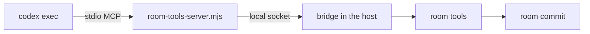

# Codex

`@ambionframework/codex` runs an Ambion seat on the Codex SDK. This page
holds what is specific to the Codex adapter. [Executors](executors.md)
holds the shared contract: the activation flow, the room tools, exchange
continuity, failure classification, the step vocabulary, and the trace. [The
Pi guide](pi.md) and [the Claude guide](claude.md) cover the other two
shipped executor kinds. [The
README](../README.md) holds the positioning.

## What the package is

**A seat that Codex runs.** `codex()` defines the executor of an agent.
`codexExecution()` gives a room or a runtime the services that run it.
Codex owns the model loop and its thread.

**A seat has no native tools by default.** It reaches the world only through
the room tools and the tools that you give it, as a Pi seat does. Set
`nativeTools: 'codex'` to give the seat the tools of Codex: file edits,
shell commands, and web search. Both kinds of seat join one room.
[Executors](executors.md#the-executor-contract) states how a room resolves
an execution. Pass `codexExecution({ codexPath, env, home, login })` for
another binary, environment, Codex home, or login.

**Three MCP helper tools remain.** Codex adds `list_mcp_resources`,
`list_mcp_resource_templates`, and `read_mcp_resource` whenever an MCP server
is on, and no setting turns them off on codex 0.155.1. They reach only the
MCP servers of the seat. The room tools server offers no resource, and it
answers each call with `Method not found`, so they read nothing. A unit
test of the server proves it with a `file:///etc/hosts` request.

**The kernel gains no dependency.** `@ambionframework/ambion` imports no model
library. `@openai/codex-sdk` and `@modelcontextprotocol/sdk` belong to this
package only, pinned to exact versions.

## Install and sign in

```sh
npm install @ambionframework/ambion @ambionframework/codex
```

**Node 22.19 or newer.** The package needs the same Node floor as every
Ambion library package. Codex spawns the room tools server with the Node
that runs your process.

**The `codex` binary comes with the SDK.** `@openai/codex-sdk` depends on
`@openai/codex`, which installs the binary for the platform. Set
`codexPath` on `codexExecution()` to run another executable.

**Sign in with one of two ways.**

- Set `CODEX_API_KEY` in the environment of the process. The binary reads it
  on each run.
- Run `codex login` once. The seats link the sign-in file that the command
  writes, `~/.codex/auth.json`. Sign in with ChatGPT to run on a ChatGPT
  Plus or Pro subscription. A host with no browser runs
  `codex login --device-auth`.

**A subscription needs no key.** Leave `CODEX_API_KEY` out of the
environment, so that the binary runs on the ChatGPT sign-in. A
custom `env` on `codexExecution()` needs `HOME`, so that the execution finds
`~/.codex/auth.json`, or a `login` option. A subscription has its own usage
limit, which is a permanent failure. Codex reports no cost, so the executor
records none. A provider may restrict the use of a consumer subscription
outside its own clients. Read its terms first.

**The seats of an execution share a Codex home of their own.** The default home is
`~/.ambion/codex`, under the `HOME` of `env`. The execution sets
`CODEX_HOME` to it for each run of the binary, and the `CODEX_HOME` of the
host never reaches the binary. A seat reads no `config.toml` and no
`AGENTS.md` from `~/.codex`, and it starts none of the MCP servers that
file names. The home persists, so a thread survives a restart of the host.
The execution creates the home when the first activation starts, with the
mode `0700`, because it holds full transcripts, logs, and the linked login.

**The home links the login of the host.** The first activation creates the
symbolic link `auth.json` in the home. It points to the login file of the
host: `auth.json` in the `CODEX_HOME` of `env` when that
variable is set, else `~/.codex/auth.json`. Codex writes that file in
place, and it reads the file again before it refreshes a token. The host and
all seats then share one login. A copy would hold a refresh token that
Codex rotates, and the copy and the original would diverge.

**The link has rules.**

- A home that already holds an `auth.json` keeps it. The execution never
  replaces or edits that file.
- A host with no login file gets no link. A seat on `CODEX_API_KEY` needs
  none. `login: false` links nothing in any case.
- Where the host refuses symbolic links, such as Windows with no privilege,
  the execution makes a hard link. If both fail, the activation fails as
  permanent. The message names both paths.
- Several activations can start at once. A link that another activation made
  counts as success.

**A keyring login cannot be shared.** With `cli_auth_credentials_store`
set to `keyring`, or to `auto` on a host with a keyring, Codex stores the
login in the keyring under a key that holds a hash of the `CODEX_HOME` path.
A seat home has another path, so it finds no login. Set the store to `file`
in `~/.codex/config.toml` and run `codex login` again. Or sign in to the
home: `CODEX_HOME=~/.ambion/codex codex login`.

## A complete example

```ts
import { defineAgent, defineHuman, isSaid, startRoom } from '@ambionframework/ambion';
import { codex } from '@ambionframework/codex';

const planner = defineAgent({
  name: 'planner',
  identity: 'Reads the plan and names what is missing.',
  executor: codex({
    instructions: 'Speak when the plan lacks evidence.',
    model: 'gpt-5.6-luna',
    modelReasoningEffort: 'medium',
  }),
});

const priya = defineHuman({ name: 'priya', identity: 'Project manager.' });

const room = await startRoom({
  name: 'delivery',
  agents: [planner],
});
const visit = await room.visit(priya);
const exchange = await visit.send({ text: 'Is the plan ready?' });
const messages = await exchange.waitForClose();
console.log(messages.filter(isSaid).map((message) => message.text));
await room.stop();
```

A test in the package typechecks this block against the source of the
package. The block in `packages/codex/README.md` gets the same check.

## Options

**`codex(options)` takes the fields of an agent and the policy of Codex.**
The executor passes each policy field to the Codex SDK unchanged.

| Option                  | Default            | What it does                                                        |
| ----------------------- | ------------------ | ------------------------------------------------------------------- |
| `instructions`          | Required           | The private voice of the agent                                      |
| `model`                 | Required           | A Codex model identifier                                            |
| `tools`                 | None               | Tools from `defineTool`. They reach Codex through the server        |
| `bundles`               | None               | Tool bundles with guidance                                          |
| `speaking`              | `DEFAULT_SPEAKING` | The speaking policy that replaces the default                       |
| `activationTokenLimit`  | The whole record   | The token limit for the record one activation reads                 |
| `estimateTokens`        | `'length'`         | The name of the estimator in the runtime that counts tokens         |
| `nativeTools`           | `'none'`           | `'none'` turns off every native tool; `'codex'` keeps them          |
| `sandboxMode`           | No sandbox         | `read-only`, `workspace-write`, or `danger-full-access`             |
| `approvalPolicy`        | Codex default      | `never`, `on-request`, `on-failure`, or `untrusted`                 |
| `modelReasoningEffort`  | Codex default      | `minimal` up to `ultra`, as the SDK lists them                      |
| `reasoningSummary`      | `'auto'`           | `auto`, `concise`, `detailed`, or `none`: see "Debug an activation" |
| `networkAccessEnabled`  | Codex default      | The network of a command, under `workspace-write` only              |
| `workingDirectory`      | Process directory  | The directory where Codex works                                     |
| `additionalDirectories` | None               | More writable directories, under `workspace-write` only             |

**`estimateTokens` names an estimator in the runtime.** The room runs it
and windows the record, so the definition carries the name alone. `length`,
the default, counts `Math.ceil(text.length / 4)`. `createRuntime({ estimators })`
registers other names, and a room start fails on a name the runtime does not
hold. [History and limits](room.md#history-and-limits) states the rule.

**`nativeTools: 'none'` fixes the policy.** The executor then sets
`sandboxMode` to `read-only`, `approvalPolicy` to `never`,
`networkAccessEnabled` to `false`, and `workingDirectory` to an empty
temporary directory. It ignores those four options and
`additionalDirectories`.
They apply only with `nativeTools: 'codex'`.

**`nativeTools: 'codex'` runs with no Codex sandbox by default.** An absent
`sandboxMode` is `danger-full-access`. Codex then runs each command
directly on the host of the `codex` process, as the user of that process,
with write access and the network. Run such a seat only on an isolated
host, such as a container or a dedicated account. The workstation backend
does not confine it: the workstation serves the workspace tools, and a
native command never reaches it.

**The Codex sandbox needs a user namespace on Linux.** It runs each command
through bubblewrap, which needs an unprivileged user namespace. A host that
refuses one runs no command. AppArmor on Ubuntu 24.04 restricts such
namespaces by default. Set `sandboxMode` to use the Codex sandbox on a host
that allows it.

**`networkAccessEnabled` needs `workspace-write`.** Codex reads it, and
`additionalDirectories`, only under that sandbox. `codex()` refuses
`networkAccessEnabled` with any other `sandboxMode` under
`nativeTools: 'codex'`, so a seat that turns the network off does not get
it back.

**`codexExecution(options)` takes the options of the executable.**

| Option      | Default                                   | What it does                                                                   |
| ----------- | ----------------------------------------- | ------------------------------------------------------------------------------ |
| `codexPath` | The bundled binary                        | A `codex` executable to run                                                    |
| `env`       | `process.env`                             | The environment of the executable. Its `CODEX_HOME` names the home of the host |
| `home`      | `.ambion/codex` under the `HOME` of `env` | The Codex home of every seat                                                   |
| `login`     | The `auth.json` of the host               | The `auth.json` to link into the home. `false` links nothing                   |

**`CODEX_HOME` in `env` names the Codex home of the host.** It sets the
default `login` to `<CODEX_HOME>/auth.json`. It never reaches the binary.
The execution sets `CODEX_HOME` to `home` in the environment of every run
of the binary, including the `codex debug models` run for the catalog. A
host can spread `process.env` into `env` with no further step.

**The executor always sets `skipGitRepoCheck`.** A room seat runs where the
application puts it, and that place is often no git repository.

## How a room tool reaches Codex

[Executors](executors.md#the-room-tools) states the room tools, the commit
key, and the room answers.

**Codex runs tools as MCP servers that it spawns.** The room tools (`say`,
`schedule`, `seat`, `unseat`, `dismiss`, `recall`) and the tools of the
agent live in the host. A small
stdio server bridges them.


```mermaid
flowchart LR
  C[codex exec] -- stdio MCP --> S[room-tools-server.mjs]
  S -- local socket --> B[bridge in the host]
  B --> T[room tools]
  T --> R[room commit]
```

1. The activation opens a socket in the temporary directory.
2. The executor passes the server command and the socket path to Codex in
   the config key `mcp_servers.ambion`.
3. The server connects to the socket and asks for the manifest: each tool
   with its description and its JSON Schema.
4. The server lists those tools to Codex and sends each call over the
   socket. The bridge runs the call on the tool that the core bound, takes
   the id of the call with `callId`, and returns the result.
5. `close` stops the socket. The server exits when the socket closes.
   It first stops `codex exec` if that process is still its parent.

**Codex spawns the built server.** The package ships
`dist/room-tools-server.mjs` and starts it with `node`. In the source tree
the same path resolves to `src/room-tools-server.ts`, which Node runs by
stripping types. `serverPath` picks the file from the extension of the module
that calls it, and a test covers both cases.

**The config key sets two limits, one flag, and one mode.**
`startup_timeout_sec` is 30. `tool_timeout_sec` is 600. `required` is
`true`. `default_tools_approval_mode` is `approve`.

**A required server is ready before the first model request.** Codex starts
its MCP servers in the background. For an optional server, it waits one
second (`mcp_optional_startup_grace_ms`) and then sends the first request
with the tools that exist at that time. A Node process on a loaded host
needs more than one second, so that request listed no room tool. With
`required = true`, Codex waits for the server up to `startup_timeout_sec`
while it creates the session. The room tools are then ready before the
first model request, and a default seat lists them on every request. The
binary tier asserts it. Under `nativeTools: 'codex'`, the model reaches them
through Code Mode or tool search, as its catalog entry says.

**Approval is set because a headless run cannot answer.** Under
`approvalPolicy: 'never'`, Codex denies an MCP call that needs approval. The
real binary answers every `say` with "MCP tool call requires approval, but
approval policy is never", and the seat answers in plain text that the room
never records. The room tools belong to the seat, so the config approves
them. With `nativeTools: 'codex'`, Codex applies its own policy to its
native tools.

## How an activation runs

[Executors](executors.md#the-executor-contract) states the pass flow.
[How an activation runs](executors.md#how-an-activation-runs) states the
read position. Codex sends no echo of the prompt.

**The client config of an activation carries the seat's part.** The Codex
SDK has no system prompt option, so the executor puts the seat text in the
config of the client. The seat text is the harness note, the mechanism, and
the agent instructions, in that order, with a blank line between them. The
core fixes all three for an activation, so the executor builds the text once,
from the first pass. The first prompt holds the whole view. A later pass sends
the delta, the lines that landed since the pass read, as the next run of the
same thread. The `turn.*` events of Codex mark each run.

**The config key depends on `nativeTools`.**

| `nativeTools`      | Config key                | Effect                                                                            |
| ------------------ | ------------------------- | --------------------------------------------------------------------------------- |
| `'none'` (default) | `model_instructions_file` | The file replaces the base prompt of Codex. The file is in the scratch directory. |
| `'codex'`          | `developer_instructions`  | The text adds a developer message. The base prompt of Codex stays.                |

A seat with no native tools needs nothing from the base prompt, which teaches
`apply_patch` and the shell. A seat with native tools needs the base prompt,
because it teaches the model those tools. The SDK passes the text as a TOML
string with `JSON.stringify`, so quotes, backslashes, newlines, and
non-ASCII characters arrive as written. The binary tier proves it.

**A run ends on `turn.completed` or `turn.failed`.** Codex also sends `error`
events for trouble that it survives, such as a reconnect. An `error` event
ends the run only when nothing else does.

**`turn.started` is the signal that the model read the prompt.** The model
reads the prompt when a run starts, so the executor calls `read` with the
range of the view or the delta then. A tool result reaches the model when
the tool returns, so the executor calls `delivered` at once. A missed say
moves the position to the last of the messages it carries, and a
`schedule` moves it to the scheduled say; see
[Executors](executors.md#how-an-activation-runs).

**Codex takes no steer.** [The harness matrix](executors.md#the-harness-matrix)
states what an executor kind without steering does. The Codex session has no
`steer` method, and the seat reads a line on the next delta pass. The core
records the `steer` step of that line with `consumed: false`; see
[Executors](executors.md#how-an-activation-runs).

**A cut signals the run.** The signal of the activation signals the run in
flight. `close` stops the socket and the server. A late cut signals no dead
process.

**A host that dies takes `codex exec` with it.** The SDK closes the input of
`codex exec` at once. When the host process dies (SIGKILL, out of memory, a
crash), the OS gives `codex exec` to init and the process runs its turn to the
end. It keeps calling the model and keeps writing the thread. The
room tools server sees the host socket close. If `codex exec` is still its
parent, the server sends it SIGTERM and then exits. A `codex exec` that
exited first has left the server to init, so the server sends no signal. On
Windows, Node cannot tell that the parent is gone, so this guard holds on
Linux and macOS only. A test kills a real host in the middle of a model request and proves that
`codex exec` and its server go away within seconds.

## Step mapping

[Executors](executors.md#the-step-vocabulary) holds the eleven step kinds. The
table below gives the Codex source of each step.

**Each item that Codex reports becomes steps in the trace.** Codex reports an
item as it starts, as it changes, and as it completes. A text item carries the
whole text so far, so the steps hold the growth: one delta for each update,
then a closing step.

| Codex item or event | Steps                                                                                           |
| ------------------- | ----------------------------------------------------------------------------------------------- |
| `agent_message`     | `text` deltas, then a closing `text`                                                            |
| `reasoning`         | `thinking` deltas, then a closing `thinking`                                                    |
| `mcp_tool_call`     | `tool_call` and `tool_result`; a room tool has its own name                                     |
| `command_execution` | `tool_call` named `command`; the result holds the output and the exit code                      |
| `file_change`       | `tool_call` named `file_change`; the result holds the changes                                   |
| `web_search`        | `tool_call` named `web_search`, with the query                                                  |
| `todo_list`         | `tool_call` named `update_plan` with the `items`; the result holds them                         |
| `error` item        | `notice` at level `warning`, with the message of Codex, up to 2000 characters                   |
| `error` event       | `notice` at level `warning`, with the message of Codex, up to 2000 characters                   |
| `turn.started`      | Once for each thread: `notice` at level `info`, with the thread, the home, and the rollout file |
| `turn.completed`    | `usage`                                                                                         |
| `turn.failed`       | No step; the failure goes to the `end` step                                                     |

**The id of a step is unique in the room.** A real `codex` numbers the items
of each turn from `item_0`. The id of a step holds the activation id, the
number of the turn, and the item id, as in `message:3:gpt:1:1:item_1`. A room
tool takes that id as the key of its commit, so the say of each activation
lands under its own key.

**A failed item marks its result.** A failed command gives the error "The
command failed with exit code N". A failed patch gives "The patch failed".
A failed MCP call gives the message that Codex reported.

**A tool of another server shows with its server.** The step name is
`server__tool`. A room tool shows with its plain name, such as `say` or
`schedule`. The core raises no tool event for a room tool that commits an
entry; see [Executors](executors.md#the-room-tools).

**A completed patch feeds `refs`.** The executor collects the paths of each
completed `file_change`. The next ordinary `say` cites them in `refs`,
through the `roomTools` options of the session, and the executor holds each
path once. A ref is an absolute URI with a scheme, so
the executor writes each path as a `file:` URI. The room refuses a bare path.

**A notice never gates the activation.** Codex reports its own diagnostics
as `error` items and `error` events, such as an unknown setting in the
config or "Reconnecting... 1/5". The trace keeps each one as a `notice` at
level `warning`. A turn that fails ends with an `error` event and then
`turn.failed`. The `end` step carries that failure, and the `error` event
also shows as a `notice` with the same text.

**The package writes no `approval` step.** Codex answers its own approvals by
its policy and reports none through the SDK.

## Usage

**One `usage` step ends each run.** `turn.completed` reports input, cached,
and output tokens. [Executors](executors.md#the-step-vocabulary) states how
the driver sums the steps at release. The activation reports the sum on
`activation_end`.

**Codex reports no cost.** The `cost` field of `usage` stays absent. A room
that budgets on cost needs its own price table.

**Input tokens include the cache.** The recorded runs show it. A first run
reports 12387 input tokens and 12384 cache writes. The count is

```text
input      = input_tokens - cached_input_tokens - cache_write_input_tokens
cacheRead  = cached_input_tokens
cacheWrite = cache_write_input_tokens
output     = output_tokens
```

The three parts add up to `input_tokens`. A count that subtracts only the
cached tokens counts the cache writes twice.

**Known limits.** The count ignores `reasoning_output_tokens`. The recorded
runs do not show whether `output_tokens` includes them. A field that an older
`codex` omits counts as zero.

## Debug an activation

**The trace shows each step of the model.** Give the `logger` option of
`createRuntime` a function that keeps the steps. Each activation logs its
`thinking`, `text`, `tool_call`, and `tool_result` steps, the plan of the
agent as `update_plan`, the `room` answers, and the `usage`. The `end` step
holds the failure of a turn that failed.

**The reasoning summary feeds `thinking`.** Codex shows no raw reasoning.
It shows a summary that the model writes when the request asks for one. The
catalog of some models turns the summary off, so the executor asks for it:
`reasoningSummary` is `auto` by default and goes to Codex as
`model_reasoning_summary`. `concise` and `detailed` set the size. `none`
asks for no summary, and the request then has no `reasoning.summary` field.

**The default trace policy cuts each thinking block to 280 characters.**
[Executors](executors.md#the-trace-log) states the policy. Set
`defineAgent({ trace: { thinking: 'full', toolOutput: 'full' } })` to keep
all of each block while you debug.

**One `notice` joins the trace to the full record of Codex.** The notice
has the text "Codex thread" and the level `info`. Its `data` holds the
`thread` id, the `home` of the seat, and the `rollout` path. The rollout is
the file `<home>/sessions/YYYY/MM/DD/rollout-<time>-<thread>.jsonl`. It
holds the instructions, every input and output item, the reasoning, and the
tool calls. The executor looks for the file after the turn starts. It leaves
out `rollout` when it finds none. Each thread has one notice for the
activation.

**Codex keeps its own logs in the seat home.** `logs_2.sqlite` in the home
holds the log of the `codex` process. The stderr of `codex exec` is not
visible when the run succeeds.

## Failures

[Executors](executors.md#failure-classification) states the shared rule.

**Codex reports a failed run as text, with no status field.** The
`turn.failed` and `error` events carry a message only. The classification
pulls a three-digit HTTP status out of the text when the text names one,
such as "status 401", and applies the shared status rule to it.

**The shared classifier reads the text.** The
[text set](executors.md#failure-classification) holds the words of the
Codex login.

**A text that names a full context window or a spent output limit reports
a length stop.** The pass reports `stop: 'length'`. This is no failure.

**A stream that ends with no terminal event is a transient failure.** A
failure reaches the host as an `error` event before the driver sees it.

**A missing `codex` binary is permanent when the executor looks for it.**
A seat with `nativeTools: 'none'` reads the model catalog from the binary.
The executor throws `PermanentError` when the platform has no binary, or
when `@openai/codex` is not installed and no `codexPath` is set.

**A room tools server that fails to start is transient.** The server is
`required`, so `codex exec` exits with an error that starts "required MCP
servers failed to initialize: ambion". The SDK throws it, and the executor
reports a transient failure. The room retries the activation. Codex has sent
no model request at that time.

**A bad `codexPath` or a socket error is transient.** The executor uses a
`codexPath` (see [Options](#options)) as given. A path that names no file
fails when `codex debug models` or the SDK starts it, and that failure is
transient. A seat with `nativeTools: 'codex'` leaves the lookup to the SDK,
and a lookup that fails there is transient. A lost connection to the room
tools server is transient.

## Exchange continuity

[Executors](executors.md#exchange-continuity) states the rule, the recorded
session, and the fresh start.

**An activation resumes the thread that `spec.resume` names.**

- The release records the thread id from the `thread.started` event.
- An activation whose `spec.resume` names a Codex thread calls
  `resumeThread(id)`. Every other activation starts a fresh thread.

**A resume that Codex cannot honor starts a fresh thread.** Such a resume fails
before `thread.started`. The executor then starts a fresh thread, runs the
same prompt, and records the new id. A failure after `thread.started` is an
ordinary failure.

**A resumed thread takes the seat text by the config key.** This is a fact
about Codex 0.158.0, from two runs of `codex exec` against a scripted
endpoint: one run starts a thread with text A, and `codex exec resume <id>`
runs it again with text B.

- With `model_instructions_file`, the second request holds text B and no
  text A. A resumed activation under `nativeTools: 'none'` sends the seat
  text of its own activation.
- With `developer_instructions`, the second request holds text A and no
  text B. Codex keeps the developer message in the thread. The config of a
  resumed activation under `nativeTools: 'codex'` cannot replace it.

**A `codex` seat that resumes sends the seat text in its first prompt.**
The seat text depends on the purpose of the activation, and Codex ignores a
new `developer_instructions` on resume. The first prompt of such an
activation holds the seat text, a blank line, and the view. A fresh thread
keeps the view alone. A seat with `nativeTools: 'none'` never sends the text
in a prompt. If the resume fails, the fresh thread runs the same prompt, so
it holds the seat text twice.

**Threads live in the Codex store of the seat home.** The SDK persists
threads under `sessions` in the home, `~/.ambion/codex/sessions` by default.
A host that loses that directory falls back to a fresh thread. A thread that
an earlier version started under `~/.codex/sessions` is not in the seat home,
so it starts fresh. Give `home` a directory that persists. Codex refuses to
create its helper binaries under a temporary directory.

## The trust boundary

**A seat has no native tools by default.** `nativeTools: 'none'` gives the
seat the room tools (`say`, `seat`, `unseat`) and the tools of `tools` and
`bundles`. Every seat of a room that uses the default has the same tools.
Files reach the seat only through the tools that the application gives it,
such as the workspace tools.

**Code Mode ignores the sandbox.** This is a fact about Codex 0.155.1.
Code Mode is a JavaScript runtime that the model calls through `exec` and
`wait`. On a read-only sandbox, with no network and a deny permission
profile, its JavaScript still read `/etc/hosts` and listed `/Users` through
`fs`. It could not start a process or reach the network. `sandboxMode` and
permission profiles do not confine it. A feature flag cannot turn it off,
because the model catalog turns it on: `gpt-5.6-luna` has
`tool_mode: 'code_mode_only'`. `gpt-5.5` has no tool mode.

**An image from a tool of the seat reaches the model.** A tool that returns
an image part, such as the workspace `read` of a picture, sends the image to
a model that reads images. Codex puts it in the tool output as an
`input_image`, and the trace keeps the part. No native tool reads an image,
because the `view_image` feature is off. A model with no image input in its
catalog entry stays text-only. Codex then replaces the image with a text
placeholder.

**The default replaces the catalog entry.** A custom catalog overrides the
entry of a model. The executor runs `codex debug models` on the installed
binary once for each binary in the process and patches the entry of the seat
model. It writes the patched catalog to a temporary directory and passes the
path as `model_catalog_json`. The recipe has five parts:

1. **The catalog entry.** `tool_mode`, `apply_patch_tool_type`, and
   `multi_agent_version` are `null`. `supports_search_tool` and the three
   `include_*_usage_instructions` flags are `false`. `node_repl_disabled` is
   `true`. `experimental_supported_tools` is empty. This removes Code Mode,
   the patch tool, and the search tool. The patch leaves `input_modalities`
   and `supports_image_detail_original` as the entry has them.
2. **The features.** The config sets 31 features to `false`, among them
   `shell_tool`, `unified_exec`, `code_mode`, `code_mode_only`, `apps`,
   `plugins`, `computer_use`, `multi_agent`, and `hooks`. This removes the
   shell and the tools that a feature adds.
3. **The tool switches.** `web_search` is `'disabled'`. `tools.view_image`
   is `false`. `update_plan` and `experimental_request_user_input` are
   disabled.
4. **The bundled REPL.** Codex adds a `node_repl` MCP server. The config
   declares `mcp_servers.node_repl` as disabled, by name, beside the room
   server. Without it the tool list holds `mcp__node_repl.js`.
5. **Defense in depth.** The thread runs on a read-only sandbox, with no
   network, no approval, and an empty temporary directory as its working
   directory. No repository and no host file is the default context.

The temporary directory of each activation holds the patched catalog, the
file with the seat text, and the empty working directory. The executor removes it when the activation closes,
and at process exit.

**A model with no catalog entry does not start.** The activation fails as
permanent. The message names the model and says that `nativeTools: 'none'`
needs a catalog entry. The executor never leaves native tools on by
accident. Use a model that `codex debug models` lists, or set
`nativeTools: 'codex'`.

**`nativeTools: 'codex'` opens the host.** The seat keeps the tools of the
model. A seat with Code Mode reads host files whatever `sandboxMode` says.
With no `sandboxMode`, a command runs with no sandbox, with write access
and the network. A `sandboxMode` and `approvalPolicy` set what a command
may do, and Code Mode is outside their reach. Use it only for a seat that
may use the host.

**A dead host ends the native commands of a seat.** `codex exec` ends the
commands that it started when it receives SIGTERM, and the room tools server
sends that signal when the host dies. The test runs `sleep 47` through the
native `exec_command` tool, kills the host, and finds the command ended within
seconds. The test does not cover a command that detaches itself from the
process tree of Codex, such as a daemon. Only the OS can bound such a command.
Use a container or a dedicated account for the seat, as the section above
advises.

**The version pin guards the recipe.** The package pins `@openai/codex-sdk`
0.155.1, which brings `codex` 0.155.1. The feature names and the catalog
fields belong to that version. A newer `codex` can add a native tool that
the recipe does not turn off. Run the live exclusivity test
(`test/live/exclusive.test.ts`) against a new version, and trust the version
only when it passes.

**The environment includes the key by default.** With no `env` on
`codexExecution()`, the binary runs with a copy of `process.env`. A command
that runs under `nativeTools: 'codex'` can read `CODEX_API_KEY` from it.
Pass an `env` that leaves the key out to prevent that, and sign in with
`codex login`.

**The seat home keeps the config of the host user out.** The binary reads
its config, its instructions, and its MCP servers from `CODEX_HOME`. The
execution points that variable at the seat home, so the `~/.codex` of the
host user changes no seat: its `model_provider` reroutes no request, its
`mcp_servers` start no process, and its `AGENTS.md` joins no prompt. The
binary tier proves each of the three. Put a `config.toml` in `home` to
configure every seat on purpose.

**A linked login is shared with the host.** A command of a seat under
`nativeTools: 'codex'` runs as the user of the process. It can read the
seat home, and through the link it can read and write the login file of the
host. Set `login: false` and `CODEX_API_KEY` to give such a seat no login
file.

**The room tools are approved.** They only call the room, and the room
checks each call.

## Testing

**Three tiers test the package.** Recorded events and the real binary on a
scripted model run in the unit tier. The live tier runs the real binary on a
real model.

**The binary tier scripts the model.** `codex` accepts a custom model
provider through its config. A local HTTP endpoint in `test/responses.ts`
speaks the Responses API and plays one reply for each request: assistant
text, or a call to a named tool. It records the body of each request. The
tests in `test/binary.test.ts` run the bundled `codex`, its MCP client, the
room tools server, the bridge, and a room over a journal. Only the model is
scripted.

**The binary tier runs in a seat home of its own.** `test/binary.ts` writes
a temporary home with a `config.toml` that sends the provider to the
endpoint, and passes it as `home`. The environment of the binary holds
`PATH`, a host home as `HOME`, a dummy key variable, and a proxy that
records and refuses every outbound connection. The catalog lookup
(`codex debug models`) runs in the same environment. No real sign-in reaches
the binary, and every model request goes to the endpoint. The file skips on
a platform with no bundled binary, except under CI, where it fails.

**The host home holds traps.** Its `.codex` has a `config.toml` that
reroutes the provider to a dead port and starts an MCP server that writes a
marker file, and an `AGENTS.md` with a unique text. A test asserts that the
endpoint got the requests, that the marker file does not exist, and that the
text is in no request body.

**The login test uses an API key file.** A host `auth.json` holds an API
key, and the provider takes the sign-in of the home. The test asserts that
every request carries the key of the host file, that the home holds a
symbolic link to that file, and that the file is as it was. A ChatGPT login
file makes Codex connect to `chatgpt.com`, so the test does not use one. The
proxy would show it. `test/home.test.ts` covers the rest of the rules of the
link on real files.

**A scripted call names the namespace of an MCP tool.** The model calls a
room tool with `name: 'say'` and `namespace: 'mcp__ambion'`. A call with the
name alone gets the tool result `unsupported call: say`, and nothing reaches
the room.

**Every request lists the room tools.** The config marks the room tools
server as `required`, and Codex waits for it before the first model request.
The endpoint does not retry or skip a request that lacks a tool. A request
without `say` gets the result `unsupported call`, and the assertions on the
request count and on the tool list fail. A test ran the tier on 4 cores with
24 busy loops. Without `required`, every run had requests that listed no
room tool. With `required`, every run passed.

**A room tools server that cannot start fails the pass.** One test points
the server at a command that does not exist. Codex exits with "required MCP
servers failed to initialize: ambion", before it sends a model request. The
pass reports a transient failure, and the test asserts the message.

**The binary tier proves what the model receives.** The recorded request
bodies show the tool list, the prompts, and the items of an earlier pass.
A default seat receives the seat text as the first developer message, and no
developer message starts with "You are Codex". The last user message holds
the view alone. Today Codex still adds the skills of its home as a developer
message, and it lists the tools in an `additional_tools` input item. The
top-level `instructions` field of the request stays empty. A test states each
of these facts, so a change to one shows in a failing assertion.

**The binary tier covers both modes of native tools.** One test sends a seat
text with quotes, backslashes, a newline, and non-ASCII characters under
`'none'` and under `'codex'`. It asserts that the text arrives unchanged in
the developer message of each mode. Under `'codex'` the text follows the
prompt of Codex. The `'codex'` seat keeps the plugin features of Codex, which
sync a marketplace from GitHub and ask `chatgpt.com`. The test home sets
`plugins` and `remote_plugin` to `false` under `[features]`, so the run
reaches no network. The proxy and the endpoint prove it.

**The binary tier cannot prove that a model obeys.** A scripted model does
what the script says. The live tier proves the claims that need a real model.

**The live tier runs the executor suite.** The live file
`test/live/conformance.test.ts` runs the suite through
`codexExecutorHarness` in `test/live/support.ts`: the model follows each
plan from its instructions. A key that the provider refuses gives the
permanent failure, and a `codex` binary that does not exist gives the
transient one. The package has no `./testing` entry, because a fake `codex`
proves only that the adapter agrees with its own guess about the SDK.

**A dump shows what a live case saw.** Set `AMBION_LIVE_DUMP=<dir>` to write
one JSON file for each case of the live suite. The file holds the room calls
with their answers, every step, and for each activation the prompt of each
pass and each call that the executor made to the core. Without the
variable, the suite writes nothing.

**The unit tests run on recorded events.** `test/fixtures/` holds event
streams that a real `codex` 0.155.1 produced through the SDK 0.155.1, on the
model `gpt-5.6-luna`. The tests map them to steps, count usage, and report
the changed paths. Pure parts have their own tests: the wire framing, the
room tools, the options, and the failure classification. A replay client
runs the executor on the recorded events to test exchange continuity. A
turn of the replay client can also call `say` through the socket of the
bridge, as the room tools server does.

**The live tier proves the claims that a scripted model cannot.** Each file
holds the smallest room that proves one claim.

| File                            | Claim                                                                                                               |
| ------------------------------- | ------------------------------------------------------------------------------------------------------------------- |
| `test/live/loop.test.ts`        | A seat speaks through `say`; no approval error; usage above zero                                                    |
| `test/live/tools.test.ts`       | A command and a file change become steps; the next say cites the path                                               |
| `test/live/exclusive.test.ts`   | The default seat has exactly the room tools and its own; it reads no host file; `'codex'` restores the native tools |
| `test/live/image.test.ts`       | An image from a tool of the default seat reaches the model, and the seat names its color                            |
| `test/live/steer.test.ts`       | A line sent during a run is held, and the next pass reads it                                                        |
| `test/live/memory.test.ts`      | Each exchange starts a fresh thread and records it; a bogus id falls back                                           |
| `test/live/mixed.test.ts`       | A Pi seat and a Codex seat both speak                                                                               |
| `test/live/visibility.test.ts`  | The trace holds the reasoning summary, and one notice names the thread and its rollout file                         |
| `test/live/conformance.test.ts` | The executor suite of `@ambionframework/ambion/conformance`, with no steer and no usage plan                        |

**Run the live tier with a key.** Every definition sets the model
`gpt-5.6-luna` and `modelReasoningEffort: 'medium'`. A file skips when
`CODEX_API_KEY` is unset.

```sh
CODEX_API_KEY=... pnpm --filter @ambionframework/codex run test:live
```

The script builds the package first, because Codex spawns the built server.
The mixed file also needs the key of the Pi model (`AMBION_MODEL`, default
`anthropic/claude-sonnet-5`). A live run costs money: run one file with
`pnpm --filter @ambionframework/codex exec vitest run --config
vitest.live.config.ts test/live/loop.test.ts`.

## Troubleshooting

**The seat answers in its final message and nobody hears it.** Codex has its
own final-answer channel. The room hears only `say`. The harness note at the
start of the seat text says so. A seat that still ends with plain text and no `say` shows a
`text` step and no `tool_call` in its trace, and `activation_end` reports
`said: false`.

**Every say is denied.** The seat answers in plain text, and the record holds
nothing. The trace shows a `tool_result` with "MCP tool call requires
approval". The config key `default_tools_approval_mode` must be `approve`. A
custom `config` that replaces `mcp_servers` removes it.

**The server does not start.** Codex waits up to 30 seconds. It then exits
with "required MCP servers failed to initialize: ambion", and the activation
fails as transient. A server that exits at once fails the activation at
once. Check that `dist/room-tools-server.mjs` exists beside `dist/index.mjs`
and that `node` on the `PATH` of the process is Node 22.19 or newer. Run
`node dist/room-tools-server.mjs /tmp/none.sock` to see its error.

**The Node version is too old.** The package needs Node 22.19 or newer, and Node
strips types from `.ts` files only in the source tree. An older Node fails on
a built package with a syntax or an engine error.

**A thread cannot resume.** The executor starts a fresh thread and the seat
loses what the old thread held. The record still holds every line. Look for a
missing `sessions` directory in the seat home, a changed `home` option, a
`codex` of another version, or a different account than the one that started
the thread.

**A run fails with a sign-in message.** The failure is permanent, so the room
does not retry. Set `CODEX_API_KEY`, or run `codex login`. A custom `env`
needs `HOME`, or the `login` option, for the sign-in. A login in the OS
keyring is invisible to a seat: see "A keyring login cannot be shared".

**`Cannot link .../auth.json to the login file ...`** The activation could
make neither a symbolic link nor a hard link, and the failure is permanent.
Run `CODEX_HOME=<home> codex login` to sign in to the home, or pass
`login: false` and set `CODEX_API_KEY`.

**A seat starts with no login although the host has one.** The host login
file is `<CODEX_HOME>/auth.json` when the environment sets `CODEX_HOME`, else
`~/.codex/auth.json`. Check that path, or pass `login`.

**`Cannot run an executor of kind '...': this seat needs 'codex'.`** A Pi or
Claude seat reached a Codex executor through an execution with no kind.
Pass the execution of each executor kind.

**A native tool shows up after a Codex upgrade.** The seat lists or calls a
tool that is not a room tool and not one of yours. A newer `codex` added a
feature or a catalog field that the recipe does not cover. Run
`test/live/exclusive.test.ts` to see the name. Compare `codex debug models`
and the feature list of the new version with `src/catalog.ts`. Add the
feature or the field, and keep the version pinned until the test passes.
