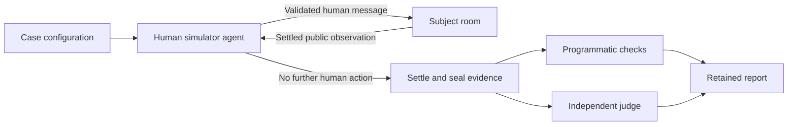

# Evals

**An eval configures a room simulation.** An agent represents one or more
humans who interact with the subject room. The room contains the real subject
agent and its collaborators. When the simulation settles, programmatic checks
and an independent judge evaluate the retained result.

**The built-in assistant is the first subject.** Use its production definition
and the public room APIs. A different subject supplies its own room, human
objectives, fixtures, checks, and rubric. The simulator must not require an
assistant, a particular roster, or a summary writer.

The authoring API is `defineRoomEval` from `@ambionframework/evals`.
`createHumanSimulator` supplies the model-driven actor. `runEvals` executes
the configured simulations. See the [complete code example](../packages/evals/README.md)
and the [assistant configurations](../packages/assistant/test/live/simulation-cases.ts).

## The simulation contract

**A case describes the environment and human objectives.** It configures:

- An isolated room, its agents, initial membership, history, and resources.
- One or more human definitions with stable names and identities.
- A simulator agent with instructions for those humans and their objectives.
- Bounds on human actions, execution time, and settling time.
- Lifecycle callbacks for setup, fixture changes, capture, and teardown.
- Programmatic checks and a separate judge with a versioned rubric.

The simulator owns the interaction loop. Case authors do not implement a
free-form `run` callback. The same loop handles initial requests, replies to
clarification, corrections, renewed work, and follow-up questions.

**The simulator controls human participation through public APIs.** Each
identity has its own `HumanDefinition` and `Visit`. The simulator chooses
which declared human speaks. The runner validates the action and calls that
human's `visit.send()`. It never changes one visit's identity.

The initial implementation sequences human messages. One action sends one
message, then waits for the resulting exchange and summary outcome. It does
not inject messages during an active exchange. Concurrent human intervention,
arrivals and departures as explicit actions, and external event scheduling
remain later extensions.

The initial suite has five configurations. The development profile runs each
once, baseline runs each three times, and acceptance runs each five times.
These profiles contain 5, 15, and 25 simulations respectively. The profile
name does not establish readiness or replace independent calibration review.

## Human simulator and judge

**The human simulator is an agent with a bounded role.** It sees public room
observations, its prior actions, the declared human identities, and the scenario
instructions. It can request a human message or finish the interaction.
Its decision is retained before the runner executes it.

The simulator does not receive the live room handle, private tool traces,
expected assertions, calibration labels, or judge instructions. It cannot
invoke subject tools, choose specialist contributions, modify the roster, or
write the final artifact directly. Invalid identities and malformed actions
are simulation errors.

**One simulator agent may represent several humans.** Its instructions define
each person's knowledge, intent, and authority. The shared simulator knows
those personas; this does not establish isolation between independently
simulated people. A scenario that requires separate private knowledge needs
separate actors and an explicit observation policy.

**The judge runs after settlement.** It has a separate room and execution
context. It evaluates sealed evidence using the authored objective and rubric.
A human simulator's decision to finish is evidence about interaction completion.
It does not determine whether the subject passes.

A scripted decision implementation supports deterministic tests and replay.
The provider-backed suite uses a model-driven human simulator. Record the
subject, simulator, and judge model choices separately. Replaying recorded
human actions measures the subject under that trajectory; a fresh simulator
run can choose a different trajectory.

## Settling and lifecycle

**Settling has an observable boundary.** After a human message, the runner
awaits `exchange.waitForClose()` and `exchange.waitForSummary()`. A summary
may be published or deliberately absent. A failed summary is an execution
failure. Optional silence does not imply failed simulation execution.

Before the next human decision and final capture, the runner checks the room:

- No human exchange remains open.
- No closing summary remains pending.
- All seated agents are idle.

A detached `room.read()` observes the durable journal boundary. The initial
simulator uses public snapshots and bounded waiting. It does not infer
completion from a fixed delay or an empty batch of notifications.

**Limits and failures cannot become passing results.** Exhausted action limits,
timeouts, provider errors, invalid actions, and failed settlement retain partial
evidence and prevent success. Stop issuing human actions after failure.
Cooperative cancellation aborts room work and releases owned resources.
A callback that ignores cancellation requires host-level process termination.

**Lifecycle callbacks have explicit responsibilities.**

| Callback         | Responsibility                                                                                             |
| ---------------- | ---------------------------------------------------------------------------------------------------------- |
| `setup`          | Allocate isolated resources and return the room and typed fixture. Register cleanup before fallible work.  |
| `beforeAction`   | Prepare deterministic environment changes for a validated human action. Do not prescribe subject behavior. |
| `capture`        | Add fixture, tool, artifact, and context evidence to the simulator's record.                               |
| Checks and judge | Evaluate detached evidence after settlement. Receive no mutable fixture or room handles.                   |
| `teardown`       | Release fixture resources, including partial setup and failed simulation paths.                            |

The runner owns action validation, delivery, settling, transcript retention,
evidence sealing, and room cleanup. Callback errors remain visible in the
report. Cleanup failures cannot be hidden by a passing judgment.

## Checks and evidence

**Use programmatic checks for exact facts.** Count accepted handoffs and human
messages. Check recipients, order, provenance, tool attempts, artifact changes,
and word limits. A model's statement that it complied does not satisfy these
checks. Validate the resulting artifact or record.

**Use the judge for meaning.** Assess whether the answer addresses the human
objective, preserves constraints, distinguishes reports from verified work,
and accurately describes incomplete results. Require a result for every rubric
criterion, with citations to retained evidence. Invalid output is inconclusive.

The simulator retains human decisions, accepted actions, exchange discussions,
summary outcomes, the final room snapshot, and diagnostics. Fixture callbacks
add provider context, private tool ledgers, and artifact snapshots when needed.
Each collection states its provenance and completeness. Missing required
evidence cannot pass a check.

**Keep ground truth and subject knowledge separate.** A judge may know that a
private read occurred. The assistant may only know that a peer reported an
inconclusive result. Correctly guessing hidden state does not establish a
grounded answer. Conversely, an explicit peer report is visible evidence;
it must not be described as information available only in a private trace.

Do not turn hidden fixture facts into an unstated request. For example,
available stock and authorization to dispatch are different claims. A question
about capacity does not require the assistant to recite an undisclosed
permission fact. A claim that dispatch occurred requires effect evidence.

**Retain every first attempt.** Store source and configuration revisions,
model choices, simulator decisions, checks, raw judgments, timing, and errors.
Keep failed executions separate from failed assertions and invalid judgments.
A revised rubric produces a new grading report over the same sealed evidence.
A changed subject or simulator requires a new execution report.

## First assistant simulations

**Start with a small set that exercises the new mechanism.** Reuse the room
fixtures and evidence from earlier work where they express these scenarios:

| Simulation              | Human objective                                                               | Programmatic checks                                                                 | Judge focus                                                                 |
| ----------------------- | ----------------------------------------------------------------------------- | ----------------------------------------------------------------------------------- | --------------------------------------------------------------------------- |
| Named specialist        | Ask for warehouse capacity, then finish after an answer or explicit gap.      | Required specialist contributes; one necessary handoff; no ordinary forwarding.     | Answer follows the recorded stock report without inventing dispatch.        |
| Renewed work            | Request writer participation despite an existing draft and earlier summaries. | New writer contribution belongs to the new exchange; no prohibited edits.           | Earlier completion does not satisfy renewed participation.                  |
| Private evidence        | Ask whether the private source establishes a verified result.                 | Paired read/no-read fixtures preserve the visibility boundary.                      | Distinguish visible peer reports from unsupported private-tool claims.      |
| Follow-up across humans | One human requests status; another asks a dependent follow-up.                | Each exchange has the correct owner; prior context reaches closing; no new effects. | Preserve owner, corrected quantity, artifact path, and verification limits. |

Controlled specialists must react to accepted room activity. A named specialist
waits for a real directed request. A reserve specialist starts after seating.
Their fixtures can define domain facts and failures. They cannot dictate what
the assistant says, whether it delegates, or how it summarizes.

Test the simulator deterministically before interpreting provider-backed
results. Cover multiple human identities, optional summaries, invalid actions,
action limits, cancellation, failed settlement, capture order, and cleanup.
A scripted subject verifies the harness only. Live assistant behavior remains
a separate measurement.

## Reuse and replacement

**The simulator becomes the primary authoring interface.** The previous
generic callback runner remains useful for cleanup, deadlines, evidence sealing,
checks, reporting, and offline regrading. These mechanisms support the simulator;
they no longer define what an eval author must build.

Reuse the production assistant, public room integration, controlled specialists,
persisted histories, strict assertions, context capture, tool ledgers, and
independent judge adapter. Rework case-specific interaction loops into simulator
configuration. Keep arbitrary callback-driven cases only where they remain
useful as deterministic infrastructure tests or retained evidence readers.

The [initial baseline](evals-baseline.md) and
[full-run diagnosis](evals-acceptance.md) supply failure traces and calibration
examples. Their pass rates do not establish acceptance of this simulator.
The former 17-variant sample profiles must not be presented as simulator
coverage until those cases have migrated and run through the new lifecycle.

## Gaps to keep explicit

**Several limits affect what an eval can establish.**

- The public runtime has no room-wide wait-for-idle handle. The simulator must
  combine exchange completion with bounded snapshot checks.
- Setup can reconcile before a subscriber attaches. The durable journal
  remains available, but setup-time transient notifications may be missing.
- The first simulator serializes human actions. It does not test interruption
  or concurrent human participation.
- A shared human simulator does not enforce private knowledge separation
  between its personas.
- The original failing browser history still needs capture. Constructed
  persisted history does not prove that the observed browser bug is resolved.
- Short calibration examples missed errors in complete traces. Review paired
  full executions independently, including judge false passes.
- Provider credits can prevent execution or grading. The latest full run
  records those errors; deterministic harness checks do not replace live runs.
- Time and action bounds do not provide complete token or monetary budgets.
  Account for subject, simulator, and judge usage before comparing costs.

The initial goal is a working room simulator and a small, inspectable assistant
suite. Broader scenario migration, statistical reliability claims, and
concurrent simulation remain separate work.

## Validation of this implementation

`pnpm check` passes after rebasing onto `deaaf94`. The gate includes 43 eval
package tests, 39 assistant tests, and 825 core tests. Six assistant harness
checks exercise the five initial simulations and reject an omitted follow-up.
Actor tests cover malformed responses, selected identities, cancellation, and
isolation between decisions. A cancellation regression prevents unsafe
continuation into later samples.

These are deterministic implementation checks. The new model-driven human
simulator has not completed a live suite. Broader fault injection, scenario
migration, independent calibration, and provider-backed acceptance remain open.

The proposed CI integration is retained in
[`live-evals-workflow.patch`](live-evals-workflow.patch). Applying it requires
GitHub workflow permission. The current publishing credential lacks that scope,
so this PR leaves the active workflow unchanged.
