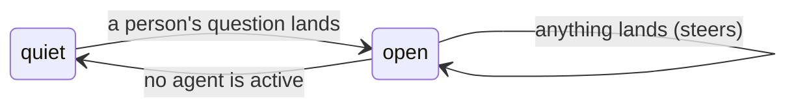

# The exchange

This document is the design contract for the exchange: the room's own unit
of work. It is shipped. The code lives in
[`exchange.ts`](../packages/ambion/src/room/exchange.ts), and
[`session.ts`](../packages/ambion/src/session.ts) opens and closes one as
the room runs. Read [`agent.md`](agent.md) first: an exchange is made of
the activations that document specifies, and it changes none of the eight
rules.

One sentence:

> **A person asks something, several agents wake and work it out between
> them, and the room goes quiet again. That span is the exchange. The
> person who asked owns it, and what lands while it is open steers the
> seats already working and changes nothing.**

---

## 1. Two spans, and both are the room's

Pi has a _turn_: one request to a provider and the tools it calls. Pi has
a _run_: one `prompt()`, and the turns inside it. Ambion has two spans of
its own, and they nest:

| Span           | Starts                    | Ends               |
| -------------- | ------------------------- | ------------------ |
| **activation** | The room wakes one seat   | That seat stops    |
| **exchange**   | A person's question lands | No agent is active |

An activation is one or more runs, because a message landing mid-activation
rebuilds the seat's view against the record as it now stands
([`agent.md`](agent.md) rule 2). An exchange is every activation between a
question and the quiet that follows it. The two words these pages use are
`activation` and `exchange`. `turn` in these pages is Pi's, or plain English
in a sentence a model reads.

---

## 2. The shape

A room is a sequence of exchanges, and the exchanges have one shape
([`exchange.ts`](../packages/ambion/src/room/exchange.ts)):

```ts
interface Exchange {
  /** The person whose question opened it, and who owns what follows. */
  owner: string;
  /** The seq of that question: where the exchange starts. */
  from: Seq;
  at: string;
}

interface ClosedExchange extends Exchange {
  /** The last seq on the record when the room went quiet. */
  through: Seq;
}
```

An open exchange is an owner and a start. A closed exchange adds the end it
turned out to have. The room holds nothing else about one: no count of
activations, no list of who spoke, no cursor beside the record. Everything
an exchange covers is on the record between `from` and `through`.

`ClosedExchange` is the shape a host reads on the `exchange_closed` event.
The record holds the same fact as a `closed` message, which §5 states.

---

## 3. Three rules

Three sentences hold the whole mechanism.

**A person's question opens one, when no exchange is open.** Nothing else
does. An agent speaking into a quiet room opens nothing, because a room
that talks to itself is answering nobody. Arriving and leaving open nothing,
because nobody asked anything by opening a room. The clause is written on
the exchange itself, for the case where the room is busy and has no owner:
somebody arrives, the seat that watches the door wakes, and a question lands
on top of work nobody asked for. That question still owns what follows.

**Quiescence closes it.** The room settles when nothing is live, and a
room that settles has finished. A seat that says something wakes its
readers inside its own `say`, before its own lease ends, so the room is
never briefly empty in the middle of a burst. What is live is read off the
leases and the activations the room still owes, folded over the log, so
there is no count beside them to keep in step. The room writes one `closed`
message, and `covers.through` is the record as it stood when the room
decided on the quiet, so a closed exchange holds the range it turned out to
cover. A quiet the room decided on one exchange closes that exchange alone.
A question that lands after that decision and before the close is written
opens the next exchange: a close ends the exchange through the range it
holds and no further. The host hears `exchange_opened` for it once the
close is on the record, the roster stands for it, and an exchange nobody
works on closes at the next reconcile, the way a question that wakes
nobody does.

A question that wakes no seat has no seat to stop, so the room reconciles
once the question is committed: nothing is working, so the exchange closes
at once, holding the question alone ([`roster.md`](roster.md) §6).

**What lands while it is open steers it and changes nothing.** The owner,
the range, and who the answer belongs to all stay fixed. A second question
from the same person, or a word from somebody else, reaches the seats
already working ([`agent.md`](agent.md) rule 2) and starts nothing new.



---

## 4. Who owns one

A room holds several people, and they speak into the same record. One name
holds an exchange:

> **A person's question opens an exchange and owns it. Messages that land
> into an open exchange steer the seats already working and change nothing:
> the owner stays, and so does whose answer the close belongs to.**

The room holds that one name while the exchange is open and drops it at the
close.

**Ownership outlives the owner's visit.** Priya may ask and walk out before
the room settles. The exchange is still hers, it still closes, and what is
written at the close is addressed to her. An exchange that opened is
finished properly or not at all. A person leaving is no reason to leave the
room's work unresolved.

**A second person speaking into it owns nothing.** Sam may speak into
Priya's exchange. His message steers whoever is working, and it neither
opens an exchange nor changes who owns this one. His own next question,
into a quiet room, opens his own exchange.

---

## 5. A fold over the record

An exchange is a fold over the record. The open exchange is the first
question a person asked past the last close's `covers.through`
(`openExchange` in [`exchange.ts`](../packages/ambion/src/room/exchange.ts)).

A close is a message, `{ kind: 'closed', seq, at, from, covers, wakes? }`.
`from` is the person who owns it, and `covers` is the range it stands for,
ending just before its own seq. `wakes` names the assistant when the
exchange owes a summary, which is what makes a close reach a seat the way
every other message does ([`agent.md`](agent.md) rule 1). Nobody speaks a
close and nobody writes it: the room observed the quiet, so `authorOf`
answers nobody for it, it wakes no seat by attention, it steers no
activation, and a participant's rendered record leaves it out.

A close takes a seq like any message. So `messages()` holds every exchange
boundary, and a client folds the history of exchanges out of one read.

A room resumed over its log continues a mid-exchange room. The question is
still open, the seats the last run left live hold their leases until they
expire, and the wakes it left pending are sent again. A lease that expires
answers the wake it held: the exchange closes once nothing is live, and the
assistant writes what it owes ([`agent.md`](agent.md) §5). A run that
starts over a log with an exchange open finds nothing live at its first
reconcile, closes the exchange, and its host hears `exchange_closed` for
it.

Every closed exchange is on the record, so a host that wants a history of
exchanges reads it off `messages()` and picks the closes out with
`isClosed`.

---

## 6. The edges a host sees

`session.exchange()` reads the open one, or nothing when nobody has asked.
The stream carries both edges:

```ts
type SessionEvent =
  | ...
  | { type: 'exchange_opened'; exchange: Exchange }
  | { type: 'exchange_closed'; exchange: ClosedExchange }
  | { type: 'quiet' };
```

The room's two completion promises name the two ends of an exchange
([`agent.md`](agent.md) §5 specifies them beside the other session
controls):

- **`settled()`** resolves when no seat that speaks for itself is taking an
  activation. That is the exchange's end.
- **`quiet()`** resolves when the room owes nothing: no lease is held, and
  no activation is due, a draft inside its backoff included. That is the
  moment a host waits for when it wants the one message a person reads.

Both wait for the room to be up first: a call made right after
`startSession` answers after the replay, and after the close of an
exchange the last run left open (§5).

The two differ because the assistant is a seat like any other, and its
activation counts. The assistant writing about an exchange is not the room
still working on it, so a drafting activation closes no exchange, and the
exchange's end stays fixed. The assistant composing the room for an
exchange is the room working on it, so `settled()` waits for a composing
activation ([`roster.md`](roster.md) §4). That is the one distinction the
room draws about its assistant.

**The order at the close is fixed.** `settled()` resolves, then the
`message` event for the close itself, then `exchange_closed`, then whatever
is written about the exchange, then `quiet`. A host that acts between
`settled()` and `quiet` acts while a summary is drafted, and that window is
the one place it can.

**An aborted exchange still closes.** `abort()` revokes the leases in
flight, writes off the wakes still pending, and the room reconciles, so the
exchange closes with the range it reached. **A stopped room closes
nothing.** `stopSession` revokes the leases in flight and writes no close.
A release that lands after the stop must not write into a log the
next run has started over. The exchange stays open on the record, and the
next run closes it at its first reconcile (§5). A run that dies without
`stop` leaves the exchange open the same way, with its leases live until
they expire.

**A close the storage refuses leaves the exchange open.** `settled()` and
`quiet()` still answer, and the room still says `quiet`; the room looks
again after the resend window, and writes the close then.

---

## 7. What reads one

The exchange belongs to the room itself, ahead of any one feature, because
several readers take it from the same place:

- **The assistant.** A closed exchange wakes the assistant for its owner,
  and the one message it writes stands for that exchange.
  [`assistant.md`](assistant.md) is the contract for it. An exchange opens
  and closes whether or not the assistant writes anything for it.
- **A client.** It folds the working under the question it answered and
  shows the exchange as a thinking state. The two events are enough for
  that, whatever the assistant does.
- **A host that measures cost.** It measures per exchange, because that is
  what somebody asked for.
- **A later compactor.** A room-level compactor stands over a stretch of
  closed exchanges. None exists today.

An exchange covers itself and nothing else. `from` is the question that
opened it, and `through` is the last seq when the room went quiet. A
person who walks back into a room after two days is not owed anything for
the two days: what they missed is presence's business
([`presence.md`](presence.md) §8), and their next question opens a range of
its own.

---

## 8. A gap the room has

**An exchange has no end the room enforces.** Two agents that keep
answering each other keep waking each other, and nothing stops them. The
say lock pushes against it: a seat that speaks late is refused and told to
reconsider, and rule 3 tells it to stand down. That is pressure without a
hard bound. No run has hit it, and the pressure is measurable: the roster's
live run seated three more agents than the run before, and the lock's
refusals went from 14 to 45, each one a model turn that reached the record
with nothing. It is written down because a room that waits for months will
meet it eventually, and because anything built on quiescence assumes it does
not happen. [`assistant.md`](assistant.md) is
built on it: the assistant writes when the room goes quiet, so a room that
never goes quiet never gets its one message.

---

## 9. What proves it

The exchange is proved beside the assistant that first reads one, in
[`assistant.test.ts`](../packages/ambion/test/assistant.test.ts):

- a question opens an exchange and quiescence closes it, holding the range
  it covered (§3);
- an arrival opens none, and a second message into an open one changes
  nothing (§3);
- a question that lands while a seat works on what nobody asked for still
  opens an exchange and owns it (§3);
- the person whose question opened the exchange owns it, and a second
  person speaking into it owns nothing (§4);
- an exchange outlives its owner's visit (§4);
- an exchange closes into a message that holds its person and its range,
  and no seat reads a line for it (§5);
- a close the assistant judged stays judged: the next message it writes
  reaches back to the next exchange alone (§5);
- an exchange closes at the quiet the room observed, and a question that
  lands before the close is written opens the next (§3);
- a quiet observed on one exchange never closes the next, and a question
  the assistant already woke on composes nothing and closes at once (§3);
- an exchange closes before anything is written about it, and the room
  settles before it goes quiet (§6).

[`restart.test.ts`](../packages/ambion/test/restart.test.ts) proves that a
stopped room writes no close, that the next run closes the exchange
before `quiet()` answers, and that a room resumed mid-exchange continues
it, with a lease the dead run held expiring into the close (§5, §6).
[`presence.test.ts`](../packages/ambion/test/presence.test.ts) proves that
a close the storage refuses leaves the exchange open, and that whoever
waits still hears the room (§6).

All in-process, in vitest, on a scripted stream.

The live run is
[`demos/2026-08-31-one-exchange-one-message.html`](../demos/2026-08-31-one-exchange-one-message.html):
four questions opened four exchanges, and each one closed into one message.
