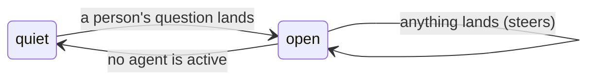

# The exchange

This document is the design contract for the exchange: the room's own unit
of discussion. The code lives in
[`exchange.ts`](../packages/ambion/src/room/exchange.ts), and
[`room.ts`](../packages/ambion/src/room.ts) opens and closes one as
the room runs. Read [`agent.md`](agent.md) first: an exchange is made of
the activations that document specifies, and it changes none of the eight
rules.

**An exchange is an opening message and the discussion it starts.** The
opening message establishes its owner. Further messages can steer active
agents. The room closes the exchange when its required work finishes or
reaches a terminal state.

One room has one open discussion at a time. Separate simultaneous discussions
use separate rooms. A close fixes a range; it does not certify answer quality.
The assistant is optional. Human participants can review the fixed discussion
through `exchange.messages()`, even after a summary replaces its source messages
in later agent activations. [Deployment](deployment.md) covers host duties and
release limits.

---

## 1. Two spans, and both are the room's

Pi has a _turn_: one request to a provider and the tools it calls. Pi has
a _run_: one `prompt()`, and the turns inside it. Ambion has two spans of
its own, and they nest:

| Span           | Starts                    | Ends                                |
| -------------- | ------------------------- | ----------------------------------- |
| **activation** | The room wakes one seat   | That seat stops                     |
| **exchange**   | A person's question lands | No required discussion work remains |

An activation is one or more runs, because a message landing mid-activation
rebuilds the seat's view against the record as it now stands
([`agent.md`](agent.md) rule 2). An exchange is every activation between a
question and the quiet that follows it. The two words these pages use are
`activation` and `exchange`. `turn` in these pages is Pi's, or plain English
in a sentence a model reads.

---

## 2. The shape

A room is a sequence of exchanges, and the exchanges have one shape
([`exchange.ts`](../packages/ambion/src/room/exchange.ts)):

```ts
interface Exchange {
  /** The person whose question opened it, and who owns what follows. */
  owner: string;
  /** The seq of that question: where the exchange starts. */
  from: Seq;
  at: string;
}

interface ClosedExchange extends Exchange {
  /** The last seq on the record when the room went quiet. */
  through: Seq;
}
```

An open exchange is an owner and a start. A closed exchange adds the end it
turned out to have. The room holds nothing else about one: no count of
activations, no list of who spoke, no cursor beside the record. Everything
an exchange covers is on the record between `from` and `through`.

---

## 3. Three rules

Three sentences hold the whole mechanism.

**A person's question opens one, when no exchange is open.** Nothing else
does. An agent speaking into a quiet room opens nothing, because a room
that talks to itself is answering nobody. Arriving and leaving open nothing,
because nobody asked anything by opening a room. The clause is written on
the exchange itself, for the case where the room is busy and has no owner:
somebody arrives, the seat that watches the door wakes, and a question lands
on top of work nobody asked for. That question still owns what follows.

**Quiescence closes it.** The room settles when nothing is live, and a
room that settles has finished. A seat that says something wakes its
readers inside its own `say`, before its own lease ends, so the room is
never briefly empty in the middle of a burst. What is live is read off the
leases and the wakes still pending, folded over the journal, so there is no
count beside them to keep in step. The room writes a close, and
`through` is the record as it stood when the room decided on the quiet, so
a closed exchange names the range it turned out to hold. A quiet the room
decided on one exchange closes that exchange alone. A question that lands
after that decision and before the close is written opens the next exchange.
The host hears `exchange_opened` for it once the close is on the journal, the
roster stands for it, and an exchange nobody works on closes at the next
reconcile, the way a question that wakes nobody does.

A question that wakes no seat has no seat to stop, so the room reconciles
once the question is committed: nothing is working, so the exchange closes
at once, holding the question alone ([`roster.md`](roster.md) §6).

**What lands while it is open steers it and changes nothing.** The owner,
the range, and who the answer belongs to all stay fixed. A second question
from the same person, or a word from somebody else, reaches the seats
already working ([`agent.md`](agent.md) rule 2) and starts nothing new.



---

## 4. Who owns one

A room holds several people, and they speak into the same record. One name
holds an exchange:

> **A person's question opens an exchange and owns it. Messages that land
> into an open exchange steer the seats already working and change nothing:
> the owner stays, and so does whose answer the close belongs to.**

The room holds that one name while the exchange is open and drops it at the
close.

**Ownership outlives the owner's visit.** Priya may ask and walk out before
the room settles. The exchange is still hers, it still closes, and what is
written at the close is addressed to her. An exchange that opened is
finished properly or not at all. A person leaving is no reason to leave the
room's work unresolved.

**A second person speaking into it owns nothing.** Sam may speak into
Priya's exchange. His message steers whoever is working, and it neither
opens an exchange nor changes who owns this one. His own next question,
into a quiet room, opens his own exchange.

---

## 5. A fold over the journal

An exchange is a fold over the journal. The open exchange is the first
question a person asked after the last close's `through`
(`openExchange` in [`exchange.ts`](../packages/ambion/src/room/exchange.ts)). A
close is an entry on the journal beside the messages: `{ owner, from, through,
at, wakes? }`. It takes no seq; `through` orders it. `wakes` names the
assistant when the exchange owes a summary. `messages()` returns the
messages alone, and their seqs stay `1..n`.

A room resumed over its journal continues a mid-exchange room. The question is
still open, the seats the last run left live hold their leases until they
expire, and the wakes it left pending are sent again. A lease that expires
answers the wake it held: the exchange closes once nothing is live, and the
assistant writes what it owes ([`agent.md`](agent.md) §5). A run that
starts over a journal with an exchange open finds nothing live at its first
reconcile, closes the exchange, and its host hears `exchange_closed` for
it.

Every closed exchange is on the journal, so a host that wants a history of
exchanges reads the closes off the room's Pi session.

---

## 6. The edges a host sees

A running room can publish exchange notifications through its subscription,
but callers that need a durable result use the exchange handle returned by
`Visit.send`. `room.exchange(from)` reacquires the same handle after a
restart, using the opening message sequence as its stable identity.

```ts
const visit = await room.visit(priya);
const exchange = await visit.send({ text: 'Can I promise Thursday?' });
const conversation = await exchange.messages();
const response = await exchange.response();

await room.stop();
const resumed = await resumeRoom('site', { runtime, agents });
const sameExchange = resumed.exchange(exchange.from);
if (sameExchange) {
  await sameExchange.messages();
  await sameExchange.response();
}
```

`messages()` resolves only after the close entry is durable and returns the
non-summary messages in the inclusive `[from, through]` range. It excludes
assistant summaries, including a summary published during a later exchange;
`response()` owns that optional result and waits for it, or returns `undefined`
when the exchange deliberately has no summary. A failed or abandoned attempt
remains visible in the record and is handled by the exchange's retry policy.

**Scheduling and response reads share one completion query.**
`summaryCompletion` in [`exchange.ts`](../packages/ambion/src/room/exchange.ts)
reads the recorded close, messages, and lease history. It stores no additional
status. A covering summary takes precedence over its activation's lease state.

| Recorded facts                                                      | Completion | `response()`                       |
| ------------------------------------------------------------------- | ---------- | ---------------------------------- |
| A summary covers the owner and range                                | Published  | Returns that summary               |
| No summary is requested, or its activation releases without writing | Silent     | Returns `undefined`                |
| Summary work is unclaimed, running, or awaiting retry after failure | Pending    | Waits for more journal facts       |
| Summary work is revoked or abandoned without a published response   | Failed     | Rejects with an interruption error |

Only pending summary work remains owed by the fold. Reaching the retry cap
does not itself resolve the response; the recorded abandonment does.

The handle is tied to `owner`, `from`, and `at`. Repeating a send with the
same idempotency key returns the same exchange handle. Concurrent sends into
an open exchange steer the same work and do not create another handle; a
later exchange cannot delay or resolve an earlier handle. A message committed
before the durable close remains in that exchange. A stale close decision is
rejected or reconsidered against the newer record before it can be written.

A stopped run revokes in-flight leases and writes no close for work it did not
finish. A later `resumeRoom` replays the journal, preserves the open exchange,
and lets its handle complete. Fencing still applies: work from a superseded
run is void and cannot publish a close or summary for the current run.

The notification stream carries the durable edges when a host wants live
observation:

```ts
type RoomNotification =
  | { type: 'message'; message: Message }
  | { type: 'exchange_opened'; exchange: Exchange }
  | { type: 'exchange_closed'; exchange: ClosedExchange }
  | { type: 'error'; error: Error };
```

The exchange handle is the completion API. There is no room-wide idle,
quiet, or settled wait: a caller follows the particular exchange it opened.

## 7. What reads one

The exchange belongs to the room itself, ahead of any one feature, because
several readers take it from the same place:

- **The assistant.** A closed exchange wakes the assistant for its owner,
  and the one message it writes stands for that exchange.
  [`assistant.md`](assistant.md) is the contract for it. An exchange opens
  and closes whether or not the assistant writes anything for it.
- **A client.** It folds the working under the question it answered and
  shows the exchange as a thinking state. The two events are enough for
  that, whatever the assistant does.
- **A host that measures cost.** It measures per exchange, because that is
  what somebody asked for.

An exchange covers itself and nothing else. `from` is the question that
opened it, and `through` is the last seq when the room went quiet. A
person who walks back into a room after two days is not owed anything for
the two days: what they missed is presence's business
([`presence.md`](presence.md) §8), and their next question opens a range of
its own.

---

## 8. A gap the room has

**An exchange has no end the room enforces.** Two agents that keep
answering each other keep waking each other, and nothing stops them. The
say lock pushes against it: a seat that speaks late is refused and told to
reconsider, and rule 3 tells it to stand down. That is pressure without a
hard bound. No run has hit it, and the pressure is measurable: the roster's
live run seated three more agents than the run before, and the lock's
refusals went from 14 to 45, each one a model turn that reached the record
with nothing. It is written down because a room that waits for months will
meet it eventually, and because anything built on quiescence assumes it does
not happen. [`assistant.md`](assistant.md) is
built on it: the assistant writes when the room goes quiet, so a room that
never goes quiet never gets its one message.

---

## 9. What proves it

The exchange is proved beside the assistant that first reads one, in
[`assistant.test.ts`](../packages/ambion/test/assistant.test.ts):

- a question opens an exchange and quiescence closes it, holding the range
  it covered (§3);
- an arrival opens none, and a second message into an open one changes
  nothing (§3);
- a question that lands while a seat works on what nobody asked for still
  opens an exchange and owns it (§3);
- the person whose question opened the exchange owns it, and a second
  person speaking into it owns nothing (§4);
- an exchange outlives its owner's visit (§4);
- an exchange closes at the durable boundary it observed, and a message
  committed before that boundary remains in the exchange (§3);
- a close for one exchange never closes the next, and a question the
  assistant already woke on composes nothing and closes at once (§3);
- `exchange.messages()` resolves before its optional response is written, and
  `response()` resolves only when that response is durable or deliberately
  absent (§6).

[`restart.test.ts`](../packages/ambion/test/restart.test.ts) proves that a
stopped room writes no close, that the next run closes the exchange
before `exchange.messages()` completes, and that a room resumed mid-exchange continues
it, with a lease the dead run held expiring into the close (§5, §6).
[`presence.test.ts`](../packages/ambion/test/presence.test.ts) proves that
a close the storage refuses leaves the exchange open, and that a handle
waits for a later durable close (§6).

All in-process, in vitest, on a scripted stream.

[`exchange-completion.test.ts`](../packages/ambion/test/exchange-completion.test.ts)
also checks response outcomes after replay on memory and SQLite. Completed
outcomes schedule no new summary. A failed attempt remains pending across
restart until its retry becomes due. The suite checks that an earlier
response can publish while a later exchange is still active.

The live run is
[`demos/2026-08-31-one-exchange-one-message.html`](../demos/2026-08-31-one-exchange-one-message.html):
four questions opened four exchanges, and each one closed into one message.
