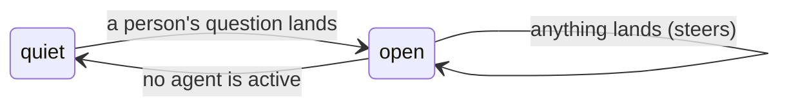

# The exchange

This document is the design contract for the exchange: the room's own unit
of work. It is shipped. The code lives in
[`exchange.ts`](../packages/ambion/src/exchange.ts), and
[`session.ts`](../packages/ambion/src/session.ts) opens and closes one as
the room runs. Read [`agent.md`](agent.md) first: an exchange is made of
the activations that document specifies, and it changes none of the eight
rules.

One sentence:

> **A person asks something, several agents wake and work it out between
> them, and the room goes quiet again. That span is the exchange. The
> person who asked owns it, and what lands while it is open steers the
> seats already working and changes nothing.**

---

## 1. Two spans, and both are the room's

Pi has a _turn_: one request to a provider and the tools it calls. Pi has
a _run_: one `prompt()`, and the turns inside it. Ambion has two spans of
its own, and they nest:

| Span           | Starts                    | Ends               |
| -------------- | ------------------------- | ------------------ |
| **activation** | The room wakes one seat   | That seat stops    |
| **exchange**   | A person's question lands | No agent is active |

An activation is one or more runs, because a message landing mid-activation
rebuilds the seat's view against the record as it now stands
([`agent.md`](agent.md) rule 2). An exchange is every activation between a
question and the quiet that follows it. The two words these pages use are
`activation` and `exchange`. `turn` in these pages is Pi's, or plain English
in a sentence a model reads.

---

## 2. The shape

A room is a sequence of exchanges, and the exchanges have one shape
([`exchange.ts`](../packages/ambion/src/exchange.ts)):

```ts
interface Exchange {
  /** The person whose question opened it, and who owns what follows. */
  owner: string;
  /** The seq of that question: where the exchange starts. */
  from: Seq;
  at: string;
}

interface ClosedExchange extends Exchange {
  /** The last seq on the record when the room went quiet. */
  through: Seq;
}
```

An open exchange is an owner and a start. A closed exchange adds the end it
turned out to have. The room holds nothing else about one: no count of
activations, no list of who spoke, no cursor beside the record. Everything
an exchange covers is on the record between `from` and `through`.

---

## 3. Three rules

Three sentences hold the whole mechanism.

**A person's question opens one, when no exchange is open.** Nothing else
does. An agent speaking into a quiet room opens nothing, because a room
that talks to itself is answering nobody. Arriving and leaving open nothing,
because nobody asked anything by opening a room. A reminder coming due
opens nothing, because an agent asked itself ([`reminder.md`](reminder.md)
§5). The clause is written on
the exchange itself, for the case where the room is busy and has no owner:
somebody arrives, the seat that watches the door wakes, and a question lands
on top of work nobody asked for. That question still owns what follows.

**Quiescence closes it.** The room settles when no agent is active, and a
room that settles has finished. A seat that says something wakes its
readers inside its own `say`, before its own activation ends, so the room is
never briefly empty in the middle of a burst. What is running is read off
the seats, because a seat holds the activation it is taking, so there is no
count beside them to keep in step. `through` is the record as it stood at
that moment, so a closed exchange names the range it turned out to hold.

**What lands while it is open steers it and changes nothing.** The owner,
the range, and who the answer belongs to all stay fixed. A second question
from the same person, or a word from somebody else, reaches the seats
already working ([`agent.md`](agent.md) rule 2) and starts nothing new.



---

## 4. Who owns one

A room holds several people, and they speak into the same record. One name
holds an exchange:

> **A person's question opens an exchange and owns it. Messages that land
> into an open exchange steer the seats already working and change nothing:
> the owner stays, and so does whose answer the close belongs to.**

The room holds that one name while the exchange is open and drops it at the
close.

**Ownership outlives the owner's visit.** Priya may ask and walk out before
the room settles. The exchange is still hers, it still closes, and what is
written at the close is addressed to her. An exchange that opened is
finished properly or not at all. A person leaving is no reason to leave the
room's work unresolved.

**A second person speaking into it owns nothing.** Sam may speak into
Priya's exchange. His message steers whoever is working, and it neither
opens an exchange nor changes who owns this one. His own next question,
into a quiet room, opens his own exchange.

---

## 5. Run state

An exchange belongs to a running room. `Exchanges` holds the open one in
memory, and a restart begins with none. That is right for a room
mid-question: the record keeps what was said, and nobody is mid-question
after a restart. A person whose question the room was working on asks
again, and that question opens a new exchange.

A closed exchange is an owner and a range, so it is derivable from the
record. Nothing derives it today; a host that wants a history of exchanges
records the `exchange_closed` events as they arrive.
[`FOLLOW_WORK.md`](../FOLLOW_WORK.md) holds the work.

---

## 6. The edges a host sees

`session.exchange()` reads the open one, or nothing when nobody has asked.
The stream carries both edges:

```ts
type SessionEvent =
  | ...
  | { type: 'exchange_opened'; exchange: Exchange }
  | { type: 'exchange_closed'; exchange: ClosedExchange }
  | { type: 'quiet' };
```

The room's two completion promises name the two ends of an exchange
([`agent.md`](agent.md) §5 specifies them beside the other session
controls):

- **`settled()`** resolves when no seat that speaks for itself is taking an
  activation. That is the exchange's end.
- **`quiet()`** resolves when no agent at all is taking an activation, and
  no assistant still owes one. That is the moment a host waits for when it
  wants the one message a person reads.

The two differ because an assistant is a seat like any other, and its
activation counts. An assistant writing about an exchange is not the room
still working on it, so an assistant's own activation closes no exchange,
and the exchange's end stays fixed when somebody brings one.

**The order at the close is fixed.** `settled()` resolves, then
`exchange_closed`, then whatever is written about the exchange, then
`quiet`. A host that acts between `settled()` and `quiet` acts while a
summary is drafted, and that window is the one place it can.

**An aborted exchange still closes.** `abort()` cancels the activations in
flight and the room settles, so the exchange closes with the range it
reached. **A run that stops mid-exchange closes nothing.** `stopSession`
aborts the activations in flight and takes the room down, and the exchange
never closes: the next run begins with none.

---

## 7. What reads one

The exchange belongs to the room itself, ahead of any one feature, because
several readers take it from the same place:

- **A person's assistant.** A closed exchange wakes the owner's assistant,
  and the one message it writes stands for that exchange.
  [`assistant.md`](assistant.md) is the contract for it. An exchange opens
  and closes whether or not the assistant writes anything for it.
- **A client.** It folds the working under the question it answered and
  shows the exchange as a thinking state. The two events are enough for
  that, whatever the assistant does.
- **A host that measures cost.** It measures per exchange, because that is
  what somebody asked for.
- **A later compactor.** A room-level compactor stands over a stretch of
  closed exchanges. None exists today.

An exchange covers itself and nothing else. `from` is the question that
opened it, and `through` is the last seq when the room went quiet. A
person who walks back into a room after two days is not owed anything for
the two days: what they missed is presence's business
([`presence.md`](presence.md) §8), and their next question opens a range of
its own.

---

## 8. A gap the room has

**An exchange has no end the room enforces.** Two agents that keep
answering each other keep waking each other, and nothing stops them. The
say lock pushes against it: a seat that speaks late is refused and told to
reconsider, and rule 3 tells it to stand down. That is pressure without a
hard bound. No run has hit it. It is written down because a room that waits
for months will meet it eventually, and because anything built on
quiescence assumes it does not happen. [`assistant.md`](assistant.md) is
built on it: an assistant writes when the room goes quiet, so a room that
never goes quiet never gets its one message.

---

## 9. What proves it

The exchange is proved beside the assistant that first reads one, in
[`assistant.test.ts`](../packages/ambion/test/assistant.test.ts):

- a question opens an exchange and quiescence closes it, holding the range
  it covered (§3);
- an arrival opens none, and a second message into an open one changes
  nothing (§3);
- a question that lands while a seat works on what nobody asked for still
  opens an exchange and owns it (§3);
- the person whose question opened the exchange owns it, and a second
  person speaking into it owns nothing (§4);
- an exchange outlives its owner's visit (§4);
- an exchange closes before anything is written about it, and the room
  settles before it goes quiet (§6).

All in-process, in vitest, on a scripted stream.

The live run is
[`demos/2026-08-31-one-exchange-one-message.html`](../demos/2026-08-31-one-exchange-one-message.html):
four questions opened four exchanges, and each one closed into one message.
