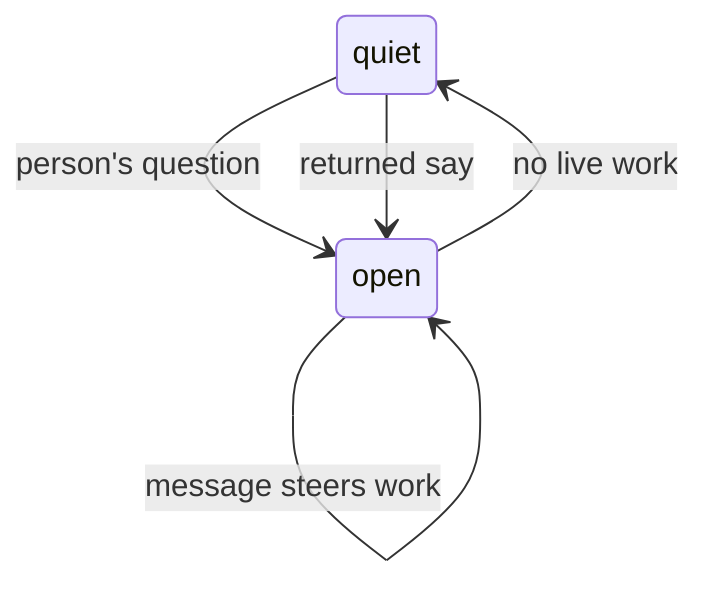
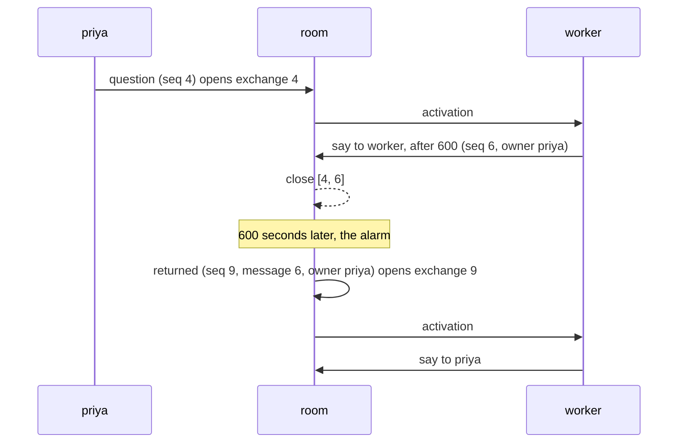

# The exchange

An exchange is the room's unit of human-directed work: one person's question
and the discussion it starts. The implementation is
[`room/exchange.ts`](../packages/ambion/src/room/exchange.ts), with lifecycle
coordination in [`room-host/`](../packages/ambion/src/room-host/room.ts). Read
[`room.md`](room.md) for activation rules and [`summary.md`](summary.md) for
the optional closing message.

One room has one open exchange. A close fixes the range of messages it covered;
it says nothing about answer quality. A summary may later replace that range in
agent context while human review still sees the original messages.

## 1. The spans

[The two spans](room.md#the-two-spans) defines the activation and the
exchange. This page holds the exchange.

## 2. The shape

An exchange records its owner, opening time, and opening message seq
(`from`). A durable close fixes its inclusive final message seq
(`through`). Journal administration can occupy seqs between messages.
`ExchangeRef` carries identity. `ExchangeView` carries recorded state.
`ExchangeHandle` provides live waits. An `ExchangeRead` contains a view,
its original discussion, and the observed journal watermark.
See [the public types](../packages/ambion/src/types.ts) for the exact shapes.

A message URI is `ambion://room/<name>/message/<seq>`. Build the one for an
exchange's opening message with `messageUri(name, from)`. The URI is not a
stored field.

## 3. Three rules

1. A person's question or a returned say opens an exchange only when none
   is open. Agent speech, arrivals, and departures do not open one. A
   question or a returned say that lands while one is open belongs to that
   exchange's work.
2. Quiescence closes the current exchange. The room derives “live” from leases
   and pending wakes, then appends a close with the observed `through` boundary.
   Work that reaches a terminal state is handled the same way.
3. Ordinary messages landing while it is open steer eligible active seats and
   do not change its owner, range, or recipient. A later human question is
   therefore part of the current work, not a second exchange.



## 4. Who owns one

The person whose question opened the exchange owns it. A returned say opens
an exchange for the owner that the room stamped on the say. Ownership
survives that person leaving the room, and the closing result remains
addressed to them. A second person may speak into the open exchange without
taking ownership; their next question owns a later exchange once the room is
quiet.

## 5. A fold over the journal

`openExchange` finds the first spoken message from a known person, or the
first returned say for one, after the last close. Closes, leases, messages,
and pending work are all reconstructed from the journal, so a resumed room continues an exchange interrupted by a
process or host failure. Unexpired leases may continue; unclaimed or expired
work follows the retry policy. A configured summary writer is scheduled only
after the close is durable.

## 6. A scheduled say

**An agent comes back to its work with a say to itself.** The agent calls
`say` with `to` set to its own name and `after` set to a number of seconds.
The room stamps the owner of the open exchange on the say as `owner`. The say
wakes nobody, and it is not live work, so the exchange closes while it waits.



**The room returns the say when it is due.** The reconcile writes a
`returned` entry `{ to, message, owner, text, refs }`: the returned say. It
copies the text and the refs of the say, so the agent reads them when the
record window or a summary no longer shows the say. The room wrote it, so it
has no `from`. It wakes one seat, the one that `to` names, and steers no
other.

**The due time comes from the record.** A say is due at its `at` plus
`after` seconds. `nextAlarm` takes the earliest due time beside the lease
expiries and the retry times, so a resumed room arms it again from the
journal. A pass that ends a lease returns no say, so the returned say lands
after the close of the same pass.

**The room decides who may schedule.**

- A say with `after` goes to its author. A say to oneself without `after`
  gets a refusal.
- The activation must answer a message while an exchange is open. A closing
  activation cannot schedule.
- `limits.schedule` bounds `after` from `minAfter` to `maxAfter` seconds, 60 to
  604,800 by default, and holds at most `pending` says of one seat, 4 by
  default.

**A say can stop waiting.** An unseating of its author drops it, and a
cancellation drops every say before it. A recomposition that leaves the author
out writes no unseating, so its says wait until the seat is on the roster
again. A read lists the says that wait in `scheduled`.

**A returned say starts a fresh harness session.** A harness session never
crosses an exchange, so the agent reads the record, the summary of the first
exchange, and its reminders. The process reminder carries the state of a
process that the say checks on.

## 7. The edges a host sees

`Visit.send()` returns a handle for the exchange containing the committed
question. Persist `handle.from`; after restart, reacquire it with
`room.exchange(from)`.

```ts
const exchange = await (await room.visit(priya)).send({ text: 'Can I promise Thursday?' });
const conversation = await exchange.waitForClose();
const response = await exchange.waitForSummary();

const resumed = await resumeRoom('site', { runtime, agents });
const same = resumed.exchange(exchange.from);
```

`waitForClose()` waits for the durable close and returns non-summary messages in
the inclusive `[from, through]` range. `waitForSummary()` waits for its optional
summary, returning `undefined` when no writer is configured or the writer
deliberately stays silent. A revoked or abandoned required assignment rejects
the response. The exchange handle is the completion API; there is no room-wide
quiet wait.

Summary completion is folded from the recorded close, messages, and lease
history (`summaryCompletion`). A covering summary wins over lease state; a
pending assignment remains pending until it publishes or records a terminal
failure. Retrying the same delivery key and payload returns the same handle;
conflicting reuse rejects. Concurrent sends into one open exchange share its
identity. See [delivery guarantees](durability.md#2-what-a-delivery-promises).

**The handle's `opened` field marks the delivery that started the exchange.**
It is `true` only for the send whose message is the exchange's own opening
position; a later send that joins an already-open exchange gets `opened:
false`, even though `handle.from` matches. A retry of the opening delivery
key also reads back `opened: true`. `room.exchange(from)` always returns
`opened: false`, because reacquiring a handle is never the act that opens
the exchange. `owner` can name a person other than the one who sent a given
message, when that message joined an exchange another person opened.

Live notifications include `message`, `exchange_opened`, and
`exchange_closed` events, plus execution events. An execution event names its
activation. Notifications and pending waits belong to the current run and
must be recreated after interruption.

**`room.read()` returns detached state from one journal position.** It starts
no agents and performs no reconciliation. `RoomRead` reports initialization,
recorded goal, participants, exchange views, and the journal `watermark`.
Use `readRoom(name, { runtime })` without a running handle, including stopped rooms.
A stopped open exchange remains open until the journal records its close.

Pass `{ messages: false }` for metadata, or `{ messages: { since } }` for messages
after an exclusive cursor. `since` must be a non-negative safe integer. A future
cursor returns no messages; exchange metadata remains complete.

The watermark includes close and lease entries. Activity can change when a lease
expires without another append, so the watermark cannot validate a cached view.
An active host reads its observed journal prefix after local writes settle;
a read does not force synchronization with another host's writes.
See [`RoomRead` and `ExchangeView`](../packages/ambion/src/types.ts) for types.

**`readExchange(name, from, { runtime })` reads the original discussion immediately.**
It returns `undefined` for a missing exchange. The reference must be a positive
safe integer. The read includes the exchange view and excludes summaries
from its discussion. A closed discussion uses its fixed inclusive source range;
an open discussion contains the messages recorded so far. Reading never waits
for close or summary completion. Late summaries appear in the exchange outcome.

```ts
const recorded = await readExchange(saved.roomName, saved.exchangeFrom, { runtime });
if (recorded) {
  console.log(recorded.exchange.status, recorded.messages);
}
```

**A closed exchange view carries an `outcome`.** The room derives it from
the record. It adds no entry kind and starts no timer, so a resumed room reads
the same outcome. The first case that holds wins:

| Outcome     | When it holds                                                                  |
| ----------- | ------------------------------------------------------------------------------ |
| `cancelled` | A cancellation wrote the close.                                                |
| `exhausted` | The room gave up on a response activation in the range.                        |
| `awaiting`  | The last spoken message asks a person, and that person has said nothing since. |
| `complete`  | None of the above.                                                             |

A message to the owner is the answer to the owner's question, so it never
makes an exchange `awaiting`. `awaiting` carries the `person`. It clears when
that person speaks. `pendingFor(read, person)` and `room.pendingFor(person)`
return the closed exchanges that await one person. A failed summary reads
through `summary`, not `outcome`. The verified rule `exchangeOutcome` fixes the
order.

Cancellation closes the current discussion without assigning a new summary. It
settles existing pending summary work as failed. See the
[cancellation contract](durability.md#cancellation) for ordering and retry behavior.

**Every exchange view lists its `activations`.** One entry holds the
activation `id`, the `seat`, the `attempt`, the `purpose` (`respond` or
`summary`), and the `outcome`. The outcome is `running`, or an end reason
with `cancelled` and `cause` when they apply. An entry carries `usage` when
the activation recorded it. Every attempt has an entry, in journal order. An
open exchange lists the activations since its question. The `session` field
holds the harness session that the activation recorded at its release. It
is absent when the harness recorded none.

**The steps of an activation go to the host's logger.** See
[Executors](executors.md#the-trace-log).

## 8. What reads one

- The summary writer receives one dedicated closing activation and may write a
  summary through `say`.
- A client groups the fixed range under the question it answered.
- A host can measure cost and completion per exchange. A closed exchange
  read carries `usage`: the sum of every activation in its range, the
  summary activation and every retried attempt included. The
  `exchange_closed` event carries no usage, because the summary activation
  runs after the close.

The exchange covers only its own `[from, through]` range. What a person missed
between visits is presence catch-up, not a synthetic exchange.

## 9. A gap the room has

Quiescence has no hard duration bound. Agents that keep producing work can keep
an exchange open. The say lock rejects stale writes and forces reconsideration,
but it does not guarantee that a model will stop. Hosts should monitor work and
apply their own operational limits where needed.

## 10. What proves it

[`exchange-completion.test.ts`](../packages/ambion/test/exchange-completion.test.ts)
checks opening ownership, quiescent close boundaries, steering, owner
departure, multiple exchanges, and the ordering of `waitForClose()` before
`waitForSummary()`. Replay and storage variants are included. Restart behavior is
covered by [`restart.test.ts`](../packages/ambion/test/restart.test.ts) and
presence/reconnect cases by [`presence.test.ts`](../packages/ambion/test/presence.test.ts).
[`exchange-outcome.test.ts`](../packages/ambion/test/exchange-outcome.test.ts)
checks the outcome order, the `awaiting` clearing, and `pendingFor`.
[`scheduled-say.test.ts`](../packages/ambion/test/scheduled-say.test.ts)
checks a scheduled say: the close while it waits, the returned say on the
room's alarm, the exchange it opens, and one return after a stop or a crash.
