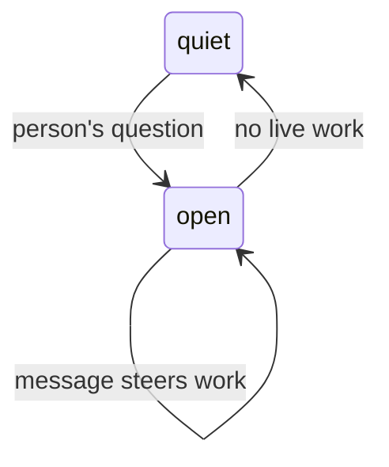

# The exchange

An exchange is the room's unit of human-directed work: one person's question
and the discussion it starts. The implementation is
[`room/exchange.ts`](../packages/ambion/src/room/exchange.ts), with lifecycle
coordination in [`room-host.ts`](../packages/ambion/src/room-host.ts). Read
[`agent.md`](agent.md) for activation rules and [`summary.md`](summary.md) for
the optional closing message.

One room has one open exchange. A close fixes the range of messages it covered;
it says nothing about answer quality. A summary may later replace that range in
agent context while human review still sees the original messages.

## 1. Two spans, and both are the room's

Ambion has two useful spans:

| Span           | Starts                                                    | Ends                                         |
| -------------- | --------------------------------------------------------- | -------------------------------------------- |
| **activation** | The room wakes one seat                                   | That seat's work ends                        |
| **exchange**   | A person's spoken message lands while no exchange is open | The room reaches quiescence or terminal work |

Pi's turns and runs are provider execution details. An activation may contain
multiple provider runs when a message arrives mid-work; the exchange spans all
activations from its opening question to its durable close.

## 2. The shape

An exchange records its owner, opening time, and opening message position
(`from`). A durable close fixes its inclusive final message position
(`through`). Journal administration can occupy positions between messages.
`ExchangeRef` carries identity. `ExchangeView` carries recorded state.
`ExchangeHandle` provides live waits. An `ExchangeRead` contains a view,
its original discussion, and the observed journal watermark.
See [the public types](../packages/ambion/src/types.ts) for the exact shapes.

The exchange URI is `ambion://room/<name>/exchange/<from>`. Build it with
`exchangeUri(name, from)`. The URI is not a stored field.

## 3. Three rules

1. A person's question opens an exchange only when none is open. Agent speech,
   arrivals, and departures do not open one. A question that lands while one is
   open belongs to that exchange's work.
2. Quiescence closes the current exchange. The room derives “live” from leases
   and pending wakes, then appends a close with the observed `through` boundary.
   Work that reaches a terminal state is handled the same way.
3. Ordinary messages landing while it is open steer eligible active seats and
   do not change its owner, range, or recipient. A later human question is
   therefore part of the current work, not a second exchange.



## 4. Who owns one

The person whose question opened the exchange owns it. Ownership survives that
person leaving the room, and the closing result remains addressed to them. A
second person may speak into the open exchange without taking ownership; their
next question owns a later exchange once the room is quiet.

## 5. A fold over the journal

`openExchange` finds the first spoken message from a known person after the
last close. Closes, leases, messages, and pending work are all reconstructed
from the journal, so a resumed room continues an exchange interrupted by a
process or host failure. Unexpired leases may continue; unclaimed or expired
work follows the retry policy. A configured summary writer is scheduled only
after the close is durable.

## 6. The edges a host sees

`Visit.send()` returns a handle for the exchange containing the committed
question. Persist `handle.from`; after restart, reacquire it with
`room.exchange(from)`.

```ts
const exchange = await (await room.visit(priya)).send({ text: 'Can I promise Thursday?' });
const conversation = await exchange.waitForClose();
const response = await exchange.waitForSummary();

const resumed = await resumeRoom('site', { runtime, agents });
const same = resumed.exchange(exchange.from);
```

`waitForClose()` waits for the durable close and returns non-summary messages in
the inclusive `[from, through]` range. `waitForSummary()` waits for its optional
summary, returning `undefined` when no writer is configured or the writer
deliberately stays silent. A revoked or abandoned required assignment rejects
the response. The exchange handle is the completion API; there is no room-wide
quiet wait.

Summary completion is folded from the recorded close, messages, and lease
history (`summaryCompletion`). A covering summary wins over lease state; a
pending assignment remains pending until it publishes or records a terminal
failure. Retrying the same delivery key and payload returns the same handle;
conflicting reuse rejects. Concurrent sends into one open exchange share its
identity. See [delivery guarantees](durability.md#2-what-a-delivery-promises).

**The handle's `opened` field marks the delivery that started the exchange.**
It is `true` only for the send whose message is the exchange's own opening
position; a later send that joins an already-open exchange gets `opened:
false`, even though `handle.from` matches. A retry of the opening delivery
key also reads back `opened: true`. `room.exchange(from)` always returns
`opened: false`, because reacquiring a handle is never the act that opens
the exchange. `owner` can name a person other than the one who sent a given
message, when that message joined an exchange another person opened.

Live notifications include `message`, `exchange_opened`, and
`exchange_closed` events, plus execution events. An execution event names its
activation. Notifications and pending waits belong to the current run and
must be recreated after interruption.

**`room.read()` returns detached state from one journal position.** It starts
no agents and performs no reconciliation. `RoomRead` reports initialization,
recorded goal, participants, exchange views, and the journal `watermark`.
Use `readRoom(name, { runtime })` without a running handle, including stopped rooms.
A stopped open exchange remains open until the journal records its close.

Pass `{ messages: false }` for metadata, or `{ messages: { since } }` for messages
after an exclusive cursor. `since` must be a non-negative safe integer. A future
cursor returns no messages; exchange metadata remains complete.

The watermark includes close and lease entries. Activity can change when a lease
expires without another append, so the watermark cannot validate a cached view.
An active host reads its observed journal prefix after local writes settle;
a read does not force synchronization with another host's writes.
See [`RoomRead` and `ExchangeView`](../packages/ambion/src/types.ts) for types.

**`readExchange(name, from, { runtime })` reads the original discussion immediately.**
It returns `undefined` for a missing exchange. The reference must be a positive
safe integer. The read includes the exchange view and excludes summaries
from its discussion. A closed discussion uses its fixed inclusive source range;
an open discussion contains the messages recorded so far. Reading never waits
for close or summary completion. Late summaries appear in the exchange outcome.

```ts
const recorded = await readExchange(saved.roomName, saved.exchangeFrom, { runtime });
if (recorded) {
  console.log(recorded.exchange.status, recorded.messages);
}
```

Cancellation closes the current discussion without assigning a new summary. It
settles existing pending summary work as failed. See the
[cancellation contract](durability.md#cancellation) for ordering and retry behavior.

## 7. What reads one

- The summary writer receives one dedicated closing activation and may write a
  summary through `say`.
- A client groups the fixed range under the question it answered.
- A host can measure cost and completion per exchange.

The exchange covers only its own `[from, through]` range. What a person missed
between visits is presence catch-up, not a synthetic exchange.

## 8. A gap the room has

Quiescence has no hard duration bound. Agents that keep producing work can keep
an exchange open. The say lock rejects stale writes and forces reconsideration,
but it does not guarantee that a model will stop. Hosts should monitor work and
apply their own operational limits where needed.

## 9. What proves it

[`exchange-completion.test.ts`](../packages/ambion/test/exchange-completion.test.ts)
checks opening ownership, quiescent close boundaries, steering, owner
departure, multiple exchanges, and the ordering of `waitForClose()` before
`waitForSummary()`. Replay and storage variants are included. Restart behavior is
covered by [`restart.test.ts`](../packages/ambion/test/restart.test.ts) and
presence/reconnect cases by [`presence.test.ts`](../packages/ambion/test/presence.test.ts).
