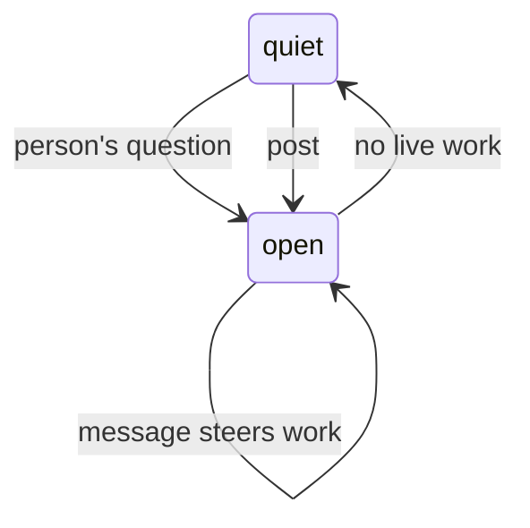
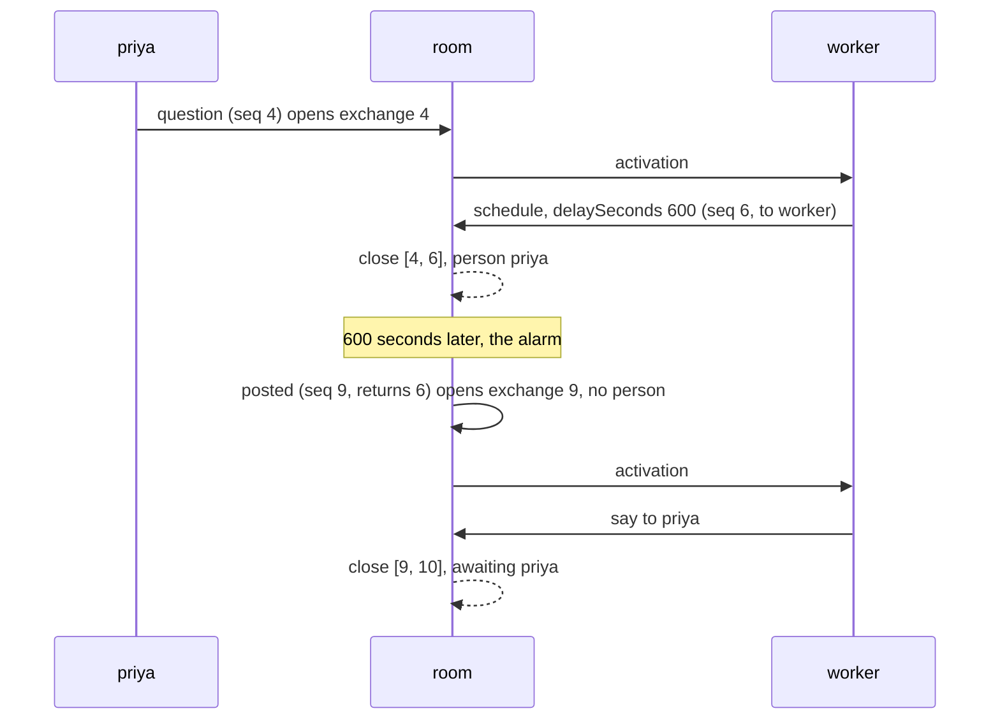

# The exchange

An exchange is the room's unit of human-directed work: one person's question
and the discussion it starts. The implementation is
[`room/exchange.ts`](../packages/ambion/src/room/exchange.ts), with lifecycle
coordination in [`room-run/`](../packages/ambion/src/room-run/room.ts). Read
[`room.md`](room.md) for activation rules and [`summary.md`](summary.md) for
the optional closing message.

One room has one open exchange. A close fixes the range of messages it covered;
it says nothing about answer quality. A summary may later replace that range in
agent context while human review still sees the original messages.

<picture>
  <source media="(prefers-color-scheme: dark)" srcset="assets/ambion-exchange-dark.svg">
  
</picture>

## 1. The spans

[The two spans](room.md#the-two-spans) defines the activation and the
exchange. This page holds the exchange.

## 2. The shape

An exchange records its opening message seq (`from`), its opening time,
and its `person` when a person spoke in it. A durable close fixes its
inclusive final message seq (`through`). Journal administration can occupy
seqs between messages.
`ExchangeRef` carries identity. `Exchange` carries recorded state.
`ExchangeHandle` provides live waits. An `ExchangeRead` contains an `Exchange`,
its original discussion, and the journal position `through` that the read observed.
See [the public types](../packages/ambion/src/types.ts) for the exact shapes.

A message URI is `ambion://room/<name>/message/<seq>`. Build the one for an
exchange's opening message with `messageUri(name, from)`. The URI is not a
stored field.

## 3. Three rules

1. A person's question or a post opens an exchange only when none is open.
   A post is a message of the system: the host posts it with `room.post`,
   and the room's clock posts a returned say. Agent speech, arrivals, and
   departures do not open one. A question or a post that lands while one is
   open belongs to that exchange's work.
2. Quiescence closes the current exchange. The room derives “live” from leases
   and due wakes, then appends a close with the observed `through` boundary.
   Work that reaches a terminal state is handled the same way.
3. Ordinary messages landing while it is open steer eligible active seats and
   do not change its opening message or range. A later human question is
   therefore part of the current work, not a second exchange. The first
   person who speaks becomes its `person` when it had none
   ([§4](#4-who-directs-one-and-who-receives-its-result)).


```mermaid
stateDiagram-v2
    quiet --> open : person's question
    quiet --> open : post
    open --> open : message steers work
    open --> quiet : no live work
```

## 4. Who directs one, and who receives its result

**An exchange has no owner. Two facts of the record stand in for one.**

| Fact                    | Where it comes from                               | What reads it                                                           |
| ----------------------- | ------------------------------------------------- | ----------------------------------------------------------------------- |
| Who directs the work    | The author of the opening message                 | The opening line of the prompt, and the answer rule of `awaiting`       |
| Who receives the result | `person`: the first person who spoke in the range | The summary and its recipients, `ctx.exchange.person`, `waitForSummary` |

**For a person's question, both facts name that person.** The person stays
the `person` after leaving the room, and the summary remains addressed to
them. A second person may speak into the open exchange; their next question
opens a later exchange once the room is quiet.

**A post opens an exchange with no author.** Its exchange has no
`person` until a person speaks in the range. The first person who speaks
becomes its `person` and receives its summary. An exchange where no person
spoke owes no summary.

**The room derives `person` from the record.** `exchangeAfter` reads the
first said message of a person at or after `from`, and the close stamps
it. A handle and the `exchange_opened` event hold `person` as it was when
they were made, and no event follows when a person joins. The close and
the `Exchange` hold the final value.

## 5. A fold over the journal

`exchangeAfter` finds the first said message from a known person, or the
first post, after the last close. Closes, leases, messages,
and pending work are all reconstructed from the journal, so a resumed room continues an exchange interrupted by a
process or host failure. Unexpired leases may continue; unclaimed or expired
work follows the retry policy. A configured summary writer is scheduled only
after the close is durable.

## 6. A scheduled say

**An agent comes back to its work with a say to itself.** The agent calls
`schedule` with `delaySeconds` set to a number of seconds. The tool writes a
`said` entry with `to` set to the author's own name and `delaySeconds` beside
it. The say wakes nobody and steers nobody, and it is not live work, so the
exchange closes while it waits.


```mermaid
sequenceDiagram
    participant P as priya
    participant R as room
    participant W as worker
    P->>R: question (seq 4) opens exchange 4
    R->>W: activation
    W->>R: schedule, delaySeconds 600 (seq 6, to worker)
    R-->>R: close [4, 6], person priya
    Note over R: 600 seconds later, the alarm
    R->>R: posted (seq 9, returns 6) opens exchange 9, no person
    R->>W: activation
    W->>R: say to priya
    R-->>R: close [9, 10], awaiting priya
```

**The room returns the say when it is due.** The reconcile writes a
`posted` entry `{ to, returns, text, refs }`: the returned say. `returns`
holds the seq of the say. The post copies the text and the refs of the say,
so the agent reads them when the record window or a summary no longer shows
the say. The system wrote it, so it has no `from`. It wakes one seat, the
one that `to` names, and steers no other.

**The due time comes from the record.** A say is due at its `at` plus
`delaySeconds` seconds. `nextAlarm` takes the earliest due time beside the
lease expiries and the retry times, so a resumed room arms it again from the
journal. A pass that ends a lease returns no say, so the returned say lands
after the close of the same pass.

**The room decides who may schedule.**

- A scheduled say goes to its author. A `say` to oneself gets a refusal.
- A scheduled say states the read position of its author, and the room
  takes it at any position. The commit result lists in `unread` the
  messages after that position and before the say. The tool result shows
  them, so the model reads the record through the say.
- A respond activation schedules, whether an exchange is open or not. A
  summary activation cannot schedule.
- `limits.schedule` bounds `delaySeconds` from `minDelaySeconds` to
  `maxDelaySeconds`, 60 to 604,800 seconds by default, and holds at most
  `waiting` says of one seat, 4 by default.

**The agent sees its scheduled says.** The schedule result names the say by
its seq, as the record shows it: `scheduled #41: the room wakes you with this
message at <time>`. The view of each respond activation carries the scheduled
says of the seat in `scheduled`, and the render lists each one with its seq,
its due time, its text, and its refs. A continued Pi session reads the list
beside the delta. A summary activation reads none.

**A say can stop waiting.** An unseating of its author drops it, and a
cancellation drops every say before it. A recomposition that leaves the author
out writes no unseating, so its says wait until the seat is on the roster
again. A read lists the says that wait in `scheduled`.

**The agent or the host dismisses a say.** A correction to long work can make
a scheduled say wrong, and its text is fixed. The `dismiss` tool takes the
seq of a scheduled say as `message`, and the room writes a `dismissed` entry
`{ from, message }`. The entry wakes nobody. The fold drops the say, so it
frees its place under `pending`.

- A seat dismisses its own scheduled say, from a respond activation. The
  seq of another seat's say, or of no scheduled say, gets a refusal.
- A dismissal of a say that returned or that the seat dismissed already
  changes nothing. The tool result says that the say no longer waits.
- The host dismisses any scheduled say with `room.dismiss(seq)`. The entry
  has no `from`. The call returns `true` when it writes the entry and
  `false` when the say no longer waits.
- A dismissal and the due time race through the journal. The entry that
  lands first decides, and the other changes nothing.

**A returned say starts a fresh vendor session.** A vendor session never
crosses an exchange, so the agent reads the record, the summary of the first
exchange, and its reminders. The process reminder carries the state of a
process that the say checks on.

## 7. The edges a host sees

`Visit.send()` returns a handle for the exchange containing the committed
question. Persist `handle.from`; after restart, reacquire it with
`room.exchange(from)`.

```ts
const exchange = await (await room.visit(priya)).send({ text: 'Can I promise Thursday?' });
const conversation = await exchange.waitForClose();
const response = await exchange.waitForSummary();

const resumed = await resumeRoom('site', { runtime, agents });
const same = resumed.exchange(exchange.from);
```

`waitForClose()` waits for the durable close and returns non-summary messages in
the inclusive `[from, through]` range. `waitForSummary()` waits for its optional
summary, returning `undefined` when no writer is configured or the writer
deliberately stays silent. A revoked or abandoned summary activation rejects
the response when the summary is required. The exchange handle is the completion API; there is no room-wide
quiet wait.

**The host posts with `room.post`.** A post is a message of the system:
the `posted` entry `{ to?, text, refs? }` has no author, and a seat cannot
write one. It opens an exchange when none is open, and the call returns the
handle of the exchange that holds it.

```ts
workspace.processes.subscribe((event) => {
  if (event.type !== 'ended' || event.process.room !== room.name) return;
  const { handle, name, agent, state } = event.process;
  room
    .post({
      to: agent,
      text: `lab: process ${name ?? handle} is ${state}. Call status with ${handle}.`,
      key: `process-ended:${handle}`,
    })
    .catch((error: unknown) => log.error(error));
});
```

- **A post routes as a say does.** A post to a seat wakes that seat, a post
  to a person wakes no seat, and a post with no `to` wakes each idle seat at
  `broadcast` or wider. The room refuses a post to a `none` seat and to a
  name it does not know.
- **A post with `to` steers its target alone.** A post with no `to` steers
  each seat at work. The record shows every post to each seat at its next
  activation.
- **A post key has a key space of its own.** A repeated `key` lands once and
  returns the same handle. The same key names a different operation for a
  visit send and for a post, so the two never collide.
- **The limits of a message apply.** `limits.message.bytes` bounds its text,
  and its refs follow the ref rules.
- **A post carries no human direction.** The prompt of an exchange that a
  post opened reads `The host opened exchange <n> with message <n>. A post
reports an event and gives no direction.` Put a label, such as `ci:`, in
  the text, so a seat reads where the event comes from.

Summary completion is folded from the recorded close, messages, and lease
history (`summaryCompletion`). A covering summary wins over lease state; a
pending summary activation remains pending until it publishes or records a terminal
failure. Retrying the same delivery key and payload returns the same handle;
conflicting reuse rejects. Concurrent sends into one open exchange share its
identity. See [delivery guarantees](durability.md#2-what-a-delivery-promises).

**The handle's `opened` field marks the delivery that started the exchange.**
It is `true` only for the send whose message is the exchange's own opening
position; a later send that joins an already-open exchange gets `opened:
false`, even though `handle.from` matches. A retry of the opening delivery
key also reads back `opened: true`. `room.exchange(from)` always returns
`opened: false`, because reacquiring a handle is never the act that opens
the exchange. `person` can name a person other than the one who sent a
given message, when that message joined an exchange another person opened.

Live notifications include `message`, `exchange_opened`, and
`exchange_closed` events, plus activation events. An activation event names its
activation. Notifications and pending waits belong to the current run and
must be recreated after interruption.

**`room.read()` returns detached state from one journal position.** It starts
no agents and performs no reconciliation. `RoomRead` reports initialization,
recorded goal, participants, the reserve of agents that no seat holds,
`Exchange` values, and the journal position `through`.
Use `readRoom(name, { runtime })` without a running handle, including stopped rooms.
A stopped open exchange remains open until the journal records its close.

Pass `{ messages: false }` for metadata, or `{ messages: { after } }` for messages
after an exclusive position. `after` must be a non-negative safe integer. A future
cursor returns no messages; exchange metadata remains complete.

The position `through` includes close and lease entries. Activity can change when
a lease expires without another append, so `through` cannot validate a cached view.
An active host reads its observed journal prefix after local writes settle;
a read does not force synchronization with another host's writes.
See [`RoomRead` and `Exchange`](../packages/ambion/src/types.ts) for types.

**`readExchange(name, from, { runtime })` reads the original discussion immediately.**
It returns `undefined` for a missing exchange. The reference must be a positive
safe integer. The read includes the `Exchange` and excludes summaries
from its discussion. A closed discussion uses its fixed inclusive source range;
an open discussion contains the messages recorded so far. Reading never waits
for close or summary completion. Late summaries appear in the exchange outcome.

```ts
const recorded = await readExchange(saved.roomName, saved.exchangeFrom, { runtime });
if (recorded) {
  console.log(recorded.exchange.status, recorded.messages);
}
```

**A closed `Exchange` carries an `outcome`.** The room derives it from
the record. It adds no entry kind and starts no timer, so a resumed room reads
the same outcome. The first case that holds wins:

| Outcome     | When it holds                                                                |
| ----------- | ---------------------------------------------------------------------------- |
| `cancelled` | A cancellation wrote the close.                                              |
| `exhausted` | The room gave up on a respond activation in the range.                       |
| `awaiting`  | The last said message asks a person, and that person has said nothing since. |
| `complete`  | None of the above.                                                           |

A message to the author of the opening message is the answer to that
person's question, so it never makes an exchange `awaiting`. A returned say
has no author, so in its exchange each message to a person can make it
`awaiting`. `awaitingFor` then lists what the work of a returned say needs of
that person. `awaiting` carries the `person`. It clears when
that person speaks. `awaitingFor(read, person)` returns the closed exchanges
of a room read that await one person. A failed summary reads
through `summary`, not `outcome`. The verified rule `exchangeOutcome` fixes the
order.

Cancellation closes the current discussion without assigning a new summary. It
settles existing pending summary work as failed. See the
[cancellation contract](durability.md#cancellation) for ordering and retry behavior.

**Every `Exchange` lists its `activations`.** One entry holds the
activation `id`, the `seat`, the `attempt`, the `purpose` (`respond` or
`summarize`), and the `outcome`. The outcome is `running`, or an end reason
with `cancelled` and `cause` when they apply. An entry carries `usage` when
the activation recorded it. Every attempt has an entry, in journal order. An
open exchange lists the activations since its question. The `session` field
holds the vendor session that the activation recorded at its release. It
is absent when the executor recorded none.

**The steps of an activation go to the host's logger.** See
[Executors](executors.md#the-trace-log).

## 8. What reads one

- The summary writer receives one dedicated summary activation and may write a
  summary through `say`.
- A client groups the fixed range under the question it answered.
- A host can measure cost and completion per exchange. A closed exchange
  read carries `usage`: the sum of every activation in its range, the
  summary activation and every retried attempt included. The
  `exchange_closed` event carries no usage, because the summary activation
  runs after the close.

The exchange covers only its own `[from, through]` range. What a person missed
between visits is presence catch-up, not a synthetic exchange.

## 9. A gap the room has

Quiescence has no hard duration bound. Agents that keep producing work can keep
an exchange open. The say lock rejects stale writes and forces reconsideration,
but it does not guarantee that a model will stop. Hosts should monitor work and
apply their own operational limits where needed.

## 10. What proves it

[`exchange-completion.test.ts`](../packages/ambion/test/exchange-completion.test.ts)
checks the opening message and `person`, quiescent close boundaries,
steering, the departure of the person, multiple exchanges, and the ordering
of `waitForClose()` before `waitForSummary()`. Replay and storage variants are included. Restart behavior is
covered by [`restart.test.ts`](../packages/ambion/test/restart.test.ts) and
presence/reconnect cases by [`presence.test.ts`](../packages/ambion/test/presence.test.ts).
[`exchange-outcome.test.ts`](../packages/ambion/test/exchange-outcome.test.ts)
checks the outcome order, the `awaiting` clearing, and `awaitingFor`.
[`scheduled-say.test.ts`](../packages/ambion/test/scheduled-say.test.ts)
checks a scheduled say: the close while it waits, the returned say on the
room's alarm, the exchange it opens, and one return after a stop or a crash.
