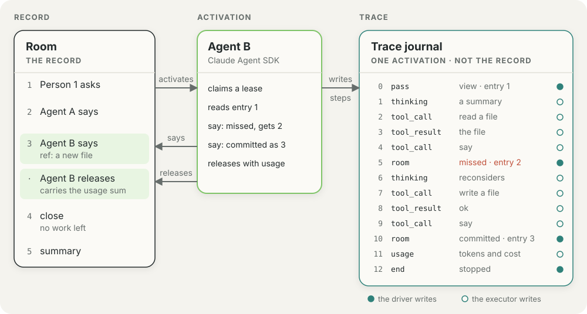

# Executors

An executor runs one agent's model loop for one activation. The room and the
driver own the record, the lease, and the rules. An executor owns the model
call, the tools it exposes, and the steps it reports. [The
README](../README.md) holds the positioning. This page holds the contract
between the driver and an executor: the activation flow, the room tools,
exchange continuity, failure classification, the step vocabulary, and the way to
write an adapter. [The Pi guide](pi.md), [the Claude guide](claude.md), and
[the Codex guide](codex.md) hold what is specific to one adapter.

## The executor contract

**The host configures execution before it starts the room.** An `Execution`
is a value that an executor package builds, such as `piExecution()` from
`@ambionframework/pi`. The runtime gives it the clock, the storage, the call
retry policy, and the transport. It returns a connector. The room supplies
the captured agent definition and receives an execution port. It does not
construct a model runner.

`createRuntime` takes an `execution` for every room of the runtime.
`startRoom` and `resumeRoom` take an `execution` for one room run. An
explicit `execution` wins over every default. A room whose seats run on
more than one family passes `composeExecutions`, which routes each seat on
the `kind` of its executor.

**A room with no `execution` uses the default of each executor kind.** An
executor package calls `registerDefaultExecution(kind, factory)` when the
host loads it. The registry holds functions and stays outside the journal,
the captured definition, and the JSON protocol. The kernel imports no
executor package. The runtime builds the default of a kind once, on the
first seat of that kind, over its own storage, clock, limits, and
transport. A seat of a kind with no default fails at once with a
`no_execution` error, and the failure is permanent. A room with no default
still runs its people and its record. A room whose seats run on more than
one family needs no `composeExecutions` when each family's package is
loaded, because each package registers its own default. A host that needs
custom storage, transport, or limits passes an `execution`. Cloudflare and
other separate hosts resolve their execution on the host and never read
the registry.

**A transport receives room calls and executor dependencies separately.**
`Transport.connect(room, context)` receives a plain `RoomProtocol` facade
with `view`, `commit`, and `lease`. The facade gives no access to room
lifecycle methods. The returned `AgentPort` handles `wake`, `steer`, and
`cut`. `AgentExecutionContext` supplies one captured agent definition, the
room and seat names, the clock, the call retry policy, an executor, a trace
opener, and notifications. Remote hosts resolve their execution
dependencies where the agent runs. Only protocol data crosses RPC.

**`AgentRunner` is the driver.** It owns the lease, its renewal, the wake
queue, and the record window. It knows no model and no provider. For each
activation it opens one `ExecutorSession` and passes the windowed record to
it. A session renders a prompt, runs its own model loop for one pass, and
reports where it left off.

| Member                             | What it does                                                           |
| ---------------------------------- | ---------------------------------------------------------------------- |
| `Executor.open(activation)`        | Opens one session. The activation holds `id`, `room`, `emit`, `trace`. |
| `session.pass(input)`              | Runs one pass. Returns `failed`, and on failure a `cause`.             |
| `session.readThrough`              | The highest position the session has consumed.                         |
| `session.steer?(after, seq, line)` | Takes a line into a live pass. Absent when the family cannot.          |
| `session.shouldRefresh(lastSeq)`   | Says whether the session has work for another pass.                    |
| `session.abort()`                  | Cuts a pass in flight. `cancelled` then stops further passes.          |
| `session.close?()`                 | Frees a held process. The driver calls it once, after the release.     |

**The first pass receives the view. A later pass receives a delta.** The
`view` is the whole windowed record. A `delta` holds the fresh view and
`since`, the position the session had read through. A `PassResult` that sets
`stop: 'length'` reports that the model reached a length limit.

**Freshness bounds correctness. Steering is a capability.** The driver
reads `readThrough` to renew the lease and to release it. A commit that
finds a newer message in the record fails as `missed`, and the seat reads
again. An executor that cannot steer omits `steer`. The next pass rereads
the record, so a dropped steer is not lost. [Durability](durability.md)
states the commit-freshness promise.

**The hosting entry exports the execution protocol.** `Execution`,
`ExecutionConnector`, `ExecutionHost`, `Transport`, `AgentRunner`,
`inProcessTransport`, `composeExecutions`, `registerDefaultExecution`,
`hostingOf`, and `describeExecutor` come from `@ambionframework/ambion/hosting`. The main
entry names none of them. Journal events and projected lease state stay
internal. Participant views omit `sessionId`.

## The prompt the driver renders

**The renderer returns three prompt parts.** `renderActivation` returns
`mechanism`, `agent`, and `context`. Each part depends on one thing, so an
adapter places it where it caches best.

- `mechanism` depends on the kernel version only. It states how a room
  works.
- `agent` depends on the definition and the purpose. It holds the name, the
  speaking policy, the identity, and the instructions. A closing seat reads
  its summary duties here.
- `context` depends on the activation. It holds the clock, the room, the
  roster, the record, the reminders of the tool bundles, and the ask line.
  A summarize activation gets no reminder.

`renderDelta(view, since)` renders the later passes. It marks each message
beyond `since` with the `[new]` prefix, and returns `undefined` when nothing
is new. `renderLine` renders one steered line. `refusal` renders a room
refusal for the model.

**A definition can replace the speaking policy.** The main entry exports
`DEFAULT_GUIDANCE`. An executor takes a `speaking` option that replaces it.
Tool bundle guidance stays in the `guidance` field and follows the policy.
The rendering helpers stay pure and stateless, with one call out: the
`reminders` of the executor. A reminder gives the same text for the same
activation, so a second render of one activation reads the same prompt. A
reminder that throws gives no text. The core does not cut a reminder, so
the bundle bounds the length of its own text. `renderReminders` gives the
reminder text alone, and `renderSystem` gives the mechanism and the agent
part with no call to a reminder. An adapter that sends a continued session
the delta alone sends the reminder text before the delta, on the first
pass of an activation.

## How an activation runs

[The prompt the driver renders](#the-prompt-the-driver-renders) states
where `mechanism`, `agent`, and `context` land. The adapter page names the
placement for its family.

**`readThrough` advances only when the model has consumed a message.** The
table below holds for every family. An adapter page names the signal it
reads for the first event.

| Event                                                 | What moves                                                          |
| ----------------------------------------------------- | ------------------------------------------------------------------- |
| The model reads a prompt, a delta, or a steered line  | `readThrough` moves to the position of that message.                |
| The room accepts an ordinary `say`                    | `readThrough` moves to the position the say confirms.               |
| The harness reports the tool result of a `missed` say | `readThrough` moves to the last of the messages the result carries. |

**A steered line moves the position only when the record before it is
already read.** A message that lands out of order does not advance
`readThrough` until the gap closes.

**`shouldRefresh` decides on another pass.** It answers yes when the record
stands past `readThrough`.

**Every family stamps a `steer` step with `consumed`.** `consumed: true`
marks a line the pass will deliver. `consumed: false` marks a line that the
pass could not use before it ended, and the next delta carries it. Each
family page states the moment its executor sets `consumed: true`, because
the moment differs by family.

**The activation token limit windows the record.** The driver pages the
record from the tail, keeps the newest messages that fit
`activationTokenLimit`, and keeps the open exchange whole. The limit counts
record text through `estimateTokens`. It does not count the system prompt,
the tool schemas, or the model output. It does not compare with the context
window of the model. This is driver behavior, and it holds for every
family.

## The room tools

[Definitions and tools](agent.md#tools) states which tools an ordinary
activation receives and which tools a closing activation receives. The
hosting entry exports `SAY`, `SEAT`, `UNSEAT`, and `summaryToolDescription`.

**The hosting entry holds the room tools once, in a form that names no
harness.** Each family adapts them to its own tool shape.

- **`roomTools(view, binding, options?)`** returns the room tools that the
  purpose of the activation grants. Each `RoomTool` has a `name`, a
  `description`, TypeBox `parameters`, and `run(args, call)`. `call` is the
  id of the tool call, and the commit takes it as its key.
- **`RoomToolBinding`** is what the tools reach: the activation id, the
  room, `readThrough`, `acknowledgeThrough`, `resultExpected`, and `abort`.
- **`RoomToolOptions`** adds to a say: `refs` changes the refs it cites,
  and `spoke` runs when the room takes an ordinary say.
- **`agentTools(view, agent, signal, current)`** returns the tools of the
  definition in the same form. A closing activation gets none.
- **`toolContext(agent, view, call, signal, onUpdate?)`** builds the
  `ToolContext` of one call of a definition tool.

**A `RoomToolResult` holds the content that the model reads.** `isError`
marks an error result. `terminate` marks an activation that has nothing more
to do: an `unknown` or `stale` answer, or the last answer of a closing
activation.

**`say` commits a `said` intent.** It carries `readThrough` and takes the
tool call id as its commit key. It accepts `text`, `to`, and `refs`.

**`seat` and `unseat` commit a membership intent**, keyed on the tool call
id.

**The room answer tells the adapter what to do:**

| Room answer                | What the adapter does                                                           |
| -------------------------- | ------------------------------------------------------------------------------- |
| `committed` or `unchanged` | The adapter delivers the result.                                                |
| `refused`                  | The adapter raises the room message as a tool error.                            |
| `missed`                   | The adapter raises a tool error that lists the new messages.                    |
| `unknown` or `stale`       | The adapter aborts the activation. The message may already stand on the record. |

**`say` is the room's own event.** It raises no `tool_execution_start` and
no `tool_execution_end` event. The adapter reports it as a room event.
[Codex](codex.md#step-mapping) reports `seat` and `unseat` the same way.

**The tools run in the host process.** Each adapter page names the
transport that carries a call from the harness to the host.

## The step vocabulary

**A step is one thing an activation did.** The vocabulary has ten kinds,
and every executor family shares it. A step is plain JSON. The trace stamps
each step with `activation`, `pass`, `at`, and `index`. `index` counts from
zero in each pass. The `TraceStep` type is the stamped form. `Step` in
`types.ts` holds the fields of each kind.

| Step          | Recorded by | Meaning                                                                                            |
| ------------- | ----------- | -------------------------------------------------------------------------------------------------- |
| `pass`        | driver      | A pass begins. `view` is the first pass; `delta` follows a record that moved.                      |
| `thinking`    | executor    | A block of reasoning. `final` closes the block.                                                    |
| `text`        | executor    | A block of model text. `final` closes the block.                                                   |
| `tool_call`   | executor    | A tool starts, with its input.                                                                     |
| `tool_result` | executor    | A tool ends, with its output, or with `error`.                                                     |
| `room`        | driver      | The room answered a commit: `committed`, `unchanged`, `missed`, `refused`, `stale`, or `unknown`.  |
| `steer`       | executor    | A message landed mid-activation. `consumed` says whether the pass delivered it.                    |
| `approval`    | executor    | A tool call needed a decision. `decision` holds the answer.                                        |
| `usage`       | executor    | Tokens and cost.                                                                                   |
| `end`         | driver      | The activation stops: `stopped`, `length`, or `aborted`. A failure adds its `cause` and `message`. |

**A family page holds its own mapping table.** [Pi](pi.md#the-step-mapping),
[Claude](claude.md#the-step-mapping), and [Codex](codex.md#step-mapping) map
the events of their harness to these steps.

**The driver sums the `usage` steps at release.** The release entry of an
activation carries the sum, and a closed exchange read carries the sum of
its activations. An end that the room writes (`expired`, `revoked`,
`abandoned`) carries no usage.
[Durability](durability.md#5-what-the-room-does-not-promise) states this.
The trace caps do not cut the sum, because the sink adds each step before
the cap applies. The sum holds when the host passes no logger.

## The trace log

**The trace goes to the host's logger.** The driver opens a `TraceSink` for
each activation and passes it to the executor at `open`. The sink gives each
step to the `logger` that the host passes to `createRuntime`, as one
`TraceRecord`: `room`, `seat`, and the stamped step. With no logger, the
sink drops the steps. The record and the trace never share an entry.

<picture>
  <source media="(prefers-color-scheme: dark)" srcset="assets/ambion-activation-trace-dark.svg">
  
</picture>

**The trace never gates the activation.** The room does not read the trace.
A logger that throws or rejects does not change the activation outcome or
the lease. The driver closes the sink after it releases the lease. The
trace is not part of the record or of the durability promise.

**The sink applies the policy and the limits.** The sink joins the deltas of
a `thinking` or `text` block into one step. `limits.trace.stepsPerPass`
caps the steps of one pass, and an `end` step is always kept.
`limits.trace.toolOutputBytes` cuts a tool output that is larger, and the
step keeps the start of it with a note of the size. The Pi execution
applies the limits of the host. The Claude execution applies the defaults
and ignores `limits.trace`.

**A definition sets its trace policy.** `defineAgent({ trace })` takes
`thinking` (`omit`, `summary`, or `full`) and `toolOutput` (`omit` or
`full`). The default is `{ thinking: 'summary', toolOutput: 'full' }`.
`summary` keeps the first 280 characters of each thinking block.

**The logger receives the steps in order.** The sink calls the logger once
for each step, in the order of `pass` and `index`, before the release. The
logger runs on the path of the activation, so it must not block. In a
separated host the seat calls its own logger; `@ambionframework/cloudflare`
takes it in `configure`.

## Exchange continuity

**A seat keeps its harness session for the length of one exchange.** A
seat often works in more than one activation of an exchange: it speaks,
its lease ends, another participant answers, and the room wakes it again.
The second activation continues the session of the first. It keeps the
reasoning, the tool calls and the tool results that the record does not
hold. The first activation of a seat in each exchange starts fresh.

**The release records the session, and the room hands it back.** The
release records `{ harness, id }` on the `ended` entry. The room gives
the next activation of the same seat in the same exchange the latest such
session as `spec.resume`. A closing activation gets the session of the
exchange it summarizes. The room never reads the id. There is no option:
every executor works this way.

**An executor resumes only the session that `spec.resume` names.** It
uses the session only when the harness name is its own. With no
`spec.resume` it starts a fresh session. [Pi](pi.md#exchange-continuity)
keeps each session of a seat apart, so the open exchange runs beside the
summary of the exchange before it.

**The session is a cache, and its persistence is best effort.** The
harness keeps the session where it keeps it. On Node, Pi, Claude and Codex
keep it on the local disk. A Pi seat with `sessions: 'memory'`, and a
Cloudflare seat, keep their Pi sessions in memory. A new disk, a host with no disk,
or an evicted seat object loses the session. The next activation then
starts fresh from the room record. The activation does not fail, and the
release records the new id. The record is the only state the room
promises to keep.

**Freshness governs speech in a kept session.** A kept session does not
let a seat commit over a record it has not read.
[Durability](durability.md#journal-format) owns the journal field and the
journal format.

## Failure classification

**The executor sorts a failure into `permanent` and `transient`.** A
permanent failure ends the activation in one attempt. A transient failure
retries to the cap of the room.
[Durability](durability.md#permanent-and-transient-failure) states what the
room does with the cause.

| Failure                                                                           | Cause       |
| --------------------------------------------------------------------------------- | ----------- |
| An error text that names a credit, a quota, a credential, or a permission refusal | `permanent` |
| A status of 400, 401, 402, 403, 404, 405, or 422                                  | `permanent` |
| An error of the executor, such as a lost room call or a lost process              | `transient` |
| Every other failure                                                               | `transient` |

**A status decides the cause when no text matches.** An uncertain failure
is transient, so the room retries it.

**A length stop is no failure.** The pass reports `stop: 'length'`.

**Each family brings its own text set and its own source of a status.**
[Pi](pi.md#failure-classification), [Claude](claude.md#failure-classification),
and [Codex](codex.md#failures) name the text set and the status source of
each family.

## The harness matrix

**Three executor families ship today.** Pi, the Claude Agent SDK, and the
Codex SDK implement the contract. The Anthropic SDK tool runner is an
anticipated family. No package for it exists yet.

| Family                    | Package                   | Loop owner | Steer during a pass                 | Status      |
| ------------------------- | ------------------------- | ---------- | ----------------------------------- | ----------- |
| Pi `AgentHarness`         | `@ambionframework/pi`     | Harness    | Yes, through `lane.steer`           | Shipped     |
| Claude Agent SDK          | `@ambionframework/claude` | Harness    | Yes, on the SDK `user` echo         | Shipped     |
| Codex SDK                 | `@ambionframework/codex`  | Harness    | None; the next `run` takes the line | Shipped     |
| Anthropic SDK tool runner | None                      | Caller     | Between turns                       | Anticipated |

The [Pi](pi.md), [Claude](claude.md), and [Codex](codex.md) guides describe the packages.

**A family that cannot steer still passes.** Its `readThrough` advances at
the pass boundary, and the driver holds a steer for the next pass. What a
harness remembers between activations is in [Trust](trust.md).

## How to write an adapter

An adapter is a package that builds an `Execution` and an executor for one
family. `@ambionframework/claude` is the worked example, and
`@ambionframework/pi` is the second family.

1. **Implement `Executor` and `ExecutorSession`.** `open` takes the
   activation and returns a session. Keep the model loop for one activation
   inside the session.
2. **Render with the shared helpers.** Call `renderActivation` on the first
   pass and `renderDelta` on later passes. [The prompt the driver
   renders](#the-prompt-the-driver-renders) states where each part goes.
3. **Expose the three room tools.** Call `roomTools` and `agentTools` for
   one activation, and adapt each result to the form the harness needs.
   [The room tools](#the-room-tools) states the commit key and the room
   answers.
4. **Record the steps you own.** Call the `TraceSink` of the activation for
   `thinking`, `text`, `tool_call`, `tool_result`, `steer`, `approval`, and
   `usage`. The driver records `pass`, `room`, and `end`.
5. **Declare steering and rest correctness on freshness.** Advance
   `readThrough` when the model has consumed a message, and on nothing
   earlier. [How an activation runs](#how-an-activation-runs) states the
   events that move it.
6. **Classify every failure.** Sort it into `permanent` and `transient`.
   [Failure classification](#failure-classification) states the shared
   rule; bring the family's own text set and status source.
7. **Record a session, and resume only the one the view names.**
   [Exchange continuity](#exchange-continuity) states the recorded session
   and the fresh start. A harness with no session records none.
8. **Wrap the executor in an `Execution`.** Export a function that defines
   the executor of an agent and a function that gives the host its
   execution. Claude offers `claude()` and `claudeExecution()`. Call
   `registerDefaultExecution` with the kind, so a room with no `execution`
   serves the seats of the family.

```ts
import { defineAgent, startRoom } from '@ambionframework/ambion';
import { claude } from '@ambionframework/claude';

const reviewer = defineAgent({
  name: 'reviewer',
  identity: 'Reads the plan and names what is missing.',
  executor: claude({
    instructions: 'Speak when the plan lacks evidence.',
    model: 'claude-sonnet-5',
    allowedTools: ['Read'],
    cwd: '/work/plans',
  }),
});

const room = await startRoom({
  name: 'delivery',
  agents: [reviewer],
});
```

## The conformance suite

**The suite is the acceptance gate for an adapter.**
`@ambionframework/ambion/conformance` exports `executorConformance`. It
plays the driver and the room for one executor, runs the executor through
the real driver over a scripted room, and checks the room calls and the
steps the logger receives. It checks nothing an executor says beyond its
neutral plans.

An adapter supplies an `ExecutorHarness`. `open(plan, definition)` builds
the executor for one `ExecutorPlan`, using a fake model or a fake
executable. `can` is an `ExecutorCapabilities` value with `steer`, `usage`,
and `permanentFailure`. The suite drops each case that a false capability
gates.

Three runs exist as evidence. The scripted executor runs the suite in
`packages/ambion/test/executor-conformance.test.ts`. The Pi executor runs
it on a scripted stream in `packages/pi/test/executor-conformance.test.ts`,
through `piExecutorHarness` from `@ambionframework/pi/testing`. The Claude
executor runs it against a fake Claude Code executable in
`packages/claude/test/executor-conformance.test.ts`, through
`claudeExecutorHarness` from `@ambionframework/claude/testing`. No run
needs a key or a network.

The Codex executor does not run the suite. A real model cannot follow a
scripted plan, and a fake `codex` proves only that the adapter agrees with
its own guess about the SDK. The Codex package tests its mapping on events
that a real `codex` recorded, and it runs its executor claims in a live
tier. See [Codex](codex.md).
