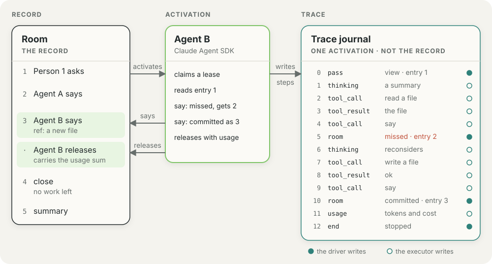

# Executors

An executor runs one agent's model loop for one activation. The room and the
core own the record, the lease, the rules, and the state of each activation.
An executor owns one harness: the model call, where the tools run, and the
steps it reports. [The README](../README.md) holds the positioning. This
page holds the contract between the core and an executor: the pass, the
room tools, exchange continuity, failure classification, the step
vocabulary, and the way to write an adapter. [The Pi guide](pi.md), [the Claude guide](claude.md), and
[the Codex guide](codex.md) hold what is specific to one adapter.

## The executor contract

**The host configures execution before it starts the room.** An `Execution`
is a value that an executor package builds, such as `piExecution()` from
`@ambionframework/pi`. It names the `kind` of executor that it serves. The
runtime gives it the clock, the storage, the call retry policy, the trace
limits, and the logger. It returns a connector. The room supplies the
captured agent definition and receives an execution port. It does not
construct a model runner.

**One router serves every seat.** `createRuntime` takes an `execution` for
every room of the runtime. `startRoom` and `resumeRoom` take an `execution`
for one room run. Each takes one execution or a list, such as
`[piExecution(), claudeExecution()]`. A seat runs on the first execution of
the room that serves its kind, then on the first of the runtime, then on
the default of its kind. An execution with no `kind` serves every kind. A
seat that no execution serves fails at once with a `no_execution` error,
and the failure is permanent. A room with no execution still runs its
people and its record.

**`defineExecution(kind, build)` defines an executor kind.** It returns
the function that gives an execution of the kind for a set of options, such
as `piExecution(options)`. An execution with options serves only the rooms
and the runtimes that it is passed to, and it changes no default. The call
also makes the execution with no options the default of the kind. A later
definition of the same kind replaces the default. Each executor package
calls `defineExecution` once, when the host loads it.

**The registry holds functions.** It stays outside the journal, the
captured definition, and the JSON protocol. The kernel imports no executor
package. The runtime builds the default of a kind once, on the first seat
of that kind, over its own storage, clock, limits, and logger.

**`localExecution(kind, build)` makes one execution of a kind.** It changes
no default. `defineExecution` builds each execution with it. A host uses it
for an execution that no package defines, such as a stub for a kind that is
not available.

```ts
export function defineExecution<Options = undefined>(
  kind: string,
  build: (
    host: ExecutionHost,
    options: Options | undefined,
  ) => (request: ConnectorRequest) => Executor,
): (options?: Options) => Execution<AgentRunner>;

export function localExecution(
  kind: string,
  build: (host: ExecutionHost) => (request: ConnectorRequest) => Executor,
): Execution<AgentRunner>;
```

**The port of a local execution is an `AgentRunner` in this process.**
`build` runs once for each connector. The room builds the connector of
its own execution when the first seat that the execution serves connects.
`startRoom` does not build it. The function that `build` returns builds the
executor of one seat. Every seat keeps the trace limits and the logger
of the host. The runner receives a plain `RoomProtocol` facade with
`view`, `commit`, and `lease`. The facade gives no access to room lifecycle
methods.

**A remote host writes an execution whose port crosses the boundary.** Its
connector returns an `AgentPort` that carries `wake`, `steer`, and `cut` to
the host that runs the seat. That host calls the execution of its own
runtime for the seat, and the seat reaches back through the same boundary.
Only protocol data crosses. The room object of `@ambionframework/cloudflare`
runs one such execution, `rpcExecution`. The seat object connects the Pi
execution once, and awaits `AgentRunner.run` inside its alarm.

**`AgentRunner` is the driver.** It owns the lease, its renewal, and the
wake queue. It knows no model and no provider. For each activation it opens
one `ActivationState` over the executor of the seat, and the state opens one
`ExecutorSession`. The driver asks the room for the windowed view and runs
one pass after another until the activation stops.

## The pass contract

**The core owns the state of an activation.** It causes or observes each
fact of it, so no executor keeps a copy.

| The core keeps                   | How                                                                                        |
| -------------------------------- | ------------------------------------------------------------------------------------------ |
| `readThrough`                    | It joins the ranges that the executor reports read, and the positions that a say confirms. |
| The cut                          | It aborts the `signal` of the activation. A cut activation runs no other pass.             |
| The refresh test                 | It runs another pass when the record stands past `readThrough`.                            |
| The room tools and their binding | It binds them to the activation, and hands them over as values.                            |
| The prompt                       | It renders `mechanism`, `agent`, and the record of each pass.                              |
| The tool events                  | It raises them from the `tool_call` and `tool_result` steps.                               |
| The `error` event                | It raises one event for each failed pass.                                                  |
| The resume token                 | It reads `spec.resume` when it names the kind of the executor.                             |

**An executor keeps its harness alone.** It maps the harness events to
steps, resumes a harness session, hosts the tools, and reports the signal
that the model consumed input.

**An executor is a function of the activation.** It takes an
`ExecutorActivation` and returns an `ExecutorSession`. The activation
holds what serves the whole activation, in these properties:

| Property          | What it is                                                                              |
| ----------------- | --------------------------------------------------------------------------------------- |
| `id`              | The activation id.                                                                      |
| `trace`           | A `StepSink`: its `record(step)` takes the steps that the executor owns.                |
| `signal`          | The `AbortSignal` of the activation: the room, the driver, or a room tool cuts it.      |
| `readThrough`     | The position the core holds as read. A harness that keeps a session writes it there.    |
| `read(range)`     | The model consumed `range`, `{ after, through }`: a prompt, a delta, or a steered line. |
| `delivered(call)` | The result of the tool call `call` reached the model.                                   |
| `callId(tool)`    | The id of the next call of `tool`, for a harness that cannot see the id of a call.      |

**`pass` receives what the core decides for one pass.** `Pass` holds
`kind`, `view`, and `since` for a delta, as `PassInput` does, and these
properties:

| Property        | What it is                                                                                     |
| --------------- | ---------------------------------------------------------------------------------------------- |
| `mechanism`     | How a room works. It depends on the kernel version alone.                                      |
| `agent`         | The seat's part: the name, the speaking policy, the identity, and the instructions.            |
| `record(after)` | The record the pass reads, rendered, with the range it holds. `undefined` when nothing is new. |
| `resume`        | The id of the harness session to resume, when `spec.resume` names the executor kind.           |
| `tools`         | The room tools that the purpose grants, then the tools of the definition.                      |

**The session reports back.** `ExecutorSession` has these properties:

| Property                   | What it does                                                                        |
| -------------------------- | ----------------------------------------------------------------------------------- |
| `pass(pass)`               | Runs one pass, and returns a `PassResult`.                                          |
| `session`                  | The id of the harness session, for the release. Absent when the harness keeps none. |
| `roomTools`                | What the executor adds to a say and a schedule, as `RoomToolOptions`.               |
| `steer?(after, seq, line)` | Delivers a line to a live pass. Absent when the executor cannot.                    |
| `close?()`                 | Frees a held process. The driver calls it once, after the release.                  |

**The core records the session under the executor kind.** The release
records `{ harness, id }`, where `harness` is `definition.executor.kind`,
such as `pi`. An executor session with no `session` id records none.

**`pass` returns a `PassResult`.** It has these fields:

| Field     | What it is                                                                                        |
| --------- | ------------------------------------------------------------------------------------------------- |
| `failed`  | Whether the pass failed.                                                                          |
| `cause`   | On failure: `permanent` or `transient`. It tells the room whether a retry can pass.               |
| `message` | On failure: what went wrong, for the `error` event and the `end` step.                            |
| `error`   | On failure: the error that the `error` event carries. Absent, the core builds one from `message`. |
| `stop`    | `'length'` when the model reached a length limit. The pass did not fail.                          |

**A session follows these rules.** The core reads the session at fixed
points.

- **A pass that the cut ends reports no failure.** The cut aborts `signal`,
  and the pass returns `failed: false`.
- **The core reads `roomTools` once, before the first pass.** Set it on the
  session that the executor returns. A later change reaches no tool.
- **The core reads `session` after the last pass.** Keep the id of the
  harness session there until the driver calls `close`. The room hands it
  to the next activation as `spec.resume`, and never reads it.
- **Every pass holds the same tool values.** The core binds the tools on the
  first pass, so an adapter can host them once for the activation.

**The first pass receives the view. A later pass receives a delta.** The
`view` is the whole windowed record. A `delta` holds the fresh view and
`since`, the position the activation had read through. A pass that throws
is a failed pass, and [its cause](#failure-classification) follows the
error.

**Freshness bounds correctness. Steering is a capability.** The driver
reads `readThrough` to renew the lease and to release it. A commit that
finds a newer message in the record fails as `missed`, and the seat reads
again. An executor that cannot steer omits `steer`. The next pass rereads
the record, so a dropped steer is not lost. [Durability](durability.md)
states the commit-freshness promise.

## The hosting entry exports

**`@ambionframework/ambion/hosting` exports the execution protocol.** The
main entry names none of it. Journal events and projected lease state stay
internal. Participant views omit `sessionId`.

| Export                   | What it is                                                                                                                                                     |
| ------------------------ | -------------------------------------------------------------------------------------------------------------------------------------------------------------- |
| `Execution`              | What a runtime or a room takes: the `kind` that it serves, and its connector                                                                                   |
| `ExecutionHost`          | What the runtime gives a connector: the clock, the storage, the limits, and the logger                                                                         |
| `ConnectorRequest`       | What the room gives for one seat: the room and seat names, the definition, and `emit`                                                                          |
| `AgentPort`              | The side that the room calls: `wake`, `steer`, and `cut`                                                                                                       |
| `RoomProtocol`           | The side that a seat calls: `view`, `commit`, and `lease`                                                                                                      |
| `AgentRunner`            | The driver, and the port of a seat in this process. `run(activation)` resolves when it ends. `recover(activation)` releases as failed a run that the host lost |
| `defineExecution`        | Defines an executor kind: the executions of one kind by options, and the default of the kind                                                                   |
| `localExecution`         | Builds one execution of one kind, whose port is an `AgentRunner` in this process                                                                               |
| `hostingOf`              | The state of a runtime: an `ExecutionHost` with the journal namespace, the executions, and `evict`                                                             |
| `visitOf`                | The visit of a person whom the record of a running room holds present. It writes nothing                                                                       |
| `describeExecutor`       | The neutral half of an executor definition, which an executor kind extends with its fields                                                                     |
| `present`, `pickPresent` | The option fields that hold a value, which an executor kind spreads into its executor                                                                          |
| `Executor`               | The executor contract: `ExecutorActivation`, `StepSink`, `Pass`, `PassRecord`, `ReadRange`, `PassResult`, and `ExecutorSession`                                |

**`RoomProtocol.view(activation, message?)` takes no range.** The room
serves the record windowed to its cap and to the token limit of the seat,
so a seat never pages the record. With `message`, the view holds that one
message when the purpose may read it; `recall` reads a message below the
window this way. The hosting entry exports no `ViewRange`, and the
`context` of a view holds `omitted` and no `earliest`.

## The prompt the core renders

**The core renders three prompt parts.** Each part depends on one thing, so
an adapter places it where it caches best.

- `mechanism` depends on the kernel version only. It states how a room
  works.
- `agent` depends on the definition and the purpose. It holds the name, the
  speaking policy, the identity, and the instructions. A closing seat reads
  its summary duties here.
- `record()` depends on the activation. On the first pass it holds the
  clock, the room, the roster, the record, the reminders of the tool
  bundles, and the ask line. A summarize activation gets no reminder.

**A later pass reads the delta.** `record()` marks each message beyond
`since` with the `[new]` prefix, and gives `undefined` when nothing is new.
The core then counts the view read. The core renders each steered line and
each room refusal for the model.

**A resumed session reads the delta on its first pass.** `record(after)`
takes the position that the harness session read through. The first pass
of a respond activation then reads the reminders, the pending says, and
the messages beyond `after`. Pi passes it; Claude and Codex read the whole
view.

**A definition can replace the speaking policy.** The main entry exports
`DEFAULT_GUIDANCE`. An executor takes a `speaking` option that replaces it.
Tool bundle guidance stays in the `guidance` field and follows the policy.
The core resolves the `reminders` of the bundles once for each respond
activation, when `record()` has something to send. Each reminder has 5
seconds to answer, and at that bound the core aborts the signal that it
passed to the reminder. A reminder that throws, rejects, gives blank text,
or answers late gives no text. The core does not cut a reminder, so the
bundle bounds the length of its own text.

## How an activation runs

[The prompt the core renders](#the-prompt-the-core-renders) states the
parts. The adapter page names the placement for its executor kind.

**`readThrough` advances only when the model has consumed a message.** The
core keeps it. The table below holds for every executor kind. An adapter page
names the signal it reads for the first and the last events.

| Event                                                | Who tells the core        | What moves                                                          |
| ---------------------------------------------------- | ------------------------- | ------------------------------------------------------------------- |
| The model reads a prompt, a delta, or a steered line | The executor: `read`      | `readThrough` moves to the position of that message.                |
| The room accepts an ordinary `say`                   | The say tool              | `readThrough` moves to the position the say confirms.               |
| The room accepts a `schedule` with no `unread`       | The schedule tool         | `readThrough` moves to the position of the scheduled say.           |
| The tool result of a `missed` say reaches the model  | The executor: `delivered` | `readThrough` moves to the last of the messages the result carries. |
| The tool result of a `schedule` reaches the model    | The executor: `delivered` | `readThrough` moves to the scheduled say, past its `unread`.        |

**A steered line moves the position only when the record before it is
already read.** A message that lands out of order does not advance
`readThrough` until the gap closes. The core holds the range, and it joins
the range once the gap closes. Of two held ranges through one position,
the core keeps the range that starts lower. The order in which the ranges
arrive does not change the position.

**The core decides on another pass.** It runs one when the record stands
past `readThrough` and the activation was not cut.

**The core records the `steer` step of every line, with `consumed`.**
`consumed: true` marks a line the pass delivers. `consumed: false` marks a
line that the pass does not use before it ends, and the next delta carries
it. The core decides by the moment the line lands:

| The line lands                                     | The core records                                                                                             |
| -------------------------------------------------- | ------------------------------------------------------------------------------------------------------------ |
| Before the first pass                              | Nothing yet. The line waits for the first pass, and then follows the rules below.                            |
| Before a first pass that never runs                | `consumed: false` when the pass would have started: a cut, a view of another seat, or a failed claim.        |
| Between two passes                                 | `consumed: false` at once.                                                                                   |
| In a pass, and the view of the pass holds the line | `consumed: true` at once.                                                                                    |
| In a pass, and the executor has no `steer`         | `consumed: false` at once.                                                                                   |
| In a pass, and the executor has `steer`            | `consumed: true` when the executor calls `read` for the line, or `consumed: false` when the pass ends first. |
| In a pass, and `steer` throws                      | `consumed: false` at once, unless the executor read the line first.                                          |

The core calls `steer` at any moment after it calls `pass` and before that
pass settles. That includes the moment before the body of `pass` reaches its
first `await`. The executor holds a line that its harness cannot take yet,
delivers it when the harness can, and drops what it holds when `pass`
settles. It calls `read({ after, through: seq })` when the model consumes
the line, with the `after` and the `seq` that `steer` received. It records
no `steer` step. The guide of each executor kind states the moment its executor calls
`read`, because the moment differs by kind.

**The room applies the activation token limit.** It keeps the newest
messages that fit `activationTokenLimit`, and keeps the open exchange
whole, inside the view it serves. The limit counts record text through the
estimator that `estimateTokens` names in the registry of the runtime. It
does not count the system prompt, the tool schemas, or the model output. It
does not compare with the context window of the model. The rule holds for
every executor kind, and one view is one call over the wire.
[History and limits](room.md#history-and-limits) states the rule.

## The room tools

[Definitions and tools](agent.md#tools) states which tools an ordinary
activation receives and which tools a closing activation receives.

**The core binds the tools of the activation once, in a form that names no
harness.** Each executor kind adapts them to its own tool shape.

- **`pass.tools`** holds the room tools that the purpose of the activation
  grants, then the tools of the definition. A closing activation gets the
  room tools alone. Each `RoomTool` has a `name`, a `description`, TypeBox
  `parameters`, and `run(args, call)`. `call` is the id of the tool call,
  and the commit takes it as its key. The core binds each room tool to the
  read position and the cut of the activation. A call of a tool of the
  definition reads the view of the pass that runs it.
- **`session.roomTools`** is a `RoomToolOptions` value that adds to a say
  and to a schedule: `refs` changes the refs it cites, and `spoke` runs
  when the room takes an ordinary say or a scheduled say.
- **`toolContext(agent, view, call, signal, onUpdate?)`** builds the
  `ToolContext` of one call of a definition tool, for an executor that
  hosts the tools of the definition itself. It carries the view's
  `deadline`: when the room ends the activation, on the wall clock.

**The result of a room tool holds the content that the model reads.**
`isError` marks an error result. `terminate` marks an activation that has
nothing more to do: an `unknown` or `stale` answer, or the last answer of a
closing activation.

**The scripted executor also reads the room answer of a commit.** A script
of `@ambionframework/ambion/testing` branches on a short answer, such as
`delivered`, `missed`, or `stale: <why>`. The result holds only the text
that a model reads, and the scripted executor makes no call to the room.
The core keeps the answer beside each result, for the scripted executor
alone. The hosting entry does not export it, and no other executor reads
it.

**`say` commits a `said` intent.** It carries `readThrough` and takes the
tool call id as its commit key. It accepts `text`, `to`, and `refs`. The
result names the message, as `said #41` or `said #41 to priya`, so the
agent can cite it. `seat` and `unseat` give `seated surveyor (#42)`, and a
seating the record already holds gives `surveyor is already seated`.

**`schedule` commits a `said` intent with `after`.** The intent goes to the
seat itself. It carries `readThrough`, and the room takes it at any
position. It accepts `after`, `text`, and `refs`. The result names the say
as `#<seq>` and gives the due time, and it lists the `unread` messages of
the answer.

**`seat` and `unseat` commit a seating intent**, keyed on the tool call
id.

**`recall` reads and commits nothing.** For each distinct ref of its
room, it calls `view(id, seq)`. The view of one message applies no window
and folds no summarised range, so it reaches a message below the window. The
tool calls neither `acknowledgeThrough` nor `resultExpected`, and every
executor kind reports it as a tool event.

**The room answer tells the adapter what to do:**

| Room answer                | What the adapter does                                                           |
| -------------------------- | ------------------------------------------------------------------------------- |
| `committed` or `unchanged` | The adapter delivers the result.                                                |
| `refused`                  | The adapter raises the room message as a tool error.                            |
| `missed`                   | The adapter raises a tool error that lists the new messages.                    |
| `unknown` or `stale`       | The adapter aborts the activation. The message may already stand on the record. |

**A seat without the authority of its activation hears `stale`.** The
authority is a live lease and the grant that the record gives the
activation id. The grant holds only for a seat on the roster. `view`,
`commit`, and a lease release check the authority when the seat asks, and
`commit` and a release check it again where the write lands. The answer
names the reason: `the lease ended` or `the activation has no room grant`.
A claim or a renewal that the room refuses answers `the lease ended`.

**A room tool that commits an entry raises no tool event.** `say`,
`schedule`, `seat`, `unseat`, and `dismiss` raise no `tool_execution_start`
and no `tool_execution_end` event. The entry that each one commits reaches
the host as a `message` event, and a tool event would report the same
fact a second time. `recall` commits nothing, so it raises tool events, as
every tool of the definition does.

**The core raises the tool events from the steps.** It pairs each
`tool_call` step with the `tool_result` step of the same call id. An
executor records the steps, and raises no tool event.

**The executor hosts the tools.** Pi runs them in its harness, Claude in an
MCP server in the process, and Codex in the stdio server that it spawns,
over a local socket to the host. A harness that cannot see the id of a call
takes it with `callId(tool)`: the oldest `tool_call` step of that tool that
no call took yet, or a fresh id when none waits. A `tool_result` step ends
its call, so the core drops the id of that call. Each adapter page names
the transport.

**Pi hosts the room tools of `pass.tools`, and builds the tools of the
definition itself.** Claude and Codex host all of `pass.tools`. A
`RoomTool` does not carry what the Pi harness does with a tool of the
definition:

- The harness applies `prepareArguments` before it checks the arguments
  against the schema. A `RoomTool` applies it after the check.
- The harness runs a batch in turn when a tool sets `executionMode` to
  `sequential`.
- The harness gives the tool `onUpdate`, and the abort signal of the run.
- The harness keeps `details` and `terminate` of the result. A `RoomTool`
  gives the content alone.

Pi builds each tool from its `AmbionTool`, and `toolContext` gives each call
the context that the core gives it.

## The step vocabulary

**A step is one thing an activation did.** The vocabulary has ten kinds,
and every executor kind shares it. A step is plain JSON. The trace stamps
each step with `activation`, `pass`, `at`, and `index`. `index` counts from
zero in each pass. The `TraceStep` type is the stamped form. `Step` in
`types.ts` holds the fields of each kind.

| Step          | Recorded by | Meaning                                                                                            |
| ------------- | ----------- | -------------------------------------------------------------------------------------------------- |
| `pass`        | driver      | A pass begins. `view` is the first pass; `delta` follows a record that moved.                      |
| `thinking`    | executor    | A block of reasoning. `final` closes the block.                                                    |
| `text`        | executor    | A block of model text. `final` closes the block.                                                   |
| `tool_call`   | executor    | A tool starts, with its input.                                                                     |
| `tool_result` | executor    | A tool ends, with its output, or with `error`.                                                     |
| `room`        | driver      | The room answered a commit: `committed`, `unchanged`, `missed`, `refused`, `stale`, or `unknown`.  |
| `steer`       | core        | A message landed mid-activation. `consumed` says whether the pass delivered it.                    |
| `approval`    | executor    | A tool call needed a decision. `decision` holds the answer.                                        |
| `usage`       | executor    | Tokens and cost.                                                                                   |
| `end`         | driver      | The activation stops: `stopped`, `length`, or `aborted`. A failure adds its `cause` and `message`. |

**Each executor guide holds its own mapping table.** [Pi](pi.md#the-step-mapping),
[Claude](claude.md#the-step-mapping), and [Codex](codex.md#step-mapping) map
the events of their harness to these steps.

**The driver sums the `usage` steps at release.** The release entry of an
activation carries the sum, and a closed exchange read carries the sum of
its activations. An end that the room writes (`expired`, `revoked`,
`abandoned`) carries no usage.
[Durability](durability.md#5-what-the-room-does-not-promise) states this.
The trace caps do not cut the sum, because the sink adds each step before
the cap applies. The sum holds when the host passes no logger.

## The trace log

**The trace goes to the host's logger.** The driver opens a `TraceSink` for
each activation, and passes the executor its `record` with the activation,
as a `StepSink`. The driver keeps the passes, the usage, and the close. The
sink gives each step to the `logger` that the host passes to
`createRuntime`, as one `TraceRecord`: `room`, `seat`, and the stamped step.
With no logger, the sink drops the steps. The record and the trace never share an entry.

<picture>
  <source media="(prefers-color-scheme: dark)" srcset="assets/ambion-activation-trace-dark.svg">
  
</picture>

**The trace never gates the activation.** The room does not read the trace.
A logger that throws or rejects does not change the activation outcome or
the lease. The driver closes the sink after it releases the lease. The
trace is not part of the record or of the durability promise.

**The sink applies the policy and the limits.** The sink joins the deltas of
a `thinking` or `text` block into one step. `limits.trace.stepsPerPass`
caps the steps of one pass, and an `end` step is always kept.
`limits.trace.toolOutputBytes` cuts a tool output that is larger, and the
step keeps the start of it with a note of the size. Every execution that
`localExecution` or `defineExecution` builds applies the limits of the host.

**A definition sets its trace policy.** `defineAgent({ trace })` takes
`thinking` (`omit`, `summary`, or `full`) and `toolOutput` (`omit` or
`full`). The default is `{ thinking: 'summary', toolOutput: 'full' }`.
`summary` keeps the first 280 characters of each thinking block.

**The logger receives the steps in order.** The sink calls the logger once
for each step, in the order of `pass` and `index`, before the release. The
logger runs on the path of the activation, so it must not block. In a
separated host the seat calls its own logger; `@ambionframework/cloudflare`
takes it in `configure`.

## Exchange continuity

**A seat keeps its harness session for the length of one exchange.** A
seat often works in more than one activation of an exchange: it speaks,
its lease ends, another participant answers, and the room wakes it again.
The second activation continues the session of the first. It keeps the
reasoning, the tool calls and the tool results that the record does not
hold. The first activation of a seat in each exchange starts fresh.

**The release records the session, and the room hands it back.** The
release records `{ harness, id }` on the `ended` entry. The room gives
the next activation of the same seat in the same exchange the latest such
session as `spec.resume`. A closing activation gets the session of the
exchange it summarizes. The room never reads the id. There is no option:
every executor works this way.

**An executor resumes only the session that `pass.resume` names.** The core
sets `pass.resume` only when `spec.resume` names the kind of the
executor. With no `pass.resume` the executor starts a fresh session.
[Pi](pi.md#exchange-continuity) keeps each session of a seat apart, so the
open exchange runs beside the summary of the exchange before it.

**The session is a cache, and its persistence is best effort.** The
harness keeps the session where it keeps it. On Node, Pi, Claude and Codex
keep it on the local disk. A Pi seat with `sessions: 'memory'`, and a
Cloudflare seat, keep their Pi sessions in memory. A new disk, a host with no disk,
or an evicted seat object loses the session. The next activation then
starts fresh from the room record. The activation does not fail, and the
release records the new id. The record is the only state the room
promises to keep.

**Freshness governs speech in a kept session.** A kept session does not
let a seat commit over a record it has not read.
[Durability](durability.md#journal-format) owns the journal field and the
body schemas.

## Failure classification

**The executor sorts a failure into `permanent` and `transient`.** A
permanent failure ends the activation in one attempt. A transient failure
retries to the cap of the room.
[Durability](durability.md#permanent-and-transient-failure) states what the
room does with the cause.

| Failure                                                                                                   | Cause       |
| --------------------------------------------------------------------------------------------------------- | ----------- |
| An error text that names a credit, a quota, a usage limit, a credential, a login, or a permission refusal | `permanent` |
| A status of 400, 401, 402, 403, 404, 405, or 422                                                          | `permanent` |
| An executor fault that a retry cannot clear, such as a model that the registry does not hold              | `permanent` |
| Every other error of the executor, such as a lost room call or a lost process                             | `transient` |
| Every other failure                                                                                       | `transient` |

**One classifier serves every executor kind.** `classifyCause({ text, status })`
from `@ambionframework/ambion/hosting` holds the text set of every provider
that a shipped executor kind reaches. The patterns are `credit balance`,
`billing_error`, `usage limit`, `insufficient_quota`, `exceeded your
current quota`, `authentication_error`, `permission_error`,
`invalid_request_error`, an invalid API key, `x-api-key`, `unauthorized`,
`permission denied`, `not logged in`, `missing bearer`, `invalid_grant`, and
`provider is not configured`. OpenAI sends a spent quota with a 429, and only the text tells it from a rate limit.

**A status decides the cause when no text matches.** An uncertain failure
is transient, so the room retries it.

**One rule turns a thrown error into a failed pass.** `failedPass(thrown)`
from `@ambionframework/ambion/hosting` builds the failed `PassResult`. The
cause is `permanent` for a `PermanentError` and `transient` for every other
value. The rule reads the name of the error, so a second copy of the
package gives the same cause. The result always carries `error`. The core
calls it when a session throws, and an executor calls it for a fault of its
own. A fault that the retry meets again, because the retry runs the same
configuration, is a `PermanentError`.

**The message of a failure names the provider's words.** A provider error
often arrives as a status and a JSON body. `providerMessage` from
`@ambionframework/ambion/hosting` makes it `400 invalid_request_error:
<message> (request <id>)`, and leaves another text as it is. The Pi, Claude,
and Codex executors put this text in the pass result. Classify the cause
from the original text.

**A length stop is no failure.** The pass reports `stop: 'length'`.

**The core raises the `error` event once.** A failed pass, or a room call
that the driver cannot recover from, raises one `error` event with its
cause. The event carries the `error` of the pass result, or an error built
from its `message`. No executor raises one.

**Each executor kind brings its own source of a status.**
[Pi](pi.md#failure-classification), [Claude](claude.md#failure-classification),
and [Codex](codex.md#failures) name the status source of each executor kind.

## The harness matrix

**Three executor kinds ship today.** Pi, the Claude Agent SDK, and the
Codex SDK implement the contract. The Anthropic SDK tool runner is an
anticipated executor kind. No package for it exists yet.

| Kind                      | Package                   | Loop owner | Steer during a pass                 | Status      |
| ------------------------- | ------------------------- | ---------- | ----------------------------------- | ----------- |
| Pi `AgentHarness`         | `@ambionframework/pi`     | Harness    | Yes, through `lane.steer`           | Shipped     |
| Claude Agent SDK          | `@ambionframework/claude` | Harness    | Yes, on the SDK `user` echo         | Shipped     |
| Codex SDK                 | `@ambionframework/codex`  | Harness    | None; the next `run` takes the line | Shipped     |
| Anthropic SDK tool runner | None                      | Caller     | Between turns                       | Anticipated |

The [Pi](pi.md), [Claude](claude.md), and [Codex](codex.md) guides describe the packages.

**An executor that cannot steer still passes.** Its `readThrough` advances at
the pass boundary, and the driver holds a steer for the next pass. The
core records that line as `consumed: false`. What a
harness remembers between activations is in [Trust](trust.md).

## How to write an adapter

An adapter is a package that builds an `Execution` and an executor for one
executor kind. `@ambionframework/claude` is the worked example, and
`@ambionframework/pi` is the second.

1. **Implement `Executor` and `ExecutorSession`.** The executor is a
   function that takes the activation and returns a session. Keep the model
   loop for one activation inside the session. The core records the session
   under the executor kind of the seat.
2. **Place the prompt.** Put `pass.mechanism` and `pass.agent` where the
   harness caches them, and send the text of `pass.record()`.
   [The prompt the core renders](#the-prompt-the-core-renders) states the
   parts.
3. **Host the tools.** Adapt `pass.tools` to the form the harness needs,
   and run them where the harness reaches them.
   A harness that does more with a tool of the definition can build it
   from its `AmbionTool`, as Pi does.
   [The room tools](#the-room-tools) states the commit key and the room
   answers.
4. **Record the steps you own.** Call `trace.record` of the activation for
   `thinking`, `text`, `tool_call`, `tool_result`, `approval`, and
   `usage`. The driver records `pass`, `room`, and `end`. The core records
   `steer`, and it raises the tool events from the steps.
5. **Report what the model consumed.** Call `read(range)` when the model
   consumes a range, and `delivered(call)` when a tool result reaches it,
   and on nothing earlier. [How an activation runs](#how-an-activation-runs)
   states the events. Declare `steer` only when the harness takes a line
   into a live pass. The core calls `steer` at any moment after it calls
   `pass` and before that pass settles, also before the body of `pass`
   reaches its first `await`. Hold a line that the harness cannot take yet,
   deliver it when the harness can, and drop what you hold when `pass`
   settles. Call `read({ after, through: seq })` when the model consumes a
   line, and record no `steer` step.
   [The core rule](#how-an-activation-runs) sets `consumed`.
6. **Classify every failure.** Sort it into `permanent` and `transient`
   with `classifyCause`. Throw `PermanentError` for a fault that a retry
   cannot clear, such as a model that the registry does not hold, and
   call `failedPass` for a thrown fault of the executor.
   [Failure classification](#failure-classification) states the shared
   rule; bring the source of a status that the executor kind has.
7. **Record a session, and resume only the one the pass names.**
   [Exchange continuity](#exchange-continuity) states the recorded session
   and the fresh start. A harness with no session records none.
8. **Wrap the executor in an `Execution`.** Export a function that defines
   the executor of an agent and a function that gives the host its
   execution. Claude offers `claude()` and `claudeExecution()`. Export the
   result of `defineExecution` as the second function. The call defines the
   default when the package loads, so a room with no `execution` serves the
   seats of the executor kind.

```ts
import { defineAgent, startRoom } from '@ambionframework/ambion';
import { claude } from '@ambionframework/claude';

const reviewer = defineAgent({
  name: 'reviewer',
  identity: 'Reads the plan and names what is missing.',
  executor: claude({
    instructions: 'Speak when the plan lacks evidence.',
    model: 'claude-sonnet-5',
    allowedTools: ['Read'],
    cwd: '/work/plans',
  }),
});

const room = await startRoom({
  name: 'delivery',
  agents: [reviewer],
});
```

## The conformance suite

**The suite is the acceptance gate for an adapter.**
`@ambionframework/ambion/conformance` exports `executorConformance`. It
plays the driver and the room for one executor, runs the executor through
the real driver over a scripted room, and checks the room calls and the
steps the logger receives. It checks nothing an executor says beyond its
neutral plans.

An adapter supplies an `ExecutorHarness`. `open(plan, definition)` builds
the executor for one `ExecutorPlan`, using a fake model or a fake
executable. `can` is an `ExecutorCapabilities` value with `steer`, `usage`,
and `permanentFailure`. The suite drops each case that a false capability
gates. `close(report)` runs after each case. The report holds the name of
the case, every room call with its answer, and every step the logger
received.

Three runs exist as evidence. The scripted executor runs the suite in
`packages/ambion/test/executor-conformance.test.ts`. The Pi executor runs
it on a scripted stream in `packages/pi/test/executor-conformance.test.ts`,
through `piExecutorHarness` from `@ambionframework/pi/testing`. The Claude
executor runs it against a fake Claude Code executable in
`packages/claude/test/executor-conformance.test.ts`, through
`claudeExecutorHarness` from `@ambionframework/claude/testing`. No run
needs a key or a network.

The Codex executor runs the suite in its live tier, on a real `codex` and a
real model, in `packages/codex/test/live/conformance.test.ts`, through
`codexExecutorHarness` in its live support. The model follows each plan
from its instructions. It declares no steer and no usage, because Codex
takes no steer and a real model spends no planned usage. The run needs
`CODEX_API_KEY` and skips without it. A fake `codex` proves only that the
adapter agrees with its own guess about the SDK, so the package tests its
mapping on events that a real `codex` recorded. See [Codex](codex.md).

**The suite checks the pass contract.** A failed activation raises exactly
one `error` event, and a `say` raises no tool event.
