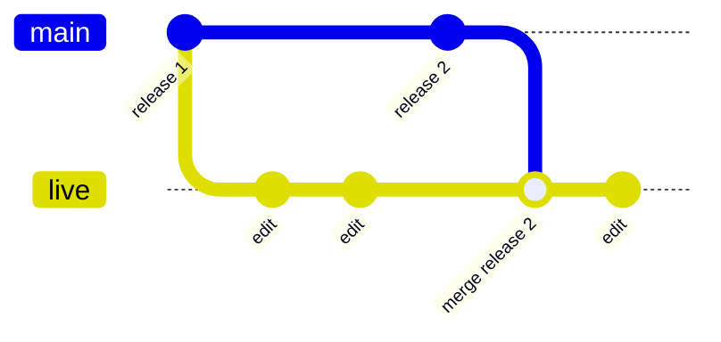
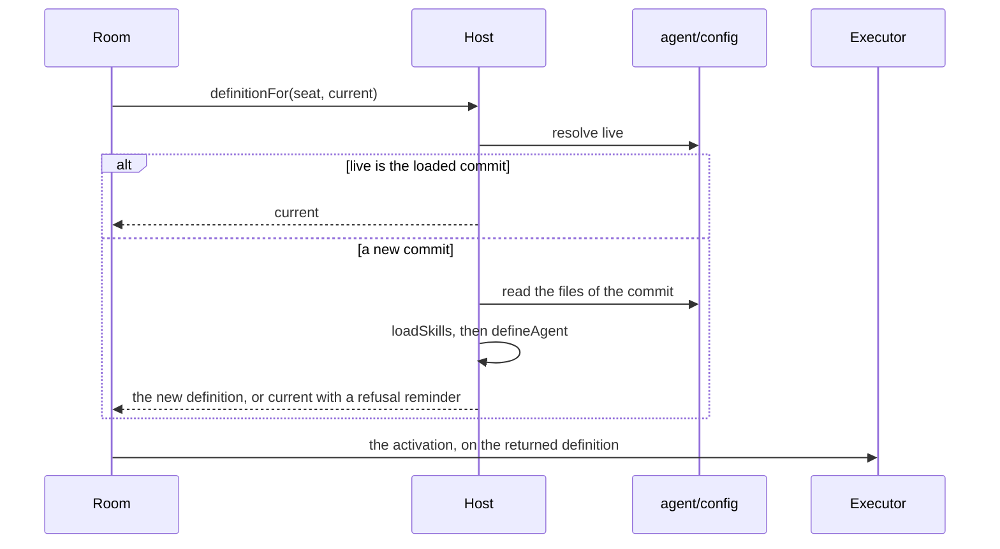
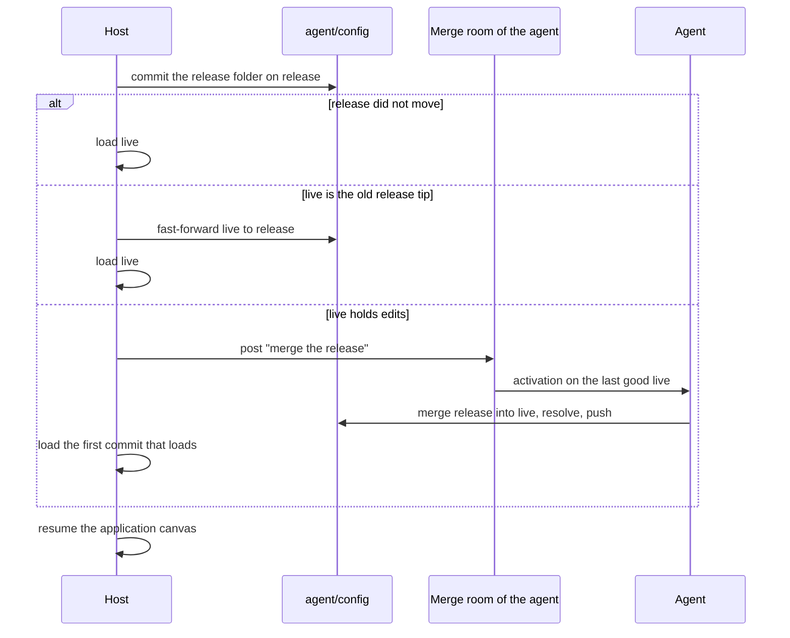

# Git for everything

**This page is a design. No package implements it yet.** It describes how
each agent keeps its own configuration in a private git repository, how
an edit takes effect at the next activation, and how a new release
reaches each agent at startup. Each section names what exists today and
what must be added.

**The configuration of an agent is everything that shapes how it works.**
It is the instructions and identity text, the skills, the macros of each
skill, and their scripts and references. One private repository for each
agent holds it, `<agent>/config`. The name is provisional.

## Decisions

- **Each agent sees only its own configuration, and can edit all of
  it.** No agent can read or write the configuration of another agent.
- **Two branches separate what ships from what runs.** `release` holds
  what ships with the code. `live` holds the version that the agent
  customized, and the host loads it.
- **Tools and credentials stay in host code.** No agent edits them. An
  edit can change how an agent works, and never what it can touch.
- **An edit takes effect at the next activation of the agent.** The room
  asks the host for the definition of a seat before each activation. An
  activation in progress never changes.
- **The agent merges a new release at startup.** When `release` moves and
  `live` holds edits, the agent merges `release` into `live` and resolves
  the conflicts.
- **The source repository stays the one truth.** A developer reads the
  difference between `release` and `live` of each agent, and folds it into
  the source for the next release.

## What the repository holds

| In `<agent>/config`                        | In host code, not editable |
| ------------------------------------------ | -------------------------- |
| `instructions.md`, the instructions        | Tools and tool bundles     |
| `identity.md`, the identity                | Credentials                |
| `skills/<skill>/SKILL.md`, the skill text  | Models and executors       |
| `skills/<skill>/macros/<name>.js`, a macro | Limits and the roster      |
| `skills/<skill>/` scripts and references   | The canvas and its rooms   |

**The layout is a convention of the host.** `defineAgent` takes strings
and a skill set. The host reads the files and builds the definition, so
the layout adds no stored format.

**The source holds one folder for each agent and one for the shared
skills.** The host builds the release of an agent from its folder and the
shared skills that it uses. In the repository of the agent, a shared skill
is an ordinary folder that the agent can edit.

**A macro cannot widen what an agent can touch.** A macro binds only the
tools in its `uses`, and each must be a tool of the seat
([Macros](macros.md)). An edited macro chains the same tools in another
order.

## The branches



The diagram draws `release` as the first branch.

| Branch    | Holds                                                 | Who writes                           |
| --------- | ----------------------------------------------------- | ------------------------------------ |
| `release` | What ships with the code, one commit for each release | The host, at startup                 |
| `live`    | The customized version that runs                      | The agent; the host fast-forwards it |

**`release` is a line of release commits.** At each start, the host
compares the release folder of the agent with the tip of `release`. A
changed folder gets a new commit on the tip, and an equal folder writes
nothing. Template registration already follows this rule
([Templates](git.md#templates)). The message of each commit names the
source commit, as `Source: <hash>`.

**`live` starts at the first release.** At the first start, the host
creates the repository with one commit on `release` and points `live` at
the same commit.

**The history keeps everything.** Each edit, each merge of a release, and
each resolved conflict is a commit on `live`. `live` takes the hook of the
shared default branch: a push cannot delete it or move it to a commit that
does not descend from its tip.

## Edit the configuration

**An agent edits its configuration like any other repository.** It clones
`<agent>/config`, works on `live`, commits, and pushes. The guidance of
the agent states three rules:

1. Push each edit. On `memoryBackend`, a commit that is not pushed is
   lost at a restart ([Persistence](git.md#persistence)).
2. Give the reason in the commit message, and cite the exchange that
   showed the need with a message ref.
3. Expect the edit to take effect at the next activation.

**The copy in `~/.skills` is not the configuration.** An edit of that copy
changes nothing that runs, and the copy step can restore it
([Skills](skills.md#the-copy-in-the-home)).

## Load at each activation

**The room asks the host for the definition before each activation.** A
new room option, `definitionFor(seat, current)`, returns the definition
for the next activation of a seat. `openCanvas` takes the same option and
passes it to `startRoom` and `resumeRoom` of each row, breakout rooms
included. This is a kernel change: today the room binds each definition
once per run.



**An unchanged `live` costs one resolve.** The host caches the definition
by commit. It reads the files and builds a definition only when `live`
moves.

**The runner asks for the definition when it takes an activation.** The
runner of a seat already reads the definition once for each activation
(`execution/runner.ts`). The seat context and the connector request then
hold a function that returns the definition, and `portFor` binds it to
`definitionFor`. The seat keeps one port for the run, so its queue of
activations stays. An activation in progress keeps its definition. Two
activations of one exchange can run on two commits.

**Only the texts, the skills, and the macros change.** The room accepts
a returned definition only when `captureAgent` accepts it and these fields
equal the current ones: `name`, `identity`, `executor.kind`,
`activationTokenLimit`, `estimateTokens`, and the tool names. Otherwise it
keeps the current definition. The room reads those fields outside the
port, and the journal records the name and the identity in the cast. An
edit of `identity.md` therefore takes effect at the next start.

**A commit that does not load leaves the current definition.** The host
returns the current definition with a reminder that names the refused
commit and the error of `loadSkills` or `defineAgent`. The agent reads the
error at that activation and can push a fix.

**The call has a time bound.** A call that fails or passes the bound
leaves the current definition, as the 5-second bound of a reminder does.

**Each executor must carry the new text into its session.**

| Executor | A changed agent part in a resumed session                                                                                                                                       |
| -------- | ------------------------------------------------------------------------------------------------------------------------------------------------------------------------------- |
| Pi       | Works: the harness renders the prompt before each request ([Pi](pi.md))                                                                                                         |
| Claude   | Works: the agent part goes at the head of the first message of a resumed session ([Claude](claude.md))                                                                          |
| Codex    | Missing: `thread/start` fixes `baseInstructions`. The executor must compare the agent part as it compares the tools, and start a new thread when it differs ([Codex](codex.md)) |

**The record and the promise do not change.** The option adds no journal
body, and the cast keeps the name and the identity. A new optional field
of the room options is additive.

**The host can pin a seat to one commit.** A pin makes `definitionFor`
return that commit whatever `live` holds. A person uses it to stop a bad
edit until the agent fixes it.

## Startup

**A release lands at a start.** A new release comes with new host code,
so the host restarts. Edits between two starts need no merge: each one
loads at the next activation.



**An agent with no edits merges nothing.** When `live` is the old tip of
`release`, the host fast-forwards `live`. No activation runs.

**An agent with edits merges in its own room.** The host opens a second
canvas, `config`, on a canvas store of its own. It holds one root room for
each agent that must merge, and that agent is the one seat. The host does
not mirror these rooms, so no agent reads another agent's merge. The agent
runs on its last good `live`, so it resolves each conflict with the
instructions under which it made the edit.

**A person can take part in the merge.** The merge room is a root room
of a canvas, so a person can visit it, read the conflicts, and answer the
agent. The agent asks the person when a conflict needs a decision that
its edits do not settle. The room then records how each conflict was
resolved and why.

**The agent merges `release` into `live`.** It resolves each conflict with
its commit messages and the exchanges they cite. It checks that each
skill still loads, then pushes `live`. The host knows the merge is done
when the tip of `release` is an ancestor of `live`, as `git merge-base
--is-ancestor` tests it.

**At the start, the host loads the first rung that loads, for each
agent.**

1. `live` after the merge.
2. The last commit of `live` that loaded.
3. The tip of `release`.

**The last good commit can fail on new host code.** A macro can name a
tool that the release removed, and `loadSkills` or `defineAgent` then
refuses it. The tip of `release` always loads, because the developer
tested it with that host code.

**A merge that fails is kept.** On a deadline or an `exhausted` exchange,
the host loads the next rung and posts the outcome to the merge room.
`live` keeps what the agent pushed. The agent can finish the merge later,
and `live` then loads at its next activation. The merge room is the
record of each merge.

**The release keeps each agent name.** A breakout row whose definition
is gone stays `running` at `resume` ([Canvas](canvas.md)).

## Record the version

**The trace records which commit ran each activation.** The host wraps
its `TraceLogger` and adds the loaded commit of `live` and the tip of
`release` to each step. The commit can change from one activation to the
next, so the trace is the one place that records it. A step already names
the room, the seat, the activation, and the exchange
([Executors](executors.md)). The host stores the trace, because a restart
keeps none.

**The host keeps one log entry for each load.** The entry holds the
seat, the commit, and the outcome: loaded, refused with the error, or
pinned.

**The journal holds nothing new.** It stays the record of what the room
decided.

## Fold the edits back into the source

**The customization of an agent is the difference between its two
branches.** After a merge, `live` holds the current release and the edits
of the agent:

```sh
git diff release live
```

**The developer applies it onto the source commit of the release.** The
message of the `release` tip names that commit. A harvest script maps each
path back to its source folder: `instructions.md` and `identity.md` to
the folder of the agent, and a skill to the folder of the agent or the
folder of shared skills. It then applies the patch with `git apply -3`.

**The developer folds one agent at a time.** Two agents that edited the
same shared skill give two patches. The developer merges them in the
source repository and picks one text for the next release.

**The host exports each repository.** On a workstation, the developer
fetches over SSH. With `justGitBackend`, the server runs in the host's
process, so a host script clones each repository and writes a git bundle.

## Trust

| Attempt                                                         | Result                                                                                                                                   |
| --------------------------------------------------------------- | ---------------------------------------------------------------------------------------------------------------------------------------- |
| Edit its own instructions, skills, or macros                    | Allowed; takes effect at the next activation                                                                                             |
| Read, clone, or fork the configuration of another agent         | Refused: the repository is private to its agent                                                                                          |
| Push to `release`                                               | Refused: the host alone writes it                                                                                                        |
| Change a tool or a credential                                   | Not possible: host code                                                                                                                  |
| Delete every file on `live`                                     | Refused at load; the current definition stays                                                                                            |
| Write text that enters another agent's prompt                   | Possible on the just-bash backends: an agent can change the clone in another home, and the owner can push it. Refused on the workstation |
| Read or change the working copy or `~/.skills` of another agent | Possible on the just-bash backends: no wall between homes. Refused on the workstation: each home is mode `0700`                          |
| Read the edits of another agent in the audit log                | Possible on both backends when the workspace sets `audit`                                                                                |

**Isolation needs the workstation and no audit log.** On the just-bash
backends, every agent can read every home ([Macros](macros.md#review-a-macro)),
so a clone or the skills copy of an agent is readable there. The audit log
holds the arguments and the result of each file and `bash` call, and every
agent can read it ([Workspace](workspace.md)). A host that needs isolation
runs the agents on a workstation and sets no `audit`.

**Use this design with trusted agents.** An agent rewrites its own
instructions, and the edit applies at once. A prompt injection that
reaches an agent can persist through its configuration until a person
pins the seat. A room open to untrusted agents loads `release` alone
([Trust](trust.md)).

## What must be added

| Piece                                                                                                                                                                                         | State                                                     |
| --------------------------------------------------------------------------------------------------------------------------------------------------------------------------------------------- | --------------------------------------------------------- |
| A private repository `<agent>/config`: its owner alone reads it. The owner already writes it. The read credential, the server, `fork`, `repos`, and the git guidance must refuse other agents | Missing: both git backends, with a conformance case       |
| A hook on `live`: no deletion, no push that does not descend from its tip                                                                                                                     | Missing: the hook of the shared default branch, on `live` |
| An ancestor test and a branch move from the host                                                                                                                                              | Missing: `GitEnv` has neither                             |
| A `release` branch that the host alone writes                                                                                                                                                 | Missing: a server hook, as for templates                  |
| A host commit of a folder on a branch                                                                                                                                                         | Missing: the rule of template registration, on a branch   |
| Read the files of a commit from the host                                                                                                                                                      | Missing: `GitEnv` has no file read                        |
| `definitionFor` in the room and the canvas                                                                                                                                                    | Missing: a kernel change                                  |
| A new thread on a changed agent part (Codex)                                                                                                                                                  | Missing: executor code                                    |
| The fast-forward, the merge rooms, the rungs                                                                                                                                                  | Missing: host code                                        |
| The load cache, the refusal reminder, the pin                                                                                                                                                 | Missing: host code                                        |
| The trace stamp and the load log                                                                                                                                                              | Missing: host code                                        |
| The harvest script and the export                                                                                                                                                             | Missing: host code                                        |

**One kernel change is needed: `definitionFor`.** It reverses the
decision in `planning/backlog.md` that the definition set is fixed for
each run. The private repository and the host-only branch change both git
backends. Each other piece is host code or an additive method of
`GitEnv`.
