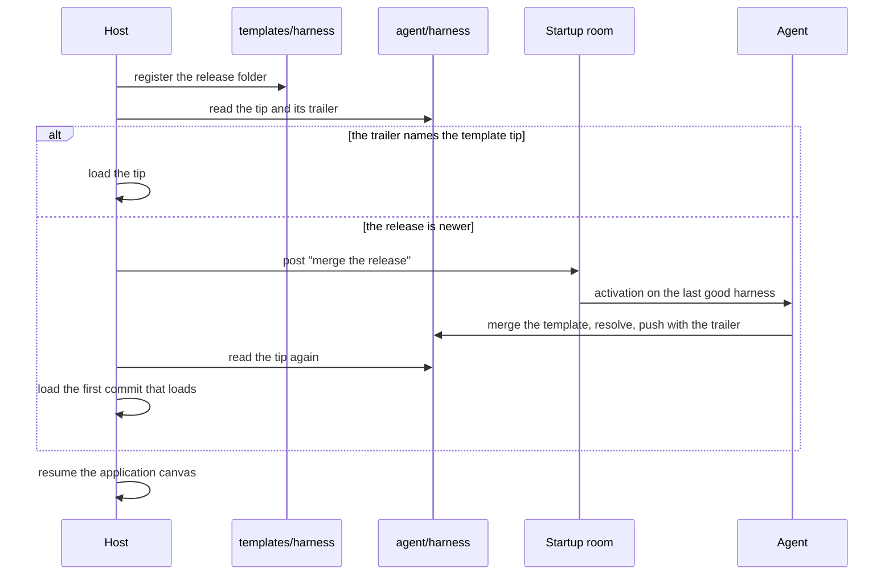

# Git for everything

**This page is a design. No package implements it yet.** It describes how
an application keeps the harness of its agents in git, how each agent
edits its own harness, and how the agents merge a new release at startup.
Each section names what exists today and what a host must add.

**The harness is everything that shapes how an agent works.** It is the
instructions and identity text, the skills, the macros of each skill, and
their scripts and references. A git repository holds it, and the host
loads it at one commit at startup. A restart is the reload.

## Decisions

- **Each agent can edit every part of its own harness.** Its prompts,
  instructions, skills, and macros are files in a repository that the
  agent owns. The agent changes them with ordinary git.
- **Tools and credentials stay in host code.** No agent edits them. An
  edit can change how an agent works, and never what it can touch.
- **An edit takes effect at the next restart.** The definition set is
  fixed for each run, so a running room never changes under an agent.
- **The agents merge a new release at startup.** When the source of the
  harness is newer than an agent's harness, that agent merges the release
  into its own repository and resolves the conflicts.
- **The source repository stays the one truth.** A developer recovers the
  edits of each agent and folds them into the source for the next release.

## What the harness holds

| In the harness repository                         | In host code, not editable |
| ------------------------------------------------- | -------------------------- |
| `agents/<name>/instructions.md`, the instructions | Tools and tool bundles     |
| `agents/<name>/identity.md`, the identity         | Credentials                |
| `skills/<skill>/SKILL.md`, the skill text         | Models and executors       |
| `skills/<skill>/macros/<name>.js`, the macros     | Limits and the roster      |
| `skills/<skill>/` scripts and references          | The canvas and its rooms   |

**The folder layout is a convention of the host.** `defineAgent` takes
strings and a skill set. The host reads the files and builds each
definition, so the layout adds no stored format.

**A macro cannot widen what an agent can touch.** A macro binds only the
tools in its `uses`, and each must be a tool of the seat
([Macros](macros.md)). An edited macro chains the same tools in another
order.

## The repositories

**Two kinds of repository use the git backend as it is
([Git](git.md)).**

| Repository          | Holds                                    | Who writes                |
| ------------------- | ---------------------------------------- | ------------------------- |
| `templates/harness` | The current release of the harness       | The host, by registration |
| `<agent>/harness`   | The harness of one agent, with its edits | That agent alone          |

**`templates/harness` is the release channel.** The host registers it
from the harness folder of the release. A changed folder fast-forwards
the template to a new commit, and an equal folder writes nothing
([Templates](git.md#templates)). No agent can push to it.

**`<agent>/harness` is a fork of the template.** The host prepares it
before the first activation with `git.use(agent, (env) =>
env.fork('templates/harness', 'harness'))`. A fork shares the history of
the template, so a later merge of a new release has a common base.

**Each agent loads its definition from its own fork.** An edit to a
shared skill changes the copy of one agent. Text that one agent writes
never enters the prompt of another agent. A macro that one agent writes
runs only under the tools of that agent.

## Edit the harness

**An agent edits its harness like any other repository.** It clones its
fork, edits a file, commits, and pushes. The guidance of the agent states
three rules:

1. Push each edit. On `memoryBackend`, a commit that is not pushed is
   lost at a restart ([Persistence](git.md#persistence)).
2. Give the reason in the commit message, and cite the exchange that
   showed the need with a commit ref or a message ref.
3. Expect the edit to take effect at the next restart.

**The copy in `~/.skills` is not the harness.** An edit of that copy
changes nothing that runs, and the copy step can restore it
([Skills](skills.md#the-copy-in-the-home)). The fork is the place for an
edit that must last.

## Startup



**The host detects a lagging fork from a trailer.** Each merge commit of
an agent ends with the line `Release: <template commit>`. The release of
a fork is the commit that the latest trailer names, or the template
commit that the fork came from. The host walks the first parents of the
tip with `show` to find it, and compares it with the tip of the
template.

**The agents merge in a startup room.** The host opens a second canvas,
`harness`, on the same canvas store. Its one root room seats each agent
whose fork lags. Each agent runs on its last good harness, so the agent
that resolves a conflict has the instructions under which it made the
edit.

**Each agent merges its own fork.** It fetches `templates/harness`,
merges it, and resolves each conflict with its commit messages and the
exchanges they cite. It checks that each skill still loads, then pushes
with the trailer. Agents that edited the same shared skill can talk in
the room before they push.

**The host loads the first rung that loads, for each agent.**

1. The merged tip of the fork.
2. The last commit that loaded for that agent.
3. The release folder.

**The last good commit can fail on new host code.** A macro can name a
tool that the release removed, and `loadSkills` or `defineAgent` then
refuses it. The release folder always loads, because the developer tested
it with that host code.

**A merge that fails is kept.** On a deadline or an `exhausted` exchange,
the host loads the next rung for that agent and posts the outcome to the
startup room. The fork keeps what the agent pushed, and the agent
continues at the next restart. The startup room is the record of each
merge.

**Restart at a quiet canvas.** `resume` gives every room its new
definitions at once, breakout rooms included ([Canvas](canvas.md)). A
breakout row whose definition is gone stays `running`, so the release
keeps each agent name.

## Record the version

**The trace records which harness ran.** The host wraps its
`TraceLogger` and adds the loaded commit of the seat and the release to
each step. A step already names the room, the seat, the activation, and
the exchange ([Executors](executors.md)). The host stores the trace,
because a restart keeps none.

**The host keeps one run log entry for each run.** The entry holds the
release, and for each agent the loaded commit, the rung, and the reason.

**The journal holds nothing new.** It stays the record of what the room
decided.

## Fold the edits back into the source

**The fold is a three-way apply onto the release tag.** The commits of
`templates/harness` come from registration, so the source repository does
not hold them. The tree of the template commit equals the release folder
byte for byte, so it is an exact base:

```sh
git checkout -b harvest/<agent> v<release>
git diff <template commit> <agent tip> | git apply -3 --directory=harness
```

**The developer folds one agent at a time.** Two agents that edited the
same shared skill give two branches. The developer merges them in the
source repository and picks one text for the next release.

**The host exports each fork.** On a workstation, the developer fetches
over SSH. With `justGitBackend`, the server runs in the host's process,
so a host script clones each fork and writes a git bundle.

## Trust

| Attempt                                       | Result                                       |
| --------------------------------------------- | -------------------------------------------- |
| Edit its own instructions, skills, or macros  | Allowed; takes effect at the next restart    |
| Push to another agent's harness               | Refused: no write credential                 |
| Push to `templates/harness`                   | Refused: read-only                           |
| Change a tool or a credential                 | Not possible: host code                      |
| Delete every file of its harness              | Allowed; the host loads the last good commit |
| Write text that enters another agent's prompt | Not possible: each agent loads its own fork  |

**Use this design in a room of trusted agents.** An agent rewrites its own
instructions, so a prompt injection that reaches an agent can persist
through its harness. A room open to untrusted agents loads the release
folder alone ([Trust](trust.md)).

## What a host must add

| Piece                                           | State                               |
| ----------------------------------------------- | ----------------------------------- |
| Register `templates/harness`, fork it per agent | Works today                         |
| Load a definition from a checkout of a fork     | Works today: clone, `fromDirectory` |
| Read the files of a commit from the host        | Missing: `GitEnv` has no file read  |
| The trailer check, the startup room, the rungs  | Missing: host code                  |
| The trace stamp and the run log                 | Missing: host code                  |
| The export of each fork for the developer       | Missing: a host script              |

**No kernel change is needed.** Each missing piece is host code or an
additive method of `GitEnv`.
