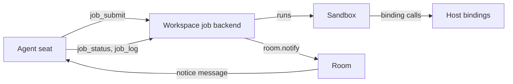
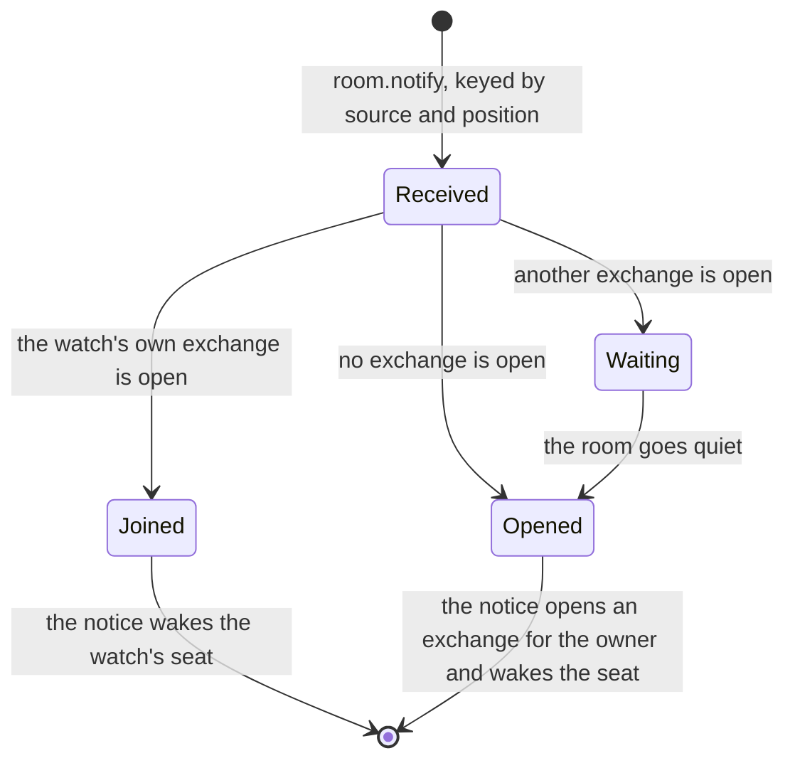
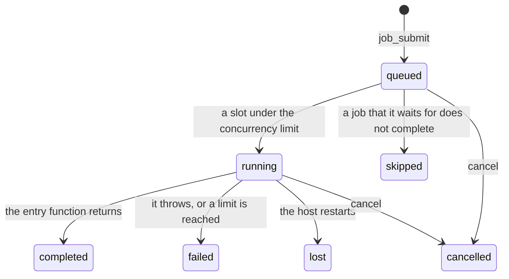
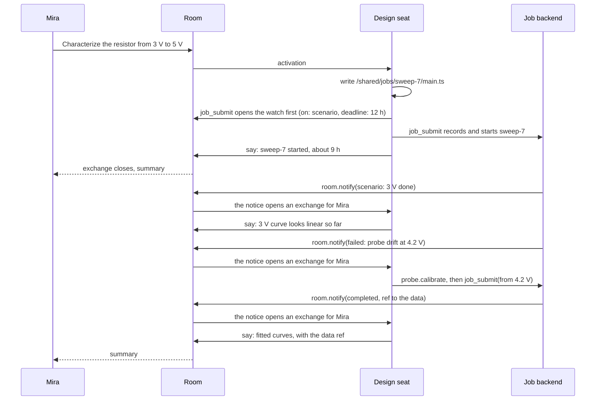

# Jobs

**This page is a design contract for pending work. No part of it is
implemented.** It states what a job is, how an agent follows one, and how
a job's news reaches the room. Read [exchange.md](exchange.md),
[roster.md](roster.md), and [workspace.md](workspace.md) first.

**A job is a program that an agent writes and the workspace runs for as
long as the work takes.** The agent reads the job's state whenever it
works. When the job has news, the room turns the news into a message, and
the message wakes the agent that asked to hear it.

## 1. The problem

**Some work outlasts every span the room has.** A parameter sweep sets a
supply voltage, waits for a resistor to settle, samples a probe, and
repeats. It runs over several scenarios, starting points, and repetitions,
and takes hours.

| Scale           | Work in the sweep                                       | Who decides |
| --------------- | ------------------------------------------------------- | ----------- |
| Milliseconds    | Sample the probe; stop on an over-temperature limit     | A binding   |
| Seconds–minutes | Settle each point; cool down between repetitions        | The program |
| Hours–days      | Design the grid; handle a fault; refine; fit the curves | Agents      |

**Three facts decide the design.**

1. **An activation is bounded.** `limits.lease.deadline` ends it after
   600,000 ms by default ([envelope.md](envelope.md)). A model must not
   hold a lease while an instrument settles.
2. **A control loop must be deterministic.** A model is neither fast nor
   repeatable. Code is both, once it is written.
3. **Judgement is rare and expensive, and waiting is common and free.** An
   agent must run when the work needs a decision, and at no other time.

## 2. The model

**Three layers, each with one owner and one direction.**

| Layer      | What it is                                                | Owner                 | Direction                   |
| ---------- | --------------------------------------------------------- | --------------------- | --------------------------- |
| The job    | A program that runs in a sandbox and ends with an outcome | The workspace         | —                           |
| Monitoring | Tools that read a job's state and its log                 | The workspace         | Pull, by an agent at work   |
| Attention  | A watch that turns a job's notice into an activation      | The room (the kernel) | Push, with no agent at work |



**A notice is what a watched source tells the room.** It has a name, a
short text, and refs. A job sends a notice when it ends, and the program
sends one when it reaches a point that needs judgement.

**A watch is the room's record that a seat wants a source's notices.** It
names the source by its handle, the seat that receives the notices, and
the person who owns them. It is the hook that turns a notice into an
activation.

**The room and the workspace share only handles.** The room never reads
the job store, and the workspace never reads the journal. A handle is an
`ambion:` URI, and a message can cite it as a ref.

## 3. Typical use

**An agent chooses one of two lifetimes when it submits a job.**

- **Held.** The exchange stays open until the job ends. A person who asked
  a question gets one answer that covers the job. Use it for work of
  minutes.
- **Released.** The exchange closes when no work of it is live. The room
  is free for other questions. A later notice opens an exchange of its own.
  Use it for work of hours.



**A held watch always joins.** Its exchange cannot close while the watch
is open, so its notices always find that exchange.

**A released watch opens a new exchange for each notice.** The owner of
the new exchange is the owner of the watch, and the summary goes to that
person. A notice that arrives while another person's exchange is open
waits, so an exchange never mixes unrelated work.

## 4. The rules

1. **No activation waits for a job.** A job runs with no lease and no model.
2. **A job runs its snapshot.** An edit to the program after the submit
   does not change a job that runs.
3. **A program reaches the world only through its bindings.** It reads its
   own snapshot, and it has no network, no environment, no other file, and
   no child process.
4. **Safety lives in the bindings.** A binding enforces its limits on every
   call. A wrong program cannot exceed its bindings.
5. **A notice is a message.** It routes, wakes, and steers by the rules of
   [roster.md](roster.md) and [delivery](durability.md), as any message
   does.
6. **A notice lands once.** Its key is the source's handle and the
   notice's position in the source.
7. **Every watch ends.** A terminal notice ends it, `cancel` ends it, or its
   deadline sends the room's own terminal notice.
8. **Every watch has an owner.** The owner is the person whose exchange was
   open when the watch opened.
9. **An exchange holds only the work of its owner.** A notice for another
   owner waits for a quiet room.

## 5. The job

### 5.1 The program

**A program is a module tree under one directory in the workspace.** The
agent writes it with the ordinary `write` and `edit` tools. The entry file
exports one default function that takes the job's input. The language is
TypeScript or JavaScript, and a module imports only modules of its own
tree and `ambion:job`.

```ts
// /shared/jobs/sweep-7/main.ts, written by the design seat.
import { bench, files, job, probe } from 'ambion:job';

export default async function run(input: { volts: number[]; reps: number }) {
  const data = '/shared/sweep-7/data.csv';
  await files.write(data, 'volts,rep,celsius\n');
  for (const volts of input.volts) {
    for (let rep = 1; rep <= input.reps; rep++) {
      await bench.set({ volts });
      const reading = await probe.settle({ tolerance: 0.05 });
      if (reading.drift) throw new Error(`Probe drift at ${volts} V, repetition ${rep}`);
      await files.append(data, `${volts},${rep},${reading.celsius}\n`);
      job.status(`${volts} V, repetition ${rep} of ${input.reps}`);
      await bench.cooldown({ celsius: 25 });
    }
    await job.notice('scenario', { text: `${volts} V done`, refs: [`file:${data}`] });
  }
  return { points: input.volts.length * input.reps, data };
}
```

**`ambion:job` holds the bindings and two calls of the job itself.**
`job.status(line)` sets the status line that `job_status` reads.
`job.notice(name, { text, refs })` sends a notice to the room. The
submit's watch decides whether that name wakes anyone.

**The submit takes a snapshot.** The backend reads the tree as the
submitting agent and stores the files and their SHA-256 hash. The job, its
handle, and its status cite the hash. A person can read the exact code
that ran.

### 5.2 Bindings

**A binding is a tool that the application marks as bindable.** It keeps
its name, schema, description, and `execute`, and the program calls it as
an async function. The workspace adds `files.read`, `files.write`, and
`files.append`, and `sql` when it has a SQL backend.

**The host executes every binding.** A call leaves the sandbox as an RPC.
The host runs `execute` with a `ToolContext` that holds the submitting
agent, the room, the exchange, and the job's handle. A credential stays on
the host.

**Every binding call lands in the job store before it runs.** The entry
holds the call's key: the job's handle and the call's position. A refused
append stops the sandbox, so a host that lost the store's fence runs no
binding. A binding with an external effect is idempotent under the key.

**Safety lives in the binding.** `bench.set` refuses a voltage outside the
envelope that the owner approved, as `operate` refuses a setpoint above its
limit today ([example.md](example.md)). An interlock runs in the binding's
host, next to the instrument.

### 5.3 The runtime

**A job backend is a kind of workspace backend.** `openWorkspace` takes it
under the key `jobs`, beside `bash` and `sql`, with its own resource owner.

```ts
// Proposed shape. Not implemented.
const lab = openWorkspace({
  name: 'lab',
  backend: {
    bash: directoryBackend(root),
    sql: sqliteBackend({ path: 'lab.db' }),
    jobs: processJobs({ deno: '/usr/bin/deno', store, bindings: [bench, probe] }),
  },
});
lab.jobs.attach(room);
```

**`processJobs` runs each job in its own Deno process.** It writes the
snapshot, a boot module, and an import map to a private directory. It
grants `--allow-read` on that directory and no other permission, and it
passes `--no-remote`, `--no-npm`, `--no-config`, and a memory flag. The
boot module sends `console` to standard error. Binding calls and results
cross standard input and standard output as lines of JSON.

**One host runs every job of a workspace.** The job store is a journal
from `@ambionframework/journal`, fenced to one writer. A new run of the
store ends each job that was running as `lost`. A Durable Object cannot
start a Deno process, so jobs need a Node host. The room can run anywhere
that the host reaches.



| Limit         | What it bounds                                 | Owner             |
| ------------- | ---------------------------------------------- | ----------------- |
| `cpu`         | CPU time of one sandbox                        | The backend       |
| `memory`      | Memory of one sandbox                          | The backend       |
| `wall`        | Time from the submit to the end                | The neutral layer |
| `calls`       | Binding calls of one job                       | The neutral layer |
| `output`      | Bytes of the log and of the return value       | The neutral layer |
| `concurrency` | Running jobs for each agent and each workspace | The neutral layer |

### 5.4 The job store is the outbox

**Each notice of a job gets a position in the job store.** The backend
writes the notice there first, then calls `room.notify` with the key. An
answer from the room marks the notice as delivered. A restart sends every
notice that has no mark again, and the key drops a duplicate in the room.

**The backend writes the terminal notice.** Its name is the job's outcome:
`completed` with the return value, `failed` or `lost` with the reason and
the end of the log, `skipped` with the job that did not complete, or
`cancelled` with who cancelled it.

## 6. Monitoring

**An agent at work reads a job whenever it needs to.** These are workspace
tools. None of them wakes anyone.

| Tool         | Arguments                                         | What it gives                                                     |
| ------------ | ------------------------------------------------- | ----------------------------------------------------------------- |
| `job_submit` | entry path, input, limits, `after`, watch options | The job's handle and hash; see §7.1 for the watch                 |
| `job_status` | job handle (optional)                             | The phase, status line, outcome, return value, and recent notices |
| `job_log`    | job handle, number of lines                       | The end of the job's log                                          |

**The room tool `cancel` stops a job.** It takes the job's handle. The
workspace registers the `job` handle kind with the function that cancels
it, so the kernel needs no job tool. The same tool ends a watch
(§7.4).

## 7. Attention

**This part is kernel work.** The kernel knows handles, watches, and
notices. It knows no jobs, so a timer or another room can be a source of
notices under the same contract.

### 7.1 Opening a watch

**A tool opens a watch through `ToolContext`.** The driver adds
`ctx.watch(source, options)`, and it commits over the same path as `say`.
`job_submit` calls it before it records the job and starts it, so no
notice can arrive before its watch. A crash between the two leaves a watch
with no job, and its deadline tells the owner.

**Only an activation that answers a message opens a watch, while an
exchange is open.** The room takes the seat from the activation and the
owner from the open exchange. No caller names either.

**`job_submit` always opens a watch.** No job runs with no person to tell.
The room tool `watch(source, options)` opens another watch on a source that
already runs, for example after a deadline. A watch receives only the
notices that arrive after it opens, and `job_status` reads the rest.

| Option     | Meaning                                                              | Proposed default |
| ---------- | -------------------------------------------------------------------- | ---------------- |
| `on`       | The names of the notices that wake a seat, besides a terminal notice | none             |
| `hold`     | The watch's exchange stays open until the watch ends                 | `false`          |
| `deadline` | The time by which a terminal notice must arrive                      | 24 hours         |
| `cap`      | The most notices that the watch delivers before its terminal notice  | 10               |

**The watch answers with its handle.** It is
`ambion://room/<room>/watch/<seq>`, where `seq` is the position of the
`watch opened` entry.

### 7.2 Receiving a notice

**A source delivers a notice through the host call `room.notify`.** The
call takes the source's handle, the key, the name, the text, the refs, and
whether the notice ends the source. The room answers `received`,
`duplicate`, or `unwatched`.

**The room records a notice on arrival and places it later.** The host call
appends `notice received`. The reconcile pass writes the `notice` message
when the placement rule of §3 allows it, as it writes every other owed
work. A crash between the two leaves an owed notice, and the next pass
places it.

**A watch filters its notices.** A terminal notice always passes. Another
notice passes when `on` names it and the watch has delivered fewer than
`cap` notices. The room answers `unwatched` for the rest, and the job
store keeps them for `job_status`.

**Notices keep their order.** The pass places the received notices of one
watch in the order they arrived. When the room goes quiet, it places every
waiting notice of the oldest watch together: the first opens the exchange,
and the rest join it.

### 7.3 The notice message

**A `notice` message has no author.** It carries the watch's handle, the
source's handle, the name, the text, and the refs. It is directed to the
watch's seat, and it wakes that seat at any attention, because the seat
asked for it. When the seat has left the roster, the notice is undirected
and wakes seats by attention.

**A seat at work is steered.** A notice that reaches a seat whose
activation runs enters that activation between provider requests, as
[durability.md](durability.md) states for any message. So a burst of
notices costs one activation. A watch places at most `cap` notices and one
terminal notice.

**A notice caused by a seat does not wake that seat.** A `cancelled` notice
names the seat that cancelled, and routing treats that seat as its author.

### 7.4 Ending a watch

**A watch ends in one of three ways.**

| End               | Written by                    | Record                                                        |
| ----------------- | ----------------------------- | ------------------------------------------------------------- |
| A terminal notice | the source                    | The placed `notice` message                                   |
| `cancel`          | a seat, a person, or the host | `watch ended`, with who cancelled                             |
| The deadline      | the reconcile pass            | `notice received` from the room, named `expired`, then placed |

**The deadline is a notice from the room.** The pass writes it as a
terminal notice with the room as its source, and places it as any other.
A job whose host never returns reaches its owner this way. The job can
still run: the seat reads it with `job_status`, cancels it, or opens a new
watch on it.

**A held watch is live work.** `exchangeLive` counts an open watch with
`hold`, so the exchange stays open. When the terminal notice lands, it
wakes the seat, and the exchange closes when the room goes quiet again.

**The close of an exchange ends no released watch.** A released watch lives
on in the record until one of its three ends. `room.abort()` ends every
held watch of the exchange that it closes.

**The journal's `cancel` entry becomes `abort`.** The room tool `cancel`
ends one handle. `room.abort()` ends an exchange. The rename gives each
word one meaning.

### 7.5 What the journal records

| Entry             | Written by                 | Holds                                                                                     |
| ----------------- | -------------------------- | ----------------------------------------------------------------------------------------- |
| `watch opened`    | an activation              | the source, the seat, the owner, the exchange `from`, `on`, `hold`, the deadline, the cap |
| `notice received` | the host call, or the pass | the source, the key, the name, the text, the refs, whether it ends the source             |
| message `notice`  | the reconcile pass         | the watch, the source, the name, the text, the refs, the addressed seat, `wakes`          |
| `watch ended`     | a `cancel`                 | who cancelled                                                                             |

**The changes raise the journal format to 2.** Two entry kinds, one
message kind, the rename of `cancel` to `abort`, and a second way to open
an exchange change the journal. The changelog names each one. A reader of
format 1 refuses format 2.

**The opening rule gains one case.** A person's question opens an exchange
for that person. A notice placed in a quiet room opens an exchange for its
watch's owner. Only these two open an exchange.

### 7.6 The rules to verify

**These rules decide writes, so they go in `room/rules.verified.ts`.**

| Rule              | What it decides                                                           |
| ----------------- | ------------------------------------------------------------------------- |
| `watchStep`       | The watch after one entry or message; an ended watch never changes        |
| `admitsNotice`    | An open watch, a fresh or repeated key, the filter, and the cap           |
| `placement`       | Join, open, or wait, from the watch's exchange and the open exchange      |
| `openingQuestion` | Extended: a notice placed in a quiet room opens an exchange for the owner |
| `exchangeLive`    | Extended: an open held watch is live work                                 |

## 8. Chains of jobs

**`after` sequences jobs in code.** `job_submit` takes a list of job
handles. The backend holds the new job until every job in the list
completes. When one of them does not complete, the backend ends the new
job as `skipped` and names the job that did not complete.

**An agent watches the last job of a chain.** A failure anywhere reaches
the last job as `skipped`, with its cause. So one watch on the last job
hears the end of the chain, and the failure that stopped it.

**An agent decides between steps with one watch for each step.** The agent
submits a step with a watch. The step's terminal notice wakes the agent.
The agent reads the results and submits the next step with a new watch.
With `hold`, the exchange never goes quiet between steps, because the woken
activation is live work while it submits.

## 9. The sweep, end to end



1. **Plan.** Mira asks the room. The agents design the grid, and Mira
   approves the voltage envelope as an `operations` row.
2. **Submit.** The design seat writes the program and submits it, released,
   with `scenario` in `on`. The exchange closes, and the room is free.
3. **Milestone.** Each scenario sends a notice. In a quiet room it opens a
   short exchange for Mira, and the seat reports the partial curve.
4. **Fault.** The probe drifts, and the program throws. The `failed` notice
   opens an exchange. The seat recalibrates through its own tool and
   submits a job for the rest of the grid, with a new watch.
5. **End.** The `completed` notice opens an exchange. The seat fits the
   curves, and Mira reads the summary.

**The same job, held.** A ten-minute calibration run submits with `hold`.
The exchange waits with nothing running, the terminal notice joins it, and
Mira gets one answer.

## 10. Decisions

| Decision                                          | Declined option                          | Reason                                                                    |
| ------------------------------------------------- | ---------------------------------------- | ------------------------------------------------------------------------- |
| A job's news is a message                         | A second wake path in the kernel         | Routing, attention, steering, and summaries already exist for messages    |
| The source pushes each notice                     | The room polls the job                   | No check runs while nothing happens, and the kernel reads no job store    |
| One option, `hold`, sets the lifetime             | One mechanism for each lifetime          | A held watch and a released watch share every other rule                  |
| The deadline is a notice from the room            | A separate expiry path                   | The owner learns of a silent source by the path that carries every notice |
| The watch opens before the job starts             | A watch after the submit                 | No notice can arrive before its watch                                     |
| A released notice waits for a quiet room          | It joins the open exchange               | An exchange holds only the work of its owner                              |
| A watch has an owner                              | A notice with no person to answer for it | Each exchange that a notice opens has an owner and a summary              |
| `after` in the job layer, and a watch on the tail | A pipeline object in the kernel          | Code sequences the chain, and `skipped` carries the cause to the tail     |
| The room and the workspace share only handles     | A job concept in the kernel              | The kernel owns participants and the room                                 |
| Every binding call lands in the store first       | Calls outside the record                 | A host that lost the fence runs no binding                                |
| A Deno process on one host                        | A sandbox in the host process            | A process boundary, with one writer for the job store                     |

## 11. Later

- **Durable replay.** The store records each binding result, and a resumed
  program replays them. It brings `job.ask` and `job.sleep`, so a job can
  wait for an answer with no sandbox.
- **More sources.** A timer and another room send notices through the same
  host call to a watch.
- **More sandboxes.** Cloudflare Dynamic Workers, QuickJS for tests, and
  Python.
- **Runners on other hosts.** A job store with a shared queue lets several
  hosts claim jobs.

## 12. Open questions

1. **Starvation.** A room that never goes quiet never places a released
   notice. Decide whether a bound on the wait places it at the next close,
   ahead of a person's next question.
2. **Approval of a program.** Decide whether a binding can require the
   owner's approval of the program's hash before its first call.
3. **Defaults.** Measure the deadline, the cap, and the limits against the
   workbench sweep before they become defaults.
