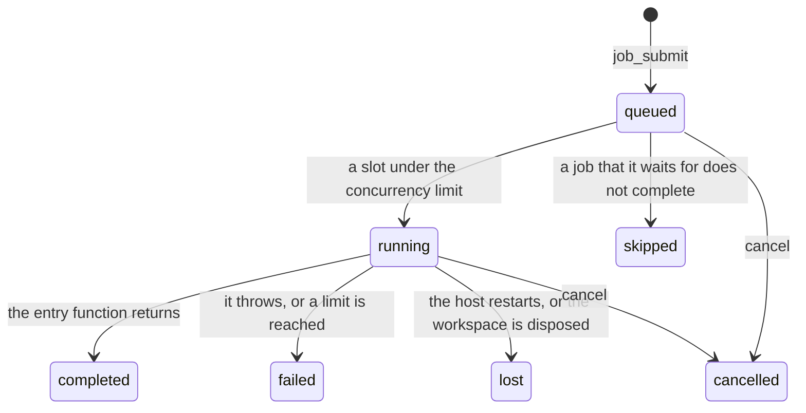
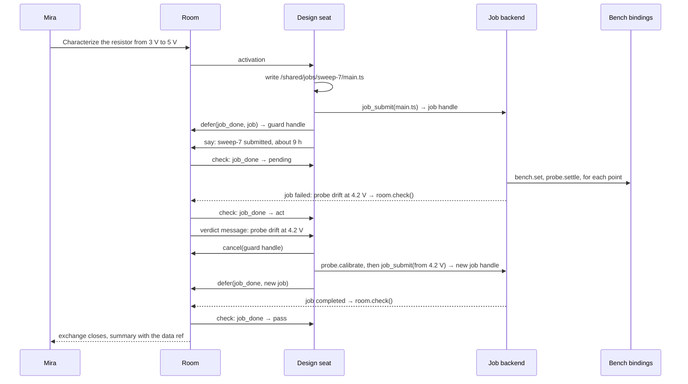

# Jobs: asynchronous Code Mode

**This page is a design contract for pending work. No part of it is
implemented.** It states what a job is, which package owns each part, the
rules each part keeps, and the technical decisions behind them.
The [backlog](../planning/backlog.md#030-jobs-and-guards) holds the
schedule for 0.3.0. Read
[workspace.md](workspace.md), [exchange.md](exchange.md), and
[durability.md](durability.md) first.

**A job is a program that an agent writes to the workspace and submits by
its path.** A generic runtime executes the program in a sandbox, after the
activation that submitted it has ended. The program reaches the world only
through bindings: capabilities that the application grants, with the same
schemas as the agent's tools. The exchange waits for the job through a
guard, and the guard wakes an agent when the job needs judgement.

## 0. What 0.3.0 builds

**0.3.0 builds the first slice.** A section or a row marked **Later** is
design only. The [backlog](../planning/backlog.md) holds the 0.3.0 scope
and states the condition that brings each later part into a release.

**A job lives inside the exchange that submits it.** The exchange waits for
the job through a guard, and a pipeline of dependent jobs runs inside the
same exchange. Work that comes back to a quiet room arrives with the notice
of 0.4.0, and this page does not use it.

**Guards run on every placement.** Jobs need a Node host that runs both the
room and the workspace. A Durable Object cannot start a Deno process, and
a check in a Durable Object cannot reach a job store on another host.

| Part                 | 0.3.0                                                  | Later                                                  |
| -------------------- | ------------------------------------------------------ | ------------------------------------------------------ |
| Guards               | `defer`, handles, `cancel`, check activations, `unmet` | Deferred actions                                       |
| Job backends         | `processJobs`: one Deno process for each job, on Node  | Cloudflare Dynamic Workers, QuickJS, Python            |
| Runs                 | One sandbox run for each job, on the workspace host    | Durable replay, `job.ask`, `job.sleep`, remote runners |
| Tools                | `job_submit`, `job_status`, `job_seal`, `job_done`     | `job_answer`, `job_log`, binding narrowing             |
| Pipelines            | `after`, pipeline handles, `job_seal`                  | Pipelines across exchanges                             |
| The API for programs | The bindings, listed in the tool guidance              | A generated `/jobs/api.d.ts`                           |

## 1. The problem

**Some work outlasts every span the room has.** A parameter sweep sets a
supply voltage, waits for a resistor to settle, samples a probe, and
repeats. It runs over several scenarios, starting points, and repetitions,
and takes hours.

| Scale           | Work in the sweep                                       | Who decides |
| --------------- | ------------------------------------------------------- | ----------- |
| Milliseconds    | Sample the probe; stop on an over-temperature limit     | A binding   |
| Seconds–minutes | Settle each point; cool down between repetitions        | The program |
| Hours–days      | Design the grid; handle a fault; refine; fit the curves | Agents      |

**Three facts decide the design.**

1. **An activation is bounded.** `limits.lease.deadline` ends it after
   600,000 ms by default ([envelope.md](envelope.md)). A model loop must not
   hold a lease while an instrument settles.
2. **A control loop must be deterministic.** A model is neither fast nor
   repeatable. Code is both, once it is written.
3. **An application must not deploy a worker for each kind of task.** The
   work changes with every question. The runtime must stay the same.

## 2. Code Mode, made asynchronous

**In Code Mode, an agent writes code against an API, and a sandbox runs
it.** The code calls the tools as functions, filters the data, and returns
a small result. Cloudflare's Code Mode and Anthropic's code execution with
MCP use this pattern inside one tool call.

**A job is the same pattern, outside the activation.**

| Property          | Code Mode in a tool call  | A job                                            |
| ----------------- | ------------------------- | ------------------------------------------------ |
| Where the code is | The tool call's arguments | A file in the workspace, cited by its path       |
| How long it runs  | Inside one activation     | Minutes to days, with no activation              |
| What it reaches   | The tools, as functions   | The bindings, as functions                       |
| How it ends       | The tool returns a value  | A guard sees the end and lets the exchange close |

**The runtime is generic, and the specialization is in two places.** The
agent writes the program for each task. The application registers the
bindings once. No worker holds code for one kind of task.

**The program is an artifact.** It is a file with provenance. A person can
read the exact code before the job runs, and after it ends.

## 3. Typical use

**An exchange with a guard moves through five states.** The diagram shows
one exchange. The job runs outside it, and the guard connects the two.

```mermaid
stateDiagram-v2
    [*] --> Working : a person's question opens the exchange
    Working --> Working : seats work; a seat submits a job and calls defer
    Working --> Checking : no live work, and a guard is due
    Working --> Closed : no live work, and no guard
    Checking --> Waiting : a verdict is pending
    Checking --> Woken : a verdict is act
    Checking --> Closed : every guard passes at the last message
    Waiting --> Checking : the next check time, or a nudge
    Waiting --> Working : a person speaks
    Woken --> Working : the verdict message wakes a seat
    Waiting --> Closed : a guard ends as unmet
    Checking --> Closed : a guard ends as unmet
    Waiting --> Closed : the last guard is cancelled
    Closed --> [*] : the summary goes to the owner
```



| State    | What runs                                         | What costs money              |
| -------- | ------------------------------------------------- | ----------------------------- |
| Working  | Response activations                              | Model calls                   |
| Checking | One check activation for each due guard, no model | Nothing                       |
| Waiting  | Nothing in the room; the job runs in its sandbox  | The sandbox's CPU             |
| Woken    | The verdict message routes to a seat              | Model calls, once it responds |
| Closed   | The summary writer, when the room has one         | One summary                   |

**Three facts make the model accurate.**

- **The room checks a guard only when the room is otherwise quiet.** While
  a seat works, no check runs.
- **Waiting is live work.** The exchange stays open, so a person who speaks
  joins it, and the seats answer with the job's context.
- **Every path ends in Closed.** A pass closes the exchange. A guard that
  ends as unmet closes it as `unmet`. `cancel` removes one guard, and the
  exchange closes when no other guard and no other work is live.
  `room.abort()` closes it from any state.

## 4. The parts

| Part        | Owner       | Meaning                                                                       |
| ----------- | ----------- | ----------------------------------------------------------------------------- |
| Program     | Agent       | A module tree in the workspace, with one entry file                           |
| Snapshot    | Workspace   | The program as it was at submit time, with its content hash                   |
| Binding     | Application | A tool that the application marks as bindable, which a program calls          |
| Job backend | Workspace   | A backend kind that runs snapshots in sandboxes and keeps the job store       |
| Job store   | Workspace   | The crash-safe record of each job's snapshot, phase, and end                  |
| Guard       | Room        | A check that the room runs before it closes an exchange                       |
| Handle      | Room        | An `ambion:` URI that names a guard, a job, or another thing an agent started |
| Verdict     | Room        | What one check answers: `pass`, `pending`, or `act`                           |

## 5. The rules

1. **No activation waits for a job.** A job runs with no lease and no model.
2. **A job runs its snapshot.** An edit to the file after the submit does
   not change a job that runs.
3. **A program reaches the world only through its bindings.** It reads its
   own snapshot, and it has no network, no environment, no other file, and
   no child process.
4. **Safety lives in the bindings.** A binding enforces its limits and its
   approvals on every call. A wrong program cannot exceed its bindings.
5. **A binding call carries the submitting agent's identity.** The binding
   decides what that identity may do, as the tool does for the agent.
6. **A program cannot speak.** `say`, `seat`, and `unseat` are never
   bindings. A job reaches the room only through a guard's verdict.
7. **Every job has limits.** Its CPU time, memory, wall time, binding
   calls, and output are bounded.
8. **The exchange waits for a job only through a guard.** An agent adds
   the guard with `defer`, and `cancel` on its handle removes it.
9. **Every guard ends.** It passes, its handle is cancelled, or it ends as
   unmet at its deadline or its attention cap.
10. **A later message makes every `pass` stale.** The room closes only on
    passes that read the last message.

## 6. The program

**A program is a module tree under one directory in the workspace.** The
agent writes it with the ordinary `write` and `edit` tools. The entry file
exports one default function that takes the job's input.

```ts
// /shared/jobs/sweep-7/main.ts, written by the design seat.
import { bench, files, job, probe } from 'ambion:job';

export default async function run(input: { volts: number[]; reps: number }) {
  const data = '/shared/sweep-7/data.csv';
  await files.write(data, 'volts,rep,celsius\n');
  for (const volts of input.volts) {
    for (let rep = 1; rep <= input.reps; rep++) {
      await bench.set({ volts });
      const reading = await probe.settle({ tolerance: 0.05 });
      if (reading.drift) throw new Error(`Probe drift at ${volts} V, repetition ${rep}`);
      await files.append(data, `${volts},${rep},${reading.celsius}\n`);
      job.status(`${volts} V, repetition ${rep} of ${input.reps}`);
      await bench.cooldown({ celsius: 25 });
    }
  }
  return { points: input.volts.length * input.reps, data };
}
```

**The language is JavaScript or TypeScript.** Deno runs TypeScript. A
module can import other modules of the same tree and `ambion:job`. It
cannot import a package, a URL, or a Deno or Node built-in module.

**The submit takes a snapshot.** The backend reads the tree through the
bash backend, as the submitting agent. It stores the files and their
SHA-256 hash in the job store. The job, its handle, and every status view
cite that hash.

**The tool guidance lists the bindings.** Each binding shows its name, its
description, and its schema. **Later:** the workspace writes the
declarations of `ambion:job` to `/jobs/api.d.ts`, and the agent reads them
as a file.

## 7. Bindings

**A binding is a tool that the application marks as bindable.** It keeps
its name, its schema, its description, and its `execute`. The program calls
it as an async function. The application passes the bindable tools to the
job backend when it opens the workspace.

| Binding source  | Examples                                           | Present when                     |
| --------------- | -------------------------------------------------- | -------------------------------- |
| The workspace   | `files.read`, `files.write`, `files.append`, `sql` | Always; `sql` with a SQL backend |
| The application | `bench.set`, `probe.settle`, `bench.cooldown`      | The application marks the tool   |
| The job itself  | `job.status`                                       | Always                           |

**`files` reaches the submitting agent's view of the workspace.** It
resolves `~` under that agent's home and writes as that agent. The audit
log records each call. `WorkspaceFiles` holds `writeFile` only today
([workspace.md](workspace.md)), so it gains a read and an append.

**The host executes every binding.** A binding call leaves the sandbox as
an RPC. The host runs the tool's `execute` with a `ToolContext` that holds
the submitting agent, the room, the submitting activation's id, the
exchange, and the job's handle. The activation id is provenance only: that
activation has ended, and nothing checks its lease. A credential stays on
the host.

**Safety lives in the binding.** `bench.set` refuses a voltage outside the
envelope that the owner approved, as `operate` refuses a setpoint above the
limit today ([example.md](example.md)). A millisecond interlock runs in the
binding's host, next to the instrument. The program runs at the scale of
seconds.

**Every binding call lands in the job store before it runs.** The host
appends a `called` entry with the call's key: the job's handle and the
call's position. Then it runs `execute` with that key. An append that the
store refuses stops the sandbox, so a host that lost the store's fence
runs no binding. A binding with an external effect should still be
idempotent under the key, because a crash after `called` and before the
effect leaves the question open.

## 8. The job backend

**A job backend is a kind of workspace backend.** `openWorkspace` takes
backends by kind ([workspace.md](workspace.md)). The job backend is the
optional key `jobs`, beside `bash` and `sql`. It has its own resource
owner, so a long `bash` command does not delay a submit. The snapshot is
one operation on the bash owner, with the same order rule as an SQL
export: a job operation may wait on the bash owner, and a bash operation
never waits on the job owner.

```ts
// Proposed shape. Not implemented.
const lab = openWorkspace({
  name: 'lab',
  backend: {
    bash: directoryBackend(root),
    sql: sqliteBackend({ path: 'lab.db' }),
    jobs: processJobs({ deno: '/usr/bin/deno', store, bindings: [bench, probe] }),
  },
});
lab.jobs.attach(room);
```

| Member                          | Meaning                                                                    |
| ------------------------------- | -------------------------------------------------------------------------- |
| `submit(snapshot, input, spec)` | Record the job and start it. The key is the tool call id                   |
| `status(handle)`                | The phase, the status line, the outcome, and the counters                  |
| `cancel(handle)`                | Abort the binding call that runs, then stop the sandbox                    |
| `attach(room)`                  | Let the backend nudge that room when one of its jobs ends                  |
| `dispose()`                     | Stop the sandboxes, end each running job as `lost`, and keep the job store |

### 8.1 The lifecycle



**In 0.3.0 one host runs every job of a workspace.** The workspace host
starts each sandbox as a child process. The job store is a journal fenced
to one writer ([durability.md](durability.md)). **Later:** a backend with a
shared durable queue, such as Absurd over Postgres, lets runners on other
machines claim jobs.

**A new run of the store ends every job that ran as `lost`.** The store
holds `started` entries with no `ended` entry. The new host writes `ended`
with the outcome `lost` for each. A sandbox of the old host that still
runs has its next `called` append refused, and stops. The guard then
answers `act`, and an agent decides.

**`cancel` aborts a binding call in flight.** The host aborts the call's
`ToolContext.signal`, records the job as cancelled, and stops the sandbox.
A binding that ignores its signal keeps its effect.

**The backend nudges the room.** When a job ends, the backend calls
`room.check()` on the attached room of the job's provenance. A job whose
room is not attached waits for the next check time. On Cloudflare the host
calls the same method over `RoomObject` RPC.

### 8.2 The sandbox

**`processJobs` runs each job in its own Deno process.** The host writes
the snapshot to a private directory, with a boot module and an import map
beside it. Then it starts `deno run` with these flags and no others:

| Flag                                       | Why                                                           |
| ------------------------------------------ | ------------------------------------------------------------- |
| `--allow-read=<snapshot dir>`              | The program reads its own modules and nothing else            |
| `--import-map=<map>`                       | `ambion:job` resolves to the boot module's binding shim       |
| `--no-remote`, `--no-npm`                  | The program imports no URL and no package                     |
| `--no-config`                              | Deno ignores a `deno.json` that the agent wrote into the tree |
| `--v8-flags=--max-old-space-size=<memory>` | The `memory` limit                                            |

**Every other permission stays off.** The flags grant no network, no
environment, no write, no child process, no FFI, and no system data. The
host pins the Deno version, because a flag can change between versions.

**The boot module owns the process's streams.** It rebinds `console` to
standard error, imports the entry module, and calls its default function.

| Channel  | What crosses it                                           |
| -------- | --------------------------------------------------------- |
| `stdin`  | The input, and each binding result, as lines of JSON      |
| `stdout` | Each binding call, and the return value, as lines of JSON |
| `stderr` | The program's log, bounded by the `output` limit          |

**The host enforces `cpu` and `wall` from outside.** It reads the child's
CPU time and stops the process at a limit.

**`jobConformance` checks the contract on every backend.** Its cases try
the network, a file outside the snapshot, an environment variable, a write,
a child process, a URL import, and a package import, and each must fail.
They also check each limit and each end of the lifecycle.

**What the sandbox does not defend.** A program that the agent wrote wrong
still calls its bindings wrong, inside their limits. A binding with a
defect is a defect of the application. A prompt injection can steer the
agent to write a hostile program, and the bindings and the limits contain
it. [trust.md](trust.md) gets a row for each point.

### 8.3 Limits

| Limit         | What it bounds                                 | Owner             |
| ------------- | ---------------------------------------------- | ----------------- |
| `cpu`         | CPU time of one sandbox                        | The backend       |
| `memory`      | The memory of one sandbox                      | The backend       |
| `wall`        | The time from the submit to the end of the job | The neutral layer |
| `calls`       | Binding calls of one job                       | The neutral layer |
| `output`      | Bytes of the log and of the return value       | The neutral layer |
| `concurrency` | Running jobs for each agent and each workspace | The neutral layer |

**A submit can lower a limit and cannot raise one.** The application sets
each ceiling when it opens the workspace. The neutral layer enforces its
limits from the job store, so no backend repeats them.

### 8.4 The job store

**The job store is a journal from `@ambionframework/journal`.** A
conditional append and a fenced run protect it
([durability.md](durability.md)).

| Entry       | Holds                                                                                                                                      |
| ----------- | ------------------------------------------------------------------------------------------------------------------------------------------ |
| `submitted` | The snapshot, its hash, the input, the spec, the pipeline, the jobs it waits for, the submitting agent's name and identity, the provenance |
| `started`   | The time the sandbox started                                                                                                               |
| `called`    | The binding, its key, and its arguments, before the call runs                                                                              |
| `ended`     | The outcome, the reason, the return value, and the end of the log                                                                          |
| `sealed`    | The pipeline that takes no more jobs                                                                                                       |

**The neutral layer enforces its limits from these entries.** `calls`
counts `called` entries, and `wall` reads `submitted`.

## 9. The tools

| Tool         | Arguments                                    | What it does                                                         |
| ------------ | -------------------------------------------- | -------------------------------------------------------------------- |
| `job_submit` | entry path, input, limits, pipeline, `after` | Takes the snapshot and queues the job; returns its handle and hash   |
| `job_status` | job or pipeline handle (optional)            | One job, one pipeline, or the agent's jobs, with phases and outcomes |
| `job_seal`   | pipeline handle                              | Marks the pipeline complete: it takes no more jobs                   |
| `job_done`   | job or pipeline handle                       | A checkable tool: the verdict for one job or one pipeline            |

**`job_done` maps one job's phase to a verdict.**

| Phase                               | Verdict   | Text                                          |
| ----------------------------------- | --------- | --------------------------------------------- |
| `completed`                         | `pass`    | The return value, cut short                   |
| `cancelled` by a seat of the room   | `pass`    | Who cancelled it                              |
| `queued`, `running`                 | `pending` | The status line; the next check in 300,000 ms |
| `failed`, `lost`, `skipped`         | `act`     | The reason and the end of the log             |
| `cancelled` by a person or the host | `act`     | Who cancelled it                              |

**A seat that cancels its own job is not woken for it.** The job store
records who cancelled. A cancel by a seat of the room is the seat's own
decision, so the guard passes.

**The workspace registers the `job` and `pipeline` handle kinds.** So the
room tool `cancel` ends a job, or every job of a pipeline, and no job tool
of its own does.

### 9.1 Pipelines

**A pipeline is a named group of jobs in one exchange.** `job_submit`
takes a pipeline name and a list of job handles in `after`. The backend
holds a job in `queued` until every job in its `after` list completes. When
one of them fails, is lost, is cancelled, or is skipped, the backend ends
the waiting job as `skipped`. The first job with a new name creates the
pipeline, and its handle is `ambion://workspace/<workspace>/pipeline/<name>`.

**A pipeline serves two kinds of sequence.**

- **Code sequences a chain.** The agent submits every step at once, each
  with `after` on the one before, and calls `job_seal`. The agent hears
  from the pipeline only on a failure and at the end.
- **The agent decides between steps.** The agent submits one step and does
  not seal the pipeline. When the step completes and nothing else in the
  pipeline is queued or running, the guard wakes the agent. The agent reads
  the results and submits the next step, or seals the pipeline.

**`job_done` maps a pipeline to one verdict.**

| State of the pipeline                                     | Verdict   | Text                                         |
| --------------------------------------------------------- | --------- | -------------------------------------------- |
| Sealed, and every job completed                           | `pass`    | The return value of each job, cut short      |
| A job queued or running                                   | `pending` | The status line of each running job          |
| A job failed, lost, or skipped                            | `act`     | The first failure and the end of its log     |
| Not sealed, nothing queued or running, the last step done | `act`     | The last step's return value: submit or seal |

**One guard waits for the whole pipeline.** The agent adds it once, on the
pipeline handle. Each wake between steps counts toward the guard's
attention cap, so a pipeline with many decided steps needs a cap above the
default.

## 10. Guards

**This part is kernel work.** A guard lets an exchange wait for work that
runs outside the room. The kernel knows guards, checkable tools, handles,
and verdicts. It knows no jobs.

### 10.1 Adding a guard

**An agent adds a guard with the room tool `defer`.** The tool takes the
name of a checkable tool, its arguments, a deadline, and an attention cap.
The room writes `guard added` under the activation's grant, with the
adding seat as the guard's checker. The arguments are data, and the tool
is a registered value, so the journal holds no code. `defer` answers with
the guard's handle.

**`defer` needs no fresh read.** It answers no message, so the say lock
does not apply to it.

**A checkable tool is read-only and idempotent.** Its definition holds a
typed `check(params, context)` that returns a verdict. The room calls it
many times, and again after a crash. `job_done` is checkable, and
`job_submit` never is. `AmbionTool` gains the optional `check` member.

```ts
// Proposed shape. Not implemented.
type Verdict =
  | { verdict: 'pass'; text: string; refs?: string[] }
  | { verdict: 'pending'; text: string; nextCheckMs: number }
  | { verdict: 'act'; text: string; refs?: string[] };
```

### 10.2 Handles and `cancel`

**A handle names one thing that an agent started.** It is an absolute
`ambion:` URI, and a message can cite it as a ref. `refs.ts` accepts two
new forms beside the room and message URIs:

| Handle   | Grammar                                          | Issued by       |
| -------- | ------------------------------------------------ | --------------- |
| Guard    | `ambion://room/<room>/guard/<seq>`               | The room        |
| Job      | `ambion://workspace/<workspace>/job/<id>`        | The job backend |
| Pipeline | `ambion://workspace/<workspace>/pipeline/<name>` | The job backend |

`seq` is the position of the `guard added` entry. `id` is the position of
the `submitted` entry in the job store.

**A tool bundle registers each handle kind that it issues.** `ToolBundle`
gains `handles`: a list of a kind and the function that cancels a handle
of that kind. `describeExecutor` flattens the lists into the definition,
as it flattens the tools. Each executor family's `cancel` tool reads them
from the definition: Pi through its tool binding, Codex through the tools
server's manifest, and the Cloudflare seat object through its definition.

**The room tool `cancel` takes a handle and ends what it names.** A guard
handle writes `guard ended` with the reason `cancelled`. A handle of a
registered kind calls that kind's cancel inside the activation. A handle of
an unknown kind is refused. A person or the host calls
`room.cancel(handle)` for a guard. A host ends a job through
`workspace.jobs.cancel(handle)`.

**The journal's own cancellation entry becomes `abort`.** Today the entry
kind `cancel` records the boundary that `room.abort()` writes
([durability.md](durability.md)). Format 2 renames it, so `cancel` means
one thing: end one handle. `abort` closes the exchange and ends every
guard of it.

### 10.3 Checking a guard

**A check activation evaluates one guard, with no model.** Its id is
`check:<seq>:<seat>:<attempt>`, where `seq` is the position of the guard's
last entry, so each check has a fresh id. Its grant permits one commit: a
verdict for that guard. The activation holds a lease and carries
provenance. It writes no trace, because it makes no model call.

**The record names the seat that checks.** `guard added` names the adding
seat. When that seat leaves the roster, the reconcile pass reads the
definitions on the host and writes `guard moved` to the first seat in
roster order whose definition holds the checkable tool. When no seat holds
it, the pass writes `guard ended` with the reason `unchecked`. The grant
reads the checker from the fold alone.

**The check executor wraps each family's executor.** The runner opens the
session before it knows the purpose (`execution/runner.ts`). So the
connector wraps the family's executor with one that opens the family
session only for a response purpose. For a check purpose, it calls the
tool's `check()` from the seat's definition. The Cloudflare seat object
builds its executor outside the connector, and it takes the same wrapper.

**The reconcile pass decides when a check is due.** The fold has no clock,
so the pass computes due checks and places them in the owed work. A check
is due when the exchange has no other live work and one of these holds:

- the guard has no verdict yet;
- its last verdict is `pending`, and its next check time has passed;
- a nudge made it due;
- its last verdict is `act`, and a message landed after the verdict
  message.

A guard whose last verdict is `act` is not due on its own clock. The seat
that it woke acts, speaks, or cancels the guard. So the loop of `act`,
then silence, then `act` again cannot run.

**Check leases stay out of wake coverage.** `leasesBySeat`, `statusOf`,
`liveSeats`, `LiveLease.source`, and `activationsInRange` skip a `check`
lease, as they skip a `closed` lease for a wake. A check never answers a
message, and a check that is not due holds no seat.

**A check that fails its attempts answers `act`.** The reconcile pass
writes the `verdict` message with the failure, as it writes `abandoned`
for another activation. A check that a stop revokes is owed again on
resume, and it does not count as an attempt.

| Verdict   | The room writes                            | Then                                                           |
| --------- | ------------------------------------------ | -------------------------------------------------------------- |
| `pass`    | `guard checked`, with the last message seq | The room closes when every guard passed at that seq            |
| `pending` | `guard checked`, with the next check time  | The exchange stays open, and nothing runs until the next check |
| `act`     | One `verdict` message                      | The message wakes seats, and the attention count rises         |

**An `act` verdict is one append.** The `verdict` message is the whole
record of the act, and `guardStep` reads it. A crash cannot split the
verdict from its wake. The message carries the guard's handle as its
source, the text, and the refs. It has no `from`, so it can wake the seat
that ran the check. It is directed to the seat that added the guard. When
that seat has left the roster, it is undirected and wakes seats at
`broadcast` and wider. Routing gives it the reach of speech: named when it
is directed, broadcast when it is not.

**A pending guard is live work.** `exchangeLive` counts it, so the exchange
stays open while the job runs.

### 10.4 Closing and ending

**The room closes an exchange with guards only on fresh passes.** Every
guard of the exchange must have a `pass` whose message seq is the last
message seq. A later message, the `verdict` message included, makes every
pass stale, and the room checks again.

**Every guard ends, and the record says why.**

| Reason      | Written by         | When                                                   |
| ----------- | ------------------ | ------------------------------------------------------ |
| `cancelled` | a `cancel`         | An agent, a person, or the host cancels its handle     |
| `deadline`  | the reconcile pass | The guard's deadline passes                            |
| `cap`       | the reconcile pass | The guard's `verdict` messages reach its attention cap |
| `unchecked` | the reconcile pass | No seat on the roster holds the checkable tool         |

**A guard that ends unmet closes the exchange as `unmet`.** The reasons
`deadline`, `cap`, and `unchecked` are unmet. The reconcile pass writes
`guard ended` first and the close second. The fold attributes each guard
to its exchange by the exchange's `from`, which `guard added` holds, and
never by the close's range. `unmet` ranks after `exhausted` and before
`awaiting`. A cancelled guard is not unmet.

**The exchange view lists each guard with its last verdict.** A person
reads the verdict of a `pass` there, and in the summary. A `pass` writes no
message, because a message would make every other pass stale.

**The close of an exchange ends every guard of it.** `room.abort()` closes
the exchange, so its guards end with it. A guard never outlives its
exchange.

**One room for each long task.** A pending guard keeps the room's one open
exchange open. Give a long task a room of its own, as the workbench gives
each topic a room. `limits.context.messages` bounds what a seat reads over
a long exchange ([envelope.md](envelope.md)).

**Later: deferred actions.** An idempotent tool call that the room runs
once after an exchange closes. It needs its own rule for the abort
boundary before it is designed further.

### 10.5 What the journal records

| Entry             | Written by                       | Holds                                                                            |
| ----------------- | -------------------------------- | -------------------------------------------------------------------------------- |
| `guard` `added`   | an activation                    | the seat, the tool, the arguments, the deadline, the cap, the exchange `from`    |
| `guard` `checked` | a check activation               | `pass` or `pending`, its text, the next check time, the last message seq it read |
| `guard` `moved`   | the reconcile pass               | the seat that checks from now on                                                 |
| `guard` `ended`   | a `cancel` or the reconcile pass | the reason, and who cancelled it                                                 |
| message `verdict` | a check activation, or the pass  | the guard handle, the text, the refs, the addressed seat, `wakes`                |

**Guards raise the journal format to 2.** A new entry kind, a new message
kind, a new activation source, the outcome `unmet`, and the rename of the
`cancel` entry to `abort` change the journal. The changelog names each
one. A 0.1.0 reader refuses a format-2 journal. [The
plan](../planning/next.md) makes no compatibility promise before 1.0.0, so
0.3.0 adds no reader for format 1.

**The new message kind reaches every reader of messages.** `validate.ts`
checks its body, `routing.ts` gives it its reach and its target,
`render.ts` renders its source, `room/projection.ts` advances on it, and
the workspace mirror writes it.

**A long guard costs a bounded number of entries.** At the default check
interval of 300,000 ms, a nine-hour job costs about 108 checks: one lease
entry, one end, and one `guard checked` each, and no trace. A nudge ends
the wait at once, so the interval is the fallback.

### 10.6 The rules to verify

**These rules decide writes, so they go in `room/rules.verified.ts`.**

| Rule              | What it decides                                                                        |
| ----------------- | -------------------------------------------------------------------------------------- |
| `guardStep`       | The guard after one entry or one `verdict` message; an ended guard never changes       |
| `guardEnds`       | The reason the reconcile pass ends a guard: deadline, cap, or unchecked                |
| `activationGrant` | Extended: a check grant for the seat that the fold names as the guard's checker        |
| `permits`         | Promoted from `transition.ts`: a check activation commits one verdict and nothing else |
| `admitsClose`     | Extended: every guard passed at the last message seq                                   |
| `exchangeLive`    | Extended: a pending guard is live work                                                 |
| `answers`         | Unchanged, with `check` leases kept out of its input                                   |

`exchangeOutcome` gains `unmet` in its order.

## 11. The sweep, end to end



1. **Plan.** Mira asks the room. The agents design the grid, and Mira
   approves the voltage envelope as an `operations` row.
2. **Write.** The design seat writes the program to the workspace. Mira can
   read it before the submit.
3. **Submit.** `job_submit` snapshots the program and starts the job. The
   seat adds the guard. The seat's work ends, the first check answers
   `pending`, and the exchange waits with nothing running in the room.
4. **Fault.** The probe drifts, and the program throws. The job fails, the
   backend nudges the room, and the check answers `act`. The `verdict`
   message wakes the design seat.
5. **Recover.** The seat cancels the old guard, recalibrates the probe
   through its own tool, submits a job for the rest of the grid, and adds a
   new guard.
6. **End.** The second job completes. The check answers `pass`, and the
   exchange closes. Mira gets one summary with a ref to the data.

The workbench example shows this flow with a simulated bench in a
`characterize` room.

## 12. Decisions

| Decision                                         | Declined option                                          | Reason                                                                                               |
| ------------------------------------------------ | -------------------------------------------------------- | ---------------------------------------------------------------------------------------------------- |
| The agent writes the program                     | A worker for each kind of task                           | The work changes with every question; the runtime stays the same                                     |
| The program is a file, cited by path             | Code in the tool call's arguments                        | A file has provenance, a reviewer, and a history                                                     |
| A job runs its snapshot                          | A job runs the live file                                 | An edit during a run must not change the run                                                         |
| Bindings are tools that the application marks    | A second API for programs                                | One schema, one `execute`, one provenance for the agent and its programs                             |
| Safety lives in the bindings                     | Safety in the program                                    | A binding checks every call; a program is new code every time                                        |
| The host executes every binding                  | Credentials inside the sandbox                           | A sandbox holds no secret, so a hostile program has none to leak                                     |
| A Deno process for the first sandbox             | Dynamic Workers or QuickJS first                         | A process boundary on any Node host; QuickJS has known limit gaps                                    |
| One sandbox run for each job in 0.3.0            | Durable replay now                                       | The first slice shows how far guards go before replay pays for itself                                |
| A job backend is a workspace backend kind        | A job system in the kernel                               | The kernel owns participants and the room; #277 set the pattern                                      |
| The exchange waits through a guard               | A report that opens a new exchange                       | One way to open an exchange; the owner and the summary stay the same                                 |
| A job lives inside the exchange that submits it  | A job that outlives its exchange                         | One owner, one summary, one span for the task; 0.4.0 notices serve work that returns to a quiet room |
| Pipelines in the job layer                       | Sequences only in one program, or only through the agent | `after` sequences a chain with no model; an open pipeline wakes the agent between steps              |
| A seat's own cancel passes the guard             | Every cancel answers `act`                               | A seat is not woken for a decision that it made                                                      |
| One `cancel` tool for every handle               | A cancel tool for each kind of work                      | One tool to learn, and a new kind of work registers its handle                                       |
| An `act` verdict is a message with no author     | An entry only                                            | A seat never wakes on its own message, and a person must see the verdict                             |
| The `verdict` message is the whole act record    | An entry and a message                                   | One append: a crash cannot split the verdict from its wake                                           |
| The pass writes the checker's seat to the record | The grant reads the definitions                          | The fold alone decides a grant, so a resume folds the same answer                                    |
| Every binding call lands in the store first      | Calls outside the record                                 | A host that lost the fence runs no binding                                                           |
| The `cancel` entry becomes `abort`               | One word for two meanings                                | `cancel` ends one handle; `abort` ends the exchange                                                  |
| A guard outlives the seat that added it          | End the guard when its seat leaves                       | The work goes on; seats by attention take the verdict                                                |
| A later message makes every `pass` stale         | A pass is final                                          | A person who speaks after a pass gets an answer before the close                                     |
| Every guard has a deadline and an attention cap  | A guard with no bound                                    | Unattended work spends money; `unmet` ends it                                                        |

## 13. Open questions

1. **Python.** A lab writes Python. A second language waits for a user.
2. **`bash` as a binding.** A program could run a just-bash command in the
   agent's shell. Decide whether that capability belongs to a program.
3. **Work that outlives its exchange.** A guard keeps the exchange open.
   Work that must come back to a quiet room arrives with the notice of
   0.4.0, which opens an exchange for its owner. A job could then send a
   notice at its end.
4. **Approval of a program.** Decide whether a binding can require the
   owner's approval of the program's hash before the first call.
5. **Defaults.** The proposals are an attention cap of 5 and a check
   interval of 300,000 ms. Measure them, the limits, and the guard deadline
   against the workbench sweep before they become defaults.
