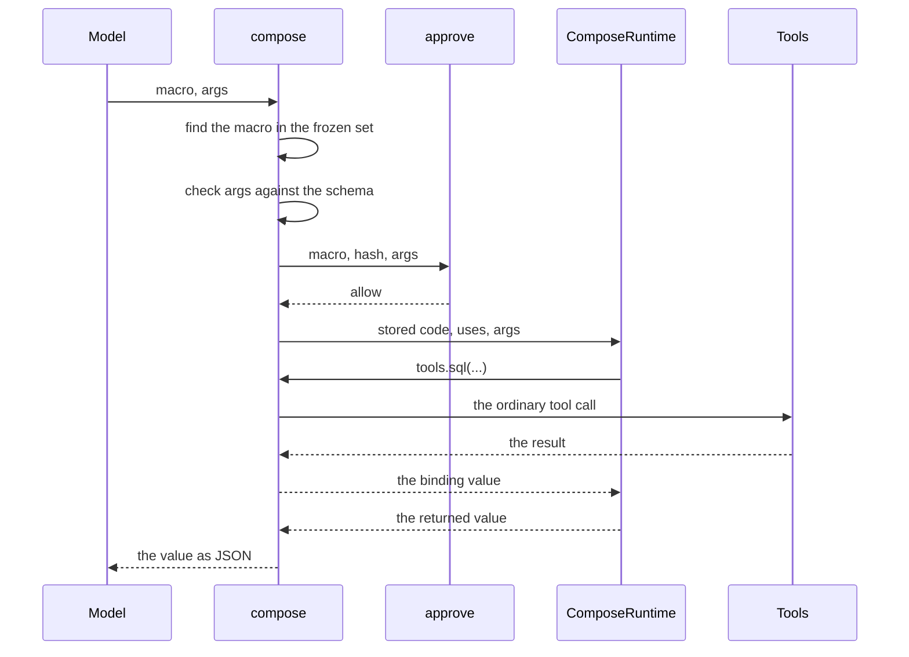

# Macros

**A macro is a compose program that a skill stores as data.** Macros are
the main use of `compose`. The model runs a macro by name with arguments.
It writes no code. The macro declares the
tools that it uses, and the room checks the arguments before anything runs.
[Compose](compose.md) holds the tool that runs it. [Skills](skills.md) holds
the folder that stores it.

**`@ambionframework/ambion` and `@ambionframework/workspace` implement this
page.**

| File                                     | Holds                                                  |
| ---------------------------------------- | ------------------------------------------------------ |
| `packages/workspace/src/skill-macros.ts` | The file format: the header, the body, and the hash    |
| `packages/workspace/src/skills.ts`       | `loadSkills`, which keeps `set.macros`                 |
| `packages/ambion/src/compose-macros.ts`  | `composeMacro`, the checks of a seat, and the guidance |
| `packages/ambion/src/compose-tool.ts`    | `compose`: resolution, approval, and the run           |

## The problem

**A model that repeats a procedure writes it again in each exchange.** Take
a lab agent that snapshots the files of every drifted run. The first
exchange teaches it the steps. The next exchange has the same steps, and
the model emits the same lines again. Each line costs output tokens, the
slowest part of an activation. Each copy can differ from the last one by a
typo or a changed query.

**A skill script repeats a procedure for the shell alone.** A script under
`scripts/` runs through `bash`. The model reads it as input tokens and runs
it. A script cannot reach `sql`, `snapshot`, or any other tool of the room,
because those tools are not shell programs.

**Compose reaches the tools, and the model still writes the code.** A
`compose` call joins several tools in one program, and the data between
them stays out of the context. The model writes that program in each
activation that needs it ([Compose](compose.md)).

## What a macro is

**A macro is the compose program, stored once and run by name.** The code
never passes through the model. The model writes the name of the macro and
its arguments. The macro runs as an ordinary compose call, with the same
steps, provenance, ledger, limits, and audit.

A skill holds a macro in a file. The file declares the tools and the
arguments of the macro, and holds the code.

```js
/*---
description: Snapshot the files of every run with a label. Returns the count and the refs.
uses: [sql, snapshot]
args:
  type: object
  properties: { label: { type: string } }
  required: [label]
---*/
const runs = await tools.sql({
  sql: 'SELECT path FROM runs WHERE label = ?',
  params: [args.label],
  rows: 500,
});
const { refs } = await tools.snapshot({ paths: runs.rows.map((row) => row.path) });
return { runs: runs.count, refs };
```

This file is `lab-drift/macros/snapshot-drift.js`. `SKILL.md` names the macro
and does not quote it. The name is `<skill>/<macro>`.

```markdown
1. Run the macro `lab-drift/snapshot-drift` with `{ "label": "drift" }`.
2. Cite the refs in your say.
```

The guidance of `compose` lists the macro with its description. The model
runs it with one call:

```js
compose({ macro: 'lab-drift/snapshot-drift', args: { label: 'drift' } });
```

The rows and the paths stay in the compose call. The model reads the
returned value alone, and then cites the refs in a `say`:

```json
{ "runs": 2, "refs": ["ambion://workspace/lab/snapshot/<sha256>/shared/a.md", "..."] }
```

## Properties

**The model writes a name and arguments.** The code is not a model output,
so it costs no output tokens and it is the same in each exchange.

**The code runs under the tools of `uses` alone.** `uses` belongs to the
file. `describeExecutor` checks it once, when the definition is made, and
the model cannot widen it. A macro binds only tools that the seat holds.
The authority is the authority of a direct call.

**The room checks the arguments twice before any tool runs.** `compose`
checks `args` against the schema of the macro, and then asks `approve`.
A mismatch fails the compose call with no ledger and no effect.

**The code is frozen at definition.** `compose` finds the macro in the
skill set of the definition and never reads `~/.skills`. An edit of the copy
does not change what runs.

**`approve` reads `{ macro, hash, args }`.** The hash is the git blob hash of
the whole file, header and body. A host can allow the hash of a file that a
person reviewed. Any change to the file gives another hash.

**A macro call is a compose call.** Each nested call is an ordinary tool
call with its schema, its checks, its provenance, and its steps. The
ledger, the limits, and the audit log apply.

**`sql` binds outside values.** The `params` field binds each value to a
`?` placeholder, so a quote in an argument cannot change the statement
([Workspace](workspace.md#query-the-shared-database)).

**One skill set fits every seat.** A definition that `describeExecutor`
builds with no `compose` option ignores the macros and lists none. The
executor packages always set the option.

## The file format

**A macro file sits in `<skill>/macros/<name>.js`.** The agentskills.io
format allows any folder in a skill, so other harnesses ignore this one.
A file in `macros/` that does not end in `.js` is a resource of the skill.

**The file opens with a YAML block comment, and then the body.** The header
lies between a `/*---` line and a `---*/` line. `loadSkills` strips the
comment marks and reads the lines with the frontmatter parser of `SKILL.md`.
The body is the body of the async function that `compose` runs, with one
more global, `args`.

**The header has three fields, and `loadSkills` refuses any other.**

| Field         | Rule                                                                      |
| ------------- | ------------------------------------------------------------------------- |
| `description` | Text that is not blank, of at most 1024 characters. The guidance shows it |
| `uses`        | A non-empty list of tool names. The macro binds these tools alone         |
| `args`        | Required. A JSON Schema object that the arguments must satisfy            |

**`loadSkills` refuses a macro file that breaks a rule.** The error starts
with `Skill set:` and names the file.

| Rule                                                                            | Refused example                  |
| ------------------------------------------------------------------------------- | -------------------------------- |
| The file is UTF-8 text that starts with a header in a `/*---` and `---*/` block | A body with no header            |
| The header is a YAML mapping with the fields above and no other field           | `when: always`                   |
| The name of the file has the rules of a skill name, before `.js`                | `Snap_Shot.js`, `a--b.js`        |
| The file sits directly in `macros/`                                             | `macros/more/one.js`             |
| `description` and `uses` follow the table above                                 | `uses: []`                       |
| `args` is JSON Schema of draft 2020-12 with the keywords that the check reads   | `type: banana`, `$ref`, `format` |

**The check of `args` refuses a keyword that `Check` ignores.** TypeBox
ignores a keyword that it does not know, so a schema with one would accept
every value. The schema must satisfy the meta-schema of draft 2020-12, and
every keyword must be in this list. The list omits `$ref`, `$defs`, `$id`,
`$anchor`, and `format`.

| Kind              | Keywords                                                                                              |
| ----------------- | ----------------------------------------------------------------------------------------------------- |
| Types and values  | `type`, `enum`, `const`, `required`, `dependentRequired`                                              |
| Numbers           | `minimum`, `maximum`, `exclusiveMinimum`, `exclusiveMaximum`, `multipleOf`                            |
| Text              | `minLength`, `maxLength`, `pattern`                                                                   |
| Lists and objects | `minItems`, `maxItems`, `uniqueItems`, `minProperties`, `maxProperties`, `minContains`, `maxContains` |
| Schemas inside    | `properties`, `patternProperties`, `additionalProperties`, `items`, `prefixItems`, `contains`         |
| Combinations      | `allOf`, `anyOf`, `oneOf`, `not`, `if`, `then`, `else`, `dependentSchemas`, `propertyNames`           |
| Open objects      | `unevaluatedProperties`, `unevaluatedItems`                                                           |
| Notes             | `title`, `description`, `default`, `examples`, `$comment`                                             |

**`loadSkills` keeps the text and the hash of each macro.** The set holds
`set.macros`. Each entry has the name, the description, `uses`, the `args`
schema, the body as text, and the git blob hash of the whole file.
`Object.freeze` does not freeze the bytes of a file, so the set keeps the
text of the macro. The copy in `~/.skills` holds the file too.

**`workspace.tools({ skills })` puts the macros on the bundle.** The field
is `ToolBundle.macros`. It holds `ComposeMacro` values, and
`composeMacro(fields)` checks the fields and gives a frozen copy. A bundle
only carries the data.

## How compose runs a macro

**`describeExecutor` checks the macros of a seat that has the `compose` tool.** It
collects the macros of every bundle. It refuses a macro that names a tool
which the catalog lacks. The catalog holds the tools of the seat and the room
tools. A tool with `compose: false` is not in the catalog. It refuses two
macros with one name. The error is an `AmbionError` with the code
`invalid_tool`.

**`compose` takes a macro in place of `uses` and `code`.** The model gives
`macro` and an optional `args`. These steps run in this order:

1. Refuse a call that mixes `macro` with `uses` or `code`.
2. Refuse a name that no macro holds. The error lists the names.
3. Take absent `args` as `{}`. Refuse `args` that are not JSON.
4. Check `args` against the schema of the macro. The refusal gives the
   path and the rule of each fault.
5. Ask `approve` with the name, the hash, and the `args`.
6. Evaluate the stored code under the stored `uses`.

A refusal at steps 1 to 4 has no ledger, no approval, and no effect. A
denial at step 5 has no ledger and no effect. From step 6 the call is an
ordinary compose call: the nested calls, the ledger, the limits, and the
result.



**The runtime gives the code a global `args`.** It is the JSON value that
`compose` checked. Free code has no `args`, and the name is undefined
there. `ComposeRuntimeInput.args` carries it ([Compose](compose.md#the-runtime)).

**The guidance lists the macros of the seat.** One line for each macro, with
the name and the description, follows the text of `COMPOSE_GUIDANCE`
([Compose](compose.md#guidance)).

**`approve` can allow a macro and deny free code.** A host that denies free
code runs only code that it wrote. The in-process runtime is not a
security boundary, so this limits what it runs. The authority stays the
same, because `compose` binds only tools that the seat holds. The request
is `{ uses, code }` for free code and `{ macro, hash, args }` for a macro
([Compose](compose.md#approval)).

## Review a macro

**The seat that holds the skill reads it.** The copy in
`~/.skills/<skill>/macros/<name>.js` holds the whole file. `read` gives the
text, so the agent sees the header and the body before it runs the macro.
The scripts and the resources of the skill sit beside it.

**The hash of the approval equals the hash of the file.** The `hash` that
`approve` receives is the blob hash that `loadSkills` computes from the
bytes of the file: SHA-1 over `blob <size>`, a zero byte, and the bytes.
`git hash-object <file>` gives the same value for the same bytes.
`~/.skills/.manifest` lists the same value for the path
`<skill>/macros/<name>.js`. A reviewer who reads the bytes can match them to
the approval.

**The copy is editable, and the run is not.** A review of the copy reads
what the agent can change. The copy step compares the manifest alone, so
the room does not notice an edit of a file of the copy. An edit shows when
the blob hash of the copied file differs from the hash in the manifest, or
from the hash that `approve` receives. On `memoryBackend` and
`directoryBackend`, the manifest is a file of the copy, so an agent can
change it too. The hash from the host is the reference.

**Another agent can read the skills of an agent on some backends.**

| Backend                  | Can another seat read the copy of `surveyor`?                          |
| ------------------------ | ---------------------------------------------------------------------- |
| `memoryBackend`          | Yes. Every agent reads every home, and `read` takes the path of a home |
| `directoryBackend`       | Yes. The same rule, and a host process that reads the folder           |
| The workstation over SSH | No. Each home is mode `0700` for its own account                       |

No tool exists today that lets one agent review the skills of another. The
reads above are plain file reads of a home, and they show the copy, which
can differ from the frozen set.

**A host reviews the source.** The skill set is a folder in the repository
of the host, so a pull request review covers each macro and each script. The
host can hold the hash of a reviewed file and let `approve` allow that
hash alone:

```ts
const reviewed = new Map([['lab-drift/snapshot-drift', blobHashOfReviewedFile]]);

compose: {
  runtime,
  approve: (request) =>
    'macro' in request && reviewed.get(request.macro) === request.hash ? 'allow' : 'deny',
},
```

An edit of the file in the repository gives another hash, and `approve`
denies it until the host records the new hash after a review.

## Write a macro

**A macro sends model data to tools, so treat it as a public API.** The model
chooses `args`.

- **Check `args` with the schema.** `compose` checks them before it runs any
  code. Close the object with `additionalProperties: false`, and bound
  numbers and text.
- **Pass SQL values through `params`.** Never join `args` into the text of a
  statement.
- **Quote a value that goes into a shell command.** Pass it to `bash` as a
  quoted word.
- **Return only what the model needs.** The model reads the returned value
  alone. The value must be JSON and fit `compose.limits.bytes`.
- **Keep `uses` minimal.** List the tools that the code calls. Each name is
  authority that the macro holds.
- **Write the work in the body.** A body that runs a script of `~/.skills`
  through `bash` runs the editable copy.

## What a macro keeps, and what it does not

**A macro runs from the frozen set of the definition.** An agent that edits
its copy of a macro changes nothing that runs.

| Part                                | Protected                                                                 |
| ----------------------------------- | ------------------------------------------------------------------------- |
| The body, `uses`, and `args` schema | Yes. They come from the set, and `approve` sees the hash                  |
| A script that the body runs by path | No. `bash ~/.skills/<skill>/scripts/x.sh` runs the editable copy          |
| `SKILL.md`                          | No. The copy decides which macro the model runs, and with which arguments |

**On `memoryBackend` and `directoryBackend`, any agent can write the copy.**
A macro body that runs a script of the copy gives up its integrity. Call a
tool that the host owns, or write the work in the body.
[Trust](trust.md#what-the-kernel-does-not-defend) states what the kernel does
not defend.

**A git template can ship a skill with macros.** A template can hold
`skills/<template>/macros/<name>.js`. The host loads that folder from its
own copy of the template with `loadSkills`, beside the skills of the agent
([Skills](skills.md#several-sources)). The macro that runs comes from the
host's copy. An edit of `skills/` in the fork of an agent changes nothing
that runs ([the Workbench sensor template](../examples/workbench/docs/sensors.md#the-observe-macro)).

**The guest has no global `fetch`, and `tools.fetch` is a binding.** The
compose guest deletes the global `fetch`, so code reaches no network of its
own. The `fetch` tool of the workspace is an ordinary tool of the catalog. A
macro that lists `fetch` in `uses` calls `tools.fetch({ process, path })`
and reads its declared output.

## Limits

- **A macro cannot call a macro.** `tools` binds native tools alone.
- **The trace records the call of the model, and no hash.** The `tool_call`
  step of `compose` holds `{ macro, args }` as the model wrote them. The
  `approval` step holds the answer. Only `approve` reads the hash.
- **The free `code` form stays.** The guidance asks the model to run a macro
  when a skill names one. The model can still write code.
- **A seat on Cloudflare runs no macro yet.** It lists the macros, and a
  compose call fails until a runtime for workerd exists.
- **A definition with no `compose` option runs no macro.** The set loads,
  and the seat lists none.
- **No agent writes a macro of its own.** A macro comes from a skill set that
  the host loads.
- **No tool reviews the skills of another agent.** See
  [Review a macro](#review-a-macro).
