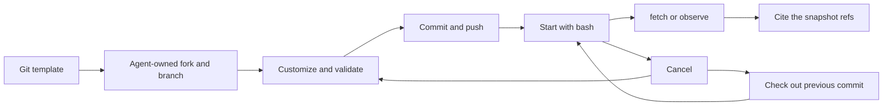

# Sensors

> **A sensor is a template process that serves HTTP on `$PORT`.** The
> kernel knows no sensor. Any agent reads the process with `fetch`
> ([Processes](processes.md#processes-that-serve-http)), and the workspace
> keeps what it reads as a snapshot. Each sensor template ships an `observe`
> macro over `fetch`. Both templates of this repository speak protocol
> version 2.

**A forked Git repository defines a sensor server.** The agent customizes
its acquisition and reduction code, validates it, and saves working
versions on a branch. A running workspace process activates one version.
One server can expose several sensors.

**The lifecycle is the deployment contract.** Git owns saved versions. The
process tools own execution. `fetch` reads the running version, and the
snapshot store keeps what it reads. Ambion adds no sensor tool, sensor
registry, or deployment service.

**The server owns acquisition and reduction.** Its implementation owns
device drivers, reducer state, source history, and recovery. Reducers can
be stateful. The protocol prescribes no internal storage format.

**A sensor is a pattern, as an actuator is.** [Actuators](actuators.md)
describe a command to the world that runs as a process. A sensor serves
data to agents, and the process that serves it is a plain `bash` process.

## The pattern

| Stage          | Agent action                                             | Result                                               |
| -------------- | -------------------------------------------------------- | ---------------------------------------------------- |
| Fork           | Use `repos` and `fork` on a sensor template              | An agent-owned repository and checkout               |
| Customize      | Create a branch and edit acquisition or reduction code   | A working implementation for the task                |
| Validate       | Run the template tests                                   | Evidence from the server and the protocol checks     |
| Save           | Commit and push the branch to the owned fork             | A saved version that can be run again                |
| Start          | Run its launch command through `bash`, with a `name`     | Acquisition runs under a process handle              |
| Read           | Call `fetch`, or the `observe` macro, then cite the refs | Retained measurements and files                      |
| Revise or stop | Cancel; edit, validate, save, and start again            | An explicit replacement or an inactive sensor        |
| Roll back      | Cancel; check out a previous commit and start it         | A previous implementation, with a new process handle |

**A branch holds ongoing work. A commit identifies a saved version.**
Pushing code does not change a running server. A template update leaves
existing forks and running processes unchanged. The agent chooses when to
incorporate a change and start a replacement.



## Ownership

| Concern                                                        | Owner                                               |
| -------------------------------------------------------------- | --------------------------------------------------- |
| Repository, launch command, installation, source configuration | Server implementation and the agent that manages it |
| Acquisition, reducer state, measurements, history              | Server implementation                               |
| The protocol, its version, and the `observe` macro             | The template                                        |
| Process handle, status, timeout, cancellation, adoption, port  | Workspace process table                             |
| Workstation hostname, SSH credentials, endpoints               | Workstation backend                                 |
| The read of a path, and the snapshot of its body               | The `fetch` tool                                    |
| Retained bytes and snapshot refs                               | Workspace object store                              |
| Messages and collaboration                                     | Room                                                |

## Run a server from Git

**Templates are ordinary repositories in the Git backend.** The host
registers `templates/sensor-server` as it registers other templates. The
agent forks it and works in its own repository. [Git](git.md) owns names,
branches, and push authority.

**Each template documents one complete lifecycle.** Its README states:

- The runtime and the installation of dependencies.
- The source files to customize and any device permission.
- A validation command.
- A foreground launch command that listens on `$PORT`.
- The acquisition-data directory and its behavior on restart or rollback.
- How to stop, save a branch, replace a process, and restore a version.

**The template is executable example code.** The agent changes sampling,
filtering, aggregation, and device integration in that code. Configuration
that travels with the version belongs in the repository. Secrets, acquired
data, and mutable reducer state stay outside the checkout.

This example forks the template, saves a branch, starts the server, and
reads it:

```ts
fork({ source: 'templates/sensor-server', name: 'bench-sensors', clone: '~/sensor-server' });
bash({ command: 'cd ~/sensor-server && git switch -c sensing && npm install' });
bash({
  command:
    'cd ~/sensor-server && npm test && git add -A && ' +
    'git commit -m "Customize sensor fixtures" && git push -u origin sensing',
});
bash({
  command:
    'cd ~/sensor-server && AMBION_SENSOR_REPOSITORY=instruments/bench-sensors ' +
    'AMBION_SENSOR_DATA_DIR="$HOME/sensor-data/bench" node server.mjs',
  name: 'bench-sensors',
  wait: 1,
  timeout: 86400,
});
fetch({ process: 'bench-sensors', path: '/room-temperature/observe' });
// Result: the observation, a file path, and a snapshot ref.
compose({
  macro: 'sensor-server/observe',
  args: { process: 'bench-sensors', sensor: 'room-temperature' },
});
// Result: the refs to cite, the measurement times, and the export paths.
```

**The server reads `$PORT` and prints nothing.** The workspace sets `PORT`
for every process that `bash` starts. The template binds `127.0.0.1` on
that port and exits when `PORT` is absent. No `READY` line and no chosen
port exist.

**Stop before editing the files of a running version.** The template uses
no hot reload. After a change, start a new process with the same `name`.
This keeps the running implementation tied to its launch source. A separate
checkout can prepare a replacement while the earlier version runs.

**The server captures source metadata at launch.** Its index reports the
repository identifier, the full commit hash, the branch when present, and
whether the checkout had uncommitted changes. It never replaces that value
with the current branch head. The metadata comes from the server
implementation. The workspace does not attest its executable bytes.

**Uncommitted experiments are allowed.** Their source metadata keeps
`dirty: true`, and the commit names their base only. Committing those edits
later does not relabel an earlier observation as a clean run.

**Rollback selects code and leaves acquisition data in place.** Cancel the process, check
out a previous commit, and start it again. The sensor-server template writes
`acquisition.json` once, appends successful reads to `observations.jsonl`,
and stores frame bytes under `blobs/<sha256>`. Git rollback leaves that
directory intact. Use a separate directory or a backup when a later version
changes data that an older version reads.

**The server stays in the foreground of its process.** Do not daemonize it
and do not start a supervisor. The process handle owns its lifetime. The
default timeout is 600 seconds, so a long session sets `timeout`. A workspace
disposal cancels its processes. After a crash, a process of the workstation
stays available for adoption ([Processes](processes.md#recovery)).

## Protocol version 2

**The template owns the protocol.** `api.mjs` of the sensor-server template
and `server.ts` of the camera template hold the schemas. The kernel checks
none of them. Each JSON body carries `api: 2`, and a binary body carries its
media type. A breaking change raises `api`, and the `observe` macro of the
template refuses a server at another `api`.

| Method | Path                        | Result                                                    |
| ------ | --------------------------- | --------------------------------------------------------- |
| `GET`  | `/`                         | `api`, the source metadata, and the sensors with `spans`  |
| `GET`  | `/<sensor>/observe`         | The latest observation                                    |
| `GET`  | `/<sensor>/observe?from&to` | The observations of a half-open span, `from` in, `to` out |
| `GET`  | `/files/<sha256>`           | Immutable bytes named by their SHA-256 digest             |

| Part     | Fields                                                     |
| -------- | ---------------------------------------------------------- |
| `text`   | `text`                                                     |
| `frame`  | `file` (a digest), `mediaType` (`image/jpeg`, `image/png`) |
| `series` | `channel`, `unit`, `from`, `intervalMs`, `values`          |
| `file`   | `file` (a digest), `name`, `mediaType`                     |

**An observation is `{ at, parts }`.** `at` is the measurement time. Every
timestamp is UTC with three millisecond digits. A part that names a file
carries its digest. The server returns the bytes at `/files/<digest>`.

**A span needs both bounds.** A query holds `from` and `to` together, and
`from` precedes `to`. A server that cannot answer spans declares
`spans: false` and returns `422` for a span. A malformed query returns `400`.

**An error is JSON with the same `api`.** It holds `code` (`invalid`,
`unknown`, or `unavailable`) and `message`. The status carries the class:
`400`, `404`, `422`, or `503`. The `fetch` tool shows a status outside 200
to 299 as an error that holds the first 2 KiB of the body as process data.

**The version 2 protocol differs from version 1 in four points.**

| Version 1                               | Version 2                                     |
| --------------------------------------- | --------------------------------------------- |
| `POST /<sensor>/observe` with a body    | `GET /<sensor>/observe` with a query          |
| The workspace chose and parsed the port | The workspace sets `$PORT`; the server reads  |
| `connect` validated the index           | The macro reads the index at each call        |
| The workspace client checked each file  | The macro checks each file against its digest |

## The observe macro

**`observe` is a macro of the template, and it runs over `fetch`.** The
template ships it as `skills/<template>/macros/observe.js`, in a skill that
has the name of the template. A seat runs it with `compose`, as
`sensor-server/observe` or `camera/observe`
([Macros](macros.md)).

| Argument     | Meaning                                       |
| ------------ | --------------------------------------------- |
| `process`    | The name of the running process               |
| `sensor`     | The sensor name from the index                |
| `from`, `to` | A span, two UTC timestamps that come together |

**The macro reads the index, the observation, and each named file.** It
refuses a server that does not serve API 2. It checks the SHA-256 of each
file against its digest, and it refuses a process that the workspace
replaced during the read. It returns the handle, the source, the count of
observations, the measurement times, the paths and refs of the
observation, the files, and the refs to cite.

**An agent can skip the macro.** `fetch` reads any path. The camera chat
example reads the camera with two `fetch` calls: the observation, then the
frame at `/files/<digest>`. The agent cites both refs and states the
measurement time.

### Load the skills of a template

**A host loads the skill of a template with `loadSkills`.** The function
takes several sources, so a template skill sits beside the skills of the
agent:

```ts
const skills = await loadSkills(
  fromDirectory('./agents/surveyor/skills'),
  fromDirectory('./templates/sensor-server/skills'),
);
const surveyor = defineAgent({
  name: 'surveyor',
  identity: 'Reads the bench sensors.',
  executor: pi({ model, bundles: [workspace.tools({ skills })] }),
});
```

**The macro that runs comes from the host's copy of the template.** An
edit of `skills/` in a fork changes nothing that runs. Skills belong to a
definition, and `approve` pins the hash that the host loaded
([Macros](macros.md#review-a-macro)). Two sources that hold the same skill
folder fail with a duplicate error ([Skills](skills.md#several-sources)).

**A host that loads no template skill still reads sensors.** The workbench
and the camera chat load none. Their agents call `fetch` with the paths that
the template README names.

## Read and retain evidence

**`fetch` keeps the bytes that it reads.** Each successful call stores the
body in the object store, writes an export under `~/.fetch/<process>/`, and
returns the snapshot ref. A message cites the ref. The agent can `restore`
the bytes later, after the process, its port, and its checkout are gone.

**The export is a mutable copy.** An edit of the export does not change the
snapshot. The next read of the same bytes writes the file again.

**The ref holds the received bytes.** The workspace does not parse them.
JSON and text show in the result as process data, and an image returns as an
image part. [Workspace](workspace.md#read-a-process-with-fetch) holds the tool contract.

**Source metadata identifies the serving implementation.** It does not claim
that this revision acquired every historical measurement. A server that
keeps older measurements preserves their source in its answers when the
difference matters.

**Retention begins at the read.** Data that nobody read stays the
responsibility of the server. After a read succeeds, the evidence does not
depend on the server, its port, its history, or the checkout.

## Filesystem access

**The server has the filesystem access of its owner.** Its checkout and its
acquisition directory live in the account of the owner. A path in that
account is not a path on the Ambion host.

| Files                               | Writer                                | Lifetime                                          |
| ----------------------------------- | ------------------------------------- | ------------------------------------------------- |
| Checkout and branch                 | The owner, through Git and file tools | Until the owner removes it; pushed commits remain |
| Acquisition files and reducer state | The server, in the owner's account    | Set by the server, outside the checkout           |
| Exports of `fetch`                  | The workspace, as the reading agent   | Mutable files in `~/.fetch` of that agent         |
| Snapshot objects                    | The object backend                    | Until the configured object store removes them    |

**Other agents read the server through `fetch`.** They need no access to the
home of the owner. The workspace receives the bytes over HTTP and writes the
export in the home of the reader. On a workstation, any agent of the
workspace can read any running process with GET
([Trust](trust.md)).

## Failure and lifecycle

| Event                                   | Result                                                                                    |
| --------------------------------------- | ----------------------------------------------------------------------------------------- |
| The server has not bound its port yet   | `fetch` says the process does not listen on `$PORT`; wait, then retry                     |
| The process ends or is cancelled        | `fetch` refuses its name; retained snapshots still restore                                |
| The SSH session ends                    | The next `fetch` opens a new forward                                                      |
| The server answers a status outside 2xx | `fetch` fails and shows the first 2 KiB of the body                                       |
| The macro finds another `api`           | The macro fails before it reads the observation                                           |
| A file does not match its digest        | The macro fails and names the digest                                                      |
| The object store write fails            | `fetch` fails with no claim of a retained result                                          |
| The host restarts                       | The host lists the owner, or the owner calls `ps`; `fetch` then reads the adopted process |
| The workspace disposes                  | The forwards close and the process cleanup runs                                           |

**A read follows the cancellation of its call.** An abort closes the HTTP
work. It does not cancel the server process. A server owns its own
recovery.

## The examples and their evidence

**Two templates show the pattern.** The sensor-server template of the
workbench serves a numeric series, a frame, and a text fixture with no
hardware. The camera template of the camera chat serves frames of a Mac
camera. Each template lists its own tests in its README, and each runs its
server in a test.

**The acceptance run exercises the lifecycle on a workstation.** The test
`process-http-lifecycle.test.ts` starts the sensor-server template with
`bash` in a host. A second agent reads an observation and a file with
`fetch`. The test kills the host, opens a new workspace, and adopts the
process. The second agent reads again. The owner cancels the process, and
`fetch` refuses its name. The OpenSSH tier runs it, and the test skips when
that tier is absent.

**The tests cover the essential boundaries.**

- `fetch` keeps the bytes that it reads, and `restore` returns them.
- A body past the limit, a non-2xx status, and an ended process fail.
- Two processes with one name fail, and the handle selects one.
- The forward opens once for each process and closes when it ends.
- The macro refuses another `api` and a file with the wrong digest.
- Measurement timestamps stay unchanged, including in snapshots.
- A frame returns as an image part and its export path in the text.

**A scripted seat proves transport and storage.** Neither case claims to
validate hardware timing or scientific inference.

## Out of scope

- Spend controls, exchange limits, quotas, and new rate-limit policies.
- A framework daemon, reducer SDK, instrument drivers, or model captions.
- A public service directory or a registry of sensor processes.
- Automatic service restart, upgrades, installation, or supervision.
- Public port exposure, browser viewers, CORS, and arbitrary remote URLs.
- A method other than GET, and a request header or body.
- Live media streams, audio and video playback, and cross-sensor queries.
- Automatic detection delivery and a `followAndPost` helper.
- New refs, journal entries, and kernel scheduling rules.
- Clock synchronization, skew estimates, or timestamp correction.
- Commands to the world. [Actuators](actuators.md) describes them.
- Sensor reads as inputs to a controller. A sensor serves agents, and a
  controller reads its own instruments.

**Existing host composition stays available.** A host can read a process
with `workspace.fetch` and call `room.post`. That integration uses host time
for its own scheduling and keeps source times in the reported evidence.
