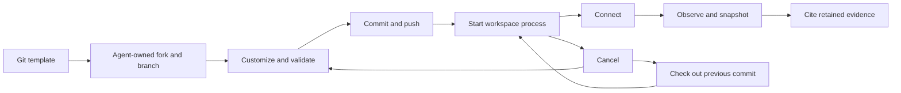

# Sensors

> **Sensor reads require a backend with ports.** Such a workspace exposes
> `connect` and `observe`. Observation reads use the connected server, retain
> verified bytes and the manifest through snapshots, and export the result
> into the observing agent's home. The version 1 schemas and client are
> available from `@ambionframework/workspace/sensors`, and the conformance
> runner is available from `@ambionframework/workspace/conformance`. See the
> [release plan](../planning/next.md) for scope and acceptance evidence.

**A forked Git repository defines a sensor server.** The agent customizes
its acquisition and reduction code, validates it, and saves working
versions on a branch. A running workspace process activates one version.
One server can expose several sensors through the sensor API.

**The lifecycle is the deployment contract.** Git owns saved versions.
The existing process tools own execution. `connect` attaches a running
version to the workspace, and `observe` retains its evidence as snapshots.
Ambion adds no separate sensor definition or deployment service.

**The server owns acquisition and reduction.** Its implementation owns
device drivers, reducer state, source history, and recovery. Reducers can
be stateful. The API prescribes no internal storage or checkpoint format.

## The functional core

| Stage          | Agent action                                           | Result                                               |
| -------------- | ------------------------------------------------------ | ---------------------------------------------------- |
| Fork           | Use `repos` and `fork` on a sensor template            | An agent-owned repository and checkout               |
| Customize      | Create a branch and edit acquisition or reduction code | A working implementation for the task                |
| Validate       | Run template tests and `sensorConformance`             | Evidence from the server and protocol checks         |
| Save           | Commit and push the branch to the owned fork           | A saved version that can be run again                |
| Start          | Run its launch command through `bash`; read `status`   | Acquisition runs under a process handle              |
| Connect        | Call `connect` with that handle and port               | Qualified sensor names in the workspace              |
| Observe        | Call `observe`, then cite its snapshot ref             | Retained measurements and files                      |
| Revise or stop | Cancel; edit, validate, save, and start again          | An explicit replacement or an inactive sensor        |
| Roll back      | Cancel; check out a previous commit and start it       | A previous implementation, with a new process handle |

**A branch holds ongoing work; a commit identifies a saved version.**
Pushing code does not change an already-running server. Template updates
also leave existing forks and running processes unchanged. The agent
chooses when to incorporate changes and start a replacement.

**The first deployment is a workstation.** The checkout, acquisition
files, and server process belong to its owning agent's account. The server
binds to workstation `127.0.0.1`. The backend carries HTTP through SSH.



## Ownership

| Concern                                                        | Owner                                               |
| -------------------------------------------------------------- | --------------------------------------------------- |
| Repository, launch command, installation, source configuration | Server implementation and the agent that manages it |
| Acquisition, reducer state, measurements, history              | Server implementation                               |
| Process handle, status, timeout, cancellation, adoption        | Existing workspace process table                    |
| Workstation hostname, SSH credentials, port transport          | Workstation backend                                 |
| Connection names, sensor discovery, observation rendering      | Workspace                                           |
| Retained evidence bytes and snapshot refs                      | Existing workspace object store                     |
| Messages and collaboration                                     | Room                                                |

**A sensor is read through its server.** The workspace name is
`<connection>/<sensor>`, such as `bench/dmm`. These two names remain
separate fields in the protocol and connection registry. Each follows
the existing agent-name grammar, `^[a-z][a-z0-9-]*$`.

## Run a server from Git

**Templates are ordinary repositories in the existing Git backend.**
The host supplies `templates/sensor-server` as it supplies other templates.
The agent forks it and works in its own repository. It creates a checkout
through `fork` with `clone`, or uses `clone` on an existing fork. [Git](git.md) owns naming, branches, and push authority.
An agent needs no new sensor installation or configuration tool.

**Each template documents one complete lifecycle.** Its README states:

- Runtime and dependency installation, with pinned dependencies where used.
- The source files to customize and any required device permissions.
- A validation command. The host can run the reusable SN4 conformance
  cases against the server.
- A foreground launch command, loopback binding, and readiness output.
- The acquisition-data directory and its behavior on restart or rollback.
- How to stop, save a branch, replace a process, and restore a prior version.

**The template is executable example code.** The agent can change sampling,
filtering, aggregation, and device integration in that code. Configuration
that should travel with the version belongs in the repository. Secrets,
acquired data, and mutable reducer state stay outside the checkout.

The lifecycle begins by forking the template and making a branch. This
example uses `instruments` as the agent name:

```ts
fork({ source: 'templates/sensor-server', name: 'bench-sensors', clone: '~/sensor-server' });
bash({ command: 'cd ~/sensor-server && git switch -c sensing' });
```

After installing the exact package artifact described in the template
README and customizing `server.mjs` or the fixtures, test and save the
working branch:

```ts
bash({
  command:
    'cd ~/sensor-server && npm test && ' +
    'git add -A && git commit -m "Customize sensor fixtures" && git push -u origin sensing',
});

bash({
  command:
    'cd ~/sensor-server && AMBION_SENSOR_REPOSITORY=instruments/bench-sensors ' +
    'AMBION_SENSOR_DATA_DIR="$HOME/sensor-data/bench" PORT=0 node server.mjs',
  name: 'bench-sensors',
  wait: 0,
  timeout: 86400,
});
// Result: process bash-1a2b3c4d5e6f.
status({ handle: 'bash-1a2b3c4d5e6f' });
// Suppose the output says READY http://127.0.0.1:43127.
connect({ name: 'bench', process: 'bash-1a2b3c4d5e6f', port: 43127 });
observe({ sensor: 'bench/room-temperature' });
// Result: values, measurement times, export paths, and a snapshot ref.
```

The `fork` and process commands use existing workspace tools. `connect` and
`observe` are available on a backend with ports.

**Starting this template starts fixture acquisition before readiness.** It
stores its initial fixture data, then prints `READY` with the bound port.
Each successful latest-read request appends an observation record. Its
fixtures declare `spans: false`, so a span request returns 422. Cancelling
the process ends the server through the existing process group mechanism.

**Stop before editing the files used by a running version.** The template
uses no hot reload. After a change, start a new process and reconnect.
This keeps the running implementation tied to its launch source. A separate
checkout can prepare a replacement while the earlier version runs.

**The server captures source metadata at launch.** Its index reports the
repository identifier, full commit hash, branch when present, and whether
the checkout had uncommitted changes. It never substitutes the current
branch head for that captured value. Metadata comes from the trusted
server implementation; the workspace does not attest its executable bytes.

**The source fields follow Git rules.** Repository IDs use an agent
namespace and a Git repository name. A commit uses a full lowercase
40- or 64-digit hash. A branch follows Git ref-name rules.

**Uncommitted experiments are allowed.** Their source metadata keeps
`dirty: true`; the commit names their base only. Committing those edits
later does not relabel an earlier observation as a clean run. Validate,
commit, push, and restart to produce a saved working version.

**Rollback selects code, not acquisition data.** Cancel the current process,
check out a previous commit, and run it again. This template writes its
initial acquisition to `acquisition.json` once, appends successful requests
to `observations.jsonl`, and stores frame bytes under `blobs/<sha256>`. The
initial fixture remains preserved and the log is append-only; current code
does not read old observation records as history. Git rollback leaves that
directory intact. Use a separate directory or a backup if a later code
version changes data that the older code reads. There is no library format
migration or compatibility upgrade.

**The server stays in the foreground of its workspace process.** Do not
double-fork or start a second supervisor. `bash` already runs it in the
background relative to the tool call. The existing process handle owns
its lifetime. Child acquisition programs belong to that process group.

**Existing process behavior stays in force.** The default timeout is
600 seconds. A long session therefore supplies an explicit timeout,
as above. `connect` changes no timeout. A workspace disposal cancels its
managed processes. A crash can leave a workstation process available for
adoption. [Processes](processes.md) states these rules.

## Filesystem access

**The server has its owning process's filesystem access.** Its checkout
and acquisition directory live on the workstation, in the owner's account.
The owner uses normal file and shell tools to inspect and customize them.
A path in that account is not a path on the Ambion host machine.

| Files                               | Writer                                        | Lifetime                                                                |
| ----------------------------------- | --------------------------------------------- | ----------------------------------------------------------------------- |
| Checkout and branch                 | Owning agent through Git and file tools       | Until the agent removes the checkout; pushed commits remain in the fork |
| Acquisition files and reducer state | Server process in the owner's account         | Defined by the server implementation, outside the checkout              |
| Observation exports                 | Workspace acting as the observing agent       | Mutable files in that observer's home                                   |
| Snapshot objects                    | Existing object backend through the workspace | Until the configured object store removes them                          |

**Other agents observe through the connected API.** They need no direct
access to the server owner's home. The workspace receives evidence bytes
through HTTP and writes exports in each observer's own home. The wire
carries file digests, never workstation paths for the host to open.

**Automatic snapshots retain the received evidence.** They do not copy
the whole repository or acquisition directory. An owner can still use
`snapshot` on an ordinary workspace file when it needs to retain other
bytes. Existing object-store credentials and ownership rules stay in force.

## Connect

**`connect` attaches an existing process to the workspace.** Its input is:

```ts
interface ConnectInput {
  readonly name: string;
  readonly process: string;
  readonly port: number;
}
```

- `name` is the connection name within this workspace.
- `process` is a running process of the calling agent.
- `port` is an integer from 1 through 65535 on the workstation.

**The workspace checks readiness before registering the connection.** It
checks that the caller owns a running process, opens the port transport, and
reads the server index through `createSensorClient`. It validates API
version 1, launch source metadata, unique sensor names, and the listed names.
It checks the same process again before committing. A failure closes the
temporary transport and adds no connection. The server process keeps running.

**Network waits hold no workspace resource owner.** Process checks and
export writes use the existing short resource operations. HTTP requests
and tunnel establishment run outside those queues.

**A successful result lists the sensors.** Each line gives the qualified
name and description. The result also names the workstation, remote port,
process handle, launch source, and captured index. The activation reminder
lists the configured workstation hostname, remote sensor port, process
handle, and captured sensor names with descriptions. It checks process state
through the process table. It shows an ended process as unavailable. It does
not request a new index; an explicit repeated `connect` refreshes discovery.
The reminder embeds no observation media or private transport URL.

**A repeated connection is idempotent.** The same owner, process, port,
and name refresh discovery and return the existing registration. The
registration preserves its captured launch source and rejects a retry if
the server reports altered source metadata. The explicit retry can renew a
failed transport after checking the process again. A name assigned to
another live process is refused. Once its process ends, its owner can bind
that name to a different running process with another `connect`. The ended
process handle cannot be revived, and another agent cannot replace the
owner's registration.

**All agents of the workspace can observe connected sensors.** The
connection retains the identity of its process owner for transport.
Observers receive neither that owner's SSH credential nor control of
the process. Existing process tools keep their ownership rules.

**Connections live for one run of the workspace host.** A host restart
does not automatically restart a server or restore a connection. The
agent reads `ps`, adopts a surviving process through the existing table,
and calls `connect` again. This avoids a second durable service registry.

**A process end makes its connection unavailable.** The process table's end
event or a process check marks it unavailable and closes its port transport.
The process table remembers each process it saw end for this host run, so a
stale read cannot revive it. The table has no record of a process that ended
in an earlier host run. For such a process, `connect` reads the state on each
call and refuses any state other than `running`.

**A connect can commit before the table records an end.** The process writes
its exit, and the table records the end later. The `ended` event then marks
that connection unavailable at once, as for a process that ends just after
`connect` returns.

**A replacement is an explicit owner call.** It does not reuse the old
registration's transport. A listener that later reuses the port is never
attached silently.

**Sensor readers use one internal registry boundary.** The source
module `sensor-connections.ts` exposes
`createSensorConnections(...).get('<connection>/<sensor>', signal)` to
workspace internals. It checks the captured process owner and handle before
returning the available connection, client, index, and launch source. It
returns `undefined` for an unknown or unavailable sensor. A reader passes
its own signal to `get` and to the request. A status-read failure propagates
without declaring the process ended, so an explicit `connect` can retry the
process check and renew its transport. A failed observe request is not
replayed. This boundary adds no public `Workspace` method or package export.

## Workstation ports

**The backend names where commands run.** Its guidance and tool results
give the configured workstation hostname. They distinguish the remote
sensor port from the SSH login port and any local transport address.
The agent does not need to construct a tunnel command.

**The bash backend exposes one optional port capability.** This transport
contract is separate from its existing environment `connect` method:

```ts
interface WorkspacePort {
  readonly url: string; // private HTTP root reachable by the host
  close(): Promise<void>;
}

interface WorkspacePorts {
  readonly hostname: string; // the machine where workspace commands run
  open(
    agent: { readonly name: string },
    port: number,
    signal?: AbortSignal,
  ): Promise<WorkspacePort>;
}

// Optional member of BashBackend:
// readonly ports?: WorkspacePorts;
```

**The workstation implements the capability through SSH forwarding.**
`hostname` is the configured workstation hostname. The `port` argument is
the remote HTTP service port on workstation `127.0.0.1`. `WorkstationOptions.port`
is the SSH login port. The remote service port must be an integer from 1 to 65535. The returned URL uses a private host loopback address and an
automatically assigned local port. It contains no SSH credentials and is
temporary. It is not a ref or stored identity. The transport reuses the
process owner's credentials and host-key verification.

**The caller owns the open transport.** `open` holds an SSH session reference
until `close` completes. Its optional signal cancels establishment and releases
partial resources. After success, the caller must call `close`. Closing is
safe more than once. An aborted request does not close this shared transport.
SSH disconnect, forwarding failure, and backend disposal release its channels,
session reference, and local listener.

**Sensor request recovery stays explicit.** A repeated `connect` can build a
new transport after it rechecks the process and validates the index. `observe`
does not renew a failed transport or replay a failed request, because the
server may acquire data on request.

**OpenSSH must permit this forwarding.** The backend reports a forwarding
refusal explicitly. The example setup enables the required loopback
destination. Tests cover both permitted and denied forwarding.

**A process handle is a lifecycle link.** It does not prove that an
arbitrary TCP listener belongs to that PID. This initial deployment
trusts the workstation and the server implementation supplied by its
owner. Agents that manage the server code also control that code.

**Backends without ports expose no sensor tools.** The just-bash
backends do not gain a real network or a native server runtime. A
host-side daemon fixture can test the protocol in isolation. The actual
process-to-sensor path must pass on the workstation backend.

## The sensor API

**The initial API has three operations.** All JSON request and response
bodies carry `api: 1`. Binary responses carry their media type.

| Method | Path                | Result                                                    |
| ------ | ------------------- | --------------------------------------------------------- |
| `GET`  | `/`                 | Sensor names, descriptions, and supported reads           |
| `POST` | `/<sensor>/observe` | Latest observations, or observations for a requested span |
| `GET`  | `/files/<digest>`   | Immutable bytes named by SHA-256                          |

```ts
interface SensorSource {
  readonly repository: string; // identifier of the agent-owned Git fork
  readonly commit: string; // full hash captured at launch
  readonly branch?: string; // absent for a detached checkout
  readonly dirty: boolean; // true: commit identifies only the base
}

interface SensorIndex {
  readonly api: 1;
  readonly source: SensorSource;
  readonly sensors: readonly {
    readonly name: string;
    readonly description: string;
    readonly spans: boolean;
  }[];
}

interface ObserveRequest {
  readonly api: 1;
  readonly span?: { readonly from: string; readonly to: string };
}

interface ObserveResponse {
  readonly api: 1;
  readonly observations: readonly {
    readonly at: string;
    readonly parts: readonly SensorPart[];
  }[];
}

type SensorPart =
  | { readonly kind: 'text'; readonly text: string }
  | {
      readonly kind: 'frame';
      readonly file: string;
      readonly mediaType: 'image/jpeg' | 'image/png';
    }
  | {
      readonly kind: 'series';
      readonly channel: string;
      readonly unit: string;
      readonly from: string;
      readonly intervalMs: number;
      readonly values: readonly number[];
    }
  | {
      readonly kind: 'file';
      readonly file: string;
      readonly name: string;
      readonly mediaType: string;
    };
```

**A file field is a SHA-256 digest in lowercase hex.** Its bytes remain
unchanged. The workspace verifies the digest after fetching them. Large
text and series can use file parts, such as text or CSV. Source names
are metadata; the workspace generates local filenames itself.

**A server can implement a read by acquiring or reading its store.**
The API makes no promise that repeating a latest request gives the same
observation. An empty latest result means that no observation exists yet.

**A span is half-open: `from <= at < to`.** For series, the included
samples follow that interval. Times are UTC ISO 8601 strings with three
digits of milliseconds. `intervalMs` can represent a finer sample period.
A request requires `from < to`. A server that supports spans returns the
requested evidence or an explicit error. It never silently truncates a
result. It can put a large result in files.

**Measurement timestamps are the source of truth.** The workspace
preserves them exactly. It performs no skew estimation, synchronization,
or timestamp correction. Host time governs request deadlines, connection
lifecycle, and audit completion. Those times do not replace measurement
times. Clock-quality analysis is outside this release.

**Errors have one JSON envelope:** `{ api: 1, code, message }`.

| HTTP status | Code          | Meaning                                                          |
| ----------- | ------------- | ---------------------------------------------------------------- |
| 400         | `invalid`     | The request does not match the schema                            |
| 404         | `unknown`     | The sensor, file, or path does not exist                         |
| 422         | `unavailable` | The requested span is unsupported or its evidence is unavailable |
| 503         | `unavailable` | The source cannot currently answer                               |

**The wire version is independent of package versions.** A breaking
wire change raises `api`. The client refuses another version. Version 1
describes this initial subset alone. Acquisition and reducer state are
never fields of the protocol.

**The workspace package owns the sensor exports.**
`@ambionframework/workspace/sensors` exports the wire schemas, types, and
HTTP client. `@ambionframework/workspace/sensor-api.schema.json` exports the
generated schema. `@ambionframework/workspace/conformance` exports
`sensorConformance`. The package count stays at eleven; there is no separate
sensor package.

**A host supplies the transport and expected evidence.** The harness is a
`ConformanceHarness<SensorConformanceProbe>`. It opens a probe for each case.
A probe sends a method, path, and optional JSON body. It returns the HTTP
status, content type, and JSON body or file bytes. Its
`dispose` method closes the request resources. The fixture gives each sensor's
name, span capability, expected latest observations, expected span response,
and the expected bytes for every file digest.

```ts
import { sensorConformance } from '@ambionframework/workspace/conformance';

for (const testCase of sensorConformance(harness, fixture)) {
  test(testCase.name, testCase.run);
}
```

**`createSensorClient(root)` reads a sensor server through a private
transport URL.** Its `index(signal?)`,
`observe(name, request = { api: 1 }, signal?)`, and `file(digest, signal?)`
methods implement the three operations above.
The root is a directory base: a root ending in `/prefix` keeps that prefix
for `/prefix/`, `/prefix/<sensor>/observe`, and `/prefix/files/<digest>`.
Observe requests are checked against the version 1 schema before sending.
The client checks every JSON success and error body, rejects redirects, and
never retries a request. `file` returns `{ bytes, mediaType }` only after
the bytes match the requested SHA-256 digest. Measurement timestamp strings
are returned unchanged. Invalid wire data raises `SensorProtocolError`,
valid non-success envelopes raise `SensorHttpError` with the HTTP status and
`sensorError` envelope, and digest mismatch raises `SensorDigestError`;
fetch, disconnect, and abort failures propagate to the caller.

**The schema cannot compare span endpoints.** The JSON Schema checks request
shape and timestamp form. `isValidObserveRequest` also requires `from < to`.

## Observe and retain evidence

**`observe` reads one connected sensor.** Its input is:

```ts
interface ObserveInput {
  readonly sensor: string; // <connection>/<sensor>
  readonly span?: { readonly from: string; readonly to: string };
}
```

**The workspace retains a successful result before returning it.**

1. Check the connection and process, then request the observation.
2. Fetch and verify every referenced file through that connection.
3. Store those bytes in the existing workspace object store.
4. Store a manifest with the exact observations and each file's snapshot
   ref. Include the qualified sensor, process handle, captured connection
   facts, request, and launch source metadata from the connection.
5. Export the manifest and files into the calling agent's home, using safe
   generated filenames; source filenames stay in the observations as metadata.
6. Return the rendered result, export paths, and manifest snapshot ref.

The workspace rechecks that the same connection is still registered and its
process is running after it verifies every response file and before retention
starts. Retention can finish after a later process stop or connection change
because the complete response bytes already passed verification.

**The existing snapshot machinery owns hashing and storage.** An
internal helper can store the received buffers directly. It must retain
the received bytes, even if a process later edits an exported file.
The implementation takes no object-owner lock inside a bash-owner call.
The current snapshot rules for digest verification and backend errors
continue to apply. The internal retention operation stages each export and
publishes its per-call directory only after all files and the manifest are
written. Cancellation or a failed export cannot report a completed
observation. The object buffers are retained before export, so an export
failure can leave content-addressed objects available for a retry.

**Source metadata identifies the serving implementation.** It does not
claim that all historical measurements were acquired by that revision.
A server that retains older measurements preserves their original source
information in its returned evidence when that distinction matters.

**One manifest ref identifies the whole result.** The manifest names
snapshot refs for its files. The agent can use existing `restore` to
read the manifest and then its files. Text and numeric values are in the
manifest itself. A separate manual `snapshot` call is unnecessary.

**Retention begins at observation.** Data that nobody observed remains
the server's responsibility. Once `observe` succeeds, its evidence no
longer depends on the server, its port, its history, or the Git checkout.
It lasts as long as the configured object store retains those snapshots.

**A failed retention returns a failed tool call.** It returns no claim
that the result was retained. Content-addressed objects already written
can remain for retry. A partial local export must not appear complete.
The workspace generates a separate export directory for each call.

**The internal SN34 boundary is `retainSensorObservation`.** `observe` passes
the existing `SnapshotStore`, the observing `WorkspaceAgent`, captured
metadata (`sensor`, `process`, `connection`, `request`, and `source`), the
validated `ObserveResponse`, a `Map<string, Uint8Array>` of verified bytes
keyed by digest (the SN3 adapter supplies each `SensorFile.bytes`), and an
optional `AbortSignal`. It receives the manifest object and snapshot ref,
the published export directory and manifest path, and each file's digest,
snapshot ref, and export path. The observe tool is responsible for acquiring and
validating the connection and response, fetching the files, rendering the
result, and recording its audit details.

**The result states values, units, measurement times, and evidence.**
Text renders as text; a frame renders as an image; a series renders a
short description and an exported data path. File parts render as paths.
Source text is marked as sensor data. The audit entry holds the request,
connection facts, and the returned snapshot ref.

**Text-only executors receive paths for images.**
`workspace.tools({ images: false })` disables image rendering for that
bundle. It changes no wire request and drops no retained bytes. The
initial `observe` schema has no per-call image override.

## Failure and lifecycle

| Event                                           | Result                                                                            |
| ----------------------------------------------- | --------------------------------------------------------------------------------- |
| Server is not ready                             | `connect` fails; use `status`, then retry                                         |
| Process ends or is cancelled                    | Its connection becomes unavailable; retained snapshots still work                 |
| SSH session ends                                | The request fails; repeat `connect` to check the process and open a new transport |
| Server returns invalid data or wrong file bytes | The observation fails validation                                                  |
| Object store write fails                        | `observe` fails without a retained-result claim                                   |
| Workspace host restarts                         | Use `ps` and `connect` again for a surviving process                              |
| Workspace disposes                              | Connections close and normal process cleanup runs                                 |

**A read request follows its tool's cancellation.** Aborting a request
closes its HTTP work. It does not cancel the server process. A callback
inside the server owns its own cancellation and recovery behavior.

## The example and its evidence

**One small Git server proves the whole path.** Its repository serves
one numeric sensor, one frame sensor, and one text sensor. It documents
the launch command and prints the bound port. Deterministic fixtures
exercise the wire without requiring instruments or ffmpeg.

**The acceptance run exercises the whole lifecycle on a workstation.**
An agent forks the template, changes one acquisition or reduction behavior,
validates it, commits, and pushes a branch. It starts the saved version,
connects through SSH, observes the changed result, and cites its snapshot.
A second agent restores the evidence in its own home.

**Replacement and rollback are part of acceptance.** The run cancels the
server, saves and starts another version, and observes its changed result.
It then starts the earlier commit and observes the earlier behavior.
The snapshots of both versions remain readable after both processes stop,
and an acquisition-data marker outside the checkout survives the code
rollback. A separate dirty-run case keeps its original source metadata after
that same edit is committed and pushed.

The OpenSSH acceptance test also kills the host process abruptly, creates a
fresh workspace, adopts the surviving server, and explicitly reconnects it.
A separate checkout advances the launch branch while the restored manifest
keeps the original commit and dirty state. The provisioned OpenSSH test is
serialized with the other SSHD cases because they share account homes and
Git repositories.

**The tests cover the essential boundaries.**

- Invalid or unsupported wire versions fail before registration.
- A connection retry creates one registration and releases failed tunnels.
- Another agent's process cannot be registered or cancelled by a caller.
- Different servers can both expose `dmm` through qualified names.
- Forwarding denial and an SSH disconnect leave no listener behind.
- A server restart needs an explicit connection to its new process.
- A pushed branch survives checkout removal and can be cloned again.
- Editing an export leaves the server data and retained snapshot unchanged.
- Launch source metadata stays fixed when a branch later advances.
- Frame, series, text, and file bytes survive server and host shutdown.
- A failed file fetch or snapshot write cannot produce a successful result.
- Measurement timestamps remain unchanged, including in snapshots.
- A text-only bundle retains images and returns their paths.

**A scripted seat proves transport and storage.** One optional live case
checks that a model follows the workflow and cites the returned ref.
Neither case claims to validate hardware timing or scientific inference.

## Out of scope

- Spend controls, exchange limits, quotas, and new rate-limit policies.
- A framework daemon, reducer SDK, instrument drivers, or model captions.
- A public service directory or an automatically restored connection registry.
- Automatic service restart, upgrades, installation, or process supervision.
- Public port exposure, browser viewers, CORS, and arbitrary remote URLs.
- Live media streams, audio/video playback, and cross-sensor queries.
- Automatic detection delivery and a `followAndPost` library helper.
- New sensor refs, journal entries, and kernel scheduling rules.
- Clock synchronization, skew estimates, or timestamp correction.
- Commands to the world. [Actuators](actuators.md) designs them.
- Sensor reads as inputs to a controller. A sensor serves agents, and a
  controller reads its own instruments.

**Existing host composition stays available.** A host can read a service
and call `room.post` today. That integration uses host time for its own
scheduling and preserves source times in the reported evidence. It is
not a prerequisite for this initial sensor connection and reading path.
