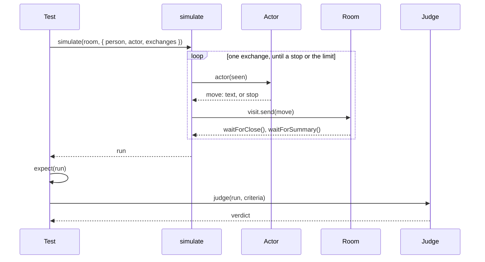

# The simulator

**This page designs `@ambionframework/simulator`. The package does not exist
yet.** The [backlog](../planning/backlog.md) holds the condition that
schedules it. Until it lands, the live tests in `packages/*/test/live` are
the only behavioral evidence.

**The simulator runs an eval: a model plays a person in a room, and the test
grades what the room did.** An eval has three parts. The actor sends each
question on behalf of a person. Checks in code assert facts on the record.
A judge grades the criteria that code cannot decide.

**The package holds one loop and two model calls.** The room, the record,
and the waits come from the kernel. The scripted execution comes from
`@ambionframework/ambion/testing`. The model resolution comes from
`@ambionframework/pi`. The simulator adds the person who drives the room and
the judge who reads it.

## An eval as a test

**An eval is a vitest test.** It starts a room, runs the simulation, asserts
on the run, and asks the judge.

```ts
import { defineHuman, startRoom } from '@ambionframework/ambion';
import { modelActor, modelJudge, simulate } from '@ambionframework/simulator';
import { expect, it } from 'vitest';

const priya = defineHuman({ name: 'priya', identity: 'Site manager. Pours concrete.' });

it('the assistant asks the weather desk once, and answers the person', async () => {
  const room = stopAtEnd(
    await startRoom({ name: roomName('pour'), assistant, agents: [weather, payroll] }),
  );

  const run = await simulate(room, {
    person: priya,
    actor: modelActor({
      model: MODEL,
      brief: 'Find out if you can pour concrete on Thursday. Stop when you have a yes or a no.',
    }),
    exchanges: 3,
  });

  expect(run.ended).toBe('stopped');
  expect(run.exchanges.map((e) => e.outcome.kind)).not.toContain('exhausted');
  expect(run.exchanges.flatMap((e) => e.activations).filter((a) => a.seat === 'payroll')).toEqual(
    [],
  );

  const verdict = await modelJudge({ model: MODEL })(run, [
    'The person learns whether Thursday is dry, with the forecast as the reason.',
    'No agent repeats a fact that another agent already said.',
  ]);
  expect(verdict.pass, JSON.stringify(verdict.findings)).toBe(true);
});
```



## Decisions taken

- **The simulator drives a room that the test started.** `simulate` takes
  a running `Room`. The test chooses the runtime, the storage, the
  execution, and the definitions. The test stops the room with
  `stopAtEnd(room)`.
- **One loop pass is one exchange.** The actor sends one message. The loop
  waits on the handle of that exchange. The loop never sends into an open
  exchange.
- **Every wait is a handle wait.** The loop uses `waitForClose()` and
  `waitForSummary()`. It never polls for a quiet room, and it never calls
  `reconcile()`.
- **The actor sees what a person sees.** It reads each discussion and each
  summary. It reads no activation, no event, no trace, and no criterion.
- **Checks are plain `expect` calls on the run.** The package ships no
  check type and no assertion library.
- **The judge is a separate call after the run.** `simulate` takes no
  criteria, so the actor cannot read them.
- **A criterion that code can decide is a check.** The judge grades only
  what a check cannot decide: tone, fidelity, whether an answer answers.
- **The package ships no rubric, no score scale, and no threshold.** A
  criterion is a string in the test. A verdict is pass or fail for each
  criterion.
- **One run is one sample.** The package repeats nothing. A test that
  wants several samples writes the loop.
- **Actor and judge are functions.** A scripted actor and a scripted judge
  are ordinary values, so the scripted tier runs every path with no key.

## The surface

| Export          | What it is                                                      |
| --------------- | --------------------------------------------------------------- |
| `simulate`      | Runs the loop on a room and returns a `Run`                     |
| `Actor`         | `(seen: Seen) => Move \| Promise<Move>`: the person's next move |
| `Judge`         | `(run: Run, criteria: readonly string[]) => Promise<Verdict>`   |
| `scriptedActor` | An actor that plays a fixed list of moves                       |
| `modelActor`    | An actor on a model, from a brief                               |
| `modelJudge`    | A judge on a model                                              |

```ts
/** What the person does next: send a message, or stop and give the reason. */
export type Move =
  | { readonly text: string; readonly to?: string; readonly usage?: Usage }
  | { readonly stop: string; readonly usage?: Usage };

/** What the person has seen: one entry for each exchange the loop ran. */
export interface Seen {
  readonly person: HumanDefinition;
  readonly exchanges: readonly {
    /** The text the person sent. */
    readonly sent: string;
    /** What `waitForClose()` returned: the discussion, without summaries. */
    readonly discussion: readonly Message[];
    /** What `waitForSummary()` returned. */
    readonly summary?: SummaryMessage;
  }[];
}

export interface SimulateOptions {
  readonly person: HumanDefinition;
  readonly actor: Actor;
  /** The most messages the actor sends. Required, so that every eval states its bound. */
  readonly exchanges: number;
  /** Real milliseconds that one exchange may take to close. The default is 150 000. */
  readonly closeMs?: number;
}

export function simulate(room: Room, options: SimulateOptions): Promise<Run>;
```

## The loop

**`simulate` runs these operations in order.**

1. Subscribe to the room, and keep every notification in `run.events`.
2. Call `room.visit(person)` once.
3. Call `actor(seen)`. A `stop` move ends the loop with `ended: 'stopped'`.
4. Call `visit.send(move)`. The loop sends the next move only after the
   exchange closes, so each move opens one exchange.
5. Wait on `handle.waitForClose()` for at most `closeMs`. At the deadline,
   call `room.abort()`. The abort writes a close, and the loop ends with
   `ended: 'timeout'` after that close.
6. Wait on `handle.waitForSummary()`. It returns `undefined` at once in a
   room with no summary writer.
7. Read the closed `ExchangeView` from `room.read()`, and add it to
   `run.exchanges`. Add the discussion and the summary to `seen`.
8. Go back to operation 3. After `exchanges` messages, end the loop with
   `ended: 'limit'`.
9. Call `visit.leave()`, read the room once more, and return the run.

**A rejected wait ends the loop with `ended: 'failed'`.** `waitForClose()`
rejects when the room stops. `waitForSummary()` rejects when a required
summary fails. The run keeps the error message in `run.error`. The loop
does not retry.

**The loop does not stop the room.** The test owns the room, and it can
read the room or resume it after `simulate` returns.

**Events start at the subscription.** A notification from before
`simulate` is not in `run.events`. The record holds every entry, so
`run.room` is complete.

## The actor

**An actor returns the next move from what the person has seen.** It is a
function, so an actor on a model and an actor on a list have one shape.

**`scriptedActor` plays a list.** A string is a message to the room. A
`Move` is sent as it is. The actor stops when the list ends.

```ts
const actor = scriptedActor(['Can we pour on Thursday?', { text: 'And Friday?', to: 'weather' }]);
```

**`modelActor` plays a brief on a model.** It takes `model`, a
`provider/model-id`, and `brief`, the private goal of the person. It makes
one model request for each move, with no tools.

- **The system prompt** holds the person's `identity`, the `brief`, and one
  rule: answer with the next message, or with `STOP:` and the reason.
- **The user prompt** holds each exchange: the text the person sent, every
  spoken message with its author and recipient, and the summary.
- **The move** is the text of the answer. A text that starts with `STOP:`
  is a `stop` move. The move carries the `usage` of the request.

**A message to the person needs an answer, and the brief decides it.** A
closed exchange with the outcome `awaiting` is an ordinary case for the
actor. The next move answers the question, or it stops.

**`modelActor` resolves the model through `@ambionframework/pi`.**
`createExecutionServices()` maps a `provider/model-id` to a model and reads
`<PROVIDER>_API_KEY`. The actor makes one request through the `stream` of
those services. A test passes `stream` to run the actor on the scripted Pi
stream of `@ambionframework/pi/testing`. The simulator imports no provider
library of its own.

## The run

**A run is plain JSON.** A test can write it to a file and read it when an
eval fails.

```ts
export interface Run {
  readonly person: HumanDefinition;
  /** Every move the actor made, in order, the last `stop` included. */
  readonly moves: readonly Move[];
  /** One closed view for each message the actor sent, in order. */
  readonly exchanges: readonly ClosedExchangeView[];
  /** One `room.read()` after the last close, with every message. */
  readonly room: RoomRead;
  /** Every notification after the subscription. */
  readonly events: readonly RoomNotification[];
  readonly ended: 'stopped' | 'limit' | 'timeout' | 'failed';
  readonly error?: string;
  /** `room` sums `exchanges[].usage`. `actor` sums `moves[].usage`. */
  readonly usage: { readonly room: Usage; readonly actor: Usage };
}
```

## Checks

**A check reads the run with `expect`.** Each fact that
[Assistant evaluation](assistant.md#integration-and-evaluation) names has a
source in the run.

| Fact                              | Where it is in the run                                 |
| --------------------------------- | ------------------------------------------------------ |
| Who spoke, to whom, what text     | `run.room.messages`                                    |
| A seat stayed silent              | No spoken message from the seat in `run.room.messages` |
| Unnecessary activations           | `run.exchanges[].activations`, by `seat` and `purpose` |
| An activation failed or retried   | `run.exchanges[].activations[].outcome` and `attempt`  |
| A tool was called                 | `tool_execution_start` in `run.events`                 |
| The lock refused a say            | `conflict` in `run.events`                             |
| Waiting on the person, or done    | `run.exchanges[].outcome.kind`                         |
| What the person read at the close | `run.exchanges[].summaries`                            |
| What the room cost                | `run.usage.room`, and `usage` on each activation       |

**The package ships no helper for these reads.** A filter over the run is
one line. The helpers of `packages/ambion/test/live/support.ts` stay in the
test support where they are.

## The judge

**A judge grades a run against a list of criteria.** It returns one finding
for each criterion. The verdict passes when every finding passes.

```ts
export interface Verdict {
  readonly pass: boolean;
  readonly findings: readonly {
    readonly criterion: string;
    readonly pass: boolean;
    /** One sentence that cites the message seq it rests on. */
    readonly reason: string;
  }[];
  readonly usage?: Usage;
}
```

**The judge reads the record.** `modelJudge` renders the run as text:

- the room's goal and the person's identity;
- every message in seq order, with its author, its recipient, and its kind;
- for each exchange, its range, its outcome, and each activation with its
  seat, purpose, outcome, and the tools it called.

**The judge does not read the actor's brief.** A criterion states what the
person must get. The actor and the judge then share no text.

**`modelJudge` makes one model request.** It asks for JSON with one
finding for each criterion, in the order of the list. An answer that does
not parse, or that misses a criterion, rejects the promise. A malformed
answer never passes. It resolves the model the way `modelActor` does, and
it accepts the same `stream` for the scripted tier.

**A scripted judge is a function.** A test of the loop passes
`async (run, criteria) => verdict`, and needs no export.

## Cost

**Every eval with a model actor or a model judge is a live test.** It
costs money on each run. [CLAUDE.md](../CLAUDE.md#live-runs-cost-money)
holds the rules.

- **`exchanges` is required.** An eval states the most messages its person
  sends. `closeMs` bounds each exchange.
- **An eval lives in the live tier.** A file under `test/live` runs with
  `vitest.live.config.ts`, and CI runs it on `main` and on the weekly
  schedule. A pull request workflow runs none.
- **The run reports what it spent.** `run.usage` and `verdict.usage` give
  the room, the actor, and the judge. The test prints one line with the
  three totals, the way `report()` does in the live tier.
- **The scripted tier proves the eval first.** Run the eval with a
  scripted execution, a scripted actor, and a scripted judge before the
  first live run.

## Where the code lives

**The package depends on `ambion` and `pi`.** The package graph in
[Toolchain](toolchain.md#1-repository-layout) gains one line:
`simulator ──▶ ambion, pi`.

| File                      | What it holds                                  |
| ------------------------- | ---------------------------------------------- |
| `src/simulate.ts`         | `simulate`, `Run`, `Seen`, `Move`              |
| `src/actor.ts`            | `scriptedActor`, `modelActor`, and its prompt  |
| `src/judge.ts`            | `modelJudge`, `Verdict`, and its prompt        |
| `src/index.ts`            | The one entry                                  |
| `test/simulate.test.ts`   | The loop on a scripted room                    |
| `test/model.test.ts`      | The model actor and judge on a scripted stream |
| `test/live/model.test.ts` | One live case of the actor and the judge       |

**The first eval is an assistant case.** It moves one case from
`packages/assistant/test/live/behavior.test.ts` onto the simulator: a
person who revises the request in the second exchange. The case asserts one
directed activation for the revision, and the judge grades the answer.

## Tests

**The scripted tier runs every path of the loop with no key.** The room
runs on `scripted()` from `@ambionframework/ambion/testing`. The person is
a `scriptedActor`. The judge is a function.

| Case                              | What it asserts                                              |
| --------------------------------- | ------------------------------------------------------------ |
| The actor stops                   | `ended: 'stopped'`, and the moves end with the `stop`        |
| The actor reaches the limit       | `ended: 'limit'` after `exchanges` messages                  |
| A seat keeps the exchange open    | `ended: 'timeout'`, and the last outcome is `cancelled`      |
| The room stops during an exchange | `ended: 'failed'`, with the error                            |
| A required summary fails          | `ended: 'failed'`, with the error                            |
| A seat asks the person a question | `seen` carries the discussion, and the outcome is `awaiting` |
| A room with a summary writer      | `seen` carries each summary                                  |
| One move opens one exchange       | `run.exchanges` has one view for each message                |
| The run is plain JSON             | `structuredClone(run)` equals the run                        |

**The model actor and the model judge run on the scripted Pi stream.**
The cases cover the prompt text, a `STOP:` answer, a judge answer that does
not parse, a judge answer that misses a criterion, and the usage that each
request reports.

**One live case proves the real model path.** The actor sends one message
to a room with one agent, and the judge grades one criterion. It proves
that a model id resolves and that the judge's JSON parses on a real
provider.

## Out of v1

**Each item was open work on PR #153.** The simplest simulator leaves each
one out.

- More than one person, and a person who knows the brief of another.
- A message sent into an open exchange, and a person who steers an
  activation.
- Arrivals and departures between exchanges, and catch-up after a gap.
- A store of runs, and grading a stored run again with a new judge.
- A calibration suite for the judge, a rubric library, and scores.
- Several samples of one eval, and statistics across samples.
- A budget in money that stops a run.
- A report format, a command-line tool, and a CI workflow for evals.
