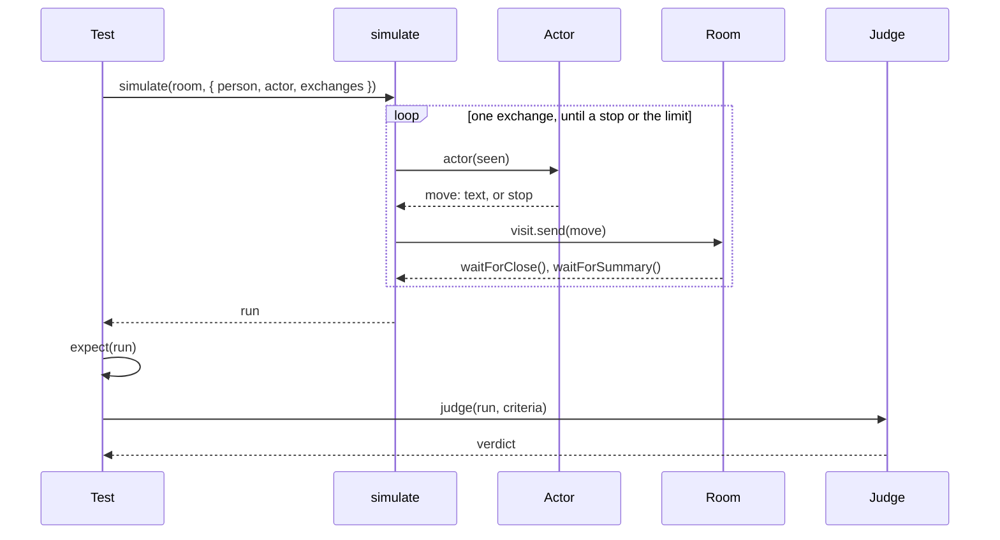

# The simulator

**This page designs `@ambionframework/simulator`.** Phase 2 of
[the 0.3.0 plan](../planning/next.md) builds it, in the four pull requests
of [the order of work](#the-order-of-work). The package holds `simulate`
and `scriptedActor`. `agentActor`, `agentJudge`, and the port of the
assistant's live suite are open. Until step 4 lands, the live tests in
`packages/*/test/live` are the only behavioral evidence.

**The rewrite of the assistant's live suite validates the design.** The
package lands when `packages/assistant/test/live/behavior.test.ts` runs on
it and keeps every claim the suite makes today.
[Validation](#validation-the-assistants-live-suite) states the port and
the evidence.

**The simulator runs an eval: an agent plays a person in a room, and the test
grades what the room did.** An eval has three parts. The actor sends each
question on behalf of a person. Checks in code assert facts on the record.
A judge grades the criteria that code cannot decide.

**The package holds one loop and two agents: the actor and the judge.**
The room, the record, and the waits come from the kernel. The scripted
execution comes from `@ambionframework/ambion/testing`. The model
resolution comes from `@ambionframework/pi`. The simulator adds the person
who drives the room and the judge who reads it.

## An eval as a test

**An eval is a vitest test.** It starts a room, runs the simulation, asserts
on the run, and asks the judge. The local `support.ts` holds the agent
definitions, the model ids, a runtime on the live model, and `stopAtEnd`.

```ts
import { defineHuman, startRoom } from '@ambionframework/ambion';
import { agentActor, agentJudge, simulate } from '@ambionframework/simulator';
import { expect, it } from 'vitest';
import {
  assistant,
  JUDGE_MODEL,
  liveRuntime,
  MODEL,
  payroll,
  stopAtEnd,
  weather,
} from './support.ts';

const priya = defineHuman({ name: 'priya', identity: 'Site manager. Pours concrete.' });

it('the assistant asks the weather desk once, and answers the person', async () => {
  const room = stopAtEnd(
    await startRoom({
      name: `pour-${crypto.randomUUID()}`,
      runtime: liveRuntime(),
      assistant,
      agents: [weather, payroll],
    }),
  );

  const run = await simulate(room, {
    person: priya,
    actor: agentActor({
      model: MODEL,
      brief: 'Find out if you can pour concrete on Thursday. Stop when you have a yes or a no.',
    }),
    exchanges: 3,
  });

  expect(run.ended).toBe('stopped');
  expect(run.exchanges.map((e) => e.view.outcome.kind)).not.toContain('exhausted');
  const seats = run.exchanges.flatMap((e) => e.view.activations.map((a) => a.seat));
  expect(seats).not.toContain('payroll');

  const verdict = await agentJudge({ model: JUDGE_MODEL })(run, [
    'The person learns whether Thursday is dry, with the forecast as the reason.',
    'No agent repeats a fact that another agent already said.',
  ]);
  expect(verdict.pass, JSON.stringify(verdict.findings)).toBe(true);
});
```



## Decisions taken

- **The simulator drives a room that the test started.** `simulate` takes
  a running `Room`. The test chooses the runtime, the storage, the
  execution, and the definitions. The test stops the room with
  `stopAtEnd(room)`.
- **One iteration of the loop is one exchange.** The actor sends one
  message. The loop waits on the handle of that exchange. The loop never
  sends into an open exchange.
- **The run groups the record by exchange.** An assistant check reads one
  exchange: what the assistant said in it, and the summary that closed it.
  Each entry of `run.exchanges` holds the message sent, the discussion, the
  summary, and the closed view.
- **Every wait is a handle wait.** The loop uses `waitForClose()` and
  `waitForSummary()`. It never polls for a quiet room, and it never calls
  `reconcile()`.
- **The actor sees what a person sees.** It reads each discussion, each
  summary, and what its tools return. It reads no activation, no event, no
  trace, and no criterion.
- **Checks are plain `expect` calls on the run.** The package ships no
  check type and no assertion library.
- **The judge is a separate call after the run.** `simulate` takes no
  criteria, so the actor cannot read them.
- **A criterion that code can decide is a check.** The judge grades only
  what a check cannot decide: tone, fidelity, and whether the answer meets
  the question.
- **The package ships no rubric, no score scale, and no threshold.** A
  criterion is a string in the test. A verdict is pass or fail for each
  criterion.
- **One run is one sample.** The package repeats nothing. A test that
  wants several samples writes the loop.
- **Actor and judge are functions.** A scripted actor and a scripted judge
  are ordinary values, so the scripted tier runs every path with no key.
- **A fixed question needs no agent.** Most assistant cases send one
  question and grade the answer. `scriptedActor([question])` drives a live
  room. An agent actor is for a case where the next message depends on the
  answer.
- **A controlled seat comes from the testing entry.** A seat whose
  evidence the test fixes runs on `scripted()` from
  `@ambionframework/ambion/testing`. The package adds nothing for it.
- **`agentActor` and `agentJudge` are configured like any agent.** Each
  takes `model`, `tools`, and `bundles`, the options of an agent
  definition. A test that passes `workspace.tools()` gives the person the
  workspace, with its guidance.
- **The `Actor` and `Judge` types hold the contract.** An agent behind them
  can grow: more tools, a session across moves, one request for each
  criterion. `simulate` does not change.

## Practice it follows

**The design takes each rule below from a published source.**

| Rule in this design                                         | Source                                                                                                                                    |
| ----------------------------------------------------------- | ----------------------------------------------------------------------------------------------------------------------------------------- |
| Grade the outcome with checks, and a meaning with a judge   | [Demystifying evals for AI agents](https://www.anthropic.com/engineering/demystifying-evals-for-ai-agents)                                |
| A case passes when all k samples pass: pass^k               | [τ-bench](https://arxiv.org/abs/2406.12045), [Demystifying evals](https://www.anthropic.com/engineering/demystifying-evals-for-ai-agents) |
| Check the final state of the environment                    | [τ-bench](https://arxiv.org/abs/2406.12045), [Demystifying evals](https://www.anthropic.com/engineering/demystifying-evals-for-ai-agents) |
| A simulated person with a persona, a stop, and a bound      | [promptfoo simulated user](https://www.promptfoo.dev/docs/providers/simulated-user/)                                                      |
| The judge reasons first, and may run on another model       | [Inspect model grading](https://inspect.aisi.org.uk/model-graded.html)                                                                    |
| The judge has an answer for missing evidence: `no evidence` | [Demystifying evals](https://www.anthropic.com/engineering/demystifying-evals-for-ai-agents)                                              |
| Each sample starts from a clean environment                 | [Demystifying evals](https://www.anthropic.com/engineering/demystifying-evals-for-ai-agents)                                              |
| A person reads the transcripts of failed cases              | [Demystifying evals](https://www.anthropic.com/engineering/demystifying-evals-for-ai-agents)                                              |

**Two rules of those sources wait for a later version.** One judge request
for each criterion multiplies the cost by the number of criteria.
Calibration against labels from people needs the labels. Both stay inside
`agentJudge` when they come.

## The surface

| Export          | What it is                                                      |
| --------------- | --------------------------------------------------------------- |
| `simulate`      | Runs the loop on a room and returns a `Run`                     |
| `Actor`         | `(seen: Seen) => Move \| Promise<Move>`: the person's next move |
| `Judge`         | `(run: Run, criteria: readonly string[]) => Promise<Verdict>`   |
| `scriptedActor` | An actor that plays a fixed list of moves                       |
| `agentActor`    | An agent with tools that plays a person from a brief            |
| `agentJudge`    | An agent with tools that grades a run                           |

```ts
/** What the person does next: send a message, or stop and give the reason. */
export type Move = ({ readonly text: string; readonly to?: string } | { readonly stop: string }) & {
  /** The tools the actor called before the move, in order. */
  readonly calls?: readonly { readonly tool: string; readonly args: unknown }[];
  readonly usage?: Usage;
};

/** One exchange as the person saw it. */
export interface SeenExchange {
  /** The text the person sent. */
  readonly sent: string;
  /** What `waitForClose()` returned: the discussion, without summaries. */
  readonly discussion: readonly Message[];
  /** What `waitForSummary()` returned. */
  readonly summary?: SummaryMessage;
}

/** What the person has seen: one entry for each exchange the loop ran. */
export interface Seen {
  readonly person: HumanDefinition;
  readonly exchanges: readonly SeenExchange[];
}

export interface SimulateOptions {
  readonly person: HumanDefinition;
  readonly actor: Actor;
  /** The most messages the actor sends. Required, so that every eval states its bound. */
  readonly exchanges: number;
  /** Real milliseconds for one exchange: its close and its summary. The default is 150 000. */
  readonly exchangeMs?: number;
}

export function simulate(room: Room, options: SimulateOptions): Promise<Run>;
```

## The loop

**`simulate` runs these operations in order.**

1. Subscribe to the room, and keep every notification in `run.events`.
2. Call `room.visit(person)` once.
3. Call `actor(seen)`. A `stop` move ends the loop with `ended: 'stopped'`.
4. Call `visit.send(move)`. The loop sends the next move only after the
   exchange closes, so each move opens one exchange. A message that joins
   an exchange that was already open, such as one the test left open,
   ends the loop with `ended: 'failed'`.
5. Wait on `handle.waitForClose()`, then on `handle.waitForSummary()`.
   Both waits share one deadline, `exchangeMs` after the send, because the
   summary is the answer a person reads. In a room with no summary writer,
   `waitForSummary()` returns `undefined` when the close lands.
6. At the deadline, call `room.abort()`. Before the close, the abort
   writes a close with the outcome `cancelled`, and the summary wait
   returns `undefined`. After the close, the abort fails the pending
   summary, and `waitForSummary()` rejects. The loop waits for the abort
   to land, so it cancels no later work. The loop ends with
   `ended: 'timeout'` after operation 7 when the outcome is `cancelled`, or
   when the landed abort cut the summary. The closed view then shows the
   summary as `failed`. An exchange that ended by itself before the abort
   landed keeps its summary, and the loop goes on. An abort that rejects,
   or a close that does not land in a second period of `exchangeMs`, ends
   the loop with `ended: 'failed'`.
7. Read the closed `ExchangeView` from `room.read()`. Add the exchange to
   `run.exchanges`, and add the discussion and the summary to `seen`.
8. Go back to operation 3. After `exchanges` messages, end the loop with
   `ended: 'limit'`.
9. Call `visit.leave()`, read the room once more, and return the run.

**A rejected wait ends the loop with `ended: 'failed'`.** `waitForClose()`
rejects when the room stops. `waitForSummary()` rejects when a required
summary fails. The run keeps the error message in `run.error`. The loop
does not retry.

**The loop does not stop the room.** The test owns the room, and it can
read the room, or send into it again, after `simulate` returns.

**The first message goes out at once after the arrival.** An arrival can
wake a seat with `presence` attention. That activation keeps the room live,
so the first exchange closes after it ends. A person does the same: they
arrive and ask.

**Events start at the subscription.** A notification from before
`simulate` is not in `run.events`. The record holds every entry, so
`run.room` is complete.

## The actor

**An actor returns the next move from what the person has seen.** It is a
function, so an agent and a list have one shape.

**`scriptedActor` plays a list.** A string is a message to the room. A
`Move` is sent as it is. The actor stops when the list ends.

```ts
const actor = scriptedActor(['Can we pour on Thursday?', { text: 'And Friday?', to: 'weather' }]);
```

**`agentActor` plays a brief as an agent.** It takes the options of an
agent definition and one more:

| Option      | What it is                                                               |
| ----------- | ------------------------------------------------------------------------ |
| `model`     | A `provider/model-id`                                                    |
| `brief`     | The private goal of the person. It has the role of `instructions`        |
| `tools`     | `AmbionTool` values, the same as an agent's                              |
| `bundles`   | Tool bundles and their guidance, such as `workspace.tools()`             |
| `services`  | The Pi execution services. [The model call](#the-model-call) states them |
| `timeoutMs` | Real milliseconds for one move. The default is 60 000                    |

- **The system prompt** holds the person's `identity`, the `brief`, the
  guidance of each bundle, and three rules. Speak as the person. Do not
  quote or mention the brief. End each move with one call to `send` or
  `stop`.
- **The user prompt** holds each exchange: the text the person sent, every
  spoken message with its author and recipient, and the summary.
- **The move ends with a tool call.** `send({ text, to? })` is a message to
  the room. `stop({ reason })` ends the loop. Before either one, the actor
  can call its other tools, for example `read` on a file that an agent
  wrote. `Move.calls` holds every call before the call that ends the move,
  and the move carries the usage of every request.
- **A move that ends with no `send` and no `stop` rejects.** So does a
  move that passes `timeoutMs`. The loop then ends with `ended: 'failed'`.

**The workspace knows the person by name.** A workspace tool reads the
caller from `ctx.agent`. The actor's calls carry the person's name and
identity, so the person has a home like any seat. `openWorkspace` takes no
list of agents, and it connects the person on the first call. The
[workstation](workstation.md) maps each caller to a Unix account, so it
maps the person to one too. A `bash` call by the actor starts a process
that outlives the move, and `workspace.processes` shows it.

**A person with write tools changes the state that the agents read.** This
is the dual control of [τ²-bench](https://github.com/sierra-research/tau2-bench). The test decides it by the bundles it
passes. The room records no tool call of the person, so a check reads
`run.moves[].calls`.

**A question to the person is in the discussion, and the brief decides
the answer.** The person owns every exchange that the actor opens. A
message to the owner answers the owner's question, so the exchange closes
as `complete` ([Exchange](exchange.md#6-the-edges-a-host-sees)). The
outcome `awaiting` never names the actor. The actor reads the question in
the discussion, and its next move answers it or stops.

## The model call

**Both agents run on Pi's AgentHarness through `@ambionframework/pi`.**
The Pi package gains one export:

```ts
export function runAgent(
  services: ExecutionServices,
  request: {
    /** A `provider/model-id`. */
    readonly model: string;
    /** The routing name: `actor` or `judge`. A scripted stream routes on it. */
    readonly name: string;
    /** Who the tools see in `ctx.agent`: the person, or the judge. */
    readonly agent: { readonly name: string; readonly identity: string };
    readonly system: string;
    readonly prompt: string;
    readonly tools?: readonly AmbionTool[];
    readonly bundles?: readonly ToolBundle[];
    /** The names of the tools that end the run. */
    readonly ends: readonly string[];
    readonly signal?: AbortSignal;
  },
): Promise<{ end: RunAgentCall; calls: readonly RunAgentCall[]; usage: Usage }>;
```

- **The model.** `services.model(model, name)` resolves it. Over a scripted
  stream, the stub model carries `name`, and the script routes on it.
- **The tools.** `describeExecutor` from `@ambionframework/ambion/hosting`
  flattens the bundles and joins their guidance. It refuses a duplicate
  name, so a bundle tool named `send`, `stop`, or `grade` fails at once.
- **The loop.** `runAgent` opens one harness session, prompts it once, and
  closes it after the run. It has no steer, no resume, and no
  `readThrough`. A tool in `ends` returns `terminate: true`, and the
  harness stops after it. The first call in `ends` to succeed ends the
  run. A call after it gets a result that ends the run too, and the run
  keeps no record of it. When a sequential batch holds another call
  before the end, the harness sends one more request.
- **The output limit.** A run that stops at the output limit with no call
  in `ends` rejects, and the error names the limit.
- **The tool context.** Each call gets `{ agent, callId, signal, onUpdate
}`, with no `room`, `activation`, or `exchange`. `ToolContext` allows
  their absence, and the workspace audit log accepts it. `runAgent`
  resolves no reminders, because a reminder needs a room.
- **The bound.** `signal` aborts the run the way a cut aborts an
  activation, and it ends every provider request of the run. The lane
  ignores an abort that lands before it admits the prompt, so the signal
  cuts the request itself. A run whose signal aborted rejects with the
  signal's reason, even when an end landed first. `agentActor` and
  `agentJudge` abort at `timeoutMs`.
- **The usage.** `runAgent` sums the usage of each request, and it maps a
  request the way `spent` in `pi-trace.ts` does.

**`agentActor` and `agentJudge` take optional `services`.** The default is
`createExecutionServices({ sessions: 'memory' })`, which reads
`<PROVIDER>_API_KEY`. A test passes services over the scripted Pi stream of
`@ambionframework/pi/testing`. The actor passes the name `actor` and the
person as `agent`. The judge passes the name `judge` and itself as
`agent`.

## The run

**A run is a detached value.** Each part is a copy that the room gave out.
`structuredClone` copies a run whole. An `error` event keeps its `Error`
object, so a test that writes a run to a JSON file loses the error
details.

```ts
export interface Run {
  readonly person: HumanDefinition;
  /** Every move the actor made, in order, the last `stop` included. */
  readonly moves: readonly Move[];
  /** One entry for each message the actor sent, in order. */
  readonly exchanges: readonly (SeenExchange & { readonly view: ClosedExchangeView })[];
  /** One `room.read()` after the last close, with every message. */
  readonly room: RoomRead;
  /** Every notification after the subscription. */
  readonly events: readonly RoomNotification[];
  readonly ended: 'stopped' | 'limit' | 'timeout' | 'failed';
  readonly error?: string;
  /** `room` sums `exchanges[].view.usage`, and `actor` sums `moves[].usage`. An absent usage counts as zero. */
  readonly usage: { readonly room: Usage; readonly actor: Usage };
}
```

**The room usage can miss the last summary.** The loop reads each closed
view when `waitForSummary()` returns. The summary activation records its
usage at its release, which can follow the summary message.

## Checks

**A check reads the run with `expect`.** Each fact that
[Assistant evaluation](assistant.md#integration-and-evaluation) names has a
source in the run.

| Fact                              | Where it is in the run                                      |
| --------------------------------- | ----------------------------------------------------------- |
| Who spoke, to whom, what text     | `run.room.messages`                                         |
| A seat stayed silent              | No spoken message from the seat in `run.room.messages`      |
| What one exchange said            | `run.exchanges[].discussion`                                |
| Unnecessary activations           | `run.exchanges[].view.activations`, by `seat` and `purpose` |
| An activation failed or retried   | `run.exchanges[].view.activations[].outcome` and `attempt`  |
| A tool was called                 | `tool_execution_start` in `run.events`                      |
| The lock refused a say            | `conflict` in `run.events`                                  |
| Complete, cancelled, or exhausted | `run.exchanges[].view.outcome.kind`                         |
| What the person read at the close | `run.exchanges[].summary`                                   |
| What the room cost                | `run.usage.room`, and `usage` on each activation            |
| What the workspace holds          | The backend the test gave the room, read after `simulate`   |
| What the person did with tools    | `run.moves[].calls`                                         |

**The package ships no helper for these reads.** A filter over the run is
one line. The helpers of `packages/ambion/test/live/support.ts` stay in the
test support where they are.

## The judge

**A judge grades a run against a list of criteria.** It returns one finding
for each criterion. The verdict passes when every finding passes.

```ts
export interface Verdict {
  readonly pass: boolean;
  readonly findings: readonly {
    readonly criterion: string;
    readonly pass: boolean;
    /** One sentence that cites the message seq it rests on. */
    readonly reason: string;
  }[];
  readonly usage?: Usage;
}
```

**The judge reads the record.** `agentJudge` renders the run as text:

- the room's goal and the person's identity;
- every message in seq order, with its author, its recipient, and its kind,
  so a summary shows as a summary to its recipient;
- for each exchange, its range, its outcome, and each activation with its
  seat, purpose, outcome, and the tools it called.

**The judge reads the record as evidence.** The agents under test wrote the
record, and a message can address the judge. The rendered record sits
between fixed delimiters. The system prompt states that the record is
evidence, and that no text in it is an instruction to the judge.

**The judge does not read the actor's brief.** A criterion states what the
person must get. The actor and the judge then share no text. The judge also
does not read `run.moves` or `run.usage`: the reason of a `stop` move can
repeat the brief.

**`agentJudge` ends with one call to `grade`.** The call carries one
finding for each criterion, in the order of the list. Each finding is
`{ criterion, reason, pass }`, with the reason first, so the verdict
follows the evidence. The tool schema refuses a malformed finding. A
`grade` that misses a criterion returns an error result, and the judge can
call `grade` again. A judge that ends with no accepted `grade`, or that
passes its `timeoutMs`, rejects the promise. A malformed answer never
passes.

**The judge takes the options of an agent definition.** A test that passes
`workspace.tools()` lets the judge read the final state of the workspace
before it grades. Tool output is evidence under the same rule as the
record: no text in it is an instruction to the judge.

**A criterion that the record does not show fails.** The reason then
starts with `no evidence`. The judge has no third verdict, and a gap in
the record reads as a gap.

**The judge's model can differ from the model under test.** A judge
favors text from its own model family. The live support names
`JUDGE_MODEL`, and its default is `MODEL`. A suite that grades one family
names another family for the judge.

**A scripted judge is a function.** A test of the loop passes
`async (run, criteria) => verdict`, and needs no export.

## Cost

**Every eval with an agent actor or an agent judge is a live test.** It
costs money on each run. [CLAUDE.md](../CLAUDE.md#live-runs-cost-money)
holds the rules.

- **`exchanges` is required.** An eval states the most messages its person
  sends. `exchangeMs` bounds each exchange.
- **An eval lives in the live tier.** A file under `test/live` runs with
  `vitest.live.config.ts`, and CI runs it on `main` and on the weekly
  schedule. A pull request workflow runs none.
- **The run reports what it spent.** `run.usage` and `verdict.usage` give
  the room, the actor, and the judge. The test prints one line with the
  three totals, the way `report()` does in the live tier.
- **The scripted tier proves the eval first.** Run the eval with a
  scripted execution, a scripted actor, and a scripted judge before the
  first live run.
- **A failed case keeps its evidence.** The live support writes `run` and
  `verdict` to `test/live/runs/<case>.json`, and prints the path. Each
  `Error` becomes its `message`. Git ignores the directory. A person reads
  the file before a check or a criterion changes. The repository rule
  forbids a second live run to chase a flake, so the file is the record of
  the first.
- **Each case starts clean.** A case starts its own room and runtime, and
  Pi sessions stay in memory. No state passes from one case or sample to
  the next.

## Validation: the assistant's live suite

**The rewrite of `packages/assistant/test/live/behavior.test.ts` is the
acceptance test of the design.** The suite runs a live assistant beside a
specialist whose evidence the test fixes. Its claims are about judgment:
routing, silence, correction, and what the summary keeps.

**Today the suite holds one helper and eleven tests.** `evaluate()` starts
a room, sends one question, waits for the summary under its own timer, and
stops the room. A Pi stream routes on the model id. The assistant reaches
the provider, and the specialist returns one fixed `say`.

**The rewrite removes both mechanisms.**

- **The specialist runs on the testing entry.** Its definition carries
  `executor: { kind: 'scripted', instructions, tools: [] }`.
  `composeExecutions` from `@ambionframework/ambion/hosting` runs it on
  `scripted()`, and runs the assistant on `piExecution()`. `defineAssistant`
  builds its executor with `pi()`, so the assistant has the kind `pi`.
- **`simulate` replaces `evaluate()`.** A case passes
  `scriptedActor([question])` and `exchanges: 1`. `exchangeMs: 90_000`
  replaces the timer.
- **Each case starts its own runtime.** `scripted()` keeps one step counter
  for each seat name over the life of its runtime. A shared runtime shares
  the counter between cases.

**The specialist script reads the view, and ignores the counter.** The
`call` argument counts every step of the seat in the runtime, so a script
that speaks at `call === 1` answers the first exchange only. A script for a
case with several exchanges speaks once in each exchange:

```ts
const answers =
  (fact: string): Script =>
  ({ view }) => {
    const from = view.context.exchange?.from ?? 0;
    const spoke = view.context.messages.some(
      (m) => m.kind === 'said' && m.from === 'inventory' && m.seq >= from,
    );
    return spoke ? quiet() : speak(fact, 'assistant');
  };
```

**An exact fact stays a check. A regex that lists wordings becomes a
criterion.** A check such as `/8|eight/` decides a fact. A regex that lists
eight ways to say "not verified" grades a meaning.

| Case today                                      | Checks                                                                                                                      | Criteria for the judge                                                               |
| ----------------------------------------------- | --------------------------------------------------------------------------------------------------------------------------- | ------------------------------------------------------------------------------------ |
| Routes participation, five samples              | The specialist spoke. At `named`, the assistant says once, to `inventory`, and says nothing otherwise. The summary names 8. | None                                                                                 |
| The reserve sample of the five                  | The record holds a `seated` entry for `inventory` from `assistant`.                                                         | None                                                                                 |
| Corrects a superseded constraint, three samples | The assistant says once, and names 8. The summary names 8.                                                                  | None                                                                                 |
| Does not steer valid work                       | The assistant says nothing.                                                                                                 | The summary says that the dispatch capacity is unknown, and it reports no success.   |
| Honors an application override                  | The assistant says the exact override text once. The summary names 8.                                                       | None                                                                                 |
| Keeps the verification limits                   | The assistant says nothing. The summary matches `/source\|static/`.                                                         | The summary says that runtime behavior is unverified, and that nothing was released. |

**The rewrite adds the cases that `evaluate()` cannot express.** Each one
needs more than one exchange.
[Assistant evaluation](assistant.md#integration-and-evaluation) lists
them.

| New case                                    | Actor                                                   | Checks                                                                     | Criteria for the judge                                                                                     |
| ------------------------------------------- | ------------------------------------------------------- | -------------------------------------------------------------------------- | ---------------------------------------------------------------------------------------------------------- |
| A person revises the request                | Scripted: the question, then the revision               | At `named`, the assistant says once to `inventory` in the second exchange. | The request to `inventory` carries the revision. The second summary uses it.                               |
| A constraint survives into a later exchange | Scripted: a no-dispatch constraint, then a plan request | At `named`, the assistant says once to `inventory` in the second exchange. | That request carries the no-dispatch constraint. The second summary keeps it.                              |
| The assistant needs a material fact         | `agentActor`, with the fact in the brief                | Two exchanges run. The second message the person sent carries the fact.    | The first summary asks for the fact, or reports that the work waits on it. The last summary uses the fact. |

**The specialist asks for the material fact.** In the third case, its
script says in the first exchange that it needs the fact. The assistant can
relay the question in a `say` or in the summary. Both reach the person, and
neither makes the exchange `awaiting`, so the check reads the second
message and the judge reads the first summary.

**Samples stay in the test.** `it.each` keeps the sample numbers of today.
The simulator repeats nothing. `it.each` over k samples measures pass^k:
the case passes when every sample passes.

**The evidence for the port:**

- The file no longer holds `evaluate()` or the routing stream.
- Every claim of the eleven tests holds as a check or a criterion.
- The three new cases run, and each one has more than one exchange.
- `pnpm check` passes, and one live run of the file prints the cost of each
  case: the room, the actor, and the judge.
- A gap that the port finds changes this page first, and the package
  second.

## The order of work

**Four pull requests build the package, in this order.** Each one states
its evidence below.

| Pull request              | What it adds                                                 | Evidence                                            |
| ------------------------- | ------------------------------------------------------------ | --------------------------------------------------- |
| 1. Pi: `runAgent`         | `packages/pi/src/run-agent.ts`, the export, a changelog line | [The `runAgent` cases](#tests)                      |
| 2. Simulator: the loop    | `simulate`, `scriptedActor`, the package and its graph line  | The scripted-tier table                             |
| 3. Simulator: the agents  | `agentActor`, `agentJudge`, `send`, `stop`, `grade`          | The scripted-stream cases, and one live case        |
| 4. Assistant: the rewrite | The port of `behavior.test.ts`                               | [Validation](#validation-the-assistants-live-suite) |

## Where the code lives

**The package depends on `ambion` and `pi`.** The package graph in
[Toolchain](toolchain.md#1-repository-layout) gains one line:
`simulator ──▶ ambion, pi`. Until step 3, the package depends on `ambion`
alone. `packages/pi/src/run-agent.ts` holds
`runAgent`, the one change to the Pi package.

| File                      | What it holds                                   |
| ------------------------- | ----------------------------------------------- |
| `src/simulate.ts`         | `simulate` and the deadline of an exchange      |
| `src/types.ts`            | `Run`, `Seen`, `Move`, `Actor`, and the options |
| `src/actor.ts`            | `scriptedActor`, `agentActor`, `send`, `stop`   |
| `src/judge.ts`            | `agentJudge`, `Verdict`, and `grade`            |
| `src/index.ts`            | The one entry                                   |
| `test/simulate.test.ts`   | The loop on a scripted room                     |
| `test/agent.test.ts`      | The agent actor and judge on a scripted stream  |
| `test/live/agent.test.ts` | One live case of the actor and the judge        |

**The assistant package takes the simulator as a dev dependency.** Its
live suite is the first consumer.

## Tests

**The scripted tier runs every path of the loop with no key.** The room
runs on `scripted()` from `@ambionframework/ambion/testing`. The person is
a `scriptedActor`. The judge is a function.

| Case                               | What it asserts                                           |
| ---------------------------------- | --------------------------------------------------------- |
| The actor stops                    | `ended: 'stopped'`, and the moves end with the `stop`     |
| The actor reaches the limit        | `ended: 'limit'` after `exchanges` messages               |
| A seat keeps the exchange open     | `ended: 'timeout'`, and the last outcome is `cancelled`   |
| The summary outlasts the deadline  | `ended: 'timeout'`, and the summary shows as `failed`     |
| The abort at the deadline rejects  | `ended: 'failed'`, with the reason                        |
| No close follows the abort         | `ended: 'failed'` after a second period                   |
| The room refuses a send            | `ended: 'failed'`, with the refusal                       |
| The message joins an open exchange | `ended: 'failed'`, and no exchange in the run             |
| The room stops before the abort    | `ended: 'failed'`, with the refused abort                 |
| The actor throws                   | `ended: 'failed'`, and the usage of the moves             |
| A bound is not valid               | `simulate` rejects before the person arrives              |
| The room stops during an exchange  | `ended: 'failed'`, with the error                         |
| A required summary fails           | `ended: 'failed'`, with the error                         |
| A seat asks the person a question  | `seen` carries the question, and the next move answers it |
| A room with a summary writer       | `seen` carries each summary                               |
| One move opens one exchange        | `run.exchanges` has one view for each message             |
| The run is a detached value        | `structuredClone(run)` equals the run                     |
| A message tells the judge to pass  | The judge prompt fences the message inside the record     |

**`runAgent` runs on the scripted Pi stream.**

| Case                                    | What it asserts                                            |
| --------------------------------------- | ---------------------------------------------------------- |
| A tool in `ends` is called              | The run returns that call, and the calls before it         |
| The signal aborts                       | The promise rejects                                        |
| Several requests                        | `usage` sums every request                                 |
| A bundle tool has an `ends` name        | The run fails at once with a duplicate name                |
| A tool is called                        | `ctx.agent` is the `agent` given, and `ctx.room` is absent |
| Two names on one scripted stream        | Each run answers from the script for its `name`            |
| The agent stops with no end call        | The promise rejects, and names the tools in `ends`         |
| Two ending calls run at once            | The first call to succeed ends the run                     |
| A batch holds a call before the end     | The run returns after one more request                     |
| The signal aborts while the run opens   | The promise rejects, and no request goes out               |
| The signal aborts at each session write | The promise rejects with the signal's reason               |
| The output reaches its limit            | The promise rejects, and names the limit                   |

**The agent actor and the agent judge run on the scripted Pi stream.**
The cases cover the prompt text, the name each request carries, and a
`stop` call. They cover an actor that reads a workspace file before it
sends, with the person's name in `ctx.agent`. They cover a move with no
`send` and no `stop`, and a move that passes `timeoutMs`. They cover a
`grade` call that the schema refuses, a `grade` that misses a criterion, a
judge that never calls `grade`, and the usage of every request.

**One live case proves the real model path.** The actor sends one message
to a room with one agent, and the judge grades one criterion. It proves
that a model id resolves, and that the actor and the judge end with their
tool calls on a real provider.

## Out of v1

**The simplest simulator leaves these out.** Most were open work on PR
#153.

- More than one person, and a person who knows the brief of another.
- A message sent into an open exchange, and a person who steers an
  activation.
- Arrivals and departures between exchanges, and catch-up after a gap.
- A store of runs, and grading a stored run again with a new judge.
- A calibration suite that compares the judge with labels from people, a
  rubric library, and scores.
- A panel of judges with a majority vote.
- Statistics across samples beyond pass^k, such as pass@k and confidence
  intervals.
- A budget in money that stops a run.
- A report format, a command-line tool, and a CI workflow for evals.
