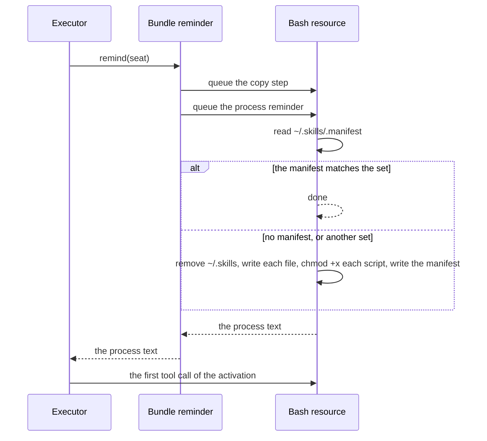

# Skills

**A skill is a set of instructions that an agent reads when a task needs
them.** Each skill is a folder in the [agentskills.io](https://agentskills.io)
format: a `SKILL.md` with a name and a description, and any scripts,
references, and assets that the instructions use. The model sees the name
and the description of each skill. It reads the rest when the task matches.

**The skills of an agent are part of its definition.** The host reads them
once with `loadSkills`, before it defines the agent, and gives the set to
the workspace bundle of that agent. Two agents that share a workspace and
every git template still have their own skills.

**Each agent reads its skills from its own home.** At the start of each
respond activation, the workspace makes `~/.skills` in the agent's home
hold the files of the set. The seat reads a skill with `read` and runs a
script with `bash`. Pi, Claude, and Codex seats hold the same workspace
tools, so a skill works the same on each harness.

**`@ambionframework/workspace` implements this page.**

| File              | Holds                                                                  |
| ----------------- | ---------------------------------------------------------------------- |
| `skills.ts`       | `loadSkills`, the checks, the guidance, and the copy step              |
| `skill-macros.ts` | The macro files: the header, the body, and the hash                    |
| `skill-text.ts`   | The error of a skill set, the names, and the YAML header               |
| `sources.ts`      | `fromDirectory`, the source types, and the blob hashes of a set        |
| `workspace.ts`    | `tools({ skills })`: the guidance, the reminder, and the tool wrappers |

## Words

| Word      | Meaning                                                                            |
| --------- | ---------------------------------------------------------------------------------- |
| skill     | One folder with a `SKILL.md`, and the scripts, references, and assets beside it    |
| skill set | The skills of one agent, checked and frozen by `loadSkills`                        |
| copy      | The files of a skill set in `~/.skills` in the agent's home                        |
| manifest  | `~/.skills/.manifest`: the path and the blob hash of each file of the copy         |
| script    | A file under `<skill>/scripts/`. The copy makes it executable                      |
| macro     | A file `<skill>/macros/<name>.js`. A seat runs it by name with `compose`           |
| resource  | Any other file of a skill, such as `references/limits.md` or `assets/slab.png`     |
| source    | Where the files come from: `fromDirectory(path)`, or the text of each file by path |

## Write a skill

**A skill set is a folder of skill folders.** The name of each skill folder
is the name of the skill. The folder holds `SKILL.md` and any other files.

```text
agents/surveyor/skills/
  pour-plan/
    SKILL.md
    scripts/
      tonnage.sh
    references/
      limits.md
    assets/
      slab.png
  site-diary/
    SKILL.md
```

**`SKILL.md` starts with YAML frontmatter between two `---` lines.** The
frontmatter ends at the first line that holds `---` alone. The body holds
the instructions. A path in the body is relative to the folder
of the skill.

```markdown
---
name: pour-plan
description: Check a concrete pour plan against the tonnage. Use it when a person asks whether a pour fits the limits.
---

1. Run `scripts/tonnage.sh <volume in m3>` to get the tonnage.
2. Read `references/limits.md` for the limit of one pour.
3. Say whether the pour fits, and cite the limit.
```

**A script is an ordinary file under `scripts/`.** Start it with a `#!`
line. The copy makes it executable, so the seat runs it by its path. The
seat can also run it with an interpreter, such as `bash scripts/tonnage.sh`.

```sh
#!/bin/bash
echo "tonnage for $1 m3: $(( $1 * 24 / 10 )) t"
```

## Give an agent its skills

**`loadSkills(source)` reads the source once and checks each skill.** A
source is `fromDirectory(path)`, which reads a folder on the host, or an
object that maps each path to its text. `fromDirectory` reads bytes, so an
asset can be binary. Call `loadSkills` before you define the agent: a skill
that breaks a rule stops the host with an error that names the file.

**`workspace.tools({ skills })` gives the set to one agent.** The bundle
holds a tool for each tool of `workspace.tools()`, with the same name. Its
guidance lists the skills, and its reminder makes the copy.

```ts
import { defineAgent } from '@ambionframework/ambion';
import { claude } from '@ambionframework/claude';
import { pi } from '@ambionframework/pi';
import { fromDirectory, loadSkills, openWorkspace } from '@ambionframework/workspace';
import { memoryBackend } from '@ambionframework/just-bash';

const drive = openWorkspace({ name: 'site', backend: { bash: memoryBackend() } });
const surveyorSkills = await loadSkills(fromDirectory('./agents/surveyor/skills'));
const clerkSkills = await loadSkills({
  'filing/SKILL.md': '---\nname: filing\ndescription: File a site report.\n---\nSteps.\n',
});

const surveyor = defineAgent({
  name: 'surveyor',
  identity: 'Quantity surveyor. Holds the tonnage.',
  executor: claude({
    model: 'claude-sonnet-5',
    instructions: 'Use your skills before you answer.',
    bundles: [drive.tools({ skills: surveyorSkills })],
  }),
});

const clerk = defineAgent({
  name: 'clerk',
  identity: 'Files the site reports.',
  executor: pi({
    model: 'anthropic/claude-sonnet-5',
    instructions: 'File each report the day it arrives.',
    bundles: [drive.tools({ skills: clerkSkills })],
  }),
});
```

**Two agents share skills when they share a set.** Pass the same set to the
bundle of each agent. Each agent still gets its own copy in its own home.

**An agent takes one workspace bundle.** A definition with both
`drive.tools()` and `drive.tools({ skills })` holds each tool twice, and
`defineAgent` refuses it. Give the agent the bundle with skills alone.

**`tools()` with no skills keeps one stable bundle.** Each call with
`skills` returns a new bundle, whose tools run the tools of `tools()`. `tools` throws when
`skills` is a value that `loadSkills` did not make.

## The rules that `loadSkills` checks

**`loadSkills` applies the rules of agentskills.io, and refuses a set that
breaks one.** The error starts with `Skill set:` and names the file.

| Rule                                                                                        | Refused example                   |
| ------------------------------------------------------------------------------------------- | --------------------------------- |
| Each path is relative, with no empty, `.`, or `..` segment and no backslash                 | `a/../b/SKILL.md`                 |
| Each file is inside a skill folder                                                          | `README.md` at the root           |
| Each skill folder holds a `SKILL.md`                                                        | `notes/draft.md` with no SKILL.md |
| `SKILL.md` is UTF-8 text that starts with frontmatter between two `---` lines               | A body with no frontmatter        |
| The frontmatter is a YAML mapping                                                           | `- a`                             |
| `name` equals the folder name                                                               | `name: b` in the folder `a`       |
| `name` has 1 to 64 characters of `a-z`, `0-9`, and single hyphens, with no hyphen at an end | `Pour`, `a--b`, `-a`              |
| `description` is text that is not blank, of at most 1024 characters                         | No `description`                  |
| `compatibility`, when present, is text of at most 500 characters                            | 501 characters                    |
| Each macro file passes the rules of [Macros](#macros)                                       | A `macros/x.js` with no header    |
| The set holds at least one skill                                                            | An empty folder                   |

**Other frontmatter fields stay in the file, and the room reads none of
them.** `license`, `metadata`, and `allowed-tools` reach the model only when
it reads `SKILL.md`. The workspace does not limit the tools of a seat by
`allowed-tools`.

## Macros

**A macro is a compose program that the skill stores.** The skill holds
the code once, and the model runs it by name with `compose`. The model
writes a name and arguments. The macro runs the tools
that it declares, through one nested-call path, with the provenance, the
steps, and the audit of any compose call. [Compose](compose.md#macros)
states how `compose` runs it.

**A skill holds a macro in `macros/<name>.js`.** The agentskills.io format
allows any folder in a skill, so other harnesses ignore this one.

```text
lab-drift/
  SKILL.md
  macros/
    snapshot-drift.js
```

**The file opens with a YAML block comment, and then the body.** The header
lies between a `/*---` line and a `---*/` line. `loadSkills` strips the
comment marks and reads the lines with the frontmatter parser of `SKILL.md`.
The body is the body of the async function that `compose` runs, with one
more global, `args`.

```js
/*---
description: Snapshot the files of every run with a label. Returns the count and the refs.
uses: [sql, snapshot]
args:
  type: object
  properties: { label: { type: string } }
  required: [label]
---*/
const runs = await tools.sql({
  sql: 'SELECT path FROM runs WHERE label = ?',
  params: [args.label],
  rows: 500,
});
const { refs } = await tools.snapshot({ paths: runs.rows.map((row) => row.path) });
return { runs: runs.count, refs };
```

**`SKILL.md` names the macro and does not quote it.** The macro is
`<skill>/<macro>`, here `lab-drift/snapshot-drift`.

```markdown
1. Run the macro `lab-drift/snapshot-drift` with `{ "label": "drift" }`.
2. Cite the refs in your say.
```

**The header has three fields, and `loadSkills` refuses any other.**

| Field         | Rule                                                                      |
| ------------- | ------------------------------------------------------------------------- |
| `description` | Text that is not blank, of at most 1024 characters. The guidance shows it |
| `uses`        | A non-empty list of tool names. The macro binds these tools alone         |
| `args`        | Required. A JSON Schema object that the arguments must satisfy            |

**`loadSkills` refuses a macro file that breaks a rule.** The error starts
with `Skill set:` and names the file.

| Rule                                                                            | Refused example                  |
| ------------------------------------------------------------------------------- | -------------------------------- |
| The file is UTF-8 text that starts with a header in a `/*---` and `---*/` block | A body with no header            |
| The header is a YAML mapping with the fields above and no other field           | `when: always`                   |
| The name of the file has the rules of a skill name, before `.js`                | `Snap_Shot.js`, `a--b.js`        |
| The file sits directly in `macros/`                                             | `macros/more/one.js`             |
| `description` and `uses` follow the table above                                 | `uses: []`                       |
| `args` is JSON Schema of draft 2020-12 with the keywords that the check reads   | `type: banana`, `$ref`, `format` |

**The check of `args` refuses a keyword that `Check` ignores.** TypeBox
ignores a keyword that it does not know, so a schema with one would
accept every value. The keyword list is in
[Compose](compose.md#macros). A file in `macros/` that does not end in `.js`
is a resource of the skill.

**`loadSkills` keeps the text and the hash of each macro.** The set holds
`set.macros`: for each file, the name, the description, `uses`, the `args`
schema, the body as text, and the git blob hash of the whole file. The
hash covers the header and the body. `Object.freeze` does not freeze the
bytes of a file, so the set keeps the text of the macro. The copy in
`~/.skills` holds the file too, so the model can read the code.

**`workspace.tools({ skills })` puts the macros on the bundle.** The
bundle field is `macros`. A seat with the `compose` option lists them in the
guidance of `compose`, and runs them by name. A seat with no `compose`
option takes the same set and lists no macro. `describeExecutor` refuses a
macro that names a tool which the catalog lacks. Two macros with one name
are an error. See [Compose](compose.md#macros).

**A macro sends model data to tools, so treat it as a public API.** The
model chooses `args`.

- **Check `args` with the schema.** `compose` checks them before it runs
  any code.
- **Pass SQL values through `params`.** The `sql` tool binds them
  ([Workspace](workspace.md#query-the-shared-database)). Never join `args` into the
  text of a statement.
- **Quote a value that goes into a shell command.** Pass it to `bash` as a
  quoted word.

### What a macro keeps, and what it does not

**A macro runs from the frozen set of the definition.** `compose` never
reads `~/.skills`. An agent that edits its copy of a macro changes nothing
that runs.

| Part                                | Protected                                                                 |
| ----------------------------------- | ------------------------------------------------------------------------- |
| The body, `uses`, and `args` schema | Yes. They come from the set, and `approve` sees the hash                  |
| A script that the body runs by path | No. `bash ~/.skills/<skill>/scripts/x.sh` runs the editable copy          |
| `SKILL.md`                          | No. The copy decides which macro the model runs, and with which arguments |
| A macro that calls a macro          | Not supported. `tools` binds native tools alone                           |

**On `memoryBackend` and `directoryBackend`, any agent can write the copy.**
A macro body that runs a script of the copy gives up its integrity. Write
the work in the body, or call a tool that the host owns.

## What the model reads

**The guidance of the bundle lists each skill.** Pi's
`formatSkillsForSystemPrompt` writes the list, and the bundle adds two
lines about the copy. The guidance goes in the system prompt of every
activation, after the guidance of the workspace tools.

```text
The following skills provide specialized instructions for specific tasks.
Read the full skill file when the task matches its description.
When a skill file references a relative path, resolve it against the skill directory (parent of SKILL.md / dirname of the path) and use that absolute path in tool commands.

<available_skills>
  <skill>
    <name>pour-plan</name>
    <description>Check a concrete pour plan against the tonnage. Use it when a person asks whether a pour fits the limits.</description>
    <location>~/.skills/pour-plan/SKILL.md</location>
  </skill>
</available_skills>
Your skills are in ~/.skills. The folder of a skill also holds its scripts and
resources. Read a file with read, and run a script with bash.
```

**The location starts with `~`.** `read` and `bash` resolve `~` to the home
of the calling agent. The guidance is fixed
when the agent is defined, and a workstation account gets its home from
the server, so the guidance does not name the absolute path.

## The copy in the home

**Each respond activation makes the copy hold the set.** The reminder of the
bundle queues the copy step on the bash resource, and then gives the process
reminder ([Reminders](processes.md#reminders)).



**The copy step has two costs.**

- **A matching manifest costs one read.** This is the usual case.
- **Another manifest, or none, costs one write for each file.** This
  happens at the first activation of the agent, after the set changes, and
  after the manifest goes. The step also runs one `chmod` command when
  the set has a script.

**The copy ends before the first tool call of the activation.** The bash
resource runs its operations in order, and the reminder queues the copy
before the model makes a request. The reminder does not wait for the
copy, so the 5-second bound of a reminder does not cut it. A long copy
delays the process reminder behind it. A copy that takes more than 5
seconds loses the process list of that one activation.

**The manifest is written last.** A copy that fails, or that a crash cuts,
leaves no manifest. The next respond activation writes the whole copy
again. A failed copy shows to the model only as a `read` that finds no
file.

**The copy step reads nothing but the manifest.** An agent that edits a
file of its copy, and leaves the manifest, keeps the edit until the set
changes or the manifest goes. Remove `~/.skills/.manifest` to restore the
copy at the next activation.

**A run with no reminder copies at its first tool call.** Pi's `runAgent`
runs an agent outside a room and resolves no reminder. Each tool of the
bundle queues the copy before its own operation when the bundle has not
copied for that agent in this process. In a room, the reminder has already
copied, so a tool call adds no operation.

**A summarize activation makes no copy.** The executor calls no reminder
for it, and a summary activation holds `say` alone.

## Scripts and resources

**A script runs in the shell of the bash backend, as the agent.**

| Backend                  | What a script can run                                   |
| ------------------------ | ------------------------------------------------------- |
| `memoryBackend`          | The commands that just-bash implements, in memory       |
| `directoryBackend`       | The commands that just-bash implements, over the folder |
| The workstation over SSH | The programs of the server, in the agent's account      |

**Write each script for the backend that runs it.** A script that needs a
program the backend does not have fails with the error of the shell. The
`compatibility` field can state what a skill needs, and the model reads it
in `SKILL.md`.

**A resource is a file that the seat reads.** `read` gives the text of a
reference. An asset can be binary, and the copy keeps its bytes. A script
or a command of the seat reads an asset by its path in the copy.

## Separation and trust

**The copy of each agent is in its own home.** What protects it depends on
the backend.

| Backend                  | Who can change the copy of `surveyor`                                          |
| ------------------------ | ------------------------------------------------------------------------------ |
| `memoryBackend`          | Every agent of the workspace. The backends share one filesystem with no owners |
| `directoryBackend`       | Every agent of the workspace, and every host process that can write the folder |
| The workstation over SSH | `surveyor` alone. Each home is mode `0700` for its own account                 |

**The set in the definition does not change.** An edit of the copy lasts
until the copy step writes it again. The macros of the set run from the
set, so an edit of a macro file in the copy changes none of them. [Trust](trust.md#what-the-kernel-does-not-defend)
states what the kernel does not defend.

## Skills and git templates

**A skill tells an agent how to do a task, and a git template gives it
material to start from.** Use each for its own job.

| Question                     | Skill                                  | Git template                                 |
| ---------------------------- | -------------------------------------- | -------------------------------------------- |
| Whose is it                  | One agent's, from its definition       | Every agent's, from the git backend          |
| Does the agent change it     | No. The copy step restores it          | Yes. The agent forks it and changes the fork |
| How the model finds it       | The guidance lists it every activation | `repos` lists it when the agent asks         |
| What the agent makes from it | Nothing. The agent follows it          | A repository of its own                      |

**A skill can tell an agent to fork a template.** The body of `SKILL.md`
names the template and the steps: `fork` it, change the clone, and push.
See [Git](git.md).

## Limits

- **The model finds a skill by its description alone.** The room gives no
  command that invokes a skill by name.
- **`loadSkills` sets no size limit.** Each file of the set is in the
  memory of the host, and each copy writes every file.
- **The guidance lists every skill of the set.** Each skill adds its name,
  its description, and its location to the system prompt of every
  activation.
- **The workspace does not read `allowed-tools`.** A seat holds the tools
  of its definition, whatever a skill names.
