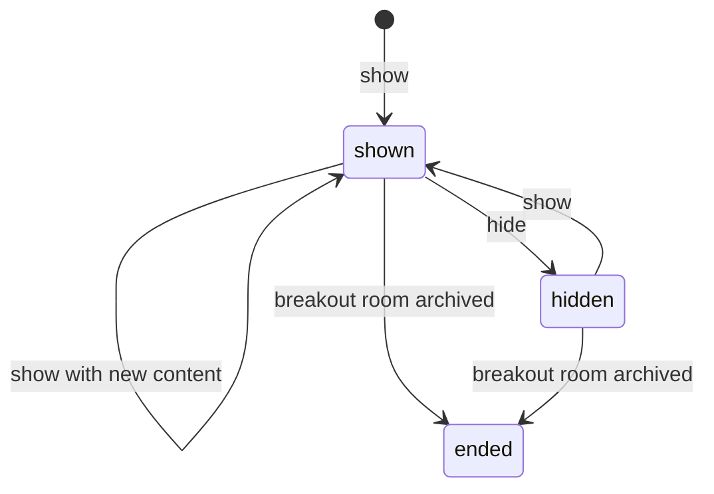
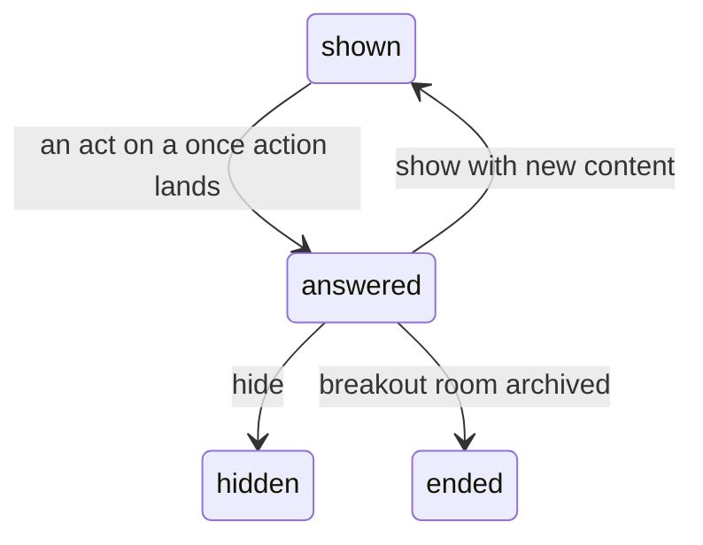
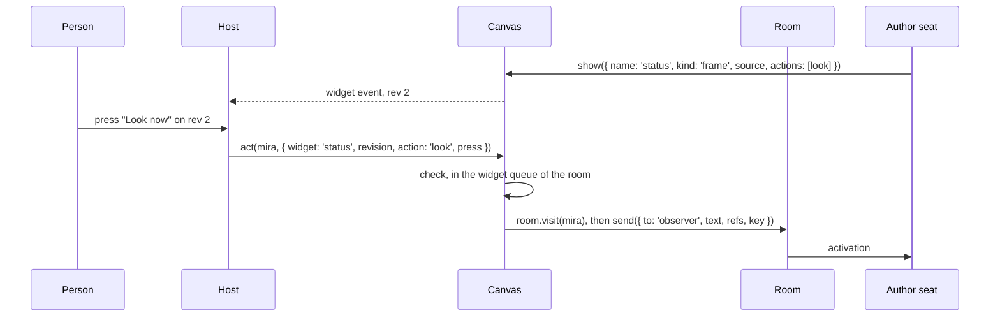

# Widgets

> **Status: the package `@ambionframework/canvas` implements this page.** It
> holds the store of revisions, `show`, `hide`, the reminder, the `widget`
> and `answered` events, the acts of people, and the host reads. The
> [canvas](canvas.md) holds the rooms, and widgets extend it.

**A widget is a live view that an agent places in a room for people.** A
view of a running process and a pinned test plan are widgets. The agent
declares what the widget shows and where the data comes from. The host reads
the data and draws it, with no activation.

**A widget can also ask.** The agent declares actions on the widget, and a
person presses one. The press becomes a message of the person in the room,
and the author of the widget answers it.

## Four owners

| Owner   | Holds                                            | Writes it                         |
| ------- | ------------------------------------------------ | --------------------------------- |
| Journal | What people and agents said and decided          | The room                          |
| Canvas  | Which widgets each room shows, as revisions      | Agents, through `show` and `hide` |
| Source  | The data: a process, a file, a snapshot          | The workspace and its processes   |
| Host    | How a widget looks, and each person's local view | The host                          |

**The canvas holds intent and decides nothing.** If losing a fact would
change what the room decided, the fact is a journal entry. If losing it
changes only what people see, it is canvas state. The canvas never reads
a source.

## The views

### What a person can do

**One question sorts each interaction: does it direct work?**

| Interaction                                    | Directs work | Result                                |
| ---------------------------------------------- | ------------ | ------------------------------------- |
| Look: scroll, zoom, collapse, dismiss, reorder | No           | The host alone. No agent learns of it |
| Act: press a button, submit a form             | Yes          | A message of the person               |
| Speak: type in the composer                    | Yes          | A message of the person               |

**A look stays in the host.** Scroll, zoom, collapse, dismiss, and reorder
direct no work, so no agent learns of them. A dismiss hides a widget from
that person alone. The host may keep it per person across restarts.

**An act is speech.** A press becomes a message of the person, through the
person's visit ([The acts](#the-acts)). No act writes to the canvas, and a
lost canvas keeps every act, since each act is a message in the journal.

**People do not write widget revisions.** A person who wants a widget gone
for everyone says so, and an agent hides it. So each revision has an agent
author, and the reason for it is on the record.

### The model

```ts
interface CanvasWidget {
  readonly room: string;
  /** Unique in the room. The shared name syntax, 48 characters at most. */
  readonly name: string;
  /** A new id for each revision. */
  readonly revision: string;
  /** Counts the revisions of this name, from 1. */
  readonly rev: number;
  readonly state: 'shown' | 'hidden';
  /** One kind of the host catalog. */
  readonly kind: string;
  readonly source?: WidgetSource;
  /** One line, 80 characters at most. */
  readonly title?: string;
  /** The agent that wrote this revision. */
  readonly author: string;
  /** What a person can do. No actions: the widget is a view. */
  readonly actions: readonly WidgetAction[];
  /** The one person who may act. Absent: any person on a visit. */
  readonly for?: string;
}

type WidgetSource =
  | { readonly type: 'process'; readonly handle: string; readonly path: string }
  | { readonly type: 'file'; readonly path: string }
  | { readonly type: 'snapshot'; readonly ref: string };

interface WidgetAction {
  /** The shared name syntax. */
  readonly id: string;
  /** One line, 40 characters at most. */
  readonly label: string;
  /** The first act on the revision answers it. A later act with other content is `answered`. */
  readonly once?: boolean;
  /** A form: 8 fields at most. */
  readonly fields?: readonly WidgetField[];
}

/** `name` follows the name syntax. `label` is one line, 40 characters at most. */
type WidgetField =
  | { readonly name: string; readonly label: string; readonly type: 'text' } // one line, 200 characters at most
  | {
      readonly name: string;
      readonly label: string;
      readonly type: 'number';
      readonly min?: number;
      readonly max?: number;
    }
  | { readonly name: string; readonly label: string; readonly type: 'boolean' }
  | {
      readonly name: string;
      readonly label: string;
      readonly type: 'choice';
      readonly options: readonly string[];
    }; // 10 options of 40 characters at most

interface WidgetKind {
  readonly name: string;
  /** One line for the guidance. */
  readonly description: string;
  /** The source types that the kind takes. A kind with none takes no source. */
  readonly sources: readonly WidgetSource['type'][];
  /** True when the host can draw actions on this kind. */
  readonly actions: boolean;
}

interface WidgetOptions {
  /** The kinds that the host draws. A `show` names one of them. */
  readonly kinds: readonly WidgetKind[];
}
```

**The host declares a closed catalog of kinds.** `openCanvas` takes
`widgets: { kinds }`, and it refuses a catalog with a duplicate kind. The
canvas refuses a kind outside the catalog and a source type that the kind
does not take. A kind with no source types takes no source, and a kind with
source types needs one. The guidance lists the catalog, so an agent places
only what the host can draw.

| Host        | Catalog                                                             | First widget  |
| ----------- | ------------------------------------------------------------------- | ------------- |
| Camera chat | `frame`: the newest frame that a process serves, with actions       | A viewfinder  |
| Workbench   | `markdown`, `table`, `image`: a file of the workspace, with actions | A pinned file |

**The canvas refuses actions on a kind that draws none.** A kind with
`actions: false` takes no `actions` and no `for`. A `for` with no actions is
a refusal too. A widget has 8 actions at most, with unique ids. An action
has 8 fields at most, with unique names. A number field has a `min` that
does not pass its `max`. A choice field has 1 to 10 options, each one line
of 40 characters at most, with no repeat. The guidance tells each agent which
kinds take actions.

**A process source names the handle of a process of the author, and a path
that the process serves on its port.** The agent takes the handle from the
bash result or the process reminder. The canvas keeps the handle and the
path as text, and holds no index of processes. The host checks once that
the handle is in the author's process list and runs, then reads the path
by handle, as `fetch` does. A widget never reads the process of another
agent. The end of the process leaves the widget in place, and the host
draws nothing for it. A new process has a new handle, so the agent calls
`show` with the new handle. A `show` with another handle binds the new
process.

**A file source is read as the author.** The host checks the size first
and caps the bytes. A snapshot source is immutable, so it shows evidence.
A process source shows live data, which the record cannot cite.

### The lifecycle



**The store keeps `shown` or `hidden`, and the rest is derived.** A widget
is `ended` when its room row is archived. A root room never archives, so
its widgets end with `hide` alone.

**A revision is immutable, and the store keeps every revision.** A revision
resolves by id for as long as the canvas exists.

**A `show` that changes nothing writes nothing.** The content is `kind`,
`source`, `title`, `actions`, and `for`. A `show` with the content of a
`shown` current revision writes no revision, so a retried activation changes
nothing. A `show` of a `hidden` widget always writes one. A `show` that
changes the actions or `for` writes a revision, so an act on the older
revision is `stale`.

**A revision is `answered` when its room holds a message with the key
`act:<revision>`.** Only an action with `once` writes that key. The canvas
learns the answers in two ways. At each start of a room, it reads the keys
of the room once. Each act then passes through `canvas.act`. The answers
derive from the journal, so the store holds none, and a restart loses none.
A retried activation leaves an answered question answered, since a `show` of
equal content writes nothing. An agent that asks again changes the content or
picks a new name.



| Event                               | Widgets                               | Acts                                                      |
| ----------------------------------- | ------------------------------------- | --------------------------------------------------------- |
| An agent shows or hides             | A new revision and a widget event     | An act on an older revision or a hidden widget is `stale` |
| An act on a `once` action lands     | The revision is `answered`            | A later act with other content is `answered`              |
| The author leaves or is unseated    | Stay; the reminder names the author   | Sent with no `to`                                         |
| The person leaves the room          | Stay                                  | A press opens a visit first                               |
| The host stops the room             | Drawn stopped; the host polls nothing | Refused                                                   |
| The host starts or resumes the room | Bound again from the revisions        | Accepted                                                  |
| The opener archives a breakout room | Ended; the host draws nothing         | Refused                                                   |
| The host closes the canvas          | Revisions kept                        | Refused                                                   |

**A stopped room polls nothing.** No seat can change its widgets. Its
source can still run: a process stays up until an agent or the host
cancels it.

**The host binds again at each start.** `resume` emits no widget event for
the revisions that it loads, and an adopted process fires no process event.
So on each room `started` event, the host reads `canvas.widgets(room)` and
lists the processes of each author. An adopted process keeps its handle, so
the handle of a widget still binds. The host reads the widgets again on each
widget event. A process `ended` event for a bound handle clears that
binding alone.

### The store

**The store appends revisions and never changes one.** The canvas makes
each revision id with `randomUUID`, so an id never repeats, even after a
lost store. `resume` loads every revision, so the reads of the canvas
stay synchronous.

```ts
interface CanvasStore {
  // The room methods, and:
  /** Every revision, in the order of insertion. */
  revisions(): Promise<readonly CanvasWidget[]>;
  /** Appends one revision. A revision id that exists stays as it is. */
  appendRevision(widget: CanvasWidget): Promise<'inserted' | 'exists'>;
}
```

**SQLite adds one table.** `canvas_widget_revisions` holds an
autoincrement position that keeps the order, the unique id, the room, the
name, `rev`, and the revision as JSON. The table is unique on
`(room, name, rev)`, so a defect in the count of revisions fails the
write. `canvasStoreConformance` covers the append, the repeat, and the
order.

### The tools

**`canvas.widgetTools()` gives an agent `show` and `hide`.** A host gives
the bundle to the seats of root rooms and to the worker team.

| Tool   | Parameters                                              | Effect                                                           |
| ------ | ------------------------------------------------------- | ---------------------------------------------------------------- |
| `show` | `name`, `kind`, `source?`, `title?`, `actions?`, `for?` | Writes a new revision, `shown`. Equal content changes nothing    |
| `hide` | `name`                                                  | Writes a new revision, `hidden`. A hidden widget changes nothing |

**The widget calls of one room run one at a time.** `show`, `hide`, and
`act` run in a widget queue for the room name. So a check and the write
after it see the same revision. The queue is apart from the lifecycle queue of the room,
so a stop never waits behind a widget call.

**Any seat of the room may change any widget.** One seat can already
steer another ([Trust](trust.md)). Each revision names its author. The hide
revision copies the content and names the hider as its author.

**The reminder lists the shown widgets of the room.** It reads the
revisions and the answers from memory, so the reminder bound cannot cut it.
It gives at most ten lines, then `and N more`. A line names the person that
the widget is for, and the person who answered it with the seq of the act.

```text
Widgets in this room:
- front: frame from process bash-4k2 /status, by observer, rev 2
- keep-clip: choice for mira, by observer, rev 1, answered by mira in #88
```

### The host interface

```ts
interface Canvas {
  /** The widget bundle: show, hide, and the reminder. A refusal with no widgets.kinds. Call it before defineAgent. */
  widgetTools(): ToolBundle;
  /** The current revision of each widget of a room, hidden ones included. Empty before resume. */
  widgets(room: string): readonly CanvasWidget[];
  /** One revision by id, or undefined. Read at resume. */
  revision(id: string): CanvasWidget | undefined;
  /** The act that answers each answered revision of a room: its seq and the person. Empty before resume. */
  answers(room: string): ReadonlyMap<string, { readonly seq: number; readonly by: string }>;
  /** Checks an act, then sends it through the visit of the person in that room. */
  act(person: PersonDefinition, act: WidgetAct): Promise<WidgetActResult>;
}

/** `CanvasEvent` has these variants. */
type WidgetEvent = { readonly type: 'widget'; readonly widget: CanvasWidget };
type AnsweredEvent = {
  readonly type: 'answered';
  readonly room: string;
  readonly revision: string;
  readonly seq: number;
};

interface WidgetAct {
  readonly room: string;
  readonly widget: string;
  /** The revision that the person saw. */
  readonly revision: string;
  readonly action: string;
  readonly values?: Readonly<Record<string, string | number | boolean>>;
  /** A token for one press. The host saves it before the call and reuses it on a retry. */
  readonly press: string;
}

type WidgetActResult =
  | { readonly kind: 'sent'; readonly seq: number }
  | { readonly kind: 'stale'; readonly widget: CanvasWidget }
  | { readonly kind: 'answered'; readonly seq: number };
```

**A bad call of `show`, `hide`, or `act` is a refusal.** It throws an
`AmbionError` with the code `refused`. `stale` and `answered` are results,
since the host draws them. The `answered` event fires once for each revision,
when the canvas learns its answer from an act. The host reads
`canvas.answers(room)` on each room `started` event, as it reads the widgets.

**`CanvasOperation` has four values for widgets.** `show` and `hide` name a
failed store write. `widget` names a failing listener of the `widget` event.
`act` names a failing listener of the `answered` event, and a failed act that
is no refusal.

### Durability

| Write  | Key            | A repeat after a crash             |
| ------ | -------------- | ---------------------------------- |
| `show` | `(room, name)` | Equal content changes nothing      |
| `hide` | `(room, name)` | Finds `hidden` and changes nothing |

**Revision ids never repeat.** The canvas makes each one with
`randomUUID`, so an id stays unique when a canvas store is lost and a new
one starts.

### Trust

**Agent text reaches people, so the canvas bounds it.** Names follow the
name syntax. Titles are one capped line, so they cannot forge a reminder
line. The host draws text as text and drops terminal escapes.

**A hidden widget does not stop its source.** Hiding a widget leaves
the process running. The guidance tells the agent to cancel the process to
stop it.

## The acts

### An act, end to end



**The canvas checks in a fixed order.**

1. The canvas is open, and the room row is `running` with a live handle.
2. The press has not landed. The revision of the act fixes both keys, so
   the canvas looks them up in the journal before any other check. A press
   that landed returns its result, as the key table says, even when the
   author has since hidden the widget, shown a new revision, or left.
3. The widget is `shown` and `revision` is its current revision. Otherwise
   the result is `stale` with the current widget, and the host draws it
   again. A widget that the room does not hold is a refusal.
4. The action exists, the person of the visit matches `for`, the values
   match the fields, and `press` is one line of 100 characters at most.

**The canvas sends through its own handle of the room.** It calls
`room.visit(person)` on the handle of `act.room`, so the act lands in the
room of the widget. A second visit of a present person is the same visit.
A person who has left arrives first, and the arrival enters the record
before the act.

**The values follow the fields.** Every field is required, and a value for
no field is a refusal. A text value is one line of 1 to 200 characters. A
number value is finite and inside `min` and `max`. A boolean value is a
boolean. A choice value is one of the options.

**The canvas composes the message.** The text names the widget and its
rev, then quotes the title when the widget has one, the label, the action
id, and one `label: value` line for each field. An agent reads it with no
lookup:

```text
status, rev 2 "Status": Look now [look]
```

**The message carries one ref to the revision.** The ref is
`ambion-canvas://<canvas>/room/<room>/widget/<name>/revision/<id>`. The
kernel accepts any scheme besides `ambion` and never reads behind a ref.
`canvas.revision(id)` resolves it.

**The recipient is the author when the author can hear.** The `to` is the
author of the revision when the author is on the roster at an attention
other than `none`. Otherwise the message has no `to`. The bridge of the
canvas uses the same rule.

**The key makes an act land once.**

| Action    | Key                      | A repeat of the same press | A repeat with other content |
| --------- | ------------------------ | -------------------------- | --------------------------- |
| `once`    | `act:<revision>`         | Returns the landed message | `answered`, with its seq    |
| Any other | `act:<revision>:<press>` | Returns the landed message | A refusal: a host defect    |

The same press has the same person, text, and ref. The `to` is not part of
the match, so a retry after the author left the roster finds the landed
message. A `once` key with other content is `answered`, with the seq under
the key. A press key with other content is a refusal. A host that loses
the result of an act sends it again with the same `press`, and the act
lands once. A second press on a `once` revision with the same content is
the same press, so it returns `sent`. A non-once action on that revision
lands under its own key.

**A stop or an archive can race an act.** The widget queue and the
lifecycle queue of a room are apart. An act that passed its checks before a
stop or an archive may still land, and an act that meets the stop in its
send is a refusal.

### Effects on the room

**An act is a message of a person.** The kernel rules for a message of a
person apply unchanged.

| Room state when the act lands        | Effect                                                            |
| ------------------------------------ | ----------------------------------------------------------------- |
| Quiet                                | Opens an exchange. The person directs it and receives its summary |
| An exchange is open                  | Joins it. With a `to`, it activates or steers the author alone    |
| Any, with no `to`                    | Activates or steers every seat at `broadcast`                     |
| A closed exchange awaits this person | The person spoke, so the `awaiting` outcome clears                |

**An agent that asks with a widget ends its activation.** It shows the
widget and says to the person what it needs. The act arrives as a later
message and activates it again.

**A question to the opener of the exchange closes `complete`.** The
exchange does not await that person
([backlog Q2](../planning/backlog.md)). The act still arrives and opens
the next exchange. Only the attention line of the host misses the open
question.

**Agent changes are silent.** `show` and `hide` add no entry and activate
no seat. An agent that wants people to notice a widget says so in the
room.

### Durability of acts

| Write  | Key         | A repeat after a crash |
| ------ | ----------- | ---------------------- |
| An act | The act key | Lands once             |

### Trust of acts

**A misleading widget is on the record.** The act message quotes what
the person saw, and its ref names the revision.

**The act message is the evidence of a decision.** The visit gives the
identity, and `for` limits who may act. A resource that must verify a
decision checks the act message in the journal: its author, its key, and
its revision ref. Give each decision a `for`. Titles, labels, options, and
text values are one capped line, so they cannot forge a reminder line. The
reminder holds names, kinds, sources, and seqs, and no label. The act
message quotes the labels, so a label can imitate a `label: value` line
inside that one message.

## Out of scope

- **Agent-written HTML or JS.** The catalog is closed.
- **Layout hints.** The host places widgets.
- **Widgets for one person.** Every visitor sees a widget.
