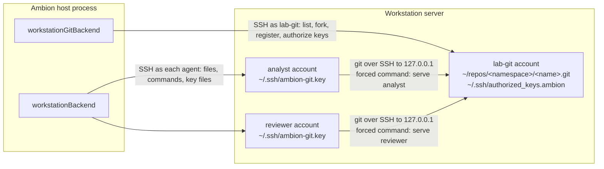

# A git backend on the workstation

**`@ambionframework/workstation` implements this page.**
`workstationGitBackend` is a second `GitBackend` for the
[git contract](git.md). It keeps the repositories on the
[workstation](workstation.md), in the home of one dedicated account, and
each agent reaches them with `git` over SSH. Items G1 and G2 of
[the plan](../planning/next.md#g-git-on-the-workstation) hold the reasons
for the work.

**The backend reuses the SSH code of the package.** The client of the git
account is the same kind of SSH session, with the same environment over
SFTP and `exec`, that the bash backend opens for each agent. The backend
adds no dependency.

## Why the workstation needs its own backend

**The git backend of 0.2.0 ran in the host's process.** `gitBackend`
served the just-bash `git` through a `fetch` in the same process. A real
`git` on a workstation reached it only over HTTP, through a listener on
the host. The default `url`, `http://git.ambion.invalid`, never resolved.
With the defaults, `connect` succeeded, and the first `git clone` of an
agent failed on DNS.

**The HTTP path had three costs on a workstation.**

- **The host opened an inbound port.** The server had to reach the Ambion
  host, and a firewall or a NAT between the two blocked it.
- **Each token crossed the network in HTTP basic authentication.** A
  plain `http` URL sent it in clear text. `https` needed a certificate and
  a proxy in front of `handler`.
- **The code lived on the host, and the working copies lived on the
  server.** A command on the server that wanted the code cloned it across
  the network.

**0.3.0 gives each deployment shape one package.** The local shape, one
node that runs the host and every agent, is `@ambionframework/just-bash`,
with `justGitBackend` in its `./git` entry. The lab shape, a host on one
machine and a workstation on another, is `@ambionframework/workstation`,
with `workstationGitBackend`. `openWorkspace` refuses a git backend of one
shape beside a bash backend of the other.

**This backend keeps the git traffic inside the server.** The agent's
`git` connects to the `sshd` of its own server, on the loopback address.
The host needs no listener. The host reaches the server over SSH, the same
as the bash backend does.

**The design has one cost against the tokens of `justGitBackend`: a
leaked credential reaches more.** A token grants one scope on one
repository. An agent key names the agent, and `serve` grants every
repository in that agent's namespace. Every account on the server shares
the loopback address, and the room mirror puts the record on the same
server. A key that an agent copies into a message lets any peer on the
server push as that agent until the key expires, at most `keyTtl` later.
[Trust](#trust) states the rows.

## The shape



**One account owns every repository.** The host names the account in the
`account` option. This page calls it `<workspace>-git`, such as `lab-git`.
Its home has mode `0700`, so no agent reads a repository from the disk.
Every read and every push goes through `sshd` and one forced command.

**Each agent holds one key for the git account.** The backend issues the
key, and the bash backend writes it into the agent's home. The git
account lists the public key with a forced command that names the agent.
The server reads the caller's name from that line.

**The host drives the git account over its own SSH client.** `list`,
`get`, `fork`, and template registration run as short scripts on the
server. The host runs no git library.

## Use

```ts
import { readFile } from 'node:fs/promises';
import { fromDirectory } from '@ambionframework/workspace/git';
import { openWorkspace } from '@ambionframework/workspace';
import { workstationBackend, workstationGitBackend } from '@ambionframework/workstation';

const server = {
  host: 'lab.internal',
  hostKey: 'SHA256:<the fingerprint that ssh-keygen -lf prints>',
};

const lab = openWorkspace({
  name: 'lab',
  backend: {
    bash: workstationBackend({
      ...server,
      layout: { audit: '/srv/ambion/lab/audit/audit.jsonl', rooms: '/srv/ambion/lab/rooms' },
      credentialFor: async (agent) => ({
        username: agent.name,
        privateKey: await readFile(`/etc/ambion/keys/${agent.name}`, 'utf8'),
      }),
    }),
    git: workstationGitBackend({
      ...server,
      account: {
        username: 'lab-git',
        privateKey: await readFile('/etc/ambion/keys/lab-git', 'utf8'),
      },
      templates: {
        'weekly-report': {
          description: 'A weekly status report: numbers, risks, and next steps.',
          source: fromDirectory('./templates/weekly-report'),
        },
      },
    }),
  },
});
```

| Option         | Meaning                                                                         |
| -------------- | ------------------------------------------------------------------------------- |
| `host`, `port` | The address of the server that holds the git account. The port is 22 by default |
| `hostKey`      | The SHA-256 fingerprint of the server's host key. The backend refuses any other |
| `account`      | The username and the private key of the git account, as `WorkstationCredential` |
| `root`         | The folder of the repositories, in the account's home. The default is `repos`   |
| `alias`        | The host name in every clone URL. The default is `ambion-git`                   |
| `templates`    | The registrations, by template name. The same shape as `justGitBackend`         |
| `keyTtl`       | Whole seconds an agent key lives, 1 or more. The default is 3600                |
| `idleTimeout`  | Seconds the git account's client may stay unused. The default is 300            |

**The git account is on the workstation, and an agent reaches it on the
loopback address.** `host`, `port`, and `hostKey` name the one server of
both backends, and the host passes one value to both, as the example
does. Nothing compares the two. A git backend on a server of another host
key fails its first operation at the host key check. A git server on a second machine waits in
[the backlog](../planning/backlog.md#designs-with-a-shape).

## The git account

**The layout of the home.** The paths below use the default `root`,
`repos`.

| Path                            | Holds                                                        | Mode   |
| ------------------------------- | ------------------------------------------------------------ | ------ |
| `~`                             | Everything below                                             | `0700` |
| `~/.ssh/authorized_keys`        | The host's key for the account. The operator writes it       | `0600` |
| `~/.ssh/authorized_keys.ambion` | One line for each agent key. The backend is its one writer   | `0600` |
| `~/.ambion/serve`               | The forced command of every agent key                        | `0700` |
| `~/.ambion/keys.lock`           | The lock of each write of `authorized_keys.ambion`           | `0600` |
| `~/repos/templates/<name>.git`  | Each template, a bare repository                             |        |
| `~/repos/<agent>/<name>.git`    | Each fork, a bare repository                                 |        |
| `~/repos/.staging/`             | Repositories in construction. No request reaches this folder |        |

**Two files hold the authorized keys, and each has one writer.** The
operator adds a `Match` block to `sshd_config`:

```text
Match User lab-git
  AuthorizedKeysFile .ssh/authorized_keys .ssh/authorized_keys.ambion
```

A fault in the backend's writes cannot remove the host's own key, so the
backend cannot lock itself out.

**The account is not in the agents' group.** It writes no audit entry and
no room mirror. A fault in the forced command gives an agent the rights of
the git account alone.

**The backend prepares the account once, before its first operation.**
It makes `~/.ambion` and `~/.ssh`, writes `serve` when its content
differs, removes the old staging folders, and registers the templates.
`serve` goes to a temporary name and then a rename, since `bash` reads a
script as it runs and a write in place can change a running copy. The
first `connect` of the git owner and the first `identityFor` await the
same preparation, so no key reaches `sshd` before its forced command
exists. A failed preparation lets the next caller try again.

**The backend refuses a home that a key line cannot hold.** The `command`
option of each key line names the path of `serve` with no quoting. The
preparation fails when the home holds a character other than a letter, a
digit, `.`, `_`, `-`, or `/`.

## The protocol

**A clone URL is `ssh://<alias>/<namespace>/<name>`.** For example,
`ssh://ambion-git/analyst/report`. The URL stays opaque to the agent
([Git](git.md#decisions-taken)). The `server` of the backend is
`ssh://ambion-git`, and the guidance names it.

**The agent's ssh configuration maps the alias to the server.** At each
`connect`, the bash backend writes three files into `~/.ssh` with mode
`0600`, and makes `Include ambion-git.conf` the first line of
`~/.ssh/config`. It makes `~/.ssh` with mode `0700` when it is absent,
and each temporary name lives in `~/.ssh`, so each rename stays on one
filesystem:

```text
# ~/.ssh/ambion-git.conf
Host ambion-git
  HostName 127.0.0.1
  Port 22
  User lab-git
  IdentityFile ~/.ssh/ambion-git.key
  IdentitiesOnly yes
  HostKeyAlias ambion-git
  UserKnownHostsFile ~/.ssh/ambion-git.known_hosts
  StrictHostKeyChecking yes
  BatchMode yes
```

- **`ambion-git.key`** holds the agent's private key.
- **`ambion-git.known_hosts`** holds one line: the alias and the server's
  host key. The backend takes the key that its own client verified
  against `hostKey`.
- **The `Include` line comes first,** because an `Include` after a `Host`
  block applies to that block alone.

**The agent needs no `git config` change.** A remote with the alias uses
the key. Every other remote keeps the agent's own ssh settings.

**Each agent key has one line in `authorized_keys.ambion`.**

```text
restrict,from="127.0.0.1,::1",expiry-time="20260924101230",command="/home/lab-git/.ambion/serve analyst" ssh-ed25519 AAAA... ambion:analyst
```

| Option        | Effect                                                                               |
| ------------- | ------------------------------------------------------------------------------------ |
| `restrict`    | No pty, no port forwarding, no agent forwarding, no X11                              |
| `from`        | The key works only from the loopback address. A copy of the key off the server fails |
| `expiry-time` | `sshd` refuses the key after this time, in the server's time zone                    |
| `command`     | `sshd` runs `serve <agent>` for every request, whatever the client asks              |

**`serve` is the one place that decides a request.** `sshd` puts the
client's command in `SSH_ORIGINAL_COMMAND`. `serve` accepts two forms and
refuses every other. With the default `root`, the backend writes this
script:

```bash
#!/usr/bin/env bash
set -euo pipefail
agent="$1"
re="^(git-upload-pack|git-receive-pack) '/?([a-z][a-z0-9-]*)/([a-z0-9][a-z0-9._-]{0,63})'$"
[[ "${SSH_ORIGINAL_COMMAND:-}" =~ $re ]] || { echo 'ambion: refused' >&2; exit 1; }
service="${BASH_REMATCH[1]}" namespace="${BASH_REMATCH[2]}" name="${BASH_REMATCH[3]}"
repo="$HOME/repos/$namespace/$name.git"
if [ "$namespace" = template-sources ] || ! [ -f "$repo/HEAD" ]; then
  echo "ambion: $namespace/$name does not exist" >&2; exit 1
fi
if [ "$service" = git-receive-pack ] && [ "$namespace" != "$agent" ]; then
  echo "ambion: $agent cannot push to $namespace/$name" >&2; exit 1
fi
export GIT_COMMITTER_NAME="$agent" GIT_COMMITTER_EMAIL="$agent@ambion.invalid"
exec git "${service#git-}" "$repo"
```

- **The pattern is the ID rule of [Git](git.md#repositories-and-their-names).**
  A name holds no `/` and starts with no `.`, so no path leaves `~/repos`.
- **A push creates no repository.** `serve` refuses a path whose `HEAD`
  does not exist. Only `fork` and registration create a repository.
- **A push goes only to the agent's own namespace.** No agent is named
  `templates`, so no push reaches a template. Each template also has a
  `pre-receive` hook that refuses every push.
- **The committer variables name the agent in the reflog.** Each
  repository sets `core.logAllRefUpdates=always`. The reflog of each ref
  then records the agent that moved it, whatever `user.name` the agent
  set in its commits.

## Keys

**The git backend issues each agent key.** `ssh2` generates an Ed25519
key pair in the OpenSSH format (`utils.generateKeyPairSync('ed25519')`
in `ssh2` 1.17.0). The key lives in the backend's memory and in the
agent's home. The host provisions no agent key for git.

**The key generator retries a pair that `ssh2` cannot read.** About once
in 256 pairs, the generator drops a leading zero byte of the public key,
and `utils.parseKey` refuses both halves. The backend parses each new
pair and generates again until both halves parse. It gives up after 64
pairs.

**The git backend owns the git key of each agent.** It issues the key,
rotates it, and the key works only on the server until it expires. The
host owns the key of each account on the server
([Workstation](workstation.md#credentials)).

**Each `connect` of the bash backend keeps the agent's files current.**

1. The bash backend calls `identityFor(agent)` on the git backend's
   access.
2. The git backend returns the key it holds for the agent. When it holds
   none, or the key is inside its margin, it generates a new one. It
   writes the new line to `authorized_keys.ambion` before it returns.
3. The bash backend reads the three files and the first line of
   `~/.ssh/config` in one command. It writes each one that differs, or
   that has a mode other than `0600`, through a temporary name,
   `chmod 600`, and `mv`.

**Two calls for one agent get one key.** A second `identityFor` for an
agent waits for the key that the first one issues. A failure of
`identityFor` or of the write of the files fails the `connect`.

**The server's clock and time zone decide the expiry.** OpenSSH 7.7
added `expiry-time`, and it reads the time in the server's time zone. The
`Z` suffix for UTC needs OpenSSH 9.1, and Ubuntu 22.04 ships 8.9. The
backend therefore runs one command on the server for each write: `date
+%s%3N` gives the server's time, and `date -d @<expiry> +%Y%m%d%H%M%S`
renders the expiry in the server's zone. `expiry-time` names the last
whole second that `sshd` accepts the key. The margin and the `expiresAt`
of the identity count from the server's time, so a skew between the two
clocks shortens no key. A local time in the hour that the end of daylight
saving time repeats is ambiguous to `sshd`, so a key can expire up to one
hour early or late on that day. The `command` path comes from the home
that the client reads once with `realpath('.')`.

**A key inside its margin counts as missing.** The margin is the smaller
of 10 minutes and half of the key's life, the rule of the 0.2.0
credential file. The key rotates about once each `keyTtl`, and a command
that starts with a key keeps it for the length of the margin.

**An old line stays until its expiry.** The backend adds the new line and
keeps the old one, so a command in flight with the old key finishes.
Each write drops the lines whose `expiry-time` has passed. `sshd`
refuses an expired line on its own, so a late drop grants nothing.

**The server serializes the writes of `authorized_keys.ambion`.** Two
agents that connect at once each need a line, and two host processes can
overlap during a handover ([Deployment](deployment.md)). Each write is
one command on the server under `flock ~/.ambion/keys.lock`: read the
file, add the new line, drop the expired lines, write a temporary name in
`~/.ssh`, `chmod 600`, and rename. The lock orders the writes of every
host process, so no line is lost.

**A restart of the host issues new keys.** The keys live in memory. The
first `connect` of each agent after a restart writes a new key and a new
line. The old lines expire within `keyTtl`.

## Repositories

**Each repository is a bare repository with its facts in its own
files.** The backend keeps no registry table.

| Fact                 | Where it lives                                                                          |
| -------------------- | --------------------------------------------------------------------------------------- |
| The ID               | The path: `~/repos/<namespace>/<name>.git`                                              |
| The source of a fork | `git config ambion.source <id>` in the repository                                       |
| The description      | The repository's own `description` file. The text that `git init` writes counts as none |
| The default branch   | `HEAD`                                                                                  |
| The branches         | `refs/heads/*`                                                                          |

**`list` and `get` run one command each.** The command prints one record
for each repository: the ID, `HEAD`, each branch with its commit, the
source, and the description. The backend parses the records into
`GitRepository` values. It skips `.staging`.

**A fork builds in `.staging` and lands with one rename.**

1. `git clone --bare <source> ~/repos/.staging/<random>`. The source and
   the fork are on one filesystem and have one owner, so the clone
   hard-links the object files. A fork costs little disk.
2. Remove the `origin` remote, set `ambion.source`, and set
   `core.logAllRefUpdates`.
3. `mkdir -p ~/repos/<agent>` and `mv -T` the staging folder to
   `<agent>/<name>.git`. `rename(2)` refuses a target folder that holds
   files, so a second fork of one name fails and gets `name_taken`.

**A taken name costs no clone.** The backend reads the source and the
target before it clones, and a taken name gets `name_taken` at once. In
one host process, a second fork of one target waits for the first. The
rename decides between two host processes.

**A hard link keeps each fork whole.** A fork shares no object store with
its source. A `gc` of the source removes nothing that the fork reads. A
fork of a fork works the same as a fork of a template.

**A crash leaves a folder in `.staging` and no half repository.** The
rename is the one step that publishes a repository. The backend removes
each staging folder older than one hour at its first operation. The
`forking` state and the settle step of `justGitBackend` have no counterpart.

**An abort kills the fork's command.** The environment over SSH kills the
process group ([Workstation](workstation.md#commands-and-aborts)). The
staging folder stays until the next sweep. A repeated `fork` is safe, the
same as on `justGitBackend`.

**Registration builds a template in `.staging` and renames it into
`templates/`.** It keeps the three cases of
[Git](git.md#templates), and it compares by blob hashes.

1. The template exists, and `git ls-tree -r` of its tip gives the blob
   hashes of the source. Nothing happens.
2. The template exists, and the hashes differ. The backend writes the
   files into a staging folder over SFTP and commits them on the tip of
   `main` as `ambion`. `git update-ref` then moves `main` to that commit,
   and it compares the old commit.
3. The template does not exist. The backend writes the files into a
   staging folder over SFTP, commits them to a new bare repository on
   `main` as `ambion`, writes the description, installs the
   `pre-receive` hook, and renames the repository to
   `templates/<name>.git`.

**A commit of registration adds every file with `git add -A --force`.** A
`.gitignore` in the source then skips no file, and the tip holds the blob
hashes of the source.

**Registration compares the template that landed.** After case 2 or case
3, the backend reads the tip again. Two host processes that register one
template at once then agree, or the one that lost fails with the name of
the template. When `git update-ref` fails for another cause, such as a
lock, the error holds the message of git.

**Each case writes the description when it differs.**

**An update does not change a fork.** A fork is a `git clone --bare` on
the git account, so it holds its own objects and refs.

**The backend keeps no `template-sources` repositories.** In
`justGitBackend`, a template is a fork of its source so that a crash can
resume. Here the rename gives the same property. The name
`template-sources` stays reserved, and `serve` refuses it.

## The transport in the contract

**The core knows a transport by its name alone.**
`@ambionframework/workspace` holds one field on each side of the pair,
and the refusal. The access of each git backend, with its wire shape,
lives in the package of its deployment shape, beside the bash backend
that reads it.

```ts
// @ambionframework/workspace
interface GitAccess {
  /** The name of the transport, such as `in-process` or `ssh`. */
  readonly transport: string;
}

interface BashBackend {
  // ...
  /** The git transports that the shell of this backend carries. */
  readonly gitTransports?: readonly string[];
}
```

```ts
// @ambionframework/workstation: the access of workstationGitBackend
interface WorkstationGitAccess extends GitAccess {
  readonly transport: 'ssh';
  /** The key of `agent`. Rejects for a reserved name. */
  identityFor(agent: WorkspaceAgent): Promise<WorkstationGitIdentity>;
}

/** One agent's key for the git account, and how its ssh reaches the account. */
interface WorkstationGitIdentity {
  /** The host name in the clone URLs. The ssh configuration maps it to the server. */
  readonly alias: string;
  readonly port: number;
  readonly user: string;
  /** The server's public host key: the key type, a space, and the base64 key. */
  readonly hostKey: string;
  /** The agent's private key, in the OpenSSH format. */
  readonly privateKey: string;
  /** Milliseconds since the epoch, on the server's clock. `sshd` refuses the key from this time on. */
  readonly expiresAt: number;
}
```

**A bash backend narrows the access by its transport.** It reads
`transport`, and it casts to the access type of its own package. The
`gitTransports` check in `openWorkspace` runs first, so the cast sees only
a transport that the bash backend declared. `workstationBackend` also
checks the transport at `connect`, for a caller that connects without a
workspace. [Git](git.md#on-the-just-bash-backends) states the access of
`justGitBackend`.

**`openWorkspace` refuses a pair that does not match.** When `backend.git`
is set and `backend.bash.gitTransports` does not hold its transport,
`openWorkspace` throws. Neither backend has a name, so the error names the
`transport` and the `server` of the git backend, and the transports that
the bash backend carries. A bash backend with no `gitTransports` carries
none.

| Bash backend | `in-process`          | `ssh`                                    |
| ------------ | --------------------- | ---------------------------------------- |
| just-bash    | Carries it            | Refused when the workspace opens         |
| Workstation  | Refused when it opens | Writes the key and the ssh configuration |

**One decision of [Git](git.md#decisions-taken) names both transports.**
A credential names one agent, and it expires. The server checks each
request against the namespace rule. The tokens of `justGitBackend` grant
one scope on one repository. The SSH keys name the agent, and `serve`
applies the rule. The one-pusher rule holds on both.

**The template helpers live in the workspace package.** `fromDirectory`,
`filesOf`, `hashesOf`, `sameFiles`, `changeTo`, their types, and the name
rules are in `@ambionframework/workspace/git`. The entry loads `node:fs`
and `node:crypto` and no git library, so the workstation installs no
`just-git`. `tipHashes` reads `just-git/repo`, so it stays in just-bash.

**Biome holds the imports of each entry.** The override for
`packages/just-bash/src/git/` allows `node:sqlite`, `just-git/server`,
`just-git/repo`, and `@ambionframework/workspace/git`. The rest of
`packages/just-bash/src` refuses `node:sqlite` and that entry. The
override of the workstation allows `@ambionframework/workspace/git`.
`scripts/import-rules.test.mjs` probes each rule.

**`gitConformance` asks the harness for each credential fact.** The
suite stays blind to transports. Four cases touch a credential, and each
calls a hook of `GitConformanceBackend` that the package of the pair
implements. Each hook takes the opened backend and workspace.
[Tests](#tests) lists them. The store of each harness maps
`credentialTtl` to the option of its backend: `tokenTtl` of
`justGitBackend` or `keyTtl` of `workstationGitBackend`.

**The [changelog](../CHANGELOG.md) names each export change of G1 and
G2.**

## Owners and order

**The git owner runs `list`, `get`, and `fork` on the git account's
client.** The client holds one SFTP channel. An operation opens one
`exec` channel, and an abort opens one more.

**`identityFor` does not take the git owner.** It runs from the bash
backend's `connect`. It awaits the preparation of the account, then reads
the key from memory. A new key adds one write of `authorized_keys.ambion`
on the git account's client, with one `exec` channel.

**The server orders the pushes to one repository.** `git receive-pack`
takes a lock on each ref and compares the old commit. A push that lost
the race fails, the same as on `justGitBackend`.

**A clone or a push holds no owner in the host.** The pack work runs
between two processes on the server. The bash owner still waits for the
`bash` call that runs `git`, as it waits for any command.

## Persistence

| State of an edit             | Workstation with this backend |
| ---------------------------- | ----------------------------- |
| Pushed, host restarts        | Survives                      |
| Pushed, server disk lost     | Lost                          |
| Committed, not pushed        | Survives a host restart       |
| Any state, after `dispose()` | Kept                          |

**The code and the working copies share one failure domain.** With
`justGitBackend`, the code lives in a SQLite file on the host. With this
backend, the code stays on the server beside the working copies. The host
backs up `~lab-git/repos` with its own tools, such as a filesystem
snapshot or one `git bundle` for each repository.

## Trust

**`docs/trust.md` holds a row for this backend.** The forced command and
the account permissions enforce the one-pusher rule. The kernel does not.

| Attempt                                 | just-bash with `justGitBackend`                              | Workstation with this backend                                                                        |
| --------------------------------------- | ------------------------------------------------------------ | ---------------------------------------------------------------------------------------------------- |
| Push to another agent's repository      | Refused: no write credential                                 | Refused by `serve`                                                                                   |
| Push to a template                      | Refused: read-only                                           | Refused by `serve` and by the template's hook                                                        |
| Use another agent's credential          | Not possible: no file holds it                               | Needs that agent's key file, mode `0600`, or a copy of it                                            |
| Read or change a repository on the disk | Not possible: the repositories are in the host's SQLite file | Refused: the git home has mode `0700`                                                                |
| Use its credential from another machine | Not possible: no file holds it                               | Refused by `from`                                                                                    |
| Copy its credential into the record     | Not possible: no file holds it                               | Possible. A peer on the server can then push to every repository of that agent until the key expires |
| Open a shell as the git account         | Not applicable                                               | Refused: `restrict` and the forced command                                                           |
| Find which agent moved a ref            | The just-bash `git` locks the author to the agent            | The reflog of the repository names the agent                                                         |
| Fill the disk with pushes               | Fills the host's SQLite file                                 | Fills the server's disk                                                                              |

## Prepare the server

**The operator adds one account and one `Match` block.** The other steps
of [the package guide](../packages/workstation/README.md) do not change.

- **One account `<workspace>-git`,** with a login shell of `bash`, a home
  of mode `0700`, and no membership in the agents' group.
- **The host's key for it** in `~/.ssh/authorized_keys`.
- **The `Match User` block** that adds `authorized_keys.ambion`.
- **`AllowUsers`, when it is set,** names the account.
- **`git` and `openssh-client`** on the server. An agent runs `ssh` to
  reach the account.
- **OpenSSH 7.7 or newer** for `expiry-time`. `restrict` needs 7.2.
- **GNU coreutils and util-linux:** `mv -T`, `date -d`, and `flock`.
  The workstation already needs `setsid` from util-linux.
- **One writer of the account's key file at a time** holds without the
  operator: every host process takes `flock` on the server.

`test/sshd/setup.sh` does each step for the account `lab-git`. It puts
the `Match User lab-git` block last in the configuration, and it adds a
second `ListenAddress` on the runner's own address.

## Tests

**The OpenSSH tier runs `gitConformance`.** Only a real `sshd` honors the
options of an `authorized_keys` line. The scripted tier's `ssh2` server
does not, and a copy of that logic in test support would test the copy.
Only the `workstation` CI job runs this tier
(`packages/workstation/test/sshd/git.test.ts`). The tier also proves:

- that an agent key opens no shell, with no command or with a shell
  command;
- that a request outside the pattern of `serve` fails, such as a
  `git-upload-archive`, a path with `..`, or a command after a `;`;
- that an agent cannot read `~lab-git`;
- that a key past its `expiry-time` fails;
- that a key fails from a source other than the loopback address:
  `setup.sh` also listens on the runner's own address, and a connection
  to that address has it as its source;
- that the reflog of a pushed ref names the agent.

**The OpenSSH harness starts each case with an empty git account.** Before
each `open()`, it removes `~lab-git/repos` and
`~lab-git/.ssh/authorized_keys.ambion`, as the harness of the tier already
removes the files of each agent's home.

**The scripted tier tests the parts without `sshd`.**

- `serve` runs directly, with `SSH_ORIGINAL_COMMAND` set, over a table of
  requests and expected results. The reflog of a push names the agent.
- The list, fork, and registration commands run over the `ssh2` test
  server as a normal shell: a fork lands with one rename, a second fork of
  one name gets `name_taken`, and a staging folder older than one hour
  goes.
- The key files: their modes, the `Include` line first in
  `~/.ssh/config`, and a removed file that comes back at the next
  `connect`.
- The lines of `authorized_keys.ambion`: two host processes that write
  at once keep both lines, and a write drops the expired ones.
- The key generator: it generates again after a pair that `ssh2` cannot
  read, and it gives up after 64.

**Four hooks of the harness answer the credential cases.** The suite
calls each hook, and the package of each pair implements it.
`issueCredentials` must reject for an agent with a reserved name, and it
runs in a loop beside forks. `writeCredential` then checks that the owner
can write to its new fork.

| Hook                | `in-process`, in just-bash      | `ssh`, in the workstation                                           |
| ------------------- | ------------------------------- | ------------------------------------------------------------------- |
| `sourcesCredential` | `credentialFor` gives none      | `git ls-remote` of `template-sources` fails in the shell            |
| `issueCredentials`  | `credentialFor` of a template   | `identityFor`, then a `connect` that writes the key file            |
| `writeCredential`   | `credentialFor` gives `write`   | A push to the new fork succeeds in the shell                        |
| `probeCredential`   | A probe with the token gets 401 | `git ls-remote` with a copy of the old key gets `Permission denied` |

**The expiry case needs a longer credential life on the workstation.**
The suite runs the case at `shortestCredentialTtl`, and it skips the case
when that is above 5 seconds. The just-bash harness names 1 second.
`expiry-time` has a resolution of one second, and the server renders it,
so the workstation harness names a key life of 4 seconds.

## Alternatives

**`file://` paths with account permissions.** Each fork belongs to its
agent's account, and the group reads it. The operating system then holds
the one-pusher rule. A fork across two owners copies every object, since
`protected_hardlinks` refuses a link to another account's file. Recent
`git` releases check the owner of a repository (`safe.directory`), so a
read of another agent's fork can need an exemption. No credential
expires, and no single place records a push.

**A forwarded agent from the host's memory.** The bash backend's client
forwards an SSH agent that holds the git key, and no key lands on the
disk. The design needs `ssh2` to serve the forwarded agent from a key in
memory, which this page has not verified. A background process loses the
socket when the client closes after `idleTimeout`. This is a candidate
refinement after v1.

**`git http-backend` on the server's loopback.** It keeps the HTTP
tokens. It needs a web server on the server and a service to run it. The
workstation already needs `sshd`.

**OpenSSH user certificates.** `TrustedUserCAKeys` and a short-lived
certificate for each agent give expiry and a principal without an
`authorized_keys` line. They need a change to the global `sshd`
configuration and a CA key on the host. The `ssh2` limit on certificates
does not apply here, since the agent's OpenSSH client presents it. This
is a candidate for the rotation story after v1.

**gitolite.** It implements the same forced-command model. It adds Perl
and an administration repository that the backend must push to. `serve`
is about fifteen lines of `bash`.

## Decisions taken

1. **The key rests in the agent's home,** with `from` and `expiry-time`.
   A forwarded agent waits until after v1.
2. **Two authorized-keys files.** The operator adds the `Match` block, so
   no write of the backend reaches the host's own key.
3. **The template helpers live in `@ambionframework/workspace/git`.**
   The workstation installs no `just-git`.
4. **Items G1 and G2 of [next.md](../planning/next.md) hold the work,**
   and phase 1 of that plan landed it.
5. **The git account is on the workstation, on the loopback address.** A
   git server on a second machine waits in the backlog.
6. **The core knows a transport by its name.** Each access type lives
   with its pair, and `gitConformance` calls harness hooks.
7. **The transports keep the names of their mechanisms:** `in-process`
   and `ssh`.
8. **One package for each deployment shape.** `@ambionframework/just-bash`
   holds the local pair, with the git backend in its `./git` entry.
   `@ambionframework/workstation` holds the lab pair.

## Checks

**A stand-in for `sshd` checked the repository mechanics before the
code.** The tiers of [Tests](#tests) now hold each fact. With `git` 2.43,
a script that sets `SSH_ORIGINAL_COMMAND` and runs `serve` served
a clone and a push. It refused a peer's push, a push to a template,
`template-sources`, a path with `..`, `git-upload-archive`, and a shell
command after a `;`. A bare clone hard-linked the object files, `mv -T`
onto an existing fork failed with "Directory not empty", and the reflog
named the pushing agent while the commit named another author.

**The release notes of OpenSSH settle the time of `expiry-time`.**
[OpenSSH 7.7](https://www.openssh.org/txt/release-7.7) added the option.
[OpenSSH 9.1](https://www.openssh.org/txt/release-9.1) added the `Z`
suffix for UTC. Before 9.1, `sshd` reads the time in the server's time
zone, so the backend renders it on the server.

## Out of v1

- A forwarded agent, and OpenSSH certificates.
- A quota for each agent. Every repository belongs to one account, so a
  filesystem quota applies to all agents together.
- Garbage collection and retention of forks. `git gc --auto` runs after
  a push, as `git` does by default.
- Protocol version 2. It needs `AcceptEnv GIT_PROTOCOL` in `sshd`.
  Version 0 serves every operation of the contract.
- A migration from `justGitBackend` storage to this backend.
