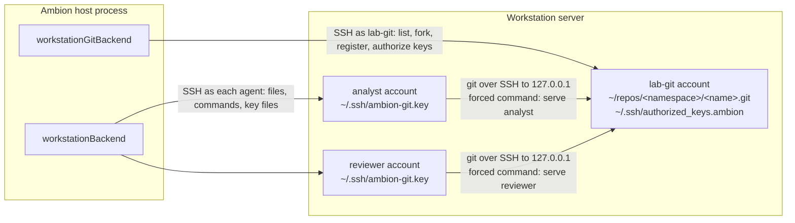

# A git backend on the workstation

**No package implements this page yet.** This page proposes a second
`GitBackend` for the [git contract](git.md). It keeps the repositories on
the [workstation](workstation.md), in the home of one dedicated account,
and each agent reaches them with `git` over SSH. No plan item holds the
work yet. The examples show the proposed API.

**The proposal ships in `@ambionframework/workstation`.** The package
already holds the SSH client, the environment over SFTP and `exec`, and the
credential file of the HTTP path. The new backend reuses them and adds no
dependency.

## Why a second backend

**`gitBackend` serves a workstation only through a listener on the host.**
The real `git` on the server reaches the repositories over HTTP. The host
must listen on an address that the server reaches, and set `url` to it
([Git](git.md#gitbackend-a-server-in-the-hosts-process)). The default
`url`, `http://git.ambion.invalid`, never resolves. With the defaults,
`connect` succeeds, and the first `git clone` of an agent fails on DNS.

**The HTTP path has three costs on a workstation.**

- **The host opens an inbound port.** The server must reach the Ambion
  host, and a firewall or a NAT between the two blocks it.
- **Each token crosses the network in HTTP basic authentication.** A plain
  `http` URL sends it in clear text. `https` needs a certificate and a
  proxy in front of `handler`.
- **The code lives on the host, and the working copies live on the
  server.** A command on the server that wants the code clones it across
  the network.

**This backend keeps the git traffic inside the server.** The agent's
`git` connects to the `sshd` of its own server, on the loopback address.
The host needs no listener. The host reaches the server over SSH, the same
as the bash backend does.

## The shape



**One account owns every repository.** The account is `<workspace>-git`,
such as `lab-git`. Its home has mode `0700`, so no agent reads a
repository from the disk. Every read and every push goes through `sshd`
and one forced command.

**Each agent holds one key for the git account.** The backend issues the
key, and the bash backend writes it into the agent's home. The git
account lists the public key with a forced command that names the agent.
The server reads the caller's name from that line.

**The host drives the git account over its own SSH client.** `list`,
`get`, `fork`, and template registration run as short scripts on the
server. The host runs no git library.

## Use

```ts
import { readFile } from 'node:fs/promises';
import { fromDirectory } from '@ambionframework/workspace/git';
import { openWorkspace } from '@ambionframework/workspace';
import { workstationBackend, workstationGitBackend } from '@ambionframework/workstation';

const server = {
  host: 'lab.internal',
  hostKey: 'SHA256:<the fingerprint that ssh-keygen -lf prints>',
};

const lab = openWorkspace({
  name: 'lab',
  backend: {
    bash: workstationBackend({
      ...server,
      layout: { audit: '/srv/ambion/lab/audit/audit.jsonl', rooms: '/srv/ambion/lab/rooms' },
      credentialFor: async (agent) => ({
        username: agent.name,
        privateKey: await readFile(`/etc/ambion/keys/${agent.name}`, 'utf8'),
      }),
    }),
    git: workstationGitBackend({
      ...server,
      account: {
        username: 'lab-git',
        privateKey: await readFile('/etc/ambion/keys/lab-git', 'utf8'),
      },
      templates: {
        'weekly-report': {
          description: 'A weekly status report: numbers, risks, and next steps.',
          source: fromDirectory('./templates/weekly-report'),
        },
      },
    }),
  },
});
```

| Option         | Meaning                                                                                  |
| -------------- | ---------------------------------------------------------------------------------------- |
| `host`, `port` | The address of the server that holds the git account. The port is 22 by default          |
| `hostKey`      | The SHA-256 fingerprint of the server's host key. The backend refuses any other          |
| `account`      | The username and the private key of the git account, as `WorkstationCredential`          |
| `root`         | The folder of the repositories, in the account's home. The default is `repos`            |
| `agentAddress` | The address that an agent's `ssh` uses. The default is `127.0.0.1` and `port`            |
| `agentSources` | The source addresses from which an agent key works. The default is `127.0.0.1` and `::1` |
| `alias`        | The host name in every clone URL. The default is `ambion-git`                            |
| `templates`    | The registrations, by template name. The same shape as `gitBackend`                      |
| `keyTtl`       | Seconds an agent key lives. The default is 3600                                          |
| `idleTimeout`  | Seconds the git account's client may stay unused. The default is 300                     |

**`agentAddress` and `agentSources` allow a git server apart from the
workstation.** With the defaults, the git account is on the workstation,
and an agent reaches it on the loopback address. A host that puts the git
account on a second server sets `agentAddress` to that server and
`agentSources` to the workstation's address. The rest of the design does
not change.

## The git account

**The layout of the home.**

| Path                            | Holds                                                        | Mode   |
| ------------------------------- | ------------------------------------------------------------ | ------ |
| `~`                             | Everything below                                             | `0700` |
| `~/.ssh/authorized_keys`        | The host's key for the account. The operator writes it       | `0600` |
| `~/.ssh/authorized_keys.ambion` | One line for each agent key. The backend is its one writer   | `0600` |
| `~/.ambion/serve`               | The forced command of every agent key                        | `0700` |
| `~/repos/templates/<name>.git`  | Each template, a bare repository                             |        |
| `~/repos/<agent>/<name>.git`    | Each fork, a bare repository                                 |        |
| `~/repos/.staging/`             | Repositories in construction. No request reaches this folder |        |

**Two files hold the authorized keys, and each has one writer.** The
operator adds a `Match` block to `sshd_config`:

```text
Match User lab-git
  AuthorizedKeysFile .ssh/authorized_keys .ssh/authorized_keys.ambion
```

A fault in the backend's writes cannot remove the host's own key, so the
backend cannot lock itself out.

**The account is not in the agents' group.** It writes no audit entry and
no room mirror. A fault in the forced command gives an agent the rights of
the git account alone.

**The backend installs `serve` at its first operation.** It writes the
script over SFTP when the content differs, the same as it keeps the
credential file current today.

## The protocol

**A clone URL is `ssh://<alias>/<namespace>/<name>`.** For example,
`ssh://ambion-git/analyst/report`. The URL stays opaque to the agent
([Git](git.md#decisions-taken)). The `server` of the backend is
`ssh://ambion-git`, and the guidance names it.

**The agent's ssh configuration maps the alias to the server.** At each
`connect`, the bash backend writes three files into `~/.ssh` with mode
`0600`, and makes `Include ambion-git.conf` the first line of
`~/.ssh/config`:

```text
# ~/.ssh/ambion-git.conf
Host ambion-git
  HostName 127.0.0.1
  Port 22
  User lab-git
  IdentityFile ~/.ssh/ambion-git.key
  IdentitiesOnly yes
  HostKeyAlias ambion-git
  UserKnownHostsFile ~/.ssh/ambion-git.known_hosts
  StrictHostKeyChecking yes
  BatchMode yes
```

- **`ambion-git.key`** holds the agent's private key.
- **`ambion-git.known_hosts`** holds one line: the alias and the server's
  host key. The backend takes the key that its own client verified
  against `hostKey`.
- **The `Include` line comes first,** because an `Include` after a `Host`
  block applies to that block alone.

**The agent needs no `git config` change.** A remote with the alias uses
the key. Every other remote keeps the agent's own ssh settings.

**Each agent key has one line in `authorized_keys.ambion`.**

```text
restrict,from="127.0.0.1,::1",expiry-time="20260924171230",command="/home/lab-git/.ambion/serve analyst" ssh-ed25519 AAAA... ambion:analyst
```

| Option        | Effect                                                                         |
| ------------- | ------------------------------------------------------------------------------ |
| `restrict`    | No pty, no port forwarding, no agent forwarding, no X11                        |
| `from`        | The key works only from `agentSources`. A copy of the key off the server fails |
| `expiry-time` | `sshd` refuses the key after this time                                         |
| `command`     | `sshd` runs `serve <agent>` for every request, whatever the client asks        |

**`serve` is the one place that decides a request.** `sshd` puts the
client's command in `SSH_ORIGINAL_COMMAND`. `serve` accepts two forms and
refuses every other:

```bash
#!/usr/bin/env bash
set -euo pipefail
agent="$1"
re="^(git-upload-pack|git-receive-pack) '/?([a-z][a-z0-9-]*)/([a-z0-9][a-z0-9._-]{0,63})'$"
[[ "${SSH_ORIGINAL_COMMAND:-}" =~ $re ]] || { echo 'ambion: refused' >&2; exit 1; }
service="${BASH_REMATCH[1]}" namespace="${BASH_REMATCH[2]}" name="${BASH_REMATCH[3]}"
repo="$HOME/repos/$namespace/$name.git"
if [ "$namespace" = template-sources ] || ! [ -f "$repo/HEAD" ]; then
  echo "ambion: $namespace/$name does not exist" >&2; exit 1
fi
if [ "$service" = git-receive-pack ] && [ "$namespace" != "$agent" ]; then
  echo "ambion: $agent cannot push to $namespace/$name" >&2; exit 1
fi
export GIT_COMMITTER_NAME="$agent" GIT_COMMITTER_EMAIL="$agent@ambion.invalid"
exec git "${service#git-}" "$repo"
```

- **The pattern is the ID rule of [Git](git.md#repositories-and-their-names).**
  A name holds no `/` and starts with no `.`, so no path leaves `~/repos`.
- **A push creates no repository.** `serve` refuses a path whose `HEAD`
  does not exist. Only `fork` and registration create a repository.
- **A push goes only to the agent's own namespace.** No agent is named
  `templates`, so no push reaches a template. Each template also has a
  `pre-receive` hook that refuses every push.
- **The committer variables name the agent in the reflog.** Each
  repository sets `core.logAllRefUpdates=always`. The reflog of each ref
  then records the agent that moved it, whatever `user.name` the agent
  set in its commits.

## Keys

**The git backend issues each agent key.** `ssh2` generates an Ed25519
key pair in the OpenSSH format (`utils.generateKeyPairSync('ed25519')`
in `ssh2` 1.17.0). The key lives in the backend's memory and in the
agent's home. The host provisions no agent key for git.

**Each `connect` of the bash backend keeps the agent's files current.**

1. The bash backend calls `identityFor(agent)` on the git backend's
   access.
2. The git backend returns the key it holds for the agent. When it holds
   none, or the key is inside its margin, it generates a new one. It
   writes the new line to `authorized_keys.ambion` before it returns.
3. The bash backend reads the three files and the first line of
   `~/.ssh/config` in one command. It writes each one that differs,
   through a temporary name, `chmod 600`, and `mv`.

**The margin is the rule of the HTTP path.** A key counts as missing when
the smaller of 10 minutes and half of its life is left
([Git](git.md#credentials)). The key rotates about once each `keyTtl`, and
a command that starts with a key keeps it for the length of the margin.

**An old line stays until its expiry.** The backend adds the new line and
keeps the old one, so a command in flight with the old key finishes.
Each write drops the lines whose `expiry-time` has passed. `sshd`
refuses an expired line on its own, so a late drop grants nothing.

**The backend serializes its writes of `authorized_keys.ambion`.** Two
agents that connect at once each need a line. One promise chain in the
host's process orders the writes: read, change, write to a temporary
name, `chmod 600`, and rename. One host process drives one git account.

**A restart of the host issues new keys.** The keys live in memory. The
first `connect` of each agent after a restart writes a new key and a new
line. The old lines expire within `keyTtl`.

## Repositories

**Each repository is a bare repository with its facts in its own
files.** The backend keeps no registry table.

| Fact                 | Where it lives                                                                          |
| -------------------- | --------------------------------------------------------------------------------------- |
| The ID               | The path: `~/repos/<namespace>/<name>.git`                                              |
| The source of a fork | `git config ambion.source <id>` in the repository                                       |
| The description      | The repository's own `description` file. The text that `git init` writes counts as none |
| The default branch   | `HEAD`                                                                                  |
| The branches         | `refs/heads/*`                                                                          |

**`list` and `get` run one command each.** The command prints one record
for each repository: the ID, `HEAD`, each branch with its commit, the
source, and the description. The backend parses the records into
`GitRepository` values. It skips `.staging`.

**A fork builds in `.staging` and lands with one rename.**

1. `git clone --bare <source> ~/repos/.staging/<random>`. The source and
   the fork are on one filesystem and have one owner, so the clone
   hard-links the object files. A fork costs little disk.
2. Remove the `origin` remote, set `ambion.source`, and set
   `core.logAllRefUpdates`.
3. `mkdir -p ~/repos/<agent>` and `mv -T` the staging folder to
   `<agent>/<name>.git`. `rename(2)` refuses a target folder that holds
   files, so a second fork of one name fails and gets `name_taken`.

**A hard link keeps each fork whole.** A fork shares no object store with
its source. A `gc` of the source removes nothing that the fork reads. A
fork of a fork works the same as a fork of a template.

**A crash leaves a folder in `.staging` and no half repository.** The
rename is the one step that publishes a repository. The backend removes
each staging folder older than one hour at its first operation. The
`forking` state and the settle step of `gitBackend` have no counterpart.

**An abort kills the fork's command.** The environment over SSH kills the
process group ([Workstation](workstation.md#commands-and-aborts)). The
staging folder stays until the next sweep. A repeated `fork` is safe, the
same as on `gitBackend`.

**Registration builds a template in `.staging` and renames it into
`templates/`.** It keeps the three cases of
[Git](git.md#templates), and it compares by blob hashes.

1. The template exists, and `git ls-tree -r` of its tip gives the blob
   hashes of the source. Nothing happens.
2. The template exists, and the hashes differ. Registration fails with an
   error that names the template.
3. The template does not exist. The backend writes the files into a
   staging folder over SFTP, commits them to a new bare repository on
   `main` as `ambion`, writes the description, installs the
   `pre-receive` hook, and renames the repository to
   `templates/<name>.git`.

**The backend keeps no `template-sources` repositories.** In
`gitBackend`, a template is a fork of its source so that a crash can
resume. Here the rename gives the same property. The name
`template-sources` stays reserved, and `serve` refuses it.

## Changes to the contract

**`GitAccess` names its transport.** A bash backend reads the transport
and refuses one that it cannot carry. The HTTP form is today's
`GitAccess` with a `transport` field.

```ts
type GitAccess = GitHttpAccess | GitSshAccess;

interface GitHttpAccess {
  readonly transport: 'http';
  readonly prefix: string;
  readonly fetch?: GitFetch;
  credentialFor(agent: WorkspaceAgent, url: string): Promise<GitCredential | undefined>;
  credentialsFor(agent: WorkspaceAgent): Promise<readonly GitCredential[]>;
}

/** One agent's key for a git server over SSH, and how its ssh reaches the server. */
interface GitSshIdentity {
  /** The host name in the clone URLs. The ssh configuration maps it to the server. */
  readonly alias: string;
  readonly hostName: string;
  readonly port: number;
  readonly user: string;
  /** The server's public host key: the key type, a space, and the base64 key. */
  readonly hostKey: string;
  /** The agent's private key, in the OpenSSH format. */
  readonly privateKey: string;
  /** Milliseconds since the epoch. */
  readonly expiresAt: number;
}

interface GitSshAccess {
  readonly transport: 'ssh';
  /** Every clone URL starts with this prefix. */
  readonly prefix: string;
  /** The key of `agent`. Rejects for a reserved name. */
  identityFor(agent: WorkspaceAgent): Promise<GitSshIdentity>;
}
```

**Each bash backend states the transports that it carries.**

| Bash backend | `http`                                | `ssh`                                          |
| ------------ | ------------------------------------- | ---------------------------------------------- |
| just-bash    | Carries it in process, as today       | Refuses it in `connect`: `just-git` has no SSH |
| Workstation  | Writes `~/.git-credentials`, as today | Writes the key and the ssh configuration       |

**The workstation refuses an HTTP access that it cannot reach.** When the
host of `prefix` ends in `.invalid`, `connect` rejects. The error names
`url` and `handler`, and it names `workstationGitBackend`. This change
stands alone, and it can land before the rest of this page.

**One decision of [Git](git.md#decisions-taken) changes its words.**
Today: "A credential grants one scope on one repository, and it expires."
Proposed: "A credential names one agent, and it expires. The server
checks each request against the namespace rule." The HTTP tokens keep
one scope on one repository. The SSH keys name the agent, and `serve`
applies the rule. The one-pusher rule holds on both.

**The template helpers move to the workspace package.** `fromDirectory`,
`TemplateRegistration`, the blob hashes, and the name rules live in
`packages/git` today, beside `just-git`. The workstation needs them and
must not install `just-git`. They move to a new entry,
`@ambionframework/workspace/git`, which loads `node:fs` and `node:crypto`
and no git library. `@ambionframework/git` imports them from there.

**The changelog names these export changes.**

- `GitAccess` becomes the union of `GitHttpAccess` and `GitSshAccess`.
- The root entry of the workspace exports `GitSshIdentity`.
- The entry `@ambionframework/workspace/git` exports `fromDirectory`,
  `TemplateRegistration`, and `TemplateSource`.
- `@ambionframework/git` no longer exports `fromDirectory`.
- `@ambionframework/workstation` exports `workstationGitBackend` and
  `WorkstationGitOptions`.

## Owners and order

**The git owner runs `list`, `get`, and `fork` on the git account's
client.** The client holds one SFTP channel. An operation opens one
`exec` channel, and an abort opens one more.

**`identityFor` does not take the git owner.** It runs from the bash
backend's `connect`, the same as `credentialsFor` today. It reads the key
from memory. A new key adds one write of `authorized_keys.ambion` on the
git account's client. The git account's client then holds four channels
at most, under the `MaxSessions` default of 10.

**The server orders the pushes to one repository.** `git receive-pack`
takes a lock on each ref and compares the old commit. A push that lost
the race fails, the same as on `gitBackend`.

**A clone or a push holds no owner in the host.** The pack work runs
between two processes on the server. The bash owner still waits for the
`bash` call that runs `git`, as it waits for any command.

## Persistence

| State of an edit             | Workstation with `gitBackend` | Workstation with this backend |
| ---------------------------- | ----------------------------- | ----------------------------- |
| Pushed, host restarts        | Survives                      | Survives                      |
| Pushed, server disk lost     | Survives on the host          | Lost                          |
| Committed, not pushed        | Survives a host restart       | Survives a host restart       |
| Any state, after `dispose()` | Kept                          | Kept                          |

**The code and the working copies share one failure domain.** With
`gitBackend`, a push copies the code to the host. With this backend, the
code stays on the server. The host backs up `~lab-git/repos` with its own
tools, such as a filesystem snapshot or one `git bundle` for each
repository.

## Trust

**`docs/trust.md` gets a row for this backend.** The forced command and
the account permissions enforce the one-pusher rule. The kernel does not.

| Attempt                                 | Workstation with `gitBackend`                  | Workstation with this backend                                    |
| --------------------------------------- | ---------------------------------------------- | ---------------------------------------------------------------- |
| Push to another agent's repository      | Refused: no write credential                   | Refused by `serve`                                               |
| Push to a template                      | Refused: read-only                             | Refused by `serve` and by the template's hook                    |
| Use another agent's credential          | Needs that agent's file, mode `0600`           | Needs that agent's key file, mode `0600`                         |
| Read or change a repository on the disk | Not possible: the repositories are on the host | Refused: the git home has mode `0700`                            |
| Use its credential from another machine | Possible until `tokenTtl`                      | Refused by `from`                                                |
| Copy its credential into the record     | Possible; the token expires in `tokenTtl`      | Possible; the key works only from `agentSources`, until `keyTtl` |
| Open a shell as the git account         | Not applicable                                 | Refused: `restrict` and the forced command                       |
| Find which agent moved a ref            | The server knows the token                     | The reflog of the repository names the agent                     |
| Fill the disk with pushes               | Fills the host's SQLite file                   | Fills the server's disk                                          |

## Prepare the server

**The operator adds one account and one `Match` block.** The other steps
of [the package guide](../packages/workstation/README.md) do not change.

- **One account `<workspace>-git`,** with a login shell of `bash`, a home
  of mode `0700`, and no membership in the agents' group.
- **The host's key for it** in `~/.ssh/authorized_keys`.
- **The `Match User` block** that adds `authorized_keys.ambion`.
- **`AllowUsers`, when it is set,** names the account.
- **`git` and `openssh-client`** on the server. An agent runs `ssh` to
  reach the account.
- **OpenSSH 8.2 or newer** for `expiry-time`. `restrict` needs 7.2.

`test/sshd/setup.sh` gets each step for the account `lab-git`.

## Tests

**The OpenSSH tier runs `gitConformance`.** Only a real `sshd` honors the
options of an `authorized_keys` line. The scripted tier's `ssh2` server
does not, and a copy of that logic in test support would test the copy.
The tier also proves:

- that `ssh lab-git@127.0.0.1` with an agent key opens no shell;
- that a request outside the pattern of `serve` fails, such as a
  `git-upload-archive` or a path with `..`;
- that an agent cannot read `~lab-git`;
- that a key past its `expiry-time` fails;
- that the reflog of a pushed ref names the agent.

**The scripted tier tests the parts without `sshd`.**

- `serve` runs directly, with `SSH_ORIGINAL_COMMAND` set, over a table of
  requests and expected results.
- The list, fork, and registration commands run over the `ssh2` test
  server as a normal shell: a fork lands with one rename, a second fork of
  one name gets `name_taken`, and a staging folder older than one hour
  goes.
- The key files: their modes, the `Include` line first in
  `~/.ssh/config`, and a removed file that comes back at the next
  `connect`.
- The lines of `authorized_keys.ambion`: two connects at once keep both
  lines, and a write drops the expired ones.

**`gitConformance` reads the transport in four cases.** The cases that
call `credentialsFor` or `credentialFor` directly branch on
`access.transport`:

| Case                                 | `http`, as today                | `ssh`                                                 |
| ------------------------------------ | ------------------------------- | ----------------------------------------------------- |
| No credential for `template-sources` | No credential URL names it      | `git ls-remote` of it fails in the shell              |
| An agent with a reserved name        | `credentialsFor` rejects        | `identityFor` rejects                                 |
| Credential reads beside forks        | A loop of `credentialsFor`      | A loop of `identityFor`, which writes the key file    |
| A credential expires                 | A probe with the token gets 401 | `ssh` with a copy of the old key fails after `keyTtl` |

## Alternatives

**`file://` paths with account permissions.** Each fork belongs to its
agent's account, and the group reads it. The operating system then holds
the one-pusher rule. A fork across two owners copies every object, since
`protected_hardlinks` refuses a link to another account's file. Recent
`git` releases check the owner of a repository (`safe.directory`), so a
read of another agent's fork can need an exemption. No credential
expires, and no single place records a push.

**A forwarded agent from the host's memory.** The bash backend's client
forwards an SSH agent that holds the git key, and no key lands on the
disk. The design needs `ssh2` to serve the forwarded agent from a key in
memory, which this page has not verified. A background process loses the
socket when the client closes after `idleTimeout`. This is a candidate
refinement after v1.

**`git http-backend` on the server's loopback.** It keeps the HTTP
tokens. It needs a web server on the server and a service to run it. The
workstation already needs `sshd`.

**OpenSSH user certificates.** `TrustedUserCAKeys` and a short-lived
certificate for each agent give expiry and a principal without an
`authorized_keys` line. They need a change to the global `sshd`
configuration and a CA key on the host. The `ssh2` limit on certificates
does not apply here, since the agent's OpenSSH client presents it. This
is a candidate for the rotation story after v1.

**gitolite.** It implements the same forced-command model. It adds Perl
and an administration repository that the backend must push to. `serve`
is about fifteen lines of `bash`.

## Open decisions

1. **The key at rest.** This page keeps the key in the agent's home, with
   `from` and `expiry-time`. The forwarded agent keeps no key at rest,
   and it needs a spike on `ssh2`.
2. **Two authorized-keys files.** This page asks the operator for a
   `Match` block. The other choice is a block of lines that the backend
   owns inside the one file. It needs no `sshd` change, and a fault in
   the backend can then remove the host's key.
3. **The home of the template helpers.** This page proposes
   `@ambionframework/workspace/git`. The other choice is an entry of
   `@ambionframework/git` that loads no `just-git`, and the workstation
   then depends on `@ambionframework/git`.
4. **The plan.** An item in [next.md](../planning/next.md) for 0.3.0, or
   an entry in [the backlog](../planning/backlog.md#designs-with-a-shape).
5. **A separate git server in v1.** `agentAddress` and `agentSources`
   allow it. The OpenSSH tier tests only the loopback case.

**A stand-in for `sshd` checked the repository mechanics.** With `git`
2.43, a script that sets `SSH_ORIGINAL_COMMAND` and runs `serve` served
a clone and a push. It refused a peer's push, a push to a template,
`template-sources`, a path with `..`, `git-upload-archive`, and a shell
command after a `;`. A bare clone hard-linked the object files, `mv -T`
onto an existing fork failed with "Directory not empty", and the reflog
named the pushing agent while the commit named another author.

**One fact needs a check against OpenSSH before the implementation.** This
page has not verified how `sshd` reads the time of `expiry-time`: as the
server's local time, or as UTC with a `Z` suffix. The backend writes the
form that the oldest supported release reads.

## Out of v1

- A forwarded agent, and OpenSSH certificates.
- A quota for each agent. Every repository belongs to one account, so a
  filesystem quota applies to all agents together.
- Garbage collection and retention of forks. `git gc --auto` runs after
  a push, as `git` does by default.
- Protocol version 2. It needs `AcceptEnv GIT_PROTOCOL` in `sshd`.
  Version 0 serves every operation of the contract.
- A migration from `gitBackend` storage to this backend.
