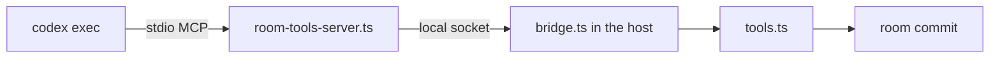

# Codex example

A Codex seat in an Ambion room, over the Codex SDK. The example is private
and has no build step. It shows how an executor for a harness that owns its
loop and takes no message during a run joins a room. [`README.md`](../../README.md)
holds the positioning of Ambion.

## What it shows

- **One thread for each activation.** The first pass sends the mechanism,
  the agent and the whole view. A later pass runs the next turn of the same
  thread with the delta.
- **Room tools over a stdio server.** Codex runs tools as MCP servers that
  it spawns. The three room tools, and the tools written with `defineTool`,
  reach the room through a local socket.
- **Items as steps.** `command_execution`, `file_change`, `mcp_tool_call`
  and `web_search` items become `tool_call` and `tool_result` steps.
  `reasoning` and `agent_message` items become `thinking` and `text` steps.
  `turn.completed` becomes a `usage` step. Codex reports no cost.
- **`file_change` paths as `refs`.** The next ordinary say cites the paths
  that Codex changed.
- **No steer.** The session has no `steer` member. The driver holds a line
  that lands during a turn, and the next pass reads it.
- **Tested on a fake.** A fake `codex` executable runs the executor suite
  of `@ambionframework/ambion/conformance`, with no key and no network.

## The path of a room tool

Codex runs `codex exec` for each turn and spawns the room tools server for
each of those runs. The server holds no room. It asks the activation for
its tool list and forwards each call.



1. The activation opens a socket in the temporary directory.
2. The executor passes the server command and the socket path to Codex in
   `config.mcp_servers.ambion`.
3. The server connects to the socket and asks for the manifest: each tool
   with its description and its JSON Schema.
4. The server lists those tools to Codex and sends each call over the
   socket. The bridge runs the call and returns the MCP result.
5. `close` stops the socket. The server exits when the socket closes.

## Freshness

Codex sends no echo of the input it read, so the executor sets
`readThrough` from two events.

- **`turn.started`.** The model reads the prompt when a turn starts.
  `readThrough` moves to the position of the view or the delta.
- **A `missed` answer.** The room refused a say because the record moved.
  The tool result carries the missed lines to the model in the same reply,
  so `readThrough` moves to the last of them at once.

A say never commits against record that the model has not read.

## Files

| File                       | What                                                      |
| -------------------------- | --------------------------------------------------------- |
| `src/define.ts`            | `codex()`: the executor value and its policy              |
| `src/executor.ts`          | `createCodexExecutor()`: one thread for each activation   |
| `src/options.ts`           | Thread options, and the `mcp_servers` config for the SDK  |
| `src/tools.ts`             | The room tools and the agent tools, as handlers           |
| `src/bridge.ts`            | The socket in the host                                    |
| `src/room-tools-server.ts` | The stdio MCP server that Codex spawns                    |
| `src/wire.ts`              | The line framing between the server and the bridge        |
| `src/codex-trace.ts`       | Thread events as steps                                    |
| `src/services.ts`          | The failure cause and the length stop of a turn           |
| `src/compose.ts`           | `codexExecution()`: the connector for a runtime or a room |
| `src/testing.ts`           | The harness for the executor suite                        |
| `test/fake/codex`          | The fake `codex` executable                               |

## Run the tests

```sh
pnpm --filter @ambionframework-examples/codex test
```

The tests reach the core through its built entries. Run `pnpm build` first
when `packages/ambion/dist` does not exist.

## Use it

```ts
import { defineAgent } from '@ambionframework/ambion';
import { codex } from './src/index.ts';

const agent = defineAgent({
  name: 'gpt',
  identity: 'Writes the plan.',
  executor: codex({ instructions: 'Write the plan.', model: 'gpt-5-codex' }),
});
```

Pass `codexExecution()` as `execution` to `createRuntime`. Codex needs its
own sign-in or `CODEX_API_KEY` in the environment. Pass `codexPath` to run
another `codex` executable, as the tests do.

## Limits

- **Live runs.** CI runs the fake only. No live run of a real `codex` exists
  for this example yet.
- **Base instructions.** The Codex SDK has no system prompt option, so the
  first prompt carries the mechanism and the agent instructions.
- **Approvals.** Codex answers approvals by its own policy. The example
  passes `approvalPolicy` and `sandboxMode` through and has no approval
  step.
- **Memory.** One thread lives for one activation. `resumeThread` across
  activations is part of the `memory` option and is not in this example.
