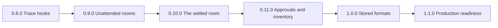

# 1.0.0: Stored formats and the promise

**1.0.0 is the release that makes a promise of compatibility.** From
1.0.0, an export, a journal body, a stored format, and the fold of a
journal change only with a new major version. A stored format that
changes ships a reader for the version before it. Before 1.0.0, the rule
in [Compatibility](#compatibility-and-release-guards) holds.

**1.0.0 gates on the promise alone.** A gate is work that changes a
format, an export, or the fold, so it costs a major version after 1.0.0.
Work that adds to an interface and breaks none follows 1.0.0 in a minor
release. [0.9.0](0.9.0.md) makes a room safe to leave alone, and
[1.1.0](1.1.0.md) proves it on the workbench with real devices.

## The road

**One release for each step reaches 1.0.0.** Each file of `planning/`
holds the scope of one release. [The backlog](backlog.md) holds the work
outside the road and the risks that the road leaves open. The assessment
of the road of 2026-10-07 groups the work so that each surface changes
once: one regeneration of the golden journals, one rewrite of the view
window, and one review of the exports.

| Release             | Scope                       | A person can                                            |
| ------------------- | --------------------------- | ------------------------------------------------------- |
| [0.8.0](0.8.0.md)   | Complete trace hooks        | Send every step of every activation to any backend      |
| [0.9.0](0.9.0.md)   | Unattended rooms            | Leave a room overnight and find it running              |
| [0.10.0](0.10.0.md) | The settled room            | Build on the room of 1.0.0                              |
| [0.11.0](0.11.0.md) | Approvals and the inventory | Approve a risky step that no agent can approve alone    |
| 1.0.0               | Stored formats, promise     | Upgrade a deployment with no loss and no reader to edit |
| [1.1.0](1.1.0.md)   | Production readiness        | Run the workbench on a workstation with real devices    |

**The settled room comes before the approvals.** Every change of a
journal body lands in 0.10.0, so the approvals of 0.11.0 build on the
final roster and the final exchange rules. 0.11.0 then reviews the
settled surface once and versions each format as it reads it. 1.1.0 can
start at any time and gates nothing.

## Status

**0.8.0 is released. The work starts with [0.9.0](0.9.0.md).**

## The gates

**Each gate changes a format, an export, or the fold.** After 1.0.0, each
one costs a major version.

| Gate                                           | Release | What it changes                                          |
| ---------------------------------------------- | ------- | -------------------------------------------------------- |
| UR3 failures that a host sees                  | 0.9.0   | The `error` notification                                 |
| SR1 a close is a message                       | 0.10.0  | The close body, the lease id, the purpose on the wire    |
| SR2 attention replaces seating                 | 0.10.0  | Presence kinds, the composition, the RPC, the canvas row |
| SR3 the `assistant` option over the new roster | 0.10.0  | The expansion of the `assistant` option                  |
| SR4 the order of an execution list             | 0.10.0  | Lists that a room accepts today                          |
| SR5 the goal is a message                      | 0.10.0  | The composition and the canvas row                       |
| AP1 a question to the opener                   | 0.10.0  | The fold of the same bodies                              |
| SR7 one window for the view                    | 0.10.0  | The meaning of `limits.context.messages`                 |
| SR8 the view takes a selection                 | 0.10.0  | The view call of the room protocol                       |
| SR9 open bodies and no older reader            | 0.10.0  | The `dismissed` body and the process spec                |
| SR6 a review of the exports                    | 0.11.0  | The export snapshot                                      |
| SF1 a version on each stored format            | 0.11.0  | Each stored format                                       |
| SF6 the Node floor at 24                       | 0.11.0  | The `engines` field of each package                      |
| SF4 a snapshot of each tool bundle             | 0.11.0  | The tool names and schemas                               |

**Not a gate:** UR1, UR2, UR4, UR5, UR6, AP2, AP3, SF2, and all of
[1.1.0](1.1.0.md). AP2 and AP3 stay on the road because the workbench
claims an approval gate that it does not enforce today.

## The scope

| Item | Delivery                                |
| ---- | --------------------------------------- |
| SF2  | A check of a journal                    |
| SF3  | The soak run, the docs, and the release |
| SF5  | Frozen journals of each release         |

## The work

- [ ] **1.** A check of a journal. (SF2)
- [ ] **2.** Frozen journals of each release. (SF5)
- [ ] **3.** The soak run, the docs, and the release. Needs 1 and 2.
      (SF3)

**Evidence:** a journal with one malformed entry reports the position of
the entry. A journal of each scenario of 1.0.0 sits in a frozen fixture,
and CI resumes and folds each one. The soak run passes. `CLAUDE.md`
states the promise.

## The items

**SF2. A check of a journal.** One malformed entry makes a room
unresumable, and the error names no position. A command reads a journal,
names the position and the seq of each entry that fails, and changes
nothing. It reads the format version of SF1 in
[0.11.0](0.11.0.md#the-items).

**SF5. Frozen journals of each release.** The golden journals of the
core change in the commit that changes a rule. From 1.0.0 that would
hide a change of the fold. A fixture directory holds the journals of
each release, and no commit edits them.

- Each release from 1.0.0 adds its journals and the fold that each one
  gives.
- CI resumes each journal of each release and compares its fold.
- The fixtures cover the journal, the canvas store, and the storage of a
  room on Durable Objects.

**SF3. The soak run, the docs, and the release.**

- A scripted soak run: a room on the fake clock for 7 days, with a
  self-scheduled check each 15 minutes, outages, and restarts. The prompt
  stays in its window, the chain does not end, and no entry is lost.
- `CLAUDE.md` replaces the rule of no compatibility with the promise in
  [The promise](#the-promise).
- The changelog, the README, and the docs describe 1.0.0.

## The promise

**The promise covers what a deployment stores or builds on.**

| Covered                                                       | Owner                 |
| ------------------------------------------------------------- | --------------------- |
| The exports of each package, as the export snapshot holds     | Each package          |
| The journal bodies, and the fold of a journal                 | `packages/ambion`     |
| The journal entry and its key space                           | `packages/journal`    |
| The refs, the lease ids, and the keys that the room writes    | `packages/ambion`     |
| The storage of a room on Durable Objects, and its class names | `packages/cloudflare` |
| The canvas store, its rows, and the act ref                   | `packages/canvas`     |
| The process spec, the process files, and the mirror files     | `packages/workspace`  |
| The tables of the workspace SQL backend                       | `packages/workspace`  |
| The file format of a skill macro                              | `packages/workspace`  |
| The `ambion_repositories` table                               | `packages/just-bash`  |
| The name and the argument schema of each tool                 | Each tool bundle      |
| The steps of a trace and their order                          | `packages/ambion`     |

**The promise excludes these.** A minor release can change each one.

- The defaults of `limits` and of each option.
- The guidance text, the rendered prompt, and the room core.
- The session files of Pi, Claude, and Codex. A vendor session lasts one
  exchange.
- The contract of a third-party executor in `/hosting`.
- The RPC between a Worker and its Durable Objects. A deployment of a
  Worker is atomic.

**Additive changes stay in minor releases.**

- An optional field on a body that accepts extra fields.
- A new value of an enumeration, such as a close reason or an attention
  level. A reader treats an unknown value as a refusal that names it.
- A new export, a new tool, and a new optional argument of a tool.

## Decisions taken

| Decision                                      | Reason                                                   |
| --------------------------------------------- | -------------------------------------------------------- |
| 1.0.0 gates on the promise alone              | Device and host proofs change no format                  |
| The settled room comes before the approvals   | One regeneration of the golden journals                  |
| The fold is a format                          | The same bodies can fold differently                     |
| Tool names and schemas are exports            | Skill macros and compose code call tools by name         |
| An optional field on an open body is additive | A bound or a header field then fits a minor release      |
| The library packages need Node 24             | A floor that rises after 1.0.0 is a major version        |
| Kernel spend quotas stay out of 1.0.0         | The owner accepted the risk; a host bounds its own spend |
| One release for each step of the road         | Each release ships one capability that a person can use  |

## Out of scope

**The road leaves these out of 1.0.0.** Each one adds to an interface and
breaks none, so it can follow 1.0.0 in a minor release.
[The backlog](backlog.md) holds each one with its condition.

- The production work of [1.1.0](1.1.0.md).
- A remote viewer of the canvas, and a canvas on Cloudflare.
- Kernel spend quotas and a bound on a chain of exchanges.
- A `retry-after` header that sets the next attempt.
- Snapshots of the projection for replay.
- Range recall, and the speaking text of the room core. SR8 settles the
  call that range recall needs.
- Nested breakout rooms, layout tools, and widgets that agents write.
- Native executor subagents and vendor UI surfaces.
- Metrics, evals, and live streaming of an open activation.

## Compatibility and release guards

The product rule in `CLAUDE.md` applies until 1.0.0: no compatibility
promise. Name each change in the changelog, and update the export snapshot
and the golden journals with it. SF3 replaces the rule with the promise.
