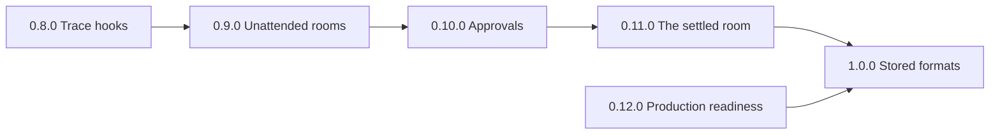

# 1.0.0: Stored formats and the promise

**1.0.0 is the release that makes a promise of compatibility.** From
1.0.0, an export, a journal body, and a stored format change only with a
new major version. A stored format that changes ships a reader for the
version before it. Before 1.0.0, the rule in
[Compatibility](#compatibility-and-release-guards) holds.

**1.0.0 also makes a room safe to leave alone.** The workbench is the
test case. A person starts an overnight run on a bench, approves the risky
steps, goes home, and finds the run, its record, and its traces in the
morning. A room that runs unattended keeps its clock, says when it fails,
and stays within a bounded prompt.

## The road

**One release for each step reaches 1.0.0.** Each file of `planning/`
holds the scope of one release. [The backlog](backlog.md) holds the work
outside 1.0.0 and the risks that 1.0.0 leaves open. The review of the
workbench of 2026-10-06 grounds the road: the core has the right concepts
for a workbench, and the gaps are in liveness, approvals, traces, and
operations.

| Release             | Scope                   | A person can                                            |
| ------------------- | ----------------------- | ------------------------------------------------------- |
| [0.8.0](0.8.0.md)   | Complete trace hooks    | Send every step of every activation to any backend      |
| [0.9.0](0.9.0.md)   | Unattended rooms        | Leave a room overnight and find it running              |
| [0.10.0](0.10.0.md) | Approvals that hold     | Approve a risky step that no agent can approve alone    |
| [0.11.0](0.11.0.md) | The settled room        | Build on the interface of 1.0.0                         |
| [0.12.0](0.12.0.md) | Production readiness    | Run the workbench on a workstation with real devices    |
| 1.0.0               | Stored formats, promise | Upgrade a deployment with no loss and no reader to edit |

**Traces come first, so every later release is visible.** 0.9.0, 0.10.0,
and 0.11.0 change the kernel in that order. 0.12.0 can start at any time.
1.0.0 closes the road. Each release ends with `pnpm check`, the chaos
sweeps, and the changelog.

## Status

**0.7.0 is released. The work starts with [0.8.0](0.8.0.md).**

## The scope

| Item | Delivery                        |
| ---- | ------------------------------- |
| SF1  | A version on each stored format |
| SF2  | A check of a journal            |
| SF3  | The soak run and the release    |

## The work

- [ ] **1.** A version on each stored format. (SF1)
- [ ] **2.** A check of a journal. Needs 1. (SF2)
- [ ] **3.** The soak run, the docs, and the release. Needs 1 and 2. (SF3)

**Evidence:** each format in the table of [SF1](#the-items) names its
version. A reader refuses an unknown version with a message that names the
format. A journal with one malformed entry reports the position of the
entry. The soak run passes. `CLAUDE.md` states the promise.

## The items

**SF1. A version on each stored format.** Each format below names its
version. A reader refuses an unknown version with a message that names
the format. From 1.0.0, a change of a format ships a reader for the
version before it.

| Format                                     | Owner                 | The promise covers it |
| ------------------------------------------ | --------------------- | --------------------- |
| The journal, through its run entry         | `packages/journal`    | Yes                   |
| The storage of a room on Durable Objects   | `packages/cloudflare` | Yes                   |
| The canvas store                           | `packages/canvas`     | Yes                   |
| The act ref of AP2 in `0.10.0.md`          | `packages/canvas`     | Yes                   |
| The process `spec` and the process files   | `packages/workspace`  | Yes                   |
| The tables of the workspace SQL backend    | `packages/workspace`  | Yes                   |
| The mirror files of a room                 | `packages/workspace`  | Yes                   |
| The `ambion_repositories` table            | `packages/just-bash`  | Yes                   |
| The session files of Pi, Claude, and Codex | The vendor harness    | No                    |

**SF2. A check of a journal.** One malformed entry makes a room
unresumable, and the error names no position. A command reads a journal,
names the position and the seq of each entry that fails, and changes
nothing. No format marker on the run entry names the release that wrote
a journal today, so SF1 comes first.

**SF3. The soak run and the release.**

- A scripted soak run: a room on the fake clock for 7 days, with a
  self-scheduled check each 15 minutes, outages, and restarts. The prompt
  stays in its window, the chain does not end, and no entry is lost.
- One overnight run of the workbench on the Mac, on the ChatGPT login, on
  request of the owner.
- `CLAUDE.md` replaces the rule of no compatibility with the promise.
- The changelog, the README, and the docs describe 1.0.0.

## Decisions taken

| Decision                              | Reason                                                   |
| ------------------------------------- | -------------------------------------------------------- |
| Kernel spend quotas stay out of 1.0.0 | The owner accepted the risk; a host bounds its own spend |
| One release for each step of the road | Each release ships one capability that a person can use  |

## Out of scope

**The road leaves these out of 1.0.0.** Each one adds to an interface and
breaks none, so it can follow 1.0.0 in a minor release.
[The backlog](backlog.md) holds each one with its condition.

- A remote viewer of the canvas, and a canvas on Cloudflare.
- Kernel spend quotas and a bound on a chain of exchanges.
- A `retry-after` header that sets the next attempt.
- Snapshots of the projection for replay.
- Range recall, and the speaking text of the room core.
- Nested breakout rooms, layout tools, and widgets that agents write.
- Native executor subagents and vendor UI surfaces.
- An exporter to a trace backend, metrics, evals, and live streaming of
  an open activation.

## Compatibility and release guards

The product rule in `CLAUDE.md` applies until 1.0.0: no compatibility
promise. Name each change in the changelog, and update the export snapshot
and the golden journals with it. SF3 replaces the rule with the promise.
