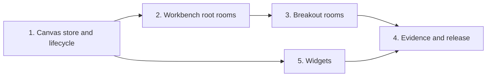

# Next: the scope for 0.7.0

**0.7.0 brings the canvas, breakout rooms, and widgets: background work
that a person can visit, and views that a person can see.** A canvas holds
the rooms of a deployment and what each room shows. An agent opens a
breakout room for background work, and the room reports back to it. An
agent shows and hides named widgets. The workbench hosts breakout rooms,
and camera chat hosts the viewfinder.

## Status

**Implementation is done, and the 0.7.0 release is prepared. A paid live run remains, on request.** [The canvas](../docs/canvas.md) owns the contract: the store,
the interface, the tools, and the bridge. [Widgets](../docs/widgets.md)
owns the widget contract. This file owns
delivery and evidence. [The backlog](backlog.md) holds work outside this
release.

## The scope

| Item | Delivery                                                       | Contract                                           |
| ---- | -------------------------------------------------------------- | -------------------------------------------------- |
| RT1  | A room operation requires a runtime, and a runtime its storage | [RT1](#the-items)                                  |
| CV1  | The package, the store port, and the memory and SQLite stores  | [The store](../docs/canvas.md#the-store)           |
| CV2  | The canvas lifecycle: resume, open, start, stop, close         | [The canvas](../docs/canvas.md#the-host-interface) |
| WB1  | Workbench root rooms on the canvas                             | [Phase 2](#phase-2-workbench-root-rooms)           |
| BR1  | `breakout`, `tell`, `archive`, `report`, the reminder, bounds  | [The tools](../docs/canvas.md#the-tools)           |
| BR2  | The bridge: close notices, replay, and recipients              | [The bridge](../docs/canvas.md#the-bridge)         |
| BR3  | Delegation in the workbench                                    | [Phase 3](#phase-3-breakout-rooms)                 |
| WG1  | Widget views: `show`, `hide`, revisions, and the kind catalog  | [Widgets](../docs/widgets.md)                      |
| WG2  | The camera-chat viewfinder on a canvas                         | [Phase 5](#phase-5-widgets)                        |

**The host composes existing kernel operations.** The canvas adds no
journal entry kind and no kernel operation. Each breakout room has its
own journal. RT1 changes the signatures of the room operations and adds
no operation.

**Widget views and widget acts are in 0.7.0.** A person sees a widget,
presses its buttons, and sends its forms.

## The order of work

**Each phase proves the boundary that the next phase uses.** Docs and
checks change with their phase.

### Phase 1. The canvas store and lifecycle

- [x] **1.** Require the runtime and its storage, and remove
      `defaultRuntime`. (RT1)
- [x] **2.** The package `@ambionframework/canvas`, the store port,
      `memoryCanvas`, `sqliteCanvas`, and `canvasStoreConformance`.
      Needs 1.
- [x] **3.** `openCanvas`, `resume`, `open`, `start`, `stop`, `close`,
      `rooms`, `subscribe`, and the mirror attach. Needs 2.

**Evidence:**

- `startRoom`, `resumeRoom`, and `readRoom` refuse a call with no runtime
  at the type level.
- `createRuntime` refuses a call with no storage. Every example names its
  storage.
- Both stores pass the conformance cases.
- A real room over a real journal resumes with the definitions that the
  host interface gives it, and the reserve holds no other definition.
- A root room with `agents` receives those definitions alone.
- `close` keeps each row `running`, and `stop` records `stopped`.
- A stop of a root with two running breakout rooms changes the root row
  alone. A start of the root runs both breakout rooms.
- A start of a breakout room under a stopped parent is a refusal.
- A row with no journal starts from its row.
- `open` before `resume` is a refusal. `open` with a team name is a
  refusal. `open` of a root row returns its handle and ignores the other
  options. `open` of a breakout name is a refusal.
- The assistant name and the summary writer name resolve at a start. A
  name that no definition resolves is a refusal.
- `resume` twice is a refusal.
- A stop stops the room first, then its mirror.
- A failed attach reaches `onError`, and the room runs. A failed start
  reaches `onError`, and the row stays `running`.
- `rooms()` lists the rows, and `subscribe` hears `opened`, `started`,
  `stopped`, and `archived`.
- The export snapshot lists the package.

### Phase 2. Workbench root rooms

- [x] **1.** Replace `workbench_rooms` with the canvas. Needs phase 1.
- [x] **2.** Verify scenario composition, visits, stop, resume, and
      shutdown. Needs 1.

**Evidence:** root rooms keep their assistants, seats, and scenarios. The
canvas owns room identity, the tree, and hosting intent. The host keeps its
feed, composer, room selection, scenario definitions, and workspace
browsers. A person's answer to an approval stays a room message. The
changelog names the dropped `workbench_rooms` table.

### Phase 3. Breakout rooms

- [x] **1.** `breakout`, `tell`, `archive`, `report`, the reminder, and
      the bounds. Needs phase 2.
- [x] **2.** The bridge. Needs 1.
- [x] **3.** Delegation in the workbench: a worker team and the two
      bundles. Needs 2.

**Evidence:**

- A goal and a message start a real breakout room on the scripted
  executor. The result carries the mirror path.
- The composition has no assistant, no summary writer, an empty reserve,
  and `seating: false`.
- A repeat `breakout` returns the same room, posts nothing, and ignores
  the other parameters. A repeat on a `stopped` row starts nothing. A
  repeat on an archived row returns its `close`.
- Each bound refuses with its cause. `breakout.to` outside `agents`, or at
  `none`, passes the kernel refusal through.
- `tell` steers a worker. A `tell` after an exchange closes opens a new
  exchange that the bridge reports.
- `tell` and `report` each refuse after `archive` and after `stop`.
- `tell` on a stopped room, and `report` with the parent stopped, are
  refusals.
- A `tell` and an `archive` on one room run in order. After `close`, every
  tool call is a refusal.
- `archive` records `done` or `failed`, stops the room, frees a
  `perOpener` place, and survives a crash between the row and the stop.
- `archive` of a stopped row stops nothing. A repeat `archive` returns
  the result. `archive` of another opener's room is a refusal.
- An archived room refuses `tell` and `start`, gets no close notice, and
  stays readable.
- A `report` reaches the opener, and that exchange gets no close notice.
  A `report` from a root room, and a `report` with no `ctx.exchange`,
  are refusals.
- An exchange with no report gets one notice.
- A worker gets no opener bundle, and `breakout` from a breakout room is a
  refusal.
- The reminder text lists one running and one stopped row, caps at ten
  lines, and ends with `and N more`.
- An opener at `none`, and an opener absent from the roster, get reports
  with no `to`. A found key gets no second post.
- A resume with an open exchange left in a breakout journal posts one
  notice.
- A crash after the row and before the start completes at the next
  `resume`.
- A replay after a restart posts each missing notice once, from stopped
  journals too.
- A person can visit a breakout room.

### Phase 4. Evidence and release

- [x] **1.** Run the workbench delegation end to end on scripted
      executors, and the repository gate. Needs phase 3.
- [x] **2.** Add one `pnpm chaos` case for each row of the crash table in
      [Durability](../docs/canvas.md#durability), and a case for a crash
      between the archive row and the stop, then a resume. Needs 1.
- [x] **3.** Finish the package docs, exports, and the changelog. Needs 2.

**Evidence:** the delegation scenario passes on scripted executors. Each
chaos case passes. Packaging and `pnpm check` pass. A paid live run needs an
explicit request for release evidence.

### Phase 5. Widgets

- [x] **1.** Widget revisions in the canvas store, `canvas.widgetTools()`,
      the reminder, the `widget` event, and the kind catalog.
- [x] **2.** Camera chat on a canvas: one viewfinder for each shown
      `frame` widget, bound to the process handle of the agent.
- [x] **3.** Move the sensor and actuator pages and rules to the
      workbench example.

**Evidence:** both stores pass the widget conformance cases. Camera chat
draws one box for each shown camera, and a hide removes it. The
changelog names each widget change. `pnpm check` passes.

## The items

**RT1. A room operation requires a runtime, and a runtime its storage.**
A room operation that falls back to a default runtime, or a runtime that
falls back to memory storage, lets a second process read an empty room
with no error.

1. Make `runtime` required on each room operation. Remove
   `defaultRuntime` and its export.
2. Make `storage` required on `createRuntime`. A test or an example that
   wants memory passes `memoryJournals()` by name.
3. Change each call site, about 78, in the packages, the examples, the
   docs, and the README.

**RT1 ships with CV1.** `openCanvas` already takes a runtime, so a host
changes how it opens a room once. The export snapshot and the changelog
change in the same commit.

## Out of scope

- Layout tools and code from an agent.
- Native executor subagents and vendor UI surfaces.
- Nested breakout rooms, and a general protocol to reconcile interrupted
  work.
- A bound on a chain of exchanges, and kernel spend quotas
  ([D1](backlog.md#designs-with-a-shape)).
- Cloudflare canvas support.
- An author across rooms, and isolated workspaces with mirror reads.
- Range recall (RC1) and the speaking text (SP1). They wait in the
  backlog for a measured need.

## Compatibility and release guards

The product rule in `CLAUDE.md` applies: no compatibility promise before
1.0.0. Name each change in the changelog, and update the export snapshot
and the golden journals with it.
