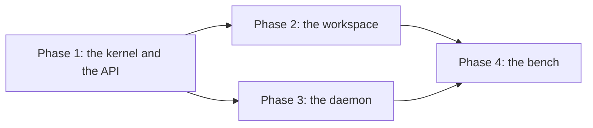

# Next: the scope for 0.5.0

> **No compatibility promise before 1.0.0.** 0.4.0 shipped on 2026-09-29
> from commit 98ab056, with eleven packages on npmjs. Until 1.0.0, any
> release may change any export, entry point, journal body, stored format,
> or package API.
>
> - **A change carries no compatibility path.** Add no re-export, no
>   deprecated alias, no reader for an older format, no upgrade step, and
>   no compatibility test.
> - **The changelog names each change** to an export, a journal body, or a
>   stored format.
> - **The guards pin the current surface.** The export snapshot
>   (`test/package.test.ts`), the golden journals (`test/golden.test.ts`),
>   and body validation (`test/journal-validation.test.ts`) catch a change
>   that nobody intended. A deliberate change updates them in the same
>   commit.

This file holds the open work for 0.5.0: the scope, the order of work,
the evidence, and the reason for the order. What landed leaves the
phases, and the [changelog](../CHANGELOG.md) records it.
[backlog.md](backlog.md) holds everything after 0.5.0, in the order of its
priority.

**An item lands with its evidence or stays open.** Every checkbox names an
item in [the items](#the-items). A phase closes when its evidence line
holds on main.

## Status

**0.4.0 shipped on 2026-09-29.** Every item of the plan merged, from #347
to #372, and the release commit is #375. The
[changelog](../CHANGELOG.md#040-2026-09-29)
holds the entry: each export and each journal body that changed, and each
concept that had two paths and has one.

**0.5.0 is in progress, and its scope is set.** 0.5.0 is the release of
sensors ([the scope](#050-is-the-release-of-sensors)). No step has landed
yet.

## Positioning

**Ambion is a collaboration kernel for agents and humans.** The
[README](../README.md) holds the statement, and
[Technical facts](../docs/technical-facts.md) holds the key facts and what
is new.

## 0.5.0 is the release of sensors

**0.5.0 lets a seat read a source outside the room.**
[Sensors](../docs/sensors.md) holds the spec, the use cases, and the
examples. Each item below states what changes and its evidence, and links
the spec for each mechanism. The release adds these:

- **A daemon behind one API.** `@ambionframework/sensors` serves each
  sensor over [the sensor API](../docs/sensors.md#the-sensor-api).
- **The `observe` tool and the reminder** of the workspace
  ([What the agent reads](../docs/sensors.md#what-the-agent-reads)).
- **Refs** to what a daemon stored, owned by the kernel
  ([Refs](../docs/sensors.md#refs)).
- **`followAndPost`,** which posts a detection with `room.post`
  ([The host posts a detection](../docs/sensors.md#the-host-posts-a-detection)).
- **The bench in the workbench**
  ([The bench](../docs/sensors.md#the-bench)).

**Acceptance.** Each step lands with its evidence, and `pnpm check`
passes. The coverage of each changed package holds, measured before and
after as `CLAUDE.md` states. The changelog names each export.

**An `SK` id names a kernel item, and an `SN` id names a sensor step.**
The ids stay stable across this file and the backlog. So a step of 0.5.x,
such as SN14, keeps its id in [D21](backlog.md#for-sensors), and the
phases below leave it out.

**Each step changes one package, plus the docs and root configs that name
its change.** SK1 and SK2 change the kernel. SN18 and SN31 change no
package.

**A step that changes an export names the change in the changelog, in the
same commit.** It also updates the export snapshot, as `CLAUDE.md` states.

**Each step removes the pending label of its part from
[Sensors](../docs/sensors.md), in the same commit.** SN31 removes the
banner when no part of 0.5.0 stays pending.

**Four packages and the workbench carry the work.**

| Package                      | Holds in 0.5.0                                                                                                   |
| ---------------------------- | ---------------------------------------------------------------------------------------------------------------- |
| `@ambionframework/ambion`    | `limits.exchange` (SK1), and the sensor forms of a ref (SK2)                                                     |
| `@ambionframework/workspace` | The `./sensors` entry: the API types, the client, the backend, the tools; `sensorConformance` in `./conformance` |
| `@ambionframework/sensors`   | New. The daemon, the acquire helpers, the reducers, and `followAndPost`; it calls `ffmpeg` and instruments       |
| `@ambionframework/pi`        | Nothing in 0.5.0; images in `runAgent` (SN24) follow in 0.5.x                                                    |
| `examples/workbench`         | The bench, the bench of the scenarios, a host that posts a detection, and one live case                          |

**`limits.exchange` bounds the spend of each exchange.** The next post
opens a new exchange. So `maxPerMinute` of `followAndPost` bounds a loop
of posts, and D22 of the backlog bounds a chain of scheduled says.

### The cut

**0.5.0 ships the architecture end to end, with the least risk to the
schedule.** It holds the API, the refs, the client, the conformance
suite, and the workspace. It holds the daemon with its store, its loops,
and the sources of still frames, series, and text. It holds
`followAndPost`, the host post, the bench, one live case, and the docs.

**Other parts follow in 0.5.x.** They are clips, audio, the live stream,
images in `runAgent`, `windowCaption`, and triggered captures, and
[D21](backlog.md#for-sensors) holds them. Annotations ship in 0.5.0 for
an `annotate` that the host writes. Their consumers in the package,
`windowCaption` and `transcribe`, ship in 0.5.x.

**A step that the cut splits keeps its id.** The table names each whole
step. The phases and the items name its part of 0.5.0, and state "In
0.5.0" and "Later". No step of 0.5.0 needs a later step or a later part.

| Step                                                                                                      | Ships in   | The later part, in 0.5.x                                                                                                                                  |
| --------------------------------------------------------------------------------------------------------- | ---------- | --------------------------------------------------------------------------------------------------------------------------------------------------------- |
| SK1. A hard bound on an exchange                                                                          | 0.5.0      | None                                                                                                                                                      |
| SK2. The sensor forms of the `ambion` scheme                                                              | 0.5.0      | None                                                                                                                                                      |
| SN1. The API types and the schema                                                                         | 0.5.0      | None                                                                                                                                                      |
| SN2. The scripted daemon                                                                                  | 0.5.0      | None                                                                                                                                                      |
| SN3. The client                                                                                           | 0.5.0      | None                                                                                                                                                      |
| SN4. `sensorConformance`                                                                                  | 0.5.0      | None                                                                                                                                                      |
| SN5. The backend slot and the reminder                                                                    | 0.5.0      | None                                                                                                                                                      |
| SN6. `observe` with no span, and the form of each part                                                    | 0.5.0      | None                                                                                                                                                      |
| SN7. `observe` with a span, and the exports                                                               | 0.5.0      | None                                                                                                                                                      |
| SN8. `tools({ images: false })`                                                                           | 0.5.0      | None                                                                                                                                                      |
| SN9. The package scaffold                                                                                 | 0.5.0      | None                                                                                                                                                      |
| SN10. `serveSensors`, the store, the tokens, and `cors`                                                   | 0.5.0      | None                                                                                                                                                      |
| SN11. The acquire loop and the reduce loop                                                                | 0.5.0 part | The live parts of `scriptedAcquire`                                                                                                                       |
| SN12. Spans, and sensors with no acquisition                                                              | 0.5.0      | None                                                                                                                                                      |
| SN13. Annotations                                                                                         | 0.5.0      | None                                                                                                                                                      |
| SN14. The live stream                                                                                     | 0.5.x      | The whole step                                                                                                                                            |
| SN15. A restart of the daemon                                                                             | 0.5.0      | None                                                                                                                                                      |
| SN16. The readings: `all`, `decimate`, `crossing`, `/series`, and live fragments                          | 0.5.0 part | Live fragments                                                                                                                                            |
| SN17. The instruments: `polled`, `scpiStream`, `scpiSocket`, `stateChange`, and a capture on each trigger | 0.5.0 part | `scpiTriggered`, and the live fragments of `scpiStream` and `polled`                                                                                      |
| SN18. A pinned `ffmpeg` in CI                                                                             | 0.5.0      | None                                                                                                                                                      |
| SN19. `/clip`, `/frame`, and frame decoding                                                               | 0.5.0 part | `/clip`                                                                                                                                                   |
| SN20. `ffmpegVideo`, the live pipe, and the child process                                                 | 0.5.0 part | The live pipe                                                                                                                                             |
| SN21. `keyframes`, `changes`, and `level`                                                                 | 0.5.0 part | The clip of one second in `level`                                                                                                                         |
| SN22. Audio, `/audio`, and live chunks                                                                    | 0.5.x      | The whole step                                                                                                                                            |
| SN23. Text, `/text`, and live lines                                                                       | 0.5.0 part | Live lines                                                                                                                                                |
| SN24. Images in `runAgent`                                                                                | 0.5.x      | The whole step                                                                                                                                            |
| SN25. `windowCaption`                                                                                     | 0.5.x      | The whole step                                                                                                                                            |
| SN26. `followAndPost`                                                                                     | 0.5.0      | None                                                                                                                                                      |
| SN27. The bench in the workbench                                                                          | 0.5.0 part | `mic`, `windowCaption`, and questions 4 and 7                                                                                                             |
| SN28. The host posts a detection                                                                          | 0.5.0      | None                                                                                                                                                      |
| SN29. The bench of the scenarios                                                                          | 0.5.0 part | `mic`, `scope` on each trigger, `windowCaption`, the views that read `/live`, a host that posts with `followAndPost`, and scenarios 1, 2, 3, 5, 7, and 11 |
| SN30. One live case                                                                                       | 0.5.0      | None                                                                                                                                                      |
| SN31. The closing docs                                                                                    | 0.5.0 part | Each later part removes its pending label from `docs/sensors.md`                                                                                          |

## The scope

**The journal holds five facts, and one projection reads them.** The facts
are messages, lease changes, closes, cancellations, and compositions. A
`run` entry fences each run. One pure `decide` admits one entry for each
command inside the journal queue, and the reconcile runs `decide` until
nothing changes.

**Deployment models.** The same rules serve four placements.

| Model                         | Placement                         | Persistence               | Support                                                            |
| ----------------------------- | --------------------------------- | ------------------------- | ------------------------------------------------------------------ |
| Embedded Node application     | Room and executors in one process | In-memory journals        | Supported for development, tests, and ephemeral lifetimes          |
| Persistent Node service       | An application-managed service    | SQLite journals           | Supported; the workbench example is the reference host             |
| Separate room and agent hosts | Calls cross the JSON protocol     | Each host chooses storage | Extension contract with a published conformance suite              |
| Cloudflare Durable Objects    | One object per room, one per seat | Each object's SQLite      | Publishable adapter tested in workerd; deployment commands pending |

## Out of scope

**These wait in the [backlog](backlog.md).** The backlog states the
condition that brings each one back.

- **The parts of sensors in 0.5.x ([D21](backlog.md#for-sensors)).** They
  are the live stream, audio, images in `runAgent`, `windowCaption`,
  triggered captures, clips, and the later questions and scenarios of the
  bench.
- **Compaction with no person (D2).** A summary goes to a person, so an
  exchange with no person never folds. Each post of a detection opens
  such an exchange, and adds it to the context of each later activation.
- **A count bound on a chain of scheduled says (D22).**
- **The neutral-file rule of `git-backend.ts` and `object-backend.ts`
  (K6).** SN5 holds the rule for `sensor-backend.ts` alone.
- **A dedicated error code for a key conflict.** `followAndPost` matches
  the text of the refusal (SN26).
- **The later parts of the design.**
  [Later parts](../docs/sensors.md#later-parts) of Sensors lists them.

## Decisions taken

- **A process wakes no seat.** The agent waits for its result inside the
  activation, and a wait stops before the room ends the activation. A host
  that wants a wake calls `room.post`
  ([Processes](../docs/processes.md#the-end-of-a-process)).
- **A scheduled say goes to its author alone.** The `schedule` tool sets
  `to` to the author and `after` to its argument. On the record, `to` names
  the author if and only if `after` is set. The room stamps the author and
  the returned say. No seat speaks under the name of a person, and no seat
  schedules work for another seat.
- **The system speaks, and an exchange has no owner.** The host and the
  room's clock write a `posted` entry with no author, and a returned say is
  a post with `returns`. A post opens an exchange when none is open.
  Otherwise it joins the open exchange and steers its target, or each seat
  at work when it has no target. An exchange has an opening message and a
  `person`, the first person who spoke in its range.
  [Exchange](../docs/exchange.md#4-who-directs-one-and-who-receives-its-result)
  holds the rules.
- **The journal records the schedule, and the host arms the clock.** The
  fold holds the pending says, and the room's alarm takes the earliest due
  time beside the lease expiries and the retry times. A restart reads the
  pending says from the journal.
- **The `assistant` room option stays.** It is shorthand for `agents`,
  `summary`, and `broadcast` attention.
- **These pairs stay.**
  - **`pi()` and `piExecution()`.** The first is definition data that
    crosses the wire. The second holds host functions and paths.
  - **The two stop mechanisms of a process.** A process of this run stops
    by an abort, since just-bash has no pid. An adopted process stops by
    its pid.
  - **The step mapping of each harness.** Each harness has its own wire
    format.
  - **The view interfaces of the room host.** `RoomBase`, `ControlHost`,
    `DispatchHost`, `PeopleHost`, and `WaitsHost` keep `control.ts`,
    `dispatch.ts`, `people.ts`, and `waits.ts` below `room-host/room.ts`
    in the layers that Biome holds.
- **One example.** The agentic lab workspace in
  [docs/example.md](../docs/example.md) stays the one example.
- **Two entries.** `@ambionframework/ambion` for applications and
  `@ambionframework/ambion/hosting` for hosts and adapters.
- **The kernel imports no model library.** The Pi, Claude, and Codex
  executors are packages, and each one adapts a harness.
- **Speech enters the record through `say` only**, on every executor.
- **Two release channels.** CI publishes a dev build of `main` to GitHub
  Packages under `dev`. An official release goes to npmjs from the owner's
  machine.
- **One package for each deployment shape.** `@ambionframework/just-bash`
  holds the local pair, and `@ambionframework/workstation` holds the lab
  pair. The core names a git transport and holds the refusal. Each access
  type lives with its pair.
- **The git backend on the workstation takes the defaults of its
  design.** [Workstation git](../docs/workstation-git.md#decisions-taken)
  lists them.
- **A sensor is a daemon behind one HTTP API.** Any program that passes
  `sensorConformance` is a sensor
  ([The sensor API](../docs/sensors.md#the-sensor-api)).
- **A daemon reads an instrument, and changes no setting of it.** A person
  sets each output
  ([Privacy and trust](../docs/sensors.md#privacy-and-trust)).
- **The sensor wire API carries a version number.** A breaking change of
  the wire raises `api`, apart from the versions of the packages. A client
  refuses a daemon at another `api`
  ([The sensor API](../docs/sensors.md#the-sensor-api)).
- **The kernel owns the sensor forms of a ref.** The workspace and the
  sensors package import them ([Refs](../docs/sensors.md#refs)).
- **A host starts an activation from a sensor.** It calls `followAndPost`,
  which posts with `room.post`. A sensor writes no journal entry
  ([Sensors and the room](../docs/sensors.md#sensors-and-the-room)).
- **0.5.0 ships a legal part of the wire.** `paths` lists the media paths
  that a sensor serves, and a daemon answers `404 unknown` for the others.
  `serveSensors` of 0.5.0 refuses `clip`, `audio`, and `live`
  ([Media](../docs/sensors.md#media)).
- **[Sensors](../docs/sensors.md#decisions-taken) lists the other
  decisions of the design.**

## The model to preserve

| Concern                                                       | Owner                 | Rule                                                                                                  |
| ------------------------------------------------------------- | --------------------- | ----------------------------------------------------------------------------------------------------- |
| Definitions, executors, tools                                 | Application code      | Fixed per room run; no executable code in the journal                                                 |
| Membership, presence, messages, exchanges, claims, references | Room journal          | Pure interpretation of confirmed entries                                                              |
| Model loops, harness sessions, activation steps               | Executor              | One harness session for each seat in each exchange, a cache; steps to the trace; speech through `say` |
| Files, tables, instruments, and their change logs             | Application resources | Independent of journal transactions; stamped with provenance                                          |
| Timers, runners, subscriptions, live handles, trace logs      | Host                  | Armed again from the journal after restart; the trace logger changes no outcome                       |
| Identity selection, discovery, hosting state, delivery outbox | Application           | Explicit entry and stable retry keys                                                                  |

**Judge a change by the obligation it removes.** Fewer exports are useful
when callers need fewer rules. A rename earns its place only when one name
means two things or two names mean one.

## The order of work

**Four phases.** Phase 1 changes the kernel and sets the contract of a
sensor. Phases 2 and 3 run beside each other, and phase 4 needs both. A
step names the steps of its phase by number, and a step of another phase
by its id. A step with no "Needs" line starts when its phase starts.

### Phase 1. The kernel and the API

**The kernel items land first, and then the contract of a sensor.** A
scripted daemon in the test support serves fixture parts, media, and live
events. So the client and the suite need no real source.

- [ ] **1.** The sensor forms of the `ambion` scheme. (SK2)
- [ ] **2.** A hard bound on an exchange. (SK1)
- [ ] **3.** The API types and the schema. (SN1)
- [ ] **4.** The scripted daemon. Needs 3. (SN2)
- [ ] **5.** The client. Needs 1 and 4. (SN3)
- [ ] **6.** `sensorConformance`. Needs 5. (SN4)

**Evidence:** the scripted daemon passes `sensorConformance`, and a
daemon that breaks one rule fails it. The export snapshot of
`@ambionframework/workspace` names the `./sensors` entry, the
`./sensor-api.schema.json` export, and `sensorConformance` and the
conformance fixture in `./conformance`. The build of `./sensors` imports
no `vitest`, no `just-bash`, and no `node:sqlite`.

### Phase 2. The workspace

**An agent reads sensors through the workspace.** Every step runs a real
room over a memory backend. The client points at the scripted daemon on a
loopback port.

- [ ] **1.** The backend slot and the reminder. (SN5)
- [ ] **2.** `observe` with no span, and the form of each part. Needs 1.
      (SN6)
- [ ] **3.** `observe` with a span, and the exports. Needs 2. (SN7)
- [ ] **4.** `tools({ images: false })`. Needs 2. (SN8)

**Evidence:** each step keeps `pnpm check` green, and holds the coverage
of its package, measured before and after as `CLAUDE.md` states. Steps 1
and 4 update the export snapshot.

### Phase 3. The daemon

**`@ambionframework/sensors` serves real sources.** From SN10 on, each
step in that package runs `serveSensors` on a loopback port, on the
system clock. From SN12 on, each step passes the full suite of
`sensorConformance`, over HTTP, on real timers. A test of a loop calls
the loop directly, on `fakeClock` from `@ambionframework/ambion/testing`.

- [ ] **1.** The package scaffold: `@ambionframework/sensors`,
      `defineSensor`, and the `./testing` entry. (SN9)
- [ ] **2.** `serveSensors`, the store, the tokens, and `cors`. Needs 1.
      (SN10)
- [ ] **3.** The acquire loop and the reduce loop. Needs 2. (SN11)
- [ ] **4.** Spans, and sensors with no acquisition. Needs 3. (SN12)
- [ ] **5.** Annotations. Needs 3. (SN13)
- [ ] **6.** A restart of the daemon. Needs 4. (SN15)
- [ ] **7.** The readings: `all`, `decimate`, `crossing`, and `/series`.
      Needs 4. (SN16)
- [ ] **8.** The instruments: `polled`, `scpiStream`, `scpiSocket`, and
      `stateChange`. Needs 7. (SN17)
- [ ] **9.** A pinned `ffmpeg` in CI. (SN18)
- [ ] **10.** `/frame` and frame decoding. Needs 4 and 9. (SN19)
- [ ] **11.** `ffmpegVideo` and the child process. Needs 10. (SN20)
- [ ] **12.** `keyframes`, `changes`, and `level`. Needs 4 and 10. (SN21)
- [ ] **13.** Text and `/text`. Needs 4. (SN23)
- [ ] **14.** `followAndPost`. Needs 4 and SK2. (SN26)

**Evidence:** `serveSensors` passes the full `sensorConformance` after
each step in `@ambionframework/sensors` from SN12 on, and the named cases
of SN10 before it. The suite runs the paths that each sensor lists in
`paths`, and checks `404 unknown` for the others.

Each reducer test runs its reducer twice over one fixture, and gets the
same result. A test that needs `ffmpeg` fails when it is absent. No test
skips. SN9 makes the new package pass the package-hygiene checks, and
join the lockstep version.

### Phase 4. The bench

**The workbench shows the bench, and the docs close the release.**

- [ ] **1.** The bench in the workbench. Needs the steps of phases 2
      and 3. (SN27)
- [ ] **2.** The host posts a detection. Needs 1, SN26, and SK1. (SN28)
- [ ] **3.** The bench of the scenarios. Needs 1. (SN29)
- [ ] **4.** One live case. Needs 1. (SN30)
- [ ] **5.** The closing docs. Needs 1, 2, and 3. (SN31)

**Evidence:** questions 1, 2, 3, 5, 6, 8, and 9 of
[The bench](../docs/sensors.md#the-bench) run on the scripted tier. So do
scenarios 4, 6, 8, 9, 10, and 12 of the
[use cases](../docs/sensors.md#use-cases-scenarios-on-an-electronics-bench).
Scenarios 8 and 10 run their agent half alone, because their person half
reads `/live`.

One live case runs on Pi, on `main`, outside the pull request.

### Why this order

- **The kernel items come first.** SN3 and SN26 import the sensor forms
  of SK2, and SN28 needs the bound of SK1.
- **The API comes next.** The client, the workspace, and the daemon each
  build on the types, and the suite checks the daemon at each step.
- **The workspace and the daemon run beside each other.** Phase 2 runs on
  the scripted daemon, and phase 3 runs on the conformance suite.
- **The scaffold comes before the daemon, and the store before the
  loops.** So each later step of phase 3 changes code and tests, and a
  restart reads a store of a fixed shape.
- **CI gets `ffmpeg` before the video.** SN18 pins one build, so the
  steps that decode run one decoder in each job.
- **`followAndPost` comes before the host of the workbench.** SN26 proves
  the helper on a scripted room. So SN28 adds only the host and the case
  of SK1.
- **0.5.0 cuts where the risk to the schedule is least.** Each part of
  0.5.x adds a decoder, a model path, or a protocol.
- **The live case comes after the bench.** The scripted tier proves each
  step, and one live case confirms the path of the model.

## The items

**Each item states what changes, what it needs, and its evidence.**
[Sensors](../docs/sensors.md) states each mechanism, and the item links
it.

### The kernel

**SK1. A hard bound on an exchange.** Nothing bounds the usage of one
exchange ([Exchange](../docs/exchange.md#9-a-gap-the-room-has)).
`limits.exchange` of the runtime bounds the activations or the usage of
one exchange. The room writes the close, and `exchangeOutcome` gets a
terminal outcome beside `exhausted`.

SK1 closes one exchange, and the next post opens a new exchange. So SK1
bounds the spend of each exchange, and a host bounds the rate of its
posts.

**Evidence:** a loop of posts that steers one exchange stops at
`limits.exchange`, and the room writes the close. `exchangeOutcome` gives
the new terminal outcome, and the next post opens a new exchange.
`exchangeOutcome` lives in `room/rules.verified.ts`, so `pnpm rule:check`
proves the changed rule, and a binding case holds it. SN28 runs the same
case in the workbench.

**SK2. The sensor forms of the `ambion` scheme.** The kernel owns the
scheme, and `isRef` accepts four forms today. SK2 adds the three forms of
[Refs](../docs/sensors.md#refs), and `isRef` accepts them. A name check
reuses `isName` of the kernel, and adds a limit of 32 characters. SK2
changes these:

- The named exports of `packages/ambion/src/index.ts`: `sensorUri`,
  `parseSensorUri`, and the type `SensorTarget`, exported beside
  `CommitUri`.
- The export list of `packages/ambion/test/package.test.ts`.
- `isRef`, and the refusal text `GRAMMAR` of `refs.ts`, which names four
  forms.
- The module comment of `refs.ts`, which says it defines four forms.
- The changelog, and the tests of each form.

**Evidence:** each form reads back with `parseSensorUri` as it was built.
`%3A`, a name outside the grammar, and `from` after `to` give
`undefined`. `sensorUri` gives a `RangeError` for a name, a `seq`, or a
time outside the grammar. `isRef` accepts each form, and a message that
carries a sensor ref lands. `GRAMMAR` names the sensor forms.

### Phase 1: the API

**SN1. The API types and the schema.** The `./sensors` entry of
`@ambionframework/workspace` defines the types, the live events, and the
error codes of [The sensor API](../docs/sensors.md#the-sensor-api). Each
`Acquisition` carries `paths`, and each JSON body carries `api`. The
TypeBox schemas split across several files, so each file stays under the
600 lines of `scripts/file-budget.test.mjs`.

The step commits `packages/workspace/sensor-api.schema.json`, adds it to
`files`, and exports it as `./sensor-api.schema.json`. The schema names
`oneOf` itself, because `Type.Union` of TypeBox emits `anyOf`. The step
updates the package test of `packages/workspace`:

- The count of entries, the `STEMS` map, and the manifest loop, which
  skips `./sensor-api.schema.json` as it skips `./package.json`.
- The entry list of tsdown.
- The banned-import table, which bans `vitest`, `just-bash`, and
  `node:sqlite` in `./sensors`.

**Evidence:** each sample body of the test passes the published schema.
A part with both `data` and `file`, or with neither, fails it. A time
with an offset, or with other than three digits of milliseconds, fails
it. A text part past 65,536 characters inline fails it.

A body with no `api`, and an acquisition with no `paths`, fail it. The
test that generates the schema again finds the committed file current.
The build of `./sensors`, and each chunk that it imports, holds no import
of `vitest`, `just-bash`, or `node:sqlite`.

**SN2. The scripted daemon.** `scriptedDaemon(fixture)` in the test support
of `packages/workspace` serves a fixture over `node:http` on port 0. Its
clock has an offset that the fixture sets, so its `now` differs from the
host clock. It serves an index, stored observations of each part kind, media
bytes, and live events of each kind. Its live stream has
`{ bufferMs: 200, pingMs: 500 }`.

One video sensor lists `['frame']` alone, and an option makes the index
give `api: 2`. The daemon starts again on the same port with the same
logs. It has these fault switches for SN4:

- A `seq` out of order.
- `waitMs` ignored.
- A `read` token accepted on `PUT /note`.
- A body with no `api`.
- A media path served that `paths` does not list.

**Needs:** SN1.

**Evidence:** the scripted daemon answers each path of the API, and each
of its bodies passes the published schema. After a start on the same
port, it serves the same logs. Each fault switch breaks the one rule
that it names.

**SN3. The client.** `daemonClient(entry)` gives the calls of
[The client and the backend](../docs/sensors.md#the-client-and-the-backend),
over `fetch` of the entry or the global `fetch`. It takes the skew as
`now` minus the middle of the request, and skips a request over 100 ms.
The client refuses an index at another `api`, and names both numbers and
each sensor of the index.

The client imports `sensorUri` and `parseSensorUri` from
`@ambionframework/ambion`.

**Needs:** SK2 and SN2.

**Evidence:** against the scripted daemon, `index` lists each sensor
with the status that `GET /` of the sensor gives, and each method gives
the fixture. `follow` from a cursor yields each later item once, across
a restart of the daemon, for both logs.

`live` yields frames, audio, series, and text, and a `gap`. `text` gives
the stamped lines. `clip` and `frame` give `X-From` and `X-At`. After a
request that takes 300 ms, `skew()` keeps its earlier value. A wrong
token gives `unauthorized`.

An index at `api: 2` gives an error that names the daemon at 2, the
client at 1, and each sensor of the index.

**SN4. `sensorConformance`.** `@ambionframework/workspace/conformance`
exports `sensorConformance(url, tokens, options?)` beside
`workspaceConformance`, and the conformance fixture as data.

The suite runs as
[Tokens, errors, and clocks](../docs/sensors.md#tokens-errors-and-clocks)
states: each path of each sensor in the index, on real timers, over HTTP. It
checks `404 unknown` for each path that `paths` does not list. The
banned-import table keeps the `./conformance` build free of `vitest`.

**Needs:** SN3.

**Evidence:** the scripted daemon passes, with its sensor that lists
`['frame']` alone. It fails with each fault switch of SN2 on, and the
failure message names the rule.

### Phase 2: the workspace

**SN5. The backend slot and the reminder.** `WorkspaceBackends` gets
`sensors?: SensorBackend`, which `sensors()` builds
([Open a workspace with sensors](../docs/sensors.md#open-a-workspace-with-sensors)).
Each activation reads the index of each daemon at once, with a timeout of
2 seconds, and gives one line for each sensor
([The reminder](../docs/sensors.md#the-reminder)).

The combined `remind` races the process part against its own timer, under the
5 seconds of `REMINDER_TIMEOUT_MS`. `SensorBackend.dispose()` aborts the
requests in flight, before the SQL owner disposes.

`SensorBackend` and `SensorEntry` live in
`packages/workspace/src/sensor-backend.ts`, a neutral file. The step
holds that rule with three changes:

- **The neutral override.** `sensor-backend.ts` joins the override of
  `biome.jsonc` that lists `backend.ts` and `git-backend.ts`.
- **The exclusions of the next override.** The override for
  `packages/workspace/src/**` gets
  `!packages/workspace/src/sensor-backend.ts` in its exclusions.
- **A probe.** `scripts/import-rules.test.mjs` gets a case in which
  `sensor-backend.ts` imports `@ambionframework/ambion`. A case names a
  folder today, so a case gets an optional file name.

**Evidence:** `resolveReminders` gives one line for each sensor of two
scripted daemons, and the process lines of the seat. A sensor that a
daemon adds between two activations appears in the second. A clash
appears, and a `prefix` removes it. A daemon that does not answer gives
`unreachable` inside the budget.

A daemon at `api: 2` gives
`incompatible: the daemon speaks api 2, this client speaks api 1` for
each sensor of its index. A caption and a console line stand in quotes
after `data:`, and the note has no quotes. `sensors()` refuses two
daemons with one name, and a name that starts with a digit.

A process part that hangs past its timeout leaves the sensor lines in
the reminder, and writes no `seen`. A workspace with no sensor backend
has no sensor tools. `dispose` aborts a request that hangs, and then the
SQL owner disposes.

`pnpm check` passes with `sensor-backend.ts` in the neutral list of
`biome.jsonc`. The new probe of `scripts/import-rules.test.mjs` finds the
import of `@ambionframework/ambion` in `sensor-backend.ts` refused.

**SN6. `observe` with no span, and the form of each part.** The tool
calls `POST /observe`, or `/frame` with `at`, and renders each part as
[The `observe` tool](../docs/sensors.md#the-observe-tool) states. It
writes the export in one `use` call as the calling agent, and puts
`{ sensor, from, to, everyMs, refs }` in `ToolResult.details`.

Each text from the source stands between the sensor data marks. The step
delivers the text of [The guidance](../docs/sensors.md#the-guidance) with the
tool.

**Needs:** SN5.

**Evidence:** a real room with a scripted seat calls `observe`, and its
say lands. A fixture observation with one part of each kind gives the
line of each kind, and the export holds each file. `at` gives the frame
that `X-At` names. `at` on a series sensor gets a refusal that names the
call that fits.

An old newest observation gives `Stale`. A `runAgent` call with the
bundle observes a sensor with no reminder. The audit entry names the
agent and the room, and keeps `{ sensor, from, to, everyMs, refs }` from
`ToolResult.details`. The guidance of the bundle holds the text of the
design.

The result gives the ref of the newest observation and of each
detection. A say that puts one of them on its message lands. A text part
and a string of `details` of the fixture stand between the marks, and
the note stands outside them. `observe` of a sensor of a daemon at
`api: 2` gets the `incompatible` text.

**SN7. `observe` with a span, and the exports.** A span is
`{ from, to }`, or `{ last }`, which ends at `now` of the daemon. A span
with no `everyMs` reads at most 10,000 lines of each log into the export,
and fetches no media. A span with `everyMs` returns at most 10 frames, or
calls `/series` on a series sensor. A span of history gives one span ref
beside the refs of what it shows.

**Needs:** SN6.

**Evidence:** a span of one hour over the fixture gives an export with
every line of the span, and no image. `{ last: 60000 }` gives the minute
before `now` of the scripted daemon, whose clock differs from the host
clock. The header names the span that `{ last }` gave, and the audit
entry keeps it. The span ref reads back with `parseSensorUri` as that
span.

A span past 10,000 lines gives the first 10,000, and names the time
where the export stops. A span with `everyMs` gives at most 10 frames,
and on a series sensor one CSV for each fragment of `/series`. A
`422 span` reaches the seat with the oldest time.

**SN8. `tools({ images: false })`.** `WorkspaceToolsOptions` gets
`images`, beside `skills`. With `images: false`, `observe` turns each
frame into a line that names its time and its path in the export. The
parameter schema of `observe` stays the same, so the `shapeOf`
comparison of the workbench tool-set test holds for `experiments`.

**Needs:** SN6.

**Evidence:** the result of one `observe` holds text parts only, with
skills and with none. [Codex](../docs/codex.md) states that a Codex
definition takes this bundle.

### Phase 3: the daemon

**SN9. The package scaffold.** `@ambionframework/sensors` starts with
`defineSensor`, which gives an immutable value as `defineTool` does, and
the entry `@ambionframework/sensors/testing`. The package joins the
repository as a publishable package, and joins the lockstep version:

- **The package files.** A copy of `LICENSE`, the README, `files`,
  `publishConfig`, and `engines.node` `>=22.19.0`.
  `@ambionframework/ambion`, `@ambionframework/pi`, and
  `@ambionframework/workspace` go under `dependencies`.
- **Toolchain.** The graph edge `sensors ──▶ ambion, pi, workspace` goes
  in [section 1](../docs/toolchain.md#1-repository-layout), and in its
  layout tree. Section 1 counts eleven packages and section 9 counts ten,
  so the step sets both counts to twelve.
- **`CLAUDE.md`.** Its table of paths gets a `packages/sensors` line.
- **The import rules.** The core-reach rule of `biome.jsonc` gets
  `packages/sensors/src/**`, and `scripts/import-rules.test.mjs` gets a
  case for it.
- **The backlog.** R1 names twelve packages.

**Evidence:** `defineSensor` gives a frozen value. The new case of
`scripts/import-rules.test.mjs` passes. `pnpm run check:packages` and
`node scripts/publish.mjs --channel dev --pack-only` pass.

**SN10. `serveSensors`, the store, the tokens, and `cors`.**
`serveSensors` serves the index at `/`, and each sensor at `/<name>/`
([Serve a sensor](../docs/sensors.md#serve-a-sensor),
[The store of a daemon](../docs/sensors.md#the-store-of-a-daemon)). It
refuses a sensor key outside `^[a-z][a-z0-9-]{0,31}$`. At start, it
refuses an acquisition whose `paths` lists `clip`, `audio`, or `live`.

In 0.5.x, SN14 removes `live` from the refusal, SN19 `clip`, and SN22
`audio`.

**Needs:** SN9.

**Evidence:** the named cases of `sensorConformance` pass: the index,
the status, the tokens and the scopes, the errors, the files, and the
note. They run over a sensor whose store the test seeds: the test writes
its log files before `serveSensors` opens `dir`. The full suite waits
for SN12.

`serveSensors` on port 0, with two such sensors, gives a `url` with its
port, and its index lists both. `close` stops the server. `serveSensors`
refuses a sensor key that starts with a digit, and an acquisition whose
`paths` lists `clip`.

An origin outside `cors` gets no preflight answer. `/files/../note.md`
gets `404 unknown`, and so does `/frame` of a sensor with no
acquisition.

**SN11. The acquire loop and the reduce loop.** The daemon runs the loops
of [Acquire](../docs/sensors.md#acquire) and
[Reduce](../docs/sensors.md#reduce), with a sidecar for each segment.
`@ambionframework/sensors/testing` ships `scriptedAcquire(fixture)`. It
stamps each segment on the clock of the daemon, and loops the fixture.

In 0.5.0: the two loops, and `scriptedAcquire` with segments. Later,
with SN14: the live parts of `scriptedAcquire`.

**Needs:** SN10.

**Evidence:** `serveSensors` listens on port 0, and the test reads the
port from `url`. A test calls the loops directly on `fakeClock`, and
`scriptedAcquire` with a fixture reducer stores the expected lines in
`seq` order. Each segment has its sidecar, and segments past `keepMs`
leave the directory with their sidecars.

A throwing `acquire` restarts, and the fault reaches `GET /`. Two
reductions never overlap. A reducer that hangs aborts at the interval.
`close` stops both loops. A fixture of two segments, looped, gives
segments whose times follow the clock of the daemon.

**SN12. Spans, and sensors with no acquisition.** `POST /observe` with a
span on a video or an audio sensor reduces the segments of the span
again, and stores no line. A sensor with no `acquire` reduces on each
`POST /observe`
([Observations and detections](../docs/sensors.md#observations-and-detections)).

The step serves the conformance fixture of SN4. SN16 adds `series` to its
`paths`, SN19 adds `frame`, and SN23 adds `text`.

**Needs:** SN11.

**Evidence:** a span over scripted segments runs a second reduction at
`everyMs`, and calls no `annotate`. It stores no line, and a clip of the
span has a file id. A span that hangs gets `503 unavailable`, and the
reduce loop keeps its rate. The refusal names the oldest time.

A sensor with no `acquire` reduces once for each call, `/observations`
lists each result, and it has no media path. `serveSensors` over the
conformance fixture passes the full `sensorConformance`, the first step
that does.

**SN13. Annotations.** After the reducer, the daemon calls `annotate`
once for each kept observation, and adds its text parts
([Annotate](../docs/sensors.md#annotate)). The step adds the `annotate`
option of `defineSensor`, and the types `Annotate` and `AnnotateContext`.

In 0.5.0, the step serves an `annotate` that the host writes. Its
consumers in the package, `windowCaption` (SN25) and `transcribe`
(SN22), ship in 0.5.x.

**Needs:** SN11.

**Evidence:** a counting function sees one call for each kept
observation, and none for a segment. `recent` holds the observations
before the new one. A throwing function leaves the line with no text.

**SN15. A restart of the daemon.** At start, the daemon reads the last
line of each log, and rescans `acquisition/` for each sidecar. `seq`
continues, and `since` is the `at` of the newest observation.

**Needs:** SN12.

**Evidence:** a second `serveSensors` over one `dir` continues `seq`,
and the daemon stores no observation twice. A span over the kept
acquisition works after the restart, from the sidecars that the first
daemon wrote.

**SN16. The readings: `all`, `decimate`, `crossing`, and `/series`.**
Each case runs over `scriptedAcquire`. `/series` gives one fragment for
each channel and each run with no gap. With `everyMs`, it gives an
envelope in bins from `from`. The step adds `series` to the `paths` of
the conformance fixture. In 0.5.0: `all`, `decimate`, `crossing`, and
`/series`. Later, with SN14: live fragments.

**Needs:** SN12.

**Evidence:** a CSV fixture with a dip and a gap gives two fragments. The
envelope holds the dip in `min`, and a detection comes at the reading of
the dip. `/series` past 100,000 values gets `413 size`. `all` gives the
output of each reducer that it runs.

**SN17. The instruments: `polled`, `scpiStream`, `scpiSocket`, and
`stateChange`.** The step ships these helpers of
[Acquire](../docs/sensors.md#acquire), and the scripted instrument of
`@ambionframework/sensors/testing`. The scripted instrument gives a
`query` function over a table of answers, and a TCP server on port 0.

In 0.5.0: these helpers and the scripted instrument, with no live part.
Later: `scpiTriggered`, and, with SN14, the live fragments.

**Needs:** SN16.

**Evidence:** `polled` on a fake clock calls its function once for each
interval, and gives one fragment of each channel. `stateChange` over a
scripted supply gives one `state changed` detection with the difference.
`scpiStream` over the scripted instrument writes CSV segments, and
`/series` reads their values back.

The scripted instrument receives queries and `SYST:LOC` after each read.
It receives no command that sets a value. `scpiSocket` against a TCP
server on port 0 sends a command and reads its answer.

**SN18. A pinned `ffmpeg` in CI.** CI installs a pinned static build of
`ffmpeg` in the `test` and `test-library-floor` jobs of `ci.yml`. The
`packages` job of `live.yml` and the `publish` job of `dev-release.yml`
install the same build. `scripts/setup.sh` installs it for a
contributor.

[Toolchain](../docs/toolchain.md#8-continuous-integration-githubworkflowsciyml)
section 8 names the version.

**Evidence:** each of the four jobs prints the pinned version of
`ffmpeg` before its tests.

**SN19. `/frame` and frame decoding.** `/frame` decodes the frame nearest
`at`, and scales it to `width` ([Media](../docs/sensors.md#media)).
`fixtureMedia(dir)` of `@ambionframework/sensors/testing` runs the pinned
`ffmpeg` on `lavfi`. It writes two seconds of MP4 at 30 fps, with a box
that is on for frames 42 to 44.

The step adds `frame` to the `paths` of the conformance fixture. In
0.5.0: `/frame`, frame decoding, and the fixtures. Later: `/clip`.

**Needs:** SN12 and SN18.

**Evidence:** `/frame` gives the frame that `X-At` names. A request that
starts before `oldest` gets `422 span`. A test that needs `ffmpeg` fails
when it is absent. No test skips. `serveSensors` passes the full suite
with `frame` in the `paths` of the fixture.

**SN20. `ffmpegVideo` and the child process.** `ffmpegVideo` runs one
`ffmpeg` child, and writes its process id in `dir`. At start, it stops a
child that a crash left running. The crash test runs the daemon in a
child Node process, kills it with `SIGKILL`, and starts a second daemon
over the same `dir`. In 0.5.0: the segment output alone, the child
process, and `paths` of `['frame']`. Later, with SN14: the live pipe.

**Needs:** SN19.

**Evidence:** over the fixture as its input, `ffmpegVideo` writes
segments that hold the fixture. After the crash, the leftover `ffmpeg`
child stops: `process.kill(pid, 0)` on its process id fails with
`ESRCH`. The file of the process id names the new child.

**SN21. `keyframes`, `changes`, and `level`.** Each reducer of
[Reduce](../docs/sensors.md#reduce) runs over the segments of the MP4
fixture. In 0.5.0: `level` keeps the frames on each side of a crossing.
Later, with `/clip`: the clip of one second.

**Needs:** SN12 and SN19.

**Evidence:** `level` gives `led on` and `led off` at the frames where
the region crosses. A span with `everyMs: 33` gives one observation for
each frame. `keyframes` keeps the last frame of each interval at
`width`. `changes` keeps a frame when the region differs from the frame
before it.

**SN23. Text and `/text`.** `serialDevice`, `serialLines`, and `lines`
of [Acquire](../docs/sensors.md#acquire) give a text sensor. The test of
`serialDevice` runs over a FIFO, with a stub `stty` first on `PATH`. So
it needs no serial device, no pty, and no root. The step adds `text` to
the `paths` of the conformance fixture. In 0.5.0: the three helpers and
`/text`. Later, with SN14: live lines.

`mkfifo` makes the FIFO on the Linux and macOS runners of CI, and
`node:fs` opens it as it opens a device. The stub records its arguments
and exits 0.

**Needs:** SN12.

**Evidence:** a scripted console with a boot banner, given as a
`ReadableStream`, gives a `reset` detection at the time of the banner. A
boot of 1,000 lines each second puts the text past 64 KB in a file part.
`/text` gives each line of the stretch with its time.

`serialDevice` over the FIFO calls the stub with
`-F <fifo> 115200 raw`, and each line that the test writes to the FIFO
reaches `serialLines`.

**SN26. `followAndPost`.** `@ambionframework/sensors` exports
`followAndPost(room, sensor, policy)`
([The host posts a detection](../docs/sensors.md#the-host-posts-a-detection)).
It follows `/detections`, and posts each label of `labels` under the key
`detection:<daemon>:<sensor>:<seq>`, with the ref that `sensorUri`
builds.

The helper reads a key conflict as a post that landed, by the prefix of
the text of `messageKeyConflict`. It reads the log with `follow`, whose
paging and `waitMs` SN12 tests in the full suite.

**Needs:** SN12 and SK2.

**Evidence:** each case runs a real room with a scripted seat, and
`serveSensors` over a seeded store, as in SN10. A detection with a label
outside `labels` gives no post. A post carries the ref of its detection,
and `parseSensorUri` reads that ref back as the daemon, the sensor, and
the `seq`.

A replay from 0 over detections that the helper posted before lands
each key once, and the record holds one post for each. Ten detections in
one minute give six posts, and the cursor stands at the tenth. A replay
from 0 skips the same four. A second call with the same `cursor` posts
only the later detections, and its count starts empty.

A replay from 0 after a change to `text` gets the key conflict for each
earlier post. The helper advances the cursor, and the record holds one
post for each key. An abort of `signal` ends the loop, and the promise
resolves. A stopped room with no abort ends the loop at the next
detection. The promise resolves with the cursor at the last `seq` that
it handled.

### Phase 4: the bench

**SN27. The bench in the workbench.** The workbench starts `bench-ws`,
`lxi-gw`, and `thermo-pi` as three `serveSensors` calls in its process,
on loopback ports. The workspace reads each daemon over HTTP, with no
path around the API. The sensors acquire through `scriptedAcquire`, and
`scope` reads a scripted instrument on each observe. The workbench calls
`fixtureMedia` at test time and at start, so it needs `ffmpeg`.

`instruments` carries `[workspace.tools()]` with the sensors and no
`instrument.tools()`. `experiments` carries
`workspace.tools({ images: false })`. The step changes the workbench
tests, which hold one tool list for every seat:

- **`src/families.ts`** gets `instruments: 'pi'` in `seatFamilies`.
  `test/families.test.ts` expects it, and `describeUnavailable({})` gives
  five lines. In "Workbench with no key", the `unavailable` view also
  lists `'instruments'`.
- **`test/tool-set.test.ts`** expects `pi` for `instruments`, and
  compares each other seat with the first seat. The list of `instruments`
  is that list with no `operate` and no `approve_operation`. The check of
  equal guidance leaves out `instruments`.
- **`test/live/tool-set.test.ts`** adds `instruments` to its seats, with
  the same list.

In 0.5.0: seven sensors, with no `mic`, and cameras with no
`windowCaption`. Questions 1, 2, 3, 5, and 6 run. Later: `mic`,
`windowCaption`, and questions 4 and 7.

**Needs:** the steps of phases 2 and 3.

**Evidence:** the questions of the bench before the host post run as
`it.each` over one table. A scripted seat reads the reminder, calls
`observe`, and says the answer that the path of each question gives. The
tools of `instruments` hold no tool that sets an output.

**SN28. The host posts a detection.** `OpenOptions` of
`examples/workbench/src/workbench.ts` and `RoomsOptions` of
`examples/workbench/src/rooms.ts` get `clock?: Clock` and `limits`.
`rooms.ts` passes both to `createRuntime`, so a test runs on `fakeClock`,
and `limits.exchange` bounds each room.

The host calls `followAndPost` on `t-heatsink` with the label of its
`crossing`, `to: 'instruments'`, and a stored cursor. The text asks the seat
to tell Mira, a person of the workbench. The key of a post is
`detection:thermo-pi:t-heatsink:<seq>`.

**Needs:** SN27, SN26, and SK1.

**Evidence:** a scripted crossing gives one post, which opens an
exchange with no person. The scripted seat says to Mira, the exchange
reads `awaiting` Mira, and `pendingFor` lists it for Mira. A restart of
the host resumes from the cursor, and a second post under one key lands
once.

A loop of posts that steers one exchange stops at `limits.exchange`, and
the room writes the close. The next post opens a new exchange. A
scheduled check, the last question of the bench, returns each 5 minutes
on the fake clock. A check that passes closes with no summary.

**SN29. The bench of the scenarios.** A second host of the workbench
serves the thirteen sensors of the
[use cases](../docs/sensors.md#use-cases-scenarios-on-an-electronics-bench).
It has its own three daemons, its own `sensors()` configuration, and its
own workspace.

Its instruments are scripted, and its cameras and `uart` acquire through
`scriptedAcquire`. Scripted reducers read the digits of `panel-cam` and give
`t-max` of `thermal-cam`.

A `firmware` scripted seat joins beside `instruments`, outside
`seatFamilies` and the tool-set tests. In 0.5.0: each sensor but `mic`
and `scope`, and cameras with no `windowCaption`. Scenarios 4, 6, 8, 9,
10, and 12 run, and 8 and 10 run their agent half alone. Later: `scope`
on each trigger, a host that posts, `mic`, `windowCaption`, the views
that read `/live`, and scenarios 1, 2, 3, 5, 7, and 11.

**Needs:** SN27.

**Evidence:** the scenarios run as a second `it.each` table. In each
scenario, a scripted seat reads the reminder, calls `observe`, and says
the answer that the scenario gives. No scripted instrument receives a
command that sets a value.

**SN30. One live case.** The question about the blink runs on a real
model in `examples/workbench/test/live/sensors.test.ts`. The seat finds
`led on`, observes a span of the multimeter, and states the rail at the
time of the blink. `level` gives `led on` from frames, so the case runs
in 0.5.0.

The case selects Pi as the other live tests of the workbench do.
`seatFamilies` gives `instruments` the Pi family, and `keyVariable` names
the key of the provider of `AMBION_MODEL`: `ANTHROPIC_API_KEY` by default.
`describe.skipIf` skips the case when that key is absent. The live tests
of the workbench read no `AMBION_HARNESS`.

**Needs:** SN27.

**Evidence:** in the pull request, the scripted run of the same question
passes. The live tier runs the case on `main`, in the `packages` job of
`.github/workflows/live.yml`. It stays off pull requests, as `CLAUDE.md`
states.

**SN31. The closing docs.** Each earlier step removes the pending label
of its part from [Sensors](../docs/sensors.md). SN31 updates the pages
that name sensors, and writes no changelog line:

- **[Trust](../docs/trust.md#what-the-kernel-does-not-defend).** One
  line names the tokens, their scopes, and the acquisition on the disk of
  the daemon. One line names the text from the source and the network of
  the instruments. "What a ref points at" gets the sensor refs.
- **Harnesses in Trust.** The bundles of
  [What each harness exposes](../docs/trust.md#what-each-harness-exposes)
  name `instruments`, which holds the workspace tools alone.
- **[Workstation](../docs/workstation.md#trust).** The network of the
  instruments joins its paragraph on the network, out of reach of the
  bash backend by default.
- **[Definitions and tools](../docs/agent.md#tools).** The three sensor
  forms join its table of refs.
- **[Example](../docs/example.md).** The bench, the bundles, and the need
  for `ffmpeg`.
- **[Workspace](../docs/workspace.md) and the [README](../README.md).**
  The sensor backend beside the SQL and git backends.
- **[Technical facts](../docs/technical-facts.md#what-is-new) and
  [docs/README.md](../docs/README.md).** Sensors in what is new, and the
  Sensors line with no pending label, as in `CLAUDE.md`.
- **The banner of Sensors.** The step removes it when no part of 0.5.0
  stays pending. Each part of 0.5.x keeps its pending label.

**Needs:** SN27, SN28, and SN29.

**Evidence:** `pnpm check` passes, and the doc checks of `test:reports`
pass. Each link of `docs/sensors.md` resolves. No page of `docs/` labels
a part of 0.5.0 as pending, and each part of 0.5.x in `docs/sensors.md`
carries its pending label.
