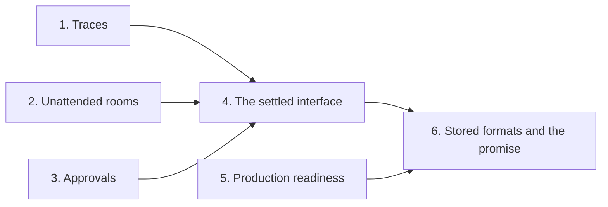

# Next: the road to 1.0.0

**1.0.0 is the release that makes a promise of compatibility.** From
1.0.0, an export, a journal body, and a stored format change only with a
new major version, and a stored format that changes ships a reader for
the format before it. Before 1.0.0, the rule in
[Compatibility](#compatibility-and-release-guards) holds.

**1.0.0 also makes a room safe to leave alone.** The workbench is the
test case: a person starts an overnight run on a bench, approves the risky
steps, goes home, and finds the run, its record, and its traces in the
morning. A room that runs unattended keeps its clock, says when it fails,
and stays within a bounded prompt.

## Status

**0.7.0 is released. The work for 0.8.0 starts with phase 1.**
[The backlog](backlog.md) holds work outside 1.0.0.
[The accepted risks](risks.md) hold the gaps that 1.0.0 leaves open. The
review of 2026-10-06 grounds this plan: the core has the right concepts
for a workbench, and the gaps are in liveness, approvals, traces, and
operations.

## The scope

**Three releases reach 1.0.0.** Each release ends with `pnpm check`, the
chaos sweeps, and the changelog.

| Release | Phases                                            | A person can                                            |
| ------- | ------------------------------------------------- | ------------------------------------------------------- |
| 0.8.0   | 1. Traces, 2. Unattended rooms, 3. Approvals      | Leave a bench overnight and see every activation        |
| 0.9.0   | 4. The settled interface, 5. Production readiness | Run the workbench on a workstation with real devices    |
| 1.0.0   | 6. Stored formats and the promise                 | Upgrade a deployment with no loss and no reader to edit |

| Item | Delivery                                                     | Phase |
| ---- | ------------------------------------------------------------ | ----- |
| TR1  | The `input` step of the trace                                | 1     |
| TR2  | The OpenInference exporter to Phoenix                        | 1     |
| TR3  | Traces in the workbench, and the traces page                 | 1     |
| TR4  | One span for each model request of a Claude seat             | 1     |
| UR1  | Retries that survive an outage                               | 2     |
| UR2  | A bounded prompt for an ambient room                         | 2     |
| UR3  | Failures that a host sees                                    | 2     |
| UR4  | Processes that outlive a clean stop, and one stop for a room | 2     |
| UR5  | Hosts that sleep                                             | 2     |
| AP1  | A question to the opener awaits the opener                   | 3     |
| AP2  | An act that a tool can check                                 | 3     |
| AP3  | The gated device in the workbench                            | 3     |
| SI1  | The pending decisions of the interface                       | 4     |
| SI2  | One stored source for the roster                             | 4     |
| SI3  | A review of the exports                                      | 4     |
| PR1  | The workbench on a workstation                               | 5     |
| PR2  | The delegation test on macOS                                 | 5     |
| PR3  | SQLite settings and a second reader                          | 5     |
| PR4  | The chaos sweeps in CI                                       | 5     |
| PR5  | Bounds on the disk of the workspace                          | 5     |
| PR6  | A restart that finds every process and lease                 | 5     |
| PR7  | Device locks and process wakes in the workbench              | 5     |
| SF1  | A version on each stored format                              | 6     |
| SF2  | A check of a journal                                         | 6     |
| SF3  | The soak run and the release                                 | 6     |

## The order of work

**Traces come first, so every later phase is visible.** Phases 1, 2, and
3 do not depend on each other. Phase 4 settles the interface after the
changes of phases 2 and 3. Phase 5 can start at any time. Phase 6 closes
the release.



### Phase 1. Traces in Phoenix

- [ ] **1.** The `input` step and its policy field. (TR1)
- [ ] **2.** The exporter package. Needs 1. (TR2)
- [ ] **3.** The workbench option and the traces page. Needs 2. (TR3)
- [ ] **4.** Usage for each assistant message in the Claude trace. (TR4)

**Evidence:**

- A scripted activation records one `input` step for each pass when the
  policy is `full`, and none when it is `omit`.
- A scripted room exports to a local Phoenix container. Phoenix shows one
  session for the room, one trace for each activation, and the agent,
  chain, LLM, and tool spans in the tree of [TR2](#the-items).
- A `compose` call nests its tool calls under its own tool span.
- A breakout room is its own session, with the parent room as an
  attribute.
- A Phoenix that does not answer costs the room nothing: the activation
  ends as before, and the logger reports the failure once.
- One Pi activation on the ChatGPT login shows input and output on each
  LLM span.

### Phase 2. Unattended rooms

- [ ] **1.** Retries that survive an outage. (UR1)
- [ ] **2.** A bounded prompt. (UR2)
- [ ] **3.** Failures that a host sees. (UR3)
- [ ] **4.** Processes that outlive a clean stop, and one stop for a room.
      (UR4)
- [ ] **5.** Hosts that sleep. Needs 1. (UR5)

**Evidence:**

- On the scripted fake clock, an outage of 10 minutes ends no chain of
  scheduled says. The chain continues when the provider answers.
- A run of 30 self-scheduled cycles keeps the rendered prompt within the
  window. A closed exchange with no spoken message renders as one line,
  and `recall` reads it.
- A throw in `decide` and a throw in an opener each emit one `error`
  notification and leave the room with an alarm. No rejection is
  unhandled.
- Each failure path in the table of [UR3](#the-items) emits its event
  once.
- A clean stop of the workbench leaves a running controller running. The
  next start adopts it. One command cancels every running process of a
  room.
- A wall clock that jumps forward one hour spends no attempt of a running
  lease.

### Phase 3. Approvals that hold

- [ ] **1.** The `awaiting` rule for the opener. (AP1)
- [ ] **2.** An act that a tool can check. (AP2)
- [ ] **3.** The gated device in the workbench. Needs 1 and 2. (AP3)

**Evidence:**

- A directed message to the opener that ends an exchange lists the opener
  in `awaitingFor`.
- A tool that checks an act ref gets the person, the seq, the action, and
  the values. A ref to an act that did not land, to another room, or to a
  revision of another widget is a refusal.
- The workbench operates a simulated device above its limit only with a
  matching act of the person in `for`. A seat that calls the tool with no
  act, or with the act of another person, gets a refusal, and the device
  does not move.
- The agent account of the workbench profile has no access to the device
  of the gated tool.

### Phase 4. The settled interface

- [ ] **1.** Decide each pending question of the interface. (SI1)
- [ ] **2.** One stored source for the roster. Needs 1. (SI2)
- [ ] **3.** A review of the exports. Needs 1 and 2. (SI3)

**Evidence:** each decision of [SI1](#the-items) is in the changelog, with
its golden journals and the export snapshot. The export snapshot holds no
export that no package, example, or test uses.

### Phase 5. Production readiness

- [ ] **1.** The workbench on a workstation, with one loop test. (PR1)
- [ ] **2.** The delegation test on macOS. (PR2)
- [ ] **3.** SQLite settings and a second reader. (PR3)
- [ ] **4.** The chaos sweeps in CI. (PR4)
- [ ] **5.** Bounds on the disk of the workspace. (PR5)
- [ ] **6.** A restart that finds every process and lease. (PR6)
- [ ] **7.** Device locks and process wakes in the workbench. Needs 1.
      (PR7)

**Evidence:**

- One scripted test starts a controller and a sensor on the test sshd,
  shows a widget, restarts the host, adopts both, and cancels both.
- The delegation test passes on the Mac four times in a row.
- A second process reads a room from the SQLite file while the host
  writes. Neither fails on a lock.
- A scheduled workflow runs `pnpm chaos` on both storages.
- A process with more output than the cap ends its `out` file at the cap.
  `read` with an offset reads past 10 MiB on the directory backend.
- After a restart, a process past its timeout ends without a read.
- One lost renewal does not end an activation.

### Phase 6. Stored formats and the promise

- [ ] **1.** A version on each stored format. (SF1)
- [ ] **2.** A check of a journal. Needs 1. (SF2)
- [ ] **3.** The soak run, the docs, and the release. Needs 1 and 2. (SF3)

**Evidence:** a journal, a canvas store, and a process table of 1.0.0 each
name their format. A reader refuses an unknown format with a message that
names the format. A journal with one malformed entry reports the position
of the entry. The soak run passes. `CLAUDE.md` states the promise.

## The items

### Traces

**TR1. The `input` step of the trace.** A pass records which part of the
record it read, and not the text that the model received. Without that
text, each LLM span shows output with no input.

- `{ type: 'input'; text: string }`, recorded when an executor calls
  `pass.record()`. The driver wraps `record()`, so no executor changes.
- The first pass also records the system part once.
- A trace policy field `input: 'omit' | 'full'`, with `omit` by default.
  The byte limit of the trace applies.
- The step holds no vendor history and no compaction. The vendor session
  keeps those, joined by the `session` id on the ended lease.

**TR2. The OpenInference exporter to Phoenix.** A new package
`@ambionframework/openinference` exports `openInferenceLogger({ url })`, a
`TraceLogger`. It buffers the steps of one activation, builds the spans at
`end`, and sends OTLP over HTTP as JSON. It has no OpenTelemetry
dependency.

```text
session  the room
└─ trace  one activation
   └─ AGENT  the seat         tokens, cost, end reason, failure
      ├─ CHAIN  pass 1        input: the rendered record
      │  ├─ LLM   request 1   model, tokens, cost, thinking, text
      │  ├─ TOOL  say         input, output, the committed seq
      │  └─ TOOL  compose     nested tool calls by `parent`
      └─ CHAIN  pass 2        a steer as a span event
```

The `usage` step closes an LLM span. A `room` step adds the result and the
seq to the tool span of its call. `steer`, `approval`, and `notice` are
span events. The design in the project files holds the full table of
steps and spans ([Decisions taken](#decisions-taken)).

**TR3. Traces in the workbench, and the traces page.** The workbench takes
a Phoenix URL and runs its seats with the full trace policy: `thinking`,
`toolOutput`, and `input` at `full`. A page `docs/traces.md` states the
spans, the limits, and the run of Phoenix in one container on SQLite.

**TR4. One span for each model request of a Claude seat.** The Claude
executor reports usage once for each SDK result, so a Claude pass shows as
one LLM span. The Claude trace splits usage for each assistant message.
Pi and Codex already report usage for each request.

### Unattended rooms

**UR1. Retries that survive an outage.** Today an activation makes 3
attempts at 30 s and 60 s, and then the room records `abandoned`. A chain
of scheduled says then ends for good. The evaluation of 2026-10-05
reproduced it.

- About 8 attempts, with exponential backoff that stops growing at 1 hour.
- A `retry-after` header on a 429 sets the next attempt.
- `docs/durability.md` states the window of time that the defaults cover.

**UR2. A bounded prompt for an ambient room.** `limits.context.messages`
is `Infinity` by default, and an exchange with no person owes no summary.
The prompt then grows with each check.

- A finite default for `limits.context.messages`. `capOf` already keeps
  the open exchange whole.
- The first step of [D2](backlog.md#designs-with-a-shape): a closed
  exchange with no spoken message renders as one line.

**UR3. Failures that a host sees.** A failure at the level of the room
emits nothing today.

- `decide` runs inside the `try` of `onePass`, and the catch emits the
  `error` notification before it arms the alarm again.
- The runner builds the activation state inside its `try`. An opener or
  `trace.open` that throws ends the activation as permanent, through the
  release, `abandoned`, and the event.
- `docs/deployment.md` lists the events that a host must subscribe to:
  `error`, `port_error`, `exchange_closed` with `exhausted`, and
  `abandoned`. A test runs each failure path and finds its event once.

**UR4. Processes that outlive a clean stop, and one stop for a room.**
`dispose()` cancels every running process, so a clean quit of the
workbench stops the controllers and the loggers of the night. A crash
leaves them running.

- A `dispose` option that leaves running processes for the next run to
  adopt. The workbench uses it at a clean stop.
- `workspace.processes.cancel({ room })` cancels every running process
  that a room started, each with its grace.
- The workbench binds one key to that cancel. The interlock of the device
  stays the last guard.

**UR5. Hosts that sleep.** Timers run on the monotonic clock, and the room
decides on the wall clock. After a laptop sleeps, each running lease
expires at its next renewal and spends an attempt.

- A lease that expires across a jump of the wall clock spends no attempt.
- The workbench keeps the event loop alive while a room runs.
- On macOS, the workbench holds a sleep assertion while a process runs.
- `docs/deployment.md` states the rule for a host that sleeps.

### Approvals

**AP1. A question to the opener awaits the opener.** A message to the
author of the opening message closes the exchange `complete` in
`packages/ambion/src/room/exchange.ts`, so a question to the opener reads
as done. A directed message that ends the exchange awaits its recipient,
the opener included. The golden journals change.

**AP2. An act that a tool can check.** A tool that must refuse an effect
without a decision of a person needs the act from the journal. Today the
canvas gives the person and the seq of an answer, and the action and the
values travel only in the text of the message.

- The act message carries its action and its values in a form that the
  canvas reads back from the journal after a restart.
- `canvas.verify(ref)` returns the person, the seq, the action, and the
  values of a landed act, or refuses.
- The kernel does not change.

**AP3. The gated device in the workbench.** `operate` above the limit
takes an act ref and calls `canvas.verify`. It refuses an act of another
person, another widget, or another operation. `approve_operation` goes.

- The workbench shows the approval as a widget with `once` actions and a
  `for`.
- The device belongs to the account of the host. The agent accounts of
  the workstation profile have no device group.
- `examples/workbench/docs/actuators.md` gains the rule for a hazardous
  device: the device sits behind a host tool that checks an act, and the
  agent account cannot reach it.

### The settled interface

**SI1. The pending decisions of the interface.** Each decision changes an
export or a journal body, so each one lands before 1.0.0. Each line names
the default of this plan. The owner can change it when the phase starts.

| Question                                   | Default                                                                                    |
| ------------------------------------------ | ------------------------------------------------------------------------------------------ |
| The `assistant` room option                | It goes. `@ambionframework/assistant` returns the `agents` entry, the seat, and the writer |
| Seat selection and seat options in one map | They split: `seats` names the seated agents, `attention` sets the options                  |
| The order of an execution list             | The room refuses a list where a kind repeats or follows a catch-all                        |
| A close as a message (D2, second step)     | It stays out of 1.0.0. After 1.0.0 it needs a new journal format and a reader              |

**SI2. One stored source for the roster.** A composition seeds the roster
from its `agents`, and a recomposition drops a seating that a seat made.
The start writes one seating for each seat, and the composition drops
`agents`. The stored format changes once, before the promise.

**SI3. A review of the exports.** Each export has a user in a package, an
example, or a test, or it goes. The export snapshot after this step is the
interface of 1.0.0.

### Production readiness

**PR1. The workbench on a workstation.** The workbench runs on the
directory backend, which has no `fetch`, so no sensor or actuator runs end
to end in the tree. A profile runs the workbench on the workstation
backend against the test sshd. One scripted test runs a controller, a
sensor, a widget, a restart, an adoption, and a cancel.

**PR2. The delegation test on macOS.**
`examples/workbench/test/delegation.test.ts` fails on the Mac with "Resume
this room first." and passes on Linux. Read the `onError` log of a run on
the Mac first. The working guess: a breakout start fails and leaves the row
`running` with no handle.

**PR3. SQLite settings and a second reader.** The library sets no pragma,
and `busy_timeout` is 0.

- `docs/deployment.md` states `synchronous=FULL` and the risk of WAL with
  `synchronous=NORMAL`.
- The SQLite storages set a `busy_timeout`.
- The docs state whether a second process may read a room, and a test
  proves it. A remote viewer builds on this ([backlog V1](backlog.md)).

**PR4. The chaos sweeps in CI.** No workflow runs `pnpm chaos`. A
scheduled workflow runs it on both storages, beside the weekly live tier.

**PR5. Bounds on the disk of the workspace.**

- The `out` file of a process has a cap.
- `fetch` keeps each body once.
- Pi deletes its old sessions.
- The directory backend reads past 10 MiB with an offset and a limit.
- `docs/deployment.md` states the quotas of a workstation account.

**PR6. A restart that finds every process and lease.**

- A host start calls `processes.list({ agent })` for each agent, so a
  process past its timeout ends without a read.
- `renew` retries as claim and release do.
- A superseded run cuts the ports of its seats at the eviction.

**PR7. Device locks and process wakes in the workbench.**

- The actuator template takes its lock path from a shared directory that
  the host creates for the device group.
- The workbench posts to the owner seat when a process ends, under the key
  `process-ended:<handle>`, as [Processes](../docs/processes.md) shows. A
  watch process that exits at a threshold then wakes the agent with no
  scheduled say.

### Stored formats

**SF1. A version on each stored format.** The run entry of a journal, the
canvas store, and the process `spec` each name their format. A reader
refuses an unknown format with a message that names it. From 1.0.0, a
change of a format ships a reader for the format before it.

**SF2. A check of a journal.** One malformed entry makes a room
unresumable, and the error names no position. A command reads a journal,
names the position and the seq of each entry that fails, and changes
nothing.

**SF3. The soak run and the release.**

- A scripted soak run: a room on the fake clock for 7 days, with a
  self-scheduled check each 15 minutes, outages, and restarts. The prompt
  stays in its window, the chain does not end, and no entry is lost.
- One overnight run of the workbench on the Mac, on the ChatGPT login, on
  request of the owner.
- `CLAUDE.md` replaces the rule of no compatibility with the promise.
- The changelog, the README, and the docs describe 1.0.0.

## Decisions taken

| Decision                                              | Reason                                                                              |
| ----------------------------------------------------- | ----------------------------------------------------------------------------------- |
| Phoenix is the trace store                            | One container on SQLite, a view of each activation, and OpenInference as its format |
| The exporter speaks OpenInference over OTLP over HTTP | Langfuse reads the same format, so the choice binds no backend                      |
| The exporter has no OpenTelemetry dependency          | About 350 lines of JSON over HTTP; the SDK adds weight and no feature               |
| The journal stays the source of truth                 | A span tree cannot hold who woke whom or the order of the record                    |
| Ambion keeps no trace store of its own                | Phoenix keeps the traces; the workbench keeps its last activations in memory        |
| The exporter sends an activation at its end           | An activation that crashes sends nothing, and the journal keeps its cause           |
| The full trace policy copies secrets to Phoenix       | Phoenix runs on the host; `docs/traces.md` states it                                |
| An approval of a hazardous action is a checked act    | A tool that trusts the agent for the decision gates nothing                         |
| An emergency stop is a host command                   | An act activates a model, which is too slow for a stop                              |
| Kernel spend quotas stay out of 1.0.0                 | The owner accepted it; `ended` entries carry usage ([AR3](risks.md))                |

The design of the exporter is `observability/phoenix-design.md` in the
project files. The review of the workbench is the document "Workbench
readiness of the 0.7.0 core".

## Out of scope

- A remote viewer of the canvas, and a canvas on Cloudflare.
- Kernel spend quotas and a bound on a chain of exchanges
  ([D1](backlog.md#designs-with-a-shape)).
- Snapshots of the projection for replay ([AR20](risks.md)).
- Nested breakout rooms, layout tools, and agent-written widgets.
- Native executor subagents and vendor UI surfaces.
- Metrics, evals, and live streaming of an open activation to Phoenix.
- The speaking text of the room core (SP1).

## Compatibility and release guards

The product rule in `CLAUDE.md` applies until 1.0.0: no compatibility
promise. Name each change in the changelog, and update the export snapshot
and the golden journals with it. SF3 replaces the rule with the promise.
