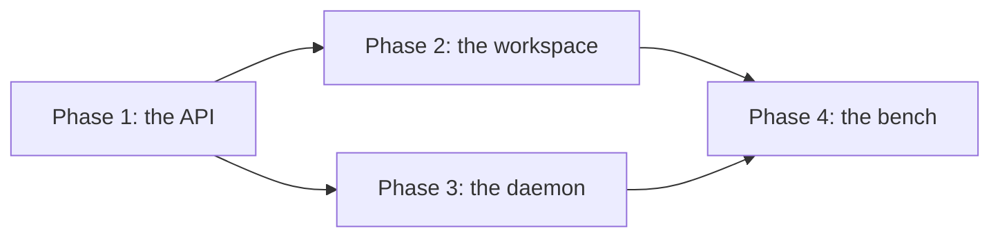

# Sensing: the order of the sensor work

> **This work targets 0.5.0.** [next.md](next.md) holds the scope of
> 0.5.0, and the owner sets it. [Sensors](sensors.md) holds the design,
> and this file holds the order of the work, the evidence of each step,
> the reason for the order, and the cut for 0.5.0. `room.post`, which
> SN26 and phase 4 use, exists today.

**The work lands in small steps, each one behind `pnpm check`.** The
item ids start with `SN`, so that they differ from the ids of
[next.md](next.md). A step names the steps it needs. A step with no
"Needs" line starts when the phase starts.

**Each step changes one package, plus the docs and root configs that
name its change.** It holds the coverage of that package, and adds the
tests that the step names. The CI step and the docs step change no
package. No step of this plan changes the kernel.

**Two kernel changes of the backlog must land first.** They are steps
outside this plan.

| Backlog item                                                                | What the plan needs from it                                                                            | The step that waits |
| --------------------------------------------------------------------------- | ------------------------------------------------------------------------------------------------------ | ------------------- |
| [D1](backlog.md#for-rooms-that-run-unattended), a hard bound on an exchange | `limits.exchange` of the runtime: the room closes an exchange past its bound                           | SN28                |
| [D13](backlog.md#for-refs-and-objects), more forms of the `ambion` scheme   | The sensor forms of a ref: `sensorUri` and `parseSensorUri` beside `roomUri`, and `isRef` accepts them | SN3 and SN26        |

**D2 stays open, and its cost is a limit of the sensor work.** A summary
goes to a person, so an exchange with no person never folds. Each post
of a detection opens such an exchange. A sensor that posts often adds
them to the context of each later activation, until D2 lands.

**D1 bounds the spend of each exchange, and the next post opens a new
exchange.** So `maxPerMinute` of `followAndPost` bounds a loop of posts,
and D22 bounds a chain of scheduled says.

**A step that changes an export names the change in the changelog, in
the same commit.** It also updates the export snapshot, as `CLAUDE.md`
states. These steps change exports:

- SN1: the `./sensors` entry and the schema export.
- SN3: `daemonClient`.
- SN4: `sensorConformance` and the conformance fixture.
- SN5: `sensors()` and the `sensors` slot of `WorkspaceBackends`.
- SN8: the `images` option of `tools()`.
- SN9: the new package, `defineSensor`, and the `./testing` entry.
- SN10: `serveSensors`.
- SN11: `scriptedAcquire`, and the types of the acquire code and the
  reducer.
- SN13: the `annotate` option, and its types.
- SN14: `live` in the options of `serveSensors`, and `live` and
  `viewers()` in `AcquireContext`.
- SN24: `images` in the request of `runAgent`.
- SN26: `followAndPost`.
- Each step that adds a helper, a reducer, or a test helper to
  `@ambionframework/sensors`: SN16, SN17, SN19 to SN23, and SN25.

**Four packages carry the work.**

| Package                      | Holds                                                                                                                       |
| ---------------------------- | --------------------------------------------------------------------------------------------------------------------------- |
| `@ambionframework/workspace` | The `./sensors` entry: the API types, the client, the backend, the tools; `sensorConformance` in `./conformance`            |
| `@ambionframework/sensors`   | New. The daemon, the acquire helpers, the reducers, `windowCaption`, and `followAndPost`; it calls `ffmpeg` and instruments |
| `@ambionframework/pi`        | Images in `runAgent`                                                                                                        |
| `examples/workbench`         | The bench, the appendix bench, and a host that posts a detection with `followAndPost`                                       |

## The order of work

### Phase 1. The API

**The contract of a sensor lands first, with a test for any
implementation.** A scripted daemon in the test support serves fixture
parts, media, and live events, so the client and the suite need no real
source.

- [ ] **1.** The API types and the schema. (SN1)
- [ ] **2.** The scripted daemon. Needs 1. (SN2)
- [ ] **3.** The client. Needs 2 and D13. (SN3)
- [ ] **4.** `sensorConformance`. Needs 3. (SN4)

**Evidence:** the scripted daemon passes `sensorConformance`, and a
daemon that breaks one rule fails it. The export snapshot of
`@ambionframework/workspace` names the `./sensors` entry, the
`./sensor-api.schema.json` export, and `sensorConformance` and the
conformance fixture in `./conformance`. The build of `./sensors` imports
no `vitest`, no `just-bash`, and no `node:sqlite`.

### Phase 2. The workspace

**An agent reads sensors through the workspace.** Every step runs a real
room over a memory backend, with the client pointed at the scripted
daemon on a loopback port.

- [ ] **1.** The backend slot and the reminder. (SN5)
- [ ] **2.** `observe` with no span, and the form of each part. Needs 1.
      (SN6)
- [ ] **3.** `observe` with a span, and the exports. Needs 2. (SN7)
- [ ] **4.** `tools({ images: false })`. Needs 2. (SN8)

**Evidence:** each step keeps `pnpm check` green, and holds the coverage
of its package, measured before and after as `CLAUDE.md` states. Steps 1
and 4 update the export snapshot.

### Phase 3. The daemon

**`@ambionframework/sensors` serves real sources.** From SN10 on, each
step in that package runs `serveSensors` on a loopback port, on the
system clock. From SN12 on, each step passes the full suite of
`sensorConformance`, over HTTP, on real timers. A test of a loop calls
the loop directly, on `fakeClock` from `@ambionframework/ambion/testing`.

**This phase runs beside phase 2.** The cut for 0.5.0 splits some of its
steps, and each split step names its later part
([The cut for 0.5.0](#the-cut-for-050)).

- [ ] **1.** The package scaffold: `@ambionframework/sensors`,
      `defineSensor`, and the `./testing` entry. (SN9)
- [ ] **2.** `serveSensors`, the store, the tokens, and `cors`. Needs 1.
      (SN10)
- [ ] **3.** The acquire loop and the reduce loop. Needs 2. (SN11)
- [ ] **4.** Spans, and sensors with no acquisition. Needs 3. (SN12)
- [ ] **5.** Annotations. Needs 3. (SN13)
- [ ] **6.** The live stream. Needs 3. (SN14)
- [ ] **7.** A restart of the daemon. Needs 4. (SN15)
- [ ] **8.** The readings: `all`, `decimate`, `crossing`, `/series`, and
      live fragments. Needs 4. Its later part needs 6. (SN16)
- [ ] **9.** The instruments: `polled`, `scpiStream`, `scpiSocket`,
      `stateChange`, and a capture on each trigger. Needs 8. Its later
      part needs 6. (SN17)
- [ ] **10.** A pinned `ffmpeg` in CI. (SN18)
- [ ] **11.** `/clip`, `/frame`, and frame decoding. Needs 4 and 10.
      (SN19)
- [ ] **12.** `ffmpegVideo`, the live pipe, and the child process.
      Needs 11. Its later part needs 6. (SN20)
- [ ] **13.** `keyframes`, `changes`, and `level`. Needs 4 and 11. Its
      later part needs the later part of 11. (SN21)
- [ ] **14.** Audio, `/audio`, and live chunks. Needs 4, 5, 6, 10,
      and 12. (SN22)
- [ ] **15.** Text, `/text`, and live lines. Needs 4. Its later part
      needs 6. (SN23)
- [ ] **16.** Images in `runAgent`. (SN24)
- [ ] **17.** `windowCaption`. Needs 5 and 16. (SN25)
- [ ] **18.** `followAndPost`. Needs 4 and D13. (SN26)

**Evidence:** `serveSensors` passes the full `sensorConformance` after
each step in `@ambionframework/sensors` from SN12 on, and the named
cases of SN10 before it. The suite runs the paths that each sensor
lists in `paths`, and checks `404 unknown` for the others.

Each reducer test runs its reducer twice over one fixture, and gets the
same result. A test that needs `ffmpeg` fails when it is absent. No test
skips. SN9 makes the new package pass the package-hygiene checks, and
join the lockstep version.

### Phase 4. The bench

**The workbench shows the bench, and the docs close the design.**

- [ ] **1.** The bench in the workbench. Needs the 0.5.0 steps of phases
      2 and 3. Its later part needs SN22 and SN25. (SN27)
- [ ] **2.** The host posts a detection. Needs 1, SN26, and D1. (SN28)
- [ ] **3.** The appendix bench. Needs 1. Its later part needs 2, SN14,
      the later part of SN17, SN22, and SN25. (SN29)
- [ ] **4.** One live case. Needs 1. (SN30)
- [ ] **5.** The docs. Needs 1, 2, and 3. (SN31)

**Evidence:** in 0.5.0, questions 1, 2, 3, 5, 6, 8, and 9 of
[The bench](sensors.md#the-bench) run on the scripted tier. So do
scenarios 4, 6, 8, 9, 10, and 12 of the
[appendix](sensors.md#appendix-scenarios-on-an-electronics-bench).
Scenarios 8 and 10 run their agent half alone, because their person half
reads `/live`.

The other questions and scenarios run with the later steps that serve
them. One live case runs on Pi, on `main`, outside the pull request.

## The cut for 0.5.0

**0.5.0 ships the architecture end to end, with the least risk to the
schedule.** It holds the API, the refs, the client, the conformance
suite, and the workspace. It holds the daemon with its store and its
loops, and the sources of still frames, series, and text. It holds
`followAndPost`, the host post, the bench, one live case, and the docs.

**Other parts follow in 0.5.x.** They are clips, audio, the live stream,
images in `runAgent`, `windowCaption`, and triggered captures.

**Annotations ship in 0.5.0 for an `annotate` that the host writes.**
Their consumers in the package, `windowCaption` and `transcribe`, ship
in 0.5.x.

**`paths` makes a part of the API legal.** Each `Acquisition` lists the
media paths that the daemon serves for the sensor. A daemon answers
`404 unknown` for a path that it does not list, and `sensorConformance`
checks that 404. A video sensor of 0.5.0 lists `['frame']`. At start,
`serveSensors` refuses a path that it does not serve in its release.

**A step that the cut splits keeps its id.** Its item states "In 0.5.0"
and "Later", and names the later part. No step of 0.5.0 needs a later
step or a later part. D1 and the sensor forms of D13 land before 0.5.0,
because SN3, SN26, and SN28 wait for them.

| Step                                                                                                      | Ships in   | The later part, in 0.5.x                                                                                                                                  |
| --------------------------------------------------------------------------------------------------------- | ---------- | --------------------------------------------------------------------------------------------------------------------------------------------------------- |
| SN1. The API types and the schema                                                                         | 0.5.0      | None                                                                                                                                                      |
| SN2. The scripted daemon                                                                                  | 0.5.0      | None                                                                                                                                                      |
| SN3. The client                                                                                           | 0.5.0      | None                                                                                                                                                      |
| SN4. `sensorConformance`                                                                                  | 0.5.0      | None                                                                                                                                                      |
| SN5. The backend slot and the reminder                                                                    | 0.5.0      | None                                                                                                                                                      |
| SN6. `observe` with no span, and the form of each part                                                    | 0.5.0      | None                                                                                                                                                      |
| SN7. `observe` with a span, and the exports                                                               | 0.5.0      | None                                                                                                                                                      |
| SN8. `tools({ images: false })`                                                                           | 0.5.0      | None                                                                                                                                                      |
| SN9. The package scaffold                                                                                 | 0.5.0      | None                                                                                                                                                      |
| SN10. `serveSensors`, the store, the tokens, and `cors`                                                   | 0.5.0      | None                                                                                                                                                      |
| SN11. The acquire loop and the reduce loop                                                                | 0.5.0 part | The live parts of `scriptedAcquire`                                                                                                                       |
| SN12. Spans, and sensors with no acquisition                                                              | 0.5.0      | None                                                                                                                                                      |
| SN13. Annotations                                                                                         | 0.5.0      | None                                                                                                                                                      |
| SN14. The live stream                                                                                     | 0.5.x      | The whole step                                                                                                                                            |
| SN15. A restart of the daemon                                                                             | 0.5.0      | None                                                                                                                                                      |
| SN16. The readings: `all`, `decimate`, `crossing`, `/series`, and live fragments                          | 0.5.0 part | Live fragments                                                                                                                                            |
| SN17. The instruments: `polled`, `scpiStream`, `scpiSocket`, `stateChange`, and a capture on each trigger | 0.5.0 part | `scpiTriggered`, and the live fragments of `scpiStream` and `polled`                                                                                      |
| SN18. A pinned `ffmpeg` in CI                                                                             | 0.5.0      | None                                                                                                                                                      |
| SN19. `/clip`, `/frame`, and frame decoding                                                               | 0.5.0 part | `/clip`                                                                                                                                                   |
| SN20. `ffmpegVideo`, the live pipe, and the child process                                                 | 0.5.0 part | The live pipe                                                                                                                                             |
| SN21. `keyframes`, `changes`, and `level`                                                                 | 0.5.0 part | The clip of one second in `level`                                                                                                                         |
| SN22. Audio, `/audio`, and live chunks                                                                    | 0.5.x      | The whole step                                                                                                                                            |
| SN23. Text, `/text`, and live lines                                                                       | 0.5.0 part | Live lines                                                                                                                                                |
| SN24. Images in `runAgent`                                                                                | 0.5.x      | The whole step                                                                                                                                            |
| SN25. `windowCaption`                                                                                     | 0.5.x      | The whole step                                                                                                                                            |
| SN26. `followAndPost`                                                                                     | 0.5.0      | None                                                                                                                                                      |
| SN27. The bench in the workbench                                                                          | 0.5.0 part | `mic`, `windowCaption`, and questions 4 and 7                                                                                                             |
| SN28. The host posts a detection                                                                          | 0.5.0      | None                                                                                                                                                      |
| SN29. The appendix bench                                                                                  | 0.5.0 part | `mic`, `scope` on each trigger, `windowCaption`, the views that read `/live`, a host that posts with `followAndPost`, and scenarios 1, 2, 3, 5, 7, and 11 |
| SN30. One live case                                                                                       | 0.5.0      | None                                                                                                                                                      |
| SN31. The docs                                                                                            | 0.5.0 part | Each later part moves its part of the design into `docs/sensors.md`                                                                                       |

## The items

**SN1. The API types and the schema.** The `./sensors` entry of
`@ambionframework/workspace` defines `Part` and its six kinds,
`Observation`, `Detection`, `SensorStatus` with `intervalMs`,
`DaemonIndex`, and `Acquisition` with its four kinds. Each kind carries
`paths`, the `MediaPath` list of the paths that the daemon serves.

Each JSON body carries `api` at its top level, an error body included.
The entry defines the live events, `text` included, and the error codes.
The TypeBox schemas split across several files, so each file stays under
the budget of 600 lines of `scripts/file-budget.test.mjs`.

The step commits `packages/workspace/sensor-api.schema.json`, which the
TypeBox schemas give. A test generates the file again, and fails when
the committed file is stale. The step adds the file to `files`, and to
`exports` as `./sensor-api.schema.json`.

- **`oneOf` states "`data` or `file`, one of the two".** `Type.Union` of
  TypeBox emits `anyOf`, so the step names `oneOf` itself.
- **The schema limits an inline text to 65,536 characters.** The byte
  limit of 64 KB is a check of the suite (SN4).

The step updates the package test of `packages/workspace` for the new
entry:

- The count of entries, the `STEMS` map, and the manifest loop, which
  skips `./sensor-api.schema.json` as it skips `./package.json`.
- The entry list of tsdown.
- The banned-import table, which bans `vitest`, `just-bash`, and
  `node:sqlite` in `./sensors`.

The changelog names the `./sensors` entry and the schema export.

- **Evidence:** each sample body of the test passes the published
  schema. A part with both `data` and `file`, or with neither, fails it.
  A time with an offset, or with other than three digits of
  milliseconds, fails it. A text part past 65,536 characters inline fails
  it.

  A body with no `api`, and an acquisition with no `paths`, fail it. The
  test that generates the schema again finds the committed file current.
  The build of `./sensors`, and each chunk that it imports, holds no
  import of `vitest`, `just-bash`, or `node:sqlite`.

**SN2. The scripted daemon.** `scriptedDaemon(fixture)` in the test
support of `packages/workspace` serves a fixture over `node:http` on
port 0. It runs on the system clock with an offset that the fixture
sets, so its `now` differs from the host clock. It serves an index of
its sensors, stored observations of each part kind, media bytes, and
live events of each kind.

It serves the live stream with `{ bufferMs: 200, pingMs: 500 }`, the
values that SN4 gives the conformance fixture. One video sensor of the
fixture lists `['frame']` alone, so the suite checks the 404 of the
other paths. An option makes the index give `api: 2`.

The scripted daemon starts again on the same port with the same logs.
It has fault switches for SN4:

- A `seq` out of order.
- `waitMs` ignored.
- A `read` token accepted on `PUT /note`.
- A body with no `api`.
- A media path served that `paths` does not list.

The step changes no export.

- **Evidence:** the scripted daemon answers each path of the API, and
  each of its bodies passes the published schema. After a start on the
  same port, it serves the same logs. Each fault switch breaks the one
  rule that it names.

**SN3. The client.** This step starts after the sensor forms of D13
land. `daemonClient(entry)` takes a `DaemonEntry`, and gives `name`,
`index`, `skew`, and `sensor(name)`. `sensor(name)` gives `daemon`,
`name`, `status`, `observe`, `observations`, `detections`, `follow`,
`clip`, `audio`, `text`, `frame`, `series`, `live`, `file`, and `note`.
The client runs over `fetch` of the entry, or over the global `fetch`.

The client takes the skew as `now` minus the middle of the request, and
skips a request that took more than 100 ms. `observations` and
`detections` page by `after`, with `next` and `limit`. `follow` holds a
log open with `waitMs`, and yields in `seq` order. `live` parses the
event stream. An error body becomes an error with its code.

The client refuses an index whose `api` differs from its own. The error
names both numbers, and each sensor of the refused index.

The kernel owns the sensor forms of a ref
([Refs](sensors.md#refs)). The client, `observe`, and `followAndPost`
import `sensorUri` and `parseSensorUri` from `@ambionframework/ambion`.
The changelog names `daemonClient`.

- **Evidence:** against the scripted daemon, `index` lists each sensor
  with the status that `GET /` of the sensor gives, and each method
  gives the fixture. `follow` from a cursor yields each later item once,
  across a restart of the daemon, for both logs.

  `live` yields frames, audio, series, and text, and a `gap`. `text`
  gives the stamped lines. `clip` and `frame` give `X-From` and `X-At`.
  After a request that takes 300 ms, `skew()` keeps its earlier value. A
  wrong token gives `unauthorized`. An index at `api: 2` gives an error
  that names the daemon at 2, the client at 1, and each sensor of the
  index.

**SN4. `sensorConformance`.** `@ambionframework/workspace/conformance`
exports `sensorConformance`, beside `workspaceConformance`. Its form is
`sensorConformance(url, tokens, options?)`, with
`tokens: { read: string; note: string }` and
`options?: { bufferMs?: number; pingMs?: number }`.

The suite gives `readonly ConformanceCase[]`, the type of
`@ambionframework/ambion/conformance`. It runs each path of the API
against the root of a daemon that serves the conformance fixture.

The step also exports the conformance fixture from `./conformance`, as
data: the sensors, their segments, their `paths`, and the items that the
suite expects. The scripted daemon of SN2 serves it. A daemon in another
language reads the same data.

The suite runs on real timers, over HTTP. The daemon under test runs on
the system clock. `options` names the `bufferMs` and the `pingMs` of the
daemon, so the suite knows when a `gap` and a `: ping` come. Each wait
of the suite uses a short `waitMs`.

The suite reads the index, checks that each entry equals the status of
its sensor, and runs each path of each sensor in the index.

The suite checks each body against the published schema, each inline
text against the limit of 64 KB, and `api` on each JSON body. It checks
the times, the file ids, the order of `seq`, the paging, the waits, the
scopes, the errors, and the note.

The suite runs each media path that `paths` lists, and each live event
when `paths` lists `live`. It checks a `gap` for a viewer that reads
nothing. For each path that `paths` does not list, it checks
`404 unknown`.

The banned-import table keeps the `./conformance` build free of
`vitest`, as it does today. The changelog names `sensorConformance` and
the fixture.

- **Evidence:** the scripted daemon passes, with its sensor that lists
  `['frame']` alone. It fails with each fault switch of SN2 on, and the
  failure message names the rule.

**SN5. The backend slot and the reminder.** `WorkspaceBackends` gets
`sensors?: SensorBackend`. `SensorBackend` and `SensorEntry` live in
`packages/workspace/src/sensor-backend.ts`, a neutral file. `backend.ts`
imports the type from it, and neither file imports `@ambionframework/*`.
The step holds that rule with three changes:

- **The neutral override.** `sensor-backend.ts` joins the override of
  `biome.jsonc` that lists `backend.ts` and `git-backend.ts`.
- **The exclusions of the next override.** That override, for
  `packages/workspace/src/**`, replaces the options of the neutral rule
  for each file that it does not exclude. So the step adds
  `!packages/workspace/src/sensor-backend.ts` to its exclusions.
- **A probe.** `scripts/import-rules.test.mjs` gets a case in which
  `sensor-backend.ts` imports `@ambionframework/ambion`, and the rules
  refuse it. The cases of the test name folders today, so a case gets
  an optional file name.

`git-backend.ts` and `object-backend.ts` miss that exclusion today, so
the neutral rule does not hold for them
([K6](backlog.md#known-defects)). The step does not copy the gap, and
leaves those two files to K6.

`sensors()` builds the backend from the name, the root URL, the token,
an optional `prefix`, and an optional `fetch` of each daemon. It refuses
a name outside `^[a-z][a-z0-9-]{0,31}$`, and two daemons with one name.
Each `SensorEntry` names its daemon, and a clash names each daemon that
gives the name.

`SensorBackend.dispose()` aborts the requests in flight. The `dispose`
of `openWorkspace` calls it before it disposes the SQL owner. The order
of the owners stays SQL, bash, objects, git.

`client(name)` answers from the last index that the workspace read.
When the workspace has read no index, as in `runAgent`, which resolves
no reminder, it reads each index once.

At each activation, the workspace reads the index of each daemon at
once, with a timeout of 2 seconds. The reminder gets one line for each
sensor of each index, with these facts:

1. The name and the description.
2. The time of the newest observation, its age, and `intervalMs`.
3. The newest values. A series gives each channel with what one reading
   covers. The text of a state follows the values. A text sensor gives
   its newest line and the count of lines.
4. Text from the source in quotes, after the label `data:`.
5. The newest three detections, with the difference of a
   `state changed`.
6. A fault, a skew over 50 ms, and the first line of the note.
   `unreachable` names a daemon that does not answer, and `incompatible`
   a daemon at another `api`.
7. A clash, when two daemons give one name.

The process part and the sensor lines run at the same time. The
workspace bundle has one `remind`, and the core drops its whole text
past `REMINDER_TIMEOUT_MS`, 5 seconds. The sensor lines keep the timeout
of 2 seconds of the index.

`shell` of the workspace checks its signal only before it starts, so an
aborted process part can stay pending. So the combined `remind` races
the process part against its own timer, under 5 seconds. When the timer
passes, `remind` aborts the signal of the process part, and stops
waiting for it. It then gives the sensor lines alone, and the process
reminder writes no `seen`.

When the two parts run one after the other, they can pass the bound of
the core: 2 seconds, and up to 5 seconds. The core then drops the whole
text. The alternative is a second bundle with its own `remind`, which
gets its own bound of 5 seconds from the core.

The changelog names `sensors()` and the `sensors` slot of
`WorkspaceBackends`.

- **Evidence:** `resolveReminders` gives one line for each sensor of two
  scripted daemons, and the process lines of the seat. A sensor that a
  daemon adds between two activations appears in the second. A clash
  appears, and a `prefix` removes it. A daemon that does not answer
  gives `unreachable` inside the budget.

  A daemon at `api: 2` gives
  `incompatible: the daemon speaks api 2, this client speaks api 1` for
  each sensor of its index. A caption and a console line stand in quotes
  after `data:`, and the note has no quotes. `sensors()` refuses two
  daemons with one name, and a name that starts with a digit.

  A process part that hangs past its timeout leaves the sensor lines in
  the reminder, and writes no `seen`. A workspace with no sensor backend
  has no sensor tools. `dispose` aborts a request that hangs, and then
  the SQL owner disposes. `pnpm check` passes with `sensor-backend.ts` in
  the neutral list of `biome.jsonc`. The new probe of
  `scripts/import-rules.test.mjs` finds the import of
  `@ambionframework/ambion` in `sensor-backend.ts` refused.

**SN6. `observe` with no span, and the form of each part.** The tool
takes `sensor`, a name that the last index lists, and refuses any other
name with the list. In `runAgent`, the first call reads each index once.

With no `at` and no span, the tool calls `POST /observe`. It returns the
header, the note, the newest three detections, and the newest
observation, or says that no observation exists yet. A result states
`Stale` when the newest observation is older than two `intervalMs` of
the status. With `at` on a video sensor, it calls `/frame`, and returns
the frame with its time.

A frame becomes an image part. A clip, an audio part, and a file become
a line with a path. A series fragment becomes a line with its channel,
unit, stretch, count, min, mean, and max. The tool writes the media of
the result under `~/sensors/<name>/<at>/`, with one CSV for each
fragment as `<channel>_<from>.csv` with a header line. A stamp in a path
is the time with each `:` replaced by `-`.

The tool writes the export in one `use` call as the calling agent. It
holds no owner while the client waits. It puts the resolved span and the
refs, `{ sensor, from, to, everyMs, refs }`, in `ToolResult.details`,
and the audit entry keeps it.

The result gives the ref of each observation and detection that it
shows. Each text from the source, or from a model that reads it, stands
between a line `[sensor data: <sensor>]` and a line `[end sensor data]`.
Such a text is a text part, a line, a transcript, a caption, or a string
of `details`. The note stands outside the marks. A sensor of a daemon at
another `api` gets a refusal with the `incompatible` text.

The step delivers the guidance text of
[The guidance](sensors.md#the-guidance) with the tool.

The header names the sensor, the clock of the daemon, the span, and the
skew. The result gives each detection with its `seq`, and on a series
sensor the reading at its time. `width` sets the width of a frame with
`at`, up to 2,000. `images: false` on one call gives each frame as a
line with its path.

- **Evidence:** a real room with a scripted seat calls `observe`, and
  its say lands. A fixture observation with one part of each kind gives
  the line of each kind, and the export holds each file. `at` gives the
  frame that `X-At` names. `at` on a series sensor gets a refusal that
  names the call that fits.

  An old newest observation gives `Stale`. A `runAgent` call with the
  bundle observes a sensor with no reminder. The audit entry names the
  agent and the room, and keeps `{ sensor, from, to, everyMs, refs }`
  from `ToolResult.details`. The guidance of the bundle holds the text of
  the design.

  The result gives the ref of the newest observation and of each
  detection. A say that puts one of them on its message lands. A text
  part and a string of `details` of the fixture stand between the marks,
  and the note stands outside them. `observe` of a sensor of a daemon at
  `api: 2` gets the `incompatible` text.

**SN7. `observe` with a span, and the exports.** A span is
`{ from, to }`, or `{ last }`, which ends at `now` of the daemon. A span
with no `everyMs` reads `/observations` and `/detections`, at most
10,000 of each. It writes `observations.jsonl` and `detections.jsonl` in
the export, and fetches no media. Its result counts the detections of
each label, with the first and the last time.

A span with `everyMs` on a video or an audio sensor calls
`POST /observe` with the span, and returns at most 10 frames. On a
series sensor, it calls `/series` with `everyMs` and `/detections`.
`everyMs` on a text sensor, or on a sensor with no acquisition, gets a
refusal. The result names the path of the export.

`ToolResult.details` holds the resolved span and the refs, as in SN6. A
span of history gives one span ref beside the refs of what it shows. A
span with `everyMs` gives the refs of its detections, and no span ref.

- **Evidence:** a span of one hour over the fixture gives an export with
  every line of the span, and no image. `{ last: 60000 }` gives the
  minute before `now` of the scripted daemon, whose clock differs from
  the host clock. The header names the span that `{ last }` gave, and
  the audit entry keeps it. The span ref reads back with
  `parseSensorUri` as that span.

  A span past 10,000 lines gives the first 10,000, and names the time
  where the export stops. A span with `everyMs` gives at most 10 frames,
  and on a series sensor one CSV for each fragment of `/series`. A
  `422 span` reaches the seat with the oldest time.

**SN8. `tools({ images: false })`.** `WorkspaceToolsOptions` gets
`images`, beside `skills`. With `images: false`, `observe` turns each
frame into a line that names its time and its path in the export.

`tools({ images: false })` changes the default and the rendering of each
call. The parameter schema of `observe` stays the same, and keeps its
`images` parameter. So the `shapeOf` comparison of the workbench tool-set
test holds for `experiments` (SN27). The changelog names the option.

- **Evidence:** the result of one `observe` holds text parts only, with
  skills and with none. [Codex](../docs/codex.md) states that a Codex
  definition takes this bundle.

**SN9. The package scaffold.** `@ambionframework/sensors` starts with
`defineSensor`, and with the entry `@ambionframework/sensors/testing` for
the test helpers of later steps. `defineSensor` gives an immutable
value, as `defineTool` does. The changelog names the new package and its
exports.

The package joins the repository as a publishable package:

- **The package files.** A copy of `LICENSE`, the README, `files`,
  `publishConfig`, and `engines.node` `>=22.19.0`.
  `@ambionframework/ambion`, `@ambionframework/pi`, and
  `@ambionframework/workspace` go under `dependencies`.
- **Toolchain.** The graph edge `sensors ──▶ ambion, pi, workspace` goes
  in [section 1](../docs/toolchain.md#1-repository-layout), and in its
  layout tree. Toolchain states the count of packages twice: eleven in
  section 1, and ten in section 9. Eleven packages exist today, so
  section 9 is already stale. The step sets both counts to twelve.
  `scripts/packages.mjs` finds the package with `readdir`.
- **`CLAUDE.md`.** Its table of paths gets a `packages/sensors` line.
- **The import rules.** The core-reach rule of `biome.jsonc` gets
  `packages/sensors/src/**`, and `scripts/import-rules.test.mjs` gets a
  case for it.
- **The backlog.** R1 names twelve packages.

The package joins the lockstep version.

- **Evidence:** `defineSensor` gives a frozen value. The new case of
  `scripts/import-rules.test.mjs` passes.
  `pnpm run check:packages` and
  `node scripts/publish.mjs --channel dev --pack-only` pass.

**SN10. `serveSensors`, the store, the tokens, and `cors`.**
`serveSensors` gives `Promise<{ url: string; close(): Promise<void> }>`.
The daemon serves its index at `/`, and each sensor at `/<name>/`, over
`node:http` or `node:https`. It refuses a sensor key outside
`^[a-z][a-z0-9-]{0,31}$`.

At start, `serveSensors` refuses an acquisition whose `paths` lists a
path that the daemon does not serve in this release: `clip`, `audio`,
or `live` in 0.5.0. The step that serves each path removes it from the
refusal: SN14 `live`, the later part of SN19 `clip`, and SN22 `audio`.

Each token has scopes, and each path checks one. `cors` answers the
preflight of its origins, and exposes `X-From` and `X-At`. A time in
another form gets `400 time`. A media path, and `/live`, outside the
`paths` of the acquisition get `404 unknown`.

The store names each file by the SHA-256 of its bytes, and `/files/<id>`
refuses any other id. The store of each sensor holds the note, the two
logs with their `seq`, and the files. The changelog names
`serveSensors`.

- **Evidence:** the named cases of `sensorConformance` pass: the index,
  the status, the tokens and the scopes, the errors, the files, and the
  note. They run over a sensor whose store the test seeds: the test
  writes its log files before `serveSensors` opens `dir`. The full suite
  waits for SN12.

  `serveSensors` on port 0, with two such sensors, gives a `url` with
  its port, and its index lists both. `close` stops the server.
  `serveSensors` refuses a sensor key that starts with a digit, and an
  acquisition whose `paths` lists `clip`. An origin outside `cors` gets
  no preflight answer. `/files/../note.md` gets `404 unknown`, and so
  does `/frame` of a sensor with no acquisition.

**SN11. The acquire loop and the reduce loop.** The daemon runs each
`acquire`, collects its segments, and removes those older than `keepMs`.
When `acquire` calls `segment()`, the daemon writes the sidecar
`acquisition/<stamp>.json` with `{ from, to, mediaType }`. A throw or a
return records the fault, and the loop starts `acquire` again after a
backoff.

Every `intervalMs`, the daemon runs the reducer over the segments since
`since`, and the one segment before them. The reducer gives the
observations and detections after `since`, and none at `since`. The
daemon stores the result, with the bytes of each part as files. One
reduction of one sensor runs at a time. A reduction that passes its
interval aborts.

The step ships `scriptedAcquire(fixture)` in
`@ambionframework/sensors/testing`. It gives fixture segments to the
daemon, and the tests and the workbench use it. It stamps each segment
on the clock of the daemon, and loops the fixture, so a question about
"right now" reads fresh values. The changelog names `scriptedAcquire`,
and the types of the acquire code and the reducer.

In 0.5.0: the two loops, and `scriptedAcquire` with segments. Later,
with SN14: the live parts of `scriptedAcquire`.

- **Evidence:** `serveSensors` listens on port 0, and the test reads the
  port from `url`. A test calls the loops directly on `fakeClock`, and
  `scriptedAcquire` with a fixture reducer stores the expected lines in
  `seq` order. Each segment has its sidecar, and segments past `keepMs`
  leave the directory with their sidecars.

  A throwing `acquire` restarts, and the fault reaches `GET /`. Two
  reductions never overlap. A reducer that hangs aborts at the interval.
  `close` stops both loops. A fixture of two segments, looped, gives
  segments whose times follow the clock of the daemon.

**SN12. Spans, and sensors with no acquisition.** `POST /observe` with a
span on a video or an audio sensor reduces the segments of the span
again, from one segment before `from`. `everyMs` replaces the interval
of each reducer that has one. The span runs beside the reduce loop, with
its own deadline, and runs no annotation.

The span writes the bytes of its parts to `files/`, and stores no
observation and no detection. It gives at most 10 frames inline.

A span that starts before `oldest` gets `422 span`, and a span past
`maxSpanMs` gets `413 size`. A span on a series sensor, a text sensor,
or a sensor with no acquisition gets `404 unknown`. A sensor with no
`acquire` reduces on each `POST /observe`, bounded by a deadline, and
stores the result with a `seq`. A failure gives `503 unavailable`.
Before the first reduction, `POST /observe` gives no observation.

The step serves the conformance fixture of SN4. Each sensor of the
fixture with an acquisition acquires through `scriptedAcquire`, and
lists no media path yet. The suite reads `paths` from the index, and the
`paths` of the fixture give the most that a sensor lists.

SN16 adds `series` to the `paths` of the fixture, SN19 adds `frame`, and
SN23 adds `text`. From this step on, each step passes the full suite.
The suite runs the paging and the `waitMs` that `follow` reads, which
SN26 needs.

- **Evidence:** a span over scripted segments runs a second reduction at
  `everyMs`, and calls no `annotate`. It stores no line, and a clip of
  the span has a file id. A span that hangs gets `503 unavailable`, and
  the reduce loop keeps its rate. The refusal names the oldest time.

  A sensor with no `acquire` reduces once for each call, `/observations`
  lists each result, and it has no media path. `serveSensors` over the
  conformance fixture passes the full `sensorConformance`, the first
  step that does.

**SN13. Annotations.** After the reducer, the daemon calls `annotate`
once for each kept observation, with the last observations of the sensor
from memory. It adds the text parts before it stores the observation. A
failure keeps the observation with no text.

In 0.5.0, the step serves an `annotate` that the host writes. Its
consumers in the package, `windowCaption` (SN25) and `transcribe`
(SN22), ship in 0.5.x. The changelog names the `annotate` option of
`defineSensor`, and the types `Annotate` and `AnnotateContext`.

- **Evidence:** a counting function sees one call for each kept
  observation, and none for a segment. `recent` holds the observations
  before the new one. A throwing function leaves the line with no text.

**SN14. The live stream.** The whole step ships later, in 0.5.x.
`GET /live` sends the parts that `acquire` gives through `live`,
filtered by `kinds`: frames, audio, series, and text. The daemon drops
frames to `fps`, and serves the width of the tap.

The acquire context gets `live` and `viewers()`, and `scriptedAcquire`
gets its live parts. `serveSensors` takes
`live?: { bufferMs?: number; pingMs?: number }`, 2,000 and 15,000 by
default.

Each viewer has `live.bufferMs` of events. A viewer that falls behind
loses its oldest events and gets one `gap`. The daemon sends `: ping`
every `live.pingMs`. `maxViewers` bounds the streams, and `viewers()`
tells `acquire` whether to tap. A sensor with no acquisition has no live
stream.

The step removes `live` from the refusal of SN10. The changelog names
the `live` option of `serveSensors`, and `live` and `viewers()` of
`AcquireContext`.

- **Evidence:** a viewer gets each event kind in order. A viewer at
  `fps: 2` over a tap of 10 frames each second gets two frames each
  second. A viewer that reads nothing gets a `gap`, and the acquisition
  and the reduce loop keep their rate. An idle stream gets `: ping` on
  the fake clock. The ninth viewer gets `429 viewers`. `viewers()` gives
  0 after the last viewer leaves.

**SN15. A restart of the daemon.** At start, the daemon reads the last
line of each log, and rescans `acquisition/` for the sidecar of each
kept segment. `seq` continues, and `since` is the `at` of the newest
observation.

- **Evidence:** a second `serveSensors` over one `dir` continues `seq`,
  and the daemon stores no observation twice. A span over the kept
  acquisition works after the restart, from the sidecars that the first
  daemon wrote.

**SN16. The readings: `all`, `decimate`, `crossing`, `/series`, and live
fragments.** Each case runs over `scriptedAcquire`. `/series` gives one
fragment for each channel and each run with no gap. With `everyMs`, it
gives an envelope in bins from `from`, always inline.

`decimate` keeps an envelope fragment. `crossing` keeps the fragment
around the crossing, and its `hysteresis` stops a second detection at
the band. A live fragment reaches a viewer for each 100 ms. The step
adds `series` to the `paths` of the conformance fixture that the daemon
serves.

In 0.5.0: `all`, `decimate`, `crossing`, and `/series`. Later, with
SN14: live fragments.

- **Evidence:** a CSV fixture with a dip and a gap gives two fragments.
  The envelope holds the dip in `min`, and a detection comes at the
  reading of the dip. `/series` past 100,000 values gets `413 size`.
  `all` gives the output of each reducer that it runs. Later: a viewer
  gets one fragment of each channel for each 100 ms.

**SN17. The instruments: `polled`, `scpiStream`, `scpiSocket`,
`stateChange`, and a capture on each trigger.**
`polled(fn, { intervalMs, channels })` calls its function once for each
interval. `scpiStream(query, options)` writes CSV segments, and gives a
live fragment for each 100 ms. `scpiSocket(host, { port: 5025 })` gives
a `query` function over a raw TCP socket.

`scpiTriggered(query, { pollMs })` polls the trigger state every
`pollMs`, 100 by default, and fetches each capture with a `triggered`
detection.

The step ships the scripted instrument in
`@ambionframework/sensors/testing`. It gives a `query` function over a
table of answers, and a TCP server on port 0 for `scpiSocket`. A
scripted scope gives the captures.

In 0.5.0: `polled`, `scpiStream`, `scpiSocket`, `stateChange`, and the
scripted instrument, with no live part. Later: `scpiTriggered`, and,
with SN14, the live fragments of `scpiStream` and `polled`.

- **Evidence:** `polled` on a fake clock calls its function once for
  each interval, and gives one fragment of each channel. `stateChange`
  over a scripted supply gives one `state changed` detection with the
  difference. `scpiStream` over the scripted instrument writes CSV
  segments, and `/series` reads their values back.

  The scripted instrument receives queries and `SYST:LOC` after each
  read. It receives no command that sets a value. `scpiSocket` against a
  TCP server on port 0 sends a command and reads its answer.

  Later: `scpiTriggered` puts the trigger time in `details`, and the
  scripted scope receives the re-arm of a single capture.

**SN18. A pinned `ffmpeg` in CI.** CI installs a pinned static build of
`ffmpeg` in the `test` and `test-library-floor` jobs of
`.github/workflows/ci.yml`. The `packages` job of
`.github/workflows/live.yml` installs the same build, and so does the
`publish` job of `.github/workflows/dev-release.yml`, which runs
`pnpm run test`. `scripts/setup.sh` installs it for a contributor.

[Toolchain](../docs/toolchain.md#8-continuous-integration-githubworkflowsciyml)
section 8 names the version. The step changes the CI files and no
package.

- **Evidence:** each of the four jobs prints the pinned version of
  `ffmpeg` before its tests.

**SN19. `/clip`, `/frame`, and frame decoding.** A fixture holds two
seconds of video in MP4 at 30 frames each second, with an LED that is on
for three frames. `/clip` cuts at the keyframe at or before `from`.
`/frame` decodes the frame nearest `at`, and scales it to `width`.

The step exports `fixtureMedia(dir)` from
`@ambionframework/sensors/testing`. It runs the pinned `ffmpeg` on
`lavfi`, and writes the MP4 into `dir`. The MP4 shows a box that is on
for frames 42 to 44 at 30 fps, as the test of `level` expects. A test
calls it into a test cache. The repository holds no binary fixture. The
text fixtures are committed.

The step adds `frame` to the `paths` of the conformance fixture that the
daemon serves. Its video sensor reads the MP4 of `fixtureMedia`.

In 0.5.0: `/frame`, frame decoding, and the fixtures. Later: `/clip`,
which adds `clip` to the `paths` of `ffmpegVideo`, and removes `clip`
from the refusal of SN10.

- **Evidence:** `/frame` gives the frame that `X-At` names. A request
  that starts before `oldest` gets `422 span`. A test that needs `ffmpeg`
  fails when it is absent. No test skips. `serveSensors` passes the full
  suite with `frame` in the `paths` of the fixture. Later: `/clip` gives
  the stretch that `X-From` names.

**SN20. `ffmpegVideo`, the live pipe, and the child process.**
`ffmpegVideo` runs one `ffmpeg` child. The child has two outputs: the
segments, and a pipe of JPEG frames at `live.fps` and `live.width`. It
stamps each frame with the wall clock through
`-use_wallclock_as_timestamps 1`. It names each segment by its start
with `-strftime 1`.

The helper writes the process id of its child in `dir`. At start, it
stops a child that a crash left running. The test runs on the system
clock, or on `fakeClock(Date.now())`, and `ffmpeg` reads the fixture
with `-re`.

The crash test runs the daemon in a child Node process, which it starts
with `node:child_process`. The test kills that process with `SIGKILL`,
so its `ffmpeg` child stays. It then starts a second daemon over the same
`dir`.

In 0.5.0: `ffmpegVideo` with the segment output alone, the child
process, and `paths` of `['frame']`. Later, with SN14: the pipe of JPEG
frames, which adds `live` to `paths`.

- **Evidence:** over the fixture as its input, `ffmpegVideo` writes
  segments that hold the fixture. After the crash, the leftover `ffmpeg`
  child stops: `process.kill(pid, 0)` on its process id fails with
  `ESRCH`. The file of the process id names the new child. Later: the
  live stream gives frames at `live.fps` while a viewer reads, and none
  while `viewers()` gives 0.

**SN21. `keyframes`, `changes`, and `level`.** Each reducer runs over
the segments of the MP4 fixture. In 0.5.0: `level` keeps the frames on
each side of a crossing. Later, with the later part of SN19: the clip of
one second.

- **Evidence:** `level` gives `led on` and `led off` at the frames where
  the region crosses. Later: it also keeps a clip of one second. A span
  with `everyMs: 33` gives one observation for each frame. `keyframes`
  keeps the last frame of each interval at `width`. `changes` keeps a
  frame when the region differs from the frame before it.

**SN22. Audio, `/audio`, and live chunks.** The whole step ships later,
in 0.5.x. `ffmpegAudio`, `speech`, and `transcribe`. `ffmpegAudio` gives
WAV segments, and a pipe of WAV chunks of 100 ms, 16-bit little-endian.
It stops a leftover child, as `ffmpegVideo` does. `speech` keeps each
stretch of speech as an audio part. `transcribe` runs a local
speech-to-text program on each audio part. `/audio` cuts at the sample.

The step adds the WAV to `fixtureMedia`: two tone bursts from `lavfi`,
which `speech` reads as two utterances. The test runs on the system
clock, or on `fakeClock(Date.now())`, and `ffmpeg` reads the fixture
with `-re`. The step removes `audio` from the refusal of SN10.

- **Evidence:** a WAV fixture with two tone bursts gives two audio parts,
  and two detections. `transcribe` over a scripted program adds one text
  part to each. `/audio` gives the samples of the stretch. The live
  stream gives one WAV chunk for each 100 ms. Each chunk starts with a
  `RIFF` header. Its `fmt ` chunk states the sample rate, the channels,
  and 16 bits. Its `data` chunk holds 100 ms of samples.

**SN23. Text, `/text`, and live lines.** `serialDevice`, `serialLines`,
and `lines`. `serialDevice(path, { baud })` runs
`stty -F <path> <baud> raw`, and then opens the device with `node:fs`.
So the package needs no native module.

`serialLines(stream, options)` reads a byte `ReadableStream`. It stamps
each line as it arrives, and writes the stamped lines as segments.
`lines` gives a text part of the new lines of each interval, and a
detection for each pattern. `/text` gives the lines of a stretch, and
`/live` gives a `text` event for each line. The step adds `text` to the
`paths` of the conformance fixture that the daemon serves.

The test of `serialDevice` runs over a FIFO, with a stub `stty` first on
`PATH`. `mkfifo` makes the FIFO on the Linux and macOS runners of CI,
and `node:fs` opens it as it opens a device. The stub records its
arguments and exits 0. So the test needs no serial device, no pty, and
no root.

In 0.5.0: `serialDevice`, `serialLines`, `lines`, and `/text`. Later,
with SN14: live lines.

- **Evidence:** a scripted console with a boot banner, given as a
  `ReadableStream`, gives a `reset` detection at the time of the banner.
  A boot of 1,000 lines each second puts the text past 64 KB in a file
  part. `/text` gives each line of the stretch with its time.

  `serialDevice` over the FIFO calls the stub with
  `-F <fifo> 115200 raw`, and each line that the test writes to the FIFO
  reaches `serialLines`. Later: a viewer gets a `text` event for each
  line.

**SN24. Images in `runAgent`.** The whole step ships later, in 0.5.x.
`RunAgentRequest` in `@ambionframework/pi` gets `images`, of the
`ImageContent` type of Pi. `runAgent` passes them to
`lane.prompt(text, images, context)` of the `AgentLane` of
`@earendil-works/pi-agent-core` 0.87.1. Today `runAgent` passes
`undefined` there.

[Simulator](../docs/simulator.md#the-model-call) states the new field.
The changelog names the field.

- **Evidence:** the user message of the scripted Pi stream holds the
  images in order. A request with no images runs as today.

**SN25. `windowCaption`.** The whole step ships later, in 0.5.x.
`windowCaption(services, { model, last })` in `@ambionframework/sensors`
gives the frames to `runAgent` in order. It names the time of each frame
in the text, and ends on a `caption` tool call.

- **Evidence:** the user message of the scripted Pi stream holds the
  frames in order, and the caption lands as a text part on the
  observation. Services with `sessions: 'memory'` leave no session file.

**SN26. `followAndPost`.** `@ambionframework/sensors` exports
`followAndPost(room, sensor, policy)`, which gives `Promise<void>`.
`room` is any value with `post(input): Promise<ExchangeHandle>`, and
`sensor` is a `SensorClient`. `policy` holds `labels`, `to`, `text`,
`maxPerMinute`, `from`, `cursor`, and `signal`
([The host posts a detection](sensors.md#the-host-posts-a-detection)).

The helper reads the log with `follow`, whose paging and `waitMs` SN12
tests in the full suite.

The helper follows `/detections`, and skips a label outside `labels`. It
posts the rest to `to` under the key `detection:<daemon>:<sensor>:<seq>`.
Each post carries `refs: [sensorUri({ daemon, sensor, detection: seq })]`,
so the seat can cite the detection. The helper imports `sensorUri` from
`@ambionframework/ambion`, which D13 adds.

It skips a detection when `maxPerMinute` posts, 6 by default, carry an
`at` in the minute before its `at`, and still writes the cursor. After a
restart from a `cursor`, that count starts empty.

The helper runs until `signal` aborts. The host aborts `signal` when it
stops the room. `follow` waits for the next detection, so the helper
learns of a stopped room only at its next post. It resolves when the
room rejects that post with `room_stopped`, with the cursor at the last
`seq` that it handled.

A replay after a change to `text` or `to` repeats a key with other
content. The content check of a key also covers `refs`, so the refs of
one key stay the same. The room refuses the post with
`AmbionError('refused', …)`. Its text comes from `messageKeyConflict` of
`packages/ambion/src/room-host/core.ts`, which `people.ts` throws:
`The key '<key>' already names a different room operation at message seq <seq>.`

No specific code names the conflict. The helper does not know the
`<seq>` of the conflicting message. So it matches the prefix
`The key '<key>' already names a different room operation` with its own
key. It treats the refusal as a post that already landed, and advances
the cursor. A dedicated error code is a kernel change outside this plan.

The cursor stops a replay, and the key makes each post land once. The
room offers no read of a post by its key. So with no `cursor`, the
helper follows after `from`, 0 by default: a replay of the log, at the
cost of one paged read. A host that wants no replay passes a `cursor`
that it stores. The changelog names the helper.

- **Evidence:** each case runs a real room with a scripted seat, and
  `serveSensors` over a seeded store, as in SN10. A detection with a
  label outside `labels` gives no post. A post carries the ref of its
  detection, and `parseSensorUri` reads that ref back as the daemon, the
  sensor, and the `seq`. A replay from 0 over detections that the helper
  posted before lands each key once, and the record holds one post for
  each.

  Ten detections in one minute give six posts, and the cursor stands at
  the tenth. A replay from 0 skips the same four. A second call with the
  same `cursor` posts only the later detections, and its count starts
  empty. A replay from 0 after a change to `text` gets the key conflict
  for each earlier post. The helper advances the cursor, and the record
  holds one post for each key.

  An abort of `signal` ends the loop, and the promise resolves. A stopped
  room with no abort ends the loop at the next detection. The promise
  resolves with the cursor at the last `seq` that it handled.

**SN27. The bench in the workbench.** The workbench starts the daemons
of the design: three `serveSensors` calls in the workbench process,
`bench-ws`, `lxi-gw`, and `thermo-pi`, each on its own loopback port.
`sensors()` names each daemon with the same name. They serve the eight
sensors of the bench.

The workspace reads each daemon over HTTP at its loopback URL, as it
reads a daemon on another machine. The example has no path around the
API.

Each sensor with an acquisition acquires from a fixture through
`scriptedAcquire`. `scope` reads a scripted instrument on each observe,
so the example runs with no device. The workbench calls
`fixtureMedia` at test time and at start, so it needs `ffmpeg`.

The step states the bundles:

- **`instruments`** carries `[workspace.tools()]` with the sensors, and
  no `instrument.tools()`. So it has no tool that sets an output.
- **`experiments`,** the Codex seat, carries
  `workspace.tools({ images: false })`.

The workbench tests hold one tool list for every seat, so the step
changes them:

- **`src/families.ts`** gets `instruments: 'pi'` in `seatFamilies`.
  `test/families.test.ts` expects it, and `describeUnavailable({})` gives
  five lines. In "Workbench with no key", the `unavailable` view also
  lists `'instruments'`.
- **`test/tool-set.test.ts`** expects the specialist kinds with `pi` for
  `instruments`. It compares each seat but `instruments` with the first
  seat. It expects the list of `instruments` to be that list with no
  `operate` and no `approve_operation`. The check of equal guidance
  leaves out `instruments`.
- **`test/live/tool-set.test.ts`** adds `instruments` to its seats. It
  compares the list of `instruments` with the common list, with no
  `operate` and no `approve_operation`.

The schema of `observe` stays the same under `images: false` (SN8), so
the `shapeOf` comparison holds for `experiments`.

In 0.5.0: seven sensors, with no `mic`, and cameras with no
`windowCaption`. Questions 1, 2, 3, 5, and 6 run. Later: `mic` with
SN22, `windowCaption` with SN25, and questions 4 and 7.

- **Evidence:** the questions of the bench before the host post run as
  `it.each` over one table. A scripted seat reads the reminder, calls
  `observe`, and says the answer that the path of each question gives.
  The tools of `instruments` hold no tool that sets an output.

**SN28. The host posts a detection.** This step starts after D1 of
[backlog.md](backlog.md#for-rooms-that-run-unattended) lands, and needs
SN26.

The tests open the workbench through `openWorkbench(OpenOptions)`
(`examples/workbench/test/hosting.ts`). So the step first adds
`clock?: Clock` and `limits` to `OpenOptions` in
`examples/workbench/src/workbench.ts`, and to `RoomsOptions` in
`examples/workbench/src/rooms.ts`. `OpenOptions` passes both on to
`RoomsOptions`. `rooms.ts` calls `createRuntime`, and passes both to it.

So the scheduled check runs on `fakeClock` from
`@ambionframework/ambion/testing`. `limits` applies to the whole
runtime, so `limits.exchange` bounds each room of the workbench.

The workbench host calls `followAndPost` on `t-heatsink`, with the label
of its `crossing`, `to: 'instruments'`, and a cursor that it stores. The
text of the post asks the seat to tell Mira, a person of the workbench.
The key of a post is `detection:thermo-pi:t-heatsink:<seq>`.

- **Evidence:** a scripted crossing gives one post, which opens an
  exchange with no person. The scripted seat says to Mira, the exchange
  reads `awaiting` Mira, and `pendingFor` lists it for Mira. A restart
  of the host resumes from the cursor, and a second post under one key
  lands once.

  A loop of posts that steers one exchange stops at `limits.exchange`,
  and the room writes the close. The next post opens a new exchange.

  A scheduled check, the last question of the bench, returns each 5
  minutes on the fake clock. A check that passes closes with no
  summary.

**SN29. The appendix bench.** The workbench runs the appendix as a
second host in its process. The second host has its own three
`serveSensors` calls, its own `sensors()` configuration, and its own
workspace. They serve the thirteen sensors of the
[appendix](sensors.md#appendix-scenarios-on-an-electronics-bench).

The daemons of the second host also have the names `bench-ws`, `lxi-gw`,
and `thermo-pi`, so each ref names one daemon of one host.

Each instrument sensor reads a scripted instrument, and each camera,
`mic`, and `uart` acquire from a fixture through `scriptedAcquire`. Two
reducers of the appendix are scripted reducers over fixture segments:

- The reducer of `panel-cam` that reads the digits of a display, for
  scenario 9.
- The reducer of `thermal-cam` that gives `t-max`, for scenario 4.

A `firmware` scripted seat joins the room beside `instruments`. The
`firmware` seat and the seats of the second host join neither
`seatFamilies` nor the tool-set tests, which govern the team of the
first host.

In 0.5.0: each sensor but `mic` and `scope`, and cameras with no
`windowCaption`. Scenarios 4, 6, 8, 9, 10, and 12 run. Scenarios 8 and
10 run their agent half alone, because their person half reads `/live`.

Later:

- `scope` on each trigger, with the later part of SN17, and scenarios 1,
  3, and 5.
- A host that posts with `followAndPost`, with SN28, for scenarios 2
  and 11. Both also need `scope` on each trigger.
- `mic` and scenario 7, with SN22.
- `windowCaption`, with SN25.

The views of scenarios 8 and 10 that read `/live` run with SN14.

- **Evidence:** the scenarios of the appendix run as a second `it.each`
  table. In each scenario, a scripted seat reads the reminder, calls
  `observe`, and says the answer that the scenario gives. No scripted
  instrument receives a command that sets a value.

**SN30. One live case.** The question about the blink runs on a real
model in `examples/workbench/test/live/sensors.test.ts`. The seat finds
`led on`, and observes a span of the multimeter. It states the rail at
the time of the blink. `level` gives `led on` from frames, so the case
runs in 0.5.0.

The case selects Pi as the other live tests of the workbench do.
`seatFamilies` gives `instruments` the Pi family, and `keyVariable`
names the key of the provider of `AMBION_MODEL`: `ANTHROPIC_API_KEY` by
default. `describe.skipIf` skips the case when that key is absent. The
live tests of the workbench read no `AMBION_HARNESS`.

- **Evidence:** in the pull request, the scripted run of the same
  question passes. The live tier runs the case on `main`, in the
  `packages` job of `.github/workflows/live.yml`. It stays off pull
  requests, as `CLAUDE.md` states.

**SN31. The docs.** In 0.5.0, the step creates `docs/sensors.md`. The
page is a contract for the implemented API alone, in the style of the
other pages of `docs/`. It labels nothing as pending: each pending part
stays in [Sensors](sensors.md). Its example of `serveSensors` uses the
0.5.0 API alone: `ffmpegVideo` with no `live`, and no `windowCaption`.

The step adds the lines of the page to `CLAUDE.md` and to
`docs/README.md`. It updates these pages:

- **[Trust](../docs/trust.md#what-the-kernel-does-not-defend).** Two
  sensor lines join the table of "What the kernel does not defend". The
  first names the tokens and their scopes, and the acquisition on the
  disk of the daemon. Later, with SN14 and SN22, it names the live video
  and audio that a `read` token sees, and the mic.
- **Sensor text in Trust.** The second line names the text from the
  source and the network of the instruments. The marks and the guidance
  lower the risk of an instruction in sensor text. A network of the
  instruments out of reach of the bash backend removes it.
- **Refs in Trust.** The line "What a ref points at" gets one sentence
  for a sensor ref. The host resolves such a ref against the daemons that
  it names, and the Workbench marks it.
- **Harnesses in Trust.** The bundles of
  [What each harness exposes](../docs/trust.md#what-each-harness-exposes)
  name `instruments`, which holds the workspace tools alone.
- **[Workstation](../docs/workstation.md#trust).** The network of the
  instruments joins its paragraph on the network. By default, a
  deployment keeps that network out of reach of the bash backend.
- **[Definitions and tools](../docs/agent.md#tools).** The three sensor
  forms join its table of refs.
- **[Example](../docs/example.md).** The bench, the bundles, and the
  need for `ffmpeg`. The line of the bundles in
  [One tool set](../docs/example.md#one-tool-set-one-filesystem-no-native-tool)
  names `instruments`, which holds the workspace tools alone.
- **[Workspace](../docs/workspace.md).** The sensor backend beside the
  SQL and git backends.
- **[README](../README.md).** Sensors beside the SQL and git backends.
- **The backlog.** The entry for sensors names the parts of 0.5.x alone.

Later: each later part moves its part of the design from `sensors.md`
into `docs/sensors.md`, in its own commit. The step writes no changelog
line, because each step names its own change.

- **Evidence:** `pnpm check` passes, and the doc checks of
  `test:reports` pass. Each link of `docs/sensors.md` resolves. No page
  of `docs/` labels a sensor part as pending.

## Why this order

- **The API comes first.** The client, the workspace, and the daemon each
  build on the types. The conformance suite checks the daemon at each
  step of phase 3, in full from SN12 on.
- **The workspace and the daemon run beside each other.** Phase 2 runs on
  the scripted daemon, and phase 3 runs on the conformance suite. Neither
  waits on the other.
- **The scaffold comes before the daemon.** SN9 puts the package, its
  entries, and its place in the toolchain in one step. So each later
  step of phase 3 changes code and tests.
- **The store comes before the loops.** The status, the pages, and a
  restart read the store, so SN10 fixes its shape first.
- **The live stream comes before the live parts of the sources.** The
  later part of each source step gives its live parts through a stream
  that SN14 already tests with scripted parts.
- **CI gets `ffmpeg` before the video and the audio.** SN18 pins one
  build, so the steps that decode run one decoder in each job.
- **Each modality lands with its media path and, in 0.5.x, its live
  parts.** The readings, the video, the audio, and the text each bring
  their acquire helper, reducers, and media path.
- **`followAndPost` comes before the host of the workbench.** SN26
  proves the helper on a scripted room, so SN28 adds only the host of
  the workbench and the bound of D1.
- **0.5.0 cuts where the risk to the schedule is least.** Still frames,
  series, and text run end to end on the steps of 0.5.0. Clips, audio,
  the live stream, images, `windowCaption`, and triggered captures each
  add a decoder, a model path, or a protocol. So they follow in 0.5.x.
- **The live case comes after the bench.** The scripted tier proves each
  step. One live case confirms the path of the model.
