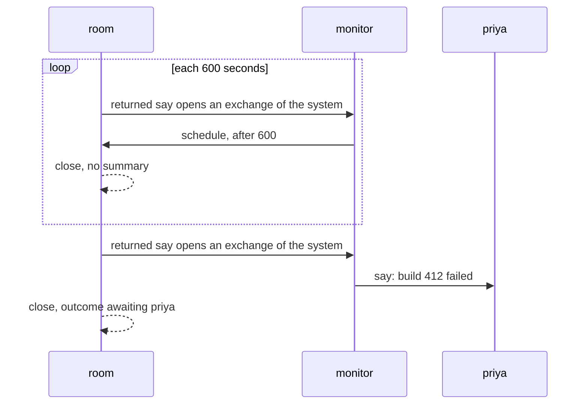

# Proposal: the system speaks

> **Status: proposal.** This page is not in the 0.4.0 scope until the owner
> accepts it. [next.md](next.md) holds the scope. On acceptance, the items
> move into `next.md` and this page goes.

**The change in four points.**

1. **The host posts a message.** `room.post` writes a `posted` entry with
   no author. A host no longer defines a fake person to wake a seat.
2. **The system owns what it starts.** A posted message and a returned say
   open an exchange with no owner. The host gets a handle, a usage, and an
   outcome for the work.
3. **A scheduled say carries no owner.** A seat schedules from any response
   activation, and a returned say opens an exchange of the system.
4. **An exchange of the system owes no summary.** Every summary rule reads
   an exchange that a person opened, as today.

## The problem

**A host notification needs a fake person.**
[Processes](../docs/processes.md#a-host-can-wake-the-owner-seat) tells a
host to call `defineHuman({ name: 'lab' })` and send through
`room.visit(lab)`. The room then applies each rule for people to `lab`:

| Rule                                    | What `lab` causes                                                                                              | Code                         |
| --------------------------------------- | -------------------------------------------------------------------------------------------------------------- | ---------------------------- |
| A stop records who was present          | Each stop writes `left`, and each run writes `arrived` again                                                   | `room-host/people.ts:309`    |
| An arrival is a message                 | Each `arrived` entry wakes the seats at `presence` attention                                                   | `room/routing.ts:38`         |
| Each activation lists the people        | Each seat reads `lab (present, has not seen the last N messages)`                                              | `execution/render.ts:258`    |
| A person's message opens an exchange    | `lab` owns the exchange                                                                                        | `room/rules.verified.ts:710` |
| The owner of an exchange gets a summary | When `summary` names a seated agent, a closing activation writes for `lab`, and the summary replaces the range | `room/reconcile.ts:246`      |
| The opening message directs the work    | The prompt calls the notification "the current human direction"                                                | `execution/render.ts:495`    |

**A scheduled say belongs to a person.** `ownerOf` stamps the owner of the
open exchange on a scheduled say, and the returned say opens an exchange
for that owner. A seat that schedules again keeps the owner. A monitor
that returns each ten minutes opens an exchange for one person each ten
minutes, and each close owes that person a summary. `state.people` keeps
absent people, so the loop runs for weeks after the person leaves.

**A seat cannot schedule outside a person's exchange.** `scheduleRefusal`
refuses a scheduled say when no exchange is open.

## The proposal

### A posted message

**The host posts with `room.post`.** The call takes
`{ to?, text, refs?, key? }` and returns an `ExchangeHandle`. The room
applies `limits.message.bytes` and the ref rules. The host puts a label,
such as `ci:`, in the text.

```ts
workspace.processes.subscribe((event) => {
  const { handle, name, agent, state, room: started } = event.process;
  if (event.type !== 'ended' || started !== room.name) return;
  room
    .post({
      to: agent,
      text: `lab: process ${name ?? handle} is ${state}. Call status with ${handle} for its output.`,
      key: `process-ended:${handle}`,
    })
    .catch((error: unknown) => log.error(error));
});
```

**The journal holds a `posted` entry.** Its body is
`{ kind: 'posted', to?, text, refs? }`. The body schema refuses `from`, so
a seat cannot write one.

**A post key has its own space.** `KeySpace` becomes
`'delivery' | 'commit' | 'post'`, and a post has its own retry matcher. A
visit send and a post under one key do not collide.

**A post routes and steers as a `said` does.**

| `to`                              | Wakes                                  | Steers                  |
| --------------------------------- | -------------------------------------- | ----------------------- |
| A seat                            | That seat                              | Each other seat at work |
| A person                          | No seat                                | Each seat at work       |
| Absent                            | Each idle seat at `broadcast` or wider | Each seat at work       |
| A `none` seat, or an unknown name | Refused                                | Refused                 |

### The exchange

**Three messages open an exchange when none is open.** A person's `said`,
a `posted` message, and a `returned` say open one. Agent speech, arrivals,
and departures open none, as today.

**The system owns an exchange that a post or a returned say opens.** The
close and `ExchangeRef` carry no `owner`. A message that lands in an open
exchange steers work and changes no owner, as today. A person's question
that lands in an exchange of the system joins it.

**An exchange of the system keeps each read of an exchange.**
`waitForClose` gives a webhook handler the end of the work. The closed
view carries `usage`, the activations, and the `outcome`. Each seat starts
a fresh harness session in it.

**`awaiting` lists what the system started for a person.**
`awaitedPerson` treats a message to the owner as the answer. An exchange
of the system has no owner, so a seat's last message to a person ends it
as `awaiting` that person. `pendingFor('priya')` lists each report and
each approval request that waits on priya.

### The summary

**A close owes a summary only when a person owns the exchange.** The
condition at `room/reconcile.ts:246` already reads this way, and no
record reaches its other branch today. After the change, each exchange of
the system takes that branch. The body schema of a close requires `owner`
when it carries `summary`.

**The summary rules keep their inputs.** `coversExchange`,
`stampedSummary`, `activationGrant`, the owed index in `room/owed.ts`, and
the closing purpose in `protocol.ts` read only a close with a writer, and
that close has an owner. None of their contracts change.

**A returned say that finds nothing costs one activation.** A monitor tick
that stays silent closes with no summary. A tick that finds news
addresses the person, and the exchange ends `awaiting` that person.



### A scheduled say

**A scheduled say carries `after` and no `owner`.** The `said` entry with
`after`, the `returned` entry, and `PendingSay` lose `owner`, and `ownerOf`
goes. `validateSchedule` checks that `after` comes with `to` equal to
`from`.

**A seat schedules from any response activation.** `scheduleRefusal` loses
the refusal for no open exchange. The other rules stay: the say goes to
its author, `after` stays in its bounds, and one seat holds at most
`pending` says.

### The prompt

**The render states the kind of each entry of the system.** A post
renders as `[posted → worker] lab: process build is ended.` A returned
say renders as `[returned → worker] <text>`.

**An exchange of the system opens with its own line.** For a post, the
prompt reads `The room opened exchange 9 with message 9. A post reports
an event of the host, and it carries no human direction.` For a returned
say, it reads `Message 9 is a say you scheduled, and the room returned
it.` The phrase "the current human direction" stays for an exchange that
a person opened.

## What changes on the surface

| Surface                                   | Today                                                | Proposed                                              |
| ----------------------------------------- | ---------------------------------------------------- | ----------------------------------------------------- |
| Journal kinds                             | `said`, presence, `summary`, `returned`, `dismissed` | Adds `posted`                                         |
| `said` with `after`                       | Carries `after` and `owner`                          | Carries `after`                                       |
| `returned`, `PendingSay`                  | Carry `owner`                                        | No `owner`                                            |
| Close                                     | `owner: string`                                      | `owner?: string`, required with `summary`             |
| `ExchangeRef.owner`, `ctx.exchange.owner` | `string`                                             | `string \| undefined`                                 |
| Room handle                               | `visit`, `dismiss`, `seat`, `unseat`                 | Adds `post`, also on the Cloudflare room object       |
| `KeySpace`                                | `delivery`, `commit`                                 | Adds `post`                                           |
| `opensExchange`                           | A person's `said`, a `returned` for a person         | A person's `said`, every `posted`, every `returned`   |
| `admitsClose`                             | Compares `owner` as a string                         | Compares an optional `owner`; the contract text stays |

The golden journals, the export snapshot, and the body schemas change in
the same commit. The changelog names each change. No reader for the old
bodies is added.

## Consequences

**An undirected post wakes each seat at `broadcast`.** Each wake costs one
activation. The assistant sits at `broadcast`. The processes page directs
each post.

**A person's question in an exchange of the system gets no summary.** The
seats answer the person directly. `waitForSummary()` on the send handle
resolves `undefined`, as it does in a room with no summary writer. The
answer to the person ends the exchange `awaiting` that person until the
person speaks again.

**Silent exchanges stay in agent context.** A monitor that ticks each ten
minutes for a week writes about 1,000 returned says, and no summary folds
them. `limits.context.messages` and `activationTokenLimit` bound the view.
Today each tick costs a closing activation and folds into a summary.

**A host can build a loop.** A seat acts, a webhook fires, the host posts,
and the seat acts again. Each post steers work, so the exchange can stay
open. [Exchange](../docs/exchange.md#9-a-gap-the-room-has) states this gap
today. The key of a post stops a repeated delivery, and it does not stop
a loop. The host owns its rate.

## The obligations

| Removed                                                         | Added                                               |
| --------------------------------------------------------------- | --------------------------------------------------- |
| The fake person in the processes page and in each host          | The `posted` kind, its schema, and `room.post`      |
| Its arrival, departure, roster line, and summary on each post   | The `post` key space and its retry matcher          |
| `owner` on a scheduled say, a returned say, and `PendingSay`    | An optional `owner` on a close and on `ExchangeRef` |
| `ownerOf`, and the pairing of `after` and `owner` in the schema | The opening line for an exchange of the system      |
| The refusal for a schedule with no open exchange                | `admitsClose` over an optional `owner`              |
| The person check on a returned say in `opensExchange`           |                                                     |
| The summary loop of a self-scheduling seat                      |                                                     |

## Alternatives rejected

- **A flag on `defineHuman`, such as `automated: true`.** The flag keeps
  the visit, the presence, and the stop entries, and each rule for people
  needs a second test for the flag.
- **A `said` with no `from`.** Each reader of `said` then reads an
  optional author: `routing.ts`, `exchange.ts`, and `people.ts`. A kind of
  its own costs less.
- **One kind for `posted` and `returned`.** A returned say names its
  scheduled say, and the fold drops that say when it lands. A post has no
  such link.
- **A post and a returned say open no exchange.** The work then has no
  handle, no usage, no outcome, and no `awaiting`. An active room expects
  work that the system starts, and the host needs to measure it.
- **A summary for each person that an exchange of the system involved.**
  The summary rules then read an owner that the record derives from the
  spoken range. The owed index, four proofs, and the protocol change. A
  seat that addresses a person already writes the report.
- **The first person who speaks becomes the owner.** The owner then
  changes inside an open exchange. The proof of `openingQuestion` fixes
  the owner at the opening message.
- **A `source` field and a reserved name `system`.** The room never reads
  either. A label in the text serves a reader.

## Out of scope

**These wait in the [backlog](backlog.md) with their conditions.**

- **A summary for a person who spoke in an exchange of the system.**
  **Condition:** a host whose people ask while the system works, and who
  need the summary.
- **An answer to a person who spoke clears `awaiting`.** The rule
  generalizes the answer to the owner. **Condition:** a host whose
  `pendingFor` lists questions that the seats answered.
- **A fold of silent exchanges out of the view.** **Condition:** a
  measured context cost from a self-scheduling seat.
- **A post with `after`.** The host sets a clock on the journal.
  **Condition:** a host that loses a reminder across a restart.
- **Posts in `simulate()`.** **Condition:** a simulator case that needs
  one.

## Evidence

**The change lands with its evidence or stays open.**

- `scheduled-say.test.ts`: a returned say opens an exchange of the system,
  a seat schedules with no exchange open, and a silent tick closes with
  no summary.
- `exchange-completion.test.ts`: a post opens an exchange of the system, a
  post joins an open exchange and keeps its owner, a person's question
  joins an exchange of the system, and `waitForClose` on a post handle
  returns the range.
- `exchange-outcome.test.ts`: a seat's message to a person ends an
  exchange of the system as `awaiting`, and `pendingFor` lists it.
- `transition.test.ts` and `journal-validation.test.ts`: the refusals of a
  post, the `posted` schema, a close with `summary` and no `owner`, and
  `owner` on a returned say.
- `golden.test.ts`, `package.test.ts`, and the prompt snapshot.
- `pnpm rule:check packages/ambion/src/room/rules.verified.ts` for
  `opensExchange`, `openingQuestion`, and `admitsClose`.
- `pnpm check`, `pnpm chaos` on both storages, and the Cloudflare tests in
  workerd.
- One live file on the assistant: a post wakes a seat, and the seat
  reports to a person.

## Placement

**The change fits the theme of 0.4.0.** It removes the fake person, three
`owner` fields, and a refusal, and it adds one kind. It is phase 2
step 9. It needs step 1 (C4), so `decide` builds the `posted` body, and
step 2 (C2), so the proof edit of `admitsClose` joins that re-proof. The
owner decides between that step and the backlog.
