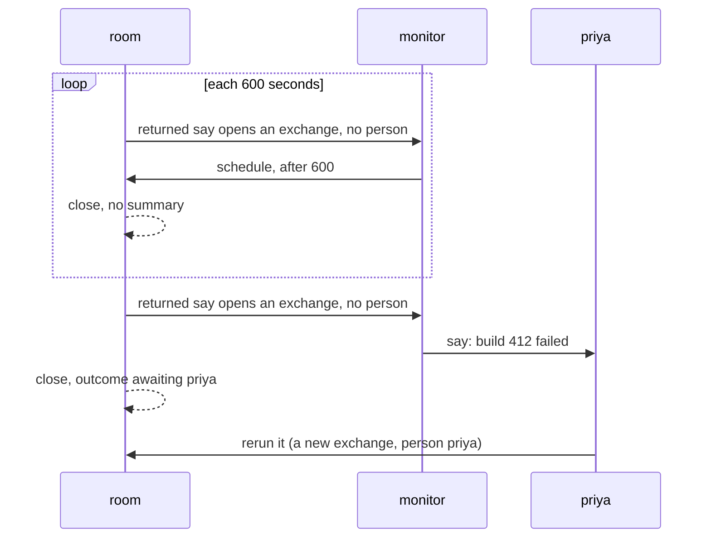

# Proposal: the system speaks

> **Status: proposal.** This page is not in the 0.4.0 scope until the owner
> accepts it. [next.md](next.md) holds the scope. On acceptance, the items
> move into `next.md` and this page goes.

**The change in four points.**

1. **The host posts a message.** `room.post` writes a `posted` entry with
   no author. A host no longer defines a fake person to wake a seat.
2. **A post and a returned say open an exchange.** The work that the system
   starts gets a handle, a usage, an outcome, and a range, as a person's
   question does.
3. **An exchange has no owner.** It has an opening message and a `person`:
   the first person who spoke in its range. The room derives `person`
   from the record. An exchange where no person spoke has none.
4. **A scheduled say carries no owner.** A seat schedules from any response
   activation.

## The problem

**A host notification needs a fake person.**
[Processes](../docs/processes.md#a-host-can-wake-the-owner-seat) tells a
host to call `defineHuman({ name: 'lab' })` and send through
`room.visit(lab)`. The room then applies each rule for people to `lab`:

| Rule                                    | What `lab` causes                                                                                              | Code                         |
| --------------------------------------- | -------------------------------------------------------------------------------------------------------------- | ---------------------------- |
| A stop records who was present          | Each stop writes `left`, and each run writes `arrived` again                                                   | `room-host/people.ts:309`    |
| An arrival is a message                 | Each `arrived` entry wakes the seats at `presence` attention                                                   | `room/routing.ts:38`         |
| Each activation lists the people        | Each seat reads `lab (present, has not seen the last N messages)`                                              | `execution/render.ts:258`    |
| A person's message opens an exchange    | `lab` owns the exchange                                                                                        | `room/rules.verified.ts:710` |
| The owner of an exchange gets a summary | When `summary` names a seated agent, a closing activation writes for `lab`, and the summary replaces the range | `room/reconcile.ts:246`      |
| The opening message directs the work    | The prompt calls the notification "the current human direction"                                                | `execution/render.ts:495`    |

**A scheduled say belongs to a person.** `ownerOf` stamps the owner of the
open exchange on a scheduled say, and the returned say opens an exchange
for that owner. A seat that schedules again keeps the owner. A monitor
that returns each ten minutes opens an exchange for one person each ten
minutes, and each close owes that person a summary. `state.people` keeps
absent people, so the loop runs for weeks after the person leaves.

**`owner` holds two facts.** Today the owner is the author of the opening
message. The kernel reads it as the person who directs the work, in the
prompt, and as the person who receives the result, in the summary and in
`awaiting`. For a person's question the two facts agree. For work that
the system starts, the first fact has no person, and the second fact has
a person only when one speaks.

## The proposal

### A posted message

**The host posts with `room.post`.** The call takes
`{ to?, text, refs?, key? }` and returns an `ExchangeHandle`. The room
applies `limits.message.bytes` and the ref rules. The host puts a label,
such as `ci:`, in the text.

```ts
workspace.processes.subscribe((event) => {
  const { handle, name, agent, state, room: started } = event.process;
  if (event.type !== 'ended' || started !== room.name) return;
  room
    .post({
      to: agent,
      text: `lab: process ${name ?? handle} is ${state}. Call status with ${handle} for its output.`,
      key: `process-ended:${handle}`,
    })
    .catch((error: unknown) => log.error(error));
});
```

**The journal holds a `posted` entry.** Its body is
`{ kind: 'posted', to?, text, refs? }`. The body schema refuses `from`, so
a seat cannot write one.

**A post key has its own space.** `KeySpace` becomes
`'delivery' | 'commit' | 'post'`, and a post has its own retry matcher. A
visit send and a post under one key do not collide.

**A post routes and steers as a `said` does.** `reachOf` and `targetOf` in
`room/routing.ts` get a `posted` case: `named` reach and the target `to`
when `to` is set, `broadcast` reach when it is absent. `messageDelivery`
steers a post with no change.

| `to`                              | Wakes                                  | Steers                  |
| --------------------------------- | -------------------------------------- | ----------------------- |
| A seat                            | That seat                              | Each other seat at work |
| A person                          | No seat                                | Each seat at work       |
| Absent                            | Each idle seat at `broadcast` or wider | Each seat at work       |
| A `none` seat, or an unknown name | Refused                                | Refused                 |

### The exchange

**Three messages open an exchange when none is open.** A person's `said`,
a `posted` message, and a `returned` say open one. Agent speech, arrivals,
and departures open none, as today. A message that lands in an open
exchange steers work, as today.

**`from` identifies an exchange.** `ExchangeRef` is `{ from, at, person? }`.
`admitsClose` compares `from` and loses its `owner` clause.
`room.exchange(from)` and `handleForMessage` in `room-host/waits.ts`
accept a `posted` opening. The `tail` of the projection holds `posted`
entries, and `exchangeOf` in `room/projection.ts` recomputes the open
exchange on one.

**`person` is the first person who spoke in the range.** `exchangeAfter`
derives it from the tail: the first `said` of a person at or after
`from`. `closing()` copies it from the open exchange beside `through` and
`summary`, and derives nothing. For a person's question, `person` is the
author of the opening message, as the owner is today. For work that the
system starts, `person` is absent until a person speaks in the range.

**A handle holds `person` as it was when the handle was made.** `handleFor`
copies its fields once, so a handle from `room.post` reads no `person`
after priya joins. The close and the exchange view hold the final value,
and `waitForSummary` reads the close.

**Each fact of `owner` gets its own derivation.** The opening message
names who directs the work. `person` names who receives the result.

| Reader                 | Reads               | Rule                                                               | Code                           |
| ---------------------- | ------------------- | ------------------------------------------------------------------ | ------------------------------ |
| The prompt             | The opening message | The opening line states who or what opened the exchange            | `execution/render.ts:495`      |
| `awaiting`             | The opening message | A message to the author of the opening message is the answer       | `awaitedPerson`, `exchange.ts` |
| The summary assignment | `person`            | A close with a `person` and a seated writer owes a summary         | `room/reconcile.ts:246`        |
| The summary recipients | `person`            | The people who spoke in the range, in order; `person` is the first | `recipientsOf`, `exchange.ts`  |
| A tool's context       | `person`            | `ctx.exchange.person`, such as the approver of an instrument       | `execution/room-tools.ts`      |
| `waitForSummary`       | `person`            | The summary for `person`, or `undefined` with no `person`          | `room-host/waits.ts`           |

For a person's question, the author of the opening message and `person`
are the same person, so each rule reads as today. `awaiting` reads the
opening message, and the opening message of a post or a returned say has
no `from`. `awaitedPerson` thus keeps its body and finds no answer in
work that the system starts, with no case for the system.

**The summary rules keep their contracts.** `closeMatches` requires a
writer, and a close with `summary` requires `person`, so `coversExchange`,
`stampedSummary`, `activationGrant`, the owed index, and the closing
purpose in `protocol.ts` read a close with a person. `Close` becomes a
union: `{ summary: string; person: string }` or
`{ summary?: undefined; person?: string }`. A test of `summary` narrows
`person`. `OwedClose` in `room/owed.ts` becomes the explicit shape
`{ summary: string; person: string; from; through }`, because a `Pick`
over the union loses that narrowing.

**A cancellation close carries the `person` of the open exchange.**
`cancelledClose` in `room/fold.ts` copies it, so the closed view names the
same person as its opening message. The close names no writer, so it owes
no summary.

### What the work of the system reads

**Each read of an exchange holds for work that the system starts.**
`waitForClose` gives a webhook handler the end of the work. The closed
view carries `usage`, the activations, and the `outcome`. Each seat starts
a fresh harness session in it.

**`awaiting` lists what the system started for a person.** A post or a
returned say has no author, so an exchange of the system has no answer. A
seat's last message to a person ends it as `awaiting` that person, until
the person speaks. `pendingFor('priya')` lists each report and
each approval request that waits on priya.

**A person who speaks in an exchange of the system becomes its `person`.**
The person gets the summary. A seat's answer to the person ends the
exchange as `awaiting` that person, until the person speaks again. An
approver who asks a question back thus stays in `pendingFor` while the
approval waits.



### A scheduled say

**A scheduled say carries `after` and no `owner`.** The `said` entry with
`after`, the `returned` entry, and `PendingSay` lose `owner`, and `ownerOf`
goes. `validateSchedule` checks that `after` comes with `to` equal to
`from`.

**A seat schedules from any response activation.** `scheduleRefusal` loses
the refusal for no open exchange. The other rules stay: the say goes to
its author, `after` stays in its bounds, and one seat holds at most
`pending` says.

### The prompt

**The render states the kind of each entry of the system.** A post
renders as `[posted → worker] lab: process build is ended.` A returned
say renders as `[returned → worker] <text>`.

**The opening line reads the opening message.**

| Opening message | Line                                                                                         |
| --------------- | -------------------------------------------------------------------------------------------- |
| A person's say  | `priya opened exchange 4 with message 4. The marked request is the current human direction.` |
| A post          | `The host opened exchange 9 with message 9. A post reports an event and gives no direction.` |
| A returned say  | `Message 9 is a say you scheduled, and the room returned it.`                                |

## What changes on the surface

| Surface                           | Today                                                | Proposed                                            |
| --------------------------------- | ---------------------------------------------------- | --------------------------------------------------- |
| Journal kinds                     | `said`, presence, `summary`, `returned`, `dismissed` | Adds `posted`                                       |
| `said` with `after`               | Carries `after` and `owner`                          | Carries `after`                                     |
| `returned`, `PendingSay`          | Carry `owner`                                        | No `owner`                                          |
| Close                             | `owner: string`                                      | `person?: string`, required with `summary`          |
| `ExchangeRef`, `ExchangeHandle`   | `owner: string`                                      | `person?: string`                                   |
| `ctx.exchange`, the seat protocol | `owner: string`                                      | `person?: string`                                   |
| Room handle                       | `visit`, `dismiss`, `seat`, `unseat`                 | Adds `post`, also on the Cloudflare room object     |
| `KeySpace`                        | `delivery`, `commit`                                 | Adds `post`                                         |
| `opensExchange`                   | A person's `said`, a `returned` for a person         | A person's `said`, every `posted`, every `returned` |
| `admitsClose`                     | Compares `from` and `owner`                          | Compares `from`                                     |
| `//@ declare-type Message`        | Holds `owner`                                        | No `owner`                                          |

The golden journals, the export snapshot, and the body schemas change in
the same commit. The changelog names each change. No reader for the old
bodies is added. [Exchange](../docs/exchange.md) §3, §4, and §6,
[Summaries](../docs/summary.md), [Trust](../docs/trust.md),
[Processes](../docs/processes.md), and the glossary in
[The room](../docs/room.md) change with it. The Workbench changes at five
readers of `owner`: the instrument reads `ctx.exchange.person` and refuses
an operation when no person spoke, `approvals.ts` renames its
`exchange_owner` column, and `timeline.ts`, `transcript.ts`, and
`session-text.ts` read the opening message or drop the name.

## Consequences

**An undirected post wakes each seat at `broadcast`.** Each wake costs one
activation. The assistant sits at `broadcast`. The processes page directs
each post.

**Silent exchanges stay in agent context.** A monitor that ticks each ten
minutes for a week writes about 1,000 returned says, and no summary folds
them. `limits.context.messages` and `activationTokenLimit` bound the view.
Today each tick costs a closing activation and folds into a summary.

**A host can build a loop.** A seat acts, a webhook fires, the host posts,
and the seat acts again. Each post steers work, so the exchange can stay
open. [Exchange](../docs/exchange.md#9-a-gap-the-room-has) states this gap
today. The key of a post stops a repeated delivery, and it does not stop
a loop.

**A host that shows who asked reads the opening message.** `person` names
the person that the result goes to. The author of message `from` names
who started the work, when a person did.

## The obligations

| Removed                                                         | Added                                           |
| --------------------------------------------------------------- | ----------------------------------------------- |
| The fake person in the processes page and in each host          | The `posted` kind, its schema, and `room.post`  |
| Its arrival, departure, roster line, and summary on each post   | The `post` key space and its retry matcher      |
| `owner` on a scheduled say, a returned say, and `PendingSay`    | The `posted` cases in `reachOf` and `targetOf`  |
| `ownerOf`, and the pairing of `after` and `owner` in the schema | The first speaker in `exchangeAfter`            |
| The refusal for a schedule with no open exchange                | The `Close` union                               |
| The `owner` clause of `admitsClose`                             | The opening lines for a post and a returned say |
| The person check on a returned say in `opensExchange`           |                                                 |
| The summary loop of a self-scheduling seat                      |                                                 |

**The field count stays the same, and its meaning narrows.** `owner`
becomes `person`, derived from the spoken record. The opening message
holds the other fact. No rule needs a case for work that the system
starts.

## Alternatives rejected

- **An optional `owner`, and the system owns what it starts.** A person
  who speaks in an exchange of the system then gets no summary, and an
  answer to that person reads `awaiting`. Each doc that reads the owner
  needs a sentence for the system.
- **A post and a returned say open no exchange.** The work then has no
  handle, no usage, no outcome, and no `awaiting`, so a host cannot
  measure it.
- **A message to `person`, or to any person who spoke, is an answer.** In
  an exchange of the system, an approver who asks a question back becomes
  `person`, and the next request for the approval then reads `complete`.
  The rule of the opening author keeps the behavior of today. Today an
  owner who asks back loses `awaiting` in the same way, so the rule
  protects no approval that today does not protect.
- **A summary for each person that a seat addressed.** A seat that
  addresses a person already writes the report, and each addressed person
  adds a closing say.
- **A flag on `defineHuman`, such as `automated: true`.** The flag keeps
  the visit, the presence, and the stop entries, and each rule for people
  needs a second test for the flag.
- **A `said` with no `from`.** Each reader of `said` then reads an
  optional author: `routing.ts`, `exchange.ts`, and `people.ts`.
- **One kind for `posted` and `returned`.** A returned say names its
  scheduled say, and the fold drops that say when it lands. A post has no
  such link.
- **A `source` field and a reserved name `system`.** The room never reads
  either. A label in the text serves a reader.

## Unattended work

**The design makes unattended work the ordinary case.** A monitor tick, a
webhook reaction, and a person's question are each one exchange with a
range, a usage, the activations, and an outcome. An exchange with no
`person` follows the same rules with an empty set of recipients. A seat
carries its work across ticks in the text and refs of its scheduled say,
and `recall` reads the record behind the view. A seat that needs a
decision addresses a person, and `pendingFor` shows the request.

**Two mechanisms come next.** Each waits in the [backlog](backlog.md) with
its condition. This change leaves room for both.

1. **A hard bound on an exchange.** Nothing bounds a loop of posts or the
   usage of one exchange today. `limits.exchange` bounds the activations or
   the usage, the room writes the close, and `exchangeOutcome` gets a
   terminal outcome beside `exhausted`. **Condition:** a host that must
   cap the spend of one exchange.
2. **Compaction with no person.** A summary goes to a person, so a monitor
   that never reports never folds. The first step is a render rule: a
   closed exchange with no spoken message shows as one line, and `recall`
   still reads it. A later step lets a seat write a summary over its own
   range. **Condition:** a measured context cost from a self-scheduling
   seat.

## Out of scope

**These wait in the [backlog](backlog.md) with their conditions.**

- **A post with `after`.** The host sets a clock on the journal.
  **Condition:** a host that loses a reminder across a restart.
- **Posts in `simulate()`.** **Condition:** a simulator case that needs
  one.

## Evidence

**The change lands with its evidence or stays open.**

- `scheduled-say.test.ts`: a returned say opens an exchange with no
  `person`, a seat schedules with no exchange open, and a silent tick
  closes with no summary.
- `exchange-completion.test.ts`: a post opens an exchange, a post joins an
  open exchange, a person who speaks in an exchange of the system becomes
  its `person` and gets the summary, `waitForClose` on a post handle
  returns the range, and `room.exchange(from)` finds the exchange of a
  post after a restart.
- `exchange-outcome.test.ts`: a message of a seat to a person ends an
  exchange of the system as `awaiting`, `pendingFor` lists it, and an
  approver who asks back in an exchange of the system still reads
  `awaiting`.
- `summary.test.ts`: the first recipient of each closing activation equals
  the `person` of its close.
- `cancellation.test.ts`: a cancelled exchange of a person keeps its
  `person`.
- `routing` cases: a directed post wakes its target, and an undirected post
  wakes each seat at `broadcast`.
- `transition.test.ts` and `journal-validation.test.ts`: the refusals of a
  post, the `posted` schema, a close with `summary` and no `person`, and
  `owner` on a returned say.
- `golden.test.ts`, `package.test.ts`, the prompt snapshot, and the
  simulator render.
- `pnpm rule:check packages/ambion/src/room/rules.verified.ts` for
  `opensExchange`, `openingQuestion`, `admitsClose`, and the hand proofs in
  `rules.verified.proofs.dfy`.
- `pnpm check`, `pnpm chaos` on both storages, and the Cloudflare tests in
  workerd.
- One live file on the assistant: a post wakes a seat, and the seat
  reports to a person.

## Placement

**The change fits the theme of 0.4.0.** It removes the fake person, three
`owner` fields, a refusal, and a proof clause, and it adds one kind. It is
phase 2 step 9. It needs step 1 (C4), so `decide` builds the `posted`
body, and step 2 (C2), so the proof edits join that re-proof. The owner
decides between that step and the backlog.
