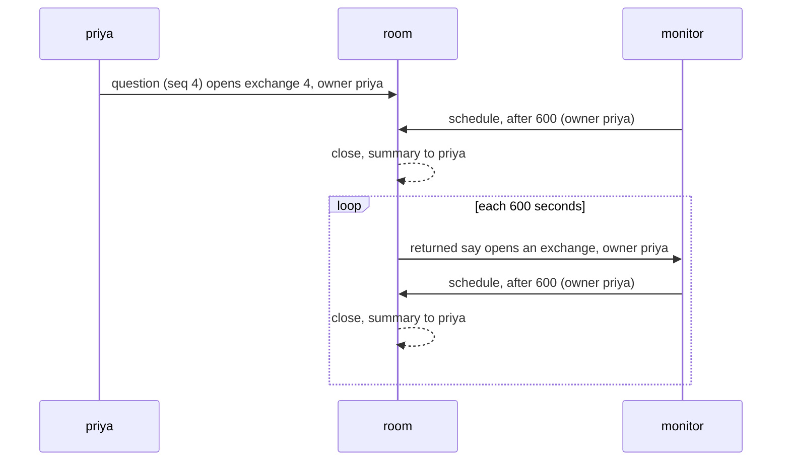

# Proposal: the system speaks

> **Status: proposal.** This page is not in the 0.4.0 scope until the owner
> accepts it. [next.md](next.md) holds the scope. On acceptance, the items
> move into `next.md` and this page goes.

**The change in four points.**

1. **The system is the author of every message that the room's clock or the
   host writes.** It has no seat and no visit. It already writes returned
   says, host seatings, and host dismissals, with no `from`.
2. **The host posts a message as the system.** `room.post` writes a
   `posted` entry. A host no longer defines a fake person to wake a seat.
3. **The system owns the exchange that its message opens.** A posted
   message and a returned say open an exchange with no owner.
4. **A summary goes to the people that the exchange involved.** These are
   the owner, each person who spoke, and each person that a seat
   addressed.

## The problem

**A host notification needs a fake person.**
[Processes](../docs/processes.md#a-host-can-wake-the-owner-seat) tells a
host to call `defineHuman({ name: 'lab' })` and send through
`room.visit(lab)`. The room then treats `lab` as a person in every rule:

| Rule that reads people                  | What `lab` causes                                                                           | Code                         |
| --------------------------------------- | ------------------------------------------------------------------------------------------- | ---------------------------- |
| An arrival is a message                 | An `arrived` entry wakes each seat at `presence` attention                                  | `room-host/people.ts`        |
| A stop records who was present          | Each stop writes `left`, and each run writes `arrived` again                                | `room-host/people.ts:313`    |
| The people list of each activation      | Each seat reads `lab (present, has not seen the last N messages)`                           | `execution/render.ts:258`    |
| A person's message opens an exchange    | `lab` owns the exchange                                                                     | `room/rules.verified.ts:710` |
| The owner of an exchange gets a summary | A closing activation writes a summary for `lab`, and it replaces the range in agent context | `room/reconcile.ts:246`      |
| The opening message is human direction  | The prompt states that the notification is "the current human direction"                    | `execution/render.ts:495`    |

**A scheduled say belongs to a person.** The room stamps the owner of the
open exchange on a scheduled say, and the returned say opens an exchange
for that owner. A seat that schedules again from a returned say keeps the
same owner. A monitor that returns each ten minutes thus opens an exchange
for one person each ten minutes. Each close assigns a closing activation
and a summary to that person, who can be absent for weeks.
`state.people` keeps absent people, so nothing stops the loop.



**A seat cannot schedule outside a person's exchange.** `scheduleRefusal`
refuses a scheduled say when no exchange is open, because no person owns
the work.

**The record already holds the system.** A returned say, a host seating,
and a host dismissal carry no `from`. The `ReturnedMessage` type states
that the room wrote it and that the room is not a participant. The
condition at `room/reconcile.ts:246` assigns a summary only when the owner
is a person, and no record today makes it false. The system writes to the
record. It cannot speak, and it cannot own work.

## The proposal

### The system

**The system is the room's clock and its host.** It writes the `returned`
entries of the clock and the `posted`, seating, and dismissal entries of
the host. An entry of the system has no `from`. The system has no seat, no
visit, no presence, and no identity on the roster. A seat cannot address
it, because it has no name on the record.

**The render names it `system`.** `defineAgent` and `defineHuman` refuse
the name `system`, so no participant reads as the system.

### A posted message

**The host posts with `room.post`.** The call takes
`{ to?, text, refs?, key?, source? }` and returns an `ExchangeHandle`.
`key` is the delivery key of a visit send, with the same retry rule.
`source` is a short label that the host chooses, such as `ci` or `lab`.
The room stores `source` and never reads it.

```ts
workspace.processes.subscribe((event) => {
  const { handle, name, agent, state, room: started } = event.process;
  if (event.type !== 'ended' || started !== room.name) return;
  room
    .post({
      to: agent,
      source: 'lab',
      text: `Process ${name ?? handle} is ${state}. Call status with ${handle} for its output.`,
      key: `process-ended:${handle}`,
    })
    .catch((error: unknown) => log.error(error));
});
```

**The journal holds the post as a `posted` entry.**
`{ kind: 'posted', to?, text, refs?, source? }`, with no `from`. The room
applies the limits of a message: `limits.message.bytes` and the ref rules.

**A post routes by its `to`.**

| `to`                              | Reach       | Wakes                                  | Steers            |
| --------------------------------- | ----------- | -------------------------------------- | ----------------- |
| A seat                            | `named`     | That seat                              | That seat         |
| A person                          | `named`     | No seat                                | No seat           |
| Absent                            | `broadcast` | Each idle seat at `broadcast` or wider | Each seat at work |
| A `none` seat, or an unknown name | Refused     |                                        |                   |

A directed post steers its target alone, as a returned say does. The
record shows the post to every seat at its next activation. A post to a
person wakes no seat, so its exchange closes at the next reconcile with no
summary. The person reads the post at catch-up.

### The exchange

**Three messages open an exchange when none is open.** A person's `said`,
a `posted` message, and a `returned` say open one. Agent speech, arrivals,
and departures open none, as today.

**The system owns an exchange that a post or a returned say opens.** The
close and `ExchangeRef` carry no `owner`. A message that lands in an open
exchange steers work and changes no owner, as today. A person's question
that lands in an exchange of the system joins it.

**A scheduled say carries no owner.** The `said` entry with `after` and the
`returned` entry lose `owner`. The render derives the exchange that held
the scheduled say from the closes, and states it on the opening line:
`Message 9 is a say you scheduled in exchange 4 of priya.`

**A seat schedules from any response activation.** `scheduleRefusal` loses
the refusal for no open exchange. The other rules stay: the say goes to
its author, `after` stays in its bounds, and one seat holds at most
`pending` says.

### The summary

**One rule names the recipients of every closed exchange.** The recipients
are the owner when the owner is a person, then each person who spoke in
the range, then each person that a seat addressed in the range, in the
order of the record. `recipientsOf` in `room/exchange.ts` holds the rule.

**A close assigns a summary when it has a recipient.** An exchange of the
system with no recipient assigns no closing activation. A silent monitor
tick thus costs one activation and no summary.

**The summary of the first recipient completes the assignment.** When the
owner is a person, the owner is the first recipient, as today.

**`waitForSummary` takes a person.** `waitForSummary(person?)` resolves
the summary for that person. A handle from `visit.send` defaults to the
sender. A handle from `room.exchange` defaults to the owner. A handle from
`room.post` has no default and resolves `undefined` with no person.

### The prompt

**The render marks each entry of the system.** A post renders as
`[system/lab → worker] Process build is ended.` The guidance states one
rule: a message of the system reports an event, and it carries no human
direction. An exchange of the system opens with
`The system opened exchange 9 with message 9.` The phrase "the current
human direction" stays for an exchange that a person opened.

**The assistant guidance adds one sentence.** A posted message reports an
event: route it to the seat whose work it concerns, and address a person
only when the event changes their work.

## What changes on the surface

| Surface             | Today                                                             | Proposed                                             |
| ------------------- | ----------------------------------------------------------------- | ---------------------------------------------------- |
| Journal kinds       | `said`, presence, `summary`, `returned`, `dismissed`              | Adds `posted`                                        |
| `said` with `after` | Carries `after` and `owner`                                       | Carries `after`                                      |
| `returned`          | Carries `owner`                                                   | No `owner`                                           |
| Close               | `owner: string`                                                   | `owner?: string`                                     |
| `ExchangeRef.owner` | `string`                                                          | `string \| undefined`                                |
| `PendingSay.owner`  | `string`                                                          | Removed                                              |
| Room handle         | `visit`, `dismiss`, `seat`, `unseat`                              | Adds `post`                                          |
| `ExchangeHandle`    | `waitForSummary()`                                                | `waitForSummary(person?)`                            |
| Names               | Any                                                               | `system` refused                                     |
| Verified rules      | `opensExchange` reads `people.includes(owner)` for a returned say | `opensExchange` admits `posted` and every `returned` |

The golden journals, the export snapshot, and the body schemas change in
the same commit. The changelog names each change. No reader for the old
bodies is added.

## Consequences

**`awaiting` becomes the inbox of a person.** An exchange of the system has
no owner, so each message of a seat to a person can end it as `awaiting`.
A monitor that tells priya that a build failed leaves the exchange
`awaiting` priya until she speaks. `pendingFor('priya')` lists every such
exchange. The kernel does not tell a question from a report, as today.

**A person's question can join an exchange of the system.** The person
becomes a recipient and gets a summary. `waitForSummary()` on the send
handle resolves that summary. The person does not become the owner.

**An undirected post costs one activation for each seat at `broadcast`.**
The assistant is at `broadcast`. The processes page directs each post.

**A host can build a loop.** A seat acts, a webhook fires, the host posts,
and the seat acts again. Each post steers work, so the exchange can stay
open. [Exchange](../docs/exchange.md#9-a-gap-the-room-has) states the gap
today. The key of each post stops a repeated delivery, and it does not
stop a loop. The host owns its rate.

**Silent exchanges stay in agent context.** A monitor that ticks each ten
minutes for a week writes about 1,000 returned says, and no summary folds
them. `limits.context.messages` and `activationTokenLimit` bound the view.
Today each tick costs a closing activation and folds into a summary.

## The obligations it removes

| Removed                                                               | Added                                      |
| --------------------------------------------------------------------- | ------------------------------------------ |
| The fake person in the processes page and in each host                | The `posted` kind and `room.post`          |
| Its arrival, departure, roster line, and summary on each notification | The render label and one guidance sentence |
| `owner` on a scheduled say, on a returned say, and on `PendingSay`    | An optional `owner` on a close             |
| The refusal for a schedule with no open exchange                      | The addressed people in `recipientsOf`     |
| The summary loop of a self-scheduling seat                            | The person argument of `waitForSummary`    |
| The person check on the owner of a returned say in `opensExchange`    | The reserved name `system`                 |
| A branch in `reconcile.ts` that no record reaches                     |                                            |

## Alternatives rejected

- **A flag on `defineHuman`, such as `automated: true`.** The flag keeps
  the visit, the presence, and the stop entries, and each rule that reads
  people needs a second test for the flag.
- **Named system participants through a `defineSystem`.** Names need a
  registry, a composition entry, and a namespace. The `source` label gives
  the render the same name and adds no rule.
- **One kind for `posted` and `returned`.** A returned say holds the text
  of a seat, and a post holds the text of the host. The render and the
  trust table state each one differently, so each keeps its kind.
- **The first person who speaks becomes the owner.** The owner then
  changes inside an open exchange. The fold and the proof of
  `openingQuestion` fix the owner at the opening message.
- **A returned say keeps the owner of the exchange that scheduled it.** The
  summary loop stays. The seat addresses the person when it has news,
  and the recipient rule then gives that person a summary.

## Out of scope

**These wait in the [backlog](backlog.md) with their conditions.**

- **A post with `after`.** The host sets a clock on the journal, and the
  room posts when it is due. **Condition:** a host that loses a reminder
  across a restart.
- **A fold of silent exchanges out of the view.** A closed exchange of the
  system with no spoken message leaves the view, and `recall` still reads
  it. **Condition:** a measured context cost from a self-scheduling seat.
- **Posts in `simulate()`.** A scenario posts an event during an exchange.
  **Condition:** a simulator case that needs one.

## Evidence

**The change lands with its evidence or stays open.**

- `scheduled-say.test.ts`: a returned say opens an exchange with no owner,
  a seat schedules with no open exchange, and a silent tick assigns no
  summary.
- `exchange-completion.test.ts`: a post opens an exchange of the system, a
  post joins an open exchange and keeps its owner, and a person's question
  joins an exchange of the system.
- `summary.test.ts`: the recipients include each addressed person, and the
  first recipient completes the assignment.
- `exchange-outcome.test.ts`: a message of a seat to a person ends an
  exchange of the system as `awaiting`.
- `transition.test.ts` and `journal-validation.test.ts`: the refusals of a
  post, the schema of `posted`, and the refusal of `owner` on a returned
  say.
- `golden.test.ts` and `package.test.ts`: the new bodies and exports.
- `pnpm rule:check packages/ambion/src/room/rules.verified.ts` for
  `opensExchange` and `openingQuestion`.
- `pnpm check`, `pnpm chaos` on both storages, and the Cloudflare tests in
  workerd.
- One live file on the assistant: a post opens an exchange, the assistant
  routes it, and the specialist addresses the person.

## Placement

**The change fits the theme of 0.4.0.** It removes a second path to a
notification and three `owner` fields, and it adds one kind. It needs
[C4](next.md#the-items): `decide` then builds the `posted` body beside the
others. The proposal is phase 2 step 9, after step 1. The owner decides
between that step and the backlog.
